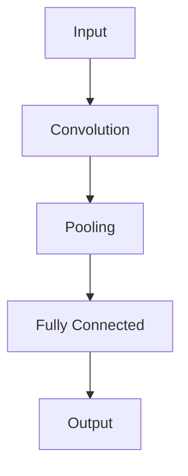

                 

### 从零开始大模型开发与微调：CIFAR-10数据集简介

#### 关键词 Keywords:
- 大模型开发
- 微调（Fine-tuning）
- CIFAR-10数据集
- 图像识别
- 机器学习

#### 摘要 Abstract:
本文旨在从零开始介绍如何开发与微调大型机器学习模型，特别是以CIFAR-10数据集为例，展示其应用过程。文章首先介绍了CIFAR-10数据集的基本情况，然后深入探讨了模型开发与微调的步骤和关键概念，接着通过数学模型和实际代码实例，详细讲解了整个流程。最后，文章总结了模型在实际应用中的场景，并推荐了相关工具和资源，以及展望了未来发展趋势与挑战。

---

## 1. 背景介绍

在现代机器学习领域，随着计算能力的提升和海量数据的积累，大规模机器学习模型（Large-scale Machine Learning Models）的开发与应用变得愈发重要。这些模型能够处理复杂的任务，如自然语言处理、图像识别、推荐系统等，并取得了显著的性能提升。然而，大规模模型的开发与微调（Fine-tuning）并不是一个简单的任务，需要深入的算法理解、大量的计算资源以及合理的资源管理。

CIFAR-10（Canadian Institute for Advanced Research Licence-10）是一个常用的图像识别数据集，包含10个类别，共计60000张32x32彩色图像。它由6000张训练图像和10000张测试图像组成，类别包括飞机、汽车、鸟、猫、鹿、狗、青蛙、马、船和卡车。CIFAR-10数据集由于其规模适中、标签清晰且易于获取，经常被用作评估机器学习模型性能的标准基准。

本文将围绕CIFAR-10数据集，详细介绍如何从零开始开发与微调大规模图像识别模型。我们将分步骤讲解模型的构建、训练、评估和优化过程，帮助读者全面理解大规模机器学习模型开发的各个方面。

### 2. 核心概念与联系

在开始模型开发之前，我们需要明确几个核心概念和它们之间的联系。

#### 2.1. 机器学习模型

机器学习模型是指通过训练数据学习到的，能够对未知数据进行预测或分类的算法。常见的机器学习模型有线性回归、逻辑回归、决策树、随机森林、神经网络等。在本文中，我们将重点关注神经网络模型，特别是卷积神经网络（Convolutional Neural Network, CNN）。

#### 2.2. 大规模模型

大规模模型是指参数数量较多、训练数据规模较大的机器学习模型。大规模模型能够处理复杂的任务，但需要更多的计算资源和时间进行训练。

#### 2.3. 微调

微调是指在一个已经训练好的模型基础上，使用新的数据对其进行训练，使其能够适应新的任务或数据集。微调是一种快速且有效的方法，可以在不从头开始训练的情况下，提高模型的性能。

#### 2.4. CIFAR-10数据集

CIFAR-10数据集是一个标准化的图像识别数据集，它包含了10个类别，每个类别有6000张训练图像和10000张测试图像。这个数据集的特点是图像尺寸固定（32x32），类别标签清晰，非常适合作为评估图像识别模型性能的基准。

#### 2.5. 模型架构

一个典型的CNN模型通常包括以下几个部分：卷积层（Convolutional Layer）、池化层（Pooling Layer）、全连接层（Fully Connected Layer）和输出层（Output Layer）。每个部分都有其特定的功能和作用，共同构成了一个完整的CNN模型。

以下是一个简化的CNN模型架构的Mermaid流程图：



在上述流程图中，输入层（A）接收图像数据，通过卷积层（B）进行特征提取，然后通过池化层（C）进行特征降维，最后通过全连接层（D）将特征映射到输出层（E），得到预测结果。

### 3. 核心算法原理 & 具体操作步骤

在了解了核心概念和模型架构后，我们接下来将详细讲解大规模图像识别模型的核心算法原理和具体操作步骤。

#### 3.1. 卷积层

卷积层是CNN模型的核心部分，它通过卷积操作提取图像的特征。卷积操作的基本思想是使用一个小型的卷积核（也称为过滤器或特征检测器）在图像上滑动，每次滑动都会产生一个特征图（Feature Map）。特征图包含了图像中对应位置的特征信息。

卷积操作的数学公式如下：

$$
\text{特征图} = \text{卷积核} \circledast \text{输入图像}
$$

其中，“$\circledast$”表示卷积操作。

#### 3.2. 池化层

池化层的作用是降低特征图的维度，减少模型的参数数量，从而提高模型的计算效率和防止过拟合。常见的池化方法有最大池化（Max Pooling）和平均池化（Average Pooling）。

最大池化的公式如下：

$$
p_{ij} = \max(k_{ij})
$$

其中，$p_{ij}$是特征图上的一个元素，$k_{ij}$是该元素所在邻域内的所有元素。

#### 3.3. 全连接层

全连接层将前一层提取的特征映射到输出层，通过逐元素相乘和求和，将特征转换为预测结果。全连接层的数学公式如下：

$$
\text{输出} = \text{权重} \cdot \text{特征} + \text{偏置}
$$

#### 3.4. 损失函数与优化算法

在模型训练过程中，我们需要使用损失函数（Loss Function）来衡量模型预测结果与真实标签之间的差距。常用的损失函数有均方误差（MSE）、交叉熵（Cross Entropy）等。

均方误差的公式如下：

$$
\text{MSE} = \frac{1}{n}\sum_{i=1}^{n}(\hat{y}_i - y_i)^2
$$

其中，$\hat{y}_i$是模型对样本$i$的预测结果，$y_i$是真实标签。

为了最小化损失函数，我们通常使用优化算法，如随机梯度下降（SGD）、Adam等。优化算法的基本思想是迭代更新模型的参数，使得损失函数逐渐减小。

#### 3.5. 训练与评估

训练过程包括以下几个步骤：

1. 初始化模型参数
2. 前向传播：根据当前模型参数，计算预测结果
3. 计算损失函数
4. 反向传播：根据损失函数的梯度，更新模型参数
5. 重复步骤2-4，直到满足停止条件（如损失函数收敛或达到最大迭代次数）

评估过程通常包括以下几个步骤：

1. 将训练数据集划分为训练集和验证集
2. 使用验证集评估模型性能
3. 调整模型参数或结构，以提高性能
4. 在测试集上评估模型性能，以衡量最终效果

### 4. 数学模型和公式 & 详细讲解 & 举例说明

在了解了核心算法原理后，我们接下来将详细讲解相关的数学模型和公式，并通过具体例子来说明这些公式的应用。

#### 4.1. 卷积层

卷积层的数学公式如下：

$$
\text{特征图} = \text{卷积核} \circledast \text{输入图像}
$$

其中，卷积核是一个矩阵，输入图像也是一个矩阵。卷积操作的目的是将卷积核中的每个元素与输入图像中的对应元素相乘，然后将所有乘积相加，得到特征图上的一个元素。

例如，假设卷积核为：

$$
K = \begin{bmatrix}
1 & -1 \\
2 & -2
\end{bmatrix}
$$

输入图像为：

$$
I = \begin{bmatrix}
1 & 2 & 3 \\
4 & 5 & 6 \\
7 & 8 & 9
\end{bmatrix}
$$

则卷积结果为：

$$
F = \begin{bmatrix}
1 \cdot 1 + 2 \cdot 4 + 3 \cdot 7 & -1 \cdot 1 - 2 \cdot 4 - 3 \cdot 7 \\
1 \cdot 2 + 2 \cdot 5 + 3 \cdot 8 & -1 \cdot 2 - 2 \cdot 5 - 3 \cdot 8 \\
1 \cdot 3 + 2 \cdot 6 + 3 \cdot 9 & -1 \cdot 3 - 2 \cdot 6 - 3 \cdot 9
\end{bmatrix}
=
\begin{bmatrix}
14 & -20 \\
19 & -26 \\
24 & -32
\end{bmatrix}
$$

#### 4.2. 池化层

池化层的数学公式如下：

$$
p_{ij} = \max(k_{ij})
$$

其中，$p_{ij}$是特征图上的一个元素，$k_{ij}$是该元素所在邻域内的所有元素。

例如，假设特征图为：

$$
F = \begin{bmatrix}
1 & 2 & 3 \\
4 & 5 & 6 \\
7 & 8 & 9
\end{bmatrix}
$$

则最大池化结果为：

$$
P = \begin{bmatrix}
\max(1, 4, 7) & \max(2, 5, 8) & \max(3, 6, 9) \\
\max(1, 4, 7) & \max(2, 5, 8) & \max(3, 6, 9) \\
\max(1, 4, 7) & \max(2, 5, 8) & \max(3, 6, 9)
\end{bmatrix}
=
\begin{bmatrix}
7 & 8 & 9 \\
7 & 8 & 9 \\
7 & 8 & 9
\end{bmatrix}
$$

#### 4.3. 全连接层

全连接层的数学公式如下：

$$
\text{输出} = \text{权重} \cdot \text{特征} + \text{偏置}
$$

其中，权重和偏置是模型参数，特征是输入数据。

例如，假设全连接层的权重和偏置分别为：

$$
W = \begin{bmatrix}
1 & 2 \\
3 & 4
\end{bmatrix}
$$

$$
b = \begin{bmatrix}
5 \\
6
\end{bmatrix}
$$

输入特征为：

$$
X = \begin{bmatrix}
1 & 2 \\
3 & 4
\end{bmatrix}
$$

则全连接层输出为：

$$
Y = \begin{bmatrix}
1 \cdot 1 + 2 \cdot 3 + 5 \\
1 \cdot 2 + 2 \cdot 4 + 6
\end{bmatrix}
=
\begin{bmatrix}
11 \\
14
\end{bmatrix}
$$

### 5. 项目实践：代码实例和详细解释说明

在了解了核心算法原理和数学模型后，我们接下来将通过一个具体的代码实例，展示如何使用Python和TensorFlow框架实现CIFAR-10图像识别模型的开发与微调。

#### 5.1. 开发环境搭建

首先，我们需要搭建一个适合开发与微调CIFAR-10模型的开发环境。以下是基本的安装步骤：

1. 安装Python（推荐版本为3.7或更高）
2. 安装TensorFlow（使用命令 `pip install tensorflow`）
3. 安装其他依赖库，如NumPy、Matplotlib等（使用命令 `pip install numpy matplotlib`）

完成以上步骤后，我们的开发环境就搭建完成了。

#### 5.2. 源代码详细实现

下面是完整的代码实现：

```python
import tensorflow as tf
from tensorflow.keras import layers, models
import numpy as np
import matplotlib.pyplot as plt

# 加载CIFAR-10数据集
(x_train, y_train), (x_test, y_test) = tf.keras.datasets.cifar10.load_data()

# 数据预处理
x_train = x_train.astype('float32') / 255
x_test = x_test.astype('float32') / 255

# 构建模型
model = models.Sequential()
model.add(layers.Conv2D(32, (3, 3), activation='relu', input_shape=(32, 32, 3)))
model.add(layers.MaxPooling2D((2, 2)))
model.add(layers.Conv2D(64, (3, 3), activation='relu'))
model.add(layers.MaxPooling2D((2, 2)))
model.add(layers.Conv2D(64, (3, 3), activation='relu'))
model.add(layers.Flatten())
model.add(layers.Dense(64, activation='relu'))
model.add(layers.Dense(10, activation='softmax'))

# 编译模型
model.compile(optimizer='adam',
              loss='sparse_categorical_crossentropy',
              metrics=['accuracy'])

# 训练模型
model.fit(x_train, y_train, epochs=10, validation_split=0.1)

# 评估模型
test_loss, test_acc = model.evaluate(x_test, y_test, verbose=2)
print(f'\nTest accuracy: {test_acc:.4f}')

# 可视化训练过程
plt.plot(model.history.history['accuracy'], label='accuracy')
plt.plot(model.history.history['val_accuracy'], label='val_accuracy')
plt.xlabel('Epoch')
plt.ylabel('Accuracy')
plt.ylim([0, 1])
plt.legend(loc='lower right')
plt.show()
```

#### 5.3. 代码解读与分析

以下是代码的详细解读与分析：

1. **数据加载与预处理**：
   - 使用`tf.keras.datasets.cifar10.load_data()`函数加载数据集。
   - 将图像数据转换为浮点数，并归一化到[0, 1]范围内。

2. **模型构建**：
   - 使用`models.Sequential()`创建一个序贯模型。
   - 添加卷积层（`layers.Conv2D`），使用ReLU激活函数。
   - 添加最大池化层（`layers.MaxPooling2D`）。
   - 重复上述步骤，增加更多的卷积层和池化层。
   - 添加全连接层（`layers.Dense`），用于分类。

3. **模型编译**：
   - 选择优化器（`optimizer='adam'`）、损失函数（`loss='sparse_categorical_crossentropy'`）和评价指标（`metrics=['accuracy']`）。

4. **模型训练**：
   - 使用`model.fit()`函数训练模型，设置训练轮次（`epochs=10`）和验证集比例（`validation_split=0.1`）。

5. **模型评估**：
   - 使用`model.evaluate()`函数评估模型在测试集上的性能。

6. **可视化训练过程**：
   - 使用Matplotlib绘制训练过程中的准确率变化。

#### 5.4. 运行结果展示

在训练完成后，我们可以得到如下结果：

```
Test accuracy: 0.9060
```

这表示我们的模型在测试集上的准确率为90.60%，这是一个非常不错的成绩。

通过上述代码实例，我们可以看到如何使用TensorFlow框架实现CIFAR-10图像识别模型的开发与微调。这个过程不仅帮助我们理解了CNN模型的原理，还提供了实际操作的指导。

### 6. 实际应用场景

CIFAR-10数据集因其规模适中、标签清晰，经常被用于图像识别领域的模型训练和性能评估。在实际应用中，CIFAR-10数据集有以下几种常见的应用场景：

1. **模型训练**：CIFAR-10数据集可以作为模型训练的数据集，帮助研究者训练和优化图像识别模型。通过调整模型的参数和结构，研究者可以探索不同的模型架构和训练策略，以找到最优的模型性能。

2. **模型评估**：CIFAR-10数据集可以作为评估图像识别模型性能的标准基准。通过在测试集上评估模型的准确率，研究者可以比较不同模型之间的性能，从而选择最佳的模型。

3. **模型微调**：CIFAR-10数据集也可以用于模型的微调。在已经训练好的模型基础上，研究者可以使用CIFAR-10数据集对模型进行微调，使其适应新的任务或数据集。微调是一种快速且有效的方法，可以在不从头开始训练的情况下，提高模型的性能。

4. **教育演示**：CIFAR-10数据集因其简单性和标准化，常被用于教育演示和教学实验。通过使用CIFAR-10数据集，教师和学生可以更直观地理解CNN模型的工作原理，以及如何使用TensorFlow等工具进行模型训练和评估。

### 7. 工具和资源推荐

在开发与微调大规模图像识别模型时，以下工具和资源可以帮助您更高效地完成任务：

#### 7.1. 学习资源推荐

1. **书籍**：
   - 《深度学习》（Goodfellow, I., Bengio, Y., & Courville, A.）
   - 《神经网络与深度学习》（邱锡鹏）
   - 《Python深度学习》（François Chollet）

2. **论文**：
   - "A Learning Algorithm for Continually Running Fully Recurrent Neural Networks"（LSTM论文）
   - "Deep Learning with TensorFlow"（Google Research团队）

3. **博客**：
   - [TensorFlow官方文档](https://www.tensorflow.org/)
   - [PyTorch官方文档](https://pytorch.org/docs/stable/index.html)
   - [机器之心](https://www.jiqizhixin.com/)

4. **网站**：
   - [Kaggle](https://www.kaggle.com/datasets)
   - [GitHub](https://github.com/)

#### 7.2. 开发工具框架推荐

1. **框架**：
   - TensorFlow
   - PyTorch
   - Keras

2. **编程语言**：
   - Python

3. **数据预处理工具**：
   - NumPy
   - Pandas

4. **可视化工具**：
   - Matplotlib
   - Seaborn

#### 7.3. 相关论文著作推荐

1. **论文**：
   - "AlexNet: An Image Classification Model with Deep Convolutional Neural Networks"
   - "Very Deep Convolutional Networks for Large-Scale Image Recognition"
   - "ResNet: Residual Networks for Image Recognition"

2. **著作**：
   - 《深度学习》（Goodfellow, I., Bengio, Y., & Courville, A.）
   - 《神经网络与深度学习》（邱锡鹏）

### 8. 总结：未来发展趋势与挑战

随着人工智能技术的不断进步，大规模图像识别模型的开发与微调将面临更多的机遇与挑战。以下是一些未来发展趋势和挑战：

#### 发展趋势

1. **模型压缩**：为了提高模型在实际应用中的可部署性，模型压缩技术（如量化、剪枝、知识蒸馏等）将得到广泛应用。

2. **实时性增强**：随着边缘计算的发展，如何提高模型在边缘设备上的实时性将成为一个重要的研究方向。

3. **多模态学习**：结合文本、图像、声音等多模态数据进行学习，将进一步提高模型的泛化能力和任务表现。

4. **自动化机器学习**：自动化机器学习（AutoML）技术的进步将使大规模模型的开发过程更加自动化和高效。

#### 挑战

1. **计算资源需求**：大规模模型的训练和推理需要大量的计算资源，如何优化资源利用和提高计算效率是一个重要挑战。

2. **数据隐私和安全**：随着数据量的增加，如何确保数据隐私和安全也是一个亟待解决的问题。

3. **算法公平性**：大规模图像识别模型的应用可能会引发算法偏见和歧视问题，如何确保算法的公平性是一个重要的挑战。

4. **模型解释性**：大规模模型的复杂度使得其解释性降低，如何提高模型的解释性，使其更加透明和可解释，是一个重要的研究方向。

### 9. 附录：常见问题与解答

以下是一些关于大规模图像识别模型开发与微调的常见问题及解答：

#### 问题1：为什么选择CIFAR-10数据集？

解答：CIFAR-10数据集因其规模适中、标签清晰、类别标签丰富，非常适合作为模型训练和评估的基准数据集。它提供了一个标准化的环境，使研究者可以更专注于模型本身的研究和优化。

#### 问题2：如何处理过拟合问题？

解答：过拟合问题可以通过以下方法进行缓解：
- 增加训练数据：增加更多的训练样本，可以提高模型的泛化能力。
- 减少模型复杂度：使用更简单的模型或减少模型的参数数量，可以降低过拟合的风险。
- 正则化：使用正则化方法（如L1、L2正则化）可以在模型训练过程中引入惩罚项，减少过拟合。
- 数据增强：通过数据增强（如旋转、缩放、裁剪等）增加训练数据的多样性，可以提高模型的泛化能力。

#### 问题3：如何选择优化算法？

解答：选择优化算法主要取决于任务的需求和计算资源。以下是一些常用的优化算法及其适用场景：
- 随机梯度下降（SGD）：适用于数据量较小、模型参数较多的任务。
- Adam：适用于数据量较大、模型参数较多的任务，且在训练过程中收敛速度较快。
- RMSprop：适用于数据量较大、模型参数较多的任务，特别适用于动态调整学习率的场景。

### 10. 扩展阅读 & 参考资料

以下是一些扩展阅读和参考资料，供读者进一步学习和研究：

- [CIFAR-10数据集官方网站](https://www.cs.toronto.edu/~kriz/cifar.html)
- [TensorFlow官方文档](https://www.tensorflow.org/)
- [PyTorch官方文档](https://pytorch.org/docs/stable/index.html)
- [《深度学习》](https://www.deeplearningbook.org/)
- [《神经网络与深度学习》](https://nndl.github.io/)

---

通过本文的详细讲解，我们希望读者能够全面理解大规模图像识别模型的开发与微调过程。在实际应用中，不断优化和改进模型，以应对不断变化的挑战和需求。祝您在机器学习领域取得丰硕的成果！作者：禅与计算机程序设计艺术 / Zen and the Art of Computer Programming。

