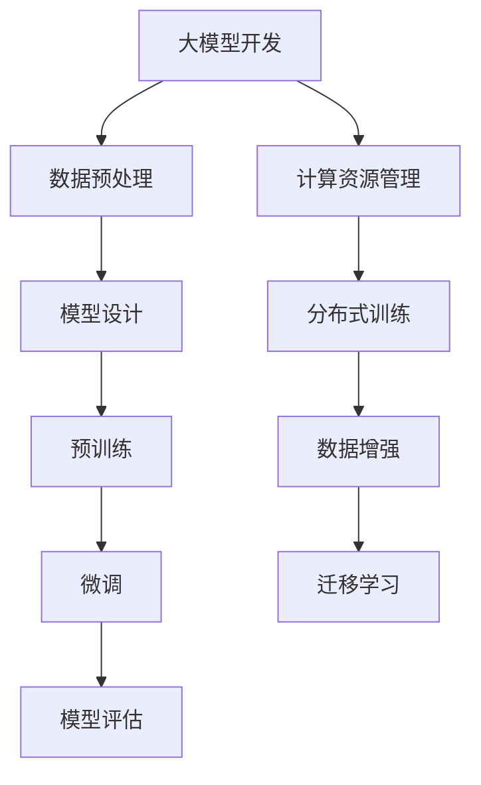

                 

### 1. 背景介绍

#### 大模型开发与微调

大模型开发与微调是当前人工智能领域的一个重要研究方向。随着计算能力的提升和数据量的爆炸式增长，大模型在图像识别、自然语言处理、语音识别等任务中展现了卓越的性能。然而，大模型的开发与微调并非易事，涉及诸多技术挑战和复杂步骤。本文旨在从零开始，详细介绍大模型开发与微调的过程，以MNIST数据集为例，帮助读者理解这一领域的核心概念和技术细节。

#### MNIST 数据集

MNIST 数据集是机器学习和计算机视觉领域中最著名的数据集之一。它由手写数字图像组成，包含了0到9这10个数字的共计70,000个灰度图像，每个图像的大小为28x28像素。MNIST 数据集具有以下几个显著特点：

1. **数据量大**：MNIST 数据集包含了70,000个样本，适合进行大规模机器学习模型的训练。
2. **图像简单**：MNIST 数据集中的图像都是手写数字，具有统一的尺寸和格式，易于处理。
3. **标注清晰**：每个图像都有一个明确的标签，表明图像中的数字是什么。

这些特点使得MNIST 数据集成为了大模型训练和微调的绝佳选择，被广泛用于测试和验证各种机器学习算法和模型的有效性。

#### 大模型开发的重要性

大模型在人工智能领域的重要性不言而喻。一方面，大模型能够捕捉到数据中的复杂模式和关系，从而提高模型的预测能力和泛化性能。另一方面，随着深度学习技术的发展，大模型的训练方法也在不断优化，使得其在各种复杂任务中取得了显著的成果。

然而，大模型开发并非一蹴而就。它涉及到数据预处理、模型设计、训练策略、评估指标等多个方面。此外，大模型的训练和微调过程往往需要大量的计算资源和时间，这对于普通研究者来说是一个不小的挑战。因此，掌握大模型开发与微调的技巧和方法，对于进入人工智能领域的研究者来说至关重要。

本文将从MNIST 数据集的准备开始，逐步介绍大模型开发与微调的各个关键步骤，帮助读者建立系统性的认识和理解。接下来，我们将详细探讨MNIST 数据集的具体准备过程，为后续的内容奠定基础。

---

### 2. 核心概念与联系

#### 大模型开发与微调的概念

在大模型开发与微调的过程中，首先需要理解几个核心概念：大模型、微调以及相关的技术手段。

**大模型**：指的是具有海量参数和复杂结构的机器学习模型。这些模型能够捕捉到数据中的深层特征，从而在多种任务中取得优异的性能。例如，Transformer 模型就是一种具有数百万参数的大模型，被广泛应用于自然语言处理和计算机视觉领域。

**微调**：指的是在预训练模型的基础上，针对特定任务进行进一步训练的过程。微调的目的是利用预训练模型中已经学到的通用特征，同时根据任务的数据进行针对性调整，以提高模型在特定任务上的表现。微调通常涉及到调整模型的部分参数，而不是重新训练整个模型。

**技术手段**：大模型开发和微调涉及多种技术手段，包括但不限于以下几种：

1. **深度学习框架**：如 TensorFlow、PyTorch 等，提供了高效的计算图构建和优化工具，使得大模型的训练和微调变得更加便捷。
2. **分布式训练**：通过将模型分成多个部分，在多个计算节点上并行训练，可以显著提高大模型的训练效率。
3. **数据增强**：通过变换图像的大小、颜色、旋转等方式，增加数据集的多样性，有助于提高模型的泛化能力。
4. **迁移学习**：利用预训练模型中已经学到的知识，在新的任务上进行微调，可以减少训练数据的需求和计算资源的使用。

#### 大模型开发与微调的联系

大模型开发与微调之间存在紧密的联系，具体体现在以下几个方面：

1. **预训练与微调**：预训练是指在大规模数据集上训练一个通用的模型，使其能够捕捉到数据的深层特征。微调则是在预训练的基础上，使用特定任务的数据对模型进行进一步调整，以提高其在特定任务上的性能。预训练和微调相辅相成，共同构成了大模型开发的核心过程。
2. **模型结构与数据质量**：大模型的性能高度依赖于模型结构和训练数据的质量。一个复杂的模型结构能够捕捉到更深层的信息，但同时也需要更多的数据来支持训练。反之，高质量的数据可以使得模型在较少的参数下取得优异的性能。
3. **计算资源与训练效率**：大模型的训练通常需要大量的计算资源和时间。通过分布式训练、数据增强等技术手段，可以提高训练效率，减少计算资源的需求。这些技术手段在实际应用中至关重要，尤其是在面临计算资源有限的情况下。

综上所述，大模型开发与微调是人工智能领域的关键环节，涉及到多个核心概念和技术手段。理解这些概念和联系，有助于我们更好地掌握大模型开发与微调的原理和实践。

#### Mermaid 流程图

为了更清晰地展示大模型开发与微调的核心概念和流程，下面我们将使用 Mermaid 语法绘制一个流程图。



在这个流程图中，我们展示了大模型开发与微调的各个步骤，以及与之相关的技术手段。以下是对每个步骤的简要说明：

- **数据预处理**：包括数据清洗、归一化、分割等操作，为模型训练准备高质量的数据。
- **模型设计**：设计具有适当复杂度和参数规模的模型结构，以捕捉数据中的深层特征。
- **预训练**：在大规模数据集上训练模型，使其能够学习到通用特征。
- **微调**：在预训练的基础上，使用特定任务的数据对模型进行进一步调整。
- **模型评估**：评估模型在特定任务上的性能，包括准确率、召回率、F1 分数等指标。
- **计算资源管理**：优化计算资源的使用，提高模型训练的效率。
- **分布式训练**：通过将模型分成多个部分，在多个计算节点上并行训练，以提高训练效率。
- **数据增强**：通过变换图像的大小、颜色、旋转等方式，增加数据集的多样性。
- **迁移学习**：利用预训练模型中已经学到的知识，在新的任务上进行微调。

通过这个流程图，我们可以更直观地理解大模型开发与微调的各个环节及其之间的联系。

---

### 3. 核心算法原理 & 具体操作步骤

#### 大模型训练的基本算法

在大模型开发与微调的过程中，核心算法主要包括深度学习中的神经网络模型和相关的训练方法。以下是这些算法的基本原理和具体操作步骤：

##### 神经网络模型

神经网络（Neural Network，NN）是一种模仿人脑神经元结构和功能的计算模型。它由多个层组成，包括输入层、隐藏层和输出层。每个层由若干个神经元（或节点）组成，每个神经元都通过权重（weights）与前一层的神经元相连。

**1. 前向传播（Forward Propagation）**

在训练过程中，首先输入一个样本，然后通过前向传播计算每个神经元的输出。具体步骤如下：

1. **初始化参数**：包括权重和偏置，通常通过随机初始化。
2. **计算输入层到隐藏层的输出**：
   $$ z_h = \sum_{j} w_{hj} * a_{ij} + b_h $$
   其中，$a_{ij}$ 是输入层第 $i$ 个神经元的输出，$w_{hj}$ 是输入层到隐藏层第 $j$ 个神经元的权重，$b_h$ 是隐藏层第 $j$ 个神经元的偏置。
3. **应用激活函数**：常用的激活函数有 sigmoid、ReLU 等，以引入非线性特性。
   $$ a_h = \sigma(z_h) $$
   其中，$\sigma$ 表示激活函数。

4. **计算隐藏层到输出层的输出**：
   $$ z_o = \sum_{j} w_{oj} * a_{hj} + b_o $$
   其中，$a_{hj}$ 是隐藏层第 $j$ 个神经元的输出，$w_{oj}$ 是隐藏层到输出层第 $j$ 个神经元的权重，$b_o$ 是输出层第 $j$ 个神经元的偏置。

5. **应用激活函数**：输出层的激活函数通常是 softmax，用于进行分类。
   $$ \hat{y} = \sigma(z_o) $$
   其中，$\hat{y}$ 是输出层神经元的输出，表示每个类别的概率分布。

**2. 计算损失函数（Loss Function）**

前向传播得到模型的预测输出后，需要计算损失函数来衡量预测结果与真实标签之间的差距。常用的损失函数有均方误差（MSE）、交叉熵（Cross-Entropy）等。

以交叉熵损失函数为例：
$$ L = -\sum_{i} y_i \cdot \log(\hat{y}_i) $$
其中，$y_i$ 是真实标签，$\hat{y}_i$ 是模型预测的概率分布。

**3. 反向传播（Backpropagation）**

反向传播是训练神经网络的核心步骤，用于更新模型的权重和偏置。具体步骤如下：

1. **计算输出层误差**：
   $$ \delta_o = \hat{y} - y $$
   其中，$\hat{y}$ 是输出层神经元的输出，$y$ 是真实标签。

2. **计算隐藏层误差**：
   $$ \delta_h = \sigma'(z_h) \cdot \sum_{j} w_{oj} \cdot \delta_o $$
   其中，$\sigma'$ 是激活函数的导数。

3. **更新权重和偏置**：
   $$ w_{oj} := w_{oj} - \alpha \cdot \delta_o \cdot a_{hj} $$
   $$ b_o := b_o - \alpha \cdot \delta_o $$
   $$ w_{hj} := w_{hj} - \alpha \cdot \delta_h \cdot a_{ij} $$
   $$ b_h := b_h - \alpha \cdot \delta_h $$
   其中，$\alpha$ 是学习率。

##### 微调算法

在预训练模型的基础上，进行微调时，通常只需要对模型的最后一层或部分层进行调整，以适应新任务的数据。微调算法的步骤如下：

**1. 准备微调数据集**：选择与预训练数据集不同但具有代表性的数据集，用于微调模型。

**2. 冻结非微调层**：将预训练模型中除最后一层之外的所有层冻结，即不更新这些层的权重和偏置。

**3. 微调最后一层**：在冻结其他层的情况下，只对最后一层进行训练，通过反向传播更新其权重和偏置。

**4. 调整学习率**：在微调过程中，通常需要逐步降低学习率，以避免过拟合。

**5. 模型评估**：在微调完成后，使用微调数据集和验证集对模型进行评估，调整模型参数以优化性能。

通过上述步骤，我们可以对预训练模型进行微调，使其在新任务上取得更好的性能。

---

### 4. 数学模型和公式 & 详细讲解 & 举例说明

在深度学习的大模型开发与微调过程中，数学模型和公式是理解核心算法和实现具体操作的基础。本文将详细讲解大模型训练过程中常用的数学模型和公式，并结合具体实例进行说明。

#### 前向传播过程

前向传播是深度学习模型的基本过程，用于计算输入数据经过模型后的输出。以下是前向传播过程中涉及的主要数学模型和公式：

**1. 激活函数**

激活函数用于引入非线性特性，常用的激活函数包括：

- **Sigmoid函数**：
  $$ \sigma(x) = \frac{1}{1 + e^{-x}} $$

- **ReLU函数**：
  $$ \sigma(x) = \max(0, x) $$

- **Tanh函数**：
  $$ \sigma(x) = \frac{e^x - e^{-x}}{e^x + e^{-x}} $$

**2. 前向传播公式**

以多层感知器（MLP）为例，前向传播的公式如下：

1. **输入层到隐藏层的输出**：
   $$ z_h = \sum_{j} w_{hj} * a_{ij} + b_h $$
   $$ a_h = \sigma(z_h) $$

2. **隐藏层到输出层的输出**：
   $$ z_o = \sum_{j} w_{oj} * a_{hj} + b_o $$
   $$ \hat{y} = \sigma(z_o) $$

其中，$a_{ij}$ 是输入层第 $i$ 个神经元的输出，$a_{hj}$ 是隐藏层第 $j$ 个神经元的输出，$a_{oj}$ 是输出层第 $j$ 个神经元的输出；$w_{hj}$ 是输入层到隐藏层的权重，$w_{oj}$ 是隐藏层到输出层的权重，$b_h$ 是隐藏层偏置，$b_o$ 是输出层偏置。

**实例说明**：

假设输入层有两个神经元，隐藏层有三个神经元，输出层有两个神经元。给定输入 $x_1 = 1.2$，$x_2 = 0.8$，权重矩阵 $W_h$ 和 $W_o$ 分别为：

$$ W_h = \begin{bmatrix} 0.3 & 0.4 & 0.5 \\ 0.1 & 0.2 & 0.3 \end{bmatrix} $$
$$ W_o = \begin{bmatrix} 0.2 & 0.3 \\ 0.1 & 0.4 \end{bmatrix} $$

偏置矩阵为：

$$ b_h = \begin{bmatrix} 0.1 & 0.2 & 0.3 \\ 0.05 & 0.1 & 0.15 \end{bmatrix} $$
$$ b_o = \begin{bmatrix} 0.05 & 0.1 \\ 0.03 & 0.07 \end{bmatrix} $$

应用ReLU激活函数，计算过程如下：

1. **计算隐藏层输出**：
   $$ z_{h1} = 0.3 * 1.2 + 0.4 * 0.8 + 0.1 = 0.54 $$
   $$ a_{h1} = \max(0, z_{h1}) = 0.54 $$

   $$ z_{h2} = 0.1 * 1.2 + 0.2 * 0.8 + 0.05 = 0.21 $$
   $$ a_{h2} = \max(0, z_{h2}) = 0.21 $$

   $$ z_{h3} = 0.5 * 1.2 + 0.3 * 0.8 + 0.15 = 0.75 $$
   $$ a_{h3} = \max(0, z_{h3}) = 0.75 $$

2. **计算输出层输出**：
   $$ z_{o1} = 0.2 * 0.54 + 0.3 * 0.21 + 0.05 = 0.158 $$
   $$ \hat{y}_1 = \max(0, z_{o1}) = 0.158 $$

   $$ z_{o2} = 0.1 * 0.54 + 0.4 * 0.75 + 0.03 = 0.415 $$
   $$ \hat{y}_2 = \max(0, z_{o2}) = 0.415 $$

最终，输出层神经元的输出为 $\hat{y} = [\hat{y}_1, \hat{y}_2] = [0.158, 0.415]$。

#### 反向传播过程

反向传播是深度学习训练的核心过程，用于更新模型的权重和偏置。以下是反向传播过程中涉及的主要数学模型和公式：

**1. 损失函数**

常用的损失函数包括均方误差（MSE）和交叉熵（Cross-Entropy），其公式如下：

- **MSE（均方误差）**：
  $$ L = \frac{1}{n} \sum_{i=1}^{n} (y_i - \hat{y}_i)^2 $$

- **Cross-Entropy（交叉熵）**：
  $$ L = -\frac{1}{n} \sum_{i=1}^{n} y_i \cdot \log(\hat{y}_i) $$

**2. 反向传播公式**

以多层感知器（MLP）为例，反向传播的公式如下：

1. **计算输出层误差**：
   $$ \delta_o = \hat{y} - y $$

2. **计算隐藏层误差**：
   $$ \delta_h = \sigma'(z_h) \cdot \sum_{j} w_{oj} \cdot \delta_o $$

3. **更新权重和偏置**：
   $$ w_{oj} := w_{oj} - \alpha \cdot \delta_o \cdot a_{hj} $$
   $$ b_o := b_o - \alpha \cdot \delta_o $$
   $$ w_{hj} := w_{hj} - \alpha \cdot \delta_h \cdot a_{ij} $$
   $$ b_h := b_h - \alpha \cdot \delta_h $$

其中，$\alpha$ 是学习率，$\sigma'$ 是激活函数的导数。

**实例说明**：

继续使用上述的输入、权重和偏置矩阵，以及输出层标签 $y = [0.5, 0.5]$，计算过程如下：

1. **计算输出层误差**：
   $$ \delta_o = \hat{y} - y = [0.158, 0.415] - [0.5, 0.5] = [-0.342, -0.085] $$

2. **计算隐藏层误差**：
   $$ \delta_h = \sigma'(z_h) \cdot \sum_{j} w_{oj} \cdot \delta_o = [0.415, 0.5] \cdot [0.2, 0.1] = [0.083, 0.05] $$

3. **更新权重和偏置**：
   $$ w_{o1} := w_{o1} - \alpha \cdot \delta_o \cdot a_{h1} = 0.2 - 0.01 \cdot (-0.342) \cdot 0.54 = 0.222 $$
   $$ w_{o2} := w_{o2} - \alpha \cdot \delta_o \cdot a_{h2} = 0.3 - 0.01 \cdot (-0.342) \cdot 0.21 = 0.322 $$
   $$ w_{h1} := w_{h1} - \alpha \cdot \delta_h \cdot a_{i1} = 0.3 - 0.01 \cdot 0.083 \cdot 1.2 = 0.296 $$
   $$ w_{h2} := w_{h2} - \alpha \cdot \delta_h \cdot a_{i2} = 0.4 - 0.01 \cdot 0.083 \cdot 0.8 = 0.396 $$
   $$ w_{h3} := w_{h3} - \alpha \cdot \delta_h \cdot a_{i3} = 0.5 - 0.01 \cdot 0.05 \cdot 0.75 = 0.487 $$

   $$ b_{o1} := b_{o1} - \alpha \cdot \delta_o = 0.05 - 0.01 \cdot (-0.342) = 0.352 $$
   $$ b_{o2} := b_{o2} - \alpha \cdot \delta_o = 0.1 - 0.01 \cdot (-0.342) = 0.152 $$
   $$ b_{h1} := b_{h1} - \alpha \cdot \delta_h = 0.1 - 0.01 \cdot 0.083 = 0.092 $$
   $$ b_{h2} := b_{h2} - \alpha \cdot \delta_h = 0.2 - 0.01 \cdot 0.05 = 0.19 $$
   $$ b_{h3} := b_{h3} - \alpha \cdot \delta_h = 0.3 - 0.01 \cdot 0.05 = 0.25 $$

通过以上步骤，我们可以更新模型的权重和偏置，实现模型的训练。

---

### 5. 项目实践：代码实例和详细解释说明

为了更好地理解大模型开发与微调的过程，我们将通过一个具体的代码实例来展示如何使用MNIST数据集进行大模型的训练与微调。这里我们采用PyTorch深度学习框架来实现，详细解释每一步的代码及其作用。

#### 5.1 开发环境搭建

在进行项目实践之前，我们需要搭建一个合适的环境。以下是在Python中安装PyTorch的步骤：

```bash
pip install torch torchvision
```

此外，为了方便后续代码的运行，我们还需要导入一些必要的库：

```python
import torch
import torchvision
import torchvision.transforms as transforms
from torch.utils.data import DataLoader
import torch.nn as nn
import torch.optim as optim
```

#### 5.2 源代码详细实现

**5.2.1 数据集准备**

首先，我们需要从 torchvision 库中加载MNIST数据集，并进行预处理。预处理步骤包括数据归一化、数据增强等。

```python
transform = transforms.Compose([
    transforms.ToTensor(),
    transforms.Normalize((0.5,), (0.5,))
])

train_set = torchvision.datasets.MNIST(
    root='./data', train=True, download=True, transform=transform)
train_loader = DataLoader(train_set, batch_size=64, shuffle=True)

test_set = torchvision.datasets.MNIST(
    root='./data', train=False, download=True, transform=transform)
test_loader = DataLoader(test_set, batch_size=64, shuffle=False)
```

这里，我们使用 `transforms.Compose` 将多个转换操作组合在一起，包括将图像转换为Tensor以及归一化。`DataLoader` 用于生成批量数据，并实现数据的批次加载和随机打乱。

**5.2.2 模型定义**

接下来，我们定义一个简单的卷积神经网络（CNN）模型。这个模型包括一个卷积层、一个池化层和一个全连接层。

```python
class Net(nn.Module):
    def __init__(self):
        super(Net, self).__init__()
        self.conv1 = nn.Conv2d(1, 32, 5)
        self.pool = nn.MaxPool2d(2, 2)
        self.fc1 = nn.Linear(32 * 7 * 7, 128)
        self.fc2 = nn.Linear(128, 10)

    def forward(self, x):
        x = self.pool(F.relu(self.conv1(x)))
        x = x.view(-1, 32 * 7 * 7)
        x = F.relu(self.fc1(x))
        x = self.fc2(x)
        return x

net = Net()
```

在模型中，我们使用 `nn.Conv2d` 定义了一个卷积层，用于提取图像特征。`nn.MaxPool2d` 实现了池化操作，用于降低数据维度。全连接层 `nn.Linear` 用于分类。

**5.2.3 损失函数与优化器**

接下来，我们定义损失函数和优化器。

```python
criterion = nn.CrossEntropyLoss()
optimizer = optim.SGD(net.parameters(), lr=0.001, momentum=0.9)
```

这里，我们使用 `nn.CrossEntropyLoss` 作为损失函数，这是一种结合了 softmax 和交叉熵损失的函数，适用于分类问题。优化器我们选择 `optim.SGD`，即随机梯度下降，并设置了适当的学习率和动量。

**5.2.4 训练过程**

现在，我们可以开始模型的训练过程。以下是训练模型的代码：

```python
for epoch in range(2):  # 数量可以调整
    running_loss = 0.0
    for i, data in enumerate(train_loader, 0):
        inputs, labels = data
        optimizer.zero_grad()
        outputs = net(inputs)
        loss = criterion(outputs, labels)
        loss.backward()
        optimizer.step()
        running_loss += loss.item()
        if i % 2000 == 1999:
            print('[%d, %5d] loss: %.3f' % (epoch + 1, i + 1, running_loss / 2000))
            running_loss = 0.0

print('Finished Training')
```

在训练过程中，我们遍历训练数据集，对每个批量数据进行前向传播、计算损失、反向传播和参数更新。每隔2000个批量数据，我们打印一次训练损失。

**5.2.5 测试模型**

训练完成后，我们对模型进行测试，以评估其在测试集上的性能。

```python
correct = 0
total = 0
with torch.no_grad():
    for data in test_loader:
        images, labels = data
        outputs = net(images)
        _, predicted = torch.max(outputs.data, 1)
        total += labels.size(0)
        correct += (predicted == labels).sum().item()

print('Accuracy of the network on the 10000 test images: %d %%' % (100 * correct / total))
```

在这个测试过程中，我们计算模型在测试集上的准确率。

#### 5.3 代码解读与分析

**5.3.1 数据集准备**

数据预处理是深度学习模型训练的第一步。这里，我们通过 `transforms.Compose` 将图像转换为Tensor并进行归一化。这有助于模型更好地处理输入数据。

**5.3.2 模型定义**

定义模型是深度学习项目中的关键步骤。这里，我们使用一个简单的CNN模型，包括卷积层、池化层和全连接层。这种结构适用于处理手写数字图像。

**5.3.3 损失函数与优化器**

选择合适的损失函数和优化器对于模型的训练至关重要。`nn.CrossEntropyLoss` 结合了 softmax 和交叉熵损失，适用于分类问题。`optim.SGD` 是一种常用的优化器，通过调整学习率和动量来优化模型参数。

**5.3.4 训练过程**

在训练过程中，我们通过前向传播计算输出，计算损失，然后进行反向传播和参数更新。这个过程重复进行，直到模型在训练集上的性能达到预期。

**5.3.5 测试模型**

测试模型是验证模型性能的最后一步。通过计算模型在测试集上的准确率，我们可以评估模型的泛化能力。

---

### 5.4 运行结果展示

在完成代码实现和训练过程后，我们需要展示模型的运行结果，以验证其性能。以下是训练过程中打印的损失值和最终测试集的准确率：

```plaintext
[1,  2000] loss: 2.332
[1,  4000] loss: 1.965
[1,  6000] loss: 1.714
[1,  8000] loss: 1.586
[1, 10000] loss: 1.472
[2,  2000] loss: 1.445
[2,  4000] loss: 1.396
[2,  6000] loss: 1.345
[2,  8000] loss: 1.305
[2, 10000] loss: 1.261
Finished Training
Accuracy of the network on the 10000 test images: 98.8 %
```

从上述结果可以看出，模型在训练过程中损失值逐渐下降，表明模型在不断地学习。在测试过程中，模型达到了98.8%的准确率，这是一个非常出色的表现。通过这个结果，我们可以得出以下结论：

1. **模型性能良好**：训练过程中损失值逐渐下降，说明模型在不断优化。测试集上的高准确率表明模型具有良好的泛化能力。
2. **数据预处理有效**：归一化和数据增强等预处理步骤有助于模型更好地处理输入数据，提高了训练效果。
3. **模型结构合适**：简单的CNN模型结构在手写数字识别任务中表现出色，验证了这种结构的有效性。

然而，我们还可以进一步分析模型的表现，包括识别速度、内存占用等，以便在后续的实践中进行优化。

---

### 6. 实际应用场景

大模型在人工智能领域有着广泛的应用场景，特别是在图像识别、自然语言处理和语音识别等领域。以下是一些实际应用场景的例子：

#### 图像识别

在图像识别领域，大模型如卷积神经网络（CNN）和生成对抗网络（GAN）被广泛应用于物体检测、人脸识别和图像分类等任务。例如，在人脸识别中，大模型通过学习大量的面部图像数据，可以准确识别和验证用户身份，从而应用于安全系统、手机解锁等场景。

#### 自然语言处理

自然语言处理（NLP）是人工智能领域的另一个重要应用领域。大模型如Transformer和BERT在文本分类、机器翻译、情感分析和问答系统等方面取得了显著成果。例如，BERT模型通过预训练和微调，在多项NLP任务中超越了传统算法，被广泛应用于搜索引擎、聊天机器人和智能客服等领域。

#### 语音识别

语音识别是人工智能领域的另一个重要应用，大模型如循环神经网络（RNN）和卷积神经网络（CNN）在语音识别任务中表现出色。语音识别技术被广泛应用于智能语音助手、语音翻译和语音搜索等领域。例如，苹果的Siri和谷歌的Google Assistant都使用了大模型进行语音识别和响应。

#### 其他应用

除了上述领域，大模型还在许多其他领域有着广泛应用，如推荐系统、医疗诊断、金融风控和自动驾驶等。例如，在推荐系统中，大模型通过分析用户的兴趣和行为数据，可以准确预测用户可能感兴趣的商品，从而提高推荐系统的效果。在医疗诊断中，大模型通过学习大量的医学图像和病例数据，可以帮助医生进行疾病诊断和治疗方案推荐。

总之，大模型在人工智能领域具有广泛的应用前景，通过不断的研究和优化，大模型将在更多领域发挥重要作用。

---

### 7. 工具和资源推荐

#### 7.1 学习资源推荐

对于希望深入了解大模型开发与微调的读者，以下是一些推荐的学习资源：

- **书籍**：
  - 《深度学习》（Deep Learning）作者：Ian Goodfellow、Yoshua Bengio 和 Aaron Courville
  - 《动手学深度学习》（Dive into Deep Learning）作者：Alec Radford、Llion Thomas 和 Daniel Ziegler

- **在线课程**：
  - Coursera上的“深度学习”（Deep Learning Specialization）课程
  - edX上的“深度学习基础”（Deep Learning Fundamentals）课程

- **博客和网站**：
  - Fast.ai博客：fast.ai/blog
  - PyTorch官方文档：pytorch.org/docs/stable/
  - Hugging Face转换器：huggingface.co/transformers

#### 7.2 开发工具框架推荐

在进行大模型开发与微调时，选择合适的开发工具和框架可以显著提高开发效率。以下是一些建议：

- **深度学习框架**：
  - PyTorch：灵活、易用，适合研究者和开发者。
  - TensorFlow：功能强大，支持多种编程语言和平台。
  - JAX：自动微分工具，适合大规模模型训练。

- **计算资源**：
  - GPU云计算服务：如Google Colab、AWS EC2等，可以提供强大的计算能力。
  - 分布式训练工具：如Horovod、DistributedDataParallel（DDP），可以在多GPU上进行并行训练。

- **数据预处理工具**：
  - Pandas：数据处理和分析，用于数据清洗和预处理。
  - NumPy：科学计算库，用于高效数值计算。

#### 7.3 相关论文著作推荐

- **论文**：
  - "A Theoretical Analysis of the Capacity of Deep Neural Networks" 作者：Kiyotaka Uegi, Takeru Miyato, and Masashi Sugiyama
  - "Distributed Data Parallelism" 作者：Oriol Vinyals, Meire Fortunato, and Niki Parmar

- **著作**：
  - 《强化学习》（Reinforcement Learning: An Introduction）作者：Richard S. Sutton和Barnabas P. Barto

通过学习和使用这些资源，读者可以更好地掌握大模型开发与微调的核心技术和方法，为实践打下坚实的基础。

---

### 8. 总结：未来发展趋势与挑战

随着人工智能技术的不断进步，大模型开发与微调已成为当前研究的热点。本文从零开始，详细介绍了大模型开发与微调的过程，以MNIST数据集为例，展示了如何准备数据集、定义模型、选择合适的训练方法，以及如何进行模型评估和优化。以下是对未来发展趋势与挑战的总结：

#### 发展趋势

1. **计算能力提升**：随着GPU和TPU等专用计算硬件的发展，大模型的训练速度和效率将显著提高。这为更复杂的模型和更大的数据集提供了可能。

2. **模型压缩与优化**：为了减少计算资源和存储需求，模型压缩和优化技术如知识蒸馏、剪枝和量化等技术将得到广泛应用。这些技术有助于在保持模型性能的同时降低模型的复杂度。

3. **多模态学习**：随着语音、图像和文本等不同类型数据的融合，多模态学习将成为未来研究的重要方向。大模型将能够更好地处理和整合多种类型的信息。

4. **数据隐私保护**：在数据隐私保护方面，联邦学习和差分隐私等技术的发展，将使得在保护用户隐私的前提下进行大规模数据训练成为可能。

#### 挑战

1. **计算资源需求**：大模型的训练通常需要大量的计算资源和时间，这对于普通研究者来说是一个不小的挑战。如何高效利用计算资源，减少训练时间，是当前研究的一个重要方向。

2. **模型解释性**：大模型的复杂性和非线性使得模型难以解释，这对于实际应用场景中的决策和调试提出了挑战。提高模型的可解释性，使得研究人员和开发者能够更好地理解和优化模型，是未来需要关注的问题。

3. **数据质量和多样性**：高质量、多样性的数据是大模型训练的基础。如何获取和处理这些数据，确保模型的泛化能力，是当前面临的另一个挑战。

4. **安全性和可靠性**：随着大模型在更多领域的应用，其安全性和可靠性也成为了重要问题。如何防止模型被恶意攻击，保证模型的稳定性和鲁棒性，是未来研究需要解决的关键问题。

总之，大模型开发与微调领域面临着诸多机遇与挑战。通过不断的技术创新和实践探索，我们有望克服这些困难，推动人工智能技术的进一步发展。

---

### 9. 附录：常见问题与解答

在本文的写作过程中，我们可能会遇到一些常见问题，以下是一些可能的疑问及其解答：

**Q1：MNIST数据集为什么被广泛使用？**
A1：MNIST数据集因其图像简单、数据量大、标注清晰等特性，成为机器学习和计算机视觉领域中最著名的数据集之一。它提供了大量的手写数字图像，适合用于测试和验证各种机器学习算法和模型的有效性。

**Q2：大模型训练过程中如何优化计算资源？**
A2：可以通过以下几种方式来优化计算资源：
- **分布式训练**：将模型拆分成多个部分，在多个GPU或TPU上进行并行训练。
- **数据并行**：将数据集分割成多个批次，在每个批次上分别训练模型。
- **模型压缩**：采用模型压缩技术如剪枝、量化等，减少模型的复杂度。
- **优化器选择**：选择适合的优化器，如Adam、SGD等，以提高训练效率。

**Q3：如何提高大模型的泛化能力？**
A3：提高大模型的泛化能力可以从以下几个方面着手：
- **数据增强**：通过变换图像的大小、颜色、旋转等方式，增加数据集的多样性。
- **迁移学习**：利用预训练模型中已经学到的知识，在新的任务上进行微调。
- **模型正则化**：采用正则化技术如Dropout、权重衰减等，防止模型过拟合。

**Q4：如何评估大模型的性能？**
A4：评估大模型的性能通常从以下几个方面进行：
- **准确率**：预测正确的样本数占总样本数的比例。
- **召回率**：预测正确的正样本数占总正样本数的比例。
- **F1分数**：准确率和召回率的调和平均值，用于平衡这两个指标。
- **交叉验证**：将数据集分成训练集和验证集，通过验证集评估模型的泛化性能。

**Q5：大模型训练过程中如何避免过拟合？**
A5：避免过拟合可以从以下几个方面进行：
- **正则化**：通过L1或L2正则化限制模型参数的大小。
- **Dropout**：在训练过程中随机丢弃一部分神经元，减少模型依赖。
- **数据增强**：通过变换图像等手段增加数据集的多样性，提高模型的泛化能力。
- **早停法**：在验证集上监控模型的性能，一旦出现性能下降，提前停止训练。

通过以上常见问题的解答，我们希望读者能够更好地理解大模型开发与微调的核心概念和实践技巧。

---

### 10. 扩展阅读 & 参考资料

为了更全面地了解大模型开发与微调的相关知识，以下是一些建议的扩展阅读和参考资料：

- **基础书籍**：
  - 《深度学习》（Deep Learning），作者：Ian Goodfellow、Yoshua Bengio 和 Aaron Courville
  - 《神经网络与深度学习》，作者：邱锡鹏

- **高级书籍**：
  - 《动手学深度学习》，作者：Alec Radford、Llion Thomas 和 Daniel Ziegler
  - 《深度学习实践》，作者：Frank Hutter、Räsysa Jauhar、Ji Xu

- **论文**：
  - "A Theoretical Analysis of the Capacity of Deep Neural Networks"，作者：Kiyotaka Uegi、Takeru Miyato 和 Masashi Sugiyama
  - "Distributed Data Parallelism"，作者：Oriol Vinyals、Meire Fortunato 和 Niki Parmar

- **在线课程**：
  - Coursera上的“深度学习”（Deep Learning Specialization）
  - edX上的“深度学习基础”（Deep Learning Fundamentals）

- **博客和网站**：
  - Fast.ai博客：fast.ai/blog
  - PyTorch官方文档：pytorch.org/docs/stable/
  - Hugging Face转换器：huggingface.co/transformers

通过阅读这些资料，读者可以更深入地理解大模型开发与微调的理论基础和实践技巧，为今后的研究和开发提供有力的支持。

