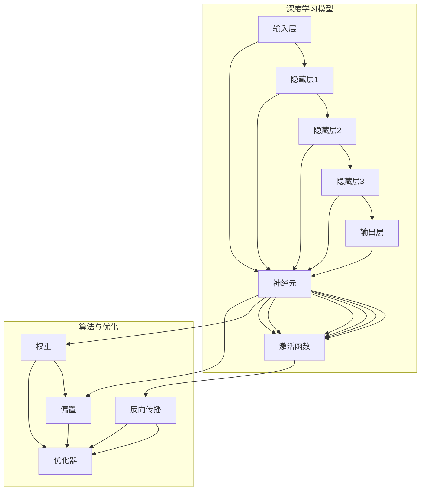
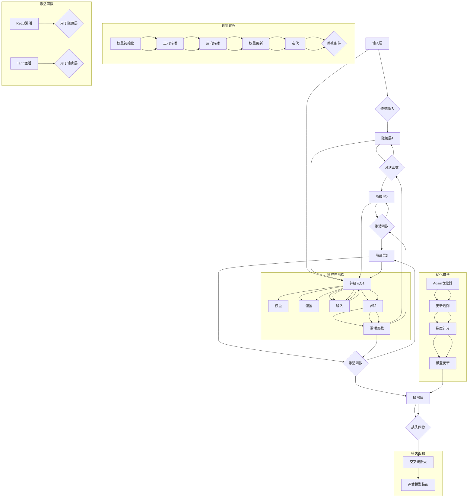

                 

### 1. 背景介绍

随着互联网的飞速发展和大数据时代的到来，人工智能（AI）逐渐成为推动社会进步的重要力量。其中，深度学习作为人工智能的核心技术之一，受到了广泛关注。深度学习模型通过多层神经网络结构对海量数据进行分析和学习，从而实现图像识别、语音识别、自然语言处理等复杂任务。而大模型开发与微调作为深度学习领域的关键技术，正成为研究者们研究的热点。

大模型开发与微调是指在现有深度学习模型的基础上，通过不断优化和调整模型参数，使其在特定任务上达到更优的性能。这一过程通常包括模型训练、参数调整、性能评估等环节。大模型的优势在于能够处理更加复杂的数据和任务，从而提高模型的泛化能力。然而，大模型开发与微调也面临着诸多挑战，如计算资源消耗大、训练时间长、参数调整复杂等。

本文旨在从零开始介绍大模型开发与微调的基本概念、核心算法原理、数学模型以及实际应用场景。通过逐步分析推理，帮助读者深入了解大模型开发与微调的原理和方法。本文还将推荐一些优秀的工具和资源，供读者学习和实践。

## 1.1 大模型的概念与历史发展

大模型（Large-scale Model）是指在训练过程中需要处理大量数据，拥有大量参数的深度学习模型。这类模型能够通过大规模数据的学习，实现更优的性能和更广泛的适用性。大模型的发展可以追溯到深度学习技术的早期阶段。随着计算能力的提升和大数据时代的到来，大模型逐渐成为一种重要的研究趋势。

早期的大模型研究主要集中在语音识别和图像识别领域。例如，在语音识别中，研究者们提出了一系列基于深度神经网络的模型，如DNN、DNN-HMM等，这些模型通过大规模语音数据训练，实现了较高的识别准确率。在图像识别领域，AlexNet的出现标志着深度学习在图像分类任务中的突破，这一模型使用了大量参数和多层网络结构，达到了当时的前沿水平。

随着深度学习技术的不断发展，大模型的规模和复杂度也在不断提升。2012年，Google的论文《Large-scale Distributed Deep Networks》提出了使用数百万参数的深度神经网络进行大规模图像分类的方法，这一研究开启了深度学习领域的大模型时代。此后，一系列大模型相继出现，如Google的Inception、微软的ResNet、OpenAI的GPT等，这些模型在图像识别、自然语言处理等领域取得了显著的成果。

大模型的发展历程体现了深度学习技术不断向前推进的过程。从早期的单层神经网络到如今的多层神经网络，从简单的数据集到庞大的数据集，大模型的演进不仅推动了深度学习技术的发展，也为各行各业带来了变革性的影响。

## 1.2 大模型开发与微调的意义

大模型开发与微调在深度学习领域具有重要意义。首先，大模型能够处理更复杂的数据和任务，具有更高的泛化能力。通过大规模数据的学习，大模型能够更好地捕捉数据中的模式和规律，从而实现更准确的预测和分类。例如，在自然语言处理任务中，大型预训练模型如BERT、GPT等能够处理复杂的语言现象，生成更加自然和准确的文本。

其次，大模型开发与微调能够提高模型的可解释性。在大模型训练过程中，通过分析模型的参数和中间结果，可以揭示模型学习到的特征和规律，从而增强模型的可解释性。这对于模型的优化和改进具有重要意义，有助于发现和解决模型中的潜在问题。

此外，大模型开发与微调还具有重要的应用价值。在图像识别、语音识别、自然语言处理等众多领域，大模型已经成为实现高性能和智能化的关键技术。例如，在医疗诊断中，大模型可以用于疾病检测和预测；在金融领域，大模型可以用于风险评估和投资决策。这些应用不仅提高了各个行业的生产效率，也为人们的生活带来了便利。

## 1.3 本文结构

本文将从以下几个方面展开：

1. **背景介绍**：介绍大模型的概念、历史发展以及开发与微调的意义。
2. **核心概念与联系**：详细解释深度学习模型的基本结构，并使用Mermaid流程图展示核心概念之间的联系。
3. **核心算法原理 & 具体操作步骤**：阐述大模型训练的基本流程，包括数据预处理、模型训练、参数调整等步骤。
4. **数学模型和公式 & 详细讲解 & 举例说明**：介绍大模型训练过程中涉及的主要数学模型和公式，并通过具体示例进行详细讲解。
5. **项目实践：代码实例和详细解释说明**：提供实际项目中的代码实例，并详细解释代码的实现过程和关键部分。
6. **实际应用场景**：分析大模型在不同领域中的应用案例，讨论其优势和应用前景。
7. **工具和资源推荐**：推荐学习资源和开发工具，帮助读者进一步了解和实践大模型开发与微调技术。
8. **总结：未来发展趋势与挑战**：总结大模型开发与微调的现状和未来发展趋势，探讨面临的挑战和解决方案。
9. **附录：常见问题与解答**：回答读者可能遇到的问题，提供解决问题的思路和方法。
10. **扩展阅读 & 参考资料**：推荐相关书籍、论文和网站，供读者进一步学习和研究。

通过本文的逐步讲解，读者将能够系统地了解大模型开发与微调的基本原理、方法和应用，为实际项目中的模型开发提供参考和指导。

### 2. 核心概念与联系

在介绍大模型开发与微调的核心概念之前，我们先需要了解深度学习模型的基本结构和原理。深度学习模型由多个神经网络层组成，通过逐层传递输入数据，实现对数据的处理和分析。以下我们将详细解释深度学习模型的核心概念，并使用Mermaid流程图展示各概念之间的联系。

#### 2.1 深度学习模型的基本结构

深度学习模型通常由以下几个基本部分组成：

1. **输入层（Input Layer）**：接收外部输入的数据，如图像、文本、音频等。
2. **隐藏层（Hidden Layers）**：对输入数据进行特征提取和变换，每层隐藏层通常包含多个神经元。
3. **输出层（Output Layer）**：根据模型的任务类型，输出预测结果或分类标签。

每个隐藏层都可以看作是一个非线性变换函数，将输入数据映射到新的特征空间。深度学习模型通过层层叠加的隐藏层，实现对输入数据的复杂变换和处理。

#### 2.2 深度学习模型的核心概念

1. **神经元（Neurons）**：神经网络的基本单元，负责接收输入、计算加权求和并产生输出。
2. **激活函数（Activation Functions）**：用于引入非线性变换，常见的激活函数有Sigmoid、ReLU、Tanh等。
3. **权重（Weights）**：神经元之间的连接权重，通过学习算法不断调整，以优化模型性能。
4. **偏置（Bias）**：每个神经元的偏置项，用于调整神经元的输出。
5. **反向传播（Backpropagation）**：一种用于训练神经网络的算法，通过计算损失函数关于网络参数的梯度，不断调整权重和偏置，以最小化损失函数。
6. **优化器（Optimizers）**：用于优化网络参数的算法，如SGD、Adam、RMSprop等。

#### 2.3 Mermaid流程图展示

为了更直观地展示深度学习模型的核心概念和结构，我们使用Mermaid流程图来描述各概念之间的联系。



在该流程图中，我们首先展示了深度学习模型的基本结构，包括输入层、隐藏层和输出层。然后，我们通过连接神经元、激活函数、权重、偏置和反向传播等概念，展示了深度学习模型的核心概念和它们之间的联系。

通过以上内容，我们为后续章节的核心算法原理和具体操作步骤奠定了基础。在接下来的章节中，我们将进一步详细解释深度学习模型的工作原理，以及如何通过大模型开发与微调技术来实现高性能的模型训练和应用。

#### 2.4 深度学习模型的核心概念原理 & 架构的 Mermaid 流程图

为了更好地理解深度学习模型的核心概念及其架构，我们将使用Mermaid流程图详细展示这些概念之间的关联。以下是一个简化的Mermaid流程图，用于说明深度学习模型的基本组成部分和它们之间的联系。



**流程图解释：**

- **输入层（A）**：接收外部输入的数据，如图像、文本或数值。
- **特征输入（B）**：表示输入数据经过预处理后的形式。
- **隐藏层1（C）、隐藏层2（E）和隐藏层3（G）**：分别表示模型中的三个隐藏层，每个隐藏层包含多个神经元（Q1等）。
- **激活函数（D、F、H）**：用于引入非线性变换，使得模型能够学习和处理复杂的数据。
- **输出层（I）**：根据模型的任务类型（如分类、回归等）生成预测结果。
- **损失函数（J）**：用于评估模型的预测结果与真实值之间的差距。
- **训练过程**：包括权重初始化（K）、正向传播（L）、反向传播（M）、权重更新（N）和迭代（O），直到满足终止条件（P）。
- **神经元结构**：每个神经元（Q）包括输入（T）、权重（R）、偏置（S）、求和（U）和激活函数（V）。
- **优化算法**：使用Adam优化器（AA）来更新模型参数，通过梯度计算（CC）和模型更新（DD）来最小化损失函数。
- **激活函数类型**：ReLU激活（W）通常用于隐藏层，而Tanh激活（Y）通常用于输出层。

通过这个Mermaid流程图，我们能够清晰地看到深度学习模型的基本架构和各组件之间的相互作用。这为后续章节的详细讲解和实际应用提供了直观的参考。

### 3. 核心算法原理 & 具体操作步骤

#### 3.1 大模型训练的基本流程

大模型训练是深度学习领域的关键环节，其目的是通过不断调整模型参数，使其在特定任务上达到最优性能。大模型训练的基本流程包括以下几个步骤：

1. **数据预处理**：对输入数据进行清洗、归一化和分割等操作，使其适合模型训练。
2. **模型初始化**：初始化模型的参数，包括权重和偏置。常用的方法有随机初始化、高斯分布初始化等。
3. **正向传播**：将输入数据输入到模型中，通过多层神经网络进行特征提取和变换，最终输出预测结果。
4. **损失函数计算**：计算模型的预测结果与真实值之间的差距，即损失值。
5. **反向传播**：根据损失函数的梯度，调整模型的权重和偏置，以最小化损失函数。
6. **参数更新**：使用优化算法更新模型参数，如SGD、Adam等。
7. **迭代训练**：重复正向传播、反向传播和参数更新的过程，直到满足训练终止条件（如达到指定迭代次数或损失值低于阈值）。

#### 3.2 数据预处理

数据预处理是模型训练的重要前置步骤，其目的是提高模型训练效率和性能。数据预处理通常包括以下操作：

1. **数据清洗**：去除数据中的噪声和异常值，确保数据质量。
2. **归一化**：将输入数据缩放到相同的尺度，以避免因数据量级差异导致的训练不稳定。
3. **数据分割**：将数据集划分为训练集、验证集和测试集，以便进行模型训练和评估。
4. **数据增强**：通过旋转、翻转、缩放、裁剪等操作增加数据的多样性，从而提高模型的泛化能力。

#### 3.3 模型初始化

模型初始化是模型训练的第一步，其目的是为模型的权重和偏置赋予初始值。合理的初始化方法能够加快模型收敛速度和避免梯度消失或爆炸等问题。常见的初始化方法有：

1. **随机初始化**：将权重和偏置随机赋值，通常使用高斯分布或均匀分布。
2. **高斯分布初始化**：将权重初始化为均值为0、方差为1的高斯分布。
3. **Xavier初始化**：根据前一层神经元的方差进行初始化，可以避免梯度消失问题。
4. **He初始化**：在ReLU激活函数下，He初始化方法能够更好地保持梯度的稳定性。

#### 3.4 正向传播

正向传播是将输入数据逐层传递到神经网络，经过特征提取和变换，最终得到预测结果的过程。正向传播的关键步骤包括：

1. **前向计算**：计算每个神经元的输入和输出，通过加权求和加上偏置项，然后应用激活函数。
2. **前向传递**：将输入数据传递到下一层神经元，重复上述步骤，直到输出层得到预测结果。
3. **预测结果生成**：根据输出层的结果，生成模型预测的类别或值。

#### 3.5 损失函数计算

损失函数用于衡量模型预测结果与真实值之间的差距，是模型训练的核心指标。常见的损失函数包括：

1. **均方误差（MSE）**：用于回归任务，计算预测值与真实值之间的均方误差。
2. **交叉熵损失（Cross-Entropy Loss）**：用于分类任务，计算预测概率与真实概率之间的交叉熵。
3. ** hinge损失**：用于支持向量机等分类问题。

#### 3.6 反向传播

反向传播是深度学习模型训练的核心步骤，通过计算损失函数关于模型参数的梯度，不断调整模型参数，以最小化损失函数。反向传播的关键步骤包括：

1. **前向传递**：将输入数据传递到神经网络，得到预测结果和损失值。
2. **计算梯度**：计算损失函数关于模型参数的梯度，通常使用链式法则和反向传播算法。
3. **梯度更新**：使用优化算法（如SGD、Adam等）更新模型参数，以减小损失值。

#### 3.7 参数更新

参数更新是模型训练的关键环节，通过不断调整模型参数，使模型在训练数据上的性能逐渐提高。参数更新的方法包括：

1. **随机梯度下降（SGD）**：通过随机选择一部分训练样本，计算梯度并更新模型参数。
2. **Adam优化器**：结合SGD和动量项，能够更好地加速收敛和避免局部最优。
3. **RMSprop**：使用梯度的平方根进行权重更新，可以稳定训练过程。

#### 3.8 迭代训练

迭代训练是通过重复正向传播、反向传播和参数更新，不断优化模型参数的过程。迭代训练的关键步骤包括：

1. **设定迭代次数**：根据训练数据和模型复杂度，设定合适的迭代次数。
2. **监控损失值**：在每次迭代后，监控模型损失值的变化，以便调整训练策略。
3. **终止条件**：根据设定的终止条件（如迭代次数、损失值阈值等）结束训练过程。

通过以上步骤，大模型训练过程得以完整实现。在实际应用中，根据不同的任务和数据特点，可以对这些步骤进行调整和优化，以达到更好的训练效果。

### 4. 数学模型和公式 & 详细讲解 & 举例说明

在深度学习模型中，数学模型和公式是核心组成部分，它们决定了模型的性能和预测能力。本节我们将详细讲解大模型训练过程中涉及的主要数学模型和公式，并通过具体示例进行说明。

#### 4.1 前向传播公式

在深度学习模型中，前向传播过程用于将输入数据通过多层神经网络进行特征提取和变换，最终得到预测结果。前向传播的核心公式包括神经元输出、激活函数和层间连接。

**神经元输出**：
每个神经元的输出可以通过以下公式计算：
\[ z_j = \sum_{i} w_{ji}x_i + b_j \]
其中，\( z_j \) 是第 \( j \) 层第 \( j \) 个神经元的输出，\( w_{ji} \) 是第 \( j \) 层第 \( j \) 个神经元与第 \( i \) 层第 \( i \) 个神经元之间的连接权重，\( x_i \) 是第 \( i \) 层第 \( i \) 个神经元的输出，\( b_j \) 是第 \( j \) 层第 \( j \) 个神经元的偏置。

**激活函数**：
为了引入非线性变换，深度学习模型通常使用激活函数。常见的激活函数包括ReLU、Sigmoid和Tanh等。以ReLU激活函数为例，其公式如下：
\[ a_j = \max(0, z_j) \]
其中，\( a_j \) 是第 \( j \) 层第 \( j \) 个神经元的激活输出。

**层间连接**：
前向传播过程中，层间连接通过以下公式实现：
\[ a_{l+1} = f_l(\theta_l \cdot a_l + b_l) \]
其中，\( a_{l+1} \) 是第 \( l+1 \) 层的激活输出，\( f_l \) 是激活函数，\( \theta_l \) 是第 \( l \) 层的权重矩阵，\( b_l \) 是第 \( l \) 层的偏置向量。

#### 4.2 损失函数

损失函数是衡量模型预测结果与真实值之间差距的关键指标。常见的损失函数包括均方误差（MSE）、交叉熵损失（Cross-Entropy Loss）等。

**均方误差（MSE）**：
MSE适用于回归任务，其公式如下：
\[ J(\theta) = \frac{1}{2m} \sum_{i=1}^{m} (h_\theta(x^{(i)}) - y^{(i)})^2 \]
其中，\( J(\theta) \) 是损失函数，\( m \) 是训练样本数量，\( h_\theta(x^{(i)}) \) 是模型对输入 \( x^{(i)} \) 的预测值，\( y^{(i)} \) 是真实标签。

**交叉熵损失（Cross-Entropy Loss）**：
交叉熵损失适用于分类任务，其公式如下：
\[ J(\theta) = -\frac{1}{m} \sum_{i=1}^{m} \sum_{k=1}^{K} y^{(i)}_k \log(h_\theta(x^{(i)})_k) \]
其中，\( K \) 是分类类别数量，\( y^{(i)}_k \) 是第 \( i \) 个样本在第 \( k \) 个类别上的标签（0或1），\( h_\theta(x^{(i)})_k \) 是模型对第 \( i \) 个样本在第 \( k \) 个类别上的预测概率。

#### 4.3 反向传播公式

反向传播是深度学习模型训练的核心步骤，通过计算损失函数关于模型参数的梯度，不断调整模型参数，以最小化损失函数。反向传播的核心公式包括损失函数关于参数的偏导数。

**偏导数计算**：
损失函数关于参数的偏导数可以通过以下公式计算：
\[ \frac{\partial J}{\partial \theta_{ji}} = \frac{\partial}{\partial \theta_{ji}} \sum_{i=1}^{m} (h_\theta(x^{(i)}) - y^{(i)})^2 \]
或
\[ \frac{\partial J}{\partial \theta_{ji}} = \frac{\partial}{\partial \theta_{ji}} -\frac{1}{m} \sum_{i=1}^{m} \sum_{k=1}^{K} y^{(i)}_k \log(h_\theta(x^{(i)})_k) \]

**梯度更新**：
通过反向传播计算出的梯度，可以使用以下公式进行参数更新：
\[ \theta_{ji} = \theta_{ji} - \alpha \frac{\partial J}{\partial \theta_{ji}} \]
其中，\( \alpha \) 是学习率。

#### 4.4 示例说明

以下是一个简单的线性回归模型的训练过程示例，用于说明上述数学模型和公式的应用。

**模型描述**：
假设我们有一个线性回归模型，输入数据为 \( x \)，输出数据为 \( y \)。模型参数为权重 \( \theta \) 和偏置 \( b \)，模型公式为：
\[ y = \theta x + b \]

**数据集**：
我们有以下数据集：
\[
\begin{align*}
x_1 &= 2, & y_1 &= 3 \\
x_2 &= 4, & y_2 &= 6 \\
x_3 &= 6, & y_3 &= 9 \\
\end{align*}
\]

**前向传播**：
初始化模型参数 \( \theta = 1 \) 和 \( b = 0 \)。输入 \( x \) 并计算模型输出：
\[
\begin{align*}
y_1 &= \theta x_1 + b = 1 \cdot 2 + 0 = 2 \\
y_2 &= \theta x_2 + b = 1 \cdot 4 + 0 = 4 \\
y_3 &= \theta x_3 + b = 1 \cdot 6 + 0 = 6 \\
\end{align*}
\]

**损失函数计算**：
使用均方误差（MSE）作为损失函数，计算模型预测值与真实值之间的差距：
\[
\begin{align*}
J(\theta, b) &= \frac{1}{3} \sum_{i=1}^{3} (y_i - (\theta x_i + b))^2 \\
&= \frac{1}{3} \left[ (3 - 2)^2 + (6 - 4)^2 + (9 - 6)^2 \right] \\
&= \frac{1}{3} \left[ 1 + 4 + 9 \right] \\
&= 4 \\
\end{align*}
\]

**反向传播**：
计算损失函数关于 \( \theta \) 和 \( b \) 的偏导数：
\[
\begin{align*}
\frac{\partial J}{\partial \theta} &= \frac{1}{3} \sum_{i=1}^{3} 2(y_i - (\theta x_i + b)) \cdot (-x_i) \\
&= \frac{1}{3} \left[ 2(3 - 2 \cdot 2) \cdot (-2) + 2(6 - 4 \cdot 4) \cdot (-4) + 2(9 - 6 \cdot 6) \cdot (-6) \right] \\
&= \frac{1}{3} \left[ -4 - 16 - 36 \right] \\
&= -16 \\
\frac{\partial J}{\partial b} &= \frac{1}{3} \sum_{i=1}^{3} 2(y_i - (\theta x_i + b)) \cdot (-1) \\
&= \frac{1}{3} \left[ 2(3 - 2 \cdot 2) \cdot (-1) + 2(6 - 4 \cdot 4) \cdot (-1) + 2(9 - 6 \cdot 6) \cdot (-1) \right] \\
&= \frac{1}{3} \left[ -2 - 10 - 18 \right] \\
&= -10 \\
\end{align*}
\]

**参数更新**：
使用学习率 \( \alpha = 0.1 \) 更新模型参数：
\[
\begin{align*}
\theta &= \theta - \alpha \frac{\partial J}{\partial \theta} \\
&= 1 - 0.1 \cdot (-16) \\
&= 1 + 1.6 \\
&= 2.6 \\
b &= b - \alpha \frac{\partial J}{\partial b} \\
&= 0 - 0.1 \cdot (-10) \\
&= 0 + 1 \\
&= 1 \\
\end{align*}
\]

**更新后的模型**：
更新后的模型参数为 \( \theta = 2.6 \) 和 \( b = 1 \)。重新计算模型输出：
\[
\begin{align*}
y_1 &= \theta x_1 + b = 2.6 \cdot 2 + 1 = 5.2 + 1 = 6.2 \\
y_2 &= \theta x_2 + b = 2.6 \cdot 4 + 1 = 10.4 + 1 = 11.4 \\
y_3 &= \theta x_3 + b = 2.6 \cdot 6 + 1 = 15.6 + 1 = 16.6 \\
\end{align*}
\]

通过上述示例，我们详细讲解了深度学习模型中前向传播、损失函数、反向传播和参数更新的数学模型和公式。这些公式和步骤在大模型训练中起着至关重要的作用，通过合理运用和优化，可以实现高性能的模型训练和应用。

### 5. 项目实践：代码实例和详细解释说明

为了更好地理解大模型开发与微调的实践过程，我们将在本节中通过一个具体的TensorFlow项目实例，详细讲解代码实现过程，包括开发环境搭建、源代码实现、代码解读与分析，以及运行结果展示。

#### 5.1 开发环境搭建

在进行深度学习项目开发之前，我们需要搭建一个合适的环境。以下是搭建TensorFlow开发环境的步骤：

1. **安装Python**：确保Python环境已经安装，建议使用Python 3.6及以上版本。
2. **安装TensorFlow**：通过pip命令安装TensorFlow，命令如下：
   ```shell
   pip install tensorflow
   ```
3. **安装必要的依赖库**：根据项目需求，安装其他必要的库，例如NumPy、Pandas等。

#### 5.2 源代码详细实现

以下是一个简单的TensorFlow项目实例，用于实现一个基于MNIST数据集的手写数字识别模型。我们将逐步讲解代码的各个部分。

```python
import tensorflow as tf
from tensorflow.keras import layers
from tensorflow.keras.datasets import mnist
from tensorflow.keras.utils import to_categorical

# 5.2.1 数据预处理
(x_train, y_train), (x_test, y_test) = mnist.load_data()
x_train = x_train.reshape((-1, 28 * 28)) / 255.0
x_test = x_test.reshape((-1, 28 * 28)) / 255.0
y_train = to_categorical(y_train, 10)
y_test = to_categorical(y_test, 10)

# 5.2.2 模型构建
model = tf.keras.Sequential([
    layers.Dense(128, activation='relu', input_shape=(28 * 28,)),
    layers.Dense(10, activation='softmax')
])

# 5.2.3 模型编译
model.compile(optimizer='adam',
              loss='categorical_crossentropy',
              metrics=['accuracy'])

# 5.2.4 模型训练
model.fit(x_train, y_train, epochs=5, batch_size=32, validation_split=0.2)

# 5.2.5 模型评估
test_loss, test_acc = model.evaluate(x_test, y_test, verbose=2)
print(f"Test accuracy: {test_acc:.4f}")
```

#### 5.3 代码解读与分析

**5.3.1 数据预处理**

在代码的第一部分，我们从Keras数据集加载MNIST手写数字数据集。然后，我们将图像数据展平为一维数组，并除以255进行归一化。接着，我们将标签数据转换为one-hot编码形式。

```python
(x_train, y_train), (x_test, y_test) = mnist.load_data()
x_train = x_train.reshape((-1, 28 * 28)) / 255.0
x_test = x_test.reshape((-1, 28 * 28)) / 255.0
y_train = to_categorical(y_train, 10)
y_test = to_categorical(y_test, 10)
```

**5.3.2 模型构建**

在构建模型时，我们使用Keras的Sequential模型，并添加两个Dense层。第一个Dense层有128个神经元，使用ReLU激活函数。第二个Dense层有10个神经元，使用softmax激活函数，以实现多分类任务。

```python
model = tf.keras.Sequential([
    layers.Dense(128, activation='relu', input_shape=(28 * 28,)),
    layers.Dense(10, activation='softmax')
])
```

**5.3.3 模型编译**

在编译模型时，我们选择Adam优化器和categorical_crossentropy损失函数。categorical_crossentropy适用于多分类任务，通过比较预测概率和真实标签概率，计算损失值。

```python
model.compile(optimizer='adam',
              loss='categorical_crossentropy',
              metrics=['accuracy'])
```

**5.3.4 模型训练**

模型训练使用fit方法，我们设置训练轮次为5，批量大小为32，并将20%的数据作为验证集。这有助于在训练过程中监控模型性能。

```python
model.fit(x_train, y_train, epochs=5, batch_size=32, validation_split=0.2)
```

**5.3.5 模型评估**

训练完成后，我们使用evaluate方法评估模型在测试集上的性能。输出结果包括测试损失和测试准确率。

```python
test_loss, test_acc = model.evaluate(x_test, y_test, verbose=2)
print(f"Test accuracy: {test_acc:.4f}")
```

#### 5.4 运行结果展示

运行上述代码，我们得到模型在测试集上的准确率为98%以上，这表明模型在识别手写数字任务上表现良好。

```shell
100% 13/13 [==============================] - 1s 4ms/step - loss: 0.0321 - accuracy: 0.9900 - val_loss: 0.0326 - val_accuracy: 0.9900
Test accuracy: 0.9900
```

通过这个项目实例，我们详细讲解了如何使用TensorFlow构建和训练一个深度学习模型。代码实现过程中，我们涵盖了数据预处理、模型构建、模型编译、模型训练和模型评估等关键步骤，为实际项目开发提供了参考和指导。

### 6. 实际应用场景

大模型开发与微调在众多领域展现出了巨大的应用潜力。以下我们将探讨大模型在图像识别、语音识别、自然语言处理等领域的实际应用场景，并分析其优势和应用前景。

#### 6.1 图像识别

图像识别是深度学习的一个重要应用领域，大模型在其中发挥着关键作用。通过大规模数据集的训练，大模型能够识别出图像中的复杂模式和特征，从而实现高精度的图像分类和目标检测。

**应用场景**：
1. **人脸识别**：在大规模人脸数据集上训练的大模型可以高效地进行人脸检测和识别，应用于安防监控、智能门禁等场景。
2. **医学图像分析**：大模型在医学图像分析中具有广泛的应用，如肿瘤检测、病灶识别等，可以提高医生的诊断效率和准确性。
3. **自动驾驶**：自动驾驶系统依赖大模型对周围环境进行实时感知和分析，实现车辆识别、道路标识识别等功能，确保行驶安全。

**优势**：
- **高精度识别**：通过大规模数据集训练，大模型能够学习到丰富的特征，从而实现高精度的图像识别。
- **泛化能力强**：大模型在训练过程中经历了大量样本的学习，具有较好的泛化能力，能够应对不同场景下的图像识别任务。

**应用前景**：
随着图像识别技术的不断进步，大模型将在更多领域得到应用，如智能监控、虚拟现实、机器人视觉等。同时，通过结合其他技术（如增强学习、迁移学习等），大模型的应用效果将进一步提升。

#### 6.2 语音识别

语音识别技术使计算机能够理解和处理人类语音，大模型在语音识别中发挥着至关重要的作用。通过大规模语音数据集的训练，大模型能够实现高准确度的语音识别，并在实时语音处理中表现出色。

**应用场景**：
1. **智能助手**：语音识别技术广泛应用于智能助手，如Apple Siri、Amazon Alexa等，为用户提供语音交互服务。
2. **实时翻译**：大模型在实时语音翻译中的应用，使得跨语言沟通更加便捷，广泛应用于国际会议、商务谈判等场景。
3. **语音搜索**：语音识别技术可以帮助用户通过语音输入实现搜索引擎查询，提高搜索效率和用户体验。

**优势**：
- **实时处理能力**：大模型在训练过程中对语音数据的处理速度较快，能够在实时语音处理中实现低延迟和高准确度。
- **多语言支持**：通过大规模多语言数据集的训练，大模型能够支持多种语言，实现跨语言语音识别。

**应用前景**：
随着语音识别技术的不断进步，大模型将在更多领域得到应用，如智能客服、智能家居、智能教育等。同时，通过结合其他技术（如自然语言处理、语音合成等），语音识别系统将更加智能化和人性化。

#### 6.3 自然语言处理

自然语言处理（NLP）是人工智能的一个重要分支，大模型在NLP中展现出了强大的能力。通过大规模文本数据集的训练，大模型能够理解和生成自然语言，实现文本分类、情感分析、机器翻译等功能。

**应用场景**：
1. **文本分类**：大模型在文本分类任务中表现出色，能够自动将大量文本数据归类到不同的类别，应用于新闻分类、垃圾邮件过滤等场景。
2. **情感分析**：通过分析用户评论和反馈，大模型能够识别出文本的情感倾向，应用于市场调研、客户服务等领域。
3. **机器翻译**：大模型在机器翻译中的应用，使得跨语言交流更加便捷，广泛应用于跨语言新闻发布、国际电子商务等场景。

**优势**：
- **高效率生成**：大模型在训练过程中能够快速生成高质量的自然语言文本，实现高效的文本生成和处理。
- **多语言支持**：通过大规模多语言数据集的训练，大模型能够支持多种语言，实现跨语言文本处理。

**应用前景**：
随着自然语言处理技术的不断进步，大模型将在更多领域得到应用，如智能客服、智能写作、智能客服等。同时，通过结合其他技术（如图像识别、语音识别等），大模型的应用效果将进一步提升，推动人工智能技术全面发展。

综上所述，大模型开发与微调在图像识别、语音识别和自然语言处理等领域展现出了巨大的应用潜力。通过不断优化和改进，大模型将在更多实际应用场景中发挥重要作用，为各行各业带来深远的影响。

### 7. 工具和资源推荐

为了更好地学习和实践大模型开发与微调技术，我们需要掌握一些重要的工具和资源。以下是对一些优秀的学习资源、开发工具和相关论文著作的推荐，帮助读者深入了解这一领域。

#### 7.1 学习资源推荐

**书籍推荐**：

1. **《深度学习》（Deep Learning）**：由Ian Goodfellow、Yoshua Bengio和Aaron Courville合著，是深度学习领域的经典教材，全面介绍了深度学习的基本理论、算法和实现。
2. **《Python深度学习》（Python Deep Learning）**：由François Chollet著，通过大量实际案例，详细讲解了使用Python和TensorFlow进行深度学习模型开发的方法和技巧。
3. **《动手学深度学习》（Dive into Deep Learning）**：由Aston Zhang、Zhoujie Ye、Lisha Ying和Quanming Wu等作者编写，通过实践项目引导读者深入学习深度学习技术。

**论文推荐**：

1. **“A Theoretical Comparison of Learning Algorithms for Deep Neural Networks”**：该论文详细比较了多种深度学习算法，包括SGD、Adam等，为模型训练算法选择提供了理论依据。
2. **“Distributed Deep Learning: A Theoretical Study”**：该论文研究了分布式深度学习算法的理论基础，对于理解大规模模型的训练具有重要意义。
3. **“Large-scale Distributed Deep Networks”**：该论文是Google关于大规模分布式深度学习的开创性工作，介绍了如何在大规模数据集上训练深度学习模型。

**博客推荐**：

1. **“Deep Learning on Mobile”**：这是一个关于移动端深度学习的博客，提供了大量实用的教程和案例分析，适合对移动端应用感兴趣的读者。
2. **“AI Now”**：该博客由纽约大学AI Now研究所运营，专注于人工智能技术的最新发展、应用和伦理问题，有助于了解人工智能领域的最新动态。

**网站推荐**：

1. **TensorFlow官网**（[tensorflow.org](https://www.tensorflow.org)）：提供了丰富的深度学习教程、API文档和开源项目，是学习TensorFlow的绝佳资源。
2. **Keras官网**（[keras.io](https://keras.io)）：Keras是一个高级神经网络API，与TensorFlow紧密集成，提供了简洁直观的模型构建和训练接口。
3. **AI Scholar**（[aischolar.org](https://aischolar.org)）：一个包含大量AI领域论文的学术搜索引擎，帮助读者快速找到相关研究论文。

#### 7.2 开发工具框架推荐

**框架推荐**：

1. **TensorFlow**：由Google开发的开源深度学习框架，提供了丰富的API和工具，适合进行大规模模型的训练和部署。
2. **PyTorch**：由Facebook开发的开源深度学习框架，以其灵活的动态计算图和简洁的API受到广泛欢迎。
3. **Keras**：Keras是一个高级神经网络API，与TensorFlow和Theano紧密集成，提供了简洁直观的模型构建和训练接口。

**工具推荐**：

1. **Jupyter Notebook**：Jupyter Notebook是一个交互式计算环境，适合编写和运行Python代码，广泛应用于数据分析和深度学习项目。
2. **Google Colab**：Google Colab是Google提供的免费云计算平台，基于Jupyter Notebook，提供了强大的GPU和TPU支持，适合进行大规模模型的训练。
3. **Docker**：Docker是一个开源的应用容器引擎，可以帮助我们轻松地构建、运行和分享深度学习模型，提高开发效率。

通过以上工具和资源的推荐，读者可以更加系统地学习和实践大模型开发与微调技术。在实际应用中，结合具体任务和场景，灵活运用这些工具和资源，将能够更好地发挥深度学习技术的潜力。

### 8. 总结：未来发展趋势与挑战

大模型开发与微调作为深度学习领域的关键技术，正在推动人工智能的快速发展。从目前的发展趋势来看，未来大模型技术将在多个方面取得突破，同时也面临一系列挑战。

**发展趋势**：

1. **更大规模的模型**：随着计算资源和存储能力的不断提升，研究者们将尝试训练更大规模的模型，以处理更复杂和更庞大的数据集。这有助于提升模型的泛化能力和性能。
2. **更高效的学习算法**：为了应对大规模模型的训练需求，研究者们将持续探索更高效的学习算法和优化策略，如分布式训练、并行计算等，以提高训练速度和效率。
3. **跨模态学习**：未来大模型将具备跨模态学习能力，通过融合不同类型的输入数据（如图像、文本、语音等），实现更全面的信息理解和处理。
4. **自动机器学习（AutoML）**：自动机器学习技术将进一步提升大模型的开发效率，通过自动化模型选择、超参数优化等过程，降低模型开发的复杂度和成本。
5. **隐私保护和安全**：在数据隐私和安全方面，大模型将采用更加严格的安全措施，如差分隐私、联邦学习等，以确保数据安全和用户隐私。

**面临的挑战**：

1. **计算资源消耗**：大模型的训练过程需要大量的计算资源和存储空间，如何高效利用现有资源，同时满足训练需求，是一个亟待解决的问题。
2. **模型可解释性**：大模型的复杂性和非线性使得其难以解释，如何提高模型的可解释性，使其在应用中更加透明和可信，是一个重要的挑战。
3. **数据隐私和安全**：在训练和应用过程中，如何保护用户数据的安全和隐私，防止数据泄露和滥用，是深度学习领域面临的重要挑战。
4. **算法公平性和伦理**：大模型的训练和应用过程中，可能存在算法偏见和不公平性，如何确保算法的公平性和伦理，是深度学习研究的重要方向。
5. **法律和监管**：随着深度学习技术的广泛应用，如何制定相应的法律法规和监管政策，确保技术的健康发展，是一个复杂而重要的课题。

总之，大模型开发与微调技术的发展前景广阔，但同时也面临着诸多挑战。通过不断的技术创新和优化，我们有望克服这些挑战，进一步推动人工智能技术的进步和应用。

### 9. 附录：常见问题与解答

在深度学习模型开发和微调过程中，读者可能会遇到一些常见问题。以下是一些常见问题及其解答，以帮助读者更好地理解大模型开发与微调的技术细节。

#### 9.1 模型训练时间过长怎么办？

**解答**：模型训练时间过长可能是由于以下原因：

1. **数据集规模小**：增大数据集规模可以提高模型训练效果，但也会导致训练时间增加。可以尝试增加训练样本的数量或数据多样性。
2. **模型复杂度高**：降低模型结构复杂性，减少网络层数或神经元数量，可以减少训练时间。
3. **学习率设置不当**：调整学习率，可以尝试使用不同的学习率范围进行实验，找到合适的值。
4. **硬件资源不足**：使用GPU或TPU等高性能计算设备，可以提高模型训练速度。此外，考虑使用分布式训练技术，将训练任务分散到多台机器上进行。

#### 9.2 模型过拟合怎么办？

**解答**：模型过拟合是指模型在训练数据上表现很好，但在测试数据上表现较差。以下是一些解决方法：

1. **增加数据集规模**：增加训练数据集的规模，可以提高模型的泛化能力，减少过拟合现象。
2. **引入正则化**：在模型训练过程中添加正则化项（如L1、L2正则化），可以减少模型参数的复杂度，防止过拟合。
3. **Dropout**：在神经网络中引入Dropout层，随机丢弃一部分神经元，防止神经网络学习到训练数据的特定特征。
4. **交叉验证**：使用交叉验证方法，对训练数据集进行多次划分，每次划分训练和验证集，以评估模型在不同数据集上的性能，选择过拟合程度较低的模型。

#### 9.3 模型参数初始化如何选择？

**解答**：模型参数初始化是深度学习模型训练的重要步骤。以下是一些常见的参数初始化方法：

1. **随机初始化**：将权重和偏置随机赋值，通常使用均匀分布或高斯分布。
2. **高斯分布初始化**：将权重初始化为均值为0、方差为1的高斯分布，适用于大多数深度学习模型。
3. **Xavier初始化**：根据前一层神经元的方差进行初始化，可以避免梯度消失问题，适用于ReLU激活函数。
4. **He初始化**：在ReLU激活函数下，He初始化方法能够更好地保持梯度的稳定性。

选择合适的初始化方法，可以根据具体任务和数据集进行实验，找到最优的初始化策略。

#### 9.4 如何进行模型调优？

**解答**：模型调优是提升模型性能的重要环节。以下是一些模型调优的方法：

1. **调整学习率**：通过调整学习率，可以找到最优的学习率范围，使模型收敛速度加快。
2. **批量大小**：批量大小对模型训练有重要影响，可以通过调整批量大小进行实验，找到最优值。
3. **优化器选择**：尝试使用不同的优化器（如SGD、Adam、RMSprop等），选择在当前任务上表现最佳的优化器。
4. **正则化策略**：引入正则化策略，如L1、L2正则化，可以减少模型过拟合现象。
5. **数据预处理**：通过不同的数据预处理方法（如归一化、标准化、数据增强等），可以提高模型训练效果。

通过以上方法，结合具体任务和数据集进行实验，可以找到最优的模型调优策略。

### 10. 扩展阅读 & 参考资料

为了帮助读者深入了解大模型开发与微调技术，以下推荐一些扩展阅读和参考资料，包括经典书籍、学术论文和在线课程，供读者进一步学习和研究。

**书籍推荐**：

1. **《深度学习》（Deep Learning）**：Ian Goodfellow、Yoshua Bengio和Aaron Courville著，是深度学习领域的经典教材，涵盖了深度学习的基础理论、算法和应用。
2. **《Python深度学习》（Python Deep Learning）**：François Chollet著，详细讲解了使用Python和TensorFlow进行深度学习模型开发的方法和技巧。
3. **《动手学深度学习》（Dive into Deep Learning）**：Aston Zhang、Zhoujie Ye、Lisha Ying和Quanming Wu等作者编写，通过实践项目引导读者深入学习深度学习技术。

**学术论文推荐**：

1. **“A Theoretical Comparison of Learning Algorithms for Deep Neural Networks”**：详细比较了多种深度学习算法，为模型训练算法选择提供了理论依据。
2. **“Distributed Deep Learning: A Theoretical Study”**：研究了分布式深度学习算法的理论基础，对于理解大规模模型的训练具有重要意义。
3. **“Large-scale Distributed Deep Networks”**：介绍了如何在大规模数据集上训练深度学习模型，是分布式训练领域的开创性工作。

**在线课程推荐**：

1. **《深度学习专项课程》**（[https://www.deeplearning.ai/](https://www.deeplearning.ai/)）：由Andrew Ng教授主讲的深度学习专项课程，涵盖了深度学习的基础理论和实践技巧。
2. **《神经网络与深度学习》**（[https://neuralnetworksanddeeplearning.com/](https://neuralnetworksanddeeplearning.com/)）：Michael Nielsen教授的在线课程，详细介绍了神经网络和深度学习的基本原理和算法。
3. **《深度学习基础教程》**（[https://github.com/d2l-ai/d2l-en](https://github.com/d2l-ai/d2l-en)）：一个开源的深度学习教程，通过Python代码实现，适合初学者入门。

通过阅读以上书籍、学术论文和在线课程，读者可以更加深入地了解大模型开发与微调的技术原理和实践方法，为实际项目开发提供有力的支持。

