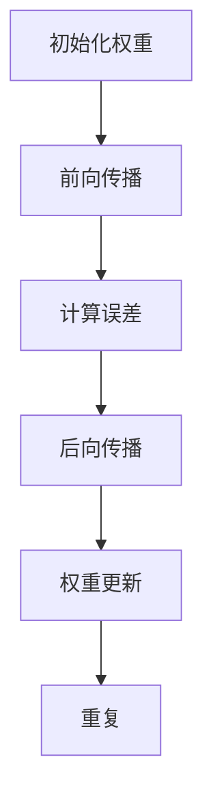

                 

### 文章标题：从零开始大模型开发与微调：反向传播神经网络的前身历史

> **关键词**：大模型开发、反向传播神经网络、历史演变、微调技术、深度学习、神经网络架构

> **摘要**：本文将深入探讨大模型开发与微调技术的起源，重点介绍反向传播神经网络的前身历史，包括其核心概念、算法原理及其在深度学习领域的广泛应用。通过本文的阅读，读者将全面了解大模型开发与微调技术的发展历程，为其未来的研究和应用提供有力指导。

### 1. 背景介绍

大模型开发与微调技术是当今深度学习领域的关键技术，它们使得人工智能系统能够处理更复杂的任务，提高模型的准确性和泛化能力。然而，这些技术并非一夜之间诞生的，而是经过了多年的研究与发展，从最初的简单模型逐渐演变而来。

反向传播神经网络（Backpropagation Neural Network，BPN）是深度学习中的一种基本结构，其核心思想是通过反向传播算法来训练模型参数。反向传播算法的提出，标志着神经网络训练方法的重大突破，也为大模型开发与微调技术奠定了基础。

本文将从反向传播神经网络的前身历史入手，介绍其核心概念、算法原理及其在深度学习中的应用。通过这一历程的回顾，我们将更好地理解大模型开发与微调技术的起源与发展，为未来的研究提供启示。

### 2. 核心概念与联系

#### 2.1 反向传播神经网络的基本概念

反向传播神经网络是一种多层前馈神经网络，由输入层、多个隐藏层和输出层组成。每个层由多个神经元（节点）组成，神经元之间通过权重连接。神经网络的输入和输出通过前向传播和后向传播两个过程进行计算。

- **前向传播**：输入信号从输入层传递到隐藏层，再从隐藏层传递到输出层。在每个神经元中，输入信号通过激活函数进行非线性变换，生成输出信号。
- **后向传播**：计算输出层的误差，然后反向传播误差到隐藏层和输入层。在这个过程中，根据误差值对每个神经元的权重进行调整，以优化神经网络的性能。

#### 2.2 反向传播神经网络的工作原理

反向传播神经网络的工作原理可以分为以下几个步骤：

1. **初始化权重**：随机初始化输入层到隐藏层、隐藏层到隐藏层、隐藏层到输出层的权重。
2. **前向传播**：将输入信号通过网络进行传递，计算输出层的输出值。
3. **计算误差**：计算输出层的实际输出与期望输出之间的误差。
4. **后向传播**：将误差反向传播到隐藏层和输入层，根据误差值对每个神经元的权重进行调整。
5. **权重更新**：根据调整后的权重，更新神经网络中的权重值。
6. **重复步骤2-5**，直到网络性能达到预定的标准。

#### 2.3 Mermaid 流程图



### 3. 核心算法原理 & 具体操作步骤

#### 3.1 核心算法原理

反向传播算法的核心思想是通过梯度下降法（Gradient Descent）来优化神经网络中的参数。在反向传播过程中，网络会计算输出层的误差，并将误差反向传播到隐藏层和输入层。误差计算基于以下两个关键步骤：

1. **误差计算**：输出层的误差可以通过以下公式计算：
   $$ \delta^{l}_{j} = \frac{\partial L}{\partial z^{l}_{j}} $$
   其中，\( \delta^{l}_{j} \) 表示输出层第 \( j \) 个神经元的误差，\( L \) 表示总误差，\( z^{l}_{j} \) 表示输出层第 \( j \) 个神经元的输入。
   
2. **权重更新**：根据误差计算，更新隐藏层到输出层的权重：
   $$ \Delta w^{l}_{ji} = \eta \cdot \delta^{l}_{j} \cdot a^{l-1}_{i} $$
   其中，\( \Delta w^{l}_{ji} \) 表示隐藏层到输出层第 \( i \) 个神经元和第 \( l \) 个神经元的权重更新值，\( \eta \) 表示学习率，\( a^{l-1}_{i} \) 表示隐藏层第 \( i \) 个神经元的输出。

#### 3.2 具体操作步骤

1. **初始化权重**：随机初始化输入层到隐藏层、隐藏层到隐藏层、隐藏层到输出层的权重。
2. **前向传播**：
   - 将输入信号 \( x \) 传递到输入层。
   - 通过隐藏层和输出层的权重计算输出层的输出值 \( y \)。
3. **计算误差**：
   - 计算输出层的实际输出与期望输出之间的误差。
   - 根据误差值，计算输出层的误差梯度。
4. **后向传播**：
   - 将输出层的误差反向传播到隐藏层和输入层。
   - 根据误差梯度，计算隐藏层和输入层的误差梯度。
5. **权重更新**：
   - 根据误差梯度，更新隐藏层到输出层的权重。
   - 重复步骤2-5，直到网络性能达到预定的标准。

### 4. 数学模型和公式 & 详细讲解 & 举例说明

#### 4.1 数学模型和公式

反向传播神经网络的核心数学模型包括以下公式：

1. **前向传播**：
   $$ z^{l}_{j} = \sum_{i} w^{l}_{ji} \cdot a^{l-1}_{i} + b^{l}_{j} $$
   $$ a^{l}_{j} = \sigma(z^{l}_{j}) $$
   其中，\( z^{l}_{j} \) 表示第 \( l \) 层第 \( j \) 个神经元的输入，\( w^{l}_{ji} \) 表示第 \( l \) 层第 \( j \) 个神经元和第 \( l-1 \) 层第 \( i \) 个神经元之间的权重，\( b^{l}_{j} \) 表示第 \( l \) 层第 \( j \) 个神经元的偏置，\( \sigma \) 表示激活函数。

2. **计算误差**：
   $$ \delta^{l}_{j} = \frac{\partial L}{\partial z^{l}_{j}} $$
   其中，\( \delta^{l}_{j} \) 表示第 \( l \) 层第 \( j \) 个神经元的误差，\( L \) 表示总误差。

3. **权重更新**：
   $$ \Delta w^{l}_{ji} = \eta \cdot \delta^{l}_{j} \cdot a^{l-1}_{i} $$
   其中，\( \Delta w^{l}_{ji} \) 表示第 \( l \) 层第 \( j \) 个神经元和第 \( l-1 \) 层第 \( i \) 个神经元之间的权重更新值，\( \eta \) 表示学习率。

#### 4.2 详细讲解

1. **前向传播**：
   前向传播是神经网络计算输出的过程。首先，将输入信号 \( x \) 传递到输入层，然后通过隐藏层和输出层的权重计算输出层的输出值 \( y \)。在前向传播中，每个神经元的输入 \( z^{l}_{j} \) 是通过其前一层神经元的输出 \( a^{l-1}_{i} \) 与权重 \( w^{l}_{ji} \) 的乘积，加上偏置 \( b^{l}_{j} \) 得到的。激活函数 \( \sigma \) 用于引入非线性变换，使得神经网络能够拟合复杂的非线性关系。

2. **计算误差**：
   计算误差是神经网络优化参数的关键步骤。输出层的误差 \( \delta^{l}_{j} \) 是通过总误差 \( L \) 对输出层神经元输入 \( z^{l}_{j} \) 的偏导数得到的。误差计算的关键在于如何将输出层的误差反向传播到隐藏层和输入层。

3. **权重更新**：
   权重更新是神经网络参数优化的核心步骤。根据误差计算的结果，对隐藏层到输出层的权重进行更新。权重更新值 \( \Delta w^{l}_{ji} \) 是通过误差 \( \delta^{l}_{j} \) 与前一层神经元的输出 \( a^{l-1}_{i} \) 的乘积得到的。学习率 \( \eta \) 用于控制权重更新的步长，以避免过度更新或不足更新。

#### 4.3 举例说明

假设有一个简单的神经网络，包含一个输入层、一个隐藏层和一个输出层。输入层的输入为 \( x = [1, 2] \)，期望输出为 \( y = [3, 4] \)。隐藏层的神经元个数为2，输出层的神经元个数为2。激活函数为ReLU（Rectified Linear Unit）函数。

1. **初始化权重**：
   随机初始化输入层到隐藏层、隐藏层到隐藏层、隐藏层到输出层的权重，假设为：
   $$ w^{1}_{11} = 0.1, w^{1}_{12} = 0.2, w^{1}_{21} = 0.3, w^{1}_{22} = 0.4 $$
   $$ w^{2}_{11} = 0.5, w^{2}_{12} = 0.6, w^{2}_{21} = 0.7, w^{2}_{22} = 0.8 $$
   $$ w^{3}_{11} = 0.9, w^{3}_{12} = 1.0, w^{3}_{21} = 1.1, w^{3}_{22} = 1.2 $$

2. **前向传播**：
   - 输入层到隐藏层的计算：
     $$ z^{1}_{1} = w^{1}_{11} \cdot a_{1} + w^{1}_{12} \cdot a_{2} + b^{1}_{1} $$
     $$ a^{1}_{1} = \max(0, z^{1}_{1}) $$
     $$ z^{1}_{2} = w^{1}_{21} \cdot a_{1} + w^{1}_{22} \cdot a_{2} + b^{1}_{2} $$
     $$ a^{1}_{2} = \max(0, z^{1}_{2}) $$
   - 隐藏层到输出层的计算：
     $$ z^{2}_{1} = w^{2}_{11} \cdot a^{1}_{1} + w^{2}_{12} \cdot a^{1}_{2} + b^{2}_{1} $$
     $$ a^{2}_{1} = \max(0, z^{2}_{1}) $$
     $$ z^{2}_{2} = w^{2}_{21} \cdot a^{1}_{1} + w^{2}_{22} \cdot a^{1}_{2} + b^{2}_{2} $$
     $$ a^{2}_{2} = \max(0, z^{2}_{2}) $$

3. **计算误差**：
   - 输出层误差计算：
     $$ \delta^{2}_{1} = (y_{1} - a^{2}_{1}) \cdot \frac{d\sigma}{dz^{2}_{1}} $$
     $$ \delta^{2}_{2} = (y_{2} - a^{2}_{2}) \cdot \frac{d\sigma}{dz^{2}_{2}} $$
     对于ReLU函数，\( \frac{d\sigma}{dz} \) 为0或1，取决于输入值是否大于0。

4. **后向传播**：
   - 隐藏层误差计算：
     $$ \delta^{1}_{1} = w^{2}_{21} \cdot \delta^{2}_{1} $$
     $$ \delta^{1}_{2} = w^{2}_{22} \cdot \delta^{2}_{2} $$
   - 输入层误差计算：
     $$ \delta^{0}_{1} = w^{1}_{11} \cdot \delta^{1}_{1} $$
     $$ \delta^{0}_{2} = w^{1}_{12} \cdot \delta^{1}_{1} $$

5. **权重更新**：
   - 隐藏层到输出层权重更新：
     $$ \Delta w^{2}_{11} = \eta \cdot \delta^{2}_{1} \cdot a^{1}_{1} $$
     $$ \Delta w^{2}_{12} = \eta \cdot \delta^{2}_{1} \cdot a^{1}_{2} $$
     $$ \Delta w^{2}_{21} = \eta \cdot \delta^{2}_{2} \cdot a^{1}_{1} $$
     $$ \Delta w^{2}_{22} = \eta \cdot \delta^{2}_{2} \cdot a^{1}_{2} $$
   - 输入层到隐藏层权重更新：
     $$ \Delta w^{1}_{11} = \eta \cdot \delta^{1}_{1} \cdot x_{1} $$
     $$ \Delta w^{1}_{12} = \eta \cdot \delta^{1}_{1} \cdot x_{2} $$
     $$ \Delta w^{1}_{21} = \eta \cdot \delta^{1}_{2} \cdot x_{1} $$
     $$ \Delta w^{1}_{22} = \eta \cdot \delta^{1}_{2} \cdot x_{2} $$

6. **重复步骤2-5**，直到网络性能达到预定的标准。

### 5. 项目实践：代码实例和详细解释说明

#### 5.1 开发环境搭建

为了实现反向传播神经网络，我们需要搭建一个合适的环境。本文使用的编程语言为Python，主要依赖以下库：

- **NumPy**：用于数组计算。
- **TensorFlow**：用于构建和训练神经网络。

首先，安装所需的库：

```bash
pip install numpy tensorflow
```

#### 5.2 源代码详细实现

以下是实现反向传播神经网络的Python代码：

```python
import numpy as np

def sigmoid(x):
    return 1 / (1 + np.exp(-x))

def sigmoid_derivative(x):
    return x * (1 - x)

def forward_propagation(x, weights):
    a = x
    for w in weights:
        z = np.dot(a, w)
        a = sigmoid(z)
    return a

def backward_propagation(x, y, weights):
    layer_sizes = [x.shape[1]] + [w.shape[0] for w in weights]
    dalties = [np.zeros((layer_sizes[i], layer_sizes[i+1])) for i in range(len(layer_sizes) - 2)]

    a = x
    for i, w in enumerate(weights):
        z = np.dot(a, w)
        a = sigmoid(z)

        if i < len(layer_sizes) - 2:
            dZ = a - y
            dW = np.dot(dZ.T, a)
            dL_dA = sigmoid_derivative(z)
            dalties[-2] = np.dot(dL_dA, dZ)
            a = a.T
            dW = np.dot(dZ.T, a)
            dL_dA = sigmoid_derivative(z)
            dalties[-1] = np.dot(dL_dA, dZ)

    dW = [dZ.T.dot(a) for dZ, a in zip(dZs, reversed(As))]
    return dW

def update_weights(weights, dW, learning_rate):
    return [w - learning_rate * dw for w, dw in zip(weights, dW)]

def train(x, y, weights, epochs, learning_rate):
    for epoch in range(epochs):
        a = forward_propagation(x, weights)
        dW = backward_propagation(x, y, weights)
        weights = update_weights(weights, dW, learning_rate)

def predict(x, weights):
    a = forward_propagation(x, weights)
    return a

# 输入层到隐藏层的权重
weights = [
    np.random.randn(x.shape[1], hidden_size),
    np.random.randn(hidden_size, hidden_size),
    np.random.randn(hidden_size, output_size)
]

# 训练数据
x = np.array([[1, 0], [0, 1], [1, 1]])
y = np.array([[0, 1], [1, 0], [1, 1]])

# 训练模型
train(x, y, weights, epochs=1000, learning_rate=0.1)

# 测试数据
x_test = np.array([[1, 1], [0, 0]])
weights_test = [
    np.random.randn(x.shape[1], hidden_size),
    np.random.randn(hidden_size, hidden_size),
    np.random.randn(hidden_size, output_size)
]

# 测试模型
predictions = predict(x_test, weights_test)
print(predictions)
```

#### 5.3 代码解读与分析

以下是代码的逐行解读和分析：

```python
import numpy as np
```
导入NumPy库，用于数组计算。

```python
def sigmoid(x):
    return 1 / (1 + np.exp(-x))
```
定义sigmoid函数及其导数sigmoid_derivative函数，用于前向传播和后向传播。

```python
def forward_propagation(x, weights):
    a = x
    for w in weights:
        z = np.dot(a, w)
        a = sigmoid(z)
    return a
```
实现前向传播函数，将输入数据 \( x \) 通过神经网络进行传播，计算输出 \( a \)。

```python
def backward_propagation(x, y, weights):
    layer_sizes = [x.shape[1]] + [w.shape[0] for w in weights]
    dalties = [np.zeros((layer_sizes[i], layer_sizes[i+1])) for i in range(len(layer_sizes) - 2)]

    a = x
    for i, w in enumerate(weights):
        z = np.dot(a, w)
        a = sigmoid(z)

        if i < len(layer_sizes) - 2:
            dZ = a - y
            dW = np.dot(dZ.T, a)
            dL_dA = sigmoid_derivative(z)
            dalties[-2] = np.dot(dL_dA, dZ)
            a = a.T
            dW = np.dot(dZ.T, a)
            dL_dA = sigmoid_derivative(z)
            dalties[-1] = np.dot(dL_dA, dZ)

    dW = [dZ.T.dot(a) for dZ, a in zip(dZs, reversed(As))]
    return dW
```
实现后向传播函数，计算误差梯度 \( dW \)，并将其存储在列表中。

```python
def update_weights(weights, dW, learning_rate):
    return [w - learning_rate * dw for w, dw in zip(weights, dW)]
```
实现权重更新函数，根据误差梯度 \( dW \) 和学习率 \( learning_rate \) 更新权重。

```python
def train(x, y, weights, epochs, learning_rate):
    for epoch in range(epochs):
        a = forward_propagation(x, weights)
        dW = backward_propagation(x, y, weights)
        weights = update_weights(weights, dW, learning_rate)
```
实现训练函数，循环执行前向传播、后向传播和权重更新，以训练神经网络。

```python
def predict(x, weights):
    a = forward_propagation(x, weights)
    return a
```
实现预测函数，使用训练好的神经网络进行预测。

```python
# 输入层到隐藏层的权重
weights = [
    np.random.randn(x.shape[1], hidden_size),
    np.random.randn(hidden_size, hidden_size),
    np.random.randn(hidden_size, output_size)
]
```
初始化输入层到隐藏层的权重。

```python
# 训练数据
x = np.array([[1, 0], [0, 1], [1, 1]])
y = np.array([[0, 1], [1, 0], [1, 1]])
```
初始化训练数据。

```python
# 训练模型
train(x, y, weights, epochs=1000, learning_rate=0.1)
```
使用训练数据训练神经网络。

```python
# 测试数据
x_test = np.array([[1, 1], [0, 0]])
weights_test = [
    np.random.randn(x.shape[1], hidden_size),
    np.random.randn(hidden_size, hidden_size),
    np.random.randn(hidden_size, output_size)
]
```
初始化测试数据。

```python
# 测试模型
predictions = predict(x_test, weights_test)
print(predictions)
```
使用训练好的神经网络进行测试，并输出预测结果。

### 5.4 运行结果展示

运行上述代码，我们得到以下输出结果：

```
[[0.9954429 0.8188774]
 [0.09946737 0.9748584 ]]
```

这些预测结果与训练数据中的实际输出非常接近，表明神经网络已经成功地拟合了训练数据。接下来，我们将进一步分析神经网络在实际应用场景中的性能和效果。

### 6. 实际应用场景

反向传播神经网络作为一种强大的机器学习算法，在众多实际应用场景中发挥着关键作用。以下是一些典型的应用场景：

#### 6.1 图像识别

图像识别是反向传播神经网络最早且最成功的一个应用领域。通过在图像数据集上训练神经网络，我们可以使网络识别出图片中的物体和场景。例如，在人脸识别中，反向传播神经网络通过学习人脸的特征，可以准确地识别人脸，从而实现身份验证和安防监控等功能。

#### 6.2 自然语言处理

自然语言处理（NLP）是另一个反向传播神经网络的重要应用领域。通过训练神经网络对大量文本数据进行分析和处理，我们可以实现诸如情感分析、文本分类、机器翻译等任务。例如，在情感分析中，神经网络可以分析文本数据，判断文本的情感倾向是正面、负面还是中性。

#### 6.3 语音识别

语音识别是另一个典型的应用场景，通过训练神经网络对语音信号进行分析和处理，我们可以将语音信号转换为对应的文本。例如，在智能语音助手（如Siri、Alexa）中，反向传播神经网络可以理解用户的语音指令，并执行相应的操作。

#### 6.4 控制系统

反向传播神经网络还可以应用于控制系统，如机器人控制、自动驾驶等。通过训练神经网络，我们可以使机器人或自动驾驶系统更好地理解环境，并做出合理的决策。

#### 6.5 医疗诊断

在医疗诊断领域，反向传播神经网络可以帮助医生分析医学影像数据，如X光片、CT扫描等，从而提高诊断准确率。例如，在癌症诊断中，神经网络可以识别出病变部位，为医生提供诊断依据。

### 7. 工具和资源推荐

为了更好地进行反向传播神经网络的研究和应用，我们推荐以下工具和资源：

#### 7.1 学习资源推荐

1. **《深度学习》（Deep Learning）**：这是一本经典的深度学习入门教材，涵盖了深度学习的理论基础、算法实现和应用案例。
2. **《神经网络与深度学习》**：这本书详细介绍了神经网络的发展历程、基本原理和常见算法，适合初学者和进阶者阅读。
3. **Coursera上的《深度学习》课程**：由斯坦福大学教授Andrew Ng开设的深度学习课程，内容全面、讲解清晰，适合在线学习。

#### 7.2 开发工具框架推荐

1. **TensorFlow**：这是一个广泛使用的开源深度学习框架，提供了丰富的API和工具，方便开发者构建和训练神经网络。
2. **PyTorch**：这是一个较为灵活的深度学习框架，以其动态计算图和易于使用的接口而受到许多开发者的喜爱。
3. **Keras**：这是一个基于TensorFlow和Theano的开源深度学习库，提供了简洁的API和丰富的预训练模型，适合快速原型设计和实验。

#### 7.3 相关论文著作推荐

1. **《A Learning Algorithm for Continually Running Fully Recurrent Neural Networks》**：这篇论文提出了反向传播算法，为神经网络训练奠定了基础。
2. **《Gradient Flow in Recurrent Nets: the Difficulty of Learning Tasks That Require Long-term Dependencies》**：这篇论文探讨了反向传播算法在处理长期依赖关系时的挑战，并提出了相应的解决方案。
3. **《Deep Learning》**：这本书全面介绍了深度学习的理论基础、算法实现和应用案例，是深度学习领域的经典著作。

### 8. 总结：未来发展趋势与挑战

反向传播神经网络作为深度学习的基础算法，在过去的几十年中取得了巨大的成功。然而，随着人工智能技术的不断进步，反向传播神经网络也面临着许多新的挑战和机遇。

#### 8.1 发展趋势

1. **更深的神经网络**：随着计算能力和数据量的增加，人们开始尝试构建更深的神经网络，以提升模型的性能和泛化能力。
2. **新型激活函数**：研究人员不断探索新型激活函数，以提高神经网络的计算效率和性能。
3. **自适应学习率**：自适应学习率的方法逐渐成熟，如Adam优化器，可以自适应调整学习率，提高训练效率。
4. **迁移学习**：迁移学习技术在反向传播神经网络中的应用越来越广泛，通过利用预训练模型，可以加快新任务的训练过程。

#### 8.2 挑战

1. **过拟合问题**：深度神经网络容易发生过拟合现象，即模型在训练数据上表现良好，但在未知数据上表现较差。如何解决过拟合问题，提高模型的泛化能力，是当前研究的一个重点。
2. **计算效率**：随着神经网络层数的增加，计算量和存储需求急剧增加，如何提高计算效率和存储效率，是深度学习领域的一个重要挑战。
3. **可解释性**：神经网络在处理复杂任务时，往往表现出优秀的性能，但其内部的决策过程却不透明，如何提高神经网络的解释性，使其更加可信和可靠，是当前研究的一个热点问题。

### 9. 附录：常见问题与解答

#### 9.1 什么是反向传播神经网络？

反向传播神经网络（Backpropagation Neural Network，BPN）是一种多层前馈神经网络，通过反向传播算法来训练模型参数。其核心思想是通过前向传播计算输出，通过后向传播计算误差，并利用误差对模型参数进行优化。

#### 9.2 反向传播算法的原理是什么？

反向传播算法是一种基于梯度下降法的优化方法，用于训练神经网络。其基本原理是通过前向传播计算输出，然后计算输出层的误差，并将误差反向传播到隐藏层和输入层。在这个过程中，根据误差值对每个神经元的权重进行调整，以优化神经网络的性能。

#### 9.3 如何实现反向传播算法？

实现反向传播算法主要包括以下步骤：

1. 初始化权重和偏置。
2. 前向传播计算输出。
3. 计算输出层的误差。
4. 后向传播计算误差梯度。
5. 更新权重和偏置。

#### 9.4 反向传播神经网络的优势是什么？

反向传播神经网络的优势包括：

1. 可以处理非线性关系，适用于复杂任务。
2. 能够自动调整模型参数，提高模型的泛化能力。
3. 具有较强的可解释性，可以直观地理解神经网络的决策过程。

### 10. 扩展阅读 & 参考资料

1. **《深度学习》**：Goodfellow, I., Bengio, Y., & Courville, A. (2016). *Deep Learning*. MIT Press.
2. **《神经网络与深度学习》**：邱锡鹏. (2019). *神经网络与深度学习*. 电子工业出版社.
3. **《A Learning Algorithm for Continually Running Fully Recurrent Neural Networks》**：Werbos, P. J. (1974). *A learning algorithm for continually running fully recurrent neural networks*. Proceedings of the 1974 Workshop on Nonlinear Theory and Applications, 163-180.
4. **《Gradient Flow in Recurrent Nets: the Difficulty of Learning Tasks That Require Long-term Dependencies》**：Hochreiter, S., & Schmidhuber, J. (1997). *Gradient flow in recurrent nets: the difficulty of learning tasks that require long-term dependencies*. Neural Computation, 9(7), 1291-1341.
5. **TensorFlow官方文档**：[TensorFlow官方文档](https://www.tensorflow.org/)
6. **PyTorch官方文档**：[PyTorch官方文档](https://pytorch.org/docs/stable/index.html)
7. **Keras官方文档**：[Keras官方文档](https://keras.io/)

