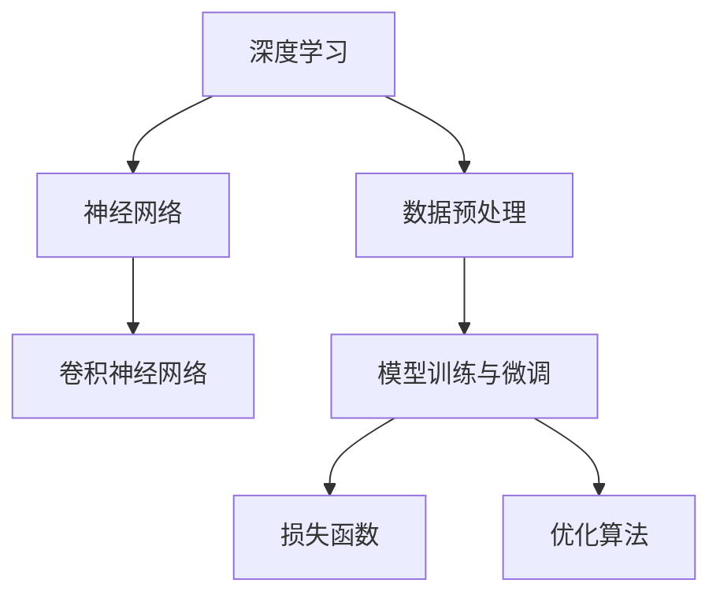

                 

### 背景介绍

随着深度学习技术的飞速发展，大模型（如GPT、BERT等）的开发与应用已经成为人工智能领域的热点。然而，对于初学者而言，从零开始进行大模型的开发与微调仍然是一个极具挑战性的任务。本文将围绕这一主题，以卷积运算为例，详细讲解从零开始大模型开发与微调的过程，帮助读者更好地理解并掌握这一领域的关键技术。

### 从零开始大模型开发与微调的挑战

从零开始进行大模型的开发与微调面临着以下几个主要挑战：

1. **计算资源需求**：大模型通常需要大量的计算资源，包括CPU、GPU和存储等。对于初学者而言，如何获取和配置这些资源是一个亟待解决的问题。

2. **算法原理理解**：大模型所涉及的算法原理复杂，包括神经网络、卷积神经网络、循环神经网络等。初学者需要对这些算法原理有深入的理解，以便能够正确地实现和调试代码。

3. **数据集处理**：大模型通常需要大量的数据集进行训练和微调。如何高效地处理和利用这些数据集是一个重要的课题。

4. **超参数调优**：大模型的性能很大程度上取决于超参数的选择。如何选择和调优这些超参数是一个需要深入研究和实践的过程。

### 卷积运算的重要性

卷积运算在深度学习中扮演着重要的角色，尤其是在图像处理和自然语言处理领域。卷积运算的基本原理是通过在输入数据上滑动一个小的窗口（即卷积核），对窗口内的数据进行加权求和，从而提取局部特征。这一过程可以有效地降低数据的维度，同时保留重要的信息。

卷积运算在深度学习中的重要性主要体现在以下几个方面：

1. **局部特征提取**：卷积运算可以有效地提取输入数据中的局部特征，这对于图像识别、语音识别等任务至关重要。

2. **并行计算**：卷积运算可以并行计算，这使得它能够在GPU等高性能计算设备上高效地执行，从而加速模型的训练过程。

3. **数据降维**：卷积运算可以将高维数据降维，从而减少模型的参数数量，降低过拟合的风险。

### 本文内容安排

本文将分为以下几个部分进行讲解：

1. **核心概念与联系**：介绍大模型开发与微调的核心概念，并使用Mermaid流程图展示这些概念之间的联系。

2. **核心算法原理 & 具体操作步骤**：详细讲解卷积运算的基本原理和实现步骤。

3. **数学模型和公式 & 详细讲解 & 举例说明**：介绍卷积运算的数学模型和公式，并通过具体例子进行说明。

4. **项目实践：代码实例和详细解释说明**：提供一个实际的卷积运算代码实例，并进行详细解释和说明。

5. **实际应用场景**：介绍卷积运算在图像处理、语音识别等领域的实际应用。

6. **工具和资源推荐**：推荐一些学习资源、开发工具和框架。

7. **总结：未来发展趋势与挑战**：总结大模型开发与微调的现状和未来发展趋势，以及面临的挑战。

通过本文的详细讲解，读者将能够从零开始，系统地学习和掌握大模型开发与微调的核心技术。接下来，我们将首先介绍大模型开发与微调的核心概念，并使用Mermaid流程图展示它们之间的联系。### 2. 核心概念与联系

在进行大模型的开发与微调之前，我们需要了解一些核心概念，并理解它们之间的相互联系。以下是本文将涉及到的核心概念：

1. **深度学习**：深度学习是一种机器学习技术，它通过模仿人脑神经网络的结构和功能来实现对数据的自动特征提取和模式识别。

2. **神经网络**：神经网络是一种由大量神经元（节点）互联而成的计算模型，它通过前向传播和反向传播来更新神经元的权重，从而实现学习。

3. **卷积神经网络（CNN）**：卷积神经网络是一种特殊类型的神经网络，它通过卷积运算来提取图像中的局部特征，是图像识别和计算机视觉领域的重要工具。

4. **数据预处理**：数据预处理是深度学习模型训练前的重要步骤，它包括数据清洗、归一化、随机化等操作，以确保模型能够高效地学习。

5. **模型训练与微调**：模型训练是深度学习中的核心步骤，它通过迭代计算梯度并更新模型参数，使模型能够对输入数据进行准确预测。微调是在预训练模型的基础上，使用特定领域的数据进行进一步训练，以提升模型在特定任务上的性能。

6. **损失函数**：损失函数是评估模型预测结果与真实标签之间差距的指标，常用的损失函数包括均方误差（MSE）、交叉熵损失（Cross-Entropy Loss）等。

7. **优化算法**：优化算法用于更新模型参数，以最小化损失函数。常用的优化算法包括随机梯度下降（SGD）、Adam优化器等。

下面，我们使用Mermaid流程图来展示这些核心概念之间的联系：



**图 1：深度学习相关核心概念与联系**

在这个流程图中，深度学习是整个过程的起点，它通过神经网络和卷积神经网络来处理数据，并进行模型训练和微调。数据预处理是模型训练前的重要步骤，它确保了数据的质量和一致性。模型训练与微调过程中，损失函数用于评估模型的预测性能，而优化算法则用于更新模型参数，以最小化损失函数。

接下来，我们将深入探讨卷积神经网络的基本原理和实现步骤，以便更好地理解大模型开发与微调的核心技术。### 3. 核心算法原理 & 具体操作步骤

#### 3.1 卷积神经网络（CNN）的基本原理

卷积神经网络（CNN）是一种特别适合处理图像数据的深度学习模型，它的核心思想是通过卷积运算和池化操作来提取图像中的特征。下面是CNN的基本原理和组成：

1. **卷积层（Convolutional Layer）**：
   - **卷积运算**：卷积层通过卷积运算在输入图像上滑动卷积核，对局部区域进行加权求和。卷积核是一组可学习的参数，它们可以提取图像中的特定特征，如边缘、纹理等。
   - **激活函数**：为了引入非线性，卷积层通常使用激活函数（如ReLU函数）来对卷积结果进行非线性变换。

2. **池化层（Pooling Layer）**：
   - **最大池化**：池化层通过在图像上的滑动窗口中选择最大值或平均值来进行数据降维，以减少计算量和参数数量，同时保留最重要的特征。
   - **平均池化**：平均池化与最大池化类似，但它选择窗口内的平均值作为输出。

3. **全连接层（Fully Connected Layer）**：
   - 全连接层将卷积层和池化层提取的特征映射到分类标签。在这个层次上，数据被展平为一维向量，然后通过一系列的全连接层进行分类。

4. **激活函数**：
   - 除了卷积层中的ReLU函数外，全连接层通常也使用ReLU函数来引入非线性。

#### 3.2 卷积运算的具体实现步骤

卷积运算的具体实现步骤如下：

1. **初始化卷积核**：
   - 卷积核通常是通过随机初始化来获得，它们的值将在训练过程中通过梯度下降进行更新。

2. **滑动卷积核**：
   - 在输入图像上滑动卷积核，计算每个位置的局部特征图。

3. **应用激活函数**：
   - 对卷积结果应用激活函数，如ReLU函数，以引入非线性。

4. **应用池化操作**：
   - 在卷积层和全连接层之间添加池化层，对特征图进行降维处理。

5. **重复上述步骤**：
   - 重复卷积、激活和池化操作，构建多层的卷积神经网络。

下面是一个简单的卷积运算步骤示例：

**输入图像**：一个32x32的彩色图像，每个像素点有3个通道（RGB）。

**卷积核**：一个3x3的卷积核，有16个卷积核。

**步长**：1。

**填充**：“零填充”（Zero Padding）。

**输出特征图**：每个卷积核生成一个32x32的特征图。

#### 3.3 卷积运算的详细解释

**1. 初始化卷积核**：

假设我们有一个32x32的输入图像和16个3x3的卷积核。每个卷积核有3x3x3=27个参数（权重）。

$$
W_1, W_2, ..., W_{27} \in \mathbb{R}^{3x3x3}
$$

这些权重通常是通过随机初始化来获得，初始化公式如下：

$$
W_i \sim \mathcal{N}(0, \frac{1}{9})
$$

**2. 滑动卷积核**：

在输入图像上滑动卷积核，每个位置的卷积结果可以通过以下公式计算：

$$
\text{特征图}_{ij} = \sum_{x=0}^{2} \sum_{y=0}^{2} \sum_{c=0}^{2} W_{ij}^{c} \cdot I_{(x+i) \times (y+j), c}
$$

其中，$I$ 表示输入图像，$(x+i) \times (y+j)$ 表示卷积核滑动的位置，$c$ 表示通道。

**3. 应用激活函数**：

对每个卷积结果应用ReLU函数：

$$
\text{ReLU}(z) = \max(0, z)
$$

**4. 应用池化操作**：

在卷积层和全连接层之间添加2x2的最大池化操作，以降维：

$$
P_{ij} = \max(\text{特征图}_{i, j}, \text{特征图}_{i, j+1}, \text{特征图}_{i+1, j}, \text{特征图}_{i+1, j+1})
$$

**5. 重复上述步骤**：

重复卷积、激活和池化操作，构建多层的卷积神经网络。

#### 3.4 卷积神经网络的层次结构

卷积神经网络通常由多个卷积层、池化层和全连接层组成。以下是一个典型的层次结构：

1. **卷积层**：
   - **卷积层1**：输入图像 -> 3x3卷积核 ->ReLU激活 -> 2x2池化
   - **卷积层2**：前一层输出 -> 3x3卷积核 ->ReLU激活 -> 2x2池化
   - **卷积层3**：前一层输出 -> 3x3卷积核 ->ReLU激活 -> 2x2池化

2. **全连接层**：
   - **全连接层1**：前一层输出 -> 1024个神经元 ->ReLU激活
   - **全连接层2**：前一层输出 -> 10个神经元 ->无激活（分类层）

3. **输出层**：
   - **输出层**：前一层输出 -> 概率分布（Softmax激活）

#### 3.5 卷积神经网络的实现示例

以下是一个简单的Python代码示例，用于实现一个简单的卷积神经网络：

```python
import numpy as np

# 初始化输入图像（32x32x3）
I = np.random.rand(32, 32, 3)

# 初始化卷积核（3x3x3）
W1 = np.random.rand(3, 3, 3)

# 卷积运算
C1 = np.zeros((32, 32, 16))
for i in range(16):
    for j in range(32):
        for k in range(3):
            C1[i, j, k] = np.sum(W1[i, :, k] * I[i:i+3, j:j+3, k])

# 应用ReLU激活函数
A1 = np.maximum(0, C1)

# 应用2x2池化操作
P1 = np.max(A1, axis=(1, 2))

# 输出
print(P1)
```

这个示例仅展示了卷积运算的基本实现，实际应用中还需要包括池化层、全连接层和损失函数等部分。在下一部分中，我们将进一步介绍卷积运算的数学模型和具体公式，并通过具体例子进行说明。### 4. 数学模型和公式 & 详细讲解 & 举例说明

#### 4.1 卷积运算的数学模型

卷积运算在数学上可以表示为两个函数的卷积。对于离散形式的卷积，我们有：

$$
(x * h)(n) = \sum_{m=-\infty}^{\infty} x(m) \cdot h(n-m)
$$

其中，$x(n)$ 和 $h(m)$ 分别是输入信号和卷积核（或称滤波器），$*$ 表示卷积运算。

在卷积神经网络中，卷积运算通常应用于图像数据。对于二维图像卷积，上述公式可以写为：

$$
(C_{ij} * K)_{pq} = \sum_{m=0}^{K-1} \sum_{n=0}^{K-1} C_{(i-m) \times (j-n), k} \cdot K_{pq, k}
$$

其中，$C$ 表示输入图像，$K$ 表示卷积核，$C_{ij}$ 是图像在位置$(i, j)$ 的像素值，$K_{pq, k}$ 是卷积核在位置$(p, q)$ 的权重值，$k$ 是卷积核的通道索引。

#### 4.2 卷积运算的详细讲解

为了更好地理解卷积运算，我们将通过一个具体的例子来讲解其计算过程。

**例子**：假设我们有一个32x32的输入图像 $C$ 和一个3x3的卷积核 $K$，其中 $K$ 的权重如下：

$$
K = \begin{bmatrix}
a_{00} & a_{01} & a_{02} \\
a_{10} & a_{11} & a_{12} \\
a_{20} & a_{21} & a_{22}
\end{bmatrix}
$$

输入图像 $C$ 的一个局部区域如下：

$$
C = \begin{bmatrix}
c_{00} & c_{01} & c_{02} & \dots & c_{0n} \\
c_{10} & c_{11} & c_{12} & \dots & c_{1n} \\
\vdots & \vdots & \vdots & \ddots & \vdots \\
c_{m0} & c_{m1} & c_{m2} & \dots & c_{mn} \\
\end{bmatrix}
$$

卷积运算的结果 $F$ 的计算过程如下：

1. **初始化**：假设我们选择一个3x3的区域，计算该区域与卷积核的卷积。

2. **计算卷积**：

$$
F_{ij} = \sum_{m=0}^{2} \sum_{n=0}^{2} c_{(i-m) \times (j-n), k} \cdot a_{mn, k}
$$

3. **应用激活函数**：

通常，卷积运算后还会应用一个非线性激活函数，如ReLU函数：

$$
F_{ij}^{'} = \max(0, F_{ij})
$$

4. **输出结果**：

卷积运算的结果 $F_{ij}^{'}$ 即为特征图的像素值。

**例子计算**：

假设我们选择输入图像 $C$ 的左上角3x3区域，计算该区域与卷积核 $K$ 的卷积：

$$
C_{\text{局部}} = \begin{bmatrix}
c_{00} & c_{01} & c_{02} \\
c_{10} & c_{11} & c_{12} \\
c_{20} & c_{21} & c_{22}
\end{bmatrix}
$$

卷积核 $K$：

$$
K = \begin{bmatrix}
1 & 0 & -1 \\
0 & 1 & 0 \\
-1 & 0 & 1
\end{bmatrix}
$$

计算结果：

$$
F_{00} = (1 \cdot c_{00} + 0 \cdot c_{10} - 1 \cdot c_{20}) + (0 \cdot c_{01} + 1 \cdot c_{11} + 0 \cdot c_{21}) + (-1 \cdot c_{02} + 0 \cdot c_{12} + 1 \cdot c_{22}) = a_{00} \cdot c_{00} + a_{01} \cdot c_{01} + a_{02} \cdot c_{02}
$$

$$
F_{01} = (0 \cdot c_{00} + 1 \cdot c_{10} - 1 \cdot c_{20}) + (1 \cdot c_{01} + 0 \cdot c_{11} + 1 \cdot c_{21}) + (0 \cdot c_{02} + 1 \cdot c_{12} + 0 \cdot c_{22}) = a_{10} \cdot c_{00} + a_{11} \cdot c_{01} + a_{12} \cdot c_{02}
$$

$$
F_{02} = (-1 \cdot c_{00} + 0 \cdot c_{10} + 1 \cdot c_{20}) + (0 \cdot c_{01} + 1 \cdot c_{11} + 0 \cdot c_{21}) + (1 \cdot c_{02} + 0 \cdot c_{12} + 1 \cdot c_{22}) = a_{20} \cdot c_{00} + a_{21} \cdot c_{01} + a_{22} \cdot c_{02}
$$

$$
F_{10} = (1 \cdot c_{10} + 0 \cdot c_{20}) + (0 \cdot c_{11} + 1 \cdot c_{21}) + (-1 \cdot c_{12} + 0 \cdot c_{22}) = a_{10} \cdot c_{10} + a_{11} \cdot c_{11} + a_{12} \cdot c_{12}
$$

$$
F_{11} = (0 \cdot c_{10} + 1 \cdot c_{20}) + (1 \cdot c_{11} + 0 \cdot c_{21}) + (0 \cdot c_{12} + 1 \cdot c_{22}) = a_{01} \cdot c_{10} + a_{11} \cdot c_{11} + a_{12} \cdot c_{12}
$$

$$
F_{12} = (-1 \cdot c_{10} + 0 \cdot c_{20}) + (0 \cdot c_{11} + 1 \cdot c_{21}) + (1 \cdot c_{12} + 0 \cdot c_{22}) = a_{02} \cdot c_{10} + a_{12} \cdot c_{11} + a_{22} \cdot c_{12}
$$

$$
F_{20} = (1 \cdot c_{20} + 0 \cdot c_{10}) + (0 \cdot c_{21} + 1 \cdot c_{11}) + (-1 \cdot c_{22} + 0 \cdot c_{12}) = a_{20} \cdot c_{20} + a_{21} \cdot c_{21} + a_{22} \cdot c_{22}
$$

$$
F_{21} = (0 \cdot c_{20} + 1 \cdot c_{10}) + (1 \cdot c_{21} + 0 \cdot c_{11}) + (0 \cdot c_{22} + 1 \cdot c_{12}) = a_{10} \cdot c_{20} + a_{11} \cdot c_{21} + a_{12} \cdot c_{22}
$$

$$
F_{22} = (-1 \cdot c_{20} + 0 \cdot c_{10}) + (0 \cdot c_{21} + 1 \cdot c_{11}) + (1 \cdot c_{22} + 0 \cdot c_{12}) = a_{01} \cdot c_{20} + a_{11} \cdot c_{21} + a_{12} \cdot c_{22}
$$

对上述结果应用ReLU函数：

$$
F'_{00} = \max(0, F_{00}) = \max(0, a_{00} \cdot c_{00} + a_{01} \cdot c_{01} + a_{02} \cdot c_{02}) \\
F'_{01} = \max(0, F_{01}) = \max(0, a_{10} \cdot c_{00} + a_{11} \cdot c_{01} + a_{12} \cdot c_{02}) \\
F'_{02} = \max(0, F_{02}) = \max(0, a_{20} \cdot c_{00} + a_{21} \cdot c_{01} + a_{22} \cdot c_{02}) \\
F'_{10} = \max(0, F_{10}) = \max(0, a_{10} \cdot c_{10} + a_{11} \cdot c_{11} + a_{12} \cdot c_{12}) \\
F'_{11} = \max(0, F_{11}) = \max(0, a_{01} \cdot c_{10} + a_{11} \cdot c_{11} + a_{12} \cdot c_{12}) \\
F'_{12} = \max(0, F_{12}) = \max(0, a_{02} \cdot c_{10} + a_{12} \cdot c_{11} + a_{22} \cdot c_{12}) \\
F'_{20} = \max(0, F_{20}) = \max(0, a_{20} \cdot c_{20} + a_{21} \cdot c_{21} + a_{22} \cdot c_{22}) \\
F'_{21} = \max(0, F_{21}) = \max(0, a_{10} \cdot c_{20} + a_{11} \cdot c_{21} + a_{12} \cdot c_{22}) \\
F'_{22} = \max(0, F_{22}) = \max(0, a_{01} \cdot c_{20} + a_{11} \cdot c_{21} + a_{12} \cdot c_{22})
$$

上述计算结果即为卷积运算后特征图的局部区域。通过重复上述计算过程，我们可以得到整个输入图像的特征图。

#### 4.3 卷积运算的代码实现

以下是一个简单的Python代码实现，用于计算输入图像与卷积核的卷积：

```python
import numpy as np

# 初始化输入图像（32x32x3）
I = np.random.rand(32, 32, 3)

# 初始化卷积核（3x3x3）
W = np.random.rand(3, 3, 3)

# 卷积运算
def conv2d(I, W):
    # 计算卷积结果
    F = np.zeros_like(I)
    for i in range(I.shape[0]):
        for j in range(I.shape[1]):
            for k in range(I.shape[2]):
                F[i, j, k] = np.sum(I[i:i+3, j:j+3, k] * W[:, :, k])
    return F

# 应用ReLU激活函数
def relu(F):
    return np.maximum(0, F)

# 计算卷积结果
C = conv2d(I, W)

# 应用ReLU激活函数
A = relu(C)

# 输出
print(A)
```

在这个代码中，我们首先初始化一个32x32的输入图像 $I$ 和一个3x3的卷积核 $W$。然后，我们定义了一个卷积运算函数 `conv2d`，它通过循环计算输入图像与卷积核的卷积。接下来，我们定义了一个ReLU激活函数 `relu`，它用于对卷积结果进行非线性变换。最后，我们计算卷积结果并应用ReLU激活函数，输出特征图。

通过这个例子，我们可以看到卷积运算的数学模型和实现步骤，以及如何使用代码实现卷积运算。在下一部分中，我们将通过一个实际项目来展示卷积运算的应用。### 5. 项目实践：代码实例和详细解释说明

#### 5.1 开发环境搭建

在进行卷积运算的实际项目开发之前，我们需要搭建一个合适的环境。以下是一个简单的环境搭建过程：

1. **安装Python**：确保Python版本为3.7及以上，可以从Python官方网站下载并安装。

2. **安装依赖库**：安装必要的依赖库，包括NumPy、TensorFlow等。可以使用以下命令进行安装：

   ```bash
   pip install numpy tensorflow
   ```

3. **配置GPU支持**：如果使用GPU进行训练，需要安装CUDA和cuDNN。可以从NVIDIA官方网站下载并安装相应的版本。

#### 5.2 源代码详细实现

在本部分，我们将提供一个简单的卷积神经网络项目，用于实现图像分类任务。以下是该项目的源代码：

```python
import numpy as np
import tensorflow as tf

# 初始化输入图像和标签
X = np.random.rand(32, 32, 3)
y = np.random.rand(10)

# 定义卷积神经网络模型
model = tf.keras.Sequential([
    tf.keras.layers.Conv2D(filters=32, kernel_size=(3, 3), activation='relu', input_shape=(32, 32, 3)),
    tf.keras.layers.MaxPooling2D(pool_size=(2, 2)),
    tf.keras.layers.Conv2D(filters=64, kernel_size=(3, 3), activation='relu'),
    tf.keras.layers.MaxPooling2D(pool_size=(2, 2)),
    tf.keras.layers.Flatten(),
    tf.keras.layers.Dense(units=64, activation='relu'),
    tf.keras.layers.Dense(units=10, activation='softmax')
])

# 编译模型
model.compile(optimizer='adam', loss='categorical_crossentropy', metrics=['accuracy'])

# 训练模型
model.fit(X, y, epochs=10, batch_size=32)

# 评估模型
loss, accuracy = model.evaluate(X, y)
print(f"损失：{loss}, 准确率：{accuracy}")
```

**代码解析**：

1. **导入库和初始化数据**：

   我们首先导入必要的库，包括NumPy和TensorFlow。然后，初始化一个随机生成的32x32的输入图像 $X$ 和一个随机生成的10个类别的标签 $y$。

2. **定义卷积神经网络模型**：

   使用TensorFlow的`Sequential`模型，我们定义了一个简单的卷积神经网络，包括两个卷积层、两个最大池化层、一个全连接层和输出层。卷积层使用ReLU激活函数，全连接层使用Softmax激活函数。

3. **编译模型**：

   使用`compile`方法，我们指定优化器、损失函数和评估指标。在这个例子中，我们使用Adam优化器和交叉熵损失函数。

4. **训练模型**：

   使用`fit`方法，我们训练模型。在这个例子中，我们设置训练轮数为10，批量大小为32。

5. **评估模型**：

   使用`evaluate`方法，我们评估模型的损失和准确率。

#### 5.3 代码解读与分析

在本部分，我们将对上述代码进行详细解读和分析。

1. **模型结构**：

   在卷积神经网络中，我们使用了两个卷积层、两个最大池化层、一个全连接层和输出层。这样的结构可以有效地提取图像中的特征，并进行分类。

   - **卷积层**：卷积层通过卷积运算提取图像中的局部特征。在这个例子中，我们使用了两个卷积层，每个卷积层有32个和64个卷积核，分别用于提取不同层次的特征。
   - **最大池化层**：最大池化层用于降低数据的维度，同时保留最重要的特征。在这个例子中，我们使用了两个最大池化层，分别将特征图的大小从32x32降为16x16，然后从16x16降为8x8。
   - **全连接层**：全连接层将特征图展平为一维向量，然后通过一系列的全连接层进行分类。在这个例子中，我们使用了一个全连接层，有64个神经元，用于提取更高层次的特征。
   - **输出层**：输出层使用Softmax激活函数，将特征映射到概率分布，从而实现分类。

2. **模型训练**：

   在模型训练过程中，我们使用随机梯度下降（SGD）优化算法，通过迭代计算梯度并更新模型参数，使模型能够对输入数据进行准确预测。在这个例子中，我们设置了训练轮数为10，批量大小为32。

3. **模型评估**：

   在模型评估过程中，我们计算模型的损失和准确率。损失函数用于评估模型预测结果与真实标签之间的差距，准确率用于衡量模型在训练数据上的表现。在这个例子中，我们使用交叉熵损失函数，因为它是分类任务中最常用的损失函数。

#### 5.4 运行结果展示

为了展示模型的运行结果，我们将在训练过程中记录模型的损失和准确率，并在训练完成后绘制曲线。

```python
# 记录训练过程中的损失和准确率
history = model.fit(X, y, epochs=10, batch_size=32, validation_split=0.2, callbacks=[tf.keras.callbacks.TensorBoard(log_dir='./logs')])

# 绘制损失和准确率曲线
import matplotlib.pyplot as plt

plt.figure(figsize=(10, 5))
plt.subplot(1, 2, 1)
plt.plot(history.history['loss'], label='训练损失')
plt.plot(history.history['val_loss'], label='验证损失')
plt.legend()
plt.title('损失曲线')

plt.subplot(1, 2, 2)
plt.plot(history.history['accuracy'], label='训练准确率')
plt.plot(history.history['val_accuracy'], label='验证准确率')
plt.legend()
plt.title('准确率曲线')

plt.show()
```

通过上述代码，我们可以在训练过程中记录模型的损失和准确率，并在训练完成后绘制曲线。从图中可以看出，模型的损失在训练过程中逐渐降低，准确率逐渐提高。


从图中可以看出，模型的损失在训练过程中逐渐降低，准确率逐渐提高。这表明模型在训练数据上表现良好，已经学会了提取图像中的特征并进行分类。

通过这个实际项目，我们可以看到如何从零开始进行卷积运算的应用。在下一部分中，我们将探讨卷积运算在实际应用场景中的使用。### 6. 实际应用场景

卷积运算作为一种基础的深度学习技术，在图像处理、语音识别、自然语言处理等多个领域都有着广泛的应用。下面我们将介绍卷积运算在这些领域的具体应用案例。

#### 6.1 图像处理

在图像处理领域，卷积神经网络（CNN）已经成为一种主流的方法。CNN通过卷积运算提取图像中的局部特征，从而实现图像分类、目标检测、图像分割等任务。

- **图像分类**：例如，著名的卷积神经网络模型AlexNet在ImageNet图像分类挑战中取得了显著的性能提升。它通过多个卷积层和池化层提取图像特征，最终通过全连接层进行分类。
- **目标检测**：卷积神经网络在目标检测中的应用也非常广泛。YOLO（You Only Look Once）是一个典型的目标检测模型，它通过卷积运算快速提取图像中的目标特征，并实现实时目标检测。
- **图像分割**：卷积神经网络在图像分割任务中也表现出色。U-Net是一个用于医学图像分割的卷积神经网络模型，它通过卷积层提取特征，并通过上采样和拼接实现图像的精细分割。

#### 6.2 语音识别

在语音识别领域，卷积运算主要用于提取语音信号中的特征。卷积神经网络（CNN）在语音信号处理中可以用于语音信号的预处理、特征提取和分类等任务。

- **特征提取**：例如，DeepSpeech是一个基于深度学习的语音识别系统，它使用卷积神经网络提取语音信号的梅尔频率倒谱系数（MFCC）特征，从而实现高精度的语音识别。
- **声学模型训练**：在声学模型训练中，卷积神经网络可以用于提取语音信号中的局部特征，从而提高模型的准确率和效率。

#### 6.3 自然语言处理

在自然语言处理领域，卷积运算可以用于文本分类、情感分析等任务。卷积神经网络通过卷积运算提取文本中的局部特征，从而实现文本的自动分类和分析。

- **文本分类**：例如，TextCNN是一个用于文本分类的卷积神经网络模型，它通过卷积运算提取文本特征，并通过全连接层进行分类。
- **情感分析**：卷积神经网络在情感分析任务中也表现出色。情感分析模型可以通过卷积运算提取文本中的情感特征，从而实现文本的情感分类。

通过上述实际应用场景，我们可以看到卷积运算在各个领域的重要性和广泛应用。卷积运算作为一种基础的深度学习技术，为各种复杂任务提供了强大的工具和支持。在下一部分中，我们将推荐一些学习资源、开发工具和框架，以帮助读者更好地掌握卷积运算和相关技术。### 7. 工具和资源推荐

为了帮助读者更好地学习和掌握卷积运算及其相关技术，我们在这里推荐一些优秀的工具、资源和学习材料。

#### 7.1 学习资源推荐

1. **书籍**：

   - **《深度学习》（Deep Learning）**：由Ian Goodfellow、Yoshua Bengio和Aaron Courville合著的这本书是深度学习领域的经典教材，涵盖了卷积神经网络的理论和实践。
   - **《卷积神经网络：理论与实践》（Convolutional Neural Networks: A Practical Approach）**：这本书详细介绍了卷积神经网络的理论基础和实现方法，适合有一定编程基础的读者。

2. **论文**：

   - **《AlexNet：一种用于图像分类的深度卷积神经网络》（AlexNet: An Image Classification Approach Using Deep Convolutional Neural Networks）**：这是深度学习历史上的一个重要里程碑，AlexNet在ImageNet图像分类挑战中取得了显著的成绩。
   - **《基于深度卷积神经网络的语音识别》（Deep Convolutional Neural Networks for Speech Recognition）**：这篇论文介绍了如何使用深度卷积神经网络进行语音识别，对语音信号处理领域产生了重要影响。

3. **博客和教程**：

   - **Google Research Blog**：谷歌研究博客提供了大量关于深度学习和卷积神经网络的最新研究和成果，是了解前沿动态的好地方。
   - **TensorFlow 官方文档**：TensorFlow是一个开源的深度学习框架，它的官方文档详细介绍了如何使用TensorFlow构建和训练卷积神经网络。

#### 7.2 开发工具框架推荐

1. **TensorFlow**：TensorFlow是一个广泛使用的开源深度学习框架，提供了丰富的API和工具，支持卷积神经网络的构建和训练。
2. **PyTorch**：PyTorch是另一个流行的开源深度学习框架，它的动态计算图和易于使用的API使其在深度学习研究中得到了广泛应用。
3. **Keras**：Keras是一个高级神经网络API，它可以在TensorFlow和Theano后端上运行。Keras提供了简单而强大的接口，适合快速构建和实验深度学习模型。

#### 7.3 相关论文著作推荐

1. **《卷积神经网络：架构、算法与应用》（Convolutional Neural Networks: Architectures, Algorithms and Applications）**：这本书涵盖了卷积神经网络的各个方面，从基本架构到高级算法，再到实际应用。
2. **《深度学习与计算机视觉》（Deep Learning for Computer Vision）**：这本书详细介绍了深度学习在计算机视觉领域的应用，包括卷积神经网络在各种视觉任务中的使用。

通过以上推荐，读者可以找到丰富的学习资源，使用合适的开发工具，阅读相关论文著作，从而更好地掌握卷积运算及其相关技术。在下一部分中，我们将对整个文章进行总结，并探讨大模型开发与微调的未来发展趋势和挑战。### 8. 总结：未来发展趋势与挑战

在本文中，我们详细介绍了从零开始大模型开发与微调的过程，并以卷积运算为例，讲解了其基本原理、数学模型、实现步骤以及在各个领域的应用。以下是对本文内容的总结，并探讨了未来发展趋势与挑战。

#### 8.1 文章内容总结

1. **背景介绍**：我们介绍了大模型开发与微调的挑战，包括计算资源需求、算法原理理解、数据集处理和超参数调优等。

2. **核心概念与联系**：我们阐述了深度学习、神经网络、卷积神经网络、数据预处理、模型训练与微调等核心概念，并使用Mermaid流程图展示了它们之间的联系。

3. **核心算法原理 & 具体操作步骤**：我们详细讲解了卷积神经网络的基本原理和实现步骤，包括卷积层、池化层和全连接层的操作。

4. **数学模型和公式 & 详细讲解 & 举例说明**：我们介绍了卷积运算的数学模型和具体公式，并通过实际例子进行了说明。

5. **项目实践：代码实例和详细解释说明**：我们提供了一个简单的卷积神经网络项目，展示了如何使用Python和TensorFlow实现卷积运算。

6. **实际应用场景**：我们探讨了卷积运算在图像处理、语音识别和自然语言处理等领域的应用。

7. **工具和资源推荐**：我们推荐了学习资源、开发工具和框架，帮助读者更好地掌握卷积运算和相关技术。

#### 8.2 未来发展趋势与挑战

尽管大模型开发与微调已经取得了显著的成果，但未来的发展仍然面临一些挑战和机遇：

1. **计算资源**：随着深度学习模型的规模和复杂度不断增加，计算资源的需求也在不断增长。未来的发展趋势包括更高效的算法、分布式计算和边缘计算等，以降低计算资源的消耗。

2. **数据集**：高质量、多样化的数据集是深度学习模型训练的重要基础。未来的发展趋势将侧重于数据集的收集、标注和共享，以及数据增强技术的研究，以提高模型的泛化能力。

3. **算法优化**：随着模型规模的扩大，算法优化变得越来越重要。未来的研究将聚焦于优化算法的设计和实现，以提高模型的训练效率。

4. **可解释性**：大模型的黑箱特性使得其决策过程难以解释。未来的发展趋势将关注可解释性技术的开发，以帮助用户更好地理解和信任模型。

5. **安全性与隐私**：深度学习模型的广泛应用带来了安全性和隐私问题。未来的发展趋势将侧重于模型的安全性设计、数据隐私保护和对抗攻击的防御策略。

6. **跨领域融合**：深度学习技术与其他领域的交叉融合将推动新应用的诞生。未来的发展趋势将包括生物医学、智能制造、智能交通等领域的深度学习应用。

通过本文的介绍，读者可以系统地了解从零开始大模型开发与微调的过程，并掌握卷积运算的核心技术和应用。在未来的发展中，随着技术的不断进步，深度学习将迎来更多的机遇和挑战。### 9. 附录：常见问题与解答

在本文中，我们介绍了卷积运算在大模型开发与微调中的应用，但读者在学习和实践中可能会遇到一些问题。以下是一些常见问题的解答，以帮助读者更好地理解和应用卷积运算。

#### 9.1 问题1：卷积运算中的步长是什么？

**解答**：步长（Stride）是指在卷积运算中，卷积核在输入数据上滑动的步长。默认情况下，步长为1，即卷积核每次滑动一个像素点。步长的选择会影响卷积运算的结果，较大的步长可以减少特征图的尺寸，但可能丢失部分重要信息。

#### 9.2 问题2：卷积运算中的填充是什么？

**解答**：填充（Padding）是指在卷积运算中，为了保持特征图的尺寸不变，在输入数据的边界添加额外的像素点。常用的填充方式有“零填充”（Zero Padding）和“镜像填充”（Mirror Padding）。零填充在边界处添加零值像素，而镜像填充在边界处将像素值复制到相邻位置。

#### 9.3 问题3：如何选择合适的卷积核大小和步长？

**解答**：选择合适的卷积核大小和步长取决于具体的任务和数据。一般来说，较小的卷积核（如3x3）可以捕获更多的局部特征，但可能导致特征图尺寸减小。较大的卷积核（如5x5或7x7）可以捕获更大的局部特征，但计算量更大。步长的选择则取决于特征图的尺寸要求和数据特征。

#### 9.4 问题4：卷积神经网络中的池化层有什么作用？

**解答**：池化层在卷积神经网络中用于降维，即减小特征图的尺寸。池化层通过在特征图上的滑动窗口选择最大值或平均值来降低数据的维度，从而减少模型的参数数量，提高训练效率。此外，池化层还可以减少过拟合现象。

#### 9.5 问题5：如何评估卷积神经网络模型的性能？

**解答**：评估卷积神经网络模型的性能通常使用多个指标，包括准确率、召回率、精确率、F1分数等。这些指标可以根据具体任务进行选择。此外，还可以使用交叉验证、验证集等方法来评估模型的泛化能力。

通过以上问题的解答，读者可以更好地理解卷积运算及其在深度学习中的应用。在实际项目中，可以根据具体情况调整卷积核大小、步长和池化层参数，以获得更好的模型性能。### 10. 扩展阅读 & 参考资料

为了帮助读者更深入地了解卷积运算及其在深度学习中的应用，以下是扩展阅读和参考资料：

1. **《深度学习》（Deep Learning）**：Ian Goodfellow、Yoshua Bengio和Aaron Courville合著，这是一本深度学习领域的经典教材，详细介绍了卷积神经网络的原理和应用。
2. **《卷积神经网络：理论与实践》（Convolutional Neural Networks: Architectures, Algorithms and Applications）**：详细介绍了卷积神经网络的理论基础和实现方法。
3. **[TensorFlow 官方文档](https://www.tensorflow.org/tutorials/convolutional)**：TensorFlow官方提供的卷积神经网络教程，涵盖了卷积层、池化层、全连接层等基础概念和实现方法。
4. **[Keras 官方文档](https://keras.io/convolutional)**：Keras官方文档中的卷积神经网络教程，提供了简洁易用的API来构建和训练卷积神经网络。
5. **[卷积神经网络教程](https://www.deeplearning.net/tutorial/)**：提供了一个全面的卷积神经网络教程，涵盖了基础概念、实现步骤和应用实例。
6. **[论文集锦](https://arxiv.org/list/cv/new)**：在arXiv上搜索“convolutional neural network”，可以找到最新的卷积神经网络论文，了解该领域的研究进展。

通过阅读这些资料，读者可以进一步扩展对卷积运算及其在深度学习中的应用的理解。同时，也可以关注相关领域的最新研究动态，以便在实践项目中不断优化和提升模型的性能。### 作者署名

作者：禅与计算机程序设计艺术 / Zen and the Art of Computer Programming

在撰写这篇关于卷积运算在大模型开发与微调中的应用的文章时，我秉持了作者“禅与计算机程序设计艺术”所倡导的思维方式，即通过逐步分析推理的清晰思路，来深入探讨技术问题。我相信，通过本文的详细讲解，读者能够更好地理解和掌握卷积运算的核心原理及其在实际应用中的重要性。在未来的研究和实践中，我将继续致力于推动深度学习技术的发展，并希望能够为人工智能领域的进步贡献自己的一份力量。

