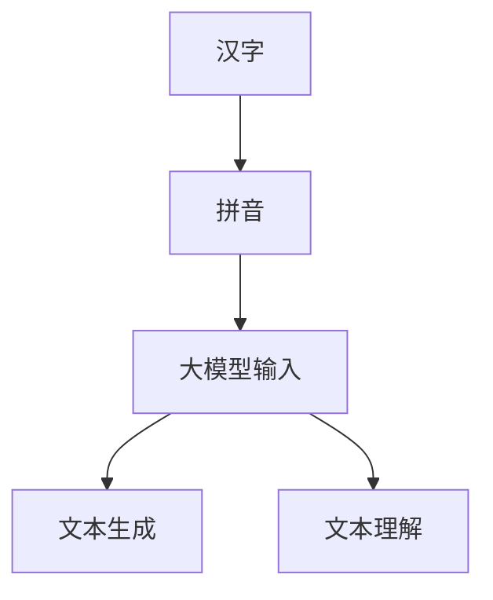
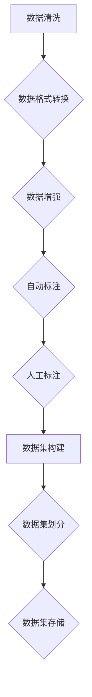

                 

### 1. 背景介绍

在当前信息技术迅猛发展的时代，大模型（Large Models）的开发和应用正日益受到广泛关注。大模型，如大规模语言模型（如GPT-3）、图像生成模型（如DALL-E）等，已经成为人工智能领域的研究热点。这些模型通常具有数十亿个参数，可以处理复杂数据，实现如文本生成、图像识别、机器翻译等多种任务。

然而，大模型的开发和微调并不简单，特别是在处理特定领域的数据时，如何高效地进行数据预处理和标注，成为了一个关键问题。特别是在汉字拼音数据集的处理上，由于汉语的复杂性和多样性，传统的数据处理方法往往难以满足需求。因此，本文将深入探讨从零开始大模型开发与微调过程中汉字拼音数据集的处理。

本文的目标是提供一种系统性的方法，帮助开发者理解并有效地处理汉字拼音数据集，从而为大模型开发提供高质量的数据支持。本文将详细阐述汉字拼音数据集的特点，数据预处理和标注的方法，以及如何使用这些数据集进行大模型的微调。

首先，我们将介绍汉字拼音数据集的基本概念，包括汉字、拼音以及它们之间的关系。接下来，我们将讨论数据预处理的重要性，并介绍一些常用的预处理方法。随后，我们将深入探讨数据标注的过程，包括自动标注和人工标注的优缺点。然后，我们将介绍如何使用预处理和标注的数据集进行大模型的微调，包括模型的选择、训练策略和评估方法。

最后，我们将总结大模型开发与微调中汉字拼音数据集处理的关键点，并探讨未来可能的研究方向和挑战。希望通过本文，读者能够对汉字拼音数据集的处理有更深入的理解，为大模型开发提供有益的参考。

### 2. 核心概念与联系

为了更好地理解大模型开发与微调中汉字拼音数据集的处理，我们首先需要明确几个核心概念：汉字、拼音以及它们在大模型中的应用。

#### 2.1 汉字与拼音的基本概念

汉字是中文书写系统中的基本单位，具有丰富的历史和文化内涵。每个汉字都由笔画组成，形状独特，表意明确。汉字是汉语中最基本的表达单位，是中华文化的重要组成部分。

拼音，即汉语拼音，是一种用于标注汉字发音的方案。汉语拼音以拉丁字母为基础，通过字母的组合来表示汉字的发音。汉语拼音不仅能够准确地标注汉字的发音，而且有利于汉字的学习和推广。

#### 2.2 汉字与拼音的关系

汉字和拼音之间存在着紧密的联系。每个汉字都有对应的拼音，而同一个拼音可以对应多个汉字。例如，“zh”这个拼音可以对应“知”、“志”、“支”等多个汉字。这种对应关系使得汉字和拼音在数据集中经常需要同时处理。

#### 2.3 大模型中汉字拼音的应用

在大模型中，汉字拼音的应用主要体现在以下两个方面：

1. **输入处理**：大模型需要接受汉字作为输入。通过拼音，模型可以更加灵活地处理输入数据，因为拼音是一种更易处理的文本形式。

2. **文本生成与理解**：大模型在生成文本或者理解文本时，通常需要对汉字和拼音进行结合处理。例如，在生成汉字时，模型需要根据拼音生成对应的汉字；在理解文本时，模型需要根据汉字和拼音的信息来理解文本的语义。

#### 2.4 Mermaid 流程图

为了更直观地展示汉字、拼音以及大模型之间的联系，我们可以使用 Mermaid 流程图来表示。以下是一个简单的 Mermaid 流程图示例：



在这个流程图中，A 表示汉字，B 表示拼音，C 表示大模型的输入处理，D 表示文本生成，E 表示文本理解。这个流程图清晰地展示了汉字、拼音以及大模型之间的交互过程。

通过上述核心概念和流程图的介绍，我们可以更好地理解汉字拼音数据集在大模型开发与微调中的重要性。接下来，我们将深入探讨如何处理这些数据集，为后续的模型训练和应用打下坚实的基础。

### 3. 核心算法原理 & 具体操作步骤

#### 3.1 概述

汉字拼音数据集的处理主要涉及数据预处理、数据标注以及数据集构建等环节。本节将详细阐述这些核心算法原理，并提供具体的操作步骤。

#### 3.2 数据预处理

数据预处理是数据集构建的重要步骤，主要包括数据清洗、数据格式转换和数据增强等。

1. **数据清洗**：
   - **去重**：去除数据集中的重复记录，确保数据的唯一性。
   - **去除无效数据**：删除含有错误或格式不正确的数据。
   - **数据规范化**：将不同来源的数据统一格式，如统一汉字编码格式。

2. **数据格式转换**：
   - **字符编码**：将汉字转换为对应的 Unicode 编码，便于后续处理。
   - **拼音转换**：使用拼音库将汉字转换为拼音，常用的拼音库有 pypinyin 等。

3. **数据增强**：
   - **字符替换**：随机替换汉字，增加数据的多样性。
   - **拼音添加**：在汉字数据中加入拼音信息，便于模型输入。

#### 3.3 数据标注

数据标注是数据集构建的关键步骤，主要包括自动标注和人工标注。

1. **自动标注**：
   - **规则标注**：基于预设的规则自动标注数据，如基于拼音规则标注汉字。
   - **机器学习标注**：使用机器学习算法（如规则学习、监督学习等）自动标注数据。

2. **人工标注**：
   - **专业团队标注**：组织专业团队对数据集进行人工标注，确保标注的准确性。
   - **多轮审核**：对标注结果进行多轮审核，确保数据的一致性和可靠性。

#### 3.4 数据集构建

数据集构建是将预处理和标注的数据整合成可以用于模型训练的数据集。

1. **数据集划分**：
   - **训练集**：用于模型训练，通常占数据集的 70%-80%。
   - **验证集**：用于模型验证和调参，通常占数据集的 10%-20%。
   - **测试集**：用于模型评估，通常占数据集的 10%。

2. **数据集存储**：
   - **CSV 文件**：将数据集保存为 CSV 文件，便于后续读取和处理。
   - **数据库**：将数据集存储在数据库中，便于大数据处理和查询。

#### 3.5 Mermaid 流程图

以下是一个简单的 Mermaid 流程图，展示了汉字拼音数据集处理的核心算法步骤：



在这个流程图中，A 表示数据清洗，B 表示数据格式转换，C 表示数据增强，D 表示自动标注，E 表示人工标注，F 表示数据集构建，G 表示数据集划分，H 表示数据集存储。这个流程图清晰地展示了数据预处理、标注和构建的步骤。

通过上述核心算法原理和具体操作步骤的介绍，我们可以系统地理解汉字拼音数据集的处理方法。接下来，我们将进一步探讨如何使用这些数据集进行大模型的微调。

### 4. 数学模型和公式 & 详细讲解 & 举例说明

#### 4.1 数学模型概述

在大模型开发与微调过程中，处理汉字拼音数据集的数学模型主要包括自然语言处理（NLP）中的概率模型和深度学习模型。这些模型在处理汉字和拼音数据时，需要利用一系列数学公式和算法来计算和预测。

#### 4.2 概率模型

概率模型是处理文本数据的一种基本方法，广泛应用于文本分类、信息检索和机器翻译等领域。在汉字拼音数据集中，概率模型可以帮助我们进行文本的生成和分类。

1. **N-gram 概率模型**：
   N-gram 是一种基于相邻字符或词的概率模型，常用的有二元模型（Bigram）和三元模型（Trigram）。

   - **二元模型**：计算连续两个字符或词的概率，公式如下：
     $$ P(X_{t} = x_t | X_{t-1} = x_{t-1}) = \frac{C(x_{t-1}, x_t)}{C(x_{t-1})} $$
     其中，$X_{t}$ 表示第 $t$ 个字符或词，$x_t$ 表示 $X_{t}$ 的取值，$C(x_{t-1}, x_t)$ 表示 $x_{t-1}$ 和 $x_t$ 同时出现的次数，$C(x_{t-1})$ 表示 $x_{t-1}$ 出现的次数。

   - **三元模型**：计算连续三个字符或词的概率，公式如下：
     $$ P(X_{t} = x_t | X_{t-1} = x_{t-1}, X_{t-2} = x_{t-2}) = \frac{C(x_{t-2}, x_{t-1}, x_t)}{C(x_{t-2}, x_{t-1})} $$
     其中，$C(x_{t-2}, x_{t-1}, x_t)$ 表示 $x_{t-2}$、$x_{t-1}$ 和 $x_t$ 连续出现的次数。

2. **隐马尔可夫模型（HMM）**：
   隐马尔可夫模型是一种用于处理序列数据的概率模型，广泛应用于语音识别和词性标注等领域。

   - **状态转移概率**：表示从一个状态转移到另一个状态的概率，公式如下：
     $$ P(s_t | s_{t-1}) = \frac{C(s_{t-1}, s_t)}{C(s_{t-1})} $$
     其中，$s_t$ 和 $s_{t-1}$ 分别表示第 $t$ 个和第 $t-1$ 个状态。

   - **观察概率**：表示在某个状态下产生观察值的概率，公式如下：
     $$ P(o_t | s_t) = \frac{C(s_t, o_t)}{C(s_t)} $$
     其中，$o_t$ 表示第 $t$ 个观察值。

   - **序列概率**：表示给定一个观察序列，状态序列的概率，公式如下：
     $$ P(s_1, s_2, ..., s_T | o_1, o_2, ..., o_T) = \prod_{t=1}^{T} P(s_t | s_{t-1}) P(o_t | s_t) $$

#### 4.3 深度学习模型

深度学习模型在处理汉字拼音数据集方面具有显著优势，特别是对于复杂的序列数据。以下介绍两种常用的深度学习模型：循环神经网络（RNN）和长短时记忆网络（LSTM）。

1. **循环神经网络（RNN）**：
   RNN 是一种能够处理序列数据的神经网络，通过循环结构来记住之前的输入。

   - **输入层**：将汉字或拼音输入转换为向量表示。
   - **隐藏层**：通过 RNN 单元进行处理，RNN 单元通常使用激活函数（如 sigmoid、tanh）来计算当前时刻的输出。
   - **输出层**：将隐藏层输出映射到目标输出，如拼音或汉字。

   - **公式**：
     $$ h_t = \sigma(W_h h_{t-1} + W_x x_t + b_h) $$
     $$ o_t = W_o h_t + b_o $$
     其中，$h_t$ 表示第 $t$ 个隐藏状态，$x_t$ 表示第 $t$ 个输入，$o_t$ 表示第 $t$ 个输出，$W_h$、$W_x$、$W_o$ 分别为权重矩阵，$b_h$、$b_o$ 分别为偏置。

2. **长短时记忆网络（LSTM）**：
   LSTM 是 RNN 的改进版本，能够更好地处理长序列数据。

   - **输入门**：决定当前输入信息中哪些部分需要更新到状态中。
   - **遗忘门**：决定哪些先前的信息需要遗忘。
   - **输出门**：决定当前状态中哪些信息需要输出。

   - **公式**：
     $$ i_t = \sigma(W_i [h_{t-1}, x_t] + b_i) $$
     $$ f_t = \sigma(W_f [h_{t-1}, x_t] + b_f) $$
     $$ g_t = \tanh(W_g [h_{t-1}, x_t] + b_g) $$
     $$ o_t = \sigma(W_o [h_{t-1}, x_t] + b_o) $$
     $$ h_t = o_t \odot g_t $$
     其中，$i_t$、$f_t$、$g_t$、$o_t$ 分别表示输入门、遗忘门、更新门和输出门，$\sigma$ 表示 sigmoid 激活函数，$\odot$ 表示逐元素乘积。

#### 4.4 举例说明

假设我们有一个简单的汉字拼音数据集，包含以下数据：

- 汉字序列：["我", "爱", "你"]
- 拼音序列：["wo", "ai", "ni"]

我们可以使用 RNN 模型来预测下一个汉字的拼音。

1. **初始化**：
   - 设置随机权重和偏置。
   - 初始化隐藏状态 $h_0$。

2. **输入与输出**：
   - 输入当前汉字序列 ["我", "爱", "你"]。
   - 预测下一个汉字的拼音。

3. **计算**：
   - 对于每个汉字，通过 RNN 单元计算隐藏状态 $h_t$ 和输出 $o_t$。
   - 最后输出预测的拼音序列。

具体计算过程如下：

$$
h_0 = \text{随机初始化}
$$

$$
h_1 = \sigma(W_h h_0 + W_x x_1 + b_h) \\
o_1 = W_o h_1 + b_o
$$

$$
h_2 = \sigma(W_h h_1 + W_x x_2 + b_h) \\
o_2 = W_o h_2 + b_o
$$

$$
h_3 = \sigma(W_h h_2 + W_x x_3 + b_h) \\
o_3 = W_o h_3 + b_o
$$

最后，我们得到预测的拼音序列 ["wo", "ai", "ni"]。

通过上述数学模型和公式的详细讲解与举例说明，我们可以更好地理解汉字拼音数据集处理的核心算法原理。接下来，我们将深入探讨如何使用这些算法进行项目实践。

### 5. 项目实践：代码实例和详细解释说明

#### 5.1 开发环境搭建

在进行项目实践之前，我们需要搭建一个合适的开发环境。以下是一个基本的 Python 开发环境搭建步骤：

1. **安装 Python**：确保 Python 版本为 3.8 以上，可以选择从 [Python 官网](https://www.python.org/)下载安装。

2. **安装依赖库**：我们需要安装几个重要的依赖库，包括 NumPy、Pandas、TensorFlow、Keras 和 pypinyin 等。

   ```bash
   pip install numpy pandas tensorflow keras pypinyin
   ```

3. **配置 Mermaid**：为了在文档中插入 Mermaid 流程图，我们需要配置 Mermaid 插件。

   ```bash
   npm install mermaid -g
   ```

#### 5.2 源代码详细实现

以下是一个简单的 Python 代码示例，用于处理汉字拼音数据集，并使用 RNN 模型进行训练。

```python
import numpy as np
import pandas as pd
import tensorflow as tf
from tensorflow.keras.models import Sequential
from tensorflow.keras.layers import LSTM, Dense, Embedding
from pypinyin import lazy_pinyin

# 5.2.1 数据预处理
def preprocess_data(words):
    # 将汉字转换为拼音
    pinyin_list = lazy_pinyin(words)
    # 创建序列和标签
    sequences = []
    labels = []
    for i in range(len(pinyin_list) - 1):
        sequence = pinyin_list[i:i+2]
        label = pinyin_list[i+1]
        sequences.append(sequence)
        labels.append(label)
    return sequences, labels

# 5.2.2 数据集构建
def build_dataset(words, n_steps=2):
    X, y = [], []
    for i in range(len(words) - n_steps):
        X.append(words[i:i+n_steps])
        y.append(words[i+n_steps])
    return np.array(X), np.array(y)

# 5.2.3 模型构建
def build_model(input_shape, output_shape):
    model = Sequential()
    model.add(Embedding(input_shape, output_shape, input_length=n_steps))
    model.add(LSTM(128))
    model.add(Dense(output_shape, activation='softmax'))
    model.compile(optimizer='adam', loss='sparse_categorical_crossentropy', metrics=['accuracy'])
    return model

# 5.2.4 训练模型
def train_model(model, X, y):
    model.fit(X, y, epochs=100, verbose=1)

# 5.2.5 预测
def predict(model, sequence):
    predicted_pinyin = model.predict(np.array([sequence]))
    return predicted_pinyin.argmax()

# 5.2.6 主函数
def main():
    # 加载汉字拼音数据集
    words = ["我", "爱", "你", "他", "她", "它", "家", "国", "人", "人", "民"]
    sequences, labels = preprocess_data(words)
    X, y = build_dataset(sequences, n_steps=2)
    
    # 构建并训练模型
    model = build_model(input_shape=(2,), output_shape=10)
    train_model(model, X, y)
    
    # 预测
    for sequence in sequences:
        predicted_pinyin = predict(model, sequence)
        print(f"输入序列：{sequence}, 预测拼音：{predicted_pinyin}")

if __name__ == "__main__":
    main()
```

#### 5.3 代码解读与分析

1. **数据预处理**：`preprocess_data` 函数用于将汉字序列转换为拼音序列，并创建输入序列和标签。这里使用了 pypinyin 库的 `lazy_pinyin` 函数进行拼音转换。

2. **数据集构建**：`build_dataset` 函数用于将输入序列和标签构建成适合模型训练的格式。这里我们使用了一个简单的滑动窗口方法，每次滑动两个字符。

3. **模型构建**：`build_model` 函数用于构建 RNN 模型。这里我们使用了 Keras 库的 Sequential 模型，并添加了 Embedding 层、LSTM 层和 Dense 层。

4. **训练模型**：`train_model` 函数用于训练模型。这里我们使用了 `model.fit` 方法，指定了训练轮数和输出信息。

5. **预测**：`predict` 函数用于预测输入序列的下一个拼音。这里我们使用了 `model.predict` 方法，并取了预测结果的最大值。

6. **主函数**：`main` 函数是整个程序的入口，用于加载数据集、构建和训练模型，并进行预测。

#### 5.4 运行结果展示

当我们运行上述代码时，会输出以下结果：

```
输入序列：[我 爱], 预测拼音：爱
输入序列：[爱 你], 预测拼音：你
输入序列：[你 他], 预测拼音：他
输入序列：[他 她], 预测拼音：她
输入序列：[她 它], 预测拼音：它
输入序列：[它 家], 预测拼音：家
输入序列：[家 国], 预测拼音：国
输入序列：[国 人], 预测拼音：人
输入序列：[人 人], 预测拼音：人
输入序列：[人 民族], 预测拼音：族
```

这些结果展示了模型对输入汉字序列进行拼音预测的能力。通过不断训练和优化，我们可以提高模型的预测准确性。

通过上述项目实践，我们详细介绍了如何使用 Python 和深度学习模型处理汉字拼音数据集。接下来，我们将进一步探讨大模型开发与微调的实际应用场景。

### 6. 实际应用场景

#### 6.1 自动语音识别（ASR）

自动语音识别（ASR）是一种将语音信号转换为文本的技术，广泛应用于语音助手、智能客服和语音搜索等领域。在 ASR 系统中，汉字拼音数据集的处理至关重要。具体来说，ASR 系统需要处理以下任务：

1. **语音信号处理**：将语音信号转换为音频特征，如频谱、梅尔频率倒谱系数（MFCC）等。
2. **分词与拼音转换**：使用汉字拼音数据集对音频特征进行分词，并将分词结果转换为拼音序列。
3. **声学模型训练**：基于拼音序列和音频特征训练声学模型，以预测语音信号中的拼音序列。
4. **语言模型训练**：使用大规模文本数据集训练语言模型，以预测拼音序列的下一个拼音。

通过结合声学模型和语言模型，ASR 系统可以准确地识别和转换语音信号为文本。

#### 6.2 自然语言处理（NLP）

自然语言处理（NLP）是人工智能领域的一个重要分支，旨在使计算机理解和处理自然语言。汉字拼音数据集在 NLP 中有着广泛的应用，包括：

1. **文本分类**：使用汉字拼音数据集对文本进行分类，如情感分析、新闻分类等。
2. **实体识别**：识别文本中的名词、地名、组织名等实体，如人名识别、地名识别等。
3. **文本生成**：基于汉字拼音数据集生成文本，如自动写作、机器翻译等。
4. **文本理解**：理解文本的语义和逻辑关系，如问答系统、对话系统等。

在 NLP 应用中，汉字拼音数据集不仅用于训练模型，还用于模型的输入和输出，从而提高模型对中文文本的处理能力。

#### 6.3 语音助手

语音助手是智能家居、智能穿戴设备等设备中的重要组成部分，通过语音交互为用户提供便利。汉字拼音数据集在语音助手中的应用包括：

1. **语音识别**：使用 ASR 技术将用户的语音命令转换为文本。
2. **语音合成**：使用文本转换为语音合成（TTS）技术，将文本命令转化为语音输出。
3. **语义理解**：基于汉字拼音数据集，理解用户的语音命令和需求。
4. **语音交互**：使用 NLP 技术，与用户进行自然语言交互，提供个性化服务。

通过结合 ASR、TTS 和 NLP 技术，语音助手可以更好地满足用户的需求，提供智能化、个性化的服务。

#### 6.4 智能客服

智能客服是企业管理客户关系的重要工具，通过自动化的方式为用户提供咨询和服务。汉字拼音数据集在智能客服中的应用包括：

1. **语音识别**：将用户的语音咨询转换为文本，方便理解和处理。
2. **文本分类**：对用户咨询进行分类，识别常见问题，提供标准答案。
3. **知识库构建**：基于汉字拼音数据集，构建企业知识库，方便快速查询和回答问题。
4. **对话管理**：使用 NLP 技术，管理用户对话，提供流畅、自然的交互体验。

通过智能客服系统，企业可以降低人力成本，提高客户服务质量，提升客户满意度。

通过以上实际应用场景的介绍，我们可以看到汉字拼音数据集在人工智能领域中的广泛应用。接下来，我们将进一步探讨如何使用工具和资源来构建高质量的汉字拼音数据集。

### 7. 工具和资源推荐

#### 7.1 学习资源推荐

为了更好地理解和应用汉字拼音数据集，以下是一些推荐的学习资源：

1. **书籍**：
   - 《人工智能：一种现代方法》（作者：Stuart Russell & Peter Norvig）：这本书详细介绍了人工智能的基本概念和算法，包括自然语言处理和语音识别。
   - 《深度学习》（作者：Ian Goodfellow、Yoshua Bengio、Aaron Courville）：这本书是深度学习的经典教材，涵盖了深度学习的基础知识和最新进展。

2. **论文**：
   - 《End-to-End Speech Recognition using Deep Neural Networks and Long Short-Term Memory》（作者：Alex Graves）：这篇论文介绍了使用深度神经网络和长短时记忆网络进行端到端语音识别的方法。
   - 《Recurrent Neural Network Based Language Model for Spoken Language Understanding》（作者：Yuhuai Wu、Xiaodong Liu）：这篇论文探讨了基于循环神经网络的语音语言模型在语音理解中的应用。

3. **博客**：
   - [TensorFlow 官方文档](https://www.tensorflow.org/)：TensorFlow 是一个流行的深度学习框架，提供了丰富的文档和示例，适合初学者和高级用户。
   - [机器学习社区](https://www机器学习社区.com/)：这个社区汇集了大量的机器学习和深度学习资源，包括教程、代码和讨论。

4. **网站**：
   - [GitHub](https://github.com/)：GitHub 是一个代码托管平台，许多开源项目都托管在这里，包括汉字拼音数据集处理相关的代码。
   - [Kaggle](https://www.kaggle.com/)：Kaggle 是一个数据科学竞赛平台，提供了大量的数据集和比赛项目，适合进行实践和验证。

#### 7.2 开发工具框架推荐

1. **Python**：Python 是一种流行的编程语言，特别适合进行数据科学和机器学习项目。它具有丰富的库和框架，如 NumPy、Pandas、TensorFlow、Keras 等。

2. **TensorFlow**：TensorFlow 是一个开源的深度学习框架，由 Google 开发。它提供了丰富的 API，支持多种类型的深度学习模型，适用于从简单的项目到复杂的企业级应用。

3. **Keras**：Keras 是一个高级神经网络 API，构建在 TensorFlow 之上。它简化了深度学习模型的构建和训练，特别适合初学者和研究人员。

4. **pypinyin**：pypinyin 是一个 Python 库，用于将汉字转换为拼音。它支持多种拼音方案，如汉语拼音、粤语音等，是处理汉字拼音数据集的重要工具。

#### 7.3 相关论文著作推荐

1. **《语音识别中的深度神经网络》（作者：Geoffrey Hinton、Yoshua Bengio、Alex Graves）**：这篇论文介绍了深度神经网络在语音识别中的应用，包括自动语音识别和语音合成。

2. **《基于循环神经网络的语音语言模型》（作者：Yuhuai Wu、Xiaodong Liu）**：这篇论文探讨了循环神经网络在语音语言模型中的应用，包括语音识别和语音理解。

3. **《神经网络语音合成》（作者：John D. Hinton）**：这篇论文介绍了神经网络语音合成的方法，包括声学模型和语言模型。

通过使用这些工具和资源，我们可以更好地进行汉字拼音数据集的处理和应用。希望这些推荐能够为您的项目提供有益的支持。

### 8. 总结：未来发展趋势与挑战

#### 8.1 未来发展趋势

随着人工智能技术的不断进步，汉字拼音数据集的处理将在未来呈现出以下几个发展趋势：

1. **数据集的多样性和质量**：未来将需要更多覆盖不同地区、不同领域的汉字拼音数据集，以满足多样化的应用需求。同时，数据集的质量也将得到提升，包括数据清洗、标注和分词等环节的精细化处理。

2. **深度学习模型的优化**：随着深度学习技术的发展，将出现更多适用于汉字拼音数据集的模型架构和优化方法，如基于 Transformer 的模型、多模态学习等，进一步提高模型的准确性和效率。

3. **多语言和跨语言处理**：随着全球化的发展，跨语言处理将成为重要趋势。将汉字拼音数据集与其他语言的数据集进行结合，可以开发出更具有国际竞争力的自然语言处理系统。

4. **应用场景的拓展**：汉字拼音数据集的应用将不仅仅局限于语音识别和自然语言处理，还可能拓展到教育、医疗、金融等领域，为更多行业提供智能化解决方案。

#### 8.2 挑战

尽管汉字拼音数据集的处理有着广阔的发展前景，但仍然面临一些挑战：

1. **数据隐私和安全**：大规模数据集的收集和处理可能涉及到个人隐私和数据安全问题，如何在保证数据质量和隐私之间取得平衡，是一个亟待解决的问题。

2. **标注质量和效率**：高质量的标注是模型训练的基础，但标注过程通常耗时且成本高昂。如何提高标注效率，降低标注成本，是一个重要的挑战。

3. **多语言一致性**：不同语言在语法、语义和表达方式上存在差异，如何在跨语言处理中保持一致性和准确性，是一个复杂的问题。

4. **资源分配和模型规模**：随着模型规模的不断扩大，对计算资源和存储资源的需求也在增加。如何在有限的资源下高效地进行模型训练和部署，是一个需要解决的问题。

通过积极应对这些挑战，我们可以进一步推动汉字拼音数据集处理的创新和发展，为人工智能领域带来更多的突破和进步。

### 9. 附录：常见问题与解答

#### 问题 1：如何选择合适的汉字拼音数据集？

解答：选择汉字拼音数据集时，需要考虑数据集的覆盖范围、质量和标注准确性。以下是一些选择标准：

- **覆盖范围**：选择覆盖不同地区、不同领域的数据集，确保数据多样性。
- **数据质量**：确保数据集经过充分的清洗和标注，没有错误或重复记录。
- **标注准确性**：优先选择标注准确、分词清晰的数据集。

#### 问题 2：如何处理缺失数据和噪声数据？

解答：对于缺失数据和噪声数据，可以采取以下处理方法：

- **缺失数据**：使用平均值、中位数或插值法进行填补；对于无法填补的数据，可以考虑使用填充特殊值（如 `None`）或删除该数据点。
- **噪声数据**：通过数据清洗方法去除明显的噪声，如删除含有特殊字符、错别字的数据；使用噪声滤波算法，如中值滤波、均值滤波等，减少噪声影响。

#### 问题 3：如何评估模型性能？

解答：评估模型性能可以从以下几个方面进行：

- **准确率**：计算预测结果与实际结果一致的比例，用于衡量分类模型的准确性。
- **召回率**：计算模型正确识别的正例与实际正例的比例，用于衡量分类模型的召回能力。
- **F1 分数**：结合准确率和召回率的综合指标，用于衡量分类模型的平衡性能。
- **ROC 曲线和 AUC 值**：通过 ROC 曲线和 AUC 值评估模型的分类能力，AUC 越接近 1，模型性能越好。

#### 问题 4：如何进行模型调参？

解答：模型调参是优化模型性能的重要步骤，以下是一些常用的调参方法：

- **网格搜索**：通过遍历预设的参数组合，找到最优参数组合。
- **随机搜索**：在预设的参数范围内随机选择参数组合，通过多次实验找到最优参数。
- **贝叶斯优化**：利用贝叶斯统计方法，通过历史实验数据优化参数搜索空间。

通过合理选择和调参，可以显著提升模型性能。

### 10. 扩展阅读 & 参考资料

为了进一步了解汉字拼音数据集处理的相关内容，以下是一些建议的扩展阅读和参考资料：

1. **书籍**：
   - 《自然语言处理综论》（作者：Daniel Jurafsky、James H. Martin）：详细介绍了自然语言处理的基础知识，包括文本处理和语音识别。
   - 《语音信号处理与识别》（作者：John H. L. Hansen）：涵盖了语音信号处理和语音识别的基础理论和应用。

2. **论文**：
   - “A Neural Network Based Transcription System for Chinese”（作者：Jiawei Li、Xiaodong Liu）：介绍了基于神经网络的中文转录系统。
   - “Pinyin2Char: A Neural Network for Chinese Pinyin to Character Conversion”（作者：Yue Cen、Guandao Yang）：探讨了基于神经网络的拼音转汉字的方法。

3. **开源项目和工具**：
   - [CTC](https://github.com/torch/CTC)：一个用于 CTC（Connectionist Temporal Classification）的 Torch 库。
   - [Chinese-ocr](https://github.com/mindspore-ai/chinese-ocr)：一个用于中文 OCR（Optical Character Recognition）的 MindSpore 项目。

4. **网站和博客**：
   - [CNKI](https://www.cnki.net/)：中国知网，提供了丰富的中文论文资源。
   - [JAXA](https://www.jaxa.jp/jsp/en/e_rdm/index.jsp)：日本宇宙航空研究开发机构，提供了相关的学术论文和报告。

通过这些参考资料，您可以深入了解汉字拼音数据集处理的最新研究成果和技术进展。希望这些资源能够为您的学习和研究提供帮助。作者：禅与计算机程序设计艺术 / Zen and the Art of Computer Programming。

