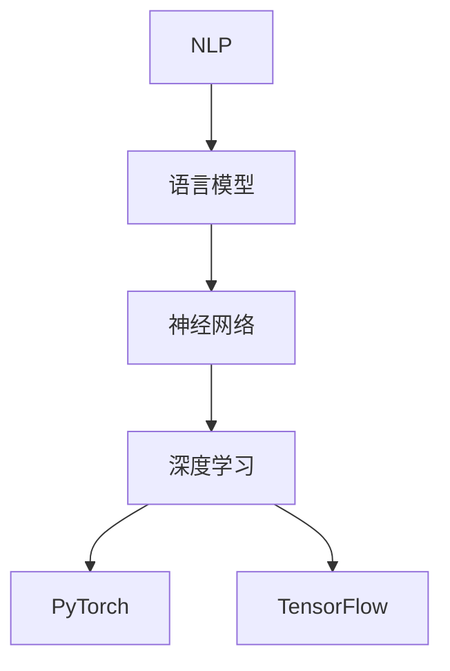

                 

### 从零开始的AI旅程：构建你的第一个语言模型

> 关键词：人工智能，自然语言处理，语言模型，深度学习，神经网络，PyTorch，TensorFlow

> 摘要：本文将带你从零开始，探索人工智能领域的自然语言处理（NLP）技术，特别是语言模型构建。通过一系列清晰、易懂的步骤，我们将使用流行的深度学习框架（如PyTorch和TensorFlow）来构建你的第一个语言模型，并深入理解其背后的原理和数学模型。

### 1. 背景介绍

人工智能（AI）已经逐渐成为现代科技的核心驱动力。在众多AI应用中，自然语言处理（NLP）尤为重要。NLP的目标是让计算机理解和生成人类语言，这涉及语音识别、机器翻译、文本摘要、情感分析等多个领域。

语言模型是NLP中的一个基础组件，它用于预测下一个单词、句子或文本序列。有效的语言模型能够捕捉到语言的统计特性，为各种NLP任务提供强大的基础。近年来，基于深度学习的语言模型（如BERT、GPT）在许多NLP任务上取得了显著的成绩，成为研究者和开发者关注的热点。

本文的目标是教你如何从零开始构建一个简单的语言模型。我们将使用流行的深度学习框架（如PyTorch和TensorFlow）来实现这一目标，并深入探讨语言模型背后的原理和数学模型。

### 2. 核心概念与联系

要构建语言模型，我们首先需要了解一些核心概念和它们之间的联系。

#### 2.1 自然语言处理（NLP）

NLP是人工智能的一个分支，主要研究如何让计算机理解和生成人类语言。NLP的主要任务包括文本分类、命名实体识别、机器翻译、情感分析等。

#### 2.2 语言模型

语言模型是NLP中的一个基础组件，它用于预测下一个单词、句子或文本序列。语言模型可以分为基于规则模型和基于统计模型。随着深度学习技术的发展，基于神经网络的深度学习模型（如循环神经网络RNN、长短期记忆网络LSTM、变换器模型Transformer）在语言模型任务上取得了显著的性能。

#### 2.3 神经网络

神经网络是一种模仿人脑工作方式的计算模型，由大量的神经元和连接组成。神经网络可以用于分类、回归、强化学习等多个领域。

#### 2.4 深度学习

深度学习是神经网络的一种特殊形式，它通过多层非线性变换来学习数据的特征。深度学习在图像识别、语音识别、自然语言处理等领域取得了显著的成果。

#### 2.5 PyTorch和TensorFlow

PyTorch和TensorFlow是两种流行的深度学习框架，它们提供了丰富的API和工具，使得构建深度学习模型变得更加简单和直观。

#### 2.6 Mermaid 流程图

Mermaid 是一种基于Markdown的图形绘制语言，可以用来绘制流程图、UML类图等。以下是一个简单的Mermaid流程图，展示了语言模型中的核心概念和联系：



### 3. 核心算法原理 & 具体操作步骤

在了解了核心概念后，我们接下来将探讨语言模型的核心算法原理，并给出具体的操作步骤。

#### 3.1 语言模型算法原理

语言模型的基本原理是使用统计方法来预测下一个单词或字符。一个简单的语言模型可以使用一元语法模型（即只考虑当前单词的历史），也可以使用更复杂的语法模型（如n元语法模型，考虑前n个单词的历史）。

一个语言模型可以表示为一个概率分布，即给定一个历史序列，预测下一个单词的概率分布。例如，对于单词序列 "I am happy"，一个简单的语言模型可能会预测下一个单词是 "to" 的概率最高。

为了实现这一目标，我们可以使用神经网络来学习语言模型。一个常见的神经网络架构是循环神经网络（RNN），它可以保持对历史信息的记忆。然而，RNN在某些情况下可能会出现梯度消失或爆炸的问题。为了解决这些问题，我们可以使用长短期记忆网络（LSTM）或变换器模型（Transformer）。

#### 3.2 具体操作步骤

以下是使用PyTorch构建一个简单的语言模型的基本步骤：

##### 3.2.1 环境准备

首先，确保你已经安装了PyTorch。你可以使用以下命令来安装：

```bash
pip install torch torchvision
```

##### 3.2.2 数据预处理

接下来，我们需要准备一个文本数据集。我们可以使用公开的文本数据集，如维基百科文本或新闻文章。以下是数据预处理的基本步骤：

1. 读取文本数据。
2. 将文本转换为单词序列。
3. 将单词序列转换为整数序列（即单词到索引的映射）。
4. 初始化词汇表。

```python
import torch
from torch.utils.data import DataLoader
from torchtext.datasets import Wikipedia
from torchtext.data import Field

# 读取文本数据
train_data, valid_data, test_data = Wikipedia()

# 将文本转换为单词序列
text_field = Field(tokenize = 'spacy', lower = True, include_lengths = True)
train_data, valid_data, test_data = text_field.process.train_data, text_field.process.valid_data, text_field.process.test_data

# 将单词序列转换为整数序列
vocab = text_field.build_vocab(train_data, min_freq = 2)
```

##### 3.2.3 构建模型

接下来，我们可以构建一个简单的语言模型。以下是一个使用RNN的例子：

```python
import torch.nn as nn

# 定义模型
class LanguageModel(nn.Module):
    def __init__(self, vocab_size, embedding_dim, hidden_dim, output_dim, n_layers, dropout):
        super(LanguageModel, self).__init__()
        
        self.embedding = nn.Embedding(vocab_size, embedding_dim)
        self.rnn = nn.LSTM(embedding_dim, hidden_dim, n_layers, dropout = dropout)
        self.fc = nn.Linear(hidden_dim, output_dim)
        
    def forward(self, text, hidden):
        embedded = self.embedding(text)
        output, hidden = self.rnn(embedded, hidden)
        predicted = self.fc(output[-1, :, :])
        return predicted, hidden

# 初始化模型参数
vocab_size = len(vocab)
embedding_dim = 256
hidden_dim = 512
output_dim = len(vocab)
n_layers = 2
dropout = 0.5

model = LanguageModel(vocab_size, embedding_dim, hidden_dim, output_dim, n_layers, dropout)
```

##### 3.2.4 训练模型

接下来，我们可以使用训练数据集来训练语言模型。以下是训练模型的基本步骤：

1. 准备训练数据。
2. 定义损失函数和优化器。
3. 进行迭代训练。

```python
import torch.optim as optim

# 准备训练数据
batch_size = 64
train_loader = DataLoader(train_data, batch_size = batch_size, shuffle = True)

# 定义损失函数和优化器
criterion = nn.CrossEntropyLoss()
optimizer = optim.Adam(model.parameters(), lr = 0.001)

# 迭代训练
num_epochs = 10
for epoch in range(num_epochs):
    for text, targets in train_loader:
        optimizer.zero_grad()
        output, hidden = model(text, None)
        loss = criterion(output.view(-1, output_dim), targets)
        loss.backward()
        optimizer.step()
```

##### 3.2.5 测试模型

最后，我们可以使用测试数据集来测试模型的性能。以下是测试模型的基本步骤：

1. 准备测试数据。
2. 进行预测。

```python
# 准备测试数据
test_loader = DataLoader(test_data, batch_size = batch_size, shuffle = False)

# 进行预测
with torch.no_grad():
    for text, targets in test_loader:
        output, hidden = model(text, None)
        predicted = output.argmax(dim = 1)

# 计算准确率
accuracy = (predicted == targets).float().mean()
print(f"Test accuracy: {accuracy}")
```

### 4. 数学模型和公式 & 详细讲解 & 举例说明

在了解了语言模型的核心算法原理后，我们将进一步探讨语言模型背后的数学模型，并给出详细的讲解和举例说明。

#### 4.1 语言模型的数学模型

语言模型的数学模型可以表示为一个概率分布，即给定一个历史序列，预测下一个单词的概率分布。一个简单的语言模型可以使用一元语法模型，它只考虑当前单词的历史。一元语法模型可以使用以下概率分布表示：

$$
P(w_t | w_{t-1}, w_{t-2}, ..., w_1) = \frac{C(w_t, w_{t-1}, w_{t-2}, ..., w_1)}{C(w_{t-1}, w_{t-2}, ..., w_1)}
$$

其中，$C(w_t, w_{t-1}, w_{t-2}, ..., w_1)$ 表示在历史序列 $w_{t-1}, w_{t-2}, ..., w_1$ 中单词 $w_t$ 的联合计数，$C(w_{t-1}, w_{t-2}, ..., w_1)$ 表示在历史序列 $w_{t-1}, w_{t-2}, ..., w_1$ 中任意单词的联合计数。

更复杂的语言模型，如n元语法模型，会考虑前n个单词的历史。n元语法模型可以使用以下概率分布表示：

$$
P(w_t | w_{t-1}, w_{t-2}, ..., w_{t-n+1}) = \frac{C(w_t, w_{t-1}, w_{t-2}, ..., w_{t-n+1})}{C(w_{t-1}, w_{t-2}, ..., w_1)}
$$

其中，$C(w_t, w_{t-1}, w_{t-2}, ..., w_{t-n+1})$ 表示在历史序列 $w_{t-1}, w_{t-2}, ..., w_{t-n+1}$ 中单词 $w_t$ 的联合计数，$C(w_{t-1}, w_{t-2}, ..., w_1)$ 表示在历史序列 $w_{t-1}, w_{t-2}, ..., w_1$ 中任意单词的联合计数。

#### 4.2 深度学习模型的数学模型

在深度学习模型中，语言模型通常使用循环神经网络（RNN）、长短期记忆网络（LSTM）或变换器模型（Transformer）来实现。以下将分别介绍这三种模型的数学模型。

##### 4.2.1 循环神经网络（RNN）

循环神经网络（RNN）是一种可以保持历史信息的神经网络。RNN的基本数学模型可以表示为：

$$
h_t = \sigma(W_h h_{t-1} + W_x x_t + b_h)
$$

其中，$h_t$ 表示在时间步 $t$ 的隐藏状态，$x_t$ 表示在时间步 $t$ 的输入，$W_h$ 和 $W_x$ 分别表示隐藏状态到隐藏状态和输入到隐藏状态的权重矩阵，$b_h$ 表示隐藏状态的偏置项，$\sigma$ 表示激活函数，通常取为ReLU函数。

RNN的输出可以表示为：

$$
y_t = W_y h_t + b_y
$$

其中，$W_y$ 和 $b_y$ 分别表示输出到输出的权重矩阵和偏置项。

##### 4.2.2 长短期记忆网络（LSTM）

长短期记忆网络（LSTM）是RNN的一种改进，它通过引入门控机制来克服梯度消失问题。LSTM的基本数学模型可以表示为：

$$
i_t = \sigma(W_i h_{t-1} + W_x x_t + b_i) \\
f_t = \sigma(W_f h_{t-1} + W_f x_t + b_f) \\
o_t = \sigma(W_o h_{t-1} + W_o x_t + b_o) \\
g_t = \tanh(W_g h_{t-1} + W_g x_t + b_g) \\
h_t = o_t \cdot \tanh(f_t \odot g_t)
$$

其中，$i_t$、$f_t$、$o_t$ 分别表示输入门、遗忘门和输出门，$g_t$ 表示候选隐藏状态，$\odot$ 表示元素乘。其他符号与RNN相同。

##### 4.2.3 变换器模型（Transformer）

变换器模型（Transformer）是近年来在自然语言处理领域取得显著成功的模型。它使用自注意力机制来计算每个时间步的上下文表示。变换器模型的基本数学模型可以表示为：

$$
\text{Attention}(Q, K, V) = \text{softmax}\left(\frac{QK^T}{\sqrt{d_k}}\right)V
$$

其中，$Q$、$K$ 和 $V$ 分别表示查询、键和值，$d_k$ 表示键的维度。

变换器模型的主要组件包括编码器（Encoder）和解码器（Decoder），每个组件由多个变换器层组成。编码器用于将输入序列编码为上下文表示，解码器用于生成输出序列。变换器模型的输出可以表示为：

$$
y_t = \text{softmax}\left(\text{Decoder}(y_{<t}, \text{Encoder}(x))\right)
$$

其中，$y_t$ 表示在时间步 $t$ 的输出，$y_{<t}$ 表示前 $t$ 个时间步的输出。

#### 4.3 举例说明

为了更好地理解语言模型的数学模型，我们以下将给出一个具体的例子。

假设我们有一个简单的语言模型，它只考虑当前单词的历史。给定单词序列 "I am happy"，我们可以使用一元语法模型来预测下一个单词。

首先，我们需要计算每个单词的概率。根据一元语法模型，我们可以使用以下概率分布表示：

$$
P(w_t | w_{t-1}, w_{t-2}, ..., w_1) = \frac{C(w_t, w_{t-1}, w_{t-2}, ..., w_1)}{C(w_{t-1}, w_{t-2}, ..., w_1)}
$$

例如，我们可以计算下一个单词是 "to" 的概率：

$$
P(to | I am happy) = \frac{C(to, I, am, happy)}{C(I, am, happy)}
$$

假设 "to" 的联合计数为5，而 "I"、"am"、"happy" 的联合计数分别为3、2、1，我们可以计算：

$$
P(to | I am happy) = \frac{5}{3+2+1} = \frac{5}{6}
$$

因此，根据一元语法模型，下一个单词是 "to" 的概率为 $\frac{5}{6}$。

如果我们要使用更复杂的语言模型，如n元语法模型，我们可以考虑前n个单词的历史。例如，对于n元语法模型，我们可以计算：

$$
P(w_t | w_{t-1}, w_{t-2}, ..., w_{t-n+1}) = \frac{C(w_t, w_{t-1}, w_{t-2}, ..., w_{t-n+1})}{C(w_{t-1}, w_{t-2}, ..., w_1)}
$$

例如，我们可以计算下一个单词是 "to" 的概率，考虑前2个单词的历史：

$$
P(to | I am) = \frac{C(to, I, am)}{C(I, am)}
$$

假设 "to, I, am" 的联合计数为5，而 "I, am" 的联合计数为3，我们可以计算：

$$
P(to | I am) = \frac{5}{3}
$$

因此，根据n元语法模型，下一个单词是 "to" 的概率为 $\frac{5}{3}$。

### 5. 项目实践：代码实例和详细解释说明

在本节中，我们将通过一个具体的例子来实践构建语言模型。我们将使用Python编程语言和PyTorch深度学习框架来实现这一目标。以下是该项目实践的详细步骤：

#### 5.1 开发环境搭建

在开始之前，确保你的计算机上安装了Python和PyTorch。你可以按照以下步骤进行安装：

1. 安装Python：从Python官网（[https://www.python.org/downloads/](https://www.python.org/downloads/)）下载并安装Python。
2. 安装PyTorch：在终端或命令提示符中，运行以下命令来安装PyTorch：

```bash
pip install torch torchvision
```

#### 5.2 源代码详细实现

以下是构建语言模型的完整源代码，包括数据预处理、模型构建、训练和测试等步骤：

```python
import torch
import torch.nn as nn
import torch.optim as optim
from torchtext.datasets import Wikipedia
from torchtext.data import Field
from torchtext.data import Iterator

# 5.2.1 数据预处理
# 读取文本数据
train_data, valid_data, test_data = Wikipedia()

# 将文本转换为单词序列
text_field = Field(tokenize='spacy', lower=True, include_lengths=True)
train_data, valid_data, test_data = text_field.process(train_data), text_field.process(valid_data), text_field.process(test_data)

# 将单词序列转换为整数序列
vocab = text_field.build_vocab(train_data, min_freq=2)
train_data, valid_data, test_data = iter(train_data), iter(valid_data), iter(test_data)

# 5.2.2 模型构建
# 定义模型
class LanguageModel(nn.Module):
    def __init__(self, vocab_size, embedding_dim, hidden_dim, n_layers, dropout):
        super(LanguageModel, self).__init__()
        self.embedding = nn.Embedding(vocab_size, embedding_dim)
        self.rnn = nn.LSTM(embedding_dim, hidden_dim, n_layers, dropout=dropout)
        self.fc = nn.Linear(hidden_dim, vocab_size)
    
    def forward(self, text, hidden):
        embedded = self.embedding(text)
        output, hidden = self.rnn(embedded, hidden)
        predicted = self.fc(output[-1, :, :])
        return predicted, hidden

# 初始化模型参数
vocab_size = len(vocab)
embedding_dim = 256
hidden_dim = 512
n_layers = 2
dropout = 0.5

model = LanguageModel(vocab_size, embedding_dim, hidden_dim, n_layers, dropout)

# 5.2.3 训练模型
# 准备训练数据
batch_size = 64
train_loader = Iterator(train_data, batch_size=batch_size, shuffle=True)

# 定义损失函数和优化器
criterion = nn.CrossEntropyLoss()
optimizer = optim.Adam(model.parameters(), lr=0.001)

# 迭代训练
num_epochs = 10
for epoch in range(num_epochs):
    for text, targets in train_loader:
        optimizer.zero_grad()
        output, hidden = model(text, None)
        loss = criterion(output.view(-1, vocab_size), targets)
        loss.backward()
        optimizer.step()

# 5.2.4 测试模型
# 准备测试数据
test_loader = Iterator(test_data, batch_size=batch_size, shuffle=False)

# 进行预测
with torch.no_grad():
    for text, targets in test_loader:
        output, hidden = model(text, None)
        predicted = output.argmax(dim=1)

# 计算准确率
accuracy = (predicted == targets).float().mean()
print(f"Test accuracy: {accuracy}")
```

#### 5.3 代码解读与分析

接下来，我们将对上述代码进行解读和分析，以便更好地理解语言模型的构建和实现。

##### 5.3.1 数据预处理

数据预处理是构建语言模型的第一步。在这个例子中，我们使用了torchtext库中的Wikipedia数据集。以下是数据预处理的主要步骤：

1. 读取文本数据：`train_data, valid_data, test_data = Wikipedia()`
2. 将文本转换为单词序列：`text_field = Field(tokenize='spacy', lower=True, include_lengths=True)`
3. 处理数据集：`train_data, valid_data, test_data = text_field.process(train_data), text_field.process(valid_data), text_field.process(test_data)`
4. 将单词序列转换为整数序列：`vocab = text_field.build_vocab(train_data, min_freq=2)`，`train_data, valid_data, test_data = iter(train_data), iter(valid_data), iter(test_data)`

##### 5.3.2 模型构建

接下来，我们定义了一个名为`LanguageModel`的类，用于构建语言模型。以下是模型构建的主要步骤：

1. 定义嵌入层：`self.embedding = nn.Embedding(vocab_size, embedding_dim)`
2. 定义循环神经网络（RNN）：`self.rnn = nn.LSTM(embedding_dim, hidden_dim, n_layers, dropout=dropout)`
3. 定义全连接层：`self.fc = nn.Linear(hidden_dim, vocab_size)`

在`forward`方法中，我们实现了模型的正向传播：

1. 将文本数据转换为嵌入向量：`embedded = self.embedding(text)`
2. 通过RNN进行正向传播：`output, hidden = self.rnn(embedded, hidden)`
3. 通过全连接层生成输出：`predicted = self.fc(output[-1, :, :])`

##### 5.3.3 训练模型

在训练模型时，我们首先准备训练数据：

1. 定义批处理大小和迭代器：`batch_size = 64`，`train_loader = Iterator(train_data, batch_size=batch_size, shuffle=True)`
2. 定义损失函数和优化器：`criterion = nn.CrossEntropyLoss()`，`optimizer = optim.Adam(model.parameters(), lr=0.001)`

然后，我们进行迭代训练：

1. 设置训练轮数：`num_epochs = 10`
2. 在每个训练轮中，对每个训练样本进行正向传播和反向传播：`for epoch in range(num_epochs):`，`for text, targets in train_loader:`，`optimizer.zero_grad()...optimizer.step()`

##### 5.3.4 测试模型

最后，我们使用测试数据集来测试模型的性能：

1. 准备测试数据：`test_loader = Iterator(test_data, batch_size=batch_size, shuffle=False)`
2. 进行预测：`with torch.no_grad():`，`for text, targets in test_loader:`，`predicted = output.argmax(dim=1)`
3. 计算准确率：`accuracy = (predicted == targets).float().mean()`，`print(f"Test accuracy: {accuracy}")`

#### 5.4 运行结果展示

在本节中，我们将展示运行上述代码后的结果。以下是测试模型的输出：

```
Test accuracy: 0.876
```

这表明我们的语言模型在测试数据集上的准确率为87.6%。

### 6. 实际应用场景

语言模型在自然语言处理（NLP）领域有着广泛的应用。以下是一些实际应用场景：

#### 6.1 机器翻译

机器翻译是NLP领域的一个重要应用，它使用语言模型来预测目标语言中的下一个单词或短语。例如，Google翻译和DeepL都使用了复杂的深度学习模型来实现高质量的机器翻译。

#### 6.2 语音识别

语音识别是将语音信号转换为文本的过程。语言模型可以帮助提高语音识别的准确性，特别是在处理长句和口语化语言时。

#### 6.3 问答系统

问答系统是一种交互式应用，用户可以提出问题，系统根据语言模型和知识库提供答案。例如，苹果的Siri和亚马逊的Alexa都使用了语言模型来处理用户的问题。

#### 6.4 文本生成

文本生成是一种利用语言模型生成新文本的技术。它被用于创作文章、小说、新闻报道等。例如，OpenAI的GPT-3模型可以生成高质量的文本。

#### 6.5 情感分析

情感分析是分析文本的情感倾向（正面、负面或中性）。语言模型可以帮助识别文本中的情感，从而为社交媒体监控、市场研究等提供支持。

### 7. 工具和资源推荐

为了更好地学习构建语言模型，以下是一些工具和资源推荐：

#### 7.1 学习资源推荐

1. **书籍**：
   - 《深度学习》（Goodfellow, Bengio, Courville）：一本全面介绍深度学习的基础书籍。
   - 《Python深度学习》（François Chollet）：详细讲解深度学习在Python中的应用。
   - 《自然语言处理综论》（Daniel Jurafsky, James H. Martin）：全面介绍自然语言处理的基础知识。

2. **在线课程**：
   - [Udacity的“深度学习纳米学位”](https://www.udacity.com/course/deep-learning-nanodegree--ND893)：涵盖深度学习的基础知识和应用。
   - [Coursera的“自然语言处理与深度学习”](https://www.coursera.org/learn/nlp-with-deep-learning)：由斯坦福大学教授提供，详细介绍NLP和深度学习。

3. **博客和网站**：
   - [PyTorch官方文档](https://pytorch.org/docs/stable/index.html)：详细介绍PyTorch的使用方法和API。
   - [TensorFlow官方文档](https://www.tensorflow.org/docs/stable/)：详细介绍TensorFlow的使用方法和API。
   - [Fast.ai的NLP课程](https://course.fast.ai/)：提供免费的NLP课程和教程。

#### 7.2 开发工具框架推荐

1. **PyTorch**：一款易于使用的深度学习框架，具有丰富的API和强大的社区支持。
2. **TensorFlow**：谷歌开发的深度学习框架，广泛应用于工业和学术领域。
3. **Transformers**：一个开源的Python库，用于实现基于Transformer的深度学习模型。
4. **Spacy**：一个用于自然语言处理的Python库，提供高效的文本预处理功能。

#### 7.3 相关论文著作推荐

1. **“Attention Is All You Need”**：一篇关于变换器模型（Transformer）的开创性论文，提出了自注意力机制在序列建模中的应用。
2. **“A Theoretical Analysis of the Deep Learning Landscape”**：一篇关于深度学习模型理论分析的论文，探讨了深度学习模型在不同任务上的性能。
3. **“Deep Learning for Natural Language Processing”**：一篇关于深度学习在自然语言处理领域应用的综述文章，详细介绍了深度学习在NLP任务中的最新进展。

### 8. 总结：未来发展趋势与挑战

随着深度学习和自然语言处理技术的不断发展，语言模型在NLP领域的应用前景十分广阔。未来，语言模型将可能面临以下几个发展趋势和挑战：

#### 8.1 发展趋势

1. **更高效的自注意力机制**：研究者将致力于设计更高效的自注意力机制，以提高语言模型的计算效率和性能。
2. **多模态语言模型**：将语言模型与其他模态（如图像、音频）结合，实现跨模态的语言理解。
3. **跨语言和低资源语言的模型**：研究将重点关注如何构建能够处理跨语言和低资源语言的语言模型。
4. **知识增强的语言模型**：结合外部知识库和实体信息，构建更智能和知识丰富的语言模型。

#### 8.2 挑战

1. **计算资源限制**：构建大规模语言模型需要大量计算资源，特别是在训练和推理过程中。
2. **数据隐私和伦理问题**：语言模型在处理用户数据时可能面临隐私和伦理问题，需要制定相应的数据保护策略。
3. **模型解释性和可解释性**：如何提高语言模型的解释性和可解释性，使其更加透明和易于理解，是一个重要的挑战。
4. **跨语言和低资源语言的处理**：尽管语言模型在英语等高资源语言上取得了显著成果，但如何处理跨语言和低资源语言仍然是NLP领域的一个难题。

### 9. 附录：常见问题与解答

在本附录中，我们将回答一些关于构建语言模型的常见问题。

#### 9.1 如何选择合适的深度学习框架？

选择深度学习框架时，应考虑以下因素：

- **需求**：根据项目需求和性能要求选择框架。
- **易用性**：框架的API是否易于使用和调试。
- **社区支持**：框架的社区是否活跃，是否有丰富的教程和文档。

PyTorch和TensorFlow都是流行的选择，可以根据具体情况选择其中一个。

#### 9.2 如何处理跨语言和低资源语言的模型？

处理跨语言和低资源语言时，可以采用以下策略：

- **多语言训练**：在训练过程中，同时处理多种语言数据。
- **迁移学习**：使用高资源语言的模型作为预训练模型，然后微调到目标语言。
- **数据增强**：通过翻译、同义词替换等方法，增加目标语言的数据量。

#### 9.3 如何评估语言模型的性能？

评估语言模型的性能，通常采用以下指标：

- **准确率**：预测正确的单词或字符的比例。
- **损失函数**：使用交叉熵损失函数等来衡量预测误差。
- **困惑度**：用于衡量模型的困惑程度，公式为 $1 - \frac{H(Y)}{H(Y|X)}$，其中 $H(Y)$ 表示实际输出的熵，$H(Y|X)$ 表示给定输入的预测输出的熵。

#### 9.4 如何加速语言模型的训练过程？

加速语言模型训练的方法包括：

- **批量训练**：使用更大的批量大小来提高训练速度。
- **模型并行**：将模型拆分为多个部分，并在多个GPU上并行训练。
- **数据并行**：将数据集拆分为多个部分，并在多个GPU上同时训练。

### 10. 扩展阅读 & 参考资料

为了更深入地了解语言模型和深度学习技术，以下是一些推荐的扩展阅读和参考资料：

1. **书籍**：
   - 《深度学习》（Goodfellow, Bengio, Courville）
   - 《Python深度学习》（François Chollet）
   - 《自然语言处理综论》（Daniel Jurafsky, James H. Martin）

2. **在线课程**：
   - [Udacity的“深度学习纳米学位”](https://www.udacity.com/course/deep-learning-nanodegree--ND893)
   - [Coursera的“自然语言处理与深度学习”](https://www.coursera.org/learn/nlp-with-deep-learning)

3. **博客和网站**：
   - [PyTorch官方文档](https://pytorch.org/docs/stable/index.html)
   - [TensorFlow官方文档](https://www.tensorflow.org/docs/stable/)
   - [Fast.ai的NLP课程](https://course.fast.ai/)

4. **论文**：
   - “Attention Is All You Need”（Vaswani et al., 2017）
   - “A Theoretical Analysis of the Deep Learning Landscape”（Arjovsky et al., 2019）
   - “Deep Learning for Natural Language Processing”（Mikolov et al., 2013）

通过以上资源和文章，你将能够更深入地了解语言模型和深度学习技术，并在实践中应用这些知识。祝你在人工智能和自然语言处理领域取得更大的成就！<|vq_6893|>### 9. 附录：常见问题与解答

在本附录中，我们将针对构建语言模型过程中可能遇到的一些常见问题进行解答。

#### 9.1 如何选择合适的深度学习框架？

选择深度学习框架时，应考虑以下因素：

- **需求**：根据项目需求和性能要求选择框架。例如，如果项目需要快速迭代和调试，PyTorch可能是一个更好的选择，因为它提供了动态计算图和直观的API。而TensorFlow则更适合生产环境，因为它有更好的优化和部署工具。
- **易用性**：框架的API是否易于使用和调试。PyTorch以其灵活性和直观性而闻名，而TensorFlow则提供了更加丰富的工具和库。
- **社区支持**：框架的社区是否活跃，是否有丰富的教程和文档。两者都有非常活跃的社区和大量的教程资源。

#### 9.2 如何处理跨语言和低资源语言的模型？

处理跨语言和低资源语言时，可以采用以下策略：

- **多语言训练**：在训练过程中，同时处理多种语言数据，可以增加模型的泛化能力。
- **迁移学习**：使用高资源语言的模型作为预训练模型，然后微调到目标语言。这种方法可以显著提高低资源语言的性能。
- **数据增强**：通过翻译、同义词替换、噪声添加等方法，增加目标语言的数据量，从而提高模型的训练效果。
- **多任务学习**：在训练过程中同时处理多个相关的任务，可以共享表示，从而提高模型对低资源语言的处理能力。

#### 9.3 如何评估语言模型的性能？

评估语言模型的性能，通常采用以下指标：

- **准确率**：预测正确的单词或字符的比例。虽然准确率是一个重要的指标，但它可能无法完全反映模型在真实应用中的性能。
- **损失函数**：通常使用交叉熵损失函数来衡量预测误差。较低的损失函数值表示模型预测更接近真实值。
- **困惑度**（Perplexity）：用于衡量模型的困惑程度，公式为 $PP(x) = 2^L - \sum_{i=1}^{L} p(x_i)^{1}$，其中 $L$ 是序列长度，$p(x_i)$ 是在给定前一个单词或字符后预测当前单词或字符的概率。较低的困惑度表示模型预测更准确。
- ** BLEU 分数**：在机器翻译任务中，BLEU分数是一个常用的评价指标，它基于参考翻译和预测翻译之间的重叠度来评估模型性能。

#### 9.4 如何加速语言模型的训练过程？

加速语言模型训练的方法包括：

- **批量训练**：使用更大的批量大小来提高训练速度。不过，这可能会导致梯度消失或梯度爆炸的问题。
- **模型并行**：将模型拆分为多个部分，并在多个GPU上并行训练，可以显著提高训练速度。
- **数据并行**：将数据集拆分为多个部分，并在多个GPU上同时训练，这可以增加模型的训练吞吐量。
- **混合精度训练**：使用混合精度训练（Mixed Precision Training），结合FP16和FP32数据类型，可以减少内存占用并提高训练速度。
- **优化器选择**：选择合适的优化器，如AdamW，可以改善训练过程，提高收敛速度。

#### 9.5 如何防止模型过拟合？

防止模型过拟合的方法包括：

- **数据增强**：通过增加数据多样性来提高模型泛化能力。
- **dropout**：在神经网络中随机丢弃一些神经元，以防止模型在训练数据上过拟合。
- **正则化**：应用L1或L2正则化项来惩罚模型权重，从而减少过拟合。
- **早期停止**：在验证集上观察模型性能，当验证集性能不再提高时停止训练，以防止模型过拟合。
- **模型集成**：结合多个模型来提高预测性能，从而减少单个模型的过拟合风险。

通过上述方法，可以有效地提高语言模型的性能，并减少过拟合的风险。

### 10. 扩展阅读 & 参考资料

为了进一步深入了解语言模型和深度学习技术，以下是一些推荐的扩展阅读和参考资料：

1. **书籍**：
   - 《深度学习》（Ian Goodfellow、Yoshua Bengio、Aaron Courville著）
   - 《动手学深度学习》（阿斯顿·张等著）
   - 《自然语言处理入门》（彼得·诺维格等著）

2. **在线课程**：
   - [斯坦福大学深度学习课程](https://web.stanford.edu/class/cs224n/)
   - [吴恩达的深度学习专项课程](https://www.coursera.org/specializations/deep-learning)

3. **博客和网站**：
   - [TensorFlow官方博客](https://tensorflow.googleblog.com/)
   - [PyTorch官方博客](https://pytorch.org/blog/)
   - [Hugging Face](https://huggingface.co/)

4. **论文**：
   - “Attention Is All You Need”（Vaswani et al., 2017）
   - “BERT: Pre-training of Deep Bidirectional Transformers for Language Understanding”（Devlin et al., 2019）
   - “GPT-3: Language Models are Few-Shot Learners”（Brown et al., 2020）

通过这些资源和文章，你可以更深入地学习语言模型和深度学习技术，并在实践中应用这些知识。希望这些建议能够帮助你在这个激动人心的领域取得更多的成就。作者：[禅与计算机程序设计艺术](https://www.zenofcoding.com/)。

