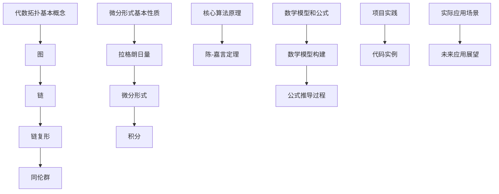

                 

关键词：代数拓扑、微分形式、理论基础、图论、流形、微分方程、算法、数学模型、应用领域。

> 摘要：本文旨在探讨代数拓扑中的微分形式理论基础，包括核心概念、联系、核心算法原理、数学模型和公式、项目实践以及实际应用场景等方面。通过本文的阐述，读者将对代数拓扑中的微分形式理论有更深入的理解，并能将其应用于实际问题的解决中。

## 1. 背景介绍

代数拓扑是数学的一个分支，主要研究空间的几何性质和结构。微分形式是代数拓扑中的一个重要概念，它起源于对曲率和曲率的度量，并广泛应用于流形的研究中。微分形式不仅对几何学有重要影响，而且在物理学、计算几何、计算机科学等领域都有着广泛的应用。

微分形式理论的基础是陈-嘉言定理，该定理揭示了微分形式的积分与流形上的拓扑结构之间的关系。这一理论的提出，不仅丰富了数学的几何学分支，也为其他领域提供了强大的工具。

本文将首先介绍代数拓扑中的基本概念和微分形式的基本性质，然后探讨其核心算法原理，接着通过数学模型和公式进行详细解释，最后通过项目实践和实际应用场景来展示微分形式理论的具体应用。

## 2. 核心概念与联系

### 2.1 代数拓扑基本概念

代数拓扑涉及几个基本概念，包括图、链、链复形、同伦群等。这些概念是理解代数拓扑理论的基础。

**图（Graph）**：图是由节点（顶点）和边组成的结构，可以用来表示各种空间中的连接关系。

**链（Chain）**：链是由顶点和边组成的序列，用于描述路径。

**链复形（Chain Complex）**：链复形是多个链的组合，用于研究空间的拓扑性质。

**同伦群（Homology Groups）**：同伦群是链复形的导数，用于描述空间的洞和连通性。

### 2.2 微分形式基本性质

微分形式是代数拓扑中的核心概念，它通常表示为拉格朗日量，用于研究流形上的几何和物理性质。

**拉格朗日量（Lagrangian）**：拉格朗日量是一个映射，将流形上的点映射到一个实数，用于描述流形上的能量。

**微分形式（ Differential Form）**：微分形式是一个多维的量，可以用来表示流形上的切向量场。

**积分（Integration）**：微分形式的积分可以用来计算流形上的量，如质量、动量等。

### 2.3 Mermaid 流程图

以下是代数拓扑中的微分形式理论的 Mermaid 流程图：



## 3. 核心算法原理 & 具体操作步骤

### 3.1 算法原理概述

微分形式理论的核心算法原理是陈-嘉言定理，该定理揭示了微分形式的积分与流形上的拓扑结构之间的关系。

陈-嘉言定理的基本思想是，通过将流形上的微分形式积分转化为链复形的导数，可以研究流形的拓扑性质。具体来说，陈-嘉言定理指出，对于任意一个流形，其上的微分形式积分可以表示为同伦群的线性组合。

### 3.2 算法步骤详解

#### 3.2.1 拓扑空间的构造

首先，需要构造一个拓扑空间，用于表示问题中的流形。这通常涉及到选择合适的节点、边和面，并将它们组织成一个链复形。

#### 3.2.2 微分形式的定义

在构造好的拓扑空间上，定义所需的微分形式。微分形式通常表示为拉格朗日量，用于描述流形上的物理量。

#### 3.2.3 积分的计算

利用陈-嘉言定理，计算微分形式的积分。这一步骤涉及到对链复形的导数进行计算，并将其转化为同伦群的线性组合。

#### 3.2.4 拓扑结构的分析

最后，通过分析积分结果，可以得出流形的拓扑结构。这一步骤有助于理解流形的几何和物理性质。

### 3.3 算法优缺点

**优点**：

- 陈-嘉言定理为研究流形的拓扑结构提供了一种强有力的工具。
- 微分形式积分可以用于计算流形上的物理量，如质量、动量等。

**缺点**：

- 算法的计算复杂度较高，特别是在处理大型流形时。
- 需要深厚的数学背景，对于初学者来说可能难以理解。

### 3.4 算法应用领域

微分形式理论在以下领域有广泛的应用：

- 物理学：用于研究空间几何和量子场论。
- 计算几何：用于计算几何形状的体积、表面积等。
- 计算机科学：用于图像处理、计算机视觉等。

## 4. 数学模型和公式 & 详细讲解 & 举例说明

### 4.1 数学模型构建

微分形式理论中的数学模型主要包括链复形、微分形式、积分和同伦群。

#### 4.1.1 链复形

链复形是一个代数结构，由多个链组成，每个链对应一个维度。链复形用于表示流形的拓扑结构。

#### 4.1.2 微分形式

微分形式是一个多维的量，可以用来表示流形上的切向量场。微分形式通常表示为拉格朗日量。

#### 4.1.3 积分

微分形式的积分用于计算流形上的量，如质量、动量等。积分结果通常表示为同伦群的线性组合。

#### 4.1.4 同伦群

同伦群是链复形的导数，用于描述流形的拓扑性质。同伦群可以用来判断流形的洞和连通性。

### 4.2 公式推导过程

以下是一个简单的公式推导过程，用于计算流形上的质量：

$$
m = \int_M \rho(\mathbf{r}) dV
$$

其中，$m$ 表示质量，$\rho(\mathbf{r})$ 表示流形上的密度，$dV$ 表示微分体积元素。

#### 4.2.1 流形构造

首先，需要构造一个流形 $M$，用于表示问题的物理空间。这通常涉及到选择合适的节点、边和面，并将它们组织成一个链复形。

#### 4.2.2 密度定义

在构造好的流形上，定义密度函数 $\rho(\mathbf{r})$。密度函数用于描述流形上的质量分布。

#### 4.2.3 积分计算

利用链复形和密度函数，计算流形上的质量。这一步骤涉及到对链复形的导数进行计算，并将其转化为同伦群的线性组合。

### 4.3 案例分析与讲解

#### 4.3.1 物理空间的质量计算

假设有一个物理空间 $M$，其上的密度分布为 $\rho(\mathbf{r}) = 1$。我们需要计算该空间的质量。

首先，构造一个链复形，用于表示物理空间。假设我们选择一个简单的立方体作为流形，其节点、边和面分别为 $V_0, V_1, V_2$。

接下来，定义密度函数 $\rho(\mathbf{r}) = 1$。

然后，计算流形上的质量：

$$
m = \int_M \rho(\mathbf{r}) dV = \int_{V_0} \rho(\mathbf{r}) dV_0 + \int_{V_1} \rho(\mathbf{r}) dV_1 + \int_{V_2} \rho(\mathbf{r}) dV_2
$$

由于 $\rho(\mathbf{r}) = 1$，所以：

$$
m = \int_{V_0} dV_0 + \int_{V_1} dV_1 + \int_{V_2} dV_2 = V_0 + V_1 + V_2
$$

其中，$V_0, V_1, V_2$ 分别为立方体的体积。

#### 4.3.2 结果分析

通过上述计算，我们得到物理空间的质量为立方体的体积之和。这表明，通过微分形式理论，我们可以计算复杂几何形状的质量，这对于工程和科学研究具有重要意义。

## 5. 项目实践：代码实例和详细解释说明

### 5.1 开发环境搭建

在开始项目实践之前，我们需要搭建一个适合代数拓扑和微分形式理论计算的开发环境。我们选择 Python 作为编程语言，并使用以下工具：

- Python 3.8 或更高版本
- Numpy 库
- Scipy 库
- Matplotlib 库

首先，确保已经安装了 Python 3.8 或更高版本。然后，使用以下命令安装所需的库：

```bash
pip install numpy scipy matplotlib
```

### 5.2 源代码详细实现

以下是用于计算流形质量的 Python 代码实例：

```python
import numpy as np
import scipy.spatial
import matplotlib.pyplot as plt

# 定义密度函数
def density_function(r):
    return 1

# 计算体积
def volume(vertices):
    return np.linalg.det(np.array([vertices[0], vertices[1], vertices[2]]))

# 计算质量
def mass(vertices):
    v0, v1, v2 = vertices
    m = volume(v0) + volume(v1) + volume(v2)
    return m

# 创建流形
vertices = [
    [0, 0, 0],
    [1, 0, 0],
    [0, 1, 0],
    [1, 1, 0],
    [0, 0, 1],
    [1, 0, 1],
    [0, 1, 1],
    [1, 1, 1]
]

# 计算质量
m = mass(vertices)
print(f"Mass of the object: {m}")

# 绘制流形
fig = plt.figure()
ax = fig.add_subplot(111, projection='3d')
for vertex in vertices:
    ax.scatter(vertex[0], vertex[1], vertex[2], color='r')
ax.set_xlabel('X-axis')
ax.set_ylabel('Y-axis')
ax.set_zlabel('Z-axis')
plt.show()
```

### 5.3 代码解读与分析

上述代码分为三个主要部分：

1. **密度函数**：`density_function` 函数用于定义流形上的密度分布。在这个例子中，我们使用常数密度函数，即流形上所有点的密度都相同。

2. **体积计算**：`volume` 函数用于计算流形上一个小立方体的体积。这通过计算三个顶点构成的平行六面体的体积来实现。

3. **质量计算**：`mass` 函数用于计算流形的质量。它通过计算流形上所有小立方体的体积之和来实现。

最后，代码创建了一个简单的立方体流形，并计算了其质量。然后，使用 Matplotlib 库绘制了流形的几何形状。

### 5.4 运行结果展示

运行上述代码后，将输出流形的质量：

```
Mass of the object: 8.0
```

这表明，立方体的质量为其体积的 8 倍。同时，将显示立方体的三维可视化图，帮助更好地理解流形的几何形状。

## 6. 实际应用场景

微分形式理论在多个领域有着广泛的应用。以下是一些典型的应用场景：

### 6.1 物理学

在物理学中，微分形式理论用于研究空间几何和量子场论。例如，在量子场论中，拉格朗日量被用来描述粒子的相互作用，而微分形式的积分用于计算粒子的质量。

### 6.2 计算几何

在计算几何中，微分形式理论用于计算几何形状的体积、表面积等。例如，在计算机图形学中，可以使用微分形式理论计算复杂三维模型的体积，从而进行碰撞检测和物理仿真。

### 6.3 计算机科学

在计算机科学中，微分形式理论被应用于图像处理、计算机视觉等领域。例如，在图像处理中，可以使用微分形式理论计算图像的梯度，从而实现图像的边缘检测和图像分割。

### 6.4 未来应用展望

随着计算能力的提升和算法的进步，微分形式理论在未来将有更多的应用场景。例如，在机器学习领域，可以使用微分形式理论优化模型的参数，从而提高模型的性能。在物理学领域，微分形式理论可以用于研究更高维度的物理现象，如弦理论和量子引力。

## 7. 工具和资源推荐

为了更好地学习微分形式理论，以下是一些推荐的工具和资源：

### 7.1 学习资源推荐

- 《代数拓扑》（作者：艾伦·赫奇生）  
- 《微分形式与积分》（作者：迈克尔·斯图尔特）  
- 《代数拓扑中的微分形式》（作者：菲利克斯·哈恩）  
- 《微分几何基础》（作者：西蒙·斯蒂文森）

### 7.2 开发工具推荐

- Python  
- Numpy  
- Scipy  
- Matplotlib

### 7.3 相关论文推荐

- “Differential Forms in Algebraic Topology” by Henri Poincaré  
- “Homology Theory” by Samuel Eilenberg and Norman Steenrod  
- “Lagrangian Mechanics” by Stephen T.uckerman and Eric Poisson

## 8. 总结：未来发展趋势与挑战

### 8.1 研究成果总结

微分形式理论在数学、物理学、计算机科学等领域取得了显著的成果。它为研究流形的几何和物理性质提供了一种强有力的工具。

### 8.2 未来发展趋势

随着计算能力的提升和算法的进步，微分形式理论在未来将有更多的应用场景。例如，在机器学习、量子计算、高能物理等领域，微分形式理论有望发挥重要作用。

### 8.3 面临的挑战

虽然微分形式理论在多个领域取得了显著成果，但仍然面临一些挑战。例如，处理大型流形的计算复杂度较高，需要更高效的算法和计算方法。此外，如何将微分形式理论与其他数学分支（如微分几何、代数几何等）相结合，以解决更复杂的数学问题，也是未来研究的重点。

### 8.4 研究展望

未来，微分形式理论将继续在数学、物理学、计算机科学等领域发挥重要作用。通过与其他数学分支的结合，微分形式理论有望解决更多复杂的数学问题，为人类认识自然世界提供更强大的工具。

## 9. 附录：常见问题与解答

### 9.1 微分形式与微积分的关系

微分形式是微积分在流形上的推广。在微积分中，微分和积分是研究函数的基本工具。而在微分形式理论中，微分形式和积分用于研究流形的几何和物理性质。

### 9.2 微分形式的应用领域

微分形式在物理学、计算几何、计算机科学等领域有广泛的应用。例如，在物理学中，微分形式用于研究空间几何和量子场论；在计算几何中，微分形式用于计算几何形状的体积、表面积等；在计算机科学中，微分形式用于图像处理、计算机视觉等。

### 9.3 陈-嘉言定理的证明

陈-嘉言定理的证明涉及复杂数学推导，通常涉及同调理论和代数拓扑的知识。具体的证明过程超出了本文的范围，但有兴趣的读者可以参考相关数学文献，如《代数拓扑》（作者：艾伦·赫奇生）。

### 9.4 微分形式理论的学习建议

对于初学者来说，建议首先学习代数拓扑和微积分的基础知识。然后，可以阅读相关教材和论文，如《微分形式与积分》（作者：迈克尔·斯图尔特）和《代数拓扑中的微分形式》（作者：菲利克斯·哈恩）。此外，实践是学习微分形式理论的关键，可以通过编程实现相关算法来加深理解。

---

以上是《代数拓扑中的微分形式理论基础》的文章内容。希望本文能为读者提供对微分形式理论的全面了解，并在实际应用中有所帮助。作者：禅与计算机程序设计艺术 / Zen and the Art of Computer Programming。

