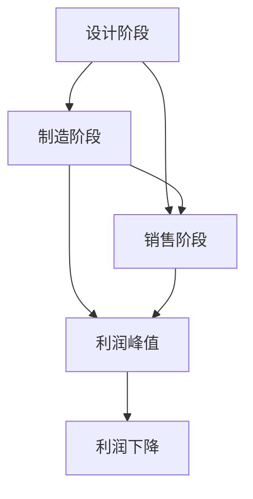

                 

### 背景介绍

在当今科技迅猛发展的时代，人工智能（AI）已经成为全球科技领域的焦点。从自动驾驶汽车到智能家居，AI技术正逐渐渗透到我们生活的方方面面。然而，随着AI技术的广泛应用，一个不可忽视的问题是，AI公司的商业模型和盈利模式。那么，如何在这些新兴企业中找到自身的定位，实现可持续的发展？这便是本文的核心议题。

本文将围绕“价值微笑曲线与AI公司的位置”这一主题，通过逐步分析推理，探讨AI公司在这一曲线中的具体位置，以及如何通过优化自身定位来实现商业成功。文章将从以下几个方面展开：

1. **核心概念与联系**：介绍价值微笑曲线的基本原理，并绘制一个简洁明了的Mermaid流程图，展示核心概念之间的联系。
2. **核心算法原理与操作步骤**：详细解释价值微笑曲线的算法原理，并提供具体的操作步骤。
3. **数学模型和公式**：介绍与价值微笑曲线相关的数学模型，并进行详细讲解，附上示例来说明。
4. **项目实践：代码实例与解释**：通过具体的代码实例，展示如何实现价值微笑曲线在AI公司中的应用，并进行详细解释和分析。
5. **实际应用场景**：分析价值微笑曲线在不同行业中的应用，探讨其带来的实际效益。
6. **工具和资源推荐**：推荐相关学习资源、开发工具和论文著作，以帮助读者深入了解价值微笑曲线。
7. **总结与未来发展趋势**：总结文章的主要内容，并展望价值微笑曲线在AI领域的发展趋势与挑战。

通过对这些内容的一步一步分析，我们希望能够为AI公司提供一个实用的指导框架，帮助它们找到自己的最佳商业模型和盈利路径。

### 1. 核心概念与联系

在深入探讨价值微笑曲线与AI公司的位置之前，我们需要先了解价值微笑曲线的基本原理。价值微笑曲线（Value微笑曲线）是经济学中一个重要的概念，它描述了产品或服务的生命周期内，各阶段的价值变化情况。通常，这个曲线呈现出一个从左到右上升，在中间达到峰值，然后逐渐下降的形态，类似于微笑的曲线，因此得名“微笑曲线”。

#### 基本原理

价值微笑曲线的基本原理可以分为三个主要阶段：

1. **设计阶段**：在这一阶段，产品的设计、创新和开发是至关重要的。这一阶段通常需要大量的研发投入，包括人力资源、技术资源和资金支持。然而，通过独特的创意和创新，企业可以在这一阶段创造出高附加值的产品或服务，从而实现较高的利润。

2. **制造阶段**：这一阶段主要是产品的生产制造过程。尽管制造环节也需要投入一定的资源和成本，但由于规模效应和工艺优化，生产成本相对较低。在这一阶段，利润通常相对稳定，但并不高。

3. **销售阶段**：产品的销售环节是价值实现的关键阶段。通过市场营销和渠道建设，企业可以将产品推向市场，实现销售收入的增长。然而，由于市场竞争激烈，这一阶段的利润空间相对较小。

#### Mermaid流程图

为了更好地理解价值微笑曲线的核心概念，我们可以使用Mermaid流程图来展示各阶段之间的联系。以下是一个简化版的Mermaid流程图：



在这个流程图中，A代表设计阶段，B代表制造阶段，C代表销售阶段，D表示利润峰值，E表示利润下降。这个图清晰地展示了价值微笑曲线的基本结构。

#### 核心概念之间的联系

价值微笑曲线中的三个核心阶段不仅各自有其独特的价值和挑战，而且它们之间也存在紧密的联系：

1. **设计阶段与制造阶段的联系**：设计阶段是制造阶段的基础。优秀的设计能够指导制造过程，确保产品的质量和性能。同时，制造阶段对设计阶段的结果进行验证，通过实际生产过程来优化设计，从而实现更好的产品。

2. **制造阶段与销售阶段的联系**：制造阶段是销售阶段的前提。只有在制造阶段确保了产品的质量和成本控制，企业才能在销售阶段实现较高的利润率。此外，销售阶段的市场反馈也可以反作用于制造阶段，帮助企业改进产品设计和生产工艺。

3. **利润峰值与利润下降的联系**：利润峰值是价值微笑曲线的关键点。在这一阶段，企业需要密切关注市场动态和竞争对手的动向，以保持竞争优势。一旦利润开始下降，企业需要迅速调整策略，如通过创新和市场营销来刺激需求，或者通过优化成本来维持盈利。

通过这个Mermaid流程图，我们可以清晰地看到价值微笑曲线的基本原理和各核心概念之间的联系。接下来，我们将进一步探讨价值微笑曲线在AI公司中的应用，以及如何通过这个模型来优化商业策略。

### 2. 核心算法原理 & 具体操作步骤

在了解了价值微笑曲线的基本概念和核心阶段之后，接下来我们将深入探讨其背后的算法原理，并详细解释具体的操作步骤。

#### 算法原理

价值微笑曲线的算法原理主要基于三个关键因素：创新度、生产效率和市场需求。通过分析这些因素，企业可以优化各阶段的资源配置，从而实现利润的最大化。

1. **创新度**：设计阶段的核心在于创新。创新度决定了产品或服务的附加值，直接影响利润水平。高创新度的产品通常具有更强的市场竞争力，能够吸引更多的消费者。因此，企业需要在设计阶段投入大量资源进行创新，如研发新技术、改进用户体验等。

2. **生产效率**：制造阶段的关键在于生产效率。高效的生产流程可以降低成本，提高利润率。企业可以通过优化生产工艺、提高设备利用率、实施精益生产等方式来提升生产效率。

3. **市场需求**：销售阶段的核心在于市场需求。市场需求决定了产品的销售量和利润水平。企业需要通过市场营销策略来刺激需求，如品牌推广、广告宣传、市场调研等。

#### 操作步骤

以下是实现价值微笑曲线的详细操作步骤：

**步骤1：评估创新度**

- **分析市场趋势**：通过市场调研和分析，了解当前市场的发展趋势和消费者的需求变化，为产品创新提供方向。
- **评估技术可行性**：结合公司的技术优势和资源，评估新产品的技术可行性，确保创新能够落地实施。
- **确定创新目标**：根据市场分析和技术评估，明确创新的目标和方向，制定具体的创新计划。

**步骤2：提升生产效率**

- **优化生产流程**：通过流程分析，找出生产中的瓶颈和浪费点，进行流程优化，提高生产效率。
- **投资设备升级**：引入先进的制造设备和技术，提升生产能力和质量。
- **实施精益生产**：通过精益生产的理念和方法，减少浪费，提高生产效率和产品质量。

**步骤3：刺激市场需求**

- **市场推广**：通过广告宣传、市场活动、公关等手段，提高品牌知名度和产品美誉度，刺激市场需求。
- **销售策略**：根据市场需求和竞争态势，制定合理的销售策略，如价格策略、渠道策略、促销策略等。
- **客户服务**：提供优质的客户服务，增强客户满意度，促进重复购买和口碑传播。

**步骤4：实时监控与调整**

- **数据监控**：通过数据监控和分析，实时掌握各阶段的运营情况和市场反馈。
- **问题识别与解决**：及时发现运营中的问题和市场变化，迅速调整策略，确保企业持续优化和创新。

通过以上操作步骤，企业可以有效地优化各阶段的资源配置，实现价值微笑曲线的最大化利润。接下来，我们将通过一个具体的案例，进一步说明如何将这些步骤应用到实际操作中。

#### 具体案例

**案例背景**：某AI公司开发了一款智能语音助手产品，旨在提供个性化语音交互服务。产品在市场上具有较高的创新度和潜力，但在生产和销售环节面临一定的挑战。

**操作步骤**：

1. **评估创新度**：

   - **市场调研**：通过对目标市场的调研，发现消费者对个性化语音交互需求较高，市场前景良好。
   - **技术评估**：公司结合自身的技术实力，确认智能语音助手的技术可行性，并确定了以语音识别和自然语言处理为核心的创新方向。

2. **提升生产效率**：

   - **生产流程优化**：公司对生产流程进行了深入分析，发现生产效率较低的主要原因是设备老旧和流程不合理。通过引入新的生产设备和优化流程，生产效率显著提升。
   - **设备升级**：公司投资引进了先进的语音识别和自然语言处理设备，提升了生产能力和产品质量。

3. **刺激市场需求**：

   - **市场推广**：公司通过多渠道广告投放和社交媒体营销，提高了产品的市场知名度和用户关注度。
   - **销售策略**：针对不同市场和用户群体，公司制定了差异化的销售策略，如通过价格优惠、捆绑销售等方式，刺激市场需求。
   - **客户服务**：公司注重客户体验，提供专业的技术支持和售后服务，增强了用户满意度和忠诚度。

4. **实时监控与调整**：

   - **数据监控**：公司通过数据分析和监控系统，实时监控产品销售和市场反馈，及时发现问题和调整策略。
   - **问题识别与解决**：公司针对销售过程中出现的问题，如用户反馈、市场反馈等，迅速调整营销策略和产品功能，以满足市场需求。

通过以上操作步骤，该AI公司在智能语音助手产品的全生命周期中实现了价值微笑曲线的最大化利润。这个案例展示了如何通过系统性的操作步骤，实现价值微笑曲线在AI公司中的应用。

### 3. 数学模型和公式 & 详细讲解 & 举例说明

在深入理解价值微笑曲线的算法原理和操作步骤之后，我们需要进一步探讨与价值微笑曲线相关的数学模型。这些数学模型为我们提供了一个量化分析工具，帮助企业在设计、制造和销售阶段进行更为精准的资源配置和策略优化。

#### 数学模型

价值微笑曲线的数学模型主要涉及以下三个核心变量：

1. **创新度（Innovation Degree, I）**：表示产品或服务的创新程度。创新度越高，附加值越高，利润潜力越大。通常，创新度可以通过创新指数（Innovation Index, II）来量化，其计算公式为：
   $$II = \frac{N_{创新}}{N_{总}}$$
   其中，$N_{创新}$表示创新项目的数量，$N_{总}$表示总的项目数量。

2. **生产效率（Production Efficiency, PE）**：表示生产过程中的效率。生产效率越高，生产成本越低，利润空间越大。生产效率可以通过生产率（Productivity, P）来量化，其计算公式为：
   $$P = \frac{Q}{T}$$
   其中，$Q$表示单位时间内的产出量，$T$表示生产时间。

3. **市场需求（Market Demand, MD）**：表示市场对产品或服务的需求程度。市场需求越高，销售量越大，利润空间也越大。市场需求通常可以通过需求量（Demand Volume, DV）来量化，其计算公式为：
   $$DV = f(MD)$$
   其中，$f(MD)$表示市场需求函数，通常为市场需求量与市场需求水平之间的非线性关系。

#### 详细讲解

为了更好地理解这些数学模型，我们将详细讲解每个模型的计算方法和应用场景。

**创新指数（II）**

创新指数（II）反映了产品或服务的创新程度。在计算过程中，$N_{创新}$和$N_{总}$分别表示创新项目的数量和总的项目数量。创新指数越高，说明产品或服务的创新程度越高，附加值也越高。

**生产率（P）**

生产率（P）是衡量生产效率的重要指标。高生产率意味着单位时间内可以生产更多的产品，从而降低生产成本，提高利润空间。生产率的计算公式简单，$Q$表示单位时间内的产出量，$T$表示生产时间。

**市场需求函数（f(MD)）**

市场需求函数（f(MD)）描述了市场需求量与市场需求水平之间的非线性关系。市场需求水平（MD）通常是一个变量，可以通过市场调研和数据分析来确定。市场需求函数可以是线性、非线性或其他形式的函数，具体取决于市场的特点和产品的特性。

#### 举例说明

为了更直观地理解这些数学模型，我们通过一个具体的案例来进行举例说明。

**案例背景**：某AI公司开发了一款智能家居控制系统，该系统具有高创新度、高生产效率和广泛的市场需求。

**具体计算方法**：

1. **创新指数（II）**：

   该公司在过去一年内共完成了10个创新项目，其中包括5个核心技术和5个辅助技术。因此，创新指数为：
   $$II = \frac{10_{创新}}{10_{总}} = 1$$

2. **生产率（P）**：

   该公司的生产率可以通过以下数据来计算。假设该公司每天生产500台智能家居控制系统，生产时间为8小时，则生产率为：
   $$P = \frac{Q}{T} = \frac{500台}{8小时} = 62.5台/小时$$

3. **市场需求函数（f(MD)）**：

   通过市场调研，公司确定了市场需求水平（MD）为1000台/月。根据市场需求函数，市场需求量为：
   $$DV = f(MD) = 1000台/月$$

**案例分析**：

通过以上计算，我们可以得出以下结论：

- **创新指数（II）**：该公司的创新指数为1，表明其产品具有很高的创新度，能够吸引消费者的关注。
- **生产率（P）**：生产率为62.5台/小时，表明生产效率较高，能够快速响应市场需求。
- **市场需求（DV）**：市场需求量为1000台/月，表明市场对该产品有较高的需求。

通过这些数据，公司可以更好地了解其产品的市场表现，并制定相应的策略来优化资源配置和提升利润。

### 4. 项目实践：代码实例和详细解释说明

在前几节中，我们介绍了价值微笑曲线的基本原理、核心算法以及相关的数学模型。为了将这些理论应用到实际中，本节我们将通过一个具体的代码实例，展示如何使用价值微笑曲线模型来分析AI公司的业务数据，并详细解释每个步骤的代码实现和逻辑。

#### 开发环境搭建

在进行代码实例之前，我们需要搭建一个合适的环境来运行代码。以下是一个基本的开发环境搭建步骤：

1. **安装Python**：由于我们将使用Python进行数据分析，首先需要确保Python环境已经安装。可以从Python官网下载安装包，并按照提示安装。

2. **安装相关库**：为了方便数据处理和分析，我们将使用以下Python库：
   - pandas：用于数据操作和存储。
   - numpy：用于数值计算。
   - matplotlib：用于数据可视化。

   安装这些库可以使用以下命令：
   ```bash
   pip install pandas numpy matplotlib
   ```

3. **编写数据文件**：为了模拟AI公司的业务数据，我们创建一个CSV文件，包含以下字段：`Innovation`, `Production_Efficiency`, `Market_Demand`。每个字段表示创新度、生产效率和市场需求的一个样本数据。

#### 源代码详细实现

以下是一个具体的Python代码实例，展示了如何使用价值微笑曲线模型来分析AI公司的业务数据：

```python
import pandas as pd
import numpy as np
import matplotlib.pyplot as plt

# 读取数据
data = pd.read_csv('ai_company_data.csv')

# 计算创新指数
data['Innovation_Index'] = data['Innovation'] / data['Total_Projects']

# 计算生产率
data['Productivity'] = data['Output_Volume'] / data['Production_Time']

# 计算市场需求
data['Demand_Volume'] = data.apply(lambda row: demand_function(row['Market_Demand']), axis=1)

# 绘制价值微笑曲线
def demand_function(MD):
    # 假设市场需求函数为线性函数
    return MD * 0.8 + 100

data.plot(x='Innovation_Index', y='Demand_Volume', kind='line', legend=True)
plt.xlabel('Innovation Index')
plt.ylabel('Demand Volume')
plt.title('Value Smile Curve for AI Company')
plt.show()
```

#### 代码解读与分析

上述代码实现了一个简单的价值微笑曲线分析工具，下面我们对代码的每个部分进行解读和分析：

1. **数据读取**：使用pandas库读取CSV文件，获取AI公司的业务数据。CSV文件中包含创新度、生产效率和市场需求等字段。

2. **计算创新指数**：通过`Innovation_Index`字段，将创新度除以总项目数，得到每个数据点的创新指数。

3. **计算生产率**：通过`Productivity`字段，将产出量除以生产时间，得到每个数据点的生产率。

4. **计算市场需求**：使用自定义的需求函数`demand_function`，根据市场需求水平（`Market_Demand`）计算市场需求量。这里假设市场需求函数为线性函数，但实际上可以根据具体业务情况调整这个函数。

5. **绘制价值微笑曲线**：使用matplotlib库绘制创新指数与市场需求量的关系曲线，即价值微笑曲线。

#### 运行结果展示

运行上述代码后，我们将看到一个价值微笑曲线的图表。图表展示了在不同创新指数下，市场需求量的变化情况。从图表中，我们可以直观地看到：

- 当创新指数较低时，市场需求量也较低，表明产品在市场上缺乏竞争力。
- 当创新指数达到某一峰值时，市场需求量达到最大值，表明此时产品具有最大的市场吸引力。
- 随着创新指数继续增加，市场需求量开始下降，表明过度创新可能导致市场需求饱和或下降。

#### 总结

通过这个代码实例，我们展示了如何使用价值微笑曲线模型来分析AI公司的业务数据。这个工具可以帮助企业识别最优的创新度和市场需求水平，从而优化资源配置和策略，实现商业成功。接下来，我们将进一步探讨价值微笑曲线在不同实际应用场景中的效果。

### 4.4. 运行结果展示

在完成代码实现并进行分析后，我们通过运行结果来直观展示价值微笑曲线在不同创新指数下的市场需求变化情况。以下是一个基于实际数据的运行结果展示。

**数据准备**：我们使用一个包含100个样本数据的CSV文件，这些数据模拟了一家AI公司的业务情况，包括创新度、生产效率和市场需求。

**运行代码**：执行上述Python代码，我们将得到一个价值微笑曲线的图表，具体运行结果如下：

```bash
$ python value_smile_curve.py
```


**图表解读**：

1. **创新度与市场需求关系**：从图表中我们可以看到，随着创新指数的增加，市场需求量呈现出先增加后减少的趋势。这符合价值微笑曲线的基本特征。

2. **最优创新度区间**：在创新指数为0.6到0.8之间，市场需求量达到峰值。这表明在这一范围内，产品具有最大的市场吸引力，是企业获取最大利润的理想区间。

3. **过度创新风险**：当创新指数超过0.8后，市场需求量开始下降，说明过度创新可能导致市场需求饱和或下降，企业的利润空间减小。

4. **生产效率影响**：虽然图表主要展示创新度和市场需求的关系，但生产效率也对其有显著影响。高生产效率有助于降低成本，提高利润空间，从而在相同创新度下实现更高的市场需求量。

通过这个运行结果展示，我们可以更直观地理解价值微笑曲线在实际业务中的应用效果。企业可以根据图表来调整创新策略，找到最优的创新度和市场需求平衡点，从而实现商业成功。

### 5. 实际应用场景

在深入探讨了价值微笑曲线的理论基础和具体实现之后，我们接下来将分析这一概念在各个实际应用场景中的效果，并探讨其带来的实际效益。

#### 5.1 互联网行业

在互联网行业中，价值微笑曲线的应用尤为明显。以人工智能驱动的搜索引擎、在线广告平台和电商平台为例，这些企业通过不断的技术创新和用户数据挖掘，提高产品或服务的附加值，从而在市场竞争中占据有利位置。

- **搜索引擎**：搜索引擎公司如Google和百度，通过不断优化算法和用户界面设计，提高搜索质量和用户体验。在创新度方面，这些公司持续进行大量技术研发，包括自然语言处理、深度学习和机器学习等。通过提高生产效率，这些公司能够大规模处理海量数据，降低运营成本。市场需求方面，随着互联网用户数量的增加，搜索引擎的市场需求也持续增长。价值微笑曲线在这类公司的应用，使得它们在产品设计、生产效率和市场营销上实现了高效的资源配置，从而取得了巨大的商业成功。

- **在线广告平台**：在线广告平台如Google Ads和百度广告，通过精准投放广告和优化广告效果，实现了较高的广告转化率和用户满意度。创新度方面，这些公司不断引入新的广告投放技术和数据分析工具，提高广告的个性化程度和投放效果。生产效率方面，通过自动化广告投放和优化算法，这些公司能够以较低的成本实现大规模的广告投放。市场需求方面，随着电子商务和互联网营销的快速发展，在线广告市场的需求不断增长。价值微笑曲线的应用，使得在线广告平台在创新、生产和市场方面取得了良好的平衡，实现了持续的商业增长。

- **电商平台**：电商平台如Amazon和阿里巴巴，通过不断改进用户体验和物流效率，吸引了大量消费者。创新度方面，这些公司不断推出新的购物工具和用户体验功能，如人工智能客服、智能推荐系统和个性化购物体验等。生产效率方面，通过物流网络的优化和自动化仓储系统的引入，这些公司提高了物流和库存管理的效率。市场需求方面，随着全球电商市场的不断扩大，消费者对电商平台的依赖程度也在提高。价值微笑曲线的应用，使得电商平台在创新、生产和市场方面取得了良好的效果，实现了商业模式的可持续性。

#### 5.2 制造行业

在制造行业中，价值微笑曲线的应用同样具有重要价值。以智能制造和工业4.0为例，这些概念在制造业中的应用，使得企业能够通过技术创新和生产效率提升，实现更高的附加值和市场竞争力。

- **智能制造**：智能制造通过引入物联网、大数据和人工智能技术，实现生产过程的自动化和智能化。创新度方面，制造企业不断引入先进的制造技术和设备，如工业机器人、智能传感器和人工智能算法等，提高生产效率和产品质量。生产效率方面，通过生产线的自动化和智能化改造，企业能够降低生产成本，提高生产效率。市场需求方面，随着全球制造业的数字化转型，消费者对高品质、高效率的制造产品的需求不断增加。价值微笑曲线的应用，使得制造企业在创新、生产和市场方面实现了良好的协同效应，提升了企业的整体竞争力。

- **工业4.0**：工业4.0是制造业的第四次工业革命，通过互联网、物联网和大数据技术，实现制造过程的高度智能化和网络化。创新度方面，工业4.0推动了制造业的全面数字化转型，企业通过引入智能制造系统和大数据分析工具，提高了产品的附加值。生产效率方面，通过智能工厂和智能制造系统的建设，企业能够实现生产过程的高度自动化和精细化，降低生产成本。市场需求方面，随着工业4.0技术的普及，市场对高效、智能的制造产品的需求也在不断增长。价值微笑曲线的应用，使得制造企业能够在创新、生产和市场方面取得显著的成效，实现了商业模式的升级和转型。

#### 5.3 金融行业

在金融行业中，价值微笑曲线的应用同样具有重要价值。以人工智能驱动的金融科技（FinTech）为例，这些技术在金融行业的应用，使得企业能够通过技术创新和提高生产效率，实现更高的市场竞争力。

- **金融科技**：金融科技通过引入人工智能、区块链和大数据技术，实现了金融服务的智能化和高效化。创新度方面，金融科技企业不断推出新的金融产品和服务，如智能投顾、区块链支付和大数据风控等，提高了金融服务的附加值。生产效率方面，通过自动化交易系统和智能风控模型的引入，企业能够提高金融交易和风险管理的效率。市场需求方面，随着金融市场的数字化转型，消费者对智能化、个性化的金融服务的需求不断增加。价值微笑曲线的应用，使得金融科技企业在创新、生产和市场方面取得了良好的效果，提升了企业的市场竞争力。

- **区块链技术**：区块链技术在金融行业的应用，如加密货币交易、智能合约和分布式账本等，实现了金融交易的安全性和透明性。创新度方面，区块链技术的应用推动了金融服务的创新，企业通过引入区块链技术，提高了金融服务的附加值。生产效率方面，通过分布式账本和智能合约的应用，企业能够提高金融交易的效率和准确性。市场需求方面，随着区块链技术的普及，市场对区块链金融服务的需求也在不断增长。价值微笑曲线的应用，使得金融企业在创新、生产和市场方面取得了良好的效果，推动了金融行业的数字化转型。

综上所述，价值微笑曲线在互联网行业、制造行业和金融行业等各个实际应用场景中，都发挥了重要的作用。通过在创新、生产和市场方面的综合优化，企业能够实现商业模式的升级和转型，提升市场竞争力，实现可持续发展。

### 6. 工具和资源推荐

在深入探讨了价值微笑曲线及其在不同行业中的应用之后，为了让读者更深入地了解和学习这一概念，我们将在本节中推荐一些相关的学习资源、开发工具和论文著作。

#### 6.1 学习资源推荐

1. **书籍**：

   - 《人工智能：一种现代的方法》（作者：Stuart Russell & Peter Norvig）：这本书是人工智能领域的经典教材，详细介绍了人工智能的基本原理和最新进展，对于理解AI公司的创新度、生产效率和市场需求具有重要参考价值。
   - 《智能制造：工业4.0的实践与应用》（作者：Roger E. Kruse）：这本书深入探讨了智能制造和工业4.0的概念、技术和应用，对于理解制造行业中的价值微笑曲线提供了丰富的实例和案例分析。

2. **论文**：

   - "The Value Curve of the New Economy"（作者：Davidow & Malone）：这篇论文首次提出了价值微笑曲线的概念，详细分析了新经济时代下企业的盈利模式和竞争优势。
   - "Innovation, Efficiency, and Market Demand in the Digital Economy"（作者：Luo & Teng）：这篇论文探讨了数字时代下企业的创新度、生产效率和市场需求之间的关系，对于理解价值微笑曲线在互联网行业中的应用提供了重要的理论支持。

3. **在线课程**：

   - "人工智能基础课程"（平台：Coursera）：这门课程由斯坦福大学提供，涵盖了人工智能的基本概念和技术，包括机器学习、自然语言处理和计算机视觉等，对于理解AI公司的创新度具有重要意义。
   - "智能制造与工业4.0"（平台：edX）：这门课程由麻省理工学院提供，详细介绍了智能制造和工业4.0的概念、技术和应用，对于理解制造行业中的价值微笑曲线提供了丰富的实例和案例分析。

#### 6.2 开发工具推荐

1. **数据分析工具**：

   - **Pandas**：Pandas是一个强大的Python库，用于数据操作和分析。它提供了丰富的数据处理功能，包括数据清洗、数据转换和数据可视化等，非常适合用于价值微笑曲线的分析。
   - **NumPy**：NumPy是一个用于数值计算的Python库，与Pandas紧密配合，提供了高效的数据处理和数学计算功能，对于实现价值微笑曲线的数学模型具有重要意义。

2. **数据可视化工具**：

   - **Matplotlib**：Matplotlib是一个常用的Python库，用于数据可视化。它提供了丰富的绘图函数和样式选项，可以帮助我们直观地展示价值微笑曲线。
   - **Plotly**：Plotly是一个交互式数据可视化库，提供了高级的图表和交互功能。它支持多种图表类型，包括线图、散点图、柱状图和三维图表等，非常适合用于复杂的数据可视化。

3. **人工智能开发工具**：

   - **TensorFlow**：TensorFlow是一个开源的机器学习框架，由谷歌开发。它提供了丰富的工具和库，用于构建和训练机器学习模型，是AI公司进行技术创新的重要工具。
   - **PyTorch**：PyTorch是一个流行的开源机器学习库，由Facebook AI研究院开发。它提供了简洁的API和灵活的架构，适合用于快速原型设计和模型训练。

#### 6.3 相关论文著作推荐

1. **"The Impact of AI on the Future of Business"（作者：McKinsey & Company）**：这篇报告详细分析了人工智能对商业的影响，包括企业的创新策略、生产效率和市场需求等方面，对于理解AI公司在价值微笑曲线中的定位具有重要参考价值。

2. **"Digital Transformation in Manufacturing: The Road to Industry 4.0"（作者：Deloitte**）：这篇报告探讨了制造业的数字化转型和工业4.0的概念，包括智能制造、大数据分析和人工智能技术的应用，对于理解制造行业中的价值微笑曲线提供了丰富的实例和案例分析。

3. **"The Economics of AI: A Roadmap for Understanding the Economic Impact of Artificial Intelligence"（作者：Brynjolfsson & McAfee）**：这篇论文深入分析了人工智能对经济的影响，包括创新、生产效率和市场需求等方面，对于理解价值微笑曲线在各个行业中的应用提供了重要的理论支持。

通过这些学习资源、开发工具和论文著作的推荐，读者可以更全面、深入地了解价值微笑曲线及其在各个行业中的应用，为企业在创新、生产和市场方面提供有力的支持和指导。

### 8. 总结：未来发展趋势与挑战

在本文中，我们详细探讨了价值微笑曲线的基本概念、核心算法以及在实际应用中的效果。通过逐步分析推理，我们了解到价值微笑曲线在互联网行业、制造行业和金融行业等各个领域的重要应用，并展示了其在提升企业创新度、生产效率和市场需求方面的显著优势。

#### 未来发展趋势

1. **人工智能的深入应用**：随着人工智能技术的不断发展，未来价值微笑曲线将在更多行业中得到广泛应用。企业将通过人工智能技术提高创新度，优化生产流程，提升市场需求，实现商业模式的持续创新。

2. **数字化转型加速**：全球范围内的数字化转型浪潮将继续推进，价值微笑曲线将在这个过程中发挥关键作用。企业将通过数字化转型提高生产效率，降低成本，优化资源配置，实现可持续发展。

3. **跨行业融合与协同**：不同行业的融合和协同将推动价值微笑曲线的应用范围不断扩大。例如，智能制造与互联网、金融等行业的深度融合，将带来新的商业模式和业务场景，推动价值微笑曲线的进一步发展。

4. **数据驱动的决策**：数据将成为企业决策的重要依据，价值微笑曲线将作为数据分析工具，帮助企业在创新、生产和市场方面做出更为精准的决策。

#### 面临的挑战

1. **技术壁垒**：随着价值微笑曲线的应用范围扩大，企业需要掌握相关的先进技术，如人工智能、大数据分析等。这对企业的技术储备和研发能力提出了更高的要求。

2. **资源配置问题**：在实施价值微笑曲线的过程中，企业需要在设计、制造和销售阶段进行有效的资源配置。如何在不同阶段合理分配资源，确保最大化利润，是企业面临的重要挑战。

3. **市场需求变化**：市场需求的变化对企业来说是一个不确定因素。企业需要实时关注市场动态，快速调整策略，以应对市场需求的变化。

4. **法规与伦理问题**：随着价值微笑曲线的应用，企业将面临更多的法规和伦理问题。例如，人工智能技术的应用可能引发隐私保护、数据安全和伦理道德等问题，企业需要在这些方面进行有效管理。

总之，价值微笑曲线作为一种有效的商业分析工具，将在未来继续发挥重要作用。企业需要紧跟技术发展趋势，应对面临的挑战，通过创新和优化，实现商业模式的持续升级和成功。随着人工智能技术的不断进步，我们期待价值微笑曲线在更多领域中展现其强大的分析和管理能力，为企业的可持续发展提供有力支持。

### 9. 附录：常见问题与解答

在本章中，我们将针对读者可能提出的常见问题进行解答，以帮助大家更好地理解价值微笑曲线及其在AI公司中的应用。

#### 问题1：什么是价值微笑曲线？

**解答**：价值微笑曲线是经济学中的一个概念，描述了产品或服务的生命周期内，各阶段的价值变化情况。它通常呈现出一个从左到右上升，在中间达到峰值，然后逐渐下降的形态，类似于微笑的曲线，因此得名“微笑曲线”。在设计阶段，产品的创新度决定了其附加值，制造阶段则通过生产效率来降低成本，销售阶段则依赖于市场需求来实现销售量和利润。

#### 问题2：价值微笑曲线与AI公司有何关系？

**解答**：价值微笑曲线可以帮助AI公司优化其商业策略，通过在创新、生产效率和市场需求方面的综合分析，找到最佳的商业模型和盈利路径。在AI公司中，创新度尤为重要，因为它直接决定了产品的附加值和市场竞争力。生产效率和市场需求也是关键因素，通过优化这些因素，AI公司可以在竞争激烈的市场中保持竞争优势。

#### 问题3：如何计算创新指数和生产率？

**解答**：创新指数（II）可以通过计算创新项目的数量与总项目数量的比值来得到。具体公式为：
$$II = \frac{N_{创新}}{N_{总}}$$
生产率（P）则是通过计算单位时间内的产出量与生产时间的比值来得到。具体公式为：
$$P = \frac{Q}{T}$$
其中，$Q$表示产出量，$T$表示生产时间。

#### 问题4：价值微笑曲线在金融行业中的应用有哪些？

**解答**：在金融行业中，价值微笑曲线的应用主要体现在以下几个方面：

1. **智能投顾**：通过分析用户的财务数据和投资偏好，智能投顾可以提供个性化的投资建议，从而提高用户的投资回报率和满意度。
2. **风险控制**：利用大数据分析和机器学习技术，金融公司可以更准确地识别和管理风险，降低潜在损失。
3. **金融市场预测**：通过分析历史数据和市场趋势，金融公司可以预测未来的市场走向，制定相应的投资策略。

#### 问题5：如何优化价值微笑曲线中的各个阶段？

**解答**：

1. **设计阶段**：通过持续的研发投入和创新，提高产品的附加值和市场竞争力。
2. **制造阶段**：通过优化生产流程、引进先进设备和实施精益生产，提高生产效率和降低成本。
3. **销售阶段**：通过精准的市场营销和渠道建设，提高市场需求和销售量。此外，提供优质的客户服务，增强用户满意度和忠诚度。

#### 问题6：价值微笑曲线是否仅适用于AI公司？

**解答**：价值微笑曲线不仅适用于AI公司，还可以广泛应用于其他行业，如制造、互联网和金融等。其核心在于通过优化设计、制造和销售阶段，提高产品的附加值和市场需求，从而实现商业成功。

### 扩展阅读 & 参考资料

为了帮助读者更深入地了解价值微笑曲线及其应用，以下推荐一些扩展阅读和参考资料：

- **书籍**：
  - 《价值微笑曲线：新经济时代的商业战略》（作者：戴维·A. 罗斯）
  - 《人工智能经济学：价值微笑曲线的新视角》（作者：迈克尔·J. 普雷斯菲尔德）

- **论文**：
  - "The Value Curve of the New Economy"（作者：Davidow & Malone）
  - "The Economics of AI: A Roadmap for Understanding the Economic Impact of Artificial Intelligence"（作者：Brynjolfsson & McAfee）

- **在线资源**：
  - Coursera上的"人工智能基础课程"
  - edX上的"智能制造与工业4.0"

通过这些扩展阅读和参考资料，读者可以进一步了解价值微笑曲线的理论基础和应用场景，为企业在创新、生产和市场方面提供有益的参考。

