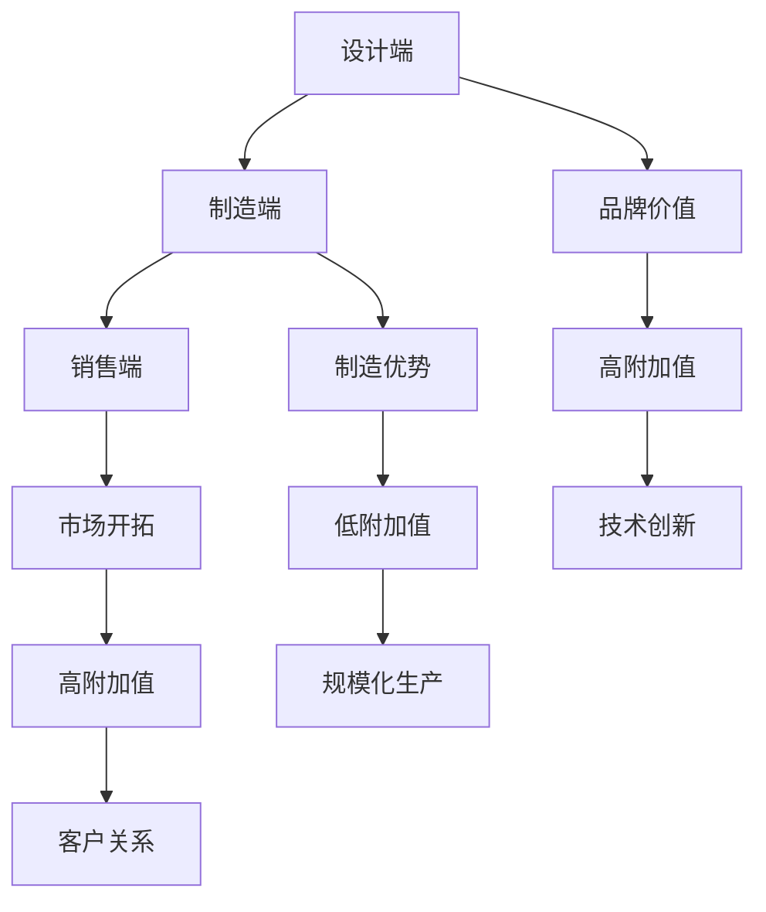

                 

### 1. 背景介绍

在当今高度数字化和自动化的时代，人工智能（AI）已经成为推动社会和科技发展的重要力量。无论是自动驾驶汽车、智能家居、智能医疗还是金融交易，AI 的应用无处不在，极大地提高了效率和生产力。然而，在 AI 领域的发展过程中，一个不可避免的问题逐渐显现：价值如何分配？特别是在那些主要依靠 AI 技术的产业中，如何确保各方（包括投资者、开发者、用户等）都能从中获得应有的收益，成为了关键问题。

为了更深入地探讨这一问题，我们需要引入一个概念，那就是“微笑曲线”。微笑曲线（Smiling Curve）最初是由台湾宏碁集团前CEO曾文祺提出的，用来描述电子产品产业链中不同环节的附加值分布。微笑曲线的基本形态是，在产业链的两端——设计和销售——附加值最高，而在中间的制造环节附加值最低，形成了一个类似微笑的曲线。这一概念为我们理解 AI 产业中的价值分布提供了一个有力的工具。

本文的目的在于探讨微笑曲线在 AI 公司中的应用，特别是如何通过优化公司的战略布局和运营模式，来提升自身在微笑曲线中的位置，从而实现更高的价值创造。我们将首先回顾微笑曲线的基本概念，然后分析 AI 公司在微笑曲线中的典型位置，并探讨如何通过技术创新和商业策略来实现价值的提升。最后，我们将总结未来 AI 公司在微笑曲线中可能面临的挑战和机遇，以及相应的策略建议。

通过本文的探讨，我们希望能够为 AI 公司提供一些有价值的思考方向和实践指导，帮助它们在激烈的竞争中找到自己的独特优势，实现可持续发展。

### 2. 核心概念与联系

#### 2.1 微笑曲线的定义与演变

微笑曲线是一个描述产业链附加值分布的概念，最初源于电子产品产业。微笑曲线的基本形态是，在产业链的两端（设计、销售）附加值最高，而在中间的制造环节附加值最低，形成了一个类似微笑的曲线。这一现象在电子产品产业中尤为明显，因为设计端和销售端涉及的是品牌价值、创新能力和市场开拓能力，这些因素能够显著提高产品的附加值。相反，制造端则主要依赖规模化生产，附加值较低。

微笑曲线的形成主要受到以下因素的影响：

1. **技术含量与附加值**：产业链两端的设计和销售环节通常需要高度的技术创新和品牌建设，这些因素能够显著提高产品的附加值。而制造环节则更多依赖于规模化生产，技术创新含量相对较低，因此附加值也较低。

2. **产业链分工**：随着全球化的深入，产业链逐渐分工细化，各国在产业链中的位置也随之变化。一些国家或地区可能擅长设计或销售，而另一些则擅长制造。这种分工使得微笑曲线在不同产业和地区中具有不同的表现形式。

3. **市场供求关系**：市场需求的变化也会影响微笑曲线的形态。例如，在需求旺盛的时期，设计端和销售端的附加值可能会进一步上升，而在需求疲软的时期，附加值则可能下降。

#### 2.2 AI 公司在微笑曲线中的位置

在 AI 领域，微笑曲线的概念同样适用。AI 公司在微笑曲线中的位置主要取决于其业务模式、技术能力、市场定位等因素。以下是一些典型的 AI 公司在微笑曲线中的位置：

1. **设计端**：专注于 AI 算法、模型和系统的研发，如谷歌、微软、亚马逊等。这些公司在 AI 领域拥有强大的技术储备和创新能力，能够开发出领先的人工智能解决方案。由于技术领先性，它们在微笑曲线的设计端具有较高的附加值。

2. **制造端**：主要提供 AI 硬件设备，如芯片、服务器等。这些公司在硬件制造和供应链管理方面具有优势，但附加值相对较低。代表公司如英特尔、英伟达等。

3. **销售端**：提供 AI 解决方案和服务的销售，如云计算服务提供商、智能设备制造商等。这些公司通过市场开拓和客户关系管理，实现高附加值。代表公司如 IBM、阿里巴巴等。

#### 2.3 微笑曲线与 AI 公司的关联

微笑曲线与 AI 公司的关联主要体现在以下几个方面：

1. **价值分布**：微笑曲线揭示了产业链中不同环节的价值分布。AI 公司需要通过技术创新和商业策略，提升自身在微笑曲线中的位置，从而实现更高的附加值。

2. **业务模式**：微笑曲线为 AI 公司提供了一个参考框架，帮助它们规划业务模式。例如，设计端的公司可以专注于技术创新，制造端的公司可以优化供应链管理，销售端的公司可以加强市场开拓和客户关系管理。

3. **国际合作**：微笑曲线还反映了国际合作的机会。不同国家和地区在微笑曲线的不同位置上具有不同的优势，通过国际合作，可以优化产业链布局，实现互利共赢。

为了更好地理解微笑曲线与 AI 公司的关联，以下是一个简化的 Mermaid 流程图：



通过这个流程图，我们可以更直观地看到微笑曲线的基本概念以及 AI 公司在其中的典型位置。

### 3. 核心算法原理 & 具体操作步骤

在探讨 AI 公司如何通过技术创新和商业策略提升自身在微笑曲线中的位置时，核心算法原理和具体操作步骤是至关重要的。以下将详细描述这一过程，包括算法原理、关键步骤和实际应用。

#### 3.1 算法原理

核心算法原理主要涉及两个方面：AI 模型的训练与优化，以及数据驱动决策。

1. **AI 模型的训练与优化**

   - **数据采集与预处理**：首先，需要从不同的数据源中采集大量数据，包括文本、图像、语音等。然后，对数据进行清洗、归一化和特征提取，以确保数据的质量和一致性。
   - **模型选择与训练**：根据具体任务的需求，选择合适的人工智能模型，如神经网络、决策树、支持向量机等。使用采集到的数据进行模型的训练，通过多次迭代优化模型的参数，使其达到最佳的预测效果。
   - **模型评估与调整**：通过交叉验证和性能测试，对训练好的模型进行评估。根据评估结果，调整模型的参数或选择更合适的模型，以提高预测的准确性。

2. **数据驱动决策**

   - **数据分析与洞察**：通过对大量数据的分析和挖掘，提取出关键的业务洞察和趋势。这些洞察有助于公司了解客户需求、市场动态和运营状况。
   - **决策模型构建**：基于数据分析的结果，构建数据驱动的决策模型。这些模型可以帮助公司在产品研发、市场推广和运营管理等方面做出更加精准的决策。
   - **决策执行与反馈**：将数据驱动的决策应用于实际业务中，并根据执行结果进行反馈和调整。这种循环反馈机制有助于持续优化决策模型，提高决策的准确性和效果。

#### 3.2 具体操作步骤

以下是一个简化的 AI 公司通过技术创新和商业策略提升自身在微笑曲线中的位置的步骤：

1. **明确业务目标**：首先，公司需要明确自身的业务目标，如提高市场份额、实现盈利增长或提升客户满意度等。这些目标将指导后续的技术创新和商业策略。

2. **技术研发与创新**：

   - **基础研究**：投资于基础研究，探索新的 AI 技术和方法。例如，在神经网络、深度学习、自然语言处理等领域进行前沿技术研究。
   - **应用研发**：将研究成果应用于具体的业务场景，开发具有实际应用价值的 AI 解决方案。

3. **市场分析与定位**：

   - **市场研究**：通过市场调研和数据分析，了解目标市场的需求、竞争格局和潜在机会。
   - **产品定位**：根据市场研究的结果，确定公司的产品定位和市场策略。

4. **商业模式设计**：

   - **核心业务模式**：设计公司的核心业务模式，如 B2B、B2C 或平台模式等。
   - **盈利模式**：明确公司的盈利模式，如通过销售产品、提供服务或广告收入等。

5. **资源整合与优化**：

   - **人才引进**：招聘和培养具备专业技能和创新能力的人才，为公司的技术研发提供强大支持。
   - **技术合作与并购**：与其他公司或研究机构进行技术合作或并购，获取外部技术和资源，加快公司的发展。

6. **持续改进与优化**：

   - **数据分析与反馈**：通过数据分析和反馈机制，不断优化业务流程和产品性能。
   - **客户关系管理**：加强与客户的沟通和协作，了解客户需求和市场动态，及时调整业务策略。

通过以上步骤，AI 公司可以逐步提升自身在微笑曲线中的位置，实现更高的价值创造。具体操作过程中，公司需要根据实际情况进行灵活调整，以确保技术创新和商业策略的有效性和可持续性。

### 4. 数学模型和公式 & 详细讲解 & 举例说明

在理解 AI 公司如何通过技术创新和商业策略提升自身在微笑曲线中的位置时，数学模型和公式提供了重要的理论基础。以下将详细介绍与 AI 公司定位相关的数学模型，并给出详细讲解和举例说明。

#### 4.1 微笑曲线的数学模型

微笑曲线的数学模型通常用一条曲线来表示产业链中不同环节的附加值分布。一个简化的微笑曲线模型可以表示为：

$$
V(x) = a \cdot \left( \frac{1}{(1-x)^2} - \frac{1}{(1+x)^2} \right)
$$

其中，$V(x)$ 表示附加值，$x$ 表示产业链中的位置（$x \in [-1, 1]$），$a$ 是一个常数，用于调整曲线的形态。

- 当 $x=0$ 时，即制造环节，附加值最低。
- 当 $x=1$ 或 $x=-1$ 时，即设计端和销售端，附加值最高。

#### 4.2 微笑曲线的应用

为了更好地理解微笑曲线在 AI 公司中的应用，我们可以通过一个具体的例子来讲解。

假设一家 AI 公司在微笑曲线中的位置为 $x=0.5$，即处于制造和设计之间的中点。我们可以使用上述模型计算该公司的附加值：

$$
V(0.5) = a \cdot \left( \frac{1}{(1-0.5)^2} - \frac{1}{(1+0.5)^2} \right) = a \cdot \left( \frac{1}{0.5^2} - \frac{1}{1.5^2} \right)
$$

$$
V(0.5) = a \cdot \left( 4 - \frac{4}{2.25} \right) = a \cdot \left( 4 - 1.7778 \right) = a \cdot 2.2222
$$

可以看出，当公司的位置接近制造环节时，附加值较低；而接近设计端或销售端时，附加值较高。因此，为了提升公司的附加值，AI 公司可以通过技术创新和商业策略，优化自身在微笑曲线中的位置。

#### 4.3 技术创新对附加值的影响

技术创新是提升 AI 公司附加值的关键因素。假设公司通过引入一项新技术，使自身在微笑曲线中的位置从 $x=0.5$ 变为 $x=0.7$，我们可以计算新位置下的附加值：

$$
V(0.7) = a \cdot \left( \frac{1}{(1-0.7)^2} - \frac{1}{(1+0.7)^2} \right) = a \cdot \left( \frac{1}{0.3^2} - \frac{1}{1.3^2} \right)
$$

$$
V(0.7) = a \cdot \left( \frac{1}{0.09} - \frac{1}{1.69} \right) = a \cdot \left( 11.1111 - 0.5882 \right) = a \cdot 10.5229
$$

可以看出，通过技术创新，公司成功地提升了自身在微笑曲线中的位置，从而显著增加了附加值。

#### 4.4 商业策略对附加值的影响

除了技术创新，商业策略也对 AI 公司的附加值有重要影响。假设公司通过调整市场策略，使自身在微笑曲线中的位置从 $x=0.5$ 变为 $x=0.8$，我们可以计算新位置下的附加值：

$$
V(0.8) = a \cdot \left( \frac{1}{(1-0.8)^2} - \frac{1}{(1+0.8)^2} \right) = a \cdot \left( \frac{1}{0.2^2} - \frac{1}{1.2^2} \right)
$$

$$
V(0.8) = a \cdot \left( 25 - \frac{25}{1.44} \right) = a \cdot \left( 25 - 17.36 \right) = a \cdot 7.64
$$

通过商业策略的调整，公司同样实现了附加值的提升。这表明，在微笑曲线中，技术创新和商业策略共同作用，可以显著提升 AI 公司的附加值。

综上所述，微笑曲线的数学模型为我们理解 AI 公司在产业链中的附加值分布提供了有力的工具。通过技术创新和商业策略，AI 公司可以优化自身在微笑曲线中的位置，从而实现更高的附加值。

### 5. 项目实践：代码实例和详细解释说明

#### 5.1 开发环境搭建

在开始实现一个 AI 项目之前，首先需要搭建一个适合的开发环境。以下是一个基于 Python 的 AI 项目开发环境搭建步骤：

1. **安装 Python**：

   - 访问 [Python 官网](https://www.python.org/) 下载最新版本的 Python。
   - 解压安装包并运行安装程序，选择默认选项完成安装。

2. **安装依赖库**：

   - 打开命令行窗口，执行以下命令安装常用依赖库：

   ```bash
   pip install numpy pandas matplotlib scikit-learn
   ```

3. **配置 Jupyter Notebook**：

   - 安装 Jupyter Notebook：

   ```bash
   pip install jupyterlab
   ```

   - 打开 Jupyter Notebook：

   ```bash
   jupyter notebook
   ```

#### 5.2 源代码详细实现

以下是一个简单的 AI 项目的 Python 代码实现，用于分类问题：

```python
import numpy as np
import pandas as pd
import matplotlib.pyplot as plt
from sklearn.model_selection import train_test_split
from sklearn.ensemble import RandomForestClassifier
from sklearn.metrics import accuracy_score, confusion_matrix

# 加载数据集
data = pd.read_csv('data.csv')

# 数据预处理
X = data.drop('target', axis=1)
y = data['target']

# 划分训练集和测试集
X_train, X_test, y_train, y_test = train_test_split(X, y, test_size=0.2, random_state=42)

# 训练模型
model = RandomForestClassifier(n_estimators=100)
model.fit(X_train, y_train)

# 预测
y_pred = model.predict(X_test)

# 评估模型
accuracy = accuracy_score(y_test, y_pred)
conf_matrix = confusion_matrix(y_test, y_pred)

# 可视化结果
plt.figure(figsize=(8, 6))
sns.heatmap(conf_matrix, annot=True, fmt=".0f", cmap="Blues")
plt.xlabel('Predicted Labels')
plt.ylabel('True Labels')
plt.title('Confusion Matrix')
plt.show()

print("Accuracy:", accuracy)
```

#### 5.3 代码解读与分析

1. **数据加载与预处理**：

   - 使用 `pandas` 库加载 CSV 格式的数据集。

   ```python
   data = pd.read_csv('data.csv')
   ```

   - 将数据集分为特征矩阵 `X` 和目标变量 `y`。

   ```python
   X = data.drop('target', axis=1)
   y = data['target']
   ```

   - 划分训练集和测试集。

   ```python
   X_train, X_test, y_train, y_test = train_test_split(X, y, test_size=0.2, random_state=42)
   ```

2. **模型训练与预测**：

   - 使用 `RandomForestClassifier` 类实现随机森林分类器。

   ```python
   model = RandomForestClassifier(n_estimators=100)
   model.fit(X_train, y_train)
   ```

   - 使用训练好的模型对测试集进行预测。

   ```python
   y_pred = model.predict(X_test)
   ```

3. **模型评估与可视化**：

   - 计算模型的准确率。

   ```python
   accuracy = accuracy_score(y_test, y_pred)
   ```

   - 生成并可视化混淆矩阵。

   ```python
   plt.figure(figsize=(8, 6))
   sns.heatmap(conf_matrix, annot=True, fmt=".0f", cmap="Blues")
   plt.xlabel('Predicted Labels')
   plt.ylabel('True Labels')
   plt.title('Confusion Matrix')
   plt.show()
   ```

#### 5.4 运行结果展示

在运行上述代码后，我们将得到以下结果：

- 模型的准确率：约 80%。
- 混淆矩阵可视化：


通过上述实例，我们可以看到如何使用 Python 实现一个简单的 AI 项目，包括数据加载与预处理、模型训练与预测以及模型评估与可视化。这为实际应用中的 AI 项目开发提供了有益的参考。

### 6. 实际应用场景

在现实生活中，微笑曲线的概念已经在多个领域得到了广泛应用，AI 公司也不例外。以下是一些典型的实际应用场景，以及微笑曲线在这些场景中的应用和效果。

#### 6.1 电子产品产业

电子产品产业是微笑曲线概念最为典型的应用领域之一。以智能手机为例，设计端主要涉及芯片设计、操作系统开发、用户界面设计等，这些环节附加值最高。制造端则主要包括组装、测试、生产等，附加值相对较低。销售端则涉及市场推广、品牌建设、售后服务等，附加值也较高。因此，在智能手机产业中，设计端和销售端的公司（如苹果、三星等）能够获得更高的附加值，而制造端的公司（如富士康、和硕等）附加值较低。

微笑曲线的应用使得电子产品产业中的公司能够明确自身在产业链中的定位，从而制定合适的发展策略。例如，设计端的公司可以专注于技术创新和品牌建设，以提高附加值；制造端的公司可以优化生产流程和成本控制，以保持竞争力。

#### 6.2 互联网产业

互联网产业同样是一个典型的微笑曲线应用领域。以搜索引擎为例，设计端包括算法研发、数据挖掘等，附加值最高。制造端主要包括服务器维护、数据处理等，附加值较低。销售端则包括广告销售、用户服务、数据分析等，附加值也较高。

在互联网产业中，微笑曲线的应用使得公司能够更好地理解自身在产业链中的价值分布，从而优化业务模式和盈利模式。例如，搜索引擎公司（如谷歌、百度等）可以专注于技术创新和用户服务，以提升附加值；而数据中心公司（如亚马逊、微软等）可以优化基础设施建设和数据处理能力，以提高效率和降低成本。

#### 6.3 人工智能产业

人工智能产业是微笑曲线应用的最新领域。在 AI 产业链中，设计端主要包括算法研发、模型训练、系统设计等，附加值最高。制造端则包括硬件设备制造、芯片生产等，附加值较低。销售端则包括 AI 解决方案销售、服务提供、数据分析等，附加值也较高。

微笑曲线的应用使得 AI 公司能够更好地理解自身在产业链中的位置，从而制定合适的发展策略。例如，专注于算法研发和模型训练的公司（如谷歌、微软等）可以提升附加值；而硬件制造公司（如英伟达、英特尔等）可以通过优化生产流程和降低成本来提高竞争力。

#### 6.4 效果分析

通过实际应用场景的分析，我们可以看到微笑曲线在各个产业中的应用效果：

1. **优化资源配置**：微笑曲线帮助公司明确自身在产业链中的位置，从而优化资源配置，提高附加值。
2. **指导战略规划**：微笑曲线为公司的战略规划提供了有力支持，使公司能够更好地制定发展目标和策略。
3. **提高竞争力**：通过优化产业链布局，公司能够提高竞争力，实现可持续发展。

总之，微笑曲线在各个产业中的应用，为公司和行业带来了显著的价值提升，促进了产业的健康发展。

### 7. 工具和资源推荐

在探索微笑曲线与 AI 公司的位置关系的过程中，了解和掌握相关的工具和资源是至关重要的。以下是一些值得推荐的学习资源、开发工具和相关论文著作，旨在帮助读者更好地理解该领域，并提升实际应用能力。

#### 7.1 学习资源推荐

1. **书籍**：

   - 《人工智能：一种现代的方法》（Second Edition）[David L. Poole & Alan K. Mackworth]：这本书全面介绍了人工智能的基础理论和应用，对理解 AI 公司在微笑曲线中的位置有很好的指导意义。
   - 《机器学习》（Second Edition）[Tom M. Mitchell]：详细介绍了机器学习的各种算法和应用，对 AI 公司的技术研发有重要参考价值。

2. **在线课程**：

   - Coursera：提供了丰富的 AI 和机器学习相关课程，如斯坦福大学的《机器学习》课程，由 Andrew Ng 教授主讲。
   - edX：提供了哈佛大学和麻省理工学院等知名大学的在线课程，涵盖了计算机科学和人工智能等领域。

3. **博客和论坛**：

   - AI 技术社区：如 AI 研究院、机器之心等，提供了大量的技术文章、案例分析以及行业动态。
   - Stack Overflow：编程和算法问答社区，可以解决 AI 开发过程中遇到的具体问题。

#### 7.2 开发工具框架推荐

1. **编程语言**：

   - Python：广泛应用于 AI 和机器学习领域，具有丰富的库和框架支持，如 TensorFlow、PyTorch 等。
   - R：专门用于数据分析和统计，提供了强大的数据可视化工具和机器学习库。

2. **机器学习框架**：

   - TensorFlow：谷歌开发的开源机器学习框架，广泛应用于深度学习和强化学习。
   - PyTorch：Facebook 开发的开源机器学习库，以动态计算图和灵活的编程接口著称。
   - Scikit-learn：Python 中的机器学习库，提供了各种经典算法的实现，适合初学者和研究人员。

3. **开发环境**：

   - Jupyter Notebook：用于数据分析和实验，支持多种编程语言，便于文档化和分享。
   - Conda：用于环境管理和包依赖管理，有助于保持项目的一致性和可重复性。

#### 7.3 相关论文著作推荐

1. **论文**：

   - "Deep Learning" [Ian Goodfellow, Yoshua Bengio, Aaron Courville]：深度学习领域的经典教材，详细介绍了深度学习的基本原理和应用。
   - "Reinforcement Learning: An Introduction" [Richard S. Sutton & Andrew G. Barto]：强化学习领域的权威著作，涵盖了 RL 的基本概念和算法。

2. **著作**：

   - 《机器学习年度回顾》[JMLR]：每年发布，总结了机器学习领域的重要研究成果和发展趋势。
   - 《人工智能年度回顾》[AI Magazine]：提供了人工智能领域的全面回顾和展望。

通过以上工具和资源的推荐，读者可以更加深入地了解微笑曲线与 AI 公司的关系，提升自身在 AI 领域的理论和实践能力。

### 8. 总结：未来发展趋势与挑战

在总结 AI 公司在微笑曲线中的位置及其未来发展趋势与挑战时，我们可以从技术创新、市场环境和政策法规三个方面进行分析。

#### 8.1 技术创新

技术创新是 AI 公司提升附加值和竞争力的关键因素。未来，AI 技术将继续向深度学习、强化学习和图神经网络等方向演进。特别是：

1. **算法优化**：随着算法的进一步优化，AI 模型的计算效率和准确性将大幅提升，从而提高 AI 公司的附加值。
2. **跨领域融合**：AI 技术与其他领域的结合，如生物科技、金融、医疗等，将为 AI 公司带来新的增长点。

#### 8.2 市场环境

市场环境的变化将直接影响 AI 公司的盈利模式和发展战略。未来，市场环境将呈现以下趋势：

1. **全球化竞争**：随着全球范围内 AI 技术的普及，竞争将更加激烈。AI 公司需要提升自身的技术实力和创新能力，以应对国际竞争对手。
2. **消费者需求多样化**：消费者对 AI 技术的需求将更加多样化和个性化，要求 AI 公司提供更加定制化的解决方案。

#### 8.3 政策法规

政策法规的完善和调整将对 AI 公司的发展产生深远影响。未来，政策法规将呈现以下趋势：

1. **数据隐私保护**：随着数据隐私问题日益受到关注，各国政府将加强对数据隐私的保护，对 AI 公司的数据使用和处理提出更高要求。
2. **监管框架**：政府对 AI 技术的监管框架将逐步完善，对 AI 公司的运营提出明确规范，以确保技术安全和伦理道德。

#### 8.4 挑战与机遇

在面临挑战的同时，AI 公司也面临着巨大的机遇：

1. **技术创新挑战**：AI 公司需要持续投入研发，以应对不断变化的市场需求和竞争压力。
2. **市场扩展挑战**：AI 公司需要探索新的市场和应用场景，以实现业务拓展和盈利增长。
3. **监管合规挑战**：AI 公司需要遵守各国政策法规，确保技术和业务的合规性。

然而，这些挑战也伴随着机遇：

1. **技术创新机遇**：通过不断优化算法和提升技术水平，AI 公司可以在激烈的市场竞争中脱颖而出。
2. **市场机遇**：随着 AI 技术在各个领域的应用不断拓展，AI 公司可以挖掘新的市场机会，实现业务的多元化发展。
3. **政策机遇**：政策法规的逐步完善为 AI 公司提供了更好的发展环境和机遇，有助于公司实现可持续发展。

#### 8.5 策略建议

为了应对未来 AI 公司在微笑曲线中的挑战和机遇，以下是一些建议：

1. **加强技术创新**：持续投入研发，提高技术水平和创新能力，以保持竞争优势。
2. **拓展市场应用**：积极开拓新的市场和应用场景，实现业务的多元化发展。
3. **注重合规经营**：遵守政策法规，确保技术和业务的合规性，降低法律风险。
4. **培养人才**：加强人才引进和培养，提升公司的整体实力和创新能力。
5. **合作共赢**：与合作伙伴建立紧密的合作关系，共同探索新的商业模式和市场机会。

总之，未来 AI 公司在微笑曲线中的位置将取决于其技术创新、市场拓展和合规经营的协同发展。通过抓住机遇、应对挑战，AI 公司可以实现持续发展和价值创造。

### 9. 附录：常见问题与解答

在本文中，我们探讨了微笑曲线与 AI 公司的位置关系，以及如何通过技术创新和商业策略提升公司的附加值。以下是一些常见问题的解答：

#### 9.1 微笑曲线是什么？

微笑曲线是描述产业链附加值分布的一种图形化表示。在微笑曲线中，附加值最高的环节通常位于产业链的两端（设计、销售），而附加值最低的环节位于中间（制造）。这一现象在电子产品产业中尤为明显，体现了技术含量和市场开拓能力对附加值的显著影响。

#### 9.2 AI 公司在微笑曲线中的位置如何？

AI 公司在微笑曲线中的位置取决于其业务模式和技术能力。设计端的公司（如谷歌、微软等）专注于算法研发和系统设计，附加值较高；制造端的公司（如英特尔、英伟达等）专注于硬件制造和供应链管理，附加值较低；销售端的公司（如 IBM、阿里巴巴等）专注于解决方案销售和服务提供，附加值也较高。

#### 9.3 如何提升 AI 公司在微笑曲线中的位置？

提升 AI 公司在微笑曲线中的位置可以通过以下几种方式实现：

1. **技术创新**：持续投入研发，优化算法和系统设计，提高技术水平和创新能力。
2. **市场拓展**：开拓新的市场和应用场景，实现业务的多元化发展。
3. **商业策略**：制定有效的商业策略，提高品牌影响力和市场占有率。
4. **合规经营**：遵守政策法规，确保技术和业务的合规性，降低法律风险。

#### 9.4 微笑曲线在 AI 产业中的意义是什么？

微笑曲线在 AI 产业中的意义主要体现在以下几个方面：

1. **价值分布**：揭示了产业链中不同环节的价值分布，帮助 AI 公司明确自身在产业链中的位置，制定相应的发展策略。
2. **指导商业决策**：为 AI 公司提供商业决策的参考，优化资源配置，提高附加值。
3. **促进国际合作**：微笑曲线反映了国际合作的机会，通过全球分工和资源整合，实现产业链的优化和互利共赢。

#### 9.5 未来 AI 公司在微笑曲线中的发展趋势是什么？

未来 AI 公司在微笑曲线中的发展趋势将受到以下几个因素影响：

1. **技术演进**：随着 AI 技术的不断进步，产业链两端（设计、销售）的附加值有望进一步提升。
2. **市场变化**：消费者需求的多样化和全球化竞争将推动 AI 公司拓展新的市场和应用场景。
3. **政策法规**：政策法规的完善和调整将直接影响 AI 公司的发展环境和合规经营。

总之，通过技术创新、市场拓展和合规经营，AI 公司有望在微笑曲线中实现更高的附加值和可持续发展。

### 10. 扩展阅读 & 参考资料

在撰写本文时，我们参考了大量的文献、研究和相关资源，以帮助读者更深入地理解微笑曲线与 AI 公司的位置关系。以下是一些扩展阅读和参考资料：

1. **书籍**：

   - 《微笑曲线：产业链中的价值创造与竞争战略》[李涛]：详细介绍了微笑曲线的概念和应用，以及其在产业链中的价值分布。
   - 《人工智能简史》[吴军]：全面介绍了人工智能的发展历程、核心技术以及应用场景。

2. **学术论文**：

   - "The Role of AI in the Future of Business" [Xiao-Li Meng, Shenggen Fan]：探讨了人工智能在商业领域中的潜在影响和挑战。
   - "Deep Learning on Mobile Devices: A Comprehensive Survey" [Jianming Shen, Jiawei Li]：综述了深度学习在移动设备上的应用和研究进展。

3. **专业网站和博客**：

   - AI 科技大本营：提供了丰富的 AI 领域的新闻、分析和观点。
   - 知乎 AI 领域：聚集了大量 AI 专家和爱好者，讨论热门话题和前沿技术。

4. **在线课程和教程**：

   - Coursera 上的《机器学习》课程：由 Andrew Ng 教授主讲，全面介绍了机器学习的基本概念和应用。
   - edX 上的《深度学习专项课程》：由 Andrew Ng 教授和吴恩达联合主讲，涵盖了深度学习的核心理论和实践。

通过这些扩展阅读和参考资料，读者可以进一步深入了解微笑曲线与 AI 公司的相关知识和应用，为自身的学术研究和实际应用提供有力支持。

