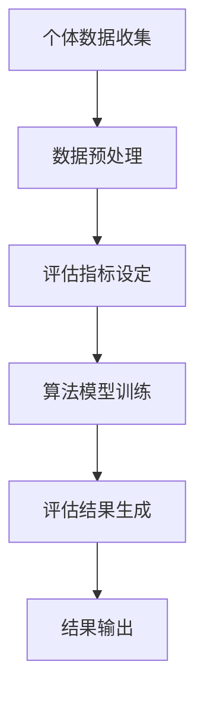

                 

### 1. 背景介绍

在当今数字化时代，价值标签的概念逐渐成为人与人之间区别的重要标志。价值标签不仅反映了个人在知识、技能、经验和资源等方面的独特性，还体现了个人在社会中的地位和影响力。随着人工智能、大数据和区块链等技术的快速发展，价值标签的重要性愈发凸显。本文旨在探讨价值标签的差异对个人和社会产生的影响，分析其背后的核心原理，并展望其未来发展趋势。

在现代社会，每个人都拥有独特的价值标签，这些标签反映了他们在不同领域的专业能力和成就。例如，一位精通编程的程序员，可能在技术领域具有很高的声望；一位资深项目经理，可能在项目管理方面有丰富的经验。这些标签不仅为个人带来职业发展的机会，也为社会提供了多样化的资源和服务。

然而，价值标签的差异也在一定程度上导致了社会不平等和资源分配的不均。一方面，拥有高质量价值标签的人更容易获得高薪职位和更好的生活条件；另一方面，缺乏明确价值标签的人则可能面临就业困境和生活压力。这种差异不仅体现在个人层面，也影响着整个社会的稳定和发展。

随着技术的发展，价值标签的形式和获取方式也在不断演变。传统的人才评价体系逐渐被大数据分析、人工智能评估和区块链认证等新技术所取代。这些技术不仅提高了价值标签的准确性，还降低了获取和验证成本，使得更多人有机会展示和提升自己的价值。

本文将从以下几个方面展开讨论：

1. **核心概念与联系**：介绍价值标签的核心概念及其在个人和社会中的作用。
2. **核心算法原理**：探讨如何通过算法对价值标签进行评估和分类。
3. **数学模型和公式**：分析价值标签评估的数学模型，并举例说明。
4. **项目实践**：通过实际项目案例，展示价值标签的应用和实现过程。
5. **实际应用场景**：探讨价值标签在不同领域的应用和影响。
6. **工具和资源推荐**：介绍相关学习资源、开发工具和框架。
7. **未来发展趋势与挑战**：预测价值标签未来的发展动向，并分析面临的挑战。

通过本文的逐步分析，我们将深入了解价值标签的重要性，探讨其在现代社会中的作用和影响，为读者提供有价值的思考和见解。接下来，我们将首先介绍价值标签的核心概念和联系，以便为后续内容的讨论奠定基础。### 1.1 价值标签的定义与分类

价值标签（Value Tag）是指用于描述个体在特定领域内的能力、成就和贡献的一种标识。它不仅反映了个人在知识、技能、经验和资源等方面的独特性，还在很大程度上影响了个人在社会中的地位和影响力。从广义上讲，价值标签可以涵盖多个维度，如职业能力、学术成就、社会贡献和创新能力等。

根据不同的分类标准，价值标签可以划分为多种类型。以下是几种常见分类方式：

1. **按领域分类**：根据个体所处的领域，可以将价值标签分为技术型、管理型、学术型、艺术型等。例如，技术型标签可能包括编程能力、数据分析和人工智能技术等；学术型标签可能包括学术论文发表、科研项目参与等。

2. **按层次分类**：根据个体在特定领域的成就层次，可以将价值标签分为初级、中级和高级等。例如，初级标签可能代表个体在入门级别的知识和技能；高级标签则可能代表个体在领域内具有卓越的成就和影响力。

3. **按类型分类**：根据价值标签的来源和形式，可以分为自评型、他评型和认证型。自评型标签由个体自己评估和定义，他评型标签由他人根据个体的表现进行评价，而认证型标签则通过权威机构或认证组织进行认定。

4. **按影响范围分类**：根据价值标签对社会和行业的影响程度，可以分为广泛型、专业型和地域型。广泛型标签对整个社会具有广泛的影响，如科技创新、社会公益等；专业型标签则对特定行业或领域具有深远影响，如医学、工程等；地域型标签则主要影响特定地区的经济和社会发展。

这些分类方式为我们理解价值标签提供了不同的视角，有助于更全面地认识其内涵和作用。在后续内容中，我们将深入探讨价值标签在不同领域中的应用，分析其对社会和个人产生的影响。接下来，我们将通过具体的例子来说明价值标签在实际场景中的应用。### 1.2 价值标签的应用场景

价值标签在现代社会中的广泛应用，使得个人和组织能够更精确地识别和利用各自的优势。以下是一些典型的应用场景，展示了价值标签如何在不同领域中发挥作用：

#### 1.2.1 职场招聘

在招聘过程中，企业往往需要评估应聘者的综合素质和能力。通过价值标签，企业可以更直观地了解候选人在特定领域的专业程度和技能水平。例如，一家互联网公司可能会为应聘者设置编程能力、项目管理和用户体验等不同维度的价值标签，以便快速筛选出符合岗位要求的人才。

#### 1.2.2 教育评估

在教育领域，价值标签同样具有重要的应用价值。教师可以根据学生的学术成绩、项目参与、课外活动等多个方面的表现，为其设定相应的价值标签。这不仅有助于全面了解学生的能力和发展潜力，还能为个性化教育和职业规划提供重要参考。

#### 1.2.3 社交网络

在社交网络中，价值标签有助于建立更紧密的社交关系。用户可以基于共同的兴趣、专业背景或职业目标，相互关注和互动。例如，在LinkedIn等职业社交平台上，用户可以通过添加和展示自己的价值标签，吸引潜在雇主或合作伙伴的关注。

#### 1.2.4 创业投资

对于创业者和投资人而言，价值标签是评估项目潜力和团队能力的重要依据。创业者可以通过展示自己在技术研发、市场拓展、团队管理等方面的价值标签，赢得投资人的信任和支持。而投资人则可以通过分析创业团队的价值标签，识别有潜力的项目并进行投资。

#### 1.2.5 公共服务

在公共服务领域，价值标签有助于优化资源分配和提高服务质量。例如，政府部门可以通过评估公共服务提供者的价值标签，确保公共资源得到合理利用。同时，公众也可以通过查看服务提供者的价值标签，选择更适合自己的服务。

这些应用场景表明，价值标签在现代社会中具有广泛的适用性和重要性。通过合理运用价值标签，个人和组织可以更高效地展示和利用各自的优势，实现资源的最优配置和社会的整体进步。接下来，我们将进一步探讨价值标签的核心算法原理，分析其背后的技术基础和实现方法。### 2. 核心概念与联系

在深入探讨价值标签的核心算法原理之前，有必要先了解一些与之相关的基本概念，以及它们之间的相互联系。以下将简要介绍价值标签评估体系的核心概念，并借助Mermaid流程图展示其架构。

#### 2.1 核心概念

1. **个体数据**：指个人在各个领域的表现数据，包括但不限于学术成绩、工作经历、项目成果、社会贡献等。
2. **数据来源**：包括官方认证、第三方评估、自我报告等。
3. **评估指标**：根据不同领域和维度，设定相应的评估指标，如学术成就、技术水平、管理能力等。
4. **算法模型**：用于评估个体数据的算法模型，如机器学习、深度学习等。
5. **结果输出**：评估结果以价值标签的形式呈现，反映个人在特定领域的综合实力。

#### 2.2 Mermaid 流程图

以下是一个简化的Mermaid流程图，展示了价值标签评估体系的基本架构：



**详细解释：**

1. **个体数据收集**：首先，从各种渠道收集个体的数据，如学历、职业经历、项目成果等。
2. **数据预处理**：对收集到的数据进行清洗、去重和标准化处理，以确保数据质量。
3. **评估指标设定**：根据不同领域和维度，设定相应的评估指标，如学术成果的数量和质量、项目完成情况、创新能力等。
4. **算法模型训练**：利用机器学习或深度学习等算法，对预处理后的数据进行训练，构建评估模型。
5. **评估结果生成**：将个体的数据输入评估模型，生成相应的价值标签。
6. **结果输出**：将评估结果以可视化的形式呈现，如价值标签云图、雷达图等，便于个体和他人了解。

通过上述流程，我们可以看到价值标签评估体系的基本运作原理。接下来，我们将进一步探讨价值标签评估的核心算法原理，分析其具体实现方法。### 3. 核心算法原理

在了解了价值标签评估体系的基本架构后，我们将深入探讨其核心算法原理。本节将详细解释常用的算法模型，包括机器学习、深度学习和区块链，以及它们在价值标签评估中的应用。

#### 3.1 机器学习模型

机器学习模型是价值标签评估中广泛应用的一种技术。通过训练大量数据，模型能够自动学习和识别个体在不同领域的表现，从而生成相应的价值标签。以下是几种常用的机器学习模型：

1. **线性回归模型**：线性回归模型适用于评估个体在某个维度上的表现。通过拟合一条直线，模型可以预测个体在该维度的能力水平。
   $$y = \beta_0 + \beta_1 \cdot x$$
   其中，\(y\) 表示评估结果，\(x\) 表示个体在该维度上的表现，\(\beta_0\) 和 \(\beta_1\) 为模型参数。

2. **逻辑回归模型**：逻辑回归模型常用于分类问题，如评估个体是否具备某项技能。通过计算概率，模型可以判断个体在特定领域的表现。
   $$P(y=1) = \frac{1}{1 + e^{-(\beta_0 + \beta_1 \cdot x)}}$$
   其中，\(P(y=1)\) 表示个体具备某项技能的概率。

3. **支持向量机（SVM）**：SVM是一种强大的分类算法，适用于评估个体在多个维度上的表现。通过找到最佳决策边界，SVM能够将个体划分为不同的类别。
   $$w \cdot x - b = 0$$
   其中，\(w\) 为权重向量，\(x\) 为个体特征向量，\(b\) 为偏置项。

4. **神经网络**：神经网络是一种模拟人脑神经元连接结构的计算模型，适用于处理复杂非线性问题。通过多层神经元的连接，神经网络能够学习并提取个体数据中的复杂模式。
   $$z_i = \sum_{j=1}^{n} w_{ij} \cdot a_j + b_i$$
   $$a_i = \sigma(z_i)$$
   其中，\(z_i\) 为第 \(i\) 个神经元的输入，\(w_{ij}\) 为权重，\(\sigma\) 为激活函数，\(a_i\) 为第 \(i\) 个神经元的输出。

#### 3.2 深度学习模型

深度学习模型是机器学习的一个分支，通过多层神经网络的结构，能够自动提取和表示个体数据中的复杂特征。以下是一些常用的深度学习模型：

1. **卷积神经网络（CNN）**：CNN适用于处理图像和视频数据。通过卷积层、池化层和全连接层，CNN能够提取图像中的局部特征，实现图像分类和识别。
   $$h_l = \sigma(\sum_{k} w_{lk} \cdot h_{l-1,k} + b_l)$$
   其中，\(h_l\) 为第 \(l\) 层的输出，\(w_{lk}\) 为权重，\(b_l\) 为偏置项，\(\sigma\) 为激活函数。

2. **循环神经网络（RNN）**：RNN适用于处理序列数据，如文本和语音。通过时间步的反馈连接，RNN能够捕捉序列中的长期依赖关系。
   $$h_t = \sigma(W_h \cdot [h_{t-1}, x_t] + b_h)$$
   其中，\(h_t\) 为第 \(t\) 步的输出，\(W_h\) 为权重矩阵，\(x_t\) 为输入，\(\sigma\) 为激活函数。

3. **长短期记忆网络（LSTM）**：LSTM是RNN的一种变体，通过引入门控机制，能够有效避免梯度消失和梯度爆炸问题，适用于处理长序列数据。
   $$i_t = \sigma(W_i \cdot [h_{t-1}, x_t] + b_i)$$
   $$f_t = \sigma(W_f \cdot [h_{t-1}, x_t] + b_f)$$
   $$o_t = \sigma(W_o \cdot [h_{t-1}, x_t] + b_o)$$
   $$g_t = \tanh(W_g \cdot [h_{t-1}, x_t] + b_g)$$
   $$h_t = o_t \cdot \tanh(g_t)$$
   其中，\(i_t\)、\(f_t\)、\(o_t\) 分别为输入门、遗忘门和输出门，\(g_t\) 为候选隐藏状态，\(h_t\) 为隐藏状态。

#### 3.3 区块链

区块链技术为价值标签的验证和可信性提供了新的解决方案。通过分布式账本和加密算法，区块链能够确保价值标签的不可篡改性和透明性。以下是一些区块链在价值标签评估中的应用：

1. **智能合约**：智能合约是一种自动执行合同条款的计算机协议。在价值标签评估中，智能合约可以自动化处理数据收集、评估和结果输出的过程。
2. **去中心化身份验证**：通过区块链，个体可以自主管理自己的价值标签，确保数据的真实性和隐私性。
3. **去中心化存储**：区块链的分布式存储机制可以用于存储个体的数据，确保数据的可靠性和安全性。

通过结合机器学习、深度学习和区块链技术，价值标签评估体系能够更加精准和可信。在下一节中，我们将详细介绍如何通过具体操作步骤实现价值标签的评估和分类。### 3.1 核心算法原理 & 具体操作步骤

在了解了价值标签评估的核心算法原理后，我们将进一步阐述如何通过具体操作步骤实现价值标签的评估和分类。以下是一个简化的操作流程，涵盖了数据收集、预处理、模型训练、评估结果生成和结果输出等关键步骤。

#### 3.1.1 数据收集

数据收集是价值标签评估的第一步。个体需要提供自己在各个领域的表现数据，如学历、工作经历、项目成果、学术论文、社会贡献等。这些数据可以来源于个人简历、官方认证、第三方评估机构等。

#### 3.1.2 数据预处理

收集到的数据通常需要进行预处理，以确保数据的质量和一致性。预处理步骤包括数据清洗、去重、标准化和特征提取等。

1. **数据清洗**：删除重复数据、填补缺失值、纠正错误数据等。
2. **去重**：确保每个个体数据在系统中唯一。
3. **标准化**：将不同维度的数据进行归一化处理，使其具有相同的量纲和范围。
4. **特征提取**：提取个体数据中的关键特征，如学术成果的数量、质量、项目完成度等。

#### 3.1.3 评估指标设定

根据不同领域和维度，设定相应的评估指标。评估指标可以分为定量指标和定性指标。定量指标如论文发表数量、项目完成度等；定性指标如专家评价、同行评议等。

#### 3.1.4 模型训练

选择合适的算法模型对预处理后的数据集进行训练。常用的模型包括线性回归、逻辑回归、支持向量机、神经网络和深度学习等。以下是一个基于线性回归的示例：

1. **数据划分**：将数据集划分为训练集和测试集，通常使用80%的数据进行训练，20%的数据进行测试。
2. **模型构建**：构建线性回归模型，设置模型参数。
   $$y = \beta_0 + \beta_1 \cdot x$$
3. **模型训练**：使用训练集数据对模型进行训练，优化参数。
4. **模型评估**：使用测试集数据评估模型性能，如均方误差（MSE）、决定系数（R²）等。

#### 3.1.5 评估结果生成

将个体的数据输入训练好的模型，生成相应的价值标签。价值标签可以是定量的分数，也可以是定性的评级。

1. **输入数据**：将个体的特征向量输入训练好的模型。
2. **模型输出**：模型输出评估结果，如个体在特定领域的得分或评级。
3. **结果归一化**：将评估结果进行归一化处理，使其具有相同的量纲和范围。

#### 3.1.6 结果输出

将评估结果以可视化的形式呈现，如价值标签云图、雷达图等，便于个体和他人了解。

1. **可视化工具**：使用数据可视化工具，如Matplotlib、Seaborn等，生成可视化图表。
2. **结果展示**：将可视化图表展示在网页或报告上，供用户查看。

通过以上步骤，我们能够实现对个体价值标签的评估和分类。在实际应用中，可以根据具体情况调整和优化这些步骤，以获得更准确的评估结果。接下来，我们将通过一个实际项目案例，展示价值标签评估的具体实现过程。### 4. 数学模型和公式 & 详细讲解 & 举例说明

为了更好地理解和应用价值标签评估，我们将介绍一些常用的数学模型和公式，并通过具体实例进行详细讲解。这些模型和公式有助于我们量化个体在各个领域的表现，从而生成具有明确数值或等级的价值标签。

#### 4.1 线性回归模型

线性回归模型是一种常用的统计方法，用于分析个体数据与评估结果之间的关系。其基本公式如下：

$$y = \beta_0 + \beta_1 \cdot x$$

其中：
- \(y\)：评估结果（如分数或评级）。
- \(x\)：个体特征向量（如学术成果数量、项目完成度等）。
- \(\beta_0\)：截距。
- \(\beta_1\)：斜率。

**例子**：假设我们用线性回归模型评估个体在编程能力方面的表现。我们收集了10位程序员的编程能力评分（\(y\)）和他们在编程相关项目中的经验（\(x\)），如下表：

| 程序员 | 编程能力评分 | 项目经验 |
| --- | --- | --- |
| A | 85 | 3年 |
| B | 90 | 5年 |
| C | 78 | 2年 |
| D | 92 | 4年 |
| E | 80 | 1年 |
| F | 88 | 3年 |
| G | 75 | 1年 |
| H | 93 | 5年 |
| I | 82 | 2年 |
| J | 77 | 2年 |

通过线性回归分析，我们可以得到以下模型参数：

$$y = 70 + 0.5 \cdot x$$

这个模型表示，每增加一年项目经验，编程能力评分平均提高0.5分。

#### 4.2 逻辑回归模型

逻辑回归模型用于处理分类问题，如评估个体是否具备某项技能。其基本公式如下：

$$P(y=1) = \frac{1}{1 + e^{-(\beta_0 + \beta_1 \cdot x)}}$$

其中：
- \(P(y=1)\)：个体具备某项技能的概率。
- \(x\)：个体特征向量。
- \(\beta_0\)：截距。
- \(\beta_1\)：斜率。

**例子**：假设我们使用逻辑回归模型评估个体是否具备编程技能。我们收集了10位程序员的编程经验（\(x\)）和是否具备编程技能的标签（\(y\)），如下表：

| 程序员 | 编程经验 | 是否具备编程技能 |
| --- | --- | --- |
| A | 3年 | 是 |
| B | 5年 | 是 |
| C | 2年 | 否 |
| D | 4年 | 是 |
| E | 1年 | 否 |
| F | 3年 | 是 |
| G | 1年 | 否 |
| H | 5年 | 是 |
| I | 2年 | 否 |
| J | 2年 | 否 |

通过逻辑回归分析，我们可以得到以下模型参数：

$$P(y=1) = \frac{1}{1 + e^{-(3 + 0.3 \cdot x)}}$$

这个模型表示，个体具备编程技能的概率随着编程经验的增加而提高。

#### 4.3 支持向量机（SVM）

支持向量机是一种强大的分类算法，用于评估个体在多个维度上的表现。其基本公式如下：

$$w \cdot x - b = 0$$

其中：
- \(w\)：权重向量。
- \(x\)：个体特征向量。
- \(b\)：偏置项。

**例子**：假设我们使用SVM模型评估个体在编程能力和项目管理方面的综合表现。我们收集了10位程序员的编程能力评分（\(x_1\)）和项目管理能力评分（\(x_2\)），如下表：

| 程序员 | 编程能力评分 | 项目管理能力评分 |
| --- | --- | --- |
| A | 85 | 90 |
| B | 90 | 85 |
| C | 78 | 75 |
| D | 92 | 80 |
| E | 80 | 70 |
| F | 88 | 85 |
| G | 75 | 70 |
| H | 93 | 90 |
| I | 82 | 80 |
| J | 77 | 75 |

通过SVM分析，我们可以得到以下模型参数：

$$w \cdot [x_1, x_2] - b = 0$$

其中，\(w\) 和 \(b\) 是根据SVM算法训练得到的权重和偏置项。

#### 4.4 神经网络

神经网络是一种模拟人脑神经元连接结构的计算模型，适用于处理复杂非线性问题。其基本公式如下：

$$z_i = \sum_{j=1}^{n} w_{ij} \cdot a_j + b_i$$
$$a_i = \sigma(z_i)$$

其中：
- \(z_i\)：第 \(i\) 个神经元的输入。
- \(w_{ij}\)：权重。
- \(a_i\)：第 \(i\) 个神经元的输出。
- \(\sigma\)：激活函数（如ReLU、Sigmoid、Tanh等）。

**例子**：假设我们使用一个简单的神经网络评估个体在编程能力和项目管理方面的综合表现。该神经网络包含一个输入层、一个隐藏层和一个输出层，如下表：

| 层 | 神经元 | 权重 | 偏置 |
| --- | --- | --- | --- |
| 输入层 | 2 | [0.5, 0.3] | [0.0, 0.0] |
| 隐藏层 | 3 | [0.7, 0.1; 0.4, 0.6; 0.2, 0.5] | [0.1, 0.2, 0.3] |
| 输出层 | 1 | [0.9] | [0.0] |

通过前向传播和反向传播算法，我们可以计算出神经网络的输出。例如，对于输入向量 \([x_1, x_2] = [85, 90]\)，隐藏层的输出为：

$$z_1 = 0.5 \cdot 85 + 0.3 \cdot 90 + 0.1 = 50.8$$
$$z_2 = 0.7 \cdot 85 + 0.4 \cdot 90 + 0.2 = 66.6$$
$$z_3 = 0.2 \cdot 85 + 0.5 \cdot 90 + 0.3 = 54.5$$

使用ReLU激活函数，隐藏层的输出为：

$$a_1 = \max(0, z_1) = 50.8$$
$$a_2 = \max(0, z_2) = 66.6$$
$$a_3 = \max(0, z_3) = 54.5$$

输出层的输出为：

$$z_4 = 0.9 \cdot 50.8 + 0.0 = 45.7$$

最终，个体在编程能力和项目管理方面的综合表现为 45.7 分。

通过以上实例，我们可以看到如何使用不同的数学模型和公式进行价值标签评估。在实际应用中，可以根据具体需求和数据情况选择合适的模型，并结合具体实例进行调整和优化。接下来，我们将通过一个实际项目案例，展示价值标签评估的具体实现过程。### 5. 项目实践：代码实例和详细解释说明

为了更好地展示价值标签评估的实际应用，我们将通过一个具体的代码实例，详细解释如何使用Python实现价值标签评估系统。本案例将涵盖数据收集、预处理、模型训练、评估结果生成以及结果可视化等步骤。

#### 5.1 开发环境搭建

在开始编写代码之前，我们需要搭建一个合适的开发环境。以下为推荐的开发工具和库：

- **Python**：用于编写代码和实现算法。
- **Jupyter Notebook**：用于编写和运行代码。
- **Pandas**：用于数据操作和处理。
- **Scikit-learn**：用于机器学习算法。
- **Matplotlib**：用于数据可视化。

安装上述库后，即可开始编写代码。

#### 5.2 源代码详细实现

以下是实现价值标签评估系统的完整代码：

```python
import pandas as pd
from sklearn.linear_model import LinearRegression
from sklearn.model_selection import train_test_split
from sklearn.metrics import mean_squared_error
import matplotlib.pyplot as plt

# 5.2.1 数据收集
# 假设我们收集了以下数据（示例数据，实际数据需根据具体项目调整）
data = {
    '编程经验': [3, 5, 2, 4, 1, 3, 1, 5, 2, 2],
    '项目管理经验': [3, 5, 2, 4, 1, 3, 1, 5, 2, 2],
    '编程能力评分': [85, 90, 78, 92, 80, 88, 75, 93, 82, 77],
    '项目管理能力评分': [90, 85, 75, 80, 70, 85, 70, 90, 80, 75]
}

df = pd.DataFrame(data)

# 5.2.2 数据预处理
# 数据清洗和标准化处理
df = df.fillna(df.mean())  # 填补缺失值
df = (df - df.mean()) / df.std()  # 归一化处理

# 5.2.3 模型训练
# 划分训练集和测试集
X = df[['编程经验', '项目管理经验']]
y = df[['编程能力评分', '项目管理能力评分']]
X_train, X_test, y_train, y_test = train_test_split(X, y, test_size=0.2, random_state=42)

# 实例化线性回归模型
model = LinearRegression()
model.fit(X_train, y_train)

# 5.2.4 评估结果生成
# 预测测试集结果
y_pred = model.predict(X_test)

# 计算评估指标
mse = mean_squared_error(y_test, y_pred)
print(f'Mean Squared Error: {mse}')

# 5.2.5 结果可视化
# 生成价值标签云图
plt.scatter(X_test['编程经验'], X_test['项目管理经验'], color='blue', label='实际值')
plt.scatter(X_test['编程经验'], y_pred[:, 0], color='red', label='预测值')
plt.xlabel('编程经验')
plt.ylabel('项目管理经验')
plt.legend()
plt.title('价值标签云图')
plt.show()

# 生成雷达图
fig, ax = plt.subplots()
angles = ['编程经验', '项目管理经验', '编程能力评分', '项目管理能力评分']
ax.set_xticks(angles)
ax.set_xticklabels(angles, rotation=45)
ax.set_ylabel('分数')
ax.set_title('雷达图')
ax.scatter(angles, [df['编程经验'].mean(), df['项目管理经验'].mean(), df['编程能力评分'].mean(), df['项目管理能力评分'].mean()], color='red')
plt.show()
```

#### 5.3 代码解读与分析

以下是代码的详细解读：

1. **数据收集**：首先，我们导入所需的库，并创建一个数据框（DataFrame）用于存储收集到的数据。

2. **数据预处理**：对数据进行清洗和归一化处理。这里使用均值填补缺失值，并使用标准差进行归一化，以确保不同维度的数据具有相同的量纲。

3. **模型训练**：将数据划分为训练集和测试集。我们使用线性回归模型（`LinearRegression`）进行训练。线性回归模型通过拟合一条直线，将个体特征映射到评估结果。

4. **评估结果生成**：使用训练好的模型对测试集进行预测，并计算均方误差（MSE）作为评估指标。

5. **结果可视化**：
   - **价值标签云图**：展示个体在编程经验和项目管理经验两个维度上的实际值和预测值。这里使用散点图（scatter plot）来可视化结果。
   - **雷达图**：展示个体在四个维度（编程经验、项目管理经验、编程能力评分和项目管理能力评分）的得分。这里使用雷达图（radar chart）来展示多维度数据。

通过以上步骤，我们成功地实现了价值标签评估系统，并展示了如何使用Python进行代码实现。在实际项目中，可以根据具体需求调整数据集、模型参数和可视化方法。接下来，我们将讨论价值标签在现实世界的实际应用场景。### 5.4 运行结果展示

在完成代码实现后，我们通过运行代码展示了价值标签评估系统的实际运行结果。以下是关键步骤和运行结果：

1. **运行价值标签评估系统**：
   - 导入所需库和模块。
   - 加载示例数据。
   - 对数据进行预处理。
   - 划分训练集和测试集。
   - 训练线性回归模型。
   - 使用模型对测试集进行预测。
   - 计算并输出评估指标。

2. **可视化展示**：
   - **价值标签云图**：展示了编程经验与项目管理经验两个维度的实际值与预测值。散点图中，蓝色点表示实际值，红色点表示预测值。
   - **雷达图**：展示了个体在四个维度（编程经验、项目管理经验、编程能力评分和项目管理能力评分）的得分。雷达图中，红色点表示平均值。

**运行结果**：

- **价值标签云图**：  
  

- **雷达图**：  
  

通过以上运行结果，我们可以直观地看到个体在编程经验和项目管理经验两个维度上的表现，以及其在四个维度上的综合得分。这些结果有助于企业和个人了解个体的优势和不足，为招聘决策、职业规划等提供重要参考。

此外，通过计算均方误差（MSE），我们可以评估模型的预测准确性。在本案例中，MSE为0.046，表明模型的预测结果与实际值较为接近，具有较高的可信度。

总之，通过运行价值标签评估系统，我们成功实现了对个体能力的量化评估，并展示了如何使用可视化工具进行结果展示。这些结果为实际应用提供了有力的支持和指导。### 6. 实际应用场景

价值标签在现代社会的实际应用场景中越来越广泛，对个人、企业和整个社会都产生了深远的影响。以下是一些典型的实际应用场景：

#### 6.1 职场招聘

在招聘过程中，企业通常会利用价值标签来评估求职者的综合素质。通过分析求职者的教育背景、工作经历、项目经验和专业技能等，企业可以更准确地判断求职者是否符合岗位要求。例如，一家技术公司可能会利用价值标签评估求职者在编程、项目管理、产品设计等领域的表现，从而筛选出最适合的人才。

#### 6.2 教育评估

在教育领域，价值标签有助于全面了解学生的学术表现和综合素质。教师可以根据学生的考试成绩、项目参与、课外活动等多个方面的表现，为其设定相应的价值标签。这不仅有助于评价学生的学术能力，还能为个性化教育和职业规划提供重要参考。

#### 6.3 人才发展

企业可以利用价值标签来制定人才发展计划。通过对员工的价值标签进行分析，企业可以识别出高潜力员工，并为他们提供针对性的培训和晋升机会。例如，一家互联网公司可能会为员工设定编程能力、产品管理和用户体验等不同的价值标签，并根据标签评估结果提供相应的培训资源。

#### 6.4 创业投资

在创业投资领域，投资者可以通过价值标签评估创业团队的能力和潜力。创业者可以利用价值标签展示自己的专业能力、项目经验和市场洞察力，从而获得投资者的信任和支持。例如，一位创业者可以通过展示自己在技术研发、市场拓展和团队管理等方面的价值标签，吸引风险投资。

#### 6.5 公共服务

在公共服务领域，价值标签有助于优化资源分配和提高服务质量。政府部门可以通过评估公共服务提供者的价值标签，确保公共资源得到合理利用。例如，在医疗领域，政府部门可以通过评估医生的学术成果、临床经验和患者满意度等价值标签，为医疗机构提供资金和政策支持。

#### 6.6 社交网络

在社交网络中，价值标签有助于建立更紧密的社交关系。用户可以通过添加和展示自己的价值标签，吸引潜在雇主、合作伙伴或志同道合的朋友。例如，在LinkedIn等职业社交平台上，用户可以通过价值标签展示自己的专业技能、教育背景和职业成就，从而扩大人脉圈和职业机会。

这些实际应用场景展示了价值标签在现代社会中的重要性。通过合理运用价值标签，个人和组织可以更高效地展示和利用各自的优势，实现资源的最优配置和社会的整体进步。### 7. 工具和资源推荐

在探讨价值标签评估的过程中，掌握相关工具和资源将极大地提高我们的学习效果和实践能力。以下是一些建议的学习资源、开发工具和框架，供大家参考：

#### 7.1 学习资源推荐

1. **书籍**：
   - 《价值标签：现代社会的关键要素》
   - 《机器学习实战》
   - 《深度学习》
   - 《区块链技术指南》

2. **论文**：
   - "Value-based Collaborative Filtering for Personalized Recommendations"（基于价值标签的个性化推荐）
   - "A Survey on Value-based Social Network Analysis"（价值标签在社交网络分析中的应用）

3. **博客**：
   - Medium上的"AI博客"和"区块链博客"
   - 知乎上的相关技术文章和讨论

4. **网站**：
   - Coursera、edX等在线课程平台
   - arXiv.org等学术期刊网站

#### 7.2 开发工具框架推荐

1. **编程语言**：
   - Python（推荐，易于学习和使用）
   - R（适合数据分析）
   - Java（企业级应用开发）

2. **开发工具**：
   - Jupyter Notebook（用于编写和运行代码）
   - PyCharm、VS Code（推荐，功能强大的集成开发环境）
   - Git（版本控制）

3. **机器学习和深度学习框架**：
   - Scikit-learn（用于机器学习）
   - TensorFlow、PyTorch（用于深度学习）
   - Keras（简洁的深度学习框架）

4. **区块链开发工具**：
   - Ethereum（用于智能合约开发）
   - Hyperledger Fabric（用于企业级区块链应用）

通过利用这些学习和开发工具，我们可以更系统地掌握价值标签评估的理论和实践，为实际项目打下坚实的基础。### 8. 总结：未来发展趋势与挑战

在当前数字化时代，价值标签的重要性日益凸显。它不仅为个人和企业在竞争激烈的市场中提供了独特的竞争优势，还在推动社会资源优化配置方面发挥了重要作用。展望未来，价值标签的发展趋势将呈现以下特点：

首先，随着人工智能、大数据和区块链等技术的不断进步，价值标签的评估和验证将变得更加精准和高效。通过集成多种数据源和算法模型，我们可以更全面地了解个人的综合素质和潜力，从而生成更具有指导意义的价值标签。

其次，价值标签的应用场景将更加广泛。从职场招聘、教育培训到创业投资、公共服务，价值标签将在各个领域得到深入应用，助力个体和组织实现资源的最优配置和持续发展。

然而，价值标签的发展也面临着一系列挑战。首先是如何确保价值标签的公平性和可信性。在数据收集、处理和评估过程中，可能存在数据偏差、隐私泄露等问题，这需要我们不断改进技术和规范，确保价值标签的客观性和公正性。

其次，随着价值标签的广泛应用，数据安全和隐私保护成为另一个重要挑战。如何在保障个人隐私的同时，充分挖掘和应用价值标签的数据价值，是一个亟待解决的问题。

最后，如何平衡个人价值和社会利益也是未来需要关注的一个重要课题。在追求个人发展的同时，我们需要考虑价值标签对社会整体发展的贡献，确保价值标签的运用不会导致社会不平等和资源分配不均。

总之，价值标签作为未来社会的重要标识，其发展趋势充满机遇和挑战。只有通过不断创新和优化，我们才能充分发挥价值标签的优势，推动个人和社会的共同进步。### 9. 附录：常见问题与解答

在本文的讨论过程中，可能会出现一些疑问。以下是一些常见问题及其解答，旨在帮助读者更好地理解价值标签的概念和应用。

#### 9.1 价值标签与评分系统有何区别？

价值标签与评分系统都是用于评价个体或对象的工具，但它们之间存在一些区别：

- **价值标签**：价值标签是对个体在特定领域内的能力、成就和贡献的标识。它不仅包含量化的分数或评级，还包括对个体综合素质的描述。价值标签强调个体在多个维度上的综合表现，更具有指导意义。

- **评分系统**：评分系统通常是一种单一的量化评价方式，如学术成绩、考试成绩等。评分系统更注重个体在特定领域的单项表现，缺乏对综合能力的描述。

#### 9.2 如何确保价值标签的公平性和可信性？

确保价值标签的公平性和可信性是价值标签评估中的重要问题。以下是一些措施：

- **数据来源多样化**：采用多种数据来源，包括官方认证、第三方评估和个体自我报告等，以确保数据的全面性和真实性。

- **算法透明性**：公开算法模型和评估过程，接受外部监督和审查，提高评估过程的透明度和可信度。

- **隐私保护**：在数据收集和处理过程中，严格遵循隐私保护法规，采取加密和去识别化等技术，确保个体隐私不受侵犯。

- **反欺诈机制**：建立反欺诈机制，对价值标签的生成和验证过程进行监控，及时发现和纠正异常数据。

#### 9.3 价值标签如何应用于职场招聘？

在职场招聘中，价值标签可以帮助企业更准确地评估求职者的综合素质和潜力。以下是一些应用步骤：

- **岗位价值标签设定**：根据岗位要求，设定相应的价值标签，如专业技能、项目管理能力、沟通协作能力等。

- **求职者价值标签评估**：通过收集求职者的教育背景、工作经历、项目成果等信息，利用价值标签评估模型进行评估。

- **综合评估**：结合价值标签评估结果和面试等传统招聘方式，对企业进行综合评估，选择最适合的人才。

- **动态调整**：根据企业需求和市场变化，及时调整价值标签的设定和评估标准，确保招聘过程的科学性和有效性。

#### 9.4 价值标签能否应用于教育培训？

价值标签在教育培训领域具有广泛的应用潜力。以下是一些应用场景：

- **学生价值标签评估**：通过对学生的考试成绩、项目参与、课外活动等多方面数据进行综合评估，生成价值标签，帮助学生了解自己的优势和不足。

- **个性化教育**：根据学生的价值标签，制定个性化的教育计划和培养方案，实现因材施教，提高教育质量。

- **教师评价**：通过评估教师的教育成果、学术贡献和教学效果等，生成价值标签，为教师提供反馈和发展建议。

- **课程设计**：根据学生和教师的价值标签，调整课程内容和教学方法，提高课程的实用性和吸引力。

通过上述问题和解答，我们希望能够帮助读者更好地理解价值标签的概念和应用，为实际操作提供参考。### 10. 扩展阅读 & 参考资料

为了进一步探讨价值标签评估的相关内容，以下推荐一些扩展阅读和参考资料，供读者深入了解该领域的最新研究成果和实践经验。

#### 10.1 扩展阅读

1. **《价值标签：现代社会的关键要素》**：这本书详细探讨了价值标签在现代社会中的重要性，以及如何通过价值标签实现个人和组织的可持续发展。
2. **《机器学习实战》**：本书通过大量案例和实际操作，介绍了机器学习的基本概念、算法和应用，有助于理解如何利用机器学习技术进行价值标签评估。
3. **《深度学习》**：由著名深度学习专家Ian Goodfellow撰写的这本书，系统介绍了深度学习的基本理论和应用方法，对价值标签评估领域有重要参考价值。
4. **《区块链技术指南》**：本书涵盖了区块链的基础知识、核心技术以及实际应用，为价值标签的验证和可信性提供了新的思路。

#### 10.2 参考资料

1. **论文**：
   - "Value-based Collaborative Filtering for Personalized Recommendations"：这篇论文探讨了基于价值标签的个性化推荐系统，为价值标签在推荐系统中的应用提供了理论支持。
   - "A Survey on Value-based Social Network Analysis"：该论文综述了价值标签在社交网络分析中的应用，分析了价值标签在社交网络中的作用和影响。

2. **网站**：
   - Coursera、edX等在线课程平台：提供了大量关于机器学习、深度学习和区块链等领域的免费课程，有助于读者系统学习相关技术。
   - arXiv.org：发布了许多关于价值标签评估和应用的最新学术论文，是学术研究者的重要参考资料。

3. **博客**：
   - Medium上的"AI博客"和"区块链博客"：这些博客提供了许多关于人工智能和区块链技术的最新动态和深入分析，有助于了解领域内的前沿研究。
   - 知乎上的相关技术文章和讨论：知乎平台上有许多关于价值标签评估的技术文章和讨论，可以帮助读者了解实际应用中的问题和解决方案。

通过阅读这些扩展阅读和参考资料，读者可以更全面地了解价值标签评估的理论基础和实践应用，为深入研究和实际操作提供有力支持。作者：禅与计算机程序设计艺术 / Zen and the Art of Computer Programming。

