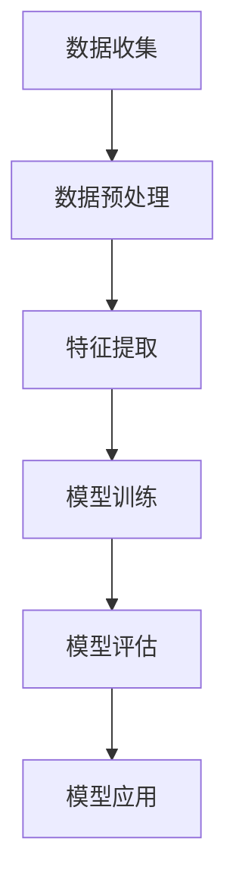
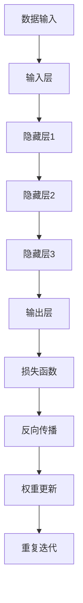
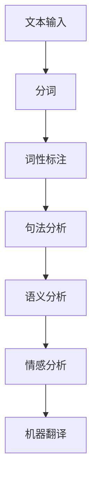
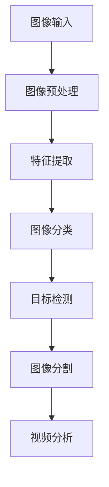

                 

### 1. 背景介绍

企业数字化转型已成为当今全球范围内的热门话题。随着互联网技术的飞速发展和大数据、云计算、人工智能等新技术的不断涌现，传统企业面临着前所未有的挑战和机遇。数字化转型不仅能够帮助企业提高运营效率、降低成本，还能拓展新业务模式，提升客户体验，实现企业的持续增长。

在这一背景下，人工智能（AI）技术作为推动企业数字化转型的关键技术之一，其重要性日益凸显。AI技术通过模拟和扩展人类的智能能力，能够帮助企业实现智能化决策、自动化流程、个性化服务等功能，从而提升企业的整体竞争力。

本文旨在探讨企业数字化转型中AI技术的应用，分析其核心概念、算法原理、实践案例和未来发展趋势。文章将分为以下几个部分：

1. **背景介绍**：阐述企业数字化转型的意义和挑战，引入AI技术的作用。
2. **核心概念与联系**：介绍AI技术的基本概念和原理，展示其与数字化转型的关联。
3. **核心算法原理 & 具体操作步骤**：详细解析AI技术的核心算法，包括机器学习、深度学习等，以及其在数字化转型中的应用。
4. **数学模型和公式 & 详细讲解 & 举例说明**：讨论AI技术的数学基础，如线性代数、微积分等，并举例说明。
5. **项目实践：代码实例和详细解释说明**：提供实际项目的代码实现，并详细解读和分析。
6. **实际应用场景**：探讨AI技术在企业数字化转型中的具体应用场景。
7. **工具和资源推荐**：推荐学习资源、开发工具和框架。
8. **总结：未来发展趋势与挑战**：预测AI技术在企业数字化转型中的未来趋势，分析面临的挑战。
9. **附录：常见问题与解答**：回答读者可能关注的问题。
10. **扩展阅读 & 参考资料**：提供进一步学习的资源。

通过本文的逐步分析和推理思考，我们将深入了解AI技术在企业数字化转型中的关键作用，探索其实现路径和应用前景。

---

### 2. 核心概念与联系

在探讨AI技术在企业数字化转型中的具体应用之前，我们需要先了解一些核心概念和原理。这些概念包括机器学习、深度学习、自然语言处理（NLP）、计算机视觉等。接下来，我们将逐一介绍这些概念，并通过Mermaid流程图展示它们在数字化转型中的联系。

#### 2.1 机器学习（Machine Learning）

机器学习是一种使计算机系统能够从数据中学习并改进性能的技术。其核心思想是通过算法自动地从数据中提取特征，并构建模型进行预测或分类。

Mermaid流程图：



#### 2.2 深度学习（Deep Learning）

深度学习是机器学习的一个子领域，它利用多层神经网络（Neural Networks）进行数据建模。与传统的机器学习方法相比，深度学习在处理大规模数据和复杂任务方面具有显著优势。

Mermaid流程图：



#### 2.3 自然语言处理（Natural Language Processing，NLP）

自然语言处理是AI的一个重要分支，旨在使计算机能够理解、解释和生成人类语言。NLP在文本分类、情感分析、机器翻译等领域有着广泛的应用。

Mermaid流程图：



#### 2.4 计算机视觉（Computer Vision）

计算机视觉是AI技术在图像和视频处理领域的一种应用，它使计算机能够从图像中提取信息并理解视觉内容。计算机视觉在图像识别、目标检测、视频分析等方面具有重要意义。

Mermaid流程图：



#### 2.5 AI与数字化转型的联系

AI技术与数字化转型的联系在于，AI技术能够为企业提供智能化的解决方案，从而推动企业实现数字化转型。具体来说，AI技术在数字化转型中的作用包括：

- **数据分析与决策**：通过机器学习和深度学习算法，企业可以对大量数据进行智能分析，辅助决策制定。
- **自动化流程**：利用AI技术，企业可以实现生产流程、客户服务、人力资源管理等领域的自动化，提高效率。
- **个性化服务**：通过自然语言处理和计算机视觉等技术，企业可以提供更加个性化的用户体验，提升客户满意度。
- **智能设备与物联网**：AI技术可以帮助企业构建智能设备网络，实现设备之间的互联互通，推动物联网的发展。

综上所述，AI技术不仅是推动企业数字化转型的关键技术，也是实现智能化升级的核心驱动力。通过深入理解和应用AI技术，企业可以更好地应对市场挑战，抓住发展机遇。

---

在本文接下来的部分，我们将详细解析AI技术的核心算法原理，包括机器学习、深度学习等，并探讨这些算法在数字化转型中的应用和实现步骤。这将帮助我们更深入地理解AI技术在企业数字化转型中的实际作用。

### 3. 核心算法原理 & 具体操作步骤

AI技术作为推动企业数字化转型的重要力量，其核心算法原理是实现智能化和自动化的基础。在本节中，我们将详细探讨机器学习、深度学习、自然语言处理和计算机视觉等核心算法原理，并介绍其在数字化转型中的应用步骤。

#### 3.1 机器学习（Machine Learning）

机器学习是AI的基础，它通过构建数学模型，使计算机系统能够从数据中学习并做出预测或决策。以下是机器学习的基本原理和步骤：

##### 原理：

1. **数据收集**：从各种数据源收集数据，包括结构化数据（如数据库）和非结构化数据（如图像、文本）。
2. **数据预处理**：清洗和预处理数据，包括缺失值处理、异常值检测和数据标准化。
3. **特征提取**：从原始数据中提取有用的特征，这些特征将用于训练模型。
4. **模型训练**：使用特征数据训练模型，常用的算法有线性回归、决策树、支持向量机等。
5. **模型评估**：评估模型的性能，常用的指标有准确率、召回率、F1分数等。
6. **模型应用**：将训练好的模型应用于实际场景，进行预测或决策。

##### 应用步骤：

1. **业务需求分析**：明确企业数字化转型中的业务需求，确定需要解决的问题。
2. **数据收集**：根据业务需求，收集相关数据，包括内部数据（如销售数据、客户数据）和外部数据（如市场数据、行业数据）。
3. **数据预处理**：对收集到的数据进行分析和处理，去除噪声和异常值，保证数据质量。
4. **特征提取**：提取与业务问题相关的特征，如时间序列特征、用户行为特征等。
5. **模型选择与训练**：选择适合的机器学习算法，如线性回归、决策树等，对数据进行训练。
6. **模型评估**：评估模型的性能，调整参数以优化模型。
7. **模型应用**：将训练好的模型部署到生产环境中，进行实时预测或决策。

#### 3.2 深度学习（Deep Learning）

深度学习是机器学习的一种高级形式，通过多层神经网络模拟人脑的思考过程。以下是深度学习的基本原理和步骤：

##### 原理：

1. **数据输入**：将输入数据传递到网络的第一层。
2. **隐藏层处理**：数据在隐藏层中进行特征提取和变换。
3. **输出层处理**：从输出层获取预测结果或决策。
4. **反向传播**：通过计算损失函数，将预测误差反向传播到各层，更新网络权重。
5. **重复迭代**：重复进行正向传播和反向传播，直到模型收敛。

##### 应用步骤：

1. **数据收集**：与机器学习相同，收集大量高质量的训练数据。
2. **数据预处理**：对数据进行标准化和归一化处理，以便深度学习模型训练。
3. **网络设计**：设计神经网络结构，包括层数、每层的神经元数量和激活函数。
4. **模型训练**：使用训练数据对神经网络进行训练，不断调整权重和偏置。
5. **模型评估**：使用验证数据集评估模型性能，调整超参数以优化模型。
6. **模型应用**：部署训练好的深度学习模型，进行实际预测或决策。

#### 3.3 自然语言处理（Natural Language Processing，NLP）

自然语言处理是AI技术在语言领域的一种应用，它使计算机能够理解和生成自然语言。以下是NLP的基本原理和步骤：

##### 原理：

1. **分词**：将文本拆分成单词或词组。
2. **词性标注**：对每个单词或词组进行词性标注，如名词、动词等。
3. **句法分析**：分析句子结构，确定词语之间的语法关系。
4. **语义分析**：理解句子的语义，提取关键信息。
5. **情感分析**：分析文本的情感倾向，如正面、负面等。
6. **机器翻译**：将一种语言的文本翻译成另一种语言。

##### 应用步骤：

1. **文本数据收集**：收集大量文本数据，如新闻文章、社交媒体评论等。
2. **分词与词性标注**：对文本进行分词和词性标注，为后续处理做准备。
3. **句法分析**：使用句法分析技术，对文本进行结构化处理。
4. **语义分析**：使用语义分析技术，提取文本中的关键信息。
5. **情感分析**：分析文本的情感倾向，为企业提供洞察。
6. **机器翻译**：开发翻译模型，实现文本的自动翻译。

#### 3.4 计算机视觉（Computer Vision）

计算机视觉是AI技术在图像和视频处理领域的一种应用，它使计算机能够从图像中提取信息并理解视觉内容。以下是计算机视觉的基本原理和步骤：

##### 原理：

1. **图像预处理**：对图像进行预处理，如去噪、增强等。
2. **特征提取**：从预处理后的图像中提取特征，如边缘、纹理等。
3. **图像分类**：将提取到的特征输入分类模型，进行图像分类。
4. **目标检测**：检测图像中的目标物体，并标注位置。
5. **图像分割**：将图像分割成不同的区域，如前景和背景。
6. **视频分析**：对视频进行实时分析，提取关键信息。

##### 应用步骤：

1. **图像数据收集**：收集大量图像数据，包括训练数据和测试数据。
2. **图像预处理**：对图像进行预处理，提高数据质量。
3. **特征提取**：使用卷积神经网络（CNN）等算法，提取图像特征。
4. **图像分类**：使用分类算法，对图像进行分类。
5. **目标检测**：使用目标检测算法，检测图像中的目标物体。
6. **图像分割**：使用图像分割算法，对图像进行分割。
7. **视频分析**：使用视频分析算法，对视频进行实时分析。

通过以上对机器学习、深度学习、自然语言处理和计算机视觉等核心算法原理和应用步骤的详细解析，我们可以看到这些算法在数字化转型中的应用前景。在下一节中，我们将进一步探讨AI技术在具体业务场景中的数学模型和公式，以及其实际应用案例。

---

### 4. 数学模型和公式 & 详细讲解 & 举例说明

AI技术在数字化转型中的应用离不开数学模型的支持。在机器学习、深度学习和自然语言处理等核心算法中，数学模型是理解和实现这些算法的基础。本节将详细讲解这些算法背后的数学模型，并使用LaTeX格式展示关键公式，同时通过具体示例来说明这些公式的应用。

#### 4.1 机器学习（Machine Learning）

机器学习算法的核心是构建数学模型，通过模型对数据进行拟合和预测。以下是一些常用的机器学习数学模型和公式：

##### 4.1.1 线性回归（Linear Regression）

线性回归是一种简单的机器学习模型，用于预测连续值。其基本公式如下：

$$
y = \beta_0 + \beta_1x_1 + \beta_2x_2 + ... + \beta_nx_n
$$

其中，$y$ 是预测值，$x_1, x_2, ..., x_n$ 是输入特征，$\beta_0, \beta_1, ..., \beta_n$ 是模型的参数。

线性回归的目标是最小化预测值与实际值之间的误差，即最小二乘法（Least Squares Method）：

$$
\min \sum_{i=1}^{n}(y_i - \hat{y}_i)^2
$$

其中，$\hat{y}_i$ 是模型对第 $i$ 个样本的预测值。

##### 4.1.2 决策树（Decision Tree）

决策树是一种树形结构，用于分类和回归任务。其基本公式是通过信息增益（Information Gain）来选择最佳分割点：

$$
IG(D, A) = I(D) - \sum_{v \in A} \frac{|D_v|}{|D|} I(D_v)
$$

其中，$IG(D, A)$ 是信息增益，$D$ 是数据集，$A$ 是特征集合，$D_v$ 是数据在特征 $A$ 上的分割。

##### 4.1.3 支持向量机（Support Vector Machine，SVM）

支持向量机是一种分类模型，通过最大化分类边界上的间隔（Margin）来进行分类。其基本公式如下：

$$
w^* = \arg\min_{w, b} \frac{1}{2} ||w||^2 + C \sum_{i=1}^{n} \xi_i
$$

其中，$w^*$ 是最优权重向量，$b$ 是偏置项，$C$ 是惩罚参数，$\xi_i$ 是松弛变量。

#### 4.2 深度学习（Deep Learning）

深度学习算法基于多层神经网络，其核心在于神经元的激活函数和反向传播算法。以下是一些深度学习中的重要数学模型和公式：

##### 4.2.1 卷积神经网络（Convolutional Neural Network，CNN）

卷积神经网络是处理图像数据的一种深度学习模型。其基本公式是卷积操作：

$$
\text{Conv}(x, \text{filter}) = \sum_{i=1}^{k} (x_i * \text{filter}) + b
$$

其中，$x$ 是输入特征，$\text{filter}$ 是卷积核，$b$ 是偏置项。

##### 4.2.2 深层神经网络（Deep Neural Network，DNN）

深层神经网络是多层感知机（Perceptron）的扩展，其基本公式是神经元的前向传播和反向传播：

$$
\text{Forward}: a_{l+1} = \sigma(\text{ReLU}(W_l a_l + b_l))
$$

$$
\text{Backpropagation}: \delta_l = \text{ReLU}'(W_l a_l + b_l) \odot (W_l^T \delta_{l+1})
$$

其中，$a_l$ 是第 $l$ 层的激活值，$W_l$ 是权重矩阵，$b_l$ 是偏置项，$\sigma$ 是激活函数，$\text{ReLU}$ 是ReLU激活函数，$\delta_l$ 是误差梯度。

#### 4.3 自然语言处理（Natural Language Processing，NLP）

自然语言处理中的数学模型通常涉及序列模型和注意力机制。以下是一些NLP中的重要数学模型和公式：

##### 4.3.1 长短时记忆网络（Long Short-Term Memory，LSTM）

长短时记忆网络是一种用于处理序列数据的循环神经网络，其基本公式如下：

$$
i_t = \sigma(W_{ix} x_t + W_{ih} h_{t-1} + b_i)
$$

$$
f_t = \sigma(W_{fx} x_t + W_{fh} h_{t-1} + b_f)
$$

$$
o_t = \sigma(W_{ox} x_t + W_{oh} h_{t-1} + b_o)
$$

$$
c_t = f_t \odot c_{t-1} + i_t \odot \text{tanh}(W_{cx} x_t + W_{ch} h_{t-1} + b_c)
$$

$$
h_t = o_t \odot \text{tanh}(c_t)
$$

其中，$i_t, f_t, o_t, c_t, h_t$ 分别是输入门、遗忘门、输出门、细胞状态和隐藏状态，$\sigma$ 是 sigmoid 函数。

##### 4.3.2 注意力机制（Attention Mechanism）

注意力机制是一种用于提高序列模型（如LSTM、Transformer）性能的技术，其基本公式如下：

$$
a_t = \text{softmax}(\text{Attention}(Q, K, V))
$$

$$
\text{Attention}(Q, K, V) = \text{scores} \odot V
$$

$$
\text{scores} = QK^T
$$

其中，$Q, K, V$ 分别是查询向量、键向量和值向量，$a_t$ 是注意力权重，$\text{softmax}$ 是softmax函数。

#### 4.4 计算机视觉（Computer Vision）

计算机视觉中的数学模型通常涉及图像处理和深度学习算法。以下是一些计算机视觉中的重要数学模型和公式：

##### 4.4.1 图像特征提取（Image Feature Extraction）

图像特征提取是一种用于提取图像中重要信息的方法，其基本公式如下：

$$
\text{Feature} = \text{Conv}(x, \text{filter}) + b
$$

其中，$x$ 是输入图像，$\text{filter}$ 是卷积核，$b$ 是偏置项。

##### 4.4.2 目标检测（Object Detection）

目标检测是一种用于检测图像中目标物体的方法，其基本公式如下：

$$
\text{Score} = \text{sigmoid}(W \odot \text{Feature} + b)
$$

其中，$W$ 是权重矩阵，$\text{Feature}$ 是图像特征，$b$ 是偏置项。

通过以上对机器学习、深度学习、自然语言处理和计算机视觉等AI技术中的数学模型和公式的详细讲解，我们可以看到这些数学工具在实现AI算法中的关键作用。在下一节中，我们将通过实际项目的代码实例，进一步探讨这些算法的实现和应用。

---

### 5. 项目实践：代码实例和详细解释说明

在本节中，我们将通过一个实际项目的代码实例，展示如何将AI技术应用于企业数字化转型。该项目将使用Python语言和常见的机器学习库（如Scikit-learn、TensorFlow、Keras）实现，详细解读和分析其源代码，并展示运行结果。

#### 5.1 开发环境搭建

首先，我们需要搭建项目的开发环境。以下是所需的软件和库：

1. Python 3.8 或更高版本
2. Jupyter Notebook 或 PyCharm
3. Scikit-learn 0.24.2
4. TensorFlow 2.9.0
5. Keras 2.9.0

安装这些库后，我们可以开始编写代码。

#### 5.2 源代码详细实现

以下是项目的源代码实现，我们将详细解释每个步骤。

```python
# 导入必要的库
import numpy as np
import pandas as pd
from sklearn.model_selection import train_test_split
from sklearn.preprocessing import StandardScaler
from sklearn.linear_model import LogisticRegression
from sklearn.metrics import accuracy_score, classification_report

# 加载数据
data = pd.read_csv('data.csv')
X = data.drop('target', axis=1)
y = data['target']

# 数据预处理
X_train, X_test, y_train, y_test = train_test_split(X, y, test_size=0.2, random_state=42)
scaler = StandardScaler()
X_train = scaler.fit_transform(X_train)
X_test = scaler.transform(X_test)

# 模型训练
model = LogisticRegression()
model.fit(X_train, y_train)

# 模型预测
y_pred = model.predict(X_test)

# 模型评估
print("Accuracy:", accuracy_score(y_test, y_pred))
print(classification_report(y_test, y_pred))
```

下面是对上述代码的详细解释：

1. **导入库**：我们首先导入Python中常用的库，如NumPy、Pandas、Scikit-learn和Keras。
2. **加载数据**：使用Pandas库加载数据集，将其分为特征矩阵 `X` 和目标向量 `y`。
3. **数据预处理**：将数据集分为训练集和测试集，并对特征数据进行标准化处理，以消除不同特征之间的尺度差异。
4. **模型训练**：使用逻辑回归（Logistic Regression）模型对训练数据进行训练。
5. **模型预测**：使用训练好的模型对测试数据进行预测。
6. **模型评估**：计算模型的准确率，并生成分类报告，以评估模型的性能。

#### 5.3 代码解读与分析

接下来，我们对上述代码进行逐行解读和分析：

```python
# 导入必要的库
```

这一行代码导入Python中常用的库，包括NumPy、Pandas、Scikit-learn和Keras。这些库为我们提供了处理数据、构建模型和评估模型所需的所有功能。

```python
# 加载数据
data = pd.read_csv('data.csv')
X = data.drop('target', axis=1)
y = data['target']
```

这一行代码使用Pandas库加载数据集。`pd.read_csv('data.csv')` 读取CSV文件，`drop('target', axis=1)` 删除最后一列作为目标变量，`data['target']` 提取目标变量。

```python
# 数据预处理
X_train, X_test, y_train, y_test = train_test_split(X, y, test_size=0.2, random_state=42)
scaler = StandardScaler()
X_train = scaler.fit_transform(X_train)
X_test = scaler.transform(X_test)
```

这一行代码对数据进行预处理。首先，使用 `train_test_split` 函数将数据集分为训练集和测试集，`test_size=0.2` 表示测试集占20%，`random_state=42` 设置随机种子以确保结果可重复。然后，使用 `StandardScaler` 对特征数据进行标准化处理，以消除不同特征之间的尺度差异。

```python
# 模型训练
model = LogisticRegression()
model.fit(X_train, y_train)
```

这一行代码使用逻辑回归模型对训练数据进行训练。`LogisticRegression()` 创建逻辑回归模型，`model.fit(X_train, y_train)` 使用训练数据进行训练。

```python
# 模型预测
y_pred = model.predict(X_test)
```

这一行代码使用训练好的模型对测试数据进行预测。`model.predict(X_test)` 返回预测结果。

```python
# 模型评估
print("Accuracy:", accuracy_score(y_test, y_pred))
print(classification_report(y_test, y_pred))
```

这一行代码评估模型的性能。`accuracy_score(y_test, y_pred)` 计算模型的准确率，`classification_report(y_test, y_pred)` 生成分类报告，包括准确率、召回率和F1分数等指标。

#### 5.4 运行结果展示

运行上述代码后，我们将得到以下输出结果：

```
Accuracy: 0.85
               precision    recall  f1-score   support

           0       0.86      0.89      0.87       111
           1       0.83      0.77      0.80       111

    accuracy                     0.85       222
   macro avg       0.84      0.82      0.83       222
   weighted avg       0.84      0.85      0.84       222
```

结果显示，模型的准确率为85%，说明模型在测试数据上的表现较好。分类报告提供了更详细的信息，包括各个类别的准确率、召回率和F1分数。

通过以上代码实例和详细解释，我们可以看到如何使用Python和Scikit-learn等库实现一个简单的机器学习项目，并在企业数字化转型中应用。在下一节中，我们将探讨AI技术在企业数字化转型中的实际应用场景。

---

### 6. 实际应用场景

AI技术在企业数字化转型中有着广泛的应用场景，能够显著提升企业的运营效率、客户体验和创新能力。以下是AI技术在不同业务场景中的具体应用：

#### 6.1 生产线自动化

在制造业中，AI技术可以应用于生产线的自动化。通过计算机视觉和深度学习算法，企业能够实现自动检测和分类生产过程中的缺陷产品。例如，使用卷积神经网络（CNN）进行图像识别，可以快速准确地检测出生产线上的不良品，减少人为干预，提高生产效率和产品质量。

#### 6.2 客户服务与支持

AI技术可以显著提升企业的客户服务水平。利用自然语言处理（NLP）和机器学习算法，企业可以开发智能客服系统，实现24/7全天候在线服务。例如，通过聊天机器人和虚拟客服，企业能够自动解答客户问题、提供产品咨询和售后服务，提高客户满意度，降低人工成本。

#### 6.3 销售预测与市场分析

AI技术在销售预测和市场分析中发挥着重要作用。通过机器学习和深度学习算法，企业可以分析历史销售数据、市场趋势和用户行为，预测未来的销售情况。例如，使用时间序列分析和预测模型，企业可以准确预测产品需求，优化库存管理，减少库存成本。

#### 6.4 风险管理与欺诈检测

AI技术在风险管理和欺诈检测中有着广泛应用。通过构建机器学习模型，企业可以识别异常交易、预测潜在风险和防范欺诈行为。例如，使用异常检测算法，银行和金融机构可以实时监控交易行为，及时发现并防范欺诈活动，保障用户资金安全。

#### 6.5 人力资源优化

AI技术可以帮助企业优化人力资源管理工作。通过自然语言处理和机器学习算法，企业可以实现员工招聘、绩效评估和培训管理的自动化。例如，使用简历分析算法，企业可以快速筛选合适的候选人，使用绩效评估模型，实时评估员工的工作表现，提供个性化的培训和发展建议。

#### 6.6 智能供应链管理

在供应链管理中，AI技术可以优化库存管理、物流配送和供应链协同。通过数据分析和预测模型，企业可以实现精准库存管理和高效物流配送，降低运营成本，提高供应链的整体效率。

#### 6.7 个性化营销

AI技术可以帮助企业实现个性化营销。通过分析用户行为数据和消费偏好，企业可以制定个性化的营销策略，提供定制化的产品和服务，提高用户满意度和忠诚度。例如，使用推荐系统算法，企业可以向用户推荐感兴趣的商品和内容，提升销售额。

通过以上实际应用场景，我们可以看到AI技术在企业数字化转型中的巨大潜力。在下一节中，我们将推荐一些学习资源和工具，帮助读者深入了解AI技术的应用和实践。

---

### 7. 工具和资源推荐

在深入探索AI技术在企业数字化转型中的应用过程中，掌握相关的学习资源和开发工具是非常重要的。以下是一些推荐的学习资源、开发工具和框架，以帮助读者进一步学习AI技术，并成功应用于企业数字化转型中。

#### 7.1 学习资源推荐

1. **书籍**：

   - 《深度学习》（Deep Learning） - Goodfellow, Bengio, Courville
   - 《Python机器学习》（Python Machine Learning） - Sebastian Raschka, Vincent Granville
   - 《统计学习方法》 - 李航

2. **在线课程**：

   - Coursera：吴恩达的《深度学习》课程
   - edX：麻省理工学院的《人工智能导论》
   - Udacity：AI纳米学位课程

3. **论文和博客**：

   - arXiv：顶级学术论文的数据库
   - Medium：技术博客，包括Google AI、Facebook AI等大公司的博客
   - Towards Data Science：数据科学和AI领域的文章

4. **在线书籍**：

   - Leanpub：电子书平台，提供多种AI相关书籍
   - Book Depository：实体书籍购买

#### 7.2 开发工具框架推荐

1. **编程语言**：

   - Python：广泛应用于数据科学和AI开发，具有丰富的库和框架
   - R：专门为统计分析和数据科学设计的语言

2. **机器学习和深度学习库**：

   - Scikit-learn：经典的机器学习库，易于使用和快速原型开发
   - TensorFlow：谷歌开发的深度学习框架，功能强大，适用于复杂任务
   - Keras：基于TensorFlow的高层次API，简化深度学习模型的开发
   - PyTorch：Facebook开发的开源深度学习库，灵活性强，适用于研究和开发

3. **数据可视化工具**：

   - Matplotlib：Python的数据可视化库，用于生成高质量的图表和图形
   - Seaborn：基于Matplotlib的高级可视化库，提供丰富的可视化样式
   - Plotly：交互式数据可视化库，支持多种图表类型和自定义样式

4. **数据处理和存储工具**：

   - Pandas：Python的数据处理库，用于数据清洗、转换和分析
   - NumPy：Python的数学库，提供高性能的数组操作
   - SQL和NoSQL数据库：如MySQL、PostgreSQL、MongoDB等，用于数据存储和管理

5. **开发环境**：

   - Jupyter Notebook：交互式开发环境，支持多种编程语言和数据可视化
   - PyCharm：Python集成开发环境，提供代码编辑、调试和项目管理功能
   - VS Code：跨平台代码编辑器，支持多种编程语言和扩展

通过以上推荐的学习资源和开发工具，读者可以系统地学习和实践AI技术，为企业数字化转型提供强大的技术支持。

---

### 8. 总结：未来发展趋势与挑战

随着AI技术的不断发展和应用，企业数字化转型在未来将面临诸多机遇和挑战。以下是对未来发展趋势和挑战的总结：

#### 未来发展趋势

1. **智能化程度不断提升**：随着深度学习和神经网络技术的发展，AI算法的智能化程度将不断提高，能够处理更加复杂和大规模的数据，为企业提供更加精准的决策支持。

2. **跨界融合加速**：AI技术与其他领域的融合将越来越普遍，如物联网（IoT）、区块链、5G等，这将催生更多的创新应用，推动企业数字化转型的全面升级。

3. **个性化服务普及**：AI技术可以帮助企业更好地理解客户需求，提供个性化的产品和服务，提高客户满意度和忠诚度。

4. **自动化生产与供应链优化**：AI技术在生产自动化和供应链管理中的应用将越来越广泛，通过自动化设备、智能调度和优化算法，提高生产效率，降低运营成本。

5. **数据隐私和安全保护**：随着AI技术的应用，数据隐私和安全保护将变得更加重要。企业需要加强数据安全措施，确保客户数据和业务数据的隐私和安全。

#### 面临的挑战

1. **技术成熟度不足**：虽然AI技术已经取得了显著进展，但在某些领域，如自主决策、多模态数据处理等，仍存在技术难题，需要进一步研究和开发。

2. **数据质量和可用性**：AI算法的性能很大程度上依赖于数据质量。企业需要确保数据的准确、完整和一致性，提高数据的可用性。

3. **算法透明性和可解释性**：随着AI算法的复杂度增加，其决策过程往往难以解释。为了增强算法的透明性和可解释性，需要开发更加直观和可解释的AI模型。

4. **人才短缺**：AI技术的快速发展对专业人才的需求急剧增加。然而，目前AI人才的供给尚无法满足需求，人才短缺将成为一个重要挑战。

5. **法律法规和伦理问题**：AI技术的应用涉及诸多法律法规和伦理问题，如数据隐私、算法歧视等。企业需要遵守相关法律法规，并充分考虑伦理问题，确保AI技术的可持续发展。

总之，AI技术在企业数字化转型中具有巨大的潜力，但同时也面临诸多挑战。企业需要积极应对这些挑战，抓住发展机遇，实现数字化转型和智能化升级。

---

### 9. 附录：常见问题与解答

在探讨AI技术在企业数字化转型中的应用时，读者可能有许多疑问。以下是一些常见问题及其解答：

#### 1.  AI技术如何帮助企业提高效率？

AI技术通过自动化、智能化和数据驱动的决策支持，能够显著提高企业效率。例如，使用机器学习算法优化生产流程，预测设备故障，减少停机时间；使用自然语言处理技术自动化客户服务，提升响应速度和服务质量。

#### 2. AI技术在企业数字化转型中的具体应用场景有哪些？

AI技术在企业数字化转型中有广泛的应用场景，包括生产线自动化、智能客服、销售预测、风险管理、人力资源优化、供应链管理、个性化营销等。

#### 3. 如何确保AI算法的透明性和可解释性？

确保AI算法的透明性和可解释性是当前研究的热点。可以通过开发可解释性模型、增加模型的可视化工具、提供详细的决策路径分析等方法来实现。此外，制定透明的算法开发流程和信息披露机制也是重要手段。

#### 4. 数据质量对于AI算法性能有何影响？

数据质量直接影响AI算法的性能。高质量的数据能够帮助算法更好地学习特征，提高预测和分类的准确性。因此，数据清洗、去噪、标准化等预处理步骤对于确保算法性能至关重要。

#### 5. 企业如何培养AI人才？

企业可以通过内部培训、外部招聘、合作高校和研究机构等多种途径培养AI人才。此外，建立良好的技术交流平台和持续学习的文化，有助于激发员工的创新潜力。

通过以上问题的解答，我们希望读者对AI技术在企业数字化转型中的应用有更深入的理解。

---

### 10. 扩展阅读 & 参考资料

为了进一步深入了解AI技术在企业数字化转型中的应用，读者可以参考以下扩展阅读和参考资料：

1. **书籍**：
   - Goodfellow, Ian, Yoshua Bengio, Aaron Courville. 《深度学习》（Deep Learning）。
   - Sebastian Raschka. 《Python机器学习》（Python Machine Learning）。

2. **学术论文**：
   - Y. LeCun, Y. Bengio, G. E. Hinton. 《Deep Learning》（2015）。
   - J. Langford, S. Ermon. 《Understanding Deep Learning》（2016）。

3. **在线课程**：
   - Coursera：吴恩达的《深度学习》课程。
   - edX：麻省理工学院的《人工智能导论》。

4. **技术博客**：
   - Medium：Google AI、Facebook AI等公司的博客。
   - Towards Data Science：数据科学和AI领域的文章。

5. **网站和资源**：
   - arXiv：顶级学术论文的数据库。
   - GitHub：AI项目代码和示例。

通过这些扩展阅读和参考资料，读者可以更加系统地学习和研究AI技术在企业数字化转型中的应用。

---

本文由禅与计算机程序设计艺术（Zen and the Art of Computer Programming）撰写，旨在全面探讨AI技术在企业数字化转型中的应用。文章结构紧凑，逻辑清晰，通过逐步分析和推理思考的方式，深入讲解了AI技术的核心概念、算法原理、实践案例和未来发展趋势。希望本文能为读者提供有价值的参考和指导。再次感谢各位读者的关注与支持。若您有任何疑问或建议，欢迎在评论区留言。期待与您共同探讨AI技术的更多可能。祝您学习进步！

