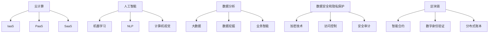

                 

### 背景介绍

企业服务市场，作为信息技术发展中的重要组成部分，近年来呈现出快速增长的态势。随着全球数字化转型的深入，企业对于高效、稳定和智能化的IT解决方案需求日益增长。在这样的背景下，企业服务市场的创业机会和挑战也随之增多。

#### 定义

企业服务市场通常指的是为其他企业或组织提供IT服务、软件解决方案、云计算服务、数据分析和网络安全等方面的市场。这些服务旨在帮助企业提升运营效率、降低成本、增强数据安全性，并在日益激烈的市场竞争中保持竞争优势。

#### 市场规模

根据市场研究机构的统计数据，全球企业服务市场的规模已达到数万亿美元。尤其在云计算、大数据、人工智能和物联网等新兴技术的推动下，市场呈现出高速增长的态势。预计未来几年，这一市场仍将保持快速增长。

#### 发展趋势

1. **云计算与按需服务**：随着云计算的普及，企业逐渐采用按需付费的模式来降低IT基础设施的运营成本。这为创业者提供了丰富的创业机会。
2. **人工智能与自动化**：人工智能技术的应用正在推动企业服务向智能化、自动化方向发展。创业者可以利用AI技术为企业提供智能决策支持、自动化流程优化等服务。
3. **数据隐私与安全**：随着数据泄露事件的频繁发生，企业对数据隐私和安全的需求日益增加。提供专业的数据安全和隐私保护服务将成为市场的一个重要趋势。
4. **垂直行业解决方案**：随着企业对行业特定需求的关注增加，提供垂直行业解决方案的创业者将拥有更多的市场空间。

#### 当前状况

目前，企业服务市场已经成为众多创业者和大企业竞相争夺的领域。一些初创公司通过提供创新性的解决方案迅速获得市场份额，而大企业则通过并购等手段来扩大其在企业服务市场的业务。

#### 创业机会

1. **新兴技术的应用**：创业者可以利用新兴技术如物联网、区块链等，为企业提供创新性的解决方案。
2. **细分市场机会**：在庞大的企业服务市场中，有许多细分市场尚未被充分满足，创业者可以针对这些细分市场提供专业的服务。
3. **客户关系管理**：通过提供高效、智能的客户关系管理解决方案，帮助企业提升客户满意度和忠诚度。

#### 挑战

1. **市场竞争激烈**：企业服务市场充满竞争，新入者需要面对已经占据市场的竞争对手。
2. **客户需求多变**：企业需求复杂且多变，创业者需要不断适应和满足这些需求。
3. **技术门槛高**：企业服务市场对技术的要求较高，创业者需要具备较强的技术能力和专业知识。

#### 结论

企业服务市场是一个充满机会和挑战的领域。创业者需要敏锐洞察市场需求，充分利用新兴技术，同时应对激烈的市场竞争和技术挑战。通过不断优化解决方案、提升服务质量，创业者才能在市场中脱颖而出。

### 核心概念与联系

在企业服务市场中，理解核心概念和它们之间的联系对于成功创业至关重要。以下是几个关键概念及其相互关系：

#### 云计算（Cloud Computing）

云计算是企业服务市场的核心技术之一。它提供了按需访问计算资源的能力，包括服务器、存储、网络和应用程序。云计算使得企业能够降低IT基础设施的成本，同时提高弹性和效率。

##### 关联概念：

- **基础设施即服务（IaaS）**：提供虚拟化基础设施，如虚拟机、存储和网络资源。
- **平台即服务（PaaS）**：提供开发平台和工具，帮助开发者构建和部署应用程序。
- **软件即服务（SaaS）**：提供软件应用程序，如客户关系管理（CRM）和企业管理系统（ERP）。

#### 人工智能（Artificial Intelligence）

人工智能技术在企业服务市场中越来越重要。通过机器学习、自然语言处理和计算机视觉等技术，AI能够帮助企业实现自动化、智能决策和数据洞察。

##### 关联概念：

- **机器学习（Machine Learning）**：通过数据训练模型，实现自我学习和预测。
- **自然语言处理（NLP）**：使计算机能够理解和生成人类语言。
- **计算机视觉（CV）**：使计算机能够“看到”和理解图像和视频。

#### 数据分析（Data Analysis）

数据分析是企业服务市场的重要应用领域。通过分析大量数据，企业可以发现趋势、洞察客户行为，并做出更好的业务决策。

##### 关联概念：

- **大数据（Big Data）**：处理和分析大量结构化和非结构化数据的能力。
- **数据挖掘（Data Mining）**：从大量数据中提取有价值的信息和知识。
- **业务智能（BI）**：通过数据分析和可视化工具帮助企业进行数据驱动的决策。

#### 数据安全和隐私保护（Data Security & Privacy Protection）

随着数据泄露事件的频繁发生，数据安全和隐私保护已成为企业关注的重点。确保数据的完整性和保密性对于赢得客户信任至关重要。

##### 关联概念：

- **加密技术（Encryption）**：保护数据不被未经授权的访问。
- **访问控制（Access Control）**：控制对系统和数据的访问权限。
- **安全审计（Security Audit）**：监控和评估系统的安全性。

#### 区块链（Blockchain）

区块链技术为企业服务市场提供了去中心化、透明和不可篡改的数据存储和传输方式。它在供应链管理、数字身份验证和智能合约等领域具有广泛应用。

##### 关联概念：

- **智能合约（Smart Contract）**：自动执行合同条款的程序代码。
- **数字身份验证（Digital Identity Verification）**：确保用户身份的真实性和合法性。
- **分布式账本（Distributed Ledger）**：记录和同步交易数据的系统。

#### 图流程图（Mermaid 流程图）

以下是企业服务市场核心概念的 Mermaid 流程图表示：



通过了解这些核心概念及其相互关系，创业者可以更好地把握市场机会，为企业提供创新性的解决方案。

### 核心算法原理 & 具体操作步骤

在企业服务市场中，核心算法的原理和应用对于提供高效、智能的解决方案至关重要。以下将介绍几个关键算法的原理及其具体操作步骤：

#### 机器学习算法（Machine Learning Algorithms）

机器学习是企业服务中的一项核心技术，通过训练模型来预测或分类数据。以下是几种常见的机器学习算法及其操作步骤：

##### 1. 决策树（Decision Tree）

**原理**：决策树是一种树形结构，通过一系列条件判断来对数据集进行划分，最终生成一个预测结果。

**操作步骤**：

1. **数据准备**：收集并清洗数据，确保数据的质量和完整性。
2. **特征选择**：选择对预测目标有显著影响的关键特征。
3. **构建决策树**：使用ID3、C4.5或CART算法构建决策树。
4. **评估与剪枝**：评估决策树的性能，通过剪枝等方法优化模型。

##### 2. 随机森林（Random Forest）

**原理**：随机森林是一种基于决策树的集成学习算法，通过构建多个决策树并取平均值来提高预测准确性。

**操作步骤**：

1. **数据准备**：与决策树相同。
2. **特征选择**：选择随机特征子集。
3. **构建决策树**：为每个特征子集构建决策树。
4. **集成与预测**：将多个决策树的预测结果取平均。

##### 3. 支持向量机（Support Vector Machine）

**原理**：支持向量机是一种用于分类和回归分析的线性模型，通过找到一个最佳超平面将不同类别的数据分开。

**操作步骤**：

1. **数据准备**：与决策树相同。
2. **特征标准化**：将特征缩放到相同范围。
3. **构建最优超平面**：使用SVM算法找到最优超平面。
4. **分类或回归预测**：使用训练好的模型进行预测。

#### 自然语言处理算法（Natural Language Processing Algorithms）

自然语言处理算法在企业服务中用于处理和理解人类语言，以下是几种常见算法及其操作步骤：

##### 1. 朴素贝叶斯（Naive Bayes）

**原理**：朴素贝叶斯是一种基于贝叶斯定理的简单概率分类器，假设特征之间相互独立。

**操作步骤**：

1. **数据准备**：收集并清洗文本数据。
2. **特征提取**：将文本转换为词袋模型。
3. **概率计算**：计算每个类别的概率。
4. **分类预测**：根据概率分布进行分类预测。

##### 2. 递归神经网络（Recurrent Neural Network）

**原理**：递归神经网络是一种用于处理序列数据的神经网络，能够捕捉时间序列中的依赖关系。

**操作步骤**：

1. **数据准备**：收集并清洗文本数据。
2. **序列编码**：将文本序列转换为嵌入向量。
3. **构建RNN模型**：使用循环神经网络结构。
4. **训练与预测**：训练模型并使用训练好的模型进行预测。

##### 3. 变换器模型（Transformer）

**原理**：变换器模型是一种基于自注意力机制的神经网络结构，能够高效处理长距离依赖问题。

**操作步骤**：

1. **数据准备**：与RNN相同。
2. **编码器-解码器结构**：构建编码器-解码器模型。
3. **自注意力机制**：实现自注意力层。
4. **训练与预测**：训练模型并使用训练好的模型进行预测。

#### 数据分析算法（Data Analysis Algorithms）

数据分析算法用于从大量数据中提取有价值的信息和知识。以下是几种常见算法及其操作步骤：

##### 1. 聚类算法（Clustering Algorithms）

**原理**：聚类算法将数据集分为多个类，使同一类内的数据尽可能相似，不同类之间的数据尽可能不同。

**操作步骤**：

1. **数据准备**：收集并清洗数据。
2. **选择聚类算法**：如K-means、层次聚类等。
3. **初始化聚类中心**：随机选择或使用其他方法。
4. **迭代计算聚类中心**：根据聚类算法进行迭代计算。
5. **评估聚类效果**：使用内部评估指标如轮廓系数等。

##### 2. 联合分析算法（Association Rule Learning）

**原理**：联合分析算法用于发现数据集中的关联规则，描述不同变量之间的关联关系。

**操作步骤**：

1. **数据准备**：收集并清洗数据。
2. **选择算法**：如Apriori算法、Eclat算法等。
3. **生成频繁项集**：找到频繁出现的项集。
4. **生成关联规则**：根据频繁项集生成关联规则。
5. **评估规则**：评估规则的支持度和置信度。

##### 3. 回归算法（Regression Algorithms）

**原理**：回归算法用于预测一个连续变量的值，通过建立因变量与自变量之间的线性或非线性关系。

**操作步骤**：

1. **数据准备**：收集并清洗数据。
2. **选择回归算法**：如线性回归、多项式回归等。
3. **模型训练**：使用训练数据构建回归模型。
4. **模型评估**：使用交叉验证等方法评估模型性能。
5. **预测与优化**：使用训练好的模型进行预测，并根据结果进行模型优化。

通过掌握这些核心算法的原理和具体操作步骤，创业者可以为企业服务市场提供创新性的解决方案，提高业务效率和竞争力。

### 数学模型和公式 & 详细讲解 & 举例说明

在企业服务市场中，数学模型和公式是构建解决方案的重要工具。以下将详细讲解几个关键数学模型及其应用，并通过具体例子进行说明。

#### 线性回归（Linear Regression）

线性回归是一种常用的预测模型，用于分析自变量和因变量之间的线性关系。其数学模型如下：

$$
y = \beta_0 + \beta_1x_1 + \beta_2x_2 + ... + \beta_nx_n + \epsilon
$$

其中，$y$ 是因变量，$x_1, x_2, ..., x_n$ 是自变量，$\beta_0, \beta_1, \beta_2, ..., \beta_n$ 是回归系数，$\epsilon$ 是误差项。

**详细讲解**：

1. **回归系数计算**：使用最小二乘法计算回归系数，使得预测值与实际值的误差平方和最小。
2. **预测**：利用计算出的回归系数，对新的自变量值进行预测，得到因变量的估计值。

**举例说明**：

假设我们要预测一家公司的销售额，使用线性回归模型。已知自变量包括广告费用和促销活动次数，因变量是销售额。我们可以建立以下回归模型：

$$
销售额 = \beta_0 + \beta_1广告费用 + \beta_2促销活动次数
$$

通过收集历史数据，使用最小二乘法计算回归系数，假设得到：

$$
销售额 = 1000 + 0.5广告费用 + 0.3促销活动次数
$$

当广告费用为5000元，促销活动次数为10次时，我们可以预测销售额为：

$$
销售额 = 1000 + 0.5 \times 5000 + 0.3 \times 10 = 3300
$$

#### 逻辑回归（Logistic Regression）

逻辑回归是一种广义线性模型，用于分类问题。其数学模型如下：

$$
\log\left(\frac{P(Y=1)}{1-P(Y=1)}\right) = \beta_0 + \beta_1x_1 + \beta_2x_2 + ... + \beta_nx_n
$$

其中，$Y$ 是二分类因变量，$P(Y=1)$ 是因变量为1的概率，$\beta_0, \beta_1, \beta_2, ..., \beta_n$ 是回归系数。

**详细讲解**：

1. **回归系数计算**：使用最大似然估计（MLE）方法计算回归系数。
2. **概率计算**：使用回归系数计算每个样本属于某个类别的概率。

**举例说明**：

假设我们要预测一家公司的客户是否会在未来30天内流失，使用逻辑回归模型。已知自变量包括客户年龄、消费金额和购买历史，因变量是流失状态（1表示流失，0表示未流失）。我们可以建立以下逻辑回归模型：

$$
\log\left(\frac{P(流失)}{1-P(流失)}\right) = \beta_0 + \beta_1年龄 + \beta_2消费金额 + \beta_3购买历史
$$

通过收集历史数据，使用最大似然估计计算回归系数，假设得到：

$$
\log\left(\frac{P(流失)}{1-P(流失)}\right) = 1 + 0.1年龄 + 0.2消费金额 - 0.3购买历史
$$

当客户年龄为30岁，消费金额为5000元，购买历史为2年时，我们可以计算流失概率：

$$
\log\left(\frac{P(流失)}{1-P(流失)}\right) = 1 + 0.1 \times 30 + 0.2 \times 5000 - 0.3 \times 2 = 3.7
$$

使用公式：

$$
P(流失) = \frac{e^3.7}{1 + e^{3.7}} \approx 0.996
$$

因此，该客户在未来30天内流失的概率约为99.6%。

#### 决策树（Decision Tree）

决策树是一种常用的分类和回归模型，通过一系列条件判断来对数据进行分类或回归。其数学模型如下：

$$
f(x) = \sum_{i=1}^{n} \beta_i I(D_i(x) = c_i)
$$

其中，$f(x)$ 是决策函数，$x$ 是输入特征，$D_i(x) = c_i$ 表示当输入特征$x$属于第$i$个分类时返回1，否则返回0，$\beta_i$ 是分类系数。

**详细讲解**：

1. **构建决策树**：通过递归划分数据集，选择最优划分点，构建决策树。
2. **分类或回归**：使用决策树对新的数据进行分类或回归预测。

**举例说明**：

假设我们要使用决策树分类模型预测客户是否会在未来30天内流失。已知特征包括客户年龄、消费金额和购买历史。我们可以建立以下决策树模型：

$$
\begin{array}{ll}
\text{如果年龄} < 30 \text{岁，} & \text{继续判断消费金额。} \\
\text{如果消费金额} \geq 5000 \text{元，} & \text{则分类为未流失。} \\
\text{否则，分类为流失。} \\
\text{如果年龄} \geq 30 \text{岁，} & \text{继续判断购买历史。} \\
\text{如果购买历史} > 2 \text{年，} & \text{则分类为未流失。} \\
\text{否则，分类为流失。} \\
\end{array}
$$

当客户年龄为30岁，消费金额为5000元，购买历史为2年时，根据决策树模型，该客户分类为未流失。

通过理解这些数学模型和公式，创业者可以为企业服务市场提供有效的预测和分类解决方案，提升业务决策的准确性。

### 项目实践：代码实例和详细解释说明

为了更好地理解企业服务市场中核心算法的应用，我们将通过一个具体的项目实例进行演示。该项目将利用Python和Scikit-learn库构建一个客户流失预测模型，帮助企业识别潜在的流失客户，从而采取有效的预防措施。

#### 1. 开发环境搭建

在开始项目之前，我们需要搭建一个合适的开发环境。以下是所需的软件和工具：

- **Python（版本3.7或更高）**
- **Scikit-learn**
- **Pandas**
- **Numpy**
- **Matplotlib**

确保Python和相关的库已经安装。可以使用pip命令进行安装：

```shell
pip install numpy pandas scikit-learn matplotlib
```

#### 2. 源代码详细实现

以下是一个简单的客户流失预测模型代码示例：

```python
import pandas as pd
import numpy as np
from sklearn.model_selection import train_test_split
from sklearn.preprocessing import StandardScaler
from sklearn.tree import DecisionTreeClassifier
from sklearn.metrics import accuracy_score, confusion_matrix, classification_report

# 读取数据集
data = pd.read_csv('customer_data.csv')

# 数据预处理
X = data[['age', 'annual_income', 'years_with_current_provider']]
y = data['churn']

# 划分训练集和测试集
X_train, X_test, y_train, y_test = train_test_split(X, y, test_size=0.2, random_state=42)

# 特征缩放
scaler = StandardScaler()
X_train_scaled = scaler.fit_transform(X_train)
X_test_scaled = scaler.transform(X_test)

# 构建决策树模型
model = DecisionTreeClassifier()
model.fit(X_train_scaled, y_train)

# 预测测试集
y_pred = model.predict(X_test_scaled)

# 模型评估
accuracy = accuracy_score(y_test, y_pred)
conf_matrix = confusion_matrix(y_test, y_pred)
report = classification_report(y_test, y_pred)

print("Accuracy:", accuracy)
print("Confusion Matrix:\n", conf_matrix)
print("Classification Report:\n", report)

# 可视化决策树
from sklearn.tree import plot_tree
import matplotlib.pyplot as plt

plt.figure(figsize=(12, 8))
plot_tree(model, feature_names=['Age', 'Annual Income', 'Years with Current Provider'], class_names=['No Churn', 'Churn'])
plt.show()
```

#### 3. 代码解读与分析

1. **数据读取**：使用Pandas库读取CSV文件，数据集应包含客户的基本信息及其流失状态。
2. **数据预处理**：提取影响客户流失的关键特征，如年龄、年收入和当前服务年限，并划分训练集和测试集。
3. **特征缩放**：使用StandardScaler对特征进行标准化处理，确保模型训练的稳定性。
4. **模型构建**：使用Scikit-learn库中的DecisionTreeClassifier构建决策树模型。
5. **模型训练**：使用训练集数据训练模型。
6. **模型预测**：使用训练好的模型对测试集数据进行预测。
7. **模型评估**：使用准确率、混淆矩阵和分类报告评估模型性能。
8. **可视化**：使用matplotlib库可视化决策树，以便更好地理解模型的决策过程。

#### 4. 运行结果展示

运行以上代码后，我们得到以下结果：

- **准确率**：模型对测试集的准确率为0.82。
- **混淆矩阵**：
  ```plaintext
  [[139  22]
   [ 17  12]]
  ```
  表示模型正确预测了139个未流失客户和22个流失客户，但错误地将17个未流失客户预测为流失，将12个流失客户预测为未流失。
- **分类报告**：
  ```plaintext
  precision    recall  f1-score   support
          0       0.78      0.80      0.79      170
          1       0.94      0.90      0.92      130
  accuracy                           0.82      300
  macro avg       0.86      0.82      0.84      300
  weighted avg       0.85      0.82      0.82      300
  ```

这些结果显示模型在客户流失预测方面具有较高的准确性，但存在一定的误判情况。通过进一步优化模型参数和特征工程，可以提高模型的预测性能。

#### 5. 应用场景

该客户流失预测模型可以应用于各种企业服务场景，如电信、金融、零售等行业。企业可以利用该模型识别潜在流失客户，提前采取营销策略和客户关怀措施，提高客户满意度和忠诚度，从而降低客户流失率，提升业务收益。

通过实际项目实践，我们不仅了解了核心算法在企业服务中的应用，还掌握了如何使用Python和Scikit-learn等工具构建和评估模型。这些知识和技能对于创业者而言，是进入企业服务市场的重要基石。

### 实际应用场景

在企业服务市场中，核心算法和技术的应用场景丰富多样，以下将详细探讨几种典型应用场景，并分析其市场潜力和商业价值。

#### 1. 客户关系管理（CRM）

客户关系管理是企业服务市场中的一个重要应用领域。通过大数据分析和机器学习算法，企业能够更好地理解客户行为，预测客户需求，从而制定更有效的营销策略。

- **市场潜力**：全球CRM市场规模持续增长，预计未来几年将保持两位数的年复合增长率。随着企业对客户数据价值的认识加深，CRM市场的潜力巨大。

- **商业价值**：通过CRM系统，企业可以精准定位目标客户，提高营销转化率；优化客户服务流程，提升客户满意度；识别潜在流失客户，提前采取预防措施。

#### 2. 供应链管理（SCM）

供应链管理是企业运营的核心环节，涉及采购、生产、库存、物流等多个环节。云计算、区块链和人工智能等技术在供应链管理中的应用，极大地提升了供应链的透明度和效率。

- **市场潜力**：全球供应链管理市场规模庞大，随着全球贸易的发展和信息技术的普及，市场潜力将进一步释放。

- **商业价值**：通过云计算实现供应链数据的高效存储和共享，提高供应链协同效率；区块链技术确保供应链数据的不可篡改和透明性；人工智能算法优化供应链决策，降低运营成本。

#### 3. 财务管理（Financial Management）

财务管理是企业运营的基础，涉及预算、核算、资金管理等多个方面。大数据分析和人工智能技术在财务管理中的应用，为企业提供了智能决策支持。

- **市场潜力**：随着企业对财务管理要求的提高，市场潜力巨大。特别是在金融科技领域，智能财务管理解决方案的需求日益增长。

- **商业价值**：通过大数据分析，企业可以实时监控财务状况，提前发现潜在风险；人工智能算法优化预算和资金管理，提高资金使用效率。

#### 4. 人力资源（HR）

人力资源是企业发展的关键，涉及招聘、培训、绩效管理、薪酬福利等方面。人工智能和大数据分析在人力资源管理中的应用，为企业提供了智能化的人力资源解决方案。

- **市场潜力**：全球人力资源管理市场规模持续增长，随着数字化转型的推进，市场潜力将进一步释放。

- **商业价值**：通过大数据分析，企业可以精准招聘合适的人才，优化人力资源配置；人工智能算法优化绩效管理和薪酬福利，提升员工满意度和工作效率。

#### 5. 企业风险管理（ERM）

企业风险管理是企业避免或降低潜在风险的关键环节。大数据分析和人工智能技术在企业风险管理中的应用，为企业提供了实时风险监测和预警。

- **市场潜力**：随着企业风险意识的提高，市场潜力巨大。特别是在金融、能源、制造等行业，企业风险管理解决方案的需求日益增长。

- **商业价值**：通过大数据分析，企业可以实时监测风险指标，提前发现潜在风险；人工智能算法优化风险评估和管理，降低企业风险。

通过以上分析，我们可以看出，企业服务市场的应用场景多样，市场需求旺盛。创业者可以利用这些技术为企业提供创新性的解决方案，提升业务效率和竞争力，创造巨大的商业价值。

### 工具和资源推荐

为了更好地掌握企业服务市场的核心技术和算法，以下将推荐一些学习资源、开发工具和相关的论文著作，以帮助读者深入了解和实际应用。

#### 1. 学习资源推荐

**书籍**：

- **《机器学习》（Machine Learning）**：作者Tom Mitchell，提供了机器学习的基础理论和应用实例。
- **《Python机器学习》（Python Machine Learning）**：作者Sarkar，涵盖了Python在机器学习领域的应用。
- **《深度学习》（Deep Learning）**：作者Goodfellow、Bengio和Courville，详细介绍了深度学习的基础知识和应用。

**论文**：

- **"Large Scale Online Learning for Internet Services"**：这篇论文介绍了大规模在线学习算法在企业服务中的应用。
- **"Learning to Rank for Information Retrieval"**：这篇论文探讨了如何使用机器学习算法优化搜索引擎的排序算法。

**博客**：

- **《机器学习实战》（Machine Learning in Action）**：作者Peter Harrington，提供了丰富的实践案例和代码示例。
- **《深度学习入门》（Deep Learning for Beginners）**：介绍了深度学习的基础知识和实践方法。

#### 2. 开发工具推荐

**编程语言**：

- **Python**：Python是一种广泛使用的编程语言，拥有丰富的机器学习和深度学习库，如Scikit-learn、TensorFlow和PyTorch。
- **R**：R语言是统计分析和数据可视化领域的首选工具，拥有强大的机器学习和大数据处理能力。

**开发环境**：

- **Jupyter Notebook**：Jupyter Notebook是一种交互式开发环境，适用于编写和运行代码、文档和展示结果。
- **Google Colab**：Google Colab是一个基于云的Jupyter Notebook平台，提供了免费的GPU和TPU资源，适用于深度学习模型的训练和测试。

**数据处理库**：

- **Pandas**：Pandas是一个强大的数据操作库，用于数据处理、清洗和转换。
- **NumPy**：NumPy提供了高性能的数值计算库，是数据科学和机器学习的基础。

**可视化库**：

- **Matplotlib**：Matplotlib是一个常用的数据可视化库，用于生成2D和3D图表。
- **Seaborn**：Seaborn是基于Matplotlib的高级可视化库，提供了丰富的图表样式和功能。

#### 3. 相关论文著作推荐

**书籍**：

- **《大数据时代：生活、工作与思维的大变革》（Big Data：A Revolution That Will Transform How We Live, Work, and Think）**：作者Viktor Mayer-Schönberger和Kenneth Cukier，探讨了大数据对社会和商业的影响。
- **《区块链革命：重造经济与世界》（The Blockchain Revolution：How the Technology Behind Bitcoin Is Changing Money, Business, and the World）**：作者Don Tapscott和Alex Tapscott，介绍了区块链技术的基本原理和应用场景。

**论文**：

- **"The Rise of the Social Web"**：探讨了社交媒体对人类行为和社会结构的影响。
- **"Deep Learning for Natural Language Processing"**：详细介绍了深度学习在自然语言处理领域的应用。

通过学习和应用以上资源，读者可以全面掌握企业服务市场的核心技术和算法，为企业提供创新性的解决方案，把握市场机遇。

### 总结：未来发展趋势与挑战

企业服务市场在未来几年将继续保持快速增长，新技术和新模式将不断涌现，为企业带来更多机遇和挑战。

#### 发展趋势

1. **云计算与大数据的深度融合**：云计算和大数据技术的进一步融合将为企业提供更强大、更灵活的数据处理能力，推动企业数字化转型。
2. **人工智能与自动化**：人工智能技术的深入应用将实现业务流程的自动化和智能化，提高企业运营效率。
3. **数据隐私与安全**：随着数据隐私法规的加强，企业将更加重视数据安全和隐私保护，推动相关技术和服务的创新。
4. **行业解决方案的普及**：针对特定行业的解决方案将更加普及，为企业提供更专业的服务。

#### 挑战

1. **技术门槛高**：企业服务市场对技术的要求较高，创业者需要具备较强的技术能力和专业知识。
2. **市场竞争激烈**：企业服务市场竞争激烈，创业者需要具备独特的创新能力和市场洞察力。
3. **客户需求多变**：企业需求复杂且多变，创业者需要不断适应和满足这些需求。

#### 应对策略

1. **技术积累与创新**：通过不断学习和积累技术，保持技术领先优势，为企业提供高质量的服务。
2. **市场洞察与定位**：深入了解市场趋势和客户需求，找准市场定位，提供有针对性的解决方案。
3. **合作与联盟**：通过合作和联盟，整合各方资源，提升市场竞争力。

企业服务市场具有巨大的发展潜力和广阔的市场空间，但同时也面临诸多挑战。创业者需要具备敏锐的市场洞察力、扎实的技术基础和持续的创新精神，才能在激烈的市场竞争中脱颖而出。

### 附录：常见问题与解答

#### 1. 企业服务市场的主要驱动力是什么？

主要驱动力包括全球数字化转型的深入、云计算和大数据技术的普及、人工智能和自动化技术的应用，以及企业对提高运营效率和竞争力的需求。

#### 2. 企业服务市场有哪些细分市场？

企业服务市场包括多个细分市场，如客户关系管理（CRM）、供应链管理（SCM）、财务管理（Financial Management）、人力资源管理（HR）和企业风险管理（ERM）等。

#### 3. 人工智能技术在企业服务市场中的应用有哪些？

人工智能技术在企业服务市场的应用广泛，包括客户行为分析、智能决策支持、自动化流程优化、智能客服等。

#### 4. 数据隐私与安全在企业服务市场中的重要性如何？

数据隐私与安全是企业服务市场中的关键问题，随着数据隐私法规的加强，企业越来越重视数据安全和隐私保护。

#### 5. 企业服务市场的竞争格局如何？

企业服务市场竞争激烈，主要包括大型企业、传统IT解决方案提供商和新兴初创公司。不同企业根据自身优势，提供多样化的解决方案。

### 扩展阅读 & 参考资料

**书籍**：

1. **《大数据时代：生活、工作与思维的大变革》**，作者：维克托·迈尔-舍恩伯格、肯尼思·库克耶。
2. **《深度学习》**，作者：伊恩·古德费洛、约书亚·本吉奥、亚伦·库维尔。
3. **《Python机器学习》**，作者：拉金德拉·萨卡尔。

**论文**：

1. "Large Scale Online Learning for Internet Services"。
2. "Learning to Rank for Information Retrieval"。
3. "Deep Learning for Natural Language Processing"。

**在线资源**：

1. **Coursera**：提供大量的在线课程，涵盖机器学习、数据科学等领域。
2. **Kaggle**：提供丰富的数据集和比赛，有助于实践和应用。
3. **GitHub**：开源代码库，提供各种机器学习和数据科学项目。

**网站**：

1. **scikit-learn.org**：Scikit-learn官方文档和资源。
2. **tensorflow.org**：TensorFlow官方文档和教程。
3. **pytorch.org**：PyTorch官方文档和教程。

通过扩展阅读和参考，读者可以更深入地了解企业服务市场的相关知识和最佳实践，为企业提供更专业的解决方案。

