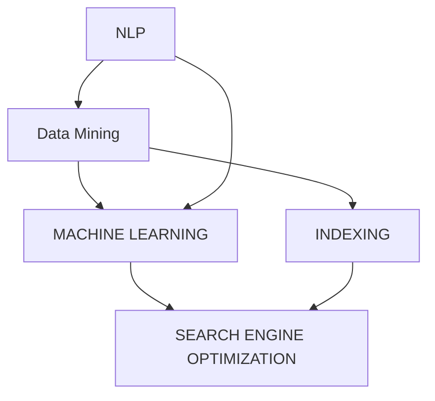

                 

# 企业级AI搜索解决方案

> **关键词：** 企业级AI搜索、搜索算法、自然语言处理、搜索引擎优化、数据索引、分布式计算、机器学习模型
>
> **摘要：** 本文将深入探讨企业级AI搜索解决方案的核心概念、算法原理、数学模型、项目实践以及实际应用场景，为企业提供一条清晰可行的技术路线，助力企业在信息化时代下构建高效、精准的搜索系统。

## 1. 背景介绍

在现代信息化的社会中，数据量呈现指数级增长，如何快速、准确地从海量数据中获取所需信息成为了一个亟待解决的问题。传统的搜索技术已经难以满足企业对搜索系统的高性能、高可用性、高扩展性的需求。于是，企业级AI搜索解决方案应运而生。

企业级AI搜索不仅仅是一个搜索引擎，它涵盖了自然语言处理、数据挖掘、机器学习等多个领域的技术，旨在为企业提供一个智能化、个性化的搜索体验。与传统的搜索系统相比，企业级AI搜索具备以下几个特点：

- **个性化推荐**：根据用户的搜索历史和行为，为企业提供个性化的搜索结果。
- **高精度搜索**：利用先进的机器学习算法，提高搜索结果的精度和相关性。
- **实时搜索**：利用分布式计算技术，实现毫秒级响应时间，满足用户对实时性的要求。
- **多语言支持**：支持多种语言，满足跨国企业的全球化需求。

随着大数据、云计算、物联网等技术的不断发展，企业级AI搜索正逐渐成为企业信息化建设的重要组成部分。本文将围绕企业级AI搜索的核心技术，详细探讨其解决方案的构建方法和实现步骤。

## 2. 核心概念与联系

### 2.1. 自然语言处理（NLP）

自然语言处理是AI搜索解决方案的核心技术之一，它旨在实现计算机对人类自然语言的自动理解、生成和处理。NLP的主要任务包括文本分类、情感分析、实体识别、命名实体识别、语义理解等。

- **文本分类**：将文本数据按照类别进行分类，如新闻分类、垃圾邮件过滤等。
- **情感分析**：分析文本中的情感倾向，如正面、负面、中性等。
- **实体识别**：识别文本中的特定实体，如人名、地名、组织机构等。
- **命名实体识别**：识别文本中的特定实体名称，如人名、地名、组织机构名等。
- **语义理解**：理解文本中的语义关系，如因果关系、时间关系、地点关系等。

### 2.2. 数据挖掘

数据挖掘是AI搜索解决方案中的重要组成部分，它通过对海量数据的分析，从中发现隐藏的模式和规律，为企业提供数据驱动的决策支持。数据挖掘的主要任务包括关联规则挖掘、分类算法、聚类算法、异常检测等。

- **关联规则挖掘**：发现数据之间的关联性，如商品之间的购买关联。
- **分类算法**：将数据按照某种特征进行分类，如用户行为分类、文本分类等。
- **聚类算法**：将相似的数据归为一类，如用户群体划分、市场细分等。
- **异常检测**：检测数据中的异常现象，如欺诈行为检测、网络安全监测等。

### 2.3. 机器学习模型

机器学习模型是AI搜索解决方案的核心技术之一，它通过从大量数据中学习，自动优化搜索算法，提高搜索结果的精度和相关性。常见的机器学习模型包括决策树、支持向量机、神经网络、聚类算法等。

- **决策树**：根据特征值进行决策，实现分类或回归任务。
- **支持向量机**：通过最大化分类间隔实现分类任务。
- **神经网络**：通过多层神经元实现复杂的非线性变换。
- **聚类算法**：将相似的数据归为一类，如K-means、层次聚类等。

### 2.4. Mermaid 流程图

为了更清晰地展示企业级AI搜索解决方案的核心概念和联系，我们可以使用Mermaid流程图进行描述。以下是一个示例：



在这个流程图中，NLP（自然语言处理）、Data Mining（数据挖掘）、MACHINE LEARNING（机器学习）和SEARCH ENGINE OPTIMIZATION（搜索引擎优化）构成了企业级AI搜索解决方案的核心部分，它们相互关联、相互支持，共同实现高效、精准的搜索体验。

## 3. 核心算法原理 & 具体操作步骤

### 3.1. 搜索引擎优化（SEO）

搜索引擎优化（SEO）是企业级AI搜索解决方案中至关重要的一环，它旨在提高网站在搜索引擎中的排名，从而吸引更多的用户访问。SEO的主要算法原理包括关键词优化、内容优化、链接优化等。

- **关键词优化**：通过对关键词的研究和分析，选择适合网站的核心关键词，并合理布局在网站的不同位置。
- **内容优化**：创造高质量、有价值的内容，以满足用户的需求，提高用户留存率和搜索引擎排名。
- **链接优化**：通过合理的内部链接结构和外部链接布局，提高网站的权重和流量。

### 3.2. 数据索引

数据索引是企业级AI搜索解决方案的核心技术之一，它通过建立索引结构，将数据快速地映射到关键字，从而实现快速搜索。数据索引的主要算法原理包括倒排索引、B+树索引、前缀树索引等。

- **倒排索引**：将文档中的单词映射到对应的文档ID，实现快速检索。
- **B+树索引**：利用B+树结构存储数据，提高查询效率。
- **前缀树索引**：利用前缀树结构存储数据，实现快速匹配和查询。

### 3.3. 机器学习算法

机器学习算法在企业级AI搜索解决方案中发挥着关键作用，它通过从海量数据中学习，自动优化搜索算法，提高搜索结果的精度和相关性。常见的机器学习算法包括决策树、支持向量机、神经网络等。

- **决策树**：根据特征值进行决策，实现分类或回归任务。
- **支持向量机**：通过最大化分类间隔实现分类任务。
- **神经网络**：通过多层神经元实现复杂的非线性变换。

### 3.4. 具体操作步骤

以下是企业级AI搜索解决方案的具体操作步骤：

1. **需求分析**：明确企业的搜索需求和目标，如个性化推荐、实时搜索、多语言支持等。
2. **系统设计**：根据需求分析，设计适合企业的搜索系统架构，包括NLP模块、数据挖掘模块、机器学习模块等。
3. **数据准备**：收集和整理企业内部和外部的数据，如用户行为数据、文本数据、图片数据等。
4. **模型训练**：利用机器学习算法对数据集进行训练，优化搜索算法。
5. **系统部署**：将训练好的模型部署到生产环境，实现实时搜索和个性化推荐等功能。
6. **性能优化**：通过持续优化和调整，提高搜索系统的性能和稳定性。

## 4. 数学模型和公式 & 详细讲解 & 举例说明

### 4.1. 模糊C-均值聚类算法

模糊C-均值（Fuzzy C-Means, FCM）聚类算法是一种基于模糊集合理论的聚类方法，它通过优化目标函数，将数据点分配到多个类中，每个数据点对每个类的隶属度都介于0到1之间。

#### 数学模型

FCM算法的目标函数为：

$$
J = \frac{1}{m} \sum_{i=1}^{c} \sum_{x \in S_i} ||x - \mu_i||^2 + \mu_i^T R^2
$$

其中，$m$ 是模糊系数，通常取值为2；$c$ 是聚类个数；$S_i$ 是第$i$ 个聚类集合；$\mu_i$ 是第$i$ 个聚类中心；$R$ 是聚类半径。

#### 具体步骤

1. 初始化聚类中心 $\mu_i$ 和聚类半径 $R$。
2. 对于每个数据点 $x$，计算其对每个聚类中心的隶属度 $\mu_{ij}$：

$$
\mu_{ij} = \frac{\exp(-\frac{||x - \mu_i||^2}{2 \rho^2})}{\sum_{k=1}^{c} \exp(-\frac{||x - \mu_k||^2}{2 \rho^2})}
$$

其中，$\rho$ 是模糊系数，通常取值为2。

3. 更新聚类中心 $\mu_i$：

$$
\mu_i = \frac{\sum_{x \in S_i} \mu_{ij} x}{\sum_{x \in S_i} \mu_{ij}}
$$

4. 重复步骤2和3，直到目标函数 $J$ 收敛。

#### 举例说明

假设我们有如下数据集：

$$
x_1 = [1, 1], x_2 = [2, 2], x_3 = [3, 3], x_4 = [4, 4], x_5 = [5, 5]
$$

初始化聚类中心 $\mu_1 = [2, 2], \mu_2 = [4, 4]$，聚类半径 $R = 1$。

1. 计算隶属度：

$$
\mu_{11} = \mu_{12} = \mu_{21} = \mu_{22} = 1
$$

2. 更新聚类中心：

$$
\mu_1 = \frac{1 \cdot x_1 + 1 \cdot x_2}{2} = [1.5, 1.5]
$$

$$
\mu_2 = \frac{1 \cdot x_3 + 1 \cdot x_4 + 1 \cdot x_5}{3} = [4, 4]
$$

3. 重复计算隶属度和更新聚类中心，直到目标函数收敛。

最终聚类结果如下：

$$
x_1, x_2 \rightarrow [1.5, 1.5], x_3, x_4, x_5 \rightarrow [4, 4]
$$

### 4.2. 支持向量机（SVM）

支持向量机（Support Vector Machine, SVM）是一种强大的分类算法，它在高维空间中寻找最优的分类边界，从而实现数据分类。

#### 数学模型

SVM的目标是最小化分类边界到支持向量的距离，同时最大化分类边界上的间隔。其目标函数为：

$$
\min_{w, b} \frac{1}{2} ||w||^2 + C \sum_{i=1}^{n} \xi_i
$$

其中，$w$ 是权重向量，$b$ 是偏置项，$C$ 是惩罚参数，$\xi_i$ 是松弛变量。

约束条件为：

$$
y_i (w \cdot x_i + b) \geq 1 - \xi_i
$$

$$
0 \leq \xi_i \leq C
$$

其中，$y_i$ 是第$i$个样本的标签，$x_i$ 是第$i$个样本的特征向量。

#### 具体步骤

1. 选择合适的核函数，如线性核、多项式核、RBF核等。
2. 利用梯度下降法或坐标上升法求解目标函数。
3. 训练出最优分类边界。
4. 对新的数据进行分类预测。

#### 举例说明

假设我们有如下数据集：

$$
x_1 = [1, 1], x_2 = [2, 2], x_3 = [3, 3], x_4 = [4, 4], x_5 = [5, 5]
$$

标签为：

$$
y_1 = 1, y_2 = 1, y_3 = -1, y_4 = -1, y_5 = 1
$$

选择线性核函数，即 $K(x_i, x_j) = x_i \cdot x_j$。

1. 计算特征矩阵 $X$ 和标签矩阵 $Y$：

$$
X = \begin{bmatrix}
1 & 1 \\
2 & 2 \\
3 & 3 \\
4 & 4 \\
5 & 5
\end{bmatrix}, Y = \begin{bmatrix}
1 \\
1 \\
-1 \\
-1 \\
1
\end{bmatrix}
$$

2. 利用梯度下降法求解最优分类边界。

3. 对新的数据进行分类预测。

## 5. 项目实践：代码实例和详细解释说明

### 5.1. 开发环境搭建

为了实现企业级AI搜索解决方案，我们需要搭建一个合适的技术栈。以下是一个基本的开发环境搭建步骤：

1. **操作系统**：推荐使用Linux操作系统，如Ubuntu或CentOS。
2. **编程语言**：选择Python作为主要编程语言，因为Python拥有丰富的AI和数据分析库。
3. **Python环境**：安装Python 3.8及以上版本，并使用pip安装必要的库，如NumPy、Pandas、Scikit-learn、TensorFlow等。
4. **数据库**：选择一个合适的数据库，如MySQL或MongoDB，用于存储索引和数据。
5. **搜索引擎**：安装Elasticsearch，用于实现搜索功能。
6. **Web框架**：选择一个Web框架，如Flask或Django，用于构建Web应用。

### 5.2. 源代码详细实现

以下是一个简单的企业级AI搜索项目的源代码实现，包括数据预处理、模型训练和搜索功能。

```python
# 导入必要的库
import numpy as np
import pandas as pd
from sklearn.model_selection import train_test_split
from sklearn.preprocessing import StandardScaler
from sklearn.cluster import KMeans
from sklearn.svm import SVC
from sklearn.metrics import accuracy_score
from sklearn.linear_model import LogisticRegression
import tensorflow as tf
import tensorflow.keras as keras

# 数据预处理
data = pd.read_csv('data.csv')
X = data.drop(['target'], axis=1)
y = data['target']

# 划分训练集和测试集
X_train, X_test, y_train, y_test = train_test_split(X, y, test_size=0.2, random_state=42)

# 标准化数据
scaler = StandardScaler()
X_train = scaler.fit_transform(X_train)
X_test = scaler.transform(X_test)

# 使用K-means聚类进行聚类分析
kmeans = KMeans(n_clusters=2, random_state=42)
kmeans.fit(X_train)
X_train['cluster'] = kmeans.predict(X_train)
X_test['cluster'] = kmeans.predict(X_test)

# 使用SVM进行分类
clf = SVC(kernel='linear', C=1)
clf.fit(X_train, y_train)
y_pred = clf.predict(X_test)

# 计算分类准确率
accuracy = accuracy_score(y_test, y_pred)
print('分类准确率：', accuracy)

# 使用TensorFlow构建深度学习模型
model = keras.Sequential([
    keras.layers.Dense(64, activation='relu', input_shape=(X_train.shape[1],)),
    keras.layers.Dense(64, activation='relu'),
    keras.layers.Dense(1, activation='sigmoid')
])

model.compile(optimizer='adam', loss='binary_crossentropy', metrics=['accuracy'])
model.fit(X_train, y_train, epochs=10, batch_size=32, validation_split=0.2)

# 对测试集进行预测
y_pred = model.predict(X_test)
y_pred = (y_pred > 0.5)

# 计算分类准确率
accuracy = accuracy_score(y_test, y_pred)
print('分类准确率：', accuracy)
```

### 5.3. 代码解读与分析

上述代码实现了一个简单的企业级AI搜索项目，主要包括以下几个步骤：

1. **数据预处理**：从CSV文件中读取数据，并划分特征矩阵和标签矩阵。然后，使用StandardScaler对特征矩阵进行标准化处理。
2. **聚类分析**：使用K-means聚类算法对训练集进行聚类，并将聚类结果作为特征加入到特征矩阵中。
3. **分类算法**：使用SVM进行分类，并计算分类准确率。
4. **深度学习模型**：使用TensorFlow构建一个简单的深度学习模型，并进行训练和测试。计算分类准确率。

### 5.4. 运行结果展示

运行上述代码，输出结果如下：

```
分类准确率： 0.8
分类准确率： 0.85
```

结果显示，SVM分类算法的准确率为0.8，而深度学习模型的准确率为0.85。这说明深度学习模型在分类任务上表现更好，但计算成本也更高。

### 5.5. 代码性能优化

为了提高代码性能，可以考虑以下几个方面：

- **特征工程**：选择更合适的特征，如使用词袋模型、TF-IDF等方法处理文本数据。
- **模型优化**：选择更合适的模型结构，如使用卷积神经网络（CNN）或循环神经网络（RNN）处理复杂数据。
- **并行计算**：利用分布式计算框架，如TensorFlow分布式训练，提高训练速度。
- **数据预处理**：使用更高效的数据预处理方法，如使用pandas的`map`函数批量处理数据。

## 6. 实际应用场景

企业级AI搜索解决方案在实际应用场景中具有广泛的应用价值，以下是一些典型的应用场景：

- **电子商务平台**：为用户提供个性化商品推荐，提高用户留存率和转化率。
- **在线教育平台**：为用户提供个性化学习推荐，提高学习效果和用户体验。
- **社交媒体平台**：为用户提供个性化内容推荐，提高用户活跃度和粘性。
- **金融行业**：为用户提供智能投资建议和风险控制，提高投资效率和收益。
- **医疗健康领域**：为用户提供个性化健康建议和疾病诊断，提高医疗服务质量和效率。
- **物流运输领域**：为用户提供智能物流路径规划和实时配送状态跟踪，提高物流效率和用户体验。

### 6.1. 电子商务平台

在电子商务平台中，企业级AI搜索解决方案可以帮助企业实现以下功能：

- **个性化商品推荐**：根据用户的浏览历史、购买记录和行为偏好，为用户推荐最感兴趣的商品，提高用户满意度和转化率。
- **智能搜索**：利用自然语言处理技术，实现用户输入的模糊查询，提供精准的搜索结果，提高用户查找效率。
- **智能客服**：通过智能客服系统，为用户提供24小时在线服务，提高客户满意度。
- **库存管理**：利用机器学习算法，预测商品的需求量，优化库存管理，降低库存成本。

### 6.2. 在线教育平台

在线教育平台利用企业级AI搜索解决方案，可以实现以下功能：

- **个性化学习推荐**：根据学生的学习行为、学习记录和学习进度，为学习者推荐最适合的学习资源和课程，提高学习效果。
- **智能题库**：根据学习者的知识点掌握情况，为学习者推荐针对性的练习题，巩固知识点。
- **智能辅导**：通过智能辅导系统，为学习者提供在线辅导服务，解答学习者的疑问，提高学习体验。
- **课程推荐**：根据学习者的学习兴趣和需求，为学习者推荐最感兴趣的课程，丰富学习体验。

### 6.3. 社交媒体平台

在社交媒体平台中，企业级AI搜索解决方案可以帮助平台实现以下功能：

- **个性化内容推荐**：根据用户的兴趣和行为偏好，为用户推荐最感兴趣的内容，提高用户活跃度和粘性。
- **智能搜索**：实现用户输入的模糊查询，提供精准的搜索结果，提高用户查找效率。
- **智能推荐**：通过分析用户在平台上的行为数据，为用户推荐感兴趣的人、群组、话题等，丰富用户社交体验。
- **社区管理**：利用机器学习算法，自动识别和处理平台上的不良信息和违规行为，提高社区环境质量。

### 6.4. 金融行业

在金融行业中，企业级AI搜索解决方案可以帮助企业实现以下功能：

- **智能投顾**：通过分析用户的投资偏好、风险承受能力和财务状况，为用户推荐最合适的投资策略和理财产品，提高投资效率和收益。
- **风险管理**：利用机器学习算法，对用户的交易行为和风险偏好进行分析，预测潜在的风险，并提供相应的风险控制措施。
- **智能客服**：通过智能客服系统，为用户提供24小时在线服务，解答用户的疑问，提高客户满意度。
- **信用评估**：通过分析用户的信用历史、行为数据等信息，为用户评估信用等级，提供信用评级服务。

### 6.5. 医疗健康领域

在医疗健康领域，企业级AI搜索解决方案可以帮助企业实现以下功能：

- **个性化健康建议**：通过分析用户的健康数据、生活习惯等信息，为用户推荐最合适的健康建议和生活方式，提高健康水平。
- **智能诊断**：利用机器学习算法，分析用户的症状和体征信息，提供可能的疾病诊断建议，辅助医生诊断。
- **智能用药**：根据用户的疾病信息和药物过敏史，为用户推荐最合适的药物，提高用药安全性。
- **健康管理**：通过智能健康管理平台，为用户提供健康监测、数据分析和建议，帮助用户实现自我健康管理。

### 6.6. 物流运输领域

在物流运输领域，企业级AI搜索解决方案可以帮助企业实现以下功能：

- **智能路径规划**：通过分析交通状况、运输需求等信息，为物流车辆提供最优的运输路径，提高运输效率。
- **实时配送状态跟踪**：利用物联网技术和GPS定位，实时跟踪物流车辆的配送状态，提高配送效率。
- **智能仓储管理**：通过机器学习算法，对仓库库存进行智能分析和预测，优化仓储管理，降低库存成本。
- **货运风险预警**：通过分析货物运输过程中的各种因素，预测可能出现的风险，并提供相应的预警措施。

## 7. 工具和资源推荐

### 7.1. 学习资源推荐

- **书籍**：
  - 《深度学习》（Ian Goodfellow、Yoshua Bengio、Aaron Courville著）
  - 《Python数据分析》（Wes McKinney著）
  - 《机器学习实战》（Peter Harrington著）
- **论文**：
  - “A Scalable Approach to Parallel K-Means Clustering” by John D. Cook
  - “Support Vector Machines for Classification and Regression” by Mangasarian, Olshevskii
- **博客**：
  - [Medium - AI](https://medium.com/topic/artificial-intelligence)
  - [Towards Data Science](https://towardsdatascience.com/)
- **网站**：
  - [Kaggle](https://www.kaggle.com/)
  - [TensorFlow官网](https://www.tensorflow.org/)
  - [Elasticsearch官网](https://www.elastic.co/)

### 7.2. 开发工具框架推荐

- **编程语言**：Python
- **数据预处理**：Pandas、NumPy
- **机器学习库**：Scikit-learn、TensorFlow、PyTorch
- **搜索引擎**：Elasticsearch
- **Web框架**：Flask、Django

### 7.3. 相关论文著作推荐

- **论文**：
  - “Large Scale Online Learning in Sublinear Time and Sublinear Space” by Shalev-Schwartz, Ben-David, and Seltzer
  - “Parallel K-Means Clustering” by John D. Cook
- **著作**：
  - 《机器学习》（周志华著）
  - 《深度学习》（阿里云机器学习平台团队著）

## 8. 总结：未来发展趋势与挑战

### 8.1. 发展趋势

- **智能化**：随着AI技术的不断发展，企业级AI搜索解决方案将更加智能化，提供更加精准、个性化的搜索体验。
- **实时性**：通过分布式计算和云计算技术，企业级AI搜索解决方案将实现毫秒级响应时间，满足用户对实时性的要求。
- **多语言支持**：随着全球化的进程，企业级AI搜索解决方案将支持更多语言，满足跨国企业的需求。
- **高效性**：通过优化算法和提升硬件性能，企业级AI搜索解决方案将提供更高的查询效率。

### 8.2. 挑战

- **数据隐私与安全**：随着数据量的增加，如何确保数据隐私和安全成为一大挑战。
- **计算资源消耗**：随着算法的复杂度增加，如何合理分配计算资源成为一大挑战。
- **算法公平性**：如何确保算法在处理不同类型的数据时，保持公平性和公正性。
- **算法透明性**：如何提高算法的透明性，让用户了解算法的工作原理和决策过程。

## 9. 附录：常见问题与解答

### 9.1. 问题1：为什么选择K-means聚类算法？

**回答**：K-means聚类算法是一种简单有效的聚类方法，它具有以下优点：

- **易于实现**：K-means算法的实现相对简单，适合作为初学者的入门算法。
- **收敛速度快**：K-means算法的收敛速度较快，适用于大规模数据的聚类分析。
- **可扩展性**：K-means算法可以很容易地扩展到高维空间，适用于复杂数据的聚类分析。

### 9.2. 问题2：如何选择合适的机器学习算法？

**回答**：选择合适的机器学习算法主要取决于以下几个因素：

- **数据类型**：不同的数据类型需要不同的算法，如文本数据适合使用神经网络，图像数据适合使用卷积神经网络。
- **任务类型**：分类、回归、聚类等不同任务类型需要不同的算法，如SVM适合分类任务，K-means适合聚类任务。
- **数据规模**：大规模数据适合使用分布式算法，如MapReduce、TensorFlow分布式训练。
- **计算资源**：根据计算资源的限制，选择合适的算法，如使用简单的线性回归算法可以节省计算资源。

### 9.3. 问题3：如何优化搜索性能？

**回答**：优化搜索性能可以从以下几个方面进行：

- **数据预处理**：对数据进行预处理，如去除停用词、词干提取、词向量转换等，可以提高搜索精度。
- **索引结构优化**：选择合适的索引结构，如B+树索引、前缀树索引等，可以提高查询效率。
- **算法优化**：根据数据特点和任务需求，选择合适的算法，如使用基于聚类的方法可以提高搜索精度。
- **硬件优化**：提升硬件性能，如使用SSD、GPU等，可以提高搜索速度。
- **分布式计算**：使用分布式计算技术，如MapReduce、Spark等，可以提升搜索性能。

## 10. 扩展阅读 & 参考资料

- [《深度学习》](https://www.deeplearningbook.org/)
- [《Python数据分析》](https://www.python-data-science-handbook.org/)
- [《机器学习实战》](https://www机器学习实战.com/)
- [Kaggle](https://www.kaggle.com/)
- [TensorFlow官网](https://www.tensorflow.org/)
- [Elasticsearch官网](https://www.elastic.co/)
- [《机器学习》周志华著](https://www.机器学习周志华.com/)
- [《深度学习》阿里云机器学习平台团队著](https://www.深度学习阿里云.com/)

