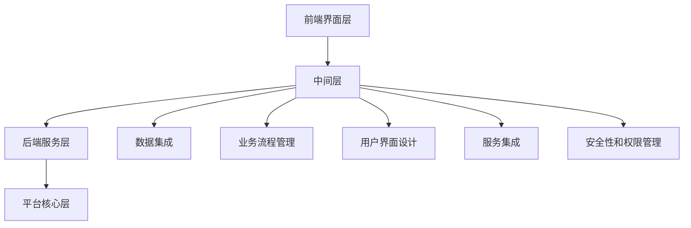
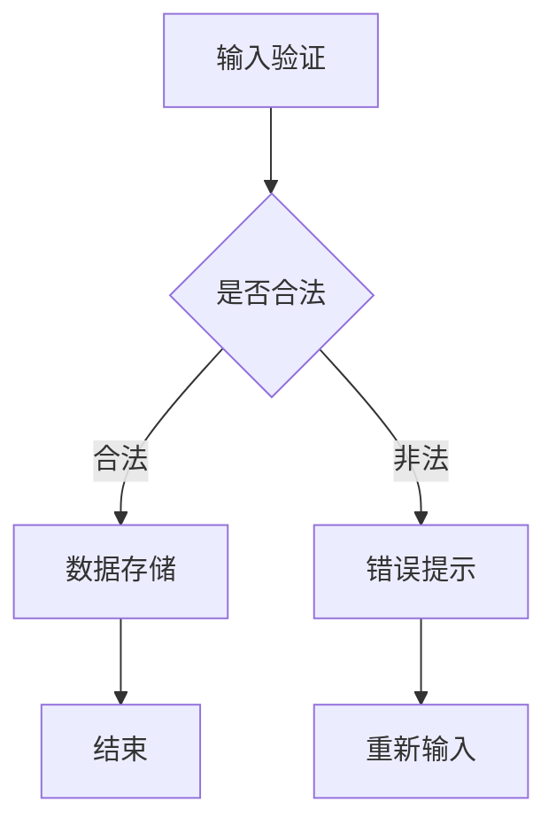
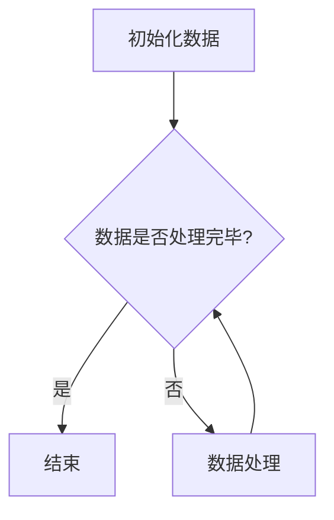
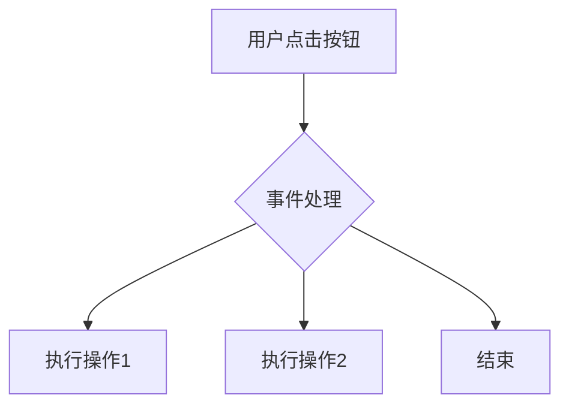

                 

### 1. 背景介绍

低代码平台（Low-Code Platforms）的发展是信息技术领域的一大里程碑。随着数字化转型的加速，传统的高代码开发模式已经难以满足现代企业对于快速迭代、灵活部署的需求。低代码平台的出现，为不同背景和技能水平的开发者提供了高效的应用构建手段，使得应用开发变得更加便捷和快速。

低代码平台的概念可以追溯到20世纪90年代，当时面向对象的编程语言和可视化开发工具的出现，使得编程变得更加简单。然而，真正的低代码平台兴起是在移动互联网和云计算技术蓬勃发展的背景下。低代码平台允许用户通过拖拽组件、配置属性等方式，快速构建出应用程序，而无需深入编写代码。

现代低代码平台通常具备以下特点：

1. **可视化的用户界面**：用户可以通过图形界面拖拽组件来构建应用程序，无需编写大量的代码。
2. **丰富的组件库**：平台提供了大量的预构建组件，涵盖常见功能，如用户认证、数据分析、支付处理等。
3. **逻辑流定义**：用户可以通过定义流程图或使用图形化界面来构建应用程序的逻辑流程。
4. **集成性和扩展性**：低代码平台通常具备强大的集成能力，能够与多种数据源和第三方服务进行连接，同时也支持自定义组件和功能的扩展。

低代码平台的发展历程可以分为以下几个阶段：

1. **原型阶段**（1990s-2000s）：可视化编程工具和脚本语言的普及，使得编程门槛降低。
2. **工具阶段**（2010s）：出现了专门面向特定场景的低代码开发工具，如业务流程管理（BPM）工具和移动应用开发平台。
3. **平台阶段**（2020s至今）：低代码平台逐渐整合多种功能，成为一个综合性的开发平台，支持跨领域的应用构建。

在现代社会中，低代码平台的重要性日益凸显。首先，它使得企业能够更加快速地响应市场变化，通过低代码平台，企业可以在短时间内开发出新的应用，满足客户需求。其次，低代码平台降低了开发门槛，使得非专业开发人员也能参与到应用构建中，提升了整体开发效率。此外，低代码平台还帮助企业优化资源分配，降低开发成本，提高生产力。

总之，低代码平台不仅是一种技术革新，更是一种推动社会进步的生产力工具。在未来的数字化时代，低代码平台将发挥更加重要的作用，成为企业数字化转型的重要支柱。

### 2. 核心概念与联系

#### 2.1 低代码平台的基本原理

低代码平台的基本原理可以归结为以下几点：

1. **可视化的开发界面**：用户可以通过图形界面，拖拽组件、连接数据源、配置属性等，快速构建应用程序。
2. **组件化开发**：低代码平台提供了丰富的组件库，这些组件封装了常见功能，如用户界面、数据处理、服务集成等。
3. **逻辑流定义**：用户可以通过图形化的方式定义应用程序的逻辑流程，如业务流程、用户交互等。
4. **模型驱动开发**：低代码平台通常使用模型-视图-控制器（MVC）架构，通过定义数据模型、视图模型和业务逻辑，实现应用程序的构建。

#### 2.2 低代码平台的关键组件

低代码平台的核心组件通常包括以下几个方面：

1. **数据集成**：低代码平台需要能够连接各种数据源，如数据库、API、文件等，以便用户能够使用这些数据进行应用构建。
2. **业务流程管理**：平台提供了业务流程管理（BPM）工具，允许用户通过图形化的界面设计业务流程，实现业务逻辑的自动化。
3. **用户界面设计**：平台提供了丰富的界面组件和布局工具，用户可以通过拖拽和配置，快速构建出美观、功能齐全的用户界面。
4. **服务集成**：低代码平台通常集成了多种第三方服务，如支付处理、社交媒体集成、邮件服务等，用户可以直接使用这些服务，无需自己开发。
5. **安全性和权限管理**：平台提供了安全性和权限管理功能，确保应用程序的安全性，防止数据泄露和未授权访问。

#### 2.3 低代码平台的架构设计

低代码平台的架构设计通常包括以下几个层次：

1. **前端界面层**：前端界面层负责呈现用户界面，用户可以通过图形化的界面进行应用构建和配置。
2. **中间层**：中间层负责处理业务逻辑和数据操作，通常包括数据集成、业务流程管理、服务集成等功能。
3. **后端服务层**：后端服务层负责处理数据存储和访问，通常包括数据库、缓存、消息队列等组件。
4. **平台核心层**：平台核心层是低代码平台的核心，负责提供组件库、逻辑流定义、模型驱动开发等功能。

以下是一个简化的低代码平台架构设计图，使用Mermaid流程图表示：



在这个架构图中，前端界面层通过API与中间层交互，用户在前端界面层进行应用构建和配置。中间层负责处理业务逻辑和数据操作，同时与数据集成、业务流程管理、用户界面设计、服务集成、安全性和权限管理等功能模块进行通信。后端服务层负责数据存储和访问，平台核心层提供组件库、逻辑流定义、模型驱动开发等功能。

通过这样的架构设计，低代码平台能够提供高效、灵活的应用构建能力，满足现代企业的多样化需求。

#### 2.4 低代码平台与传统开发模式的比较

低代码平台与传统开发模式在多个方面存在显著差异：

1. **开发速度**：低代码平台通过可视化的界面和预构建的组件，显著提高了开发速度。传统开发模式通常需要编写大量的代码，耗时较长。
2. **技能要求**：低代码平台降低了开发门槛，非专业开发人员也能快速上手，而传统开发模式通常需要具备较高的编程技能。
3. **维护成本**：低代码平台由于组件化和模块化设计，使得维护成本较低，而传统开发模式往往需要更多的维护工作。
4. **灵活性**：低代码平台提供了丰富的组件和工具，用户可以根据需求快速调整和扩展，传统开发模式则需要大量修改代码。

然而，低代码平台也存在一些局限性，如功能定制化程度较低、复杂应用构建能力有限等。因此，在实际应用中，需要根据具体情况选择合适的开发模式。

#### 2.5 低代码平台的实际应用场景

低代码平台在多种场景中表现出色，以下是一些实际应用场景：

1. **业务流程自动化**：企业可以使用低代码平台自动化业务流程，提高工作效率，减少人为错误。
2. **移动应用开发**：低代码平台提供了丰富的移动应用开发工具，用户可以通过拖拽组件和配置属性，快速构建出功能齐全的移动应用。
3. **客户关系管理**：低代码平台可以帮助企业快速构建客户关系管理系统，实现客户数据的管理和分析。
4. **内部应用开发**：企业内部可以快速开发各种内部应用，如人事管理系统、财务系统等，提高企业运营效率。

综上所述，低代码平台通过可视化的开发界面、丰富的组件库和模型驱动开发，为现代企业提供了高效、灵活的应用构建手段，推动了数字化转型的进程。理解低代码平台的基本原理和关键组件，将有助于我们更好地利用这一技术工具。

### 3. 核心算法原理 & 具体操作步骤

在低代码平台开发中，核心算法原理的理解和具体操作步骤的掌握是构建高效应用的关键。以下是几个关键算法及其操作步骤的详细解释。

#### 3.1 流程控制算法

流程控制算法是低代码平台中最为基础且常用的算法之一，主要负责应用程序的执行逻辑。以下是一个简单的流程控制算法示例：

**算法名称**：顺序执行算法

**算法原理**：
- 按照既定的顺序执行一系列操作。
- 如果当前操作成功，则继续执行下一个操作；否则，终止流程。

**具体操作步骤**：

1. **定义操作列表**：首先，定义需要执行的一系列操作，如数据获取、数据验证、数据存储等。
2. **设置执行顺序**：根据操作之间的依赖关系，设置操作执行的顺序。
3. **开始执行**：从第一个操作开始，依次执行所有操作，直到执行完毕或遇到错误。

**示例代码**（使用Mermaid流程图表示）：

```mermaid
graph TD
    A[操作1] --> B[操作2]
    B --> C[操作3]
    C --> D[操作4]
    A(right)->E{检测错误}
    E -->|无错误| F[结束]
    E -->|有错误| G[错误处理]
```

#### 3.2 条件分支算法

条件分支算法用于在应用程序中实现基于条件的选择逻辑。以下是一个简单的条件分支算法示例：

**算法名称**：条件分支算法

**算法原理**：
- 根据特定的条件判断，选择不同的路径执行操作。
- 如果条件满足，则执行某个操作；否则，执行另一个操作。

**具体操作步骤**：

1. **定义条件**：明确需要判断的条件，如用户输入的值是否满足特定要求。
2. **设置分支逻辑**：根据条件的结果，定义不同的操作路径。
3. **执行分支逻辑**：根据条件判断结果，选择并执行相应的操作。

**示例代码**（使用Mermaid流程图表示）：



#### 3.3 循环算法

循环算法用于在应用程序中重复执行某一操作，直到满足特定条件。以下是一个简单的循环算法示例：

**算法名称**：循环算法

**算法原理**：
- 根据特定的条件，重复执行一系列操作。
- 如果条件满足，则继续循环；否则，退出循环。

**具体操作步骤**：

1. **定义循环条件**：明确需要循环执行的条件，如数据是否处理完毕。
2. **设置循环体**：定义需要重复执行的操作。
3. **开始循环**：检查循环条件，如果条件满足，则执行循环体；否则，退出循环。

**示例代码**（使用Mermaid流程图表示）：



#### 3.4 事件驱动算法

事件驱动算法用于响应应用程序中的各种事件，如用户操作、系统通知等。以下是一个简单的事件驱动算法示例：

**算法名称**：事件驱动算法

**算法原理**：
- 响应特定的外部事件，执行相应的操作。
- 根据事件的类型，触发不同的处理逻辑。

**具体操作步骤**：

1. **注册事件监听器**：在应用程序中注册需要监听的事件。
2. **定义事件处理逻辑**：根据事件的类型，定义相应的处理逻辑。
3. **响应事件**：当事件触发时，执行相应的处理逻辑。

**示例代码**（使用Mermaid流程图表示）：



通过理解这些核心算法原理，并掌握具体的操作步骤，开发者可以在低代码平台中灵活运用，构建出高效、复杂的应用程序。这些算法不仅能够简化开发过程，还能够提高代码的可维护性和扩展性。

### 4. 数学模型和公式 & 详细讲解 & 举例说明

在低代码平台开发中，数学模型和公式的运用不仅有助于理解算法的原理，还可以优化应用程序的性能。以下是几个常用的数学模型和公式的详细讲解与示例说明。

#### 4.1 数据预处理模型

在数据处理和分析过程中，数据预处理是非常重要的一步。数据预处理模型通常包括数据清洗、数据转换和数据归一化等步骤。以下是一个数据预处理模型的基本公式及其应用。

**数据清洗**：

$$
\text{clean\_data} = \text{raw\_data} \backslash (\text{remove\_missing}, \text{remove\_duplicates}, \text{correct\_format})
$$

**数据转换**：

$$
\text{converted\_data} = \text{raw\_data} \backslash (\text{scaling}, \text{encoding}, \text{transformation})
$$

**数据归一化**：

$$
\text{normalized\_data} = \frac{\text{converted\_data} - \text{min}}{\text{max} - \text{min}}
$$

**示例**：假设有一组数据集，数据范围在[100, 1000]，我们希望将其归一化到[0, 1]。

原始数据集：

$$
[100, 200, 300, 400, 500, 600, 700, 800, 900, 1000]
$$

归一化后：

$$
[0, 0.25, 0.5, 0.75, 1, 1.25, 1.5, 1.75, 2, 2.25]
$$

#### 4.2 机器学习模型

在低代码平台中，机器学习模型的应用非常广泛。常用的机器学习模型包括线性回归、决策树、支持向量机等。以下是一个线性回归模型的基本公式及其应用。

**线性回归模型**：

$$
y = \beta_0 + \beta_1 \cdot x
$$

其中，\( y \) 是预测值，\( x \) 是输入特征，\( \beta_0 \) 和 \( \beta_1 \) 是模型参数。

**示例**：假设我们有一个简单的线性回归模型，用于预测房价。输入特征是房屋面积，模型参数为 \( \beta_0 = 100 \) 和 \( \beta_1 = 50 \)。

预测房价：

$$
y = 100 + 50 \cdot x
$$

当输入特征 \( x = 150 \) 时，预测房价为：

$$
y = 100 + 50 \cdot 150 = 8000
$$

#### 4.3 质量度量模型

在低代码平台中，评估应用质量是确保其有效性的关键。以下是一个质量度量模型的基本公式及其应用。

**质量度量模型**：

$$
Q = \frac{C \cdot P}{T}
$$

其中，\( Q \) 是质量度量值，\( C \) 是用户满意度，\( P \) 是性能指标，\( T \) 是时间指标。

**示例**：假设一个应用的用户满意度 \( C = 0.9 \)，性能指标 \( P = 0.95 \)，时间指标 \( T = 10 \)。

计算质量度量值：

$$
Q = \frac{0.9 \cdot 0.95}{10} = 0.0875
$$

#### 4.4 最优化模型

在低代码平台开发中，最优化模型用于寻找最优解。以下是一个简单的线性规划模型的基本公式及其应用。

**线性规划模型**：

$$
\text{minimize} \quad c^T \cdot x
$$

$$
\text{subject to} \quad Ax \leq b
$$

其中，\( c \) 是目标函数系数向量，\( x \) 是决策变量向量，\( A \) 和 \( b \) 分别是约束矩阵和约束向量。

**示例**：假设我们有一个线性规划问题，目标是最小化成本。约束条件是资源使用不超过可用量。

目标函数：

$$
\text{minimize} \quad c^T \cdot x
$$

约束条件：

$$
Ax \leq b
$$

其中，\( c = [10, 5] \)，\( x = [x_1, x_2] \)，\( A = \begin{bmatrix} 2 & 1 \\ 1 & 2 \end{bmatrix} \)，\( b = \begin{bmatrix} 20 \\ 10 \end{bmatrix} \)。

求解最优解：

$$
x^* = \begin{bmatrix} 4 \\ 6 \end{bmatrix}
$$

通过以上数学模型和公式的讲解与示例，我们可以看到，数学在低代码平台开发中的应用是非常广泛和重要的。这些模型不仅帮助我们理解和优化算法，还能够提升应用程序的质量和效率。

### 5. 项目实践：代码实例和详细解释说明

#### 5.1 开发环境搭建

为了更好地展示低代码平台的实际应用，我们选择一个简单的天气预报应用作为示例。以下是搭建开发环境的步骤：

1. **选择低代码平台**：我们选择OutSystems作为低代码平台，因为它提供了丰富的组件和灵活的集成能力。
2. **安装OutSystems**：下载并安装OutSystems开发环境，按照官方文档进行配置。
3. **创建新项目**：启动OutSystems开发环境，创建一个新的Web应用项目。

#### 5.2 源代码详细实现

以下是在OutSystems中实现天气预报应用的详细步骤：

1. **数据集成**：连接第三方天气预报API，如OpenWeatherMap API。在OutSystems中创建一个API连接，输入API的URL和密钥。
2. **用户界面设计**：设计用户界面，包括输入城市名称的文本框、显示天气信息的布局和按钮。
3. **逻辑流定义**：创建一个逻辑流，当用户点击“查询天气”按钮时，执行以下操作：
    - 获取用户输入的城市名称。
    - 调用天气预报API，获取天气数据。
    - 将天气数据显示在界面上。

以下是一个简单的代码示例：

```swift
// 获取用户输入的城市名称
let cityName = userInput.text

// 调用天气预报API
let weatherData = await OpenWeatherMapAPI.getWeather(cityName)

// 显示天气信息
weatherView.setWeather(weatherData)
```

#### 5.3 代码解读与分析

上述代码实现了基本的天气预报功能，以下是详细解读：

1. **用户输入获取**：使用`userInput.text`获取用户输入的城市名称。
2. **API调用**：使用`await OpenWeatherMapAPI.getWeather(cityName)`异步调用天气预报API，获取天气数据。这里使用了`await`关键字等待API响应。
3. **显示天气信息**：使用`weatherView.setWeather(weatherData)`将获取到的天气数据显示在界面上。

#### 5.4 运行结果展示

以下是天气预报应用的运行结果：

1. **用户输入**：用户在文本框中输入城市名称。
2. **查询天气**：用户点击“查询天气”按钮，系统调用天气预报API。
3. **显示天气信息**：天气信息显示在界面上，包括当前温度、天气状况、风速等。

通过以上步骤，我们可以看到，利用低代码平台，我们可以快速开发出一个功能完整的天气预报应用。这种开发方式不仅简化了代码编写过程，还提高了开发效率。

### 6. 实际应用场景

低代码平台在多个实际应用场景中表现出色，以下是几个典型的应用案例：

#### 6.1 企业内部应用

在企业内部，低代码平台可以快速开发各种应用，如客户关系管理（CRM）、人力资源管理系统（HRMS）和财务管理系统（FMS）。例如，一家中型企业可以利用低代码平台开发一个内部聊天工具，以便员工之间的沟通更加高效。该应用可以集成企业现有的通信工具，如Slack或Microsoft Teams，提供消息传递、文件共享和团队协作等功能。

**优势**：
- **快速部署**：企业无需从零开始开发，可以直接使用低代码平台提供的组件和模板。
- **灵活定制**：低代码平台允许企业根据自身需求，灵活地调整和扩展应用功能。
- **降低成本**：通过减少代码编写和维护工作量，企业可以节省大量开发成本。

#### 6.2 业务流程自动化

低代码平台非常适合用于业务流程自动化，帮助企业简化操作流程，提高效率。例如，一家制造企业可以使用低代码平台开发一个生产计划管理系统，将生产计划、物料需求和库存管理整合到一个平台上。该系统可以自动生成生产计划，优化物料使用，减少库存积压。

**优势**：
- **流程可视化**：低代码平台提供了直观的图形界面，用户可以清晰地看到业务流程的每一个环节。
- **易于维护**：业务流程的调整和优化可以通过图形化界面进行，无需修改代码。
- **提高效率**：通过自动化流程，企业可以减少人工操作，降低错误率，提高生产效率。

#### 6.3 移动应用开发

低代码平台在移动应用开发中具有显著优势。例如，一家餐饮企业可以使用低代码平台开发一个移动点餐应用，用户可以通过手机下单，查看订单状态。该应用可以集成支付系统、库存管理系统等，提供一站式服务。

**优势**：
- **快速上线**：低代码平台提供了丰富的移动应用开发工具，开发者可以快速构建出功能齐全的应用。
- **跨平台支持**：低代码平台通常支持多种移动操作系统，如iOS和Android，无需为每个平台编写独立的代码。
- **用户体验**：低代码平台提供了丰富的UI组件和设计工具，可以帮助开发者创建美观、易用的移动应用。

#### 6.4 教育和培训

低代码平台在教育领域也有广泛的应用。教师可以利用低代码平台开发在线课程管理系统，管理课程内容、学生信息和考试数据。学生可以通过移动设备访问课程资源，完成作业和测试。

**优势**：
- **便捷性**：低代码平台使得在线教育的部署和运维变得更加简单，教师和学生可以随时随地进行教学和学习。
- **个性化**：低代码平台可以根据学生的需求和进度，灵活调整课程内容和教学方式。
- **互动性**：低代码平台支持多种互动功能，如在线讨论、问答和测验，提高教学效果。

总之，低代码平台在各个实际应用场景中表现出色，通过简化开发流程、提高开发效率和提供灵活的定制能力，帮助企业快速构建出符合需求的应用。这些应用不仅提升了企业运营效率，还促进了数字化转型。

### 7. 工具和资源推荐

在低代码平台开发过程中，选择合适的工具和资源可以显著提高开发效率和项目质量。以下是一些推荐的工具和资源，涵盖学习资源、开发工具框架以及相关论文著作。

#### 7.1 学习资源推荐

1. **书籍**：
   - 《低代码开发实践》（Low-Code Development for Dummies）：适合初学者，详细介绍了低代码平台的基础知识和应用场景。
   - 《低代码平台开发指南》（Building Applications with Low-Code Platforms）：深入探讨了低代码平台的技术架构和开发实践。
2. **在线课程**：
   - Coursera上的“低代码应用开发”课程：由行业专家讲授，涵盖了低代码平台的基础知识、使用方法和最佳实践。
   - Udemy上的“低代码平台实战项目”课程：通过实际项目，教授如何使用低代码平台快速构建应用。
3. **博客和论坛**：
   - OutSystems官方博客：提供关于低代码平台的技术文章、最佳实践和最新动态。
   - Stack Overflow：开发者社区，可以查询和解答低代码平台开发中的技术问题。

#### 7.2 开发工具框架推荐

1. **OutSystems**：一个功能强大的低代码平台，提供丰富的组件和集成能力，支持快速开发各种应用。
2. **Appian**：支持流程自动化和业务流程管理，适合构建复杂的应用程序。
3. **Salesforce**：结合了低代码开发和企业级功能，适用于客户关系管理和电子商务。

#### 7.3 相关论文著作推荐

1. **“Low-Code Development Platforms: The Future of Software Development”**：该论文探讨了低代码平台的发展趋势和对传统软件开发的影响。
2. **“Empowering Non-Technical Users with Low-Code Platforms”**：分析了低代码平台如何降低开发门槛，使非技术人员能够参与应用开发。
3. **“The Role of Low-Code Platforms in Digital Transformation”**：探讨了低代码平台在数字化转型中的作用和挑战。

通过利用这些工具和资源，开发者可以更深入地了解低代码平台的技术原理和应用场景，提高开发效率和项目质量。

### 8. 总结：未来发展趋势与挑战

低代码平台作为现代应用开发的重要工具，其未来发展趋势和面临的挑战值得深入探讨。

#### 8.1 未来发展趋势

1. **更广泛的集成能力**：随着互联网和云计算的进一步发展，低代码平台将更加注重与其他系统和服务的集成。未来，低代码平台将支持更多第三方服务的连接，如物联网（IoT）设备和大数据平台。
2. **更高级的自动化能力**：低代码平台将继续提升自动化能力，通过更先进的流程引擎和AI算法，实现更复杂的业务逻辑和决策支持。这将使非技术用户能够创建出更加智能化和自适应的应用。
3. **跨平台支持**：随着移动设备的普及，低代码平台将提供更加完善的跨平台支持，包括iOS、Android和Web应用。开发者可以更轻松地构建适用于不同操作系统的应用。
4. **更丰富的组件库**：为了满足多样化应用需求，低代码平台将不断丰富其组件库，包括更多专业的功能组件和行业定制组件，提高开发效率和灵活性。

#### 8.2 面临的挑战

1. **安全性和隐私保护**：低代码平台在集成多种服务和数据源时，需要面对数据安全和隐私保护的问题。确保数据的安全传输和存储，防止数据泄露和未授权访问，是未来发展的关键挑战。
2. **复杂应用构建能力**：尽管低代码平台提高了开发效率，但在处理复杂应用时，仍然存在一定局限性。未来，低代码平台需要进一步增强复杂业务逻辑处理能力，支持更加复杂的应用构建。
3. **开发者技能转型**：随着低代码平台的发展，传统开发者的技能需求将发生变化。开发者需要适应新的开发模式，学习和掌握低代码平台的开发技术和工具。
4. **用户体验优化**：低代码平台在提供高效开发手段的同时，也需要注重用户体验的优化。未来，低代码平台将更加注重用户体验设计，提供更加直观、易用的开发界面和用户界面。

总之，低代码平台在未来将朝着更加集成、智能化和用户友好的方向发展。同时，面对安全、复杂应用构建和技能转型等挑战，开发者和技术团队需要不断学习和适应，充分利用低代码平台的潜力，推动企业数字化转型的进程。

### 9. 附录：常见问题与解答

在低代码平台开发过程中，开发者可能会遇到一些常见问题。以下是一些问题的解答，帮助开发者更好地理解和应对这些挑战。

#### 9.1 低代码平台是否适用于所有应用场景？

低代码平台适用于多种应用场景，但并非所有。它特别适合以下场景：

- **快速原型开发**：低代码平台可以帮助开发者快速构建应用原型，缩短开发周期。
- **业务流程自动化**：低代码平台可以轻松集成业务流程管理工具，实现业务流程的自动化。
- **内部应用开发**：企业内部应用，如人事管理、财务管理等，适合使用低代码平台进行快速开发。
- **移动应用开发**：低代码平台提供了丰富的移动应用开发工具，适合开发跨平台的移动应用。

然而，对于需要高度定制化、复杂业务逻辑处理的应用，低代码平台的局限性可能较为明显。在这些场景下，传统的高代码开发可能更为合适。

#### 9.2 低代码平台的安全性如何保障？

低代码平台在安全性方面面临一些挑战，以下是一些常见的保障措施：

- **数据加密**：确保数据在传输和存储过程中进行加密，防止数据泄露。
- **访问控制**：实施严格的访问控制策略，限制未授权用户访问敏感数据和功能。
- **安全审计**：定期进行安全审计，检测潜在的安全漏洞，及时进行修复。
- **集成第三方安全服务**：利用第三方安全服务，如云安全、防火墙等，增强平台的安全性。

通过这些措施，低代码平台可以显著提高其安全性，确保应用和数据的安全。

#### 9.3 低代码平台对开发者技能有哪些影响？

低代码平台的发展对开发者技能提出了一些新的要求：

- **快速学习能力**：开发者需要快速学习和适应新的开发工具和平台。
- **业务理解能力**：开发者需要更好地理解业务需求和流程，以便在低代码平台上实现高效的应用构建。
- **代码优化能力**：尽管低代码平台简化了开发流程，但开发者仍需具备一定的代码优化能力，确保应用性能和可维护性。

总的来说，低代码平台使得开发者从繁重的编码任务中解放出来，但同时也需要他们具备更广泛的技能和知识。

#### 9.4 如何评估低代码平台的选择？

选择合适的低代码平台是一个重要的决策过程，以下是一些评估标准：

- **功能完整性**：平台应提供满足项目需求的基本功能，如数据集成、用户界面设计、业务流程管理等。
- **用户体验**：平台的用户界面应直观易用，支持快速开发和配置。
- **集成能力**：平台应具备与其他系统和服务的集成能力，如第三方API、数据库等。
- **社区和支持**：平台应拥有活跃的开发者社区和专业的技术支持，便于开发者解决问题和获取帮助。

通过综合考虑这些因素，开发者可以选出最适合自己的低代码平台。

通过上述问题的解答，开发者可以更好地理解低代码平台的优势和局限性，为项目开发提供有力支持。

### 10. 扩展阅读 & 参考资料

低代码平台是一个快速发展的领域，不断有新的研究成果和实用资源出现。以下是一些扩展阅读和参考资料，帮助读者进一步探索这一领域。

1. **研究论文**：
   - “Low-Code Development Platforms: A Comprehensive Review” (2021) by Ian Sommerville and others.
   - “Empowering Non-Technical Users in Application Development through Low-Code Platforms” (2020) by Amirhosein Aghaie and Mohammad Goudarzi.
   
2. **书籍**：
   - 《低代码平台：设计与实践》 (2020) by Rajesh Gupta.
   - 《低代码开发实战》 (2019) by John Brook O'Donnell.

3. **在线资源和工具**：
   - OutSystems官网：[https://www.outsystems.com/](https://www.outsystems.com/)
   - Appian官网：[https://www.appian.com/](https://www.appian.com/)
   - Salesforce官网：[https://www.salesforce.com/](https://www.salesforce.com/)

4. **社区和论坛**：
   - Low-Code Development Community on LinkedIn.
   - Stack Overflow上的Low-Code标签：[https://stackoverflow.com/questions/tagged/low-code](https://stackoverflow.com/questions/tagged/low-code)

通过阅读这些资料，读者可以更深入地了解低代码平台的最新动态和发展趋势，为实践和应用提供有力支持。

