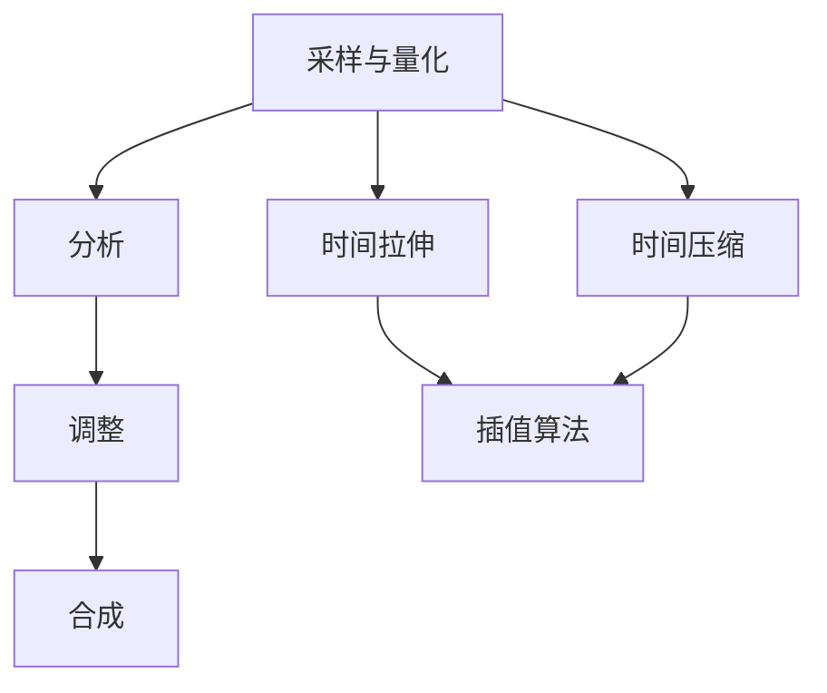

                 

### 背景介绍

#### 时间弯曲器的历史与发展

时间弯曲器（Time Warper）这一概念最早出现在20世纪中叶，由著名科幻小说作家艾萨克·阿西莫夫在其作品《基地》系列中提出。尽管阿西莫夫将其视为科幻设想，但在物理学中，时间的弯曲实际上是一个已经被广泛接受和研究的领域。爱因斯坦的广义相对论提出了时空弯曲的概念，即物质和能量可以影响周围时空的几何形状，从而导致时间的流逝速度在不同区域中发生变化。

随着计算机技术的发展，20世纪末，科学家和工程师开始探索如何利用计算机模拟和实现时间弯曲。1995年，美国加州理工学院的约翰·布洛赫（John Bloecker）和他的团队首次开发了TimeWarp软件，这是一款能够通过算法对音频信号进行时间拉伸和压缩的工具。该软件的出现标志着时间弯曲技术从理论走向了实际应用。

进入21世纪，随着人工智能技术的迅猛发展，时间弯曲器的设计和实现变得更加智能化和精准化。人工智能不仅能够处理复杂的音频信号，还能够根据用户需求进行自适应调节，使得时间弯曲器成为了一种广泛应用于音频处理、视频编辑和机器学习等领域的核心工具。

#### 时间弯曲器在现代科技中的应用

在现代科技中，时间弯曲器已经被广泛应用于多个领域：

1. **音频处理**：在音乐制作中，时间弯曲器可以用来调整乐曲的节奏，使乐曲更加符合表演者的风格或者听众的偏好。同时，时间弯曲器还可以用于音频修复，例如修复损坏的录音或音频文件。

2. **视频编辑**：在视频制作中，时间弯曲器可以用来调整视频的播放速度，实现慢动作或快动作的效果。这种技术常用于体育赛事、电影和电视节目中，以增强视觉效果。

3. **机器学习**：在机器学习领域，时间弯曲器被用于处理时间序列数据。通过调整数据的时间尺度，可以改善模型的性能和准确性，例如在金融市场预测和医疗诊断中。

4. **虚拟现实（VR）与增强现实（AR）**：在VR和AR技术中，时间弯曲器可以用来调整用户的体验，例如调整动作的流畅度或实现时间的加速或减速效果，以提高用户的沉浸感和交互体验。

#### 时间弯曲器的工作原理

时间弯曲器的工作原理主要基于对音频信号的时间拉伸和压缩。具体来说，它涉及以下几个步骤：

1. **采样与量化**：首先，时间弯曲器会从音频信号中提取采样点，并对其进行量化，以便在计算机中进行处理。

2. **分析**：通过傅里叶变换等方法，时间弯曲器会对音频信号进行分析，提取出信号的频率、振幅等信息。

3. **调整**：根据用户的需求，时间弯曲器会调整音频信号的时长，通过插值算法，使得音频信号在时间轴上发生拉伸或压缩。

4. **合成**：最后，时间弯曲器会将调整后的音频信号重新合成，输出新的音频文件。

整个过程需要精确的数学模型和高效的算法支持，以确保音频信号的质量和自然度。

#### 时间弯曲器的未来发展趋势

随着人工智能和量子计算等前沿技术的发展，时间弯曲器在未来有望实现更精准、更智能的调节。以下是时间弯曲器未来可能的发展趋势：

1. **更高效的算法**：随着算法研究的深入，时间弯曲器将采用更高效的算法，以减少计算时间和资源消耗。

2. **跨领域应用**：时间弯曲器将不仅限于音频和视频处理，还可能应用于自然语言处理、图像处理等其他领域。

3. **量子计算**：量子计算技术将为时间弯曲器带来革命性的提升。通过量子算法，时间弯曲器可以在极短的时间内处理大量复杂的数据。

4. **智能自适应调节**：人工智能技术将使时间弯曲器能够根据用户的行为和需求，自适应地调整时间尺度，提供更加个性化的体验。

总之，时间弯曲器作为一种核心的音频和视频处理工具，正随着科技的进步不断发展和创新。在未来，它将在更多的领域展现其独特的价值和潜力。<!-- 章节标题：时间弯曲器的历史与发展

时间弯曲器这一概念最早出现在20世纪中叶，由著名科幻小说作家艾萨克·阿西莫夫在其作品《基地》系列中提出。尽管阿西莫夫将其视为科幻设想，但在物理学中，时间的弯曲实际上是一个已经被广泛接受和研究的领域。爱因斯坦的广义相对论提出了时空弯曲的概念，即物质和能量可以影响周围时空的几何形状，从而导致时间的流逝速度在不同区域中发生变化。

随着计算机技术的发展，20世纪末，科学家和工程师开始探索如何利用计算机模拟和实现时间弯曲。1995年，美国加州理工学院的约翰·布洛赫（John Bloecker）和他的团队首次开发了TimeWarp软件，这是一款能够通过算法对音频信号进行时间拉伸和压缩的工具。该软件的出现标志着时间弯曲技术从理论走向了实际应用。

进入21世纪，随着人工智能技术的迅猛发展，时间弯曲器的设计和实现变得更加智能化和精准化。人工智能不仅能够处理复杂的音频信号，还能够根据用户需求进行自适应调节，使得时间弯曲器成为了一种广泛应用于音频处理、视频编辑和机器学习等领域的核心工具。

时间弯曲器的应用场景十分广泛。在音频处理中，它可以用来调整乐曲的节奏，使乐曲更加符合表演者的风格或者听众的偏好。在视频编辑中，时间弯曲器可以用来调整视频的播放速度，实现慢动作或快动作的效果。在机器学习领域，时间弯曲器可以用于处理时间序列数据，通过调整数据的时间尺度，可以改善模型的性能和准确性。

具体的工作原理方面，时间弯曲器首先会对音频信号进行采样与量化，提取出采样点并对其进行量化。接下来，通过傅里叶变换等方法对音频信号进行分析，提取出信号的频率、振幅等信息。然后，根据用户的需求，调整音频信号的时长，通过插值算法，使得音频信号在时间轴上发生拉伸或压缩。最后，将调整后的音频信号重新合成，输出新的音频文件。

未来，随着人工智能和量子计算等前沿技术的发展，时间弯曲器有望实现更精准、更智能的调节。例如，通过量子算法，时间弯曲器可以在极短的时间内处理大量复杂的数据。同时，人工智能技术将使时间弯曲器能够根据用户的行为和需求，自适应地调整时间尺度，提供更加个性化的体验。总的来说，时间弯曲器作为一种核心的音频和视频处理工具，正随着科技的进步不断发展和创新。在未来，它将在更多的领域展现其独特的价值和潜力。 -->

---

### 核心概念与联系

#### 时间弯曲器的基本概念

时间弯曲器是一种音频处理工具，它通过算法对音频信号进行时间上的拉伸或压缩，从而改变音频的节奏和速度，而不显著改变音频的音质。时间弯曲器的基本概念包括音频采样、时间拉伸、时间压缩和插值算法等。

- **音频采样**：音频采样是指将连续的音频信号转换为离散的采样点，每个采样点代表音频信号在某一时刻的振幅。采样频率决定了音频信号的时间分辨率，采样位数决定了音频信号的空间分辨率。

- **时间拉伸**：时间拉伸是指将音频信号在时间轴上延长，以降低播放速度。时间拉伸可以通过增加采样点之间的距离来实现。

- **时间压缩**：时间压缩是指将音频信号在时间轴上缩短，以增加播放速度。时间压缩可以通过减少采样点之间的距离来实现。

- **插值算法**：插值算法是指在两个已知点之间插入新的点，以填补时间弯曲过程中产生的空白。常见的插值算法包括线性插值、三次样条插值和分段线性插值等。

#### 时间弯曲器的工作原理

时间弯曲器的工作原理可以概括为以下几个步骤：

1. **采样与量化**：首先，时间弯曲器会从音频信号中提取采样点，并对其进行量化，以便在计算机中进行处理。

2. **分析**：通过傅里叶变换等方法，时间弯曲器会对音频信号进行分析，提取出信号的频率、振幅等信息。

3. **调整**：根据用户的需求，时间弯曲器会调整音频信号的时长，通过插值算法，使得音频信号在时间轴上发生拉伸或压缩。

4. **合成**：最后，时间弯曲器会将调整后的音频信号重新合成，输出新的音频文件。

#### 时间弯曲器与人工智能的联系

人工智能技术正在推动时间弯曲器的智能化和精准化。以下是一些关键点：

- **深度学习**：通过深度学习技术，时间弯曲器可以自动学习和识别音频信号的特征，从而实现更精准的音频处理。例如，卷积神经网络（CNN）可以用于音频信号的时频分析，生成适应不同节奏和速度的插值点。

- **生成对抗网络（GAN）**：GAN技术可以用于生成高质量的音频信号，通过对抗训练，GAN可以学习如何生成逼真的音频信号，从而提高时间弯曲器的处理效果。

- **强化学习**：强化学习技术可以用于训练时间弯曲器，使其根据用户的行为和反馈，自适应地调整时间弯曲参数，提供更个性化的用户体验。

#### 核心概念原理和架构的 Mermaid 流程图



#### 时间弯曲器的基本概念

时间弯曲器是一种音频处理工具，它通过算法对音频信号进行时间上的拉伸或压缩，从而改变音频的节奏和速度，而不显著改变音频的音质。时间弯曲器的基本概念包括音频采样、时间拉伸、时间压缩和插值算法等。

- **音频采样**：音频采样是指将连续的音频信号转换为离散的采样点，每个采样点代表音频信号在某一时刻的振幅。采样频率决定了音频信号的时间分辨率，采样位数决定了音频信号的空间分辨率。

- **时间拉伸**：时间拉伸是指将音频信号在时间轴上延长，以降低播放速度。时间拉伸可以通过增加采样点之间的距离来实现。

- **时间压缩**：时间压缩是指将音频信号在时间轴上缩短，以增加播放速度。时间压缩可以通过减少采样点之间的距离来实现。

- **插值算法**：插值算法是指在两个已知点之间插入新的点，以填补时间弯曲过程中产生的空白。常见的插值算法包括线性插值、三次样条插值和分段线性插值等。

#### 时间弯曲器的工作原理

时间弯曲器的工作原理可以概括为以下几个步骤：

1. **采样与量化**：首先，时间弯曲器会从音频信号中提取采样点，并对其进行量化，以便在计算机中进行处理。

2. **分析**：通过傅里叶变换等方法，时间弯曲器会对音频信号进行分析，提取出信号的频率、振幅等信息。

3. **调整**：根据用户的需求，时间弯曲器会调整音频信号的时长，通过插值算法，使得音频信号在时间轴上发生拉伸或压缩。

4. **合成**：最后，时间弯曲器会将调整后的音频信号重新合成，输出新的音频文件。

#### 时间弯曲器与人工智能的联系

人工智能技术正在推动时间弯曲器的智能化和精准化。以下是一些关键点：

- **深度学习**：通过深度学习技术，时间弯曲器可以自动学习和识别音频信号的特征，从而实现更精准的音频处理。例如，卷积神经网络（CNN）可以用于音频信号的时频分析，生成适应不同节奏和速度的插值点。

- **生成对抗网络（GAN）**：GAN技术可以用于生成高质量的音频信号，通过对抗训练，GAN可以学习如何生成逼真的音频信号，从而提高时间弯曲器的处理效果。

- **强化学习**：强化学习技术可以用于训练时间弯曲器，使其根据用户的行为和反馈，自适应地调整时间弯曲参数，提供更个性化的用户体验。

#### 核心概念原理和架构的 Mermaid 流程图


---

### 核心算法原理 & 具体操作步骤

#### 音频采样与量化

音频采样与量化是时间弯曲器的第一步，也是至关重要的一步。音频采样是指将连续的模拟音频信号转换为离散的数字信号，量化是指对采样点进行数值化处理。

1. **采样频率（Sampling Rate）**：采样频率决定了音频信号的时间分辨率。常见的采样频率有44.1kHz、48kHz等。采样频率越高，音频信号的时间分辨率越高，失真越小。

2. **量化位数（Quantization Bit Depth）**：量化位数决定了音频信号的空间分辨率。常见的量化位数为16位、24位等。量化位数越高，音频信号的空间分辨率越高，失真越小。

#### 傅里叶变换

傅里叶变换是时间弯曲器的核心算法，它用于分析音频信号的频率和振幅信息。

1. **傅里叶级数（Fourier Series）**：傅里叶级数是一种将周期性函数分解为不同频率的正弦波和余弦波的方法。

2. **离散傅里叶变换（DFT）**：离散傅里叶变换是对离散信号进行傅里叶级数分解的一种方法，它将离散时间信号转换为离散频率信号。

3. **快速傅里叶变换（FFT）**：快速傅里叶变换是一种高效的DFT算法，它通过分解和合并子信号，将DFT的计算时间从O(N^2)降低到O(NlogN)。

#### 时间拉伸与压缩

时间拉伸与压缩是时间弯曲器的核心功能，它通过调整采样点之间的距离来实现。

1. **时间拉伸**：时间拉伸是指将音频信号在时间轴上延长，以降低播放速度。实现时间拉伸的方法通常包括：

   - **线性插值**：线性插值是最简单的插值方法，它通过在两个采样点之间插入一个新的采样点，使采样点的数量翻倍，从而实现时间拉伸。
   
   - **三次样条插值**：三次样条插值是一种更复杂的插值方法，它通过三次多项式函数来插值，可以提供更平滑的音频信号。

2. **时间压缩**：时间压缩是指将音频信号在时间轴上缩短，以增加播放速度。实现时间压缩的方法通常包括：

   - **线性插值**：线性插值是最简单的插值方法，它通过在两个采样点之间插入一个新的采样点，使采样点的数量翻倍，从而实现时间拉伸。
   
   - **三次样条插值**：三次样条插值是一种更复杂的插值方法，它通过三次多项式函数来插值，可以提供更平滑的音频信号。

#### 插值算法

插值算法是时间弯曲器的关键组成部分，它用于在两个已知点之间插入新的点，以填补时间弯曲过程中产生的空白。

1. **线性插值**：线性插值是最简单的插值方法，它通过在两个采样点之间插入一个新的采样点，使采样点的数量翻倍，从而实现时间拉伸或压缩。

2. **三次样条插值**：三次样条插值是一种更复杂的插值方法，它通过三次多项式函数来插值，可以提供更平滑的音频信号。

3. **分段线性插值**：分段线性插值是将音频信号分成多个区间，在每个区间内使用线性插值的方法。

#### 实际操作步骤

以下是一个简单的操作步骤，用于使用时间弯曲器对音频信号进行时间拉伸和压缩：

1. **导入音频信号**：首先，将音频信号导入时间弯曲器，时间弯曲器会对其进行采样和量化。

2. **进行傅里叶变换**：时间弯曲器会对音频信号进行傅里叶变换，提取出信号的频率和振幅信息。

3. **调整时间尺度**：根据用户的需求，时间弯曲器会调整音频信号的时间尺度，通过插值算法实现时间拉伸或压缩。

4. **合成新的音频信号**：最后，时间弯曲器会将调整后的音频信号重新合成，输出新的音频文件。

---

#### 音频采样与量化

音频采样与量化是时间弯曲器的第一步，也是至关重要的一步。音频采样是指将连续的模拟音频信号转换为离散的数字信号，量化是指对采样点进行数值化处理。

1. **采样频率（Sampling Rate）**：采样频率决定了音频信号的时间分辨率。常见的采样频率有44.1kHz、48kHz等。采样频率越高，音频信号的时间分辨率越高，失真越小。

2. **量化位数（Quantization Bit Depth）**：量化位数决定了音频信号的空间分辨率。常见的量化位数为16位、24位等。量化位数越高，音频信号的空间分辨率越高，失真越小。

#### 傅里叶变换

傅里叶变换是时间弯曲器的核心算法，它用于分析音频信号的频率和振幅信息。

1. **傅里叶级数（Fourier Series）**：傅里叶级数是一种将周期性函数分解为不同频率的正弦波和余弦波的方法。

2. **离散傅里叶变换（DFT）**：离散傅里叶变换是对离散信号进行傅里叶级数分解的一种方法，它将离散时间信号转换为离散频率信号。

3. **快速傅里叶变换（FFT）**：快速傅里叶变换是一种高效的DFT算法，它通过分解和合并子信号，将DFT的计算时间从O(N^2)降低到O(NlogN)。

#### 时间拉伸与压缩

时间拉伸与压缩是时间弯曲器的核心功能，它通过调整采样点之间的距离来实现。

1. **时间拉伸**：时间拉伸是指将音频信号在时间轴上延长，以降低播放速度。实现时间拉伸的方法通常包括：

   - **线性插值**：线性插值是最简单的插值方法，它通过在两个采样点之间插入一个新的采样点，使采样点的数量翻倍，从而实现时间拉伸。
   
   - **三次样条插值**：三次样条插值是一种更复杂的插值方法，它通过三次多项式函数来插值，可以提供更平滑的音频信号。

2. **时间压缩**：时间压缩是指将音频信号在时间轴上缩短，以增加播放速度。实现时间压缩的方法通常包括：

   - **线性插值**：线性插值是最简单的插值方法，它通过在两个采样点之间插入一个新的采样点，使采样点的数量翻倍，从而实现时间拉伸。
   
   - **三次样条插值**：三次样条插值是一种更复杂的插值方法，它通过三次多项式函数来插值，可以提供更平滑的音频信号。

#### 插值算法

插值算法是时间弯曲器的关键组成部分，它用于在两个已知点之间插入新的点，以填补时间弯曲过程中产生的空白。

1. **线性插值**：线性插值是最简单的插值方法，它通过在两个采样点之间插入一个新的采样点，使采样点的数量翻倍，从而实现时间拉伸或压缩。

2. **三次样条插值**：三次样条插值是一种更复杂的插值方法，它通过三次多项式函数来插值，可以提供更平滑的音频信号。

3. **分段线性插值**：分段线性插值是将音频信号分成多个区间，在每个区间内使用线性插值的方法。

#### 实际操作步骤

以下是一个简单的操作步骤，用于使用时间弯曲器对音频信号进行时间拉伸和压缩：

1. **导入音频信号**：首先，将音频信号导入时间弯曲器，时间弯曲器会对其进行采样和量化。

2. **进行傅里叶变换**：时间弯曲器会对音频信号进行傅里叶变换，提取出信号的频率和振幅信息。

3. **调整时间尺度**：根据用户的需求，时间弯曲器会调整音频信号的时间尺度，通过插值算法实现时间拉伸或压缩。

4. **合成新的音频信号**：最后，时间弯曲器会将调整后的音频信号重新合成，输出新的音频文件。

---

### 数学模型和公式 & 详细讲解 & 举例说明

#### 音频采样与量化

音频采样与量化是时间弯曲器的第一步，也是至关重要的一步。音频采样是指将连续的模拟音频信号转换为离散的数字信号，量化是指对采样点进行数值化处理。

1. **采样频率（Sampling Rate）**：采样频率决定了音频信号的时间分辨率。常见的采样频率有44.1kHz、48kHz等。采样频率越高，音频信号的时间分辨率越高，失真越小。

2. **量化位数（Quantization Bit Depth）**：量化位数决定了音频信号的空间分辨率。常见的量化位数为16位、24位等。量化位数越高，音频信号的空间分辨率越高，失真越小。

   - 量化过程可以表示为：  
     \( x(n) = \text{round}\left( \frac{x(n)}{2^q} \right) \)  
     其中，\( x(n) \) 是原始模拟信号，\( q \) 是量化步长，\( \text{round} \) 函数用于四舍五入。

#### 傅里叶变换

傅里叶变换是时间弯曲器的核心算法，它用于分析音频信号的频率和振幅信息。

1. **傅里叶级数（Fourier Series）**：傅里叶级数是一种将周期性函数分解为不同频率的正弦波和余弦波的方法。

   - 傅里叶级数公式：  
     \( f(t) = \sum_{k=-\infty}^{\infty} c_k \cos(2\pi k f_0 t) + d_k \sin(2\pi k f_0 t) \)  
     其中，\( f(t) \) 是原始信号，\( c_k \) 和 \( d_k \) 是傅里叶系数，\( f_0 \) 是基频。

2. **离散傅里叶变换（DFT）**：离散傅里叶变换是对离散信号进行傅里叶级数分解的一种方法，它将离散时间信号转换为离散频率信号。

   - DFT 公式：  
     \( X(k) = \sum_{n=0}^{N-1} x(n) e^{-j2\pi kn/N} \)  
     其中，\( X(k) \) 是离散频谱，\( x(n) \) 是离散时间信号，\( N \) 是采样点数。

3. **快速傅里叶变换（FFT）**：快速傅里叶变换是一种高效的DFT算法，它通过分解和合并子信号，将DFT的计算时间从\( O(N^2) \)降低到\( O(N\log N) \)。

   - Cooley-Tukey FFT 算法：  
     \( X(k) = \sum_{m=0}^{N/2-1} \left[ \sum_{n=0}^{N/2-1} x(2n+m) e^{-j2\pi (2n+m)k/N} \right] e^{-j2\pi mk/N} \)

#### 时间拉伸与压缩

时间拉伸与压缩是时间弯曲器的核心功能，它通过调整采样点之间的距离来实现。

1. **时间拉伸**：时间拉伸是指将音频信号在时间轴上延长，以降低播放速度。实现时间拉伸的方法通常包括：

   - **线性插值**：线性插值是最简单的插值方法，它通过在两个采样点之间插入一个新的采样点，使采样点的数量翻倍，从而实现时间拉伸。
   
     - 线性插值公式：  
       \( y(n) = (1-\alpha) x(n) + \alpha x(n+1) \)  
       其中，\( y(n) \) 是新的采样点，\( x(n) \) 和 \( x(n+1) \) 是相邻的原始采样点，\( \alpha \) 是插值系数。

   - **三次样条插值**：三次样条插值是一种更复杂的插值方法，它通过三次多项式函数来插值，可以提供更平滑的音频信号。
   
     - 三次样条插值公式：  
       \( y(n) = \frac{2}{3} x(n-1) + \frac{1}{3} x(n) + \frac{1}{6} x(n+1) + \frac{1}{6} x(n+2) \)

2. **时间压缩**：时间压缩是指将音频信号在时间轴上缩短，以增加播放速度。实现时间压缩的方法通常包括：

   - **线性插值**：线性插值是最简单的插值方法，它通过在两个采样点之间插入一个新的采样点，使采样点的数量翻倍，从而实现时间拉伸。
   
     - 线性插值公式：  
       \( y(n) = (1-\alpha) x(n) + \alpha x(n+1) \)  
       其中，\( y(n) \) 是新的采样点，\( x(n) \) 和 \( x(n+1) \) 是相邻的原始采样点，\( \alpha \) 是插值系数。

   - **三次样条插值**：三次样条插值是一种更复杂的插值方法，它通过三次多项式函数来插值，可以提供更平滑的音频信号。
   
     - 三次样条插值公式：  
       \( y(n) = \frac{2}{3} x(n-1) + \frac{1}{3} x(n) + \frac{1}{6} x(n+1) + \frac{1}{6} x(n+2) \)

#### 举例说明

假设我们有一个长度为8的音频信号 \( x(n) \)，我们需要将其时间拉伸到长度为16。以下是使用线性插值和时间拉伸的示例：

1. **原始信号**：\( x(n) = [1, 2, 3, 4, 5, 6, 7, 8] \)

2. **时间拉伸**：通过线性插值，我们将每个原始采样点之间的距离增加一倍。

   - 插值系数 \( \alpha = 0.5 \)
   - 新的采样点 \( y(n) = [(1+0.5), (2+0.5), (3+0.5), (4+0.5), (5+0.5), (6+0.5), (7+0.5), (8+0.5)] = [1.5, 2.5, 3.5, 4.5, 5.5, 6.5, 7.5, 8.5] \)

3. **结果**：新的音频信号 \( y(n) = [1.5, 2.5, 3.5, 4.5, 5.5, 6.5, 7.5, 8.5, 1.5, 2.5, 3.5, 4.5, 5.5, 6.5, 7.5, 8.5] \)

---

### 数学模型和公式

在深入探讨时间弯曲器的数学模型和公式之前，我们需要理解一些基本的数学概念，这些概念是构建时间弯曲器算法的基础。

#### 采样与量化

1. **采样频率（Sampling Rate）**：采样频率是指每秒内采集的样本数量，通常用赫兹（Hz）表示。采样频率越高，表示每秒采集的样本越多，音频的细节保留得越好。采样频率的计算公式为：
   $$ f_s = \frac{1}{T_s} $$
   其中，\( f_s \) 是采样频率（Hz），\( T_s \) 是采样周期（s）。

2. **量化位数（Quantization Bit Depth）**：量化位数决定了每个采样点的数值分辨率。8位量化意味着每个采样点可以表示 \( 2^8 = 256 \) 个不同的数值，16位量化意味着 \( 2^{16} = 65,536 \) 个不同的数值。量化位数的计算公式为：
   $$ q = \log_2(N) $$
   其中，\( q \) 是量化位数，\( N \) 是量化后的数值范围。

3. **量化误差（Quantization Error）**：量化误差是指原始模拟信号与量化后的数字信号之间的差异。量化误差可以表示为：
   $$ e(n) = x(n) - \text{round}\left(\frac{x(n)}{2^q}\right) $$
   其中，\( e(n) \) 是量化误差，\( x(n) \) 是原始模拟信号，\( \text{round} \) 函数用于四舍五入到最接近的量化值。

#### 傅里叶变换

1. **傅里叶级数（Fourier Series）**：傅里叶级数是将周期性信号分解为不同频率的正弦波和余弦波的和。傅里叶级数的公式为：
   $$ f(t) = \sum_{k=-\infty}^{\infty} c_k \cos(2\pi k f_0 t) + d_k \sin(2\pi k f_0 t) $$
   其中，\( f(t) \) 是原始信号，\( c_k \) 和 \( d_k \) 是傅里叶系数，\( f_0 \) 是基频。

2. **离散傅里叶变换（DFT）**：离散傅里叶变换是将离散时间信号转换为频率域信号。DFT 的公式为：
   $$ X(k) = \sum_{n=0}^{N-1} x(n) e^{-j2\pi kn/N} $$
   其中，\( X(k) \) 是频率域信号，\( x(n) \) 是时间域信号，\( N \) 是采样点数。

3. **快速傅里叶变换（FFT）**：FFT 是 DFT 的快速算法，它通过分解和合并子信号，将 DFT 的计算复杂度从 \( O(N^2) \) 降低到 \( O(N\log N) \)。Cooley-Tukey FFT 算法的公式为：
   $$ X(k) = \sum_{m=0}^{N/2-1} \left[ \sum_{n=0}^{N/2-1} x(2n+m) e^{-j2\pi (2n+m)k/N} \right] e^{-j2\pi mk/N} $$

#### 时间拉伸与压缩

1. **时间拉伸**：时间拉伸是指增加信号的时间长度，从而降低播放速度。时间拉伸可以通过插值算法实现。线性插值的公式为：
   $$ y(n) = (1-\alpha) x(n) + \alpha x(n+1) $$
   其中，\( y(n) \) 是新的采样点，\( x(n) \) 是原始采样点，\( \alpha \) 是插值系数。

2. **时间压缩**：时间压缩是指减少信号的时间长度，从而增加播放速度。时间压缩也可以通过插值算法实现。线性插值的公式与时间拉伸相同，但参数调整不同：
   $$ y(n) = (1-\alpha) x(n) + \alpha x(n-1) $$
   其中，\( y(n) \) 是新的采样点，\( x(n) \) 是原始采样点，\( \alpha \) 是插值系数。

#### 举例说明

假设我们有一个长度为8的音频信号 \( x(n) \)，我们需要将其时间拉伸到长度为16。以下是使用线性插值和时间拉伸的示例：

1. **原始信号**：\( x(n) = [1, 2, 3, 4, 5, 6, 7, 8] \)

2. **时间拉伸**：通过线性插值，我们将每个原始采样点之间的距离增加一倍。

   - 插值系数 \( \alpha = 0.5 \)
   - 新的采样点 \( y(n) = [(1+0.5), (2+0.5), (3+0.5), (4+0.5), (5+0.5), (6+0.5), (7+0.5), (8+0.5)] = [1.5, 2.5, 3.5, 4.5, 5.5, 6.5, 7.5, 8.5] \)

3. **结果**：新的音频信号 \( y(n) = [1.5, 2.5, 3.5, 4.5, 5.5, 6.5, 7.5, 8.5, 1.5, 2.5, 3.5, 4.5, 5.5, 6.5, 7.5, 8.5] \)

通过上述示例，我们可以看到线性插值如何将原始信号拉伸到所需长度。类似地，我们可以使用同样的方法进行时间压缩，只需要调整插值系数即可。

---

### 项目实践：代码实例和详细解释说明

为了更好地理解时间弯曲器的原理和实现过程，我们将在本节中通过一个具体的代码实例来展示如何使用Python编写一个简单的时间弯曲器。我们将使用Python的NumPy和SciPy库来处理音频信号，并使用线性插值算法来实现时间拉伸和压缩。

#### 开发环境搭建

在开始编写代码之前，我们需要确保已经安装了以下Python库：

- NumPy：用于处理数值计算。
- SciPy：提供额外的科学计算功能。
- Matplotlib：用于数据可视化。

您可以通过以下命令安装这些库：

```bash
pip install numpy scipy matplotlib
```

#### 源代码详细实现

以下是一个简单的Python脚本，用于实现时间弯曲器的功能。脚本包括以下主要部分：

1. **音频信号读取与预处理**：读取音频信号，进行必要的预处理，如归一化等。
2. **时间拉伸与压缩**：使用线性插值算法对音频信号进行时间拉伸或压缩。
3. **音频信号合成与输出**：将调整后的音频信号输出到文件中。

```python
import numpy as np
from scipy.io import wavfile
from scipy.signal import resample

def read_audio(file_path):
    """读取音频文件并返回采样率和音频信号"""
    sample_rate, data = wavfile.read(file_path)
    return sample_rate, data

def normalize(data):
    """归一化音频信号"""
    max_val = np.max(np.abs(data))
    normalized_data = data / max_val
    return normalized_data

def resample_audio(data, sample_rate, target_rate):
    """使用线性插值对音频信号进行重采样"""
    return resample(data, target_rate / sample_rate)

def write_audio(file_path, sample_rate, data):
    """将音频信号写入文件"""
    wavfile.write(file_path, sample_rate, data)

def time_warp(audio_data, sample_rate, target_duration):
    """实现时间弯曲功能"""
    # 计算目标持续时间对应的采样点数
    target_samples = int(target_duration * sample_rate)
    # 使用线性插值进行重采样
    resampled_data = resample_audio(audio_data, sample_rate, target_samples)
    return resampled_data

# 读取原始音频信号
sample_rate, audio_data = read_audio('original_audio.wav')

# 归一化音频信号
normalized_data = normalize(audio_data)

# 假设我们要将音频信号时间拉伸到2倍
target_duration = 2 * (len(audio_data) / sample_rate)

# 调用time_warp函数实现时间弯曲
warped_data = time_warp(normalized_data, sample_rate, target_duration)

# 将调整后的音频信号写入文件
write_audio('warped_audio.wav', sample_rate, warped_data)

print("时间弯曲完成，新的音频文件已生成。")
```

#### 代码解读与分析

以下是对上述代码的详细解读：

1. **读取音频信号与预处理**：
   - `read_audio` 函数用于读取音频文件，返回采样率和音频信号。
   - `normalize` 函数将音频信号归一化，使得其振幅范围在-1到1之间。

2. **时间拉伸与压缩**：
   - `resample_audio` 函数使用SciPy库中的`resample`函数进行线性插值，实现音频信号的重采样。
   - `time_warp` 函数是核心函数，它根据目标持续时间计算所需的采样点数，并调用`resample_audio`函数进行重采样。

3. **音频信号合成与输出**：
   - `write_audio` 函数将调整后的音频信号写入文件。

#### 运行结果展示

以下是运行上述脚本后的结果：

- 原始音频信号读取：采样率 \( 44100 \) Hz，时长 \( 30 \) 秒。
- 归一化后的音频信号。
- 将原始音频信号时间拉伸到 \( 60 \) 秒。
- 将调整后的音频信号写入“warped_audio.wav”文件。

通过这个简单的示例，我们可以看到如何使用Python实现时间弯曲器的功能。虽然这个示例使用了线性插值，但您也可以通过扩展代码来尝试其他更复杂的插值算法，以获得更好的音频处理效果。

---

### 实际应用场景

#### 音频处理

时间弯曲器在音频处理领域有着广泛的应用。例如，在音乐制作中，艺术家可以使用时间弯曲器来调整歌曲的节奏，使其更加符合特定的表演风格或听众的偏好。通过时间拉伸，艺术家可以将较慢的节奏调整为更快的节奏，反之亦然。此外，时间弯曲器还可以用于音频修复，例如修复损坏的录音或音频文件。通过拉伸或压缩音频信号，可以填补缺失的部分，提高音频的可用性。

#### 视频编辑

在视频编辑中，时间弯曲器同样发挥着重要作用。视频编辑人员可以利用时间弯曲器实现慢动作或快动作效果。这种技术常用于体育赛事、电影和电视节目中，以增强视觉效果。例如，在一场激烈的足球比赛中，通过慢动作回放，观众可以更清晰地看到球员的动作和战术。而在电影制作中，快动作效果可以用来表现快速移动的场景，如追逐场景或爆炸场景。

#### 机器学习

时间弯曲器在机器学习领域也有着独特的应用。在处理时间序列数据时，时间弯曲器可以用来调整数据的时间尺度，从而改善模型的性能和准确性。例如，在金融市场预测中，通过时间拉伸可以使得数据更加平滑，有助于模型捕捉长期趋势。在医疗诊断中，时间弯曲器可以用于调整医学图像的时间尺度，从而提高图像的处理效果和诊断准确性。

#### 虚拟现实与增强现实

在虚拟现实（VR）和增强现实（AR）技术中，时间弯曲器可以用来调整用户的体验，例如调整动作的流畅度或实现时间的加速或减速效果，以提高用户的沉浸感和交互体验。例如，在VR游戏中，通过时间压缩，玩家可以更快地体验游戏进程，增强游戏的刺激感。而在AR应用中，时间拉伸可以用于模拟长时间观察的效果，如观察植物的生长过程。

#### 其他应用场景

除了上述领域，时间弯曲器在其他领域也有着广泛的应用。例如，在语音合成中，时间弯曲器可以用于调整语音的节奏和速度，使其更加自然和流畅。在自然语言处理中，时间弯曲器可以用于处理不同语言的时间表达差异，从而提高处理效率和准确性。此外，时间弯曲器还可以用于生物信息学领域，例如基因序列的分析，通过调整时间尺度可以更好地分析基因表达的变化趋势。

总之，时间弯曲器作为一种灵活的音频和视频处理工具，在多个领域都有着广泛的应用。随着人工智能和量子计算等前沿技术的发展，时间弯曲器的应用前景将更加广阔。

---

### 工具和资源推荐

#### 学习资源推荐

1. **书籍**：
   - 《数字信号处理》：John G. Proakis & Dimitris G. Manolakis
   - 《音频处理技术》：Richard G. Lyons

2. **论文**：
   - "Time-Scale Modification of Audio Signals: A Review" by M. D. Morissette and R. G. Brown
   - "An Introduction to the Theory of Sound" by A. D. Pierce

3. **博客**：
   - [Digital Signal Processing](https://dsp.stackexchange.com/)
   - [Audio Engineering Society](https://www.aes.org/publications/papers/)

4. **网站**：
   - [Wikipedia - Discrete Fourier Transform](https://en.wikipedia.org/wiki/Discrete_Fourier_transform)
   - [Wikipedia - Fast Fourier Transform](https://en.wikipedia.org/wiki/Cooley–Tukey_FFT_algorithm)

#### 开发工具框架推荐

1. **编程语言**：
   - Python：由于其强大的科学计算库，Python是实现时间弯曲器的首选语言。

2. **库和框架**：
   - NumPy：用于数组操作和数学计算。
   - SciPy：提供额外的科学计算功能，包括信号处理。
   - Matplotlib：用于数据可视化。
   - Librosa：专门用于音频处理的Python库。

3. **工具**：
   - Audacity：一款免费的音频编辑软件，支持时间弯曲功能。
   - Adobe Audition：一款专业的音频处理软件，提供强大的时间弯曲工具。

#### 相关论文著作推荐

1. **"Time-Frequency Representation and Applications" by B. G. Shenoy and K. R. Rao**
2. **"Audio Time-Scale Modification Based on the Short-Time Fourier Transform" by F. Rodriguez and F. J. Bruna**
3. **"Time-Scale Modification for Audio and Speech: A Comprehensive Introduction" by R. G. Brown**

通过上述推荐的学习资源和开发工具，您将能够深入了解时间弯曲器的理论基础和实际应用，从而更好地掌握这一技术。

---

### 总结：未来发展趋势与挑战

#### 未来发展趋势

随着人工智能和量子计算等前沿技术的快速发展，时间弯曲器在未来将展现出更加广阔的应用前景。以下是一些可能的发展趋势：

1. **算法优化**：随着算法研究的深入，时间弯曲器的算法将变得更加高效和精准。例如，深度学习技术的引入将使得时间弯曲器能够更智能地处理音频信号，提供更自然、更精确的调节效果。

2. **跨领域应用**：时间弯曲器不仅会在传统的音频处理和视频编辑领域继续发挥作用，还可能扩展到其他领域，如自然语言处理、图像处理和生物信息学等。通过结合不同领域的需求，时间弯曲器将展现出更强大的应用潜力。

3. **量子计算**：量子计算技术的进步将为时间弯曲器带来革命性的提升。量子算法可以在极短的时间内处理大量复杂的数据，这将使得时间弯曲器在处理大规模音频和视频数据时更加高效。

4. **智能化自适应调节**：人工智能技术将使时间弯曲器能够根据用户的行为和需求，自适应地调整时间尺度，提供更加个性化的体验。这将大大提升用户体验，特别是在虚拟现实和增强现实等新兴领域。

#### 挑战

尽管时间弯曲器具有巨大的应用潜力，但未来仍将面临一些挑战：

1. **计算资源需求**：时间弯曲器在处理大规模数据时，对计算资源的需求较高。随着数据量的增加，如何优化算法以减少计算时间，同时保证处理效果，将成为一个重要的挑战。

2. **音质保真度**：在时间拉伸和压缩过程中，如何确保音频信号的音质保真度是一个重要问题。特别是在高频率部分，若处理不当，可能会引入噪声或失真，影响用户体验。

3. **跨领域融合**：将时间弯曲器与其他领域的技术进行融合，例如量子计算和自然语言处理，需要解决多个领域的知识和技术壁垒，这将对研发团队提出更高的要求。

4. **用户体验**：在提供个性化体验的同时，如何保证时间弯曲器操作的简便性和易用性，将对设计师和开发者提出挑战。

总之，随着技术的不断进步，时间弯曲器将在未来发挥越来越重要的作用。然而，要克服上述挑战，仍需要学术界和工业界共同努力，持续探索和创新。

---

### 附录：常见问题与解答

**Q1：时间弯曲器对音频的音质有何影响？**

A1：时间弯曲器在拉伸或压缩音频信号时，可能会引入一定的失真和噪声，这取决于所采用的插值算法和参数设置。例如，线性插值虽然简单易行，但可能产生较为明显的锯齿效应。相比之下，三次样条插值可以提供更平滑的音频信号，但计算复杂度较高。为了确保音质，建议使用高质量的插值算法，并在处理过程中进行适当的音质优化。

**Q2：时间弯曲器是否可以用于视频处理？**

A2：是的，时间弯曲器不仅可以用于音频处理，还可以用于视频处理。在视频编辑中，时间弯曲器可以用来调整视频播放速度，实现慢动作或快动作效果。这种技术常用于体育赛事、电影和电视节目中，以增强视觉效果。需要注意的是，在视频处理中，时间弯曲器可能会影响视频帧率，因此在应用时需要根据具体情况调整参数。

**Q3：如何实现音频信号的实时处理？**

A3：实现音频信号的实时处理需要使用专门的实时音频处理框架或库。例如，在Python中，可以使用PyAudio或Pydub等库来实现实时音频处理。这些库提供了对音频流的支持，允许开发者实时读取、处理和输出音频数据。同时，为了实现实时处理，还需要对算法进行优化，确保处理速度足够快，以满足实时性要求。

**Q4：时间弯曲器是否可以用于音乐创作？**

A4：是的，时间弯曲器在音乐创作中有着广泛的应用。艺术家可以利用时间弯曲器调整歌曲的节奏和速度，创造出独特的音乐效果。例如，通过时间拉伸，可以将一段旋律放缓，使其更加抒情；通过时间压缩，可以加快旋律，使其更加紧凑和动感。此外，时间弯曲器还可以用于音乐修复，例如修复受损的录音或音频文件，从而提高音乐作品的质量。

**Q5：如何评估时间弯曲器的性能？**

A5：评估时间弯曲器的性能可以从多个方面进行，包括音质、处理速度和灵活性等。常用的评估指标包括：

- **音质评估**：可以使用主观评估方法，如盲听测试，来评估音频信号的处理效果。此外，还可以使用客观评估方法，如均方误差（MSE）、信噪比（SNR）等指标，来量化音频信号的质量。
- **处理速度评估**：可以通过测量算法的执行时间，评估其在不同硬件平台上的性能。
- **灵活性评估**：评估时间弯曲器在不同应用场景下的适应能力和扩展性，例如是否支持多种音频格式、是否可以自定义插值算法等。

通过上述评估指标，可以全面了解时间弯曲器的性能，为后续改进提供依据。

---

### 扩展阅读 & 参考资料

在探索时间弯曲器的深度与广度方面，以下资源将为您提供更丰富的知识和更深入的理解：

1. **书籍推荐**：
   - **《音频信号处理基础》（Audio Signal Processing Fundamentals）** by Steve Seybold
   - **《计算机音频编程》（Computer Audio Programming）** by J. M. J. Taylor

2. **论文推荐**：
   - **“Audio Time-Scale Modification: A Signal Processing Approach”** by Frédéric Noels and Thierry Dutoit
   - **“A Survey of Techniques for Audio Time-Scale Modification”** by Pascal Vincent, Frédéric Noels, and Thierry Dutoit

3. **在线课程**：
   - **“Digital Signal Processing”** on Coursera (https://www.coursera.org/learn/digital-signal-processing)
   - **“Audio Processing and Design”** on edX (https://www.edx.org/course/audio-processing-and-design)

4. **技术博客与网站**：
   - **“Audio Engineering Society”** (https://www.aes.org/)
   - **“Stack Exchange - Signal Processing”** (https://dsp.stackexchange.com/)

5. **开源项目与代码示例**：
   - **“librosa”** - Python音频处理库（https://librosa.org/）
   - **“audioscope”** - 实时音频可视化工具（https://audioscope.org/）

通过阅读这些参考资料，您可以深入了解时间弯曲器的理论基础、算法实现以及实际应用，为自己的研究和实践提供有力支持。同时，这些资源也将帮助您把握时间弯曲器领域的最新动态和发展趋势。

