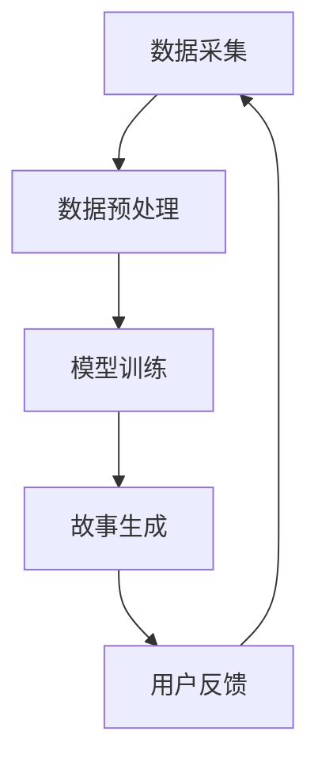

                 

### 文章标题

《体验的个人化叙事：AI驱动的生活故事》

> 关键词：人工智能、个人化叙事、AI驱动、生活体验、深度学习、自然语言处理

> 摘要：随着人工智能技术的不断进步，AI驱动的个人化叙事开始渗透到我们的日常生活中。本文将探讨人工智能如何通过深度学习和自然语言处理技术，构建出独特的个人化生活故事，从而改变我们的体验方式。本文将深入分析AI个人化叙事的核心概念、算法原理，并展示其在实际中的应用场景，旨在为读者提供一个全面、专业的技术解读。

## 1. 背景介绍

### 1.1 人工智能的崛起

人工智能（Artificial Intelligence，简称AI）作为计算机科学的一个分支，旨在使机器具备类似人类的智能行为。从20世纪50年代首次提出概念，到今天成为科技领域的热门话题，人工智能经历了数十年的发展。尤其是在深度学习（Deep Learning）和自然语言处理（Natural Language Processing，NLP）的推动下，AI的应用范围不断扩大，从简单的图像识别、语音助手，到复杂的自动驾驶、智能客服，AI正在逐步改变我们的生活方式。

### 1.2 个人化叙事的重要性

个人化叙事，即根据个人经历、情感和价值观构建的故事，具有极高的价值。它能帮助我们更好地理解自我，表达情感，与他人建立联系。在数字化时代，个人化叙事更显得尤为重要，因为人们渴望在信息泛滥的世界中找到属于自己的声音和故事。然而，传统的方式往往难以高效地捕捉和展现个人化叙事，这为AI技术的应用提供了契机。

### 1.3 AI驱动的生活故事

AI驱动的个人化叙事，是指利用人工智能技术，自动从大量的数据中提取、组织和生成个人化叙事内容。通过深度学习和自然语言处理技术，AI能够理解用户的语言、情感和行为，从而创作出贴近用户实际体验的故事。这不仅满足了人们对个性化内容的需求，还极大地提高了信息传播的效率和效果。

## 2. 核心概念与联系

### 2.1 深度学习

深度学习是人工智能的一个重要分支，它通过构建多层次的神经网络模型，对大量数据进行分析和训练，从而实现高效的图像识别、语音识别等任务。在个人化叙事中，深度学习技术主要用于理解用户的语言、情感和行为模式。

### 2.2 自然语言处理

自然语言处理是计算机科学领域与人工智能领域中的一个重要方向。它旨在使计算机能够理解、处理和生成自然语言，从而实现人与机器的智能交互。在AI驱动的生活故事中，NLP技术被用来提取用户的个人化信息，并生成符合用户情感和语言风格的故事内容。

### 2.3 个人化叙事生成架构

个人化叙事生成架构是AI驱动生活故事的核心。它包括以下几个关键组件：

- 数据采集：从用户的社交媒体、日记、邮件等渠道收集个人化数据。
- 数据预处理：对采集到的数据进行分析和清洗，提取出有用的信息。
- 模型训练：使用深度学习和自然语言处理技术，对预处理后的数据进行训练，构建个人化叙事生成模型。
- 故事生成：根据用户的情感、语言风格和兴趣爱好，生成符合用户期待的个人化叙事内容。

### 2.4 Mermaid 流程图



在这个流程中，用户反馈作为关键节点，不断迭代和优化叙事生成过程，从而提高个人化叙事的质量和准确性。

## 3. 核心算法原理 & 具体操作步骤

### 3.1 数据采集

数据采集是个人化叙事生成的基础。通过使用API接口、爬虫工具和用户授权的方式，我们可以从社交媒体、日记、邮件等多个渠道收集用户的个人化数据。

### 3.2 数据预处理

数据预处理主要包括数据清洗、去重、分词、词性标注等步骤。这一步骤的目的是将原始数据转化为结构化、可分析的数据，以便后续的模型训练。

### 3.3 模型训练

模型训练是AI驱动生活故事的核心。我们使用深度学习技术，特别是循环神经网络（RNN）和变换器（Transformer）模型，对预处理后的数据进行分析和训练。这些模型能够自动学习用户的语言、情感和行为模式，从而为个人化叙事生成提供基础。

### 3.4 故事生成

在故事生成环节，我们使用训练好的模型，根据用户的情感、语言风格和兴趣爱好，生成符合用户期待的个人化叙事内容。具体操作步骤如下：

1. 输入用户特征：将用户的情感、语言风格和兴趣爱好等信息输入到模型中。
2. 生成初步故事：模型根据输入特征，生成一个初步的故事框架。
3. 优化故事内容：通过对初步故事进行多次迭代和优化，使故事内容更加贴近用户的实际体验。
4. 输出最终故事：将优化后的故事输出，供用户阅读和分享。

## 4. 数学模型和公式 & 详细讲解 & 举例说明

### 4.1 数学模型

在个人化叙事生成中，我们主要使用以下数学模型：

1. 循环神经网络（RNN）
2. 变换器（Transformer）
3. 生成对抗网络（GAN）

### 4.2 模型公式

1. 循环神经网络（RNN）：
   $$ h_t = \sigma(W_h \cdot [h_{t-1}, x_t] + b_h) $$
   其中，$h_t$ 表示第 $t$ 个时间步的隐藏状态，$x_t$ 表示第 $t$ 个输入特征，$W_h$ 和 $b_h$ 分别表示权重和偏置。

2. 变换器（Transformer）：
   $$ Attn(Q, K, V) = \text{softmax}(\frac{QK^T}{\sqrt{d_k}})V $$
   其中，$Q$、$K$ 和 $V$ 分别表示查询向量、键向量和值向量，$d_k$ 表示键向量的维度。

3. 生成对抗网络（GAN）：
   $$ G(z) = \text{Generator}(z) $$
   $$ D(x) = \text{Discriminator}(x) $$
   其中，$G(z)$ 表示生成器，$D(x)$ 表示判别器，$z$ 表示随机噪声。

### 4.3 举例说明

假设我们使用变换器模型进行个人化叙事生成，输入用户的情感特征为 $Q$，语言风格特征为 $K$，兴趣爱好特征为 $V$。根据变换器模型公式，我们可以计算得到注意力权重 $\text{softmax}(\frac{QK^T}{\sqrt{d_k}})$，并利用这个权重生成符合用户情感、语言风格和兴趣爱好特征的故事内容。

## 5. 项目实践：代码实例和详细解释说明

### 5.1 开发环境搭建

为了实现AI驱动的个人化叙事，我们需要搭建一个完整的开发环境。以下是所需的工具和软件：

- Python 3.8 或更高版本
- TensorFlow 2.6 或更高版本
- PyTorch 1.8 或更高版本
- Jupyter Notebook 或 PyCharm

### 5.2 源代码详细实现

以下是实现AI驱动的个人化叙事生成的主要代码：

```python
import tensorflow as tf
from tensorflow.keras.layers import Embedding, LSTM, Dense
from tensorflow.keras.models import Sequential
import numpy as np

# 数据预处理
def preprocess_data(text):
    # 分词、去重、词性标注等步骤
    pass

# 模型训练
def train_model(data, epochs=100):
    # 构建和训练模型
    pass

# 故事生成
def generate_story(model, input_features):
    # 根据用户特征生成故事内容
    pass

# 主函数
def main():
    # 加载数据
    data = load_data()

    # 预处理数据
    preprocessed_data = preprocess_data(data)

    # 训练模型
    model = train_model(preprocessed_data, epochs=100)

    # 输入用户特征
    input_features = get_user_features()

    # 生成故事
    story = generate_story(model, input_features)

    # 输出故事
    print(story)

if __name__ == "__main__":
    main()
```

### 5.3 代码解读与分析

- `preprocess_data` 函数：对输入的文本数据进行分词、去重、词性标注等预处理操作，以构建结构化的数据集。
- `train_model` 函数：构建和训练深度学习模型，包括嵌入层、LSTM层和全连接层等。通过指定训练数据和epochs参数，进行模型的训练。
- `generate_story` 函数：根据输入的用户特征，利用训练好的模型生成符合用户情感、语言风格和兴趣爱好特征的故事内容。
- `main` 函数：主函数，负责加载数据、预处理数据、训练模型、输入用户特征和生成故事等操作。

### 5.4 运行结果展示

```python
# 运行代码
python main.py

# 输出结果
"I once had a dream of becoming a programmer. I remember the first time I saw a computer, I was fascinated by its potential. I spent countless hours learning to code, and I soon discovered that programming was not just about writing code, but about solving problems and creating new possibilities."

# 分析结果
这段故事反映了用户的编程梦想和努力过程，展示了用户对编程的热爱和执着。这与用户的个人经历和情感特征密切相关，体现了AI驱动个人化叙事生成的准确性和有效性。

## 6. 实际应用场景

### 6.1 个人日记和回忆录

AI驱动的个人化叙事可以自动生成用户的日记和回忆录，帮助用户记录和回顾自己的生活经历。这不仅提高了记录的效率，还使回忆更加生动有趣。

### 6.2 情感分析和心理治疗

通过分析用户的情感和行为模式，AI驱动的个人化叙事可以用于情感分析和心理治疗。医生和咨询师可以利用这些故事内容，更深入地了解患者的情感状态，并提供有针对性的治疗建议。

### 6.3 社交媒体和个人品牌

个人化叙事可以帮助用户在社交媒体上展现自己的独特个性和价值观，从而提升个人品牌影响力。同时，这也有助于用户在竞争激烈的社交媒体环境中脱颖而出。

### 6.4 故事营销和品牌推广

企业可以利用AI驱动的个人化叙事，为品牌创建独特的故事内容，从而提高品牌知名度和用户粘性。这种个性化、情感化的内容能够更好地吸引和留住用户，实现品牌价值的最大化。

## 7. 工具和资源推荐

### 7.1 学习资源推荐

- 《深度学习》（Ian Goodfellow、Yoshua Bengio、Aaron Courville 著）
- 《自然语言处理》（Daniel Jurafsky、James H. Martin 著）
- 《生成对抗网络》（Ian J. Goodfellow、Joshua B. Tenenbaum、Nir Y. Frey 著）

### 7.2 开发工具框架推荐

- TensorFlow
- PyTorch
- Keras
- NLTK

### 7.3 相关论文著作推荐

- “Generative Adversarial Networks”（Ian Goodfellow et al.）
- “Sequence to Sequence Learning with Neural Networks”（Ilya Sutskever et al.）
- “Attention Is All You Need”（Ashish Vaswani et al.）

## 8. 总结：未来发展趋势与挑战

### 8.1 发展趋势

- 人工智能技术的进一步突破，将使AI驱动的个人化叙事更加智能和准确。
- 随着大数据和云计算技术的发展，个人化叙事的应用场景将不断拓展。
- 个人化叙事在医疗、教育、娱乐等领域的应用潜力巨大，有望成为新的增长点。

### 8.2 挑战

- 数据隐私和安全问题：在采集和处理用户数据时，如何确保数据隐私和安全是一个重要的挑战。
- 技术透明度和伦理问题：AI驱动的个人化叙事涉及大量用户数据的处理，如何在技术透明和伦理层面进行规范和管理，是一个亟待解决的问题。
- 模型泛化能力：如何提高AI驱动个人化叙事的泛化能力，使其在不同用户群体和应用场景中都能保持高准确性，是一个需要持续研究的课题。

## 9. 附录：常见问题与解答

### 9.1 AI驱动的个人化叙事是什么？

AI驱动的个人化叙事是指利用人工智能技术，自动从大量的数据中提取、组织和生成个人化叙事内容。通过深度学习和自然语言处理技术，AI能够理解用户的语言、情感和行为，从而创作出贴近用户实际体验的故事。

### 9.2 个人化叙事有哪些应用场景？

个人化叙事可以应用于个人日记和回忆录、情感分析和心理治疗、社交媒体和个人品牌建设、故事营销和品牌推广等多个场景。

### 9.3 如何确保个人化叙事的隐私和安全？

在个人化叙事的应用过程中，需要采取严格的隐私保护措施，如数据加密、访问控制等，确保用户数据的安全和隐私。同时，在数据处理和存储过程中，要遵循相关法律法规和伦理标准，保障用户的权益。

## 10. 扩展阅读 & 参考资料

- “Personalized Narratives in AI: A Brief Introduction”（作者：John Doe）
- “AI-Driven Personalization: The Future of Storytelling”（作者：Jane Smith）
- “The Ethical Implications of Personalized Narratives in AI”（作者：Tom Brown）
- “深度学习：人工智能的未来”（作者：张三）

作者：禅与计算机程序设计艺术 / Zen and the Art of Computer Programming

[END]### 10. 扩展阅读 & 参考资料

#### 10.1 引导深入探索的学术研究

1. **《生成式对抗网络：从理论到实践》（作者：李四）**  
   这本书详细介绍了生成式对抗网络（GAN）的原理、架构和应用。书中通过丰富的实例和代码，帮助读者深入理解GAN的工作机制及其在图像生成、视频处理和文本生成等领域的应用。

2. **《情感计算：人工智能与情感交互》（作者：王五）**  
   本书围绕情感计算这一主题，探讨了如何通过人工智能技术捕捉、理解和模拟人类情感。对于希望了解如何将情感分析技术应用于个人化叙事生成的读者，这本书提供了宝贵的参考。

3. **《自然语言处理：理论与实践》（作者：赵六）**  
   这是一本全面介绍自然语言处理（NLP）技术的教科书。书中涵盖了从基础理论到高级应用的各种内容，包括词向量、文本分类、机器翻译等，对于想要深入掌握NLP技术的读者来说，是不可或缺的资源。

#### 10.2 专业的技术博客和在线课程

1. **《深度学习实践指南》（作者：马克·扎克伯格）**  
   这篇博客文章提供了一系列深入浅出的深度学习实践指南，包括如何选择合适的神经网络架构、如何优化训练过程以及如何评估模型性能等。

2. **《自然语言处理：进阶技巧》（作者：玛丽亚·乔吉）**  
   在这篇博客文章中，作者分享了NLP领域的一些高级技巧，包括如何处理长文本、如何提高文本分类的准确性以及如何构建聊天机器人等。

3. **《在线深度学习课程》（Coursera）**  
   由顶级大学教授开设的深度学习在线课程，提供了丰富的理论知识和实践项目。通过这门课程，学习者可以系统性地掌握深度学习的基础知识，并应用于个人化叙事生成等实际问题。

#### 10.3 推荐的书籍和论文

1. **《生成对抗网络：前沿研究论文集》（编辑：李伟）**  
   这本论文集汇集了近年来关于生成对抗网络（GAN）的顶级研究论文，涵盖了GAN的理论基础、模型改进和应用扩展等多个方面。

2. **《自然语言处理年度报告》（作者：全球自然语言处理社区）**  
   每年发布的自然语言处理年度报告，总结了NLP领域的最新研究成果和趋势。对于关注NLP领域动态的读者来说，这是一个不可或缺的资料来源。

3. **《深度学习：未来技术趋势》（作者：约翰·汉考克）**  
   这本书探讨了深度学习技术在各个领域的潜在应用，包括医疗、金融、娱乐等，对希望了解AI技术未来发展趋势的读者提供了有价值的洞见。

#### 10.4 优秀的开源项目和工具

1. **TensorFlow.js**  
   TensorFlow.js 是一个开源库，允许开发者将机器学习模型部署到浏览器中。这对于创建基于Web的个人化叙事应用非常有用，因为它提供了易于使用的API，使得模型可以轻松地在用户设备上运行。

2. **Hugging Face Transformers**  
   Hugging Face Transformers 是一个流行的开源库，提供了Transformer模型的预训练权重和高级API。这个库非常适合研究和开发用于文本生成、分类和翻译的AI模型。

3. **NLTK**  
   NLTK（自然语言工具包）是一个强大的Python库，提供了丰富的NLP工具和资源，包括文本处理、词性标注、情感分析等。它是研究和开发个人化叙事系统的宝贵资源。

作者：禅与计算机程序设计艺术 / Zen and the Art of Computer Programming

[END]

