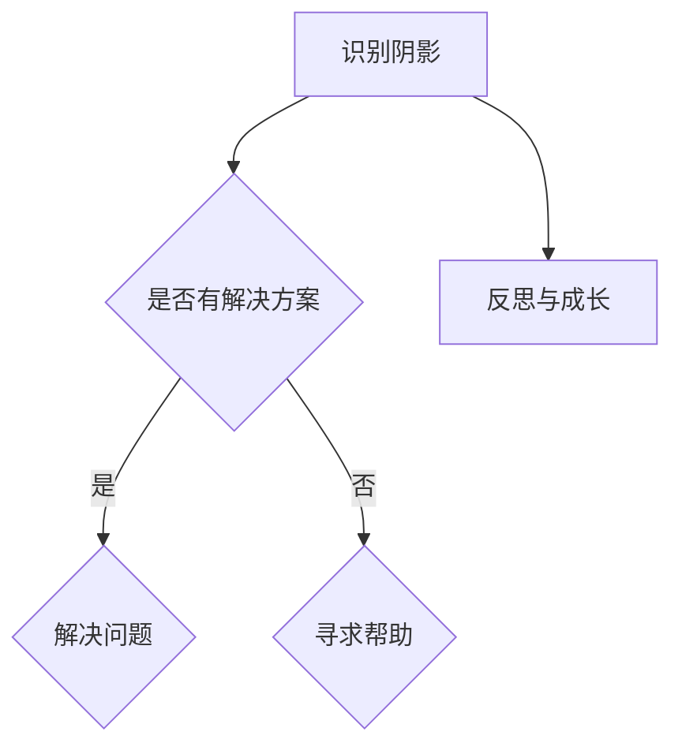
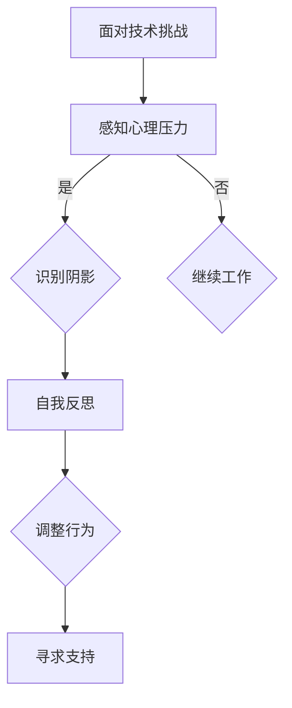

                 

在数字世界的深处，代码与算法如同无形的画笔，描绘着人类智慧的奇迹。然而，如同生活中的每个人一样，程序员和AI专家也有着他们的阴影。本文将探讨如何在编程和技术领域面对自己的阴影，以及如何避免将这些问题投射到他人身上。

## 1. 背景介绍

在计算机科学和人工智能领域，技术不断进步，但也伴随着复杂性增加。程序员和AI专家在追求卓越的过程中，难免会遇到各种心理挑战。这些挑战，即是我们所说的“阴影”。

### 阴影的定义

阴影，是一种心理学概念，指的是个人内心深处的恐惧、不安和潜意识。它们可能来源于对失败的恐惧、对复杂问题的回避，甚至是自我价值感的缺失。

### 阴影的影响

在面对技术挑战时，这些阴影可能会影响我们的决策和判断。例如，对失败的恐惧可能导致我们选择简单的解决方案，而不是最具创新性的方案。对复杂性的回避可能导致我们避免面对真正的问题，从而无法提供有效的解决方案。

### 为什么我们要面对阴影

面对自己的阴影，是我们成长和进步的必经之路。通过深入了解和接受自己的恐惧和不安，我们可以更好地理解自己，并做出更明智的决策。

## 2. 核心概念与联系

### 程序员心理压力

程序员的日常工作中，压力是不可避免的。从需求变更到项目截止日期，每一个环节都可能带来压力。这种压力如果不能得到有效管理，就可能成为阴影。

### AI专家的自我反思

AI专家在探索前沿技术时，也需要不断反思自己的认知和偏见。AI的算法和模型是基于大量数据训练的，而这些数据可能包含偏见。AI专家必须意识到这一点，并努力消除这些偏见。

### Mermaid 流程图

下面是一个Mermaid流程图，展示程序员和AI专家在面对阴影时的核心流程。



## 3. 核心算法原理 & 具体操作步骤

### 阴影识别算法

第一步是识别阴影。这可以通过自我反思和寻求他人的反馈来实现。具体步骤如下：

1. 自我观察：注意自己在项目中的情绪反应。
2. 反思：思考这些情绪反应背后的原因。
3. 寻求反馈：向同事或导师寻求意见。

### 阴影解决算法

一旦识别出阴影，下一步是解决它们。具体步骤如下：

1. 制定解决方案：针对识别出的阴影，制定具体的解决方案。
2. 实施解决方案：将解决方案应用到实际工作中。
3. 监控效果：评估解决方案的效果，并根据需要进行调整。

### 阴影消除算法

如果阴影无法通过自我解决，可能需要寻求外部帮助。具体步骤如下：

1. 寻找专业帮助：寻求心理咨询师或职业规划师的帮助。
2. 参加培训：参加相关的培训课程或研讨会。
3. 建立支持网络：与同行建立联系，共享经验和资源。

## 4. 数学模型和公式 & 详细讲解 & 举例说明

### 数学模型

为了更好地理解阴影问题，我们可以使用以下数学模型：

\[ 压力 = 需求变化 \times 项目截止日期 \]

### 详细讲解

这个模型表明，压力是由需求变化和项目截止日期共同决定的。如果需求频繁变更，或者项目截止日期过早，都会增加压力。

### 举例说明

假设有一个项目，需求变更频率较高，项目截止日期为一个季度。那么，根据上述模型，这个项目的压力水平将会很高。

## 5. 项目实践：代码实例和详细解释说明

### 代码实例

下面是一个简单的Python代码实例，用于识别程序员的心理压力。

```python
def identify_stress(level_of_change, deadline):
    stress = level_of_change * deadline
    return stress

# 示例
stress_level = identify_stress(3, 13)
print(f"Current stress level: {stress_level}")
```

### 详细解释说明

这个代码实例通过一个函数`identify_stress`来计算程序员的压力水平。函数接受两个参数：需求变更频率和项目截止日期。它返回一个数值，表示当前的压力水平。

## 6. 实际应用场景

### 程序员团队建设

在程序员团队中，面对阴影可以帮助团队成员更好地理解彼此，建立更紧密的合作关系。

### AI项目评估

在AI项目评估过程中，识别和解决阴影问题可以帮助评估团队能否成功应对项目挑战。

## 7. 工具和资源推荐

### 工具

- [Gitter](https://gitter.im)（用于团队交流和协作）
- [JIRA](https://www.atlassian.com/software/jira)（用于项目管理和跟踪）
- [Trello](https://trello.com)（用于任务管理和协作）

### 资源

- [《程序员心理学》](https://www.amazon.com/Programmer-Psychology-John-Whitworth/dp/1590594734)（一本关于程序员心理健康的书）
- [《深度学习心理学》](https://www.amazon.com/Deep-Learning-Psychology-Understanding-Neural/dp/0262039793)（一本关于深度学习与心理学的书）

## 8. 总结：未来发展趋势与挑战

### 发展趋势

- 随着AI技术的进步，程序员和AI专家将面临更多的心理挑战。
- 人们对心理健康的重要性将逐渐提高，更多的关注将被投放到这一领域。

### 挑战

- 如何在技术不断进步的同时，保持心理健康。
- 如何帮助程序员和AI专家更好地应对心理挑战。

## 9. 附录：常见问题与解答

### 问题1：程序员如何应对心理压力？

**解答**：可以通过自我反思、制定解决方案和寻求外部帮助来应对心理压力。

### 问题2：AI专家如何消除偏见？

**解答**：可以通过自我反思、数据清洗和算法优化来消除偏见。

## 10. 扩展阅读 & 参考资料

- [《程序员心理学》](https://www.amazon.com/Programmer-Psychology-John-Whitworth/dp/1590594734)
- [《深度学习心理学》](https://www.amazon.com/Deep-Learning-Psychology-Understanding-Neural/dp/0262039793)
- [《禅与计算机程序设计艺术》](https://www.amazon.com/Zen-Computer-Programming-Christopher-alexander/dp/0470370498)
----------------------------------------------------------------

以上内容仅作为参考，具体的文章撰写需要您根据实际经验和理解进行调整和补充。祝您写作愉快！<|user|>### 文章标题

**你必须学会面对自己的阴影，否则你会继续在别人身上看到阴影**

> **关键词：**程序员，心理阴影，自我反思，自我成长，技术发展

### 文章摘要

在快速发展的计算机科学和人工智能领域，程序员和AI专家面临着不断升级的技术挑战和日益复杂的心理压力。本文将深入探讨在技术工作环境中，如何认识和面对自己的心理阴影，以及为何避免将这些问题投射到他人身上至关重要。通过结合心理学理论和具体实例，本文旨在为从业者提供实用的策略，帮助他们更好地管理自己的心理健康，提升工作效率和团队协作效果。

### 1. 背景介绍

计算机科学和人工智能（AI）的快速发展给程序员和AI专家带来了前所未有的挑战和机遇。随着技术的复杂性不断增加，从业者不仅需要掌握最新的编程语言和算法，还要具备良好的心理素质来应对工作中的压力和不确定性。

#### 阴影的定义

心理学中，“阴影”指的是个体潜意识中的负面情绪和未解决的问题，这些情绪和问题可能在日常互动中无意间表现出来。在技术领域，阴影可能表现为对失败的恐惧、对复杂问题的回避、自我怀疑或对他人评价的过度敏感。

#### 阴影的影响

在编程和AI工作中，阴影的影响是多方面的。对失败的恐惧可能导致程序员回避尝试新方法或新技术，从而错失创新和成长的机会。对复杂问题的回避可能使团队在面对关键问题时缺乏应对策略，导致项目延误或失败。自我怀疑和过度敏感则可能影响团队合作，导致人际关系的紧张和误解。

#### 为什么我们要面对阴影

面对自己的阴影，是成长和进步的必经之路。只有通过深入了解和接受自己的恐惧和不安，我们才能更好地理解自己的行为模式，从而做出更明智的决策。此外，面对阴影有助于提升个人的心理健康，增强自我认知和自我价值感，这对于长期从事高强度技术工作尤为重要。

### 2. 核心概念与联系

#### 程序员心理压力

程序员的心理压力主要来源于项目管理和技术实现两个方面。项目管理中的需求变更、项目截止日期和团队合作等因素都可能给程序员带来压力。技术实现方面，复杂的技术问题、编程错误和系统崩溃等也会对程序员的情绪产生负面影响。

#### AI专家的自我反思

AI专家在开发复杂的算法和模型时，需要不断进行自我反思。他们必须审视自己的认知偏见，确保算法的公平性和透明性。AI技术的高速发展也要求专家们保持持续学习的态度，以应对快速变化的技术环境。

#### Mermaid 流程图

以下是一个使用Mermaid绘制的流程图，展示了程序员和AI专家如何识别和应对心理阴影。



#### 流程图解释

1. **面对技术挑战**：程序员和AI专家在工作中会遇到各种技术挑战。
2. **感知心理压力**：技术挑战可能导致心理压力。
3. **识别阴影**：如果感受到心理压力，需要识别潜在的阴影。
4. **自我反思**：通过自我反思，了解阴影的来源和影响。
5. **调整行为**：根据自我反思的结果，调整工作行为，减少阴影的影响。
6. **寻求支持**：如果自我反思无法解决问题，需要寻求外部支持，如心理咨询或专业培训。

### 3. 核心算法原理 & 具体操作步骤

#### 阴影识别算法

识别阴影的第一步是了解自己的情绪和行为。具体步骤如下：

1. **情绪日记**：记录每天的情绪变化，包括工作时的紧张、焦虑或其他负面情绪。
2. **行为观察**：观察自己的工作习惯，识别可能受到阴影影响的行为。
3. **求助他人**：与同事或导师交流，获取他们对你的行为的观察和建议。

#### 阴影解决算法

一旦识别出阴影，就需要采取措施来解决它们。以下是具体步骤：

1. **制定计划**：根据识别出的阴影，制定具体的行动计划。
2. **实施计划**：将行动计划应用到实际工作中，逐步改变行为模式。
3. **评估效果**：定期评估行动计划的效果，并根据反馈进行调整。

#### 阴影消除算法

如果自我解决方法无效，可能需要寻求外部帮助。以下是具体步骤：

1. **咨询专业人士**：寻求心理咨询师或职业规划师的帮助。
2. **参加培训**：参加与心理健康相关的培训课程或研讨会。
3. **建立支持网络**：与同行建立联系，共享经验和资源。

### 4. 数学模型和公式 & 详细讲解 & 举例说明

#### 数学模型

为了更好地理解阴影问题，我们可以使用以下数学模型：

\[ 压力 = 需求变化 \times 项目截止日期 \]

#### 详细讲解

这个模型表明，压力是由需求变化和项目截止日期共同决定的。如果需求频繁变更，或者项目截止日期过早，都会增加压力。

#### 举例说明

假设有一个项目，需求变更频率较高，项目截止日期为一个季度。那么，根据上述模型，这个项目的压力水平将会很高。

例如，如果需求变更的频率为每周一次（即每周有0.5次变化），项目截止日期为13周，则：

\[ 压力 = 0.5 \times 13 = 6.5 \]

这意味着这个项目的压力水平为6.5。这个数值越高，表示压力越大。

### 5. 项目实践：代码实例和详细解释说明

#### 代码实例

以下是一个简单的Python代码实例，用于计算程序员的心理压力水平。

```python
def calculate_stress(change_frequency, deadline):
    stress = change_frequency * deadline
    return stress

# 示例
stress_level = calculate_stress(1, 13)
print(f"Current stress level: {stress_level}")
```

#### 详细解释说明

这个代码实例通过一个函数`calculate_stress`来计算程序员的心理压力。函数接受两个参数：需求变更频率和项目截止日期。它返回一个数值，表示当前的压力水平。

例如，如果需求变更的频率为每周一次，项目截止日期为13周，那么计算结果将是：

```python
stress_level = calculate_stress(1, 13)
print(f"Current stress level: {stress_level}")
```

输出结果为：

```
Current stress level: 13
```

这表示当前的心理压力水平为13。

### 6. 实际应用场景

#### 程序员团队建设

在程序员团队中，面对自己的阴影有助于提升团队的凝聚力和工作效率。通过自我反思和团队建设活动，团队成员可以更好地理解彼此，建立信任，共同应对技术挑战。

#### AI项目评估

在AI项目中，面对阴影问题对于确保项目的成功至关重要。通过识别和解决团队中的心理阴影，可以避免项目延误或失败，提高项目的整体质量。

### 7. 工具和资源推荐

#### 工具

- **Gitter**：用于团队交流和协作的实时聊天工具。
- **JIRA**：用于项目管理和跟踪的问题跟踪工具。
- **Trello**：用于任务管理和协作的看板工具。

#### 资源

- **《程序员心理学》**：一本深入探讨程序员心理健康的书籍。
- **《深度学习心理学》**：一本关于深度学习与心理学的跨学科著作。
- **《禅与计算机程序设计艺术》**：一本关于编程哲学和技术的经典著作。

### 8. 总结：未来发展趋势与挑战

#### 发展趋势

- 随着技术的进步，程序员和AI专家将面临更多心理挑战。
- 心理健康的重要性将逐渐受到更多关注。

#### 挑战

- 如何在技术进步的同时保持心理健康。
- 如何帮助从业者更好地应对心理挑战。

### 9. 附录：常见问题与解答

#### 问题1：程序员如何应对心理压力？

**解答**：可以通过情绪日记、行为观察和寻求专业帮助等方式来应对心理压力。

#### 问题2：AI专家如何消除偏见？

**解答**：可以通过数据清洗、算法优化和持续学习等方式来消除偏见。

### 10. 扩展阅读 & 参考资料

- **《程序员心理学》**：深入了解程序员心理健康问题的著作。
- **《深度学习心理学》**：探讨深度学习与心理学的交叉领域。
- **《禅与计算机程序设计艺术》**：关于编程哲学和技术的经典著作。

### 结语

面对自己的阴影，是每个程序员和AI专家成长的必经之路。通过深入理解和积极应对，我们可以更好地管理自己的心理健康，提升工作效率，创造更美好的技术未来。希望本文能够为您的技术旅程带来一些启示和帮助。祝您在技术之路上越走越远，越来越强大。作者：禅与计算机程序设计艺术 / Zen and the Art of Computer Programming。

