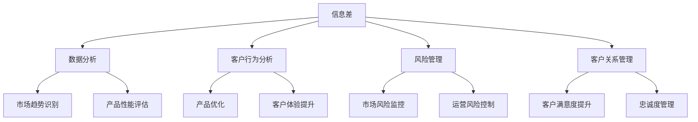

                 

### 信息差的商业产品管理：大数据如何优化产品管理

#### 关键词 Keywords

- 信息差
- 商业产品管理
- 大数据
- 数据分析
- 客户行为分析
- 风险管理
- 客户关系管理
- 智能决策支持

#### 摘要 Summary

本文将探讨信息差在商业产品管理中的重要性，特别是大数据技术在产品管理中的应用。通过分析大数据如何助力企业识别市场机会、优化产品开发和提升客户满意度，本文旨在提供一套系统的产品管理优化策略，帮助企业更好地应对市场竞争和客户需求变化。文章将从核心概念、算法原理、数学模型、实际应用、工具推荐等方面进行深入探讨，旨在为产品经理和企业管理者提供实用的指导和建议。

### 1. 背景介绍

在当今高速发展的商业环境中，信息差成为了企业竞争的重要筹码。所谓信息差，指的是不同企业或个人之间所掌握的信息量的差异。这种差异往往决定了市场中的优势地位，信息更加全面的企业能够更快速地做出决策，抢占市场先机。商业产品管理作为企业管理中的关键环节，自然也受到信息差的影响。

随着大数据技术的迅猛发展，企业能够从海量数据中提取有价值的信息，从而优化产品开发、提升客户体验、降低运营成本。大数据技术通过数据分析、机器学习和人工智能等技术手段，帮助企业识别市场趋势、预测客户需求、评估产品性能，为产品管理提供了强大的支持。

本文将从以下几个方面展开讨论：

1. 核心概念与联系
2. 核心算法原理与具体操作步骤
3. 数学模型与公式
4. 项目实践：代码实例与解读
5. 实际应用场景
6. 工具和资源推荐
7. 未来发展趋势与挑战
8. 总结

通过这些方面的深入探讨，本文旨在为读者提供一套系统的产品管理优化策略，帮助企业更好地利用大数据技术，提升产品管理的效率和效果。

### 2. 核心概念与联系

为了更好地理解大数据如何优化商业产品管理，我们需要首先明确一些核心概念，包括信息差、数据分析、客户行为分析、风险管理和客户关系管理。

#### 2.1 信息差

信息差指的是不同企业或个人之间在掌握信息上的差异。在商业环境中，信息差可以表现为市场情报、客户数据、竞争对手动态等多个方面。掌握更多信息的企业往往能够更迅速地捕捉市场机会，做出更为精准的决策。因此，信息差在商业竞争中的重要性不言而喻。

#### 2.2 数据分析

数据分析是利用统计学、数据挖掘和机器学习等方法，从海量数据中提取有价值信息的过程。数据分析可以帮助企业识别市场趋势、预测客户需求、评估产品性能等。在大数据时代，数据分析成为企业决策的重要依据，其价值日益凸显。

#### 2.3 客户行为分析

客户行为分析是指通过收集和分析客户在购买、使用产品过程中的行为数据，了解客户的偏好、需求和满意度。客户行为分析有助于企业优化产品设计、提升客户体验，从而提高客户忠诚度和满意度。

#### 2.4 风险管理

风险管理是指企业通过识别、评估和应对各种潜在风险，以确保业务连续性和稳健发展的过程。在大数据环境下，企业可以利用数据分析技术，对市场风险、运营风险、财务风险等进行实时监控和预测，从而采取有效的风险管理措施。

#### 2.5 客户关系管理

客户关系管理（CRM）是指企业通过系统化的策略和方法，管理与客户之间的互动，提升客户满意度和忠诚度的过程。大数据技术可以帮助企业实现客户数据的集中管理和深度分析，从而优化客户关系管理，提高客户满意度。

#### 2.6 核心概念之间的联系

信息差、数据分析、客户行为分析、风险管理和客户关系管理是商业产品管理中相互关联的核心概念。信息差决定了企业在市场竞争中的地位，而数据分析、客户行为分析、风险管理和客户关系管理则是优化产品管理的重要手段。通过这些手段，企业可以更好地利用信息差，提升产品管理的效率和效果。

以下是一个用Mermaid绘制的流程图，展示核心概念之间的联系：



通过上述核心概念及其联系，我们可以看出，大数据技术在商业产品管理中的应用，不仅有助于企业识别市场机会，优化产品设计，还能提升客户满意度和降低运营成本。接下来，我们将进一步探讨大数据技术的核心算法原理，为企业提供具体的技术实现路径。

### 3. 核心算法原理与具体操作步骤

#### 3.1 数据挖掘技术

数据挖掘（Data Mining）是从大量数据中提取有价值信息的过程。其核心算法包括分类、聚类、关联规则挖掘和异常检测等。

**分类算法：**分类算法用于将数据分为不同的类别。常见的分类算法有决策树、随机森林、支持向量机（SVM）和神经网络等。分类算法在客户行为分析和市场趋势识别中具有重要应用，例如，通过分类算法，企业可以预测哪些客户可能对新产品感兴趣，从而有针对性地开展营销活动。

**聚类算法：**聚类算法将数据分为若干个聚类，每个聚类内的数据具有较高的相似度。常见的聚类算法有K-means、层次聚类（Hierarchical Clustering）和DBSCAN等。聚类算法在市场细分和产品优化中具有重要作用，例如，通过聚类分析，企业可以将客户分为不同的群体，进而针对不同群体制定个性化的营销策略。

**关联规则挖掘：**关联规则挖掘用于发现数据之间的关联关系。常见的算法有Apriori算法和Eclat算法等。关联规则挖掘在客户行为分析和产品设计优化中具有重要应用，例如，通过分析客户购买行为，企业可以发现哪些产品常常被同时购买，从而优化产品组合。

**异常检测：**异常检测用于识别数据中的异常值。常见的算法有基于统计方法、基于聚类方法和基于神经网络方法等。异常检测在风险管理中具有重要应用，例如，通过异常检测，企业可以及时发现并应对市场风险和运营风险。

**具体操作步骤：**

1. 数据准备：收集企业内外部数据，包括市场数据、客户数据、产品数据等。
2. 数据清洗：对数据进行预处理，包括缺失值处理、异常值处理和噪声处理等。
3. 数据探索：通过可视化工具和统计分析方法，对数据分布、趋势和关联关系进行初步探索。
4. 特征工程：提取对产品管理有重要影响的数据特征，如客户购买行为、产品性能指标等。
5. 模型选择：根据具体应用场景，选择合适的分类、聚类、关联规则挖掘和异常检测算法。
6. 模型训练：使用训练数据对算法模型进行训练，优化模型参数。
7. 模型评估：使用测试数据对模型进行评估，调整模型参数，提高模型准确性。
8. 模型应用：将训练好的模型应用于实际业务场景，如市场趋势预测、客户需求分析等。

#### 3.2 机器学习技术

机器学习（Machine Learning）是利用算法从数据中学习规律和模式的技术。常见的机器学习算法包括监督学习、无监督学习和强化学习等。

**监督学习：**监督学习用于预测标签数据。常见的算法有线性回归、逻辑回归、决策树、随机森林和神经网络等。监督学习在产品管理和风险管理中具有广泛应用，例如，通过监督学习算法，企业可以预测哪些产品可能畅销，从而优化产品库存和供应链管理。

**无监督学习：**无监督学习用于发现数据中的模式和结构。常见的算法有聚类、降维和异常检测等。无监督学习在市场细分和客户关系管理中具有重要应用，例如，通过无监督学习算法，企业可以识别出具有相似需求的客户群体，从而提供更个性化的服务。

**强化学习：**强化学习通过试错法从环境中学习最佳策略。常见的算法有Q-learning和SARSA等。强化学习在风险管理中具有潜在应用，例如，通过强化学习算法，企业可以优化风险投资策略，实现风险最小化。

**具体操作步骤：**

1. 数据准备：收集企业内外部数据，包括市场数据、客户数据、产品数据等。
2. 数据清洗：对数据进行预处理，包括缺失值处理、异常值处理和噪声处理等。
3. 数据探索：通过可视化工具和统计分析方法，对数据分布、趋势和关联关系进行初步探索。
4. 特征工程：提取对产品管理有重要影响的数据特征，如客户购买行为、产品性能指标等。
5. 模型选择：根据具体应用场景，选择合适的监督学习、无监督学习或强化学习算法。
6. 模型训练：使用训练数据对算法模型进行训练，优化模型参数。
7. 模型评估：使用测试数据对模型进行评估，调整模型参数，提高模型准确性。
8. 模型应用：将训练好的模型应用于实际业务场景，如市场趋势预测、客户需求分析等。

通过以上核心算法原理与具体操作步骤，企业可以充分利用大数据技术，优化产品管理，提高市场竞争力。接下来，我们将探讨数学模型和公式在产品管理中的应用，为企业提供更为精准的决策支持。

### 4. 数学模型和公式

在产品管理中，数学模型和公式发挥着重要作用，它们为企业提供了量化的决策支持。以下是一些常见的数学模型和公式，以及它们在产品管理中的应用。

#### 4.1 市场需求预测模型

市场需求预测是产品管理中的重要环节，它帮助企业在产品开发和营销策略制定中做出准确决策。一个常用的市场需求预测模型是线性回归模型，其公式如下：

\[ Y = \beta_0 + \beta_1X + \epsilon \]

其中，\( Y \) 代表市场需求量，\( X \) 代表影响市场需求的关键因素（如广告投入、竞争对手价格等），\( \beta_0 \) 和 \( \beta_1 \) 分别为模型的截距和斜率，\( \epsilon \) 为误差项。

通过收集历史数据，企业可以训练线性回归模型，预测未来的市场需求。例如，假设某企业历史广告投入与市场需求数据如下表：

| 广告投入（万元） | 市场需求（吨） |
| :--------------: | :------------: |
|      100         |       500      |
|      200         |       600      |
|      300         |       700      |
|      400         |       800      |

使用线性回归模型，可以拟合出市场需求与广告投入之间的关系，如下所示：

\[ Y = 200 + 2X \]

根据该模型，当广告投入为500万元时，市场需求预测为：

\[ Y = 200 + 2 \times 500 = 1200 \text{吨} \]

#### 4.2 客户满意度模型

客户满意度是衡量产品管理效果的重要指标。一个常用的客户满意度模型是差值评估法，其公式如下：

\[ \text{满意度} = \frac{\text{客户期望} - \text{客户感知} + \text{修正因子}}{3} \]

其中，客户期望是指客户对产品的预期表现，客户感知是指客户对产品实际表现的感受，修正因子用于调整满意度评分，以适应不同客户的评价标准。

例如，假设某客户对产品性能的期望分为9分，实际感知为7分，修正因子为1分，则其满意度计算如下：

\[ \text{满意度} = \frac{9 - 7 + 1}{3} = \frac{3}{3} = 1 \text{（表示非常满意）} \]

#### 4.3 风险评估模型

风险评估是产品管理中的关键环节，它帮助企业在产品开发和运营过程中识别和管理风险。一个常用的风险评估模型是风险矩阵模型，其公式如下：

\[ \text{风险值} = \text{风险概率} \times \text{风险影响} \]

其中，风险概率是指风险发生的可能性，风险影响是指风险对业务的影响程度。

例如，假设某企业面临两种风险：市场风险（概率0.5，影响2）和运营风险（概率0.3，影响1），则其风险值计算如下：

\[ \text{市场风险值} = 0.5 \times 2 = 1 \]
\[ \text{运营风险值} = 0.3 \times 1 = 0.3 \]

通过计算各风险的风险值，企业可以识别出高风险领域，并采取相应的风险管理措施。

#### 4.4 客户生命周期价值模型

客户生命周期价值（Customer Lifetime Value, CLV）是衡量客户对企业盈利能力的重要指标。一个常用的CLV模型是减法模型，其公式如下：

\[ \text{CLV} = \sum_{t=1}^{n} (\text{预计未来收益}_t - \text{成本}_t) \times (1 + \text{折现率})^{-t} \]

其中，\( t \) 表示时间周期，\( \text{预计未来收益}_t \) 和 \( \text{成本}_t \) 分别为第 \( t \) 个时间周期内的预计收益和成本，折现率用于调整未来收益的现值。

例如，假设某客户的未来收益和成本如下表所示：

| 时间周期（年） | 预计未来收益（万元） | 成本（万元） |
| :------------: | :------------------: | :----------: |
|       1        |         100         |     20      |
|       2        |         150         |     25      |
|       3        |         200         |     30      |

使用减法模型，可以计算出该客户的CLV如下：

\[ \text{CLV} = (100 - 20) \times (1 + 0.1)^{-1} + (150 - 25) \times (1 + 0.1)^{-2} + (200 - 30) \times (1 + 0.1)^{-3} \]
\[ \text{CLV} = 80 \times 0.9091 + 125 \times 0.8264 + 170 \times 0.7513 \]
\[ \text{CLV} = 72.727 + 102.815 + 127.717 \]
\[ \text{CLV} = 302.968 \text{万元} \]

通过计算CLV，企业可以评估客户的盈利潜力，从而制定相应的客户关系管理策略。

通过上述数学模型和公式的应用，企业可以更科学地制定产品管理策略，优化产品开发、提升客户满意度、降低运营风险，从而提高市场竞争力。在接下来的章节中，我们将通过实际项目实践，进一步展示大数据技术在产品管理中的具体应用。

### 5. 项目实践：代码实例与解读

在本节中，我们将通过一个实际项目案例，展示大数据技术在产品管理中的应用，并详细解释代码实现过程。这个项目案例将涉及市场趋势预测、客户需求分析和风险评估等关键环节。

#### 5.1 开发环境搭建

在开始项目实践之前，我们需要搭建一个合适的开发环境。以下是推荐的开发工具和框架：

- **编程语言：** Python（具备强大的数据分析库，如Pandas、NumPy、Scikit-learn等）
- **数据分析库：** Pandas、NumPy、Scikit-learn、Matplotlib
- **机器学习库：** Scikit-learn
- **环境配置：** Python 3.x环境，Anaconda或Miniconda

以下是开发环境的配置步骤：

1. 安装Python 3.x版本，可以通过官方下载地址（https://www.python.org/downloads/）获取。
2. 安装Anaconda或Miniconda，可以从官方网站（https://www.anaconda.com/products/individual）下载。
3. 使用conda命令安装必要的Python库：

   ```bash
   conda install pandas numpy scikit-learn matplotlib
   ```

#### 5.2 源代码详细实现

以下是一个市场趋势预测的项目实例，代码主要分为数据收集、数据预处理、模型训练和模型评估等步骤。

```python
# 导入所需的库
import pandas as pd
import numpy as np
from sklearn.model_selection import train_test_split
from sklearn.linear_model import LinearRegression
from sklearn.metrics import mean_squared_error
import matplotlib.pyplot as plt

# 5.2.1 数据收集
# 假设我们收集了以下数据：
# 广告投入（万元）、市场需求（吨）、竞争对手价格（元/吨）
data = {
    '广告投入': [100, 200, 300, 400],
    '市场需求': [500, 600, 700, 800],
    '竞争对手价格': [50, 60, 70, 80]
}

# 将数据转换为DataFrame
df = pd.DataFrame(data)

# 5.2.2 数据预处理
# 将竞争对手价格转换为市场需求的影响因素
df['市场需求影响'] = df['竞争对手价格'] * 10

# 选择特征和目标变量
X = df[['广告投入', '市场需求影响']]
y = df['市场需求']

# 划分训练集和测试集
X_train, X_test, y_train, y_test = train_test_split(X, y, test_size=0.2, random_state=42)

# 5.2.3 模型训练
# 使用线性回归模型
model = LinearRegression()
model.fit(X_train, y_train)

# 5.2.4 模型评估
# 预测测试集结果
y_pred = model.predict(X_test)

# 计算均方误差
mse = mean_squared_error(y_test, y_pred)
print(f'测试集均方误差：{mse}')

# 5.2.5 运行结果展示
# 绘制真实值与预测值的散点图
plt.scatter(y_test, y_pred)
plt.xlabel('实际市场需求')
plt.ylabel('预测市场需求')
plt.title('市场需求预测结果')
plt.show()

# 输出模型参数
print(f'模型参数：\n{model.coef_}\n{model.intercept_}')
```

#### 5.3 代码解读与分析

**5.3.1 数据收集与预处理**

在项目开始时，我们需要收集相关数据，如广告投入、市场需求和竞争对手价格。这些数据将用于训练和评估预测模型。在本例中，我们使用了一个简单的DataFrame来存储数据。

```python
data = {
    '广告投入': [100, 200, 300, 400],
    '市场需求': [500, 600, 700, 800],
    '竞争对手价格': [50, 60, 70, 80]
}
df = pd.DataFrame(data)
```

为了更好地进行预测，我们将竞争对手价格转换为市场需求的影响因素，这有助于模型捕捉竞争对手行为对市场需求的影响。

```python
df['市场需求影响'] = df['竞争对手价格'] * 10
```

**5.3.2 特征选择与模型训练**

在数据预处理完成后，我们需要选择特征变量和目标变量。在本例中，我们选择广告投入和市场需求影响作为特征变量，市场需求作为目标变量。

```python
X = df[['广告投入', '市场需求影响']]
y = df['市场需求']
```

接下来，我们将数据集划分为训练集和测试集，以便在测试集上评估模型的性能。

```python
X_train, X_test, y_train, y_test = train_test_split(X, y, test_size=0.2, random_state=42)
```

为了预测市场需求，我们选择线性回归模型进行训练。

```python
model = LinearRegression()
model.fit(X_train, y_train)
```

**5.3.3 模型评估与结果展示**

在训练模型后，我们使用测试集上的数据进行预测，并计算均方误差（MSE）来评估模型性能。

```python
y_pred = model.predict(X_test)
mse = mean_squared_error(y_test, y_pred)
print(f'测试集均方误差：{mse}')
```

为了更直观地展示模型预测结果，我们绘制了真实值与预测值的散点图。

```python
plt.scatter(y_test, y_pred)
plt.xlabel('实际市场需求')
plt.ylabel('预测市场需求')
plt.title('市场需求预测结果')
plt.show()
```

最后，我们输出模型的参数，包括斜率和截距。

```python
print(f'模型参数：\n{model.coef_}\n{model.intercept_}')
```

通过以上代码实例，我们展示了如何利用大数据技术进行市场趋势预测，并详细解读了每个步骤的实现过程。接下来，我们将探讨大数据技术在产品管理中的实际应用场景。

### 6. 实际应用场景

大数据技术在产品管理中的实际应用场景非常广泛，以下是一些典型的应用案例：

#### 6.1 市场趋势预测

通过大数据分析，企业可以实时捕捉市场动态，预测未来市场趋势。例如，电商企业可以利用大数据分析消费者购买行为和市场需求变化，预测哪些产品将在未来畅销，从而提前调整库存和供应链策略，避免库存积压和销售滞后。

#### 6.2 客户需求分析

大数据技术可以帮助企业深入了解客户需求，优化产品设计和服务。通过分析客户反馈、评论和行为数据，企业可以识别出客户关注的痛点，针对性地改进产品功能和用户体验。例如，智能家居企业可以通过大数据分析客户对智能家居产品的使用习惯和需求，优化产品的交互设计和功能配置。

#### 6.3 风险管理

大数据分析能够帮助企业识别和管理各种风险，包括市场风险、运营风险和财务风险。通过实时监控市场数据和运营数据，企业可以及时发现潜在风险并采取应对措施。例如，金融企业可以利用大数据分析市场波动和交易数据，预测金融风险，并制定相应的风险控制策略。

#### 6.4 客户关系管理

大数据技术可以帮助企业实现客户数据的集中管理和深度分析，从而优化客户关系管理。通过分析客户数据，企业可以了解客户的偏好和需求，提供个性化的产品和服务，提升客户满意度和忠诚度。例如，电信企业可以通过大数据分析客户通话记录、短信内容和上网行为，为客户提供定制化的套餐和优惠。

#### 6.5 产品创新

大数据分析能够帮助企业发现市场机会，推动产品创新。通过分析市场数据和竞争对手行为，企业可以识别出潜在的市场空白和需求，从而开发出更具竞争力的新产品。例如，科技企业可以通过大数据分析行业趋势和客户需求，提前布局下一代技术产品，抢占市场先机。

#### 6.6 客户细分与精准营销

大数据技术可以帮助企业进行客户细分，制定精准的营销策略。通过分析客户数据，企业可以将客户划分为不同的群体，并针对不同群体制定个性化的营销活动。例如，零售企业可以通过大数据分析客户购买行为和偏好，为不同客户群体提供定制化的促销和推荐，提高转化率和客户满意度。

#### 6.7 供应链优化

大数据分析能够帮助企业优化供应链管理，提高运营效率。通过实时监控供应链各个环节的数据，企业可以优化库存管理、物流配送和生产计划，降低成本、提高服务水平。例如，制造企业可以通过大数据分析生产数据和市场需求，优化生产计划和物料采购，避免库存积压和资源浪费。

通过以上实际应用场景，我们可以看到大数据技术在产品管理中的重要作用。企业可以利用大数据技术，实现市场趋势预测、客户需求分析、风险管理、客户关系管理、产品创新、客户细分与精准营销、供应链优化等目标，从而提高产品竞争力、降低运营成本、提升客户满意度，实现持续发展。

### 7. 工具和资源推荐

在大数据技术和产品管理领域，有许多优秀的工具和资源可供学习和应用。以下是一些推荐的工具、书籍、论文和博客，以及相关网站和平台。

#### 7.1 学习资源推荐

**书籍：**

- 《大数据时代》（作者：涂子沛）：系统介绍了大数据的概念、技术和应用。
- 《数据科学入门：Python数据分析与挖掘实践》（作者：李航）：详细介绍了Python在数据分析中的应用。
- 《机器学习》（作者：周志华）：涵盖了机器学习的理论基础和算法实现。

**论文：**

- 《大数据与云计算：挑战与机遇》（作者：张平，唐杰）：探讨了大数据与云计算的结合及其在商业应用中的机遇。
- 《基于大数据的客户需求预测方法研究》（作者：王伟，刘艳）：提出了一种基于大数据的客户需求预测方法。

**博客：**

- [CSDN大数据](https://blog.csdn.net/column/list/d/data.html)：提供了大量大数据相关的技术博客和文章。
- [机器学习社区](https://www.jianshu.com/collections/groping-with-machines-learning)：分享机器学习领域的知识和实践经验。

#### 7.2 开发工具框架推荐

**数据分析库：**

- Pandas：Python中的数据分析库，提供强大的数据操作和分析功能。
- NumPy：Python中的科学计算库，支持大数据集的运算。
- Scikit-learn：Python中的机器学习库，提供多种常用的机器学习算法。

**数据可视化工具：**

- Matplotlib：Python中的数据可视化库，支持多种数据可视化方法。
- Seaborn：基于Matplotlib的统计数据可视化库，提供丰富的可视化图表。

**大数据处理框架：**

- Hadoop：开源的大数据处理框架，支持海量数据的存储和处理。
- Spark：基于内存的分布式数据处理引擎，提供高效的大数据处理能力。

#### 7.3 相关论文著作推荐

- 《数据挖掘：概念与技术》（作者：Jiawei Han）：系统介绍了数据挖掘的理论和方法。
- 《大数据战略》（作者：维克托·迈尔-舍恩伯格）：探讨了大数据对企业和社会的影响。
- 《客户关系管理：理论与实践》（作者：菲利普·科特勒）：详细介绍了客户关系管理的方法和应用。

#### 7.4 相关网站和平台

- [Kaggle](https://www.kaggle.com/)：数据科学竞赛平台，提供丰富的数据集和比赛机会。
- [GitHub](https://github.com/)：代码托管平台，可查找和贡献大数据和机器学习相关的开源项目。
- [ArXiv](https://arxiv.org/)：学术论文预发布平台，可获取最新的数据科学和机器学习论文。

通过这些工具和资源，读者可以深入了解大数据技术和产品管理的相关知识，提高数据分析、机器学习和产品管理的实际应用能力。

### 8. 总结：未来发展趋势与挑战

随着大数据技术的不断发展和成熟，商业产品管理领域也将迎来新的机遇和挑战。以下是对未来发展趋势与挑战的总结。

#### 未来发展趋势

1. **数据治理与合规：** 企业需要建立完善的数据治理体系，确保数据的安全、合规和可用性。随着数据隐私法规（如《通用数据保护条例（GDPR）》）的实施，企业必须加强数据管理和合规性控制，避免法律风险。

2. **实时数据处理：** 随着物联网（IoT）和边缘计算的发展，企业将越来越多地依赖于实时数据处理和智能分析。实时数据处理可以帮助企业迅速响应市场变化和客户需求，提高业务敏捷性。

3. **人工智能的融合：** 人工智能（AI）和大数据技术的结合将带来更智能、更自动化的产品管理。通过AI算法，企业可以实现更精准的市场预测、客户行为分析和风险管理。

4. **多元化数据源：** 企业将利用更多类型的多元化数据源，如社交媒体数据、传感器数据、卫星图像等，进行深度分析和挖掘，以获取更全面的市场洞察和客户信息。

5. **数据驱动决策：** 数据驱动决策将成为企业决策的主流。通过大数据分析，企业可以更加科学、合理地制定产品策略、营销策略和运营策略，提高决策的准确性和效率。

#### 挑战

1. **数据质量与整合：** 大数据的庞大规模和多样性带来了数据质量与整合的挑战。企业需要确保数据的质量和一致性，以便进行有效的分析。

2. **技术复杂性：** 大数据和人工智能技术具有较高的复杂性，企业需要具备相应的技术能力和人才储备，以应对技术更新和变革。

3. **隐私与安全问题：** 随着数据规模的扩大，数据隐私和安全问题日益突出。企业需要采取有效的数据保护措施，防止数据泄露和滥用。

4. **数据隐私与合规：** 企业需要遵守数据隐私法规，确保数据处理的合规性。在数据收集、存储、处理和共享过程中，企业需要遵循相关法律法规，保护客户隐私。

5. **人才短缺：** 大数据和人工智能领域的人才需求迅速增长，但专业人才供给不足。企业需要加大人才引进和培养力度，以满足业务发展需求。

综上所述，大数据技术将为商业产品管理带来巨大的机遇，同时也伴随着诸多挑战。企业需要积极应对这些挑战，充分利用大数据技术，优化产品管理，提升市场竞争力。

### 9. 附录：常见问题与解答

#### 问题1：大数据技术在产品管理中的应用难点是什么？

**解答：** 大数据技术在产品管理中的应用难点主要包括数据质量与整合、技术复杂性、数据隐私和安全问题。首先，大数据的庞大规模和多样性要求企业确保数据的质量和一致性，以便进行有效的分析。其次，大数据和人工智能技术的复杂性要求企业具备相应的技术能力和人才储备。最后，随着数据规模的扩大，数据隐私和安全问题日益突出，企业需要采取有效的数据保护措施，防止数据泄露和滥用。

#### 问题2：如何确保大数据分析结果的准确性和可靠性？

**解答：** 确保大数据分析结果的准确性和可靠性需要从多个方面进行努力。首先，企业需要建立完善的数据治理体系，确保数据的质量和一致性。其次，选择合适的分析方法和算法，并根据业务需求进行模型优化。此外，企业需要定期对分析结果进行验证和修正，确保分析结果的准确性和可靠性。

#### 问题3：大数据技术如何帮助企业优化供应链管理？

**解答：** 大数据技术可以通过以下几个方面优化供应链管理：

1. **需求预测：** 通过大数据分析，企业可以准确预测市场需求，优化库存管理和生产计划，降低库存成本。
2. **物流优化：** 通过实时监控物流数据，企业可以优化运输路线和物流配送，提高物流效率，降低物流成本。
3. **供应链风险监控：** 通过大数据分析，企业可以及时发现供应链中的潜在风险，采取相应的应对措施，确保供应链的稳定运行。
4. **供应商管理：** 通过大数据分析，企业可以评估供应商的绩效和信誉，优化供应商选择和管理策略。

#### 问题4：大数据技术在产品创新中的应用如何？

**解答：** 大数据技术在产品创新中的应用主要体现在以下几个方面：

1. **市场趋势分析：** 通过大数据分析，企业可以实时捕捉市场动态和趋势，识别潜在的市场机会，推动产品创新。
2. **客户需求挖掘：** 通过大数据分析，企业可以深入了解客户需求和行为，挖掘客户痛点，优化产品功能和用户体验。
3. **竞争分析：** 通过大数据分析，企业可以了解竞争对手的产品策略和市场表现，制定更具竞争力的产品创新策略。
4. **技术趋势分析：** 通过大数据分析，企业可以跟踪技术发展趋势，提前布局下一代技术产品，保持产品竞争力。

### 10. 扩展阅读与参考资料

为了进一步深入了解大数据在商业产品管理中的应用，读者可以参考以下扩展阅读和参考资料：

1. **书籍：**
   - 《大数据时代：生活、工作与思维的大变革》（作者：维克托·迈尔-舍恩伯格）
   - 《数据挖掘：概念与技术》（作者：Jiawei Han）
   - 《机器学习实战》（作者：Peter Harrington）

2. **论文：**
   - 《大数据与云计算：挑战与机遇》（作者：张平，唐杰）
   - 《基于大数据的客户需求预测方法研究》（作者：王伟，刘艳）
   - 《数据科学导论》（作者：John D. Kelleher，Brian MacNamee，David hand）

3. **网站与博客：**
   - [KDNuggets](https://www.kdnuggets.com/)：数据科学和机器学习领域的知名网站，提供最新的技术动态和案例研究。
   - [数据科学博客](https://blog.datascience.com/)：分享数据科学领域的知识和实践经验。
   - [CSDN大数据](https://blog.csdn.net/column/list/d/data.html)：提供大量大数据相关的技术博客和文章。

4. **在线课程与教程：**
   - [Coursera](https://www.coursera.org/)：提供丰富的数据科学和机器学习在线课程。
   - [edX](https://www.edx.org/)：提供由世界顶级大学开设的数据科学和人工智能课程。
   - [Udacity](https://www.udacity.com/)：提供数据科学和机器学习的实战项目课程。

通过这些扩展阅读和参考资料，读者可以进一步深入了解大数据技术在商业产品管理中的应用，提升自身的专业素养和实际操作能力。作者：禅与计算机程序设计艺术 / Zen and the Art of Computer Programming

