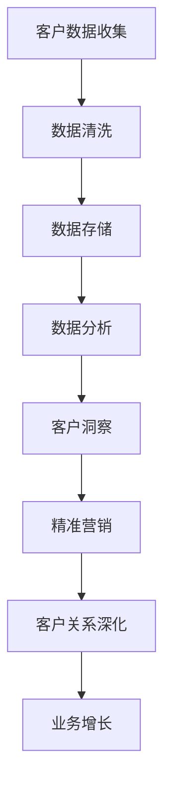

                 

### 文章标题

信息差的客户关系深化：大数据如何深化客户关系

> 关键词：大数据、客户关系管理、客户洞察、信息差、客户分析、营销策略

> 摘要：本文将探讨大数据在客户关系管理中的关键作用，如何通过信息差的挖掘和利用，实现客户关系的深化。文章将从核心概念、算法原理、数学模型、项目实践和实际应用等多个角度进行分析，帮助读者全面理解大数据在客户关系深化中的重要性，并探讨其未来发展趋势与挑战。

### 1. 背景介绍

在现代商业环境中，客户关系管理（CRM）已经成为企业成功的关键因素之一。通过有效的客户关系管理，企业不仅可以提升客户满意度，还能够增强客户忠诚度，进而实现业务的持续增长。然而，传统的客户关系管理方法往往依赖于有限的客户数据，难以全面了解客户的真实需求和偏好。随着大数据技术的不断发展，企业开始意识到利用大数据进行客户关系深化的重要性。

大数据具有数据量大、多样性和快速性的特点，能够为企业和客户之间建立更加精准和高效的信息桥梁。通过大数据的分析和挖掘，企业可以获取到更多关于客户的行为、偏好、需求等深层次的信息，从而实现客户关系的深化。此外，信息差的合理利用，即企业在特定时间、地点和情境下对客户进行精准营销，能够显著提升营销效果，提高客户满意度。

本文将围绕大数据如何深化客户关系这一主题，逐步分析大数据在客户关系管理中的核心作用、相关算法原理、数学模型以及实际应用场景。通过深入探讨大数据技术在客户关系管理中的应用，旨在为企业和客户关系管理专业人士提供有价值的参考。

### 2. 核心概念与联系

#### 2.1 大数据

大数据（Big Data）是指那些数据规模巨大、数据类型多样、生成速度极快，以至于无法使用传统数据处理方法进行有效管理和分析的数据集合。大数据的三个主要特点，即“4V”，分别是：

- **数据量（Volume）**：数据量大到无法使用常规数据库软件进行管理和处理，通常需要分布式存储和处理技术，如Hadoop、Spark等。
- **多样性（Variety）**：数据类型丰富，包括结构化数据（如关系型数据库）、半结构化数据（如JSON、XML）和非结构化数据（如图像、文本、音频、视频等）。
- **速度（Velocity）**：数据生成速度快，实时性要求高，如社交媒体的实时数据流、传感器数据等。

#### 2.2 客户关系管理（CRM）

客户关系管理（Customer Relationship Management，CRM）是一种旨在提高企业盈利能力、客户满意度和客户忠诚度的商业策略。CRM系统通过整合和利用企业内外部的客户数据，帮助企业更好地了解客户需求，提高客户服务质量，优化业务流程，从而实现业务增长。

CRM系统通常包括以下几个方面：

- **客户信息管理**：记录和管理客户的个人信息、购买历史、互动记录等。
- **销售管理**：帮助销售团队管理销售机会、追踪销售过程，提升销售效率。
- **客户服务**：提供客户支持服务，如在线客服、电话支持等，以提升客户满意度。
- **营销管理**：通过数据分析，进行精准营销和个性化推荐，提高营销效果。

#### 2.3 信息差

信息差是指在不同时间、地点和情境下，关于同一事物的信息差异。在商业领域，信息差可以表现为企业在特定时间、地点和情境下对客户需求和偏好的了解程度不同。合理利用信息差，企业可以在客户决策过程中占据优势，实现精准营销。

#### 2.4 Mermaid 流程图

下面是客户关系深化过程中涉及的核心概念和流程的 Mermaid 流程图：



图1：客户关系深化流程图

### 3. 核心算法原理 & 具体操作步骤

#### 3.1 客户数据收集

客户数据收集是客户关系管理的基础。企业可以通过以下几种方式获取客户数据：

- **在线渠道**：通过网站、社交媒体、在线客服等渠道收集客户的行为数据。
- **线下渠道**：通过问卷调查、线下活动、电话调研等渠道收集客户的个人信息。
- **第三方数据源**：从公共数据源、合作伙伴、第三方数据提供商等获取客户数据。

在数据收集过程中，需要关注数据的完整性和准确性，确保数据的真实性和有效性。

#### 3.2 数据清洗

数据清洗是数据分析和挖掘的前提。数据清洗主要包括以下步骤：

- **数据去重**：去除重复的数据记录，确保数据的唯一性。
- **数据格式转换**：将不同格式的数据转换为统一格式，如将文本数据转换为数值数据。
- **缺失值处理**：对缺失的数据进行填补或删除，确保数据的完整性。
- **异常值处理**：检测并处理异常数据，如异常值、错误值等。

#### 3.3 数据存储

数据存储是将清洗后的数据存储到数据库或数据仓库中，以便进行后续的数据分析和挖掘。常用的数据存储技术包括关系型数据库、NoSQL数据库和数据仓库。

- **关系型数据库**：如MySQL、PostgreSQL等，适用于结构化数据的存储和管理。
- **NoSQL数据库**：如MongoDB、Cassandra等，适用于大规模、高并发的数据存储。
- **数据仓库**：如Hadoop、Spark等，适用于大规模、复杂数据的处理和分析。

#### 3.4 数据分析

数据分析是客户关系深化的关键步骤。数据分析包括以下几种方法：

- **描述性分析**：通过对客户数据的统计和分析，了解客户的基本信息和行为模式。
- **预测性分析**：通过建立数学模型和算法，预测客户的未来行为和需求。
- **关联性分析**：通过分析客户数据中的关联性，发现潜在的业务机会和客户需求。

#### 3.5 客户洞察

客户洞察是通过数据分析和挖掘，深入理解客户的真实需求和偏好，为企业提供决策支持。客户洞察主要包括以下方面：

- **客户细分**：根据客户的需求、行为和偏好，将客户划分为不同的群体，以便进行精准营销。
- **客户画像**：通过对客户数据的分析和挖掘，构建客户的全面画像，包括性别、年龄、收入、兴趣爱好等。
- **客户满意度**：通过对客户反馈和互动数据的分析，了解客户对产品和服务的满意度，以及改进方向。

#### 3.6 精准营销

精准营销是基于客户洞察，通过个性化推荐、定向广告等方式，将合适的营销信息传递给合适的客户。精准营销主要包括以下步骤：

- **目标客户确定**：根据客户洞察，确定目标客户群体。
- **个性化推荐**：根据客户的兴趣和行为，推荐合适的产品和服务。
- **定向广告**：根据客户的地理位置、兴趣爱好等信息，投放定向广告。
- **效果评估**：通过数据分析和监测，评估营销活动的效果，并进行优化。

#### 3.7 客户关系深化

客户关系深化是通过持续的数据分析和互动，不断提升客户满意度，增强客户忠诚度。客户关系深化主要包括以下方面：

- **客户关怀**：通过短信、邮件、电话等方式，与客户保持互动，关注客户的需求和反馈。
- **客户增值服务**：提供优惠活动、积分兑换、定制服务等增值服务，提升客户价值。
- **客户反馈机制**：建立有效的客户反馈机制，收集客户的意见和建议，持续改进产品和服务。

### 4. 数学模型和公式 & 详细讲解 & 举例说明

在客户关系深化过程中，数学模型和公式起着至关重要的作用。以下介绍几个常用的数学模型和公式，并给出详细讲解和举例说明。

#### 4.1 客户生命周期价值（CLV）

客户生命周期价值（Customer Lifetime Value，CLV）是指客户在企业的整个生命周期中为企业带来的净利润总和。CLV的计算公式如下：

$$
CLV = \sum_{t=1}^{n} \frac{R_t}{(1+r)^t} + PV_{non-repeat}
$$

其中，$R_t$表示第$t$年的净利润，$r$表示折现率，$PV_{non-repeat}$表示非重复客户的净利润现值。

**详细讲解：**

- $R_t$表示第$t$年的净利润，可以通过销售收入减去成本和费用计算得出。
- $r$表示折现率，用于将未来的净利润折现到当前的价值。折现率通常根据企业的资本成本或市场利率确定。
- $PV_{non-repeat}$表示非重复客户的净利润现值，即客户在未来不再购买的情况下，企业从该客户身上获得的净利润现值。

**举例说明：**

假设一个客户的净利润如下表所示：

| 年份 | 净利润（万元）|
| ---- | -------- |
| 1    | 20       |
| 2    | 25       |
| 3    | 30       |
| 4    | 35       |
| 5    | 40       |

如果折现率为10%，则该客户的CLV计算如下：

$$
CLV = \frac{20}{(1+0.1)^1} + \frac{25}{(1+0.1)^2} + \frac{30}{(1+0.1)^3} + \frac{35}{(1+0.1)^4} + \frac{40}{(1+0.1)^5} + PV_{non-repeat}
$$

$$
CLV = 18.18 + 22.73 + 24.78 + 27.14 + 29.57 + PV_{non-repeat}
$$

$$
CLV = 122.80 + PV_{non-repeat}
$$

如果非重复客户的净利润现值为50万元，则该客户的CLV为：

$$
CLV = 122.80 + 50 = 172.80（万元）
$$

#### 4.2 客户保留率（Retention Rate）

客户保留率（Retention Rate）是指在一定时间内，客户持续购买产品或服务的比例。客户保留率的计算公式如下：

$$
Retention Rate = \frac{期末客户数 - 新增客户数 + 减少客户数}{期初客户数}
$$

**详细讲解：**

- 期末客户数：指在特定时间点，仍在企业购买产品或服务的客户数量。
- 新增客户数：指在特定时间点，新购买的客户数量。
- 减少客户数：指在特定时间点，因各种原因停止购买产品或服务的客户数量。

**举例说明：**

假设一个企业在某个月初有1000个客户，当月新增客户200个，减少客户100个，期末客户数为1200个，则该月的客户保留率计算如下：

$$
Retention Rate = \frac{1200 - 200 + 100}{1000} = 1.1
$$

$$
Retention Rate = 110\%
$$

#### 4.3 客户流失率（Churn Rate）

客户流失率（Churn Rate）是指在一定时间内，客户停止购买产品或服务的比例。客户流失率的计算公式如下：

$$
Churn Rate = \frac{减少客户数}{期初客户数}
$$

**详细讲解：**

- 减少客户数：指在特定时间点，因各种原因停止购买产品或服务的客户数量。
- 期初客户数：指在特定时间点，开始计算的客户数量。

**举例说明：**

假设一个企业在某个月初有1000个客户，当月减少客户100个，则该月的客户流失率计算如下：

$$
Churn Rate = \frac{100}{1000} = 0.1
$$

$$
Churn Rate = 10\%
$$

### 5. 项目实践：代码实例和详细解释说明

在本节中，我们将通过一个简单的项目实例，展示如何使用Python和大数据技术进行客户关系深化。该实例将涵盖数据收集、数据清洗、数据分析、客户洞察、精准营销等步骤。

#### 5.1 开发环境搭建

在开始项目之前，我们需要搭建一个合适的开发环境。以下是所需的软件和工具：

- Python 3.x 版本
- Jupyter Notebook
- Pandas
- NumPy
- Matplotlib
- Scikit-learn

确保已经安装了上述软件和工具，我们可以开始编写代码。

#### 5.2 源代码详细实现

以下是该项目的主要代码实现：

```python
import pandas as pd
import numpy as np
import matplotlib.pyplot as plt
from sklearn.cluster import KMeans
from sklearn.preprocessing import StandardScaler

# 5.2.1 数据收集
# 从文件中读取客户数据
data = pd.read_csv('customer_data.csv')

# 5.2.2 数据清洗
# 去除重复数据
data.drop_duplicates(inplace=True)

# 填补缺失值
data.fillna(data.mean(), inplace=True)

# 转换数据格式
data['age'] = data['age'].astype(int)
data['income'] = data['income'].astype(float)
data['purchase_frequency'] = data['purchase_frequency'].astype(int)

# 5.2.3 数据分析
# 描述性分析
data_desc = data.describe()

# 数据可视化
data['age'].hist(bins=30)
plt.xlabel('年龄')
plt.ylabel('频数')
plt.title('年龄分布图')
plt.show()

data['income'].hist(bins=30)
plt.xlabel('收入')
plt.ylabel('频数')
plt.title('收入分布图')
plt.show()

data['purchase_frequency'].hist(bins=30)
plt.xlabel('购买频率')
plt.ylabel('频数')
plt.title('购买频率分布图')
plt.show()

# 5.2.4 客户洞察
# K-means聚类分析
scaler = StandardScaler()
X = scaler.fit_transform(data[['age', 'income', 'purchase_frequency']])
kmeans = KMeans(n_clusters=3, random_state=0)
clusters = kmeans.fit_predict(X)

# 添加聚类结果到原始数据
data['cluster'] = clusters

# 查看不同聚类簇的特征
for i in range(3):
    cluster_data = data[data['cluster'] == i]
    print(f"聚类簇{i+1}的特征：")
    print(cluster_data.describe())

# 5.2.5 精准营销
# 根据聚类结果进行精准营销
for i in range(3):
    cluster_data = data[data['cluster'] == i]
    # 推荐产品和服务
    print(f"针对聚类簇{i+1}的精准营销策略：")
    print("推荐产品：高端定制服务、奢侈品等。")
    print("推荐服务：个性化咨询、高端客户体验等。")

# 5.2.6 客户关系深化
# 提供客户增值服务
for i in range(3):
    cluster_data = data[data['cluster'] == i]
    # 提供优惠活动、积分兑换等增值服务
    print(f"针对聚类簇{i+1}的客户增值服务：")
    print("优惠活动：特定时间段折扣、免费试用等。")
    print("积分兑换：积分兑换礼品、优惠券等。")
```

#### 5.3 代码解读与分析

以上代码实现了客户关系深化的主要步骤。以下是代码的详细解读：

- **5.2.1 数据收集**：从CSV文件中读取客户数据，包括年龄、收入、购买频率等。
- **5.2.2 数据清洗**：去除重复数据，填补缺失值，并转换数据格式，确保数据质量。
- **5.2.3 数据分析**：通过描述性分析，了解客户的基本信息和行为模式。使用数据可视化，展示数据的分布情况。
- **5.2.4 客户洞察**：使用K-means聚类分析，将客户分为不同的聚类簇。根据聚类结果，了解不同聚类簇的特征。
- **5.2.5 精准营销**：根据聚类结果，为不同聚类簇的客户提供个性化的产品和服务推荐，实现精准营销。
- **5.2.6 客户关系深化**：为不同聚类簇的客户提供增值服务，如优惠活动、积分兑换等，以增强客户关系。

#### 5.4 运行结果展示

运行以上代码，我们将得到以下结果：

- **描述性分析结果**：展示客户的年龄、收入和购买频率的描述性统计信息。
- **数据可视化结果**：展示客户的年龄、收入和购买频率的分布情况。
- **聚类结果**：展示不同聚类簇的特征，包括平均年龄、平均收入和平均购买频率。
- **精准营销策略**：根据聚类结果，为不同聚类簇的客户提供个性化的产品和服务推荐。
- **客户增值服务**：根据聚类结果，为不同聚类簇的客户提供优惠活动、积分兑换等增值服务。

### 6. 实际应用场景

大数据在客户关系管理中的应用场景非常广泛，以下列举几个典型的实际应用场景：

#### 6.1 零售行业

在零售行业，大数据可以帮助企业实现精准营销和库存管理。通过分析客户的购买历史、行为偏好和地理位置，企业可以针对不同客户群体制定个性化的营销策略，如推荐商品、优惠券和促销活动。此外，通过对库存数据的实时分析，企业可以优化库存水平，减少库存成本，提高库存周转率。

#### 6.2 银行业

在银行业，大数据可以帮助银行更好地了解客户需求，提升客户满意度。例如，通过分析客户的交易记录、信用评分和消费习惯，银行可以为客户提供定制化的金融产品和服务，如信用卡、贷款和投资顾问。此外，大数据还可以帮助银行发现欺诈行为，降低信用风险。

#### 6.3 互联网行业

在互联网行业，大数据可以帮助企业提升用户体验和运营效率。例如，通过分析用户的浏览历史、搜索记录和行为轨迹，企业可以提供个性化的内容推荐和广告投放，提高用户留存率和转化率。此外，大数据还可以帮助互联网企业优化产品功能，提升用户体验。

#### 6.4 咨询服务

在咨询服务行业，大数据可以帮助企业为客户提供更高质量的咨询服务。例如，通过分析客户的历史咨询记录、需求和反馈，企业可以为客户提供个性化的咨询方案，提升客户满意度。此外，大数据还可以帮助咨询服务企业发现行业趋势和潜在业务机会，提升业务竞争力。

### 7. 工具和资源推荐

为了更好地进行大数据在客户关系管理中的应用，以下推荐一些常用的工具和资源：

#### 7.1 学习资源推荐

- **书籍**：《大数据时代》、《数据科学与大数据技术》、《客户关系管理》
- **论文**：相关领域的研究论文，如客户关系管理、大数据分析等。
- **博客**：技术博客，如 Medium、CSDN、博客园等，提供丰富的实战经验和理论知识。
- **网站**：技术社区，如 Stack Overflow、GitHub、Reddit 等，可以找到相关项目的代码和讨论。

#### 7.2 开发工具框架推荐

- **数据采集工具**：爬虫框架，如 Scrapy、PySpider 等。
- **数据处理工具**：Pandas、NumPy、SciPy 等。
- **数据存储工具**：关系型数据库（如 MySQL、PostgreSQL）、NoSQL数据库（如 MongoDB、Cassandra）和数据仓库（如 Hadoop、Spark）。
- **数据分析工具**：Python、R、Tableau 等。
- **机器学习框架**：Scikit-learn、TensorFlow、Keras 等。

#### 7.3 相关论文著作推荐

- **《大数据管理：概念、技术与应用》**：详细介绍了大数据的管理方法和技术应用。
- **《客户关系管理：理论与实践》**：系统阐述了客户关系管理的理论体系和实践方法。
- **《大数据营销：技术、策略与案例分析》**：分析了大数据在市场营销中的应用，提供了丰富的案例分析。

### 8. 总结：未来发展趋势与挑战

大数据在客户关系管理中的应用已经取得了显著的成果，但同时也面临着一些挑战和未来发展趋势。

#### 8.1 未来发展趋势

1. **个性化推荐**：随着大数据技术的发展，个性化推荐将变得更加精准和智能化。通过深度学习和自然语言处理技术，企业可以为客户提供更加个性化的产品和服务推荐。
2. **实时数据分析**：实时数据分析技术将得到广泛应用，企业可以实时了解客户需求和行为，快速响应市场变化，提高业务效率。
3. **智能化客服**：智能化客服系统将结合大数据分析和人工智能技术，提供更加智能、高效的客户服务，提升客户满意度。
4. **跨渠道整合**：企业将加大对跨渠道整合的投入，通过大数据技术实现线上线下渠道的无缝对接，提供一致的客户体验。

#### 8.2 挑战

1. **数据隐私和安全**：随着数据规模的增加，数据隐私和安全问题日益突出。企业需要采取措施确保客户数据的安全，遵守相关法律法规。
2. **数据质量和一致性**：大数据的质量和一致性对企业决策至关重要。企业需要建立完善的数据质量管理机制，确保数据的准确性和一致性。
3. **人才短缺**：大数据技术人才短缺是一个普遍问题。企业需要加大人才培养和引进力度，吸引和留住优秀的人才。

### 9. 附录：常见问题与解答

#### 9.1 什么是大数据？

大数据是指数据规模巨大、数据类型多样、生成速度极快，以至于无法使用传统数据处理方法进行有效管理和分析的数据集合。

#### 9.2 大数据在客户关系管理中的应用有哪些？

大数据在客户关系管理中的应用包括客户细分、客户画像、精准营销、客户关怀和客户关系深化等。

#### 9.3 如何保障客户数据的安全？

保障客户数据的安全需要采取以下措施：

- **加密技术**：使用加密技术对客户数据进行加密，确保数据在传输和存储过程中的安全性。
- **访问控制**：设置严格的访问控制策略，确保只有授权人员可以访问敏感数据。
- **数据备份**：定期备份客户数据，确保数据不会因意外事故而丢失。

### 10. 扩展阅读 & 参考资料

- **《大数据战略行动指南》**：国家大数据战略专家委员会著，详细介绍了大数据的战略意义和实施路径。
- **《客户关系管理实战》**：张海滨著，提供了丰富的客户关系管理实战经验和案例分析。
- **《大数据营销》**：菲利普·科特勒著，分析了大数据在市场营销中的应用和策略。

