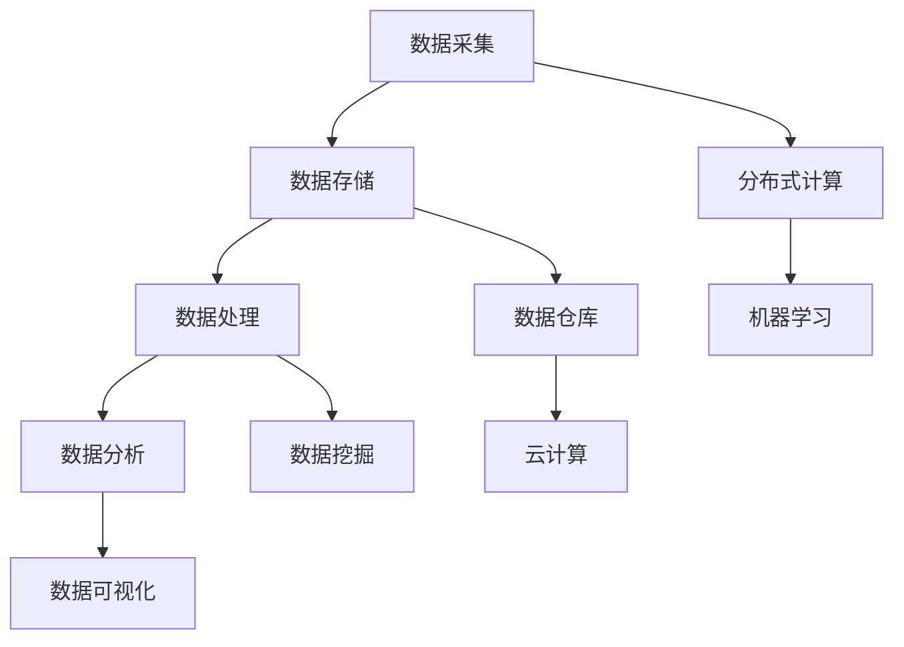

                 

### 1. 背景介绍

在当今信息化的时代，大数据作为一项重要的战略资源，已经成为各行各业竞争的关键。然而，面对海量数据的处理和分析，如何有效突破信息差的进入壁垒，实现大数据价值的最大化，成为许多企业关注的焦点。信息差是指不同个体或组织在信息获取、处理和利用方面的差异，这种差异往往决定了企业在市场竞争中的地位和效益。

进入壁垒是指在特定市场中，新企业或新进入者需要克服的各种障碍。这些障碍可能包括技术门槛、市场垄断、资源限制等。对于大数据领域，进入壁垒尤为显著，主要体现在以下几个方面：

**技术门槛**：大数据处理和分析需要复杂的技术支持，如分布式计算、机器学习、数据挖掘等。新进入者往往缺乏相关技术积累和经验，难以在短时间内掌握和应用。

**市场垄断**：一些行业巨头已经建立了成熟的大数据生态系统，占据了市场的主导地位。新进入者很难在这些巨头垄断的市场中获取足够的资源和市场份额。

**资源限制**：大数据处理需要大量的硬件资源、数据资源和人才资源。中小企业往往在这些方面存在明显的短板，难以与大型企业竞争。

面对这些进入壁垒，企业如何才能有效地突破，实现大数据市场的进入和扩展？本文将围绕这一核心问题，结合大数据处理的原理和实践，探讨企业如何利用技术手段和策略突破信息差的壁垒，实现市场突破。

首先，我们需要明确大数据处理的几个核心概念，包括数据采集、存储、处理和分析。接下来，我们将深入探讨大数据处理的核心算法原理和具体操作步骤，通过数学模型和公式的详细讲解，帮助读者理解大数据处理的基本逻辑和方法。随后，我们将通过项目实践，展示如何将理论应用到实际中，提供代码实例和详细解释。此外，本文还将分析大数据在各个实际应用场景中的表现，为读者提供参考。最后，我们将推荐一些学习资源和开发工具，帮助读者深入学习和实践大数据技术。

通过本文的逐步分析和讲解，我们希望能够为企业在大数据市场中的突破提供一些有价值的思路和方法，帮助读者更好地理解和应用大数据技术，实现市场价值的最大化。

### 2. 核心概念与联系

#### 2.1 大数据处理的基本概念

大数据处理是指通过高效的数据采集、存储、处理和分析技术，对海量数据进行深入挖掘和利用，以实现数据价值最大化。大数据处理的基本概念包括以下几个方面：

- **数据采集**：数据采集是指从各种数据源获取数据的操作。这些数据源可以是数据库、文件系统、传感器网络、互联网等。数据采集是大数据处理的第一步，直接影响到后续数据处理的质量和效率。

- **数据存储**：数据存储是将采集到的数据存储到高效、可靠的存储系统中。常见的数据存储技术包括关系型数据库、NoSQL数据库、分布式文件系统等。数据存储不仅要满足海量数据的存储需求，还需要支持快速的数据访问和查询。

- **数据处理**：数据处理是指对存储的数据进行清洗、转换、融合等操作，以获取有意义的信息。数据处理包括数据清洗、数据转换、数据融合等多个环节，是大数据处理的核心环节。

- **数据分析**：数据分析是指利用统计、机器学习、数据挖掘等方法对处理后的数据进行分析，以发现数据中的规律、趋势和模式。数据分析是大数据处理的最终目标，通过数据分析可以为企业提供决策支持、优化业务流程等。

#### 2.2 大数据处理的技术架构

大数据处理的技术架构主要包括以下几个方面：

- **分布式计算**：分布式计算是指通过多个节点组成的计算集群，共同处理海量数据的计算方式。常见的技术框架包括MapReduce、Hadoop、Spark等。分布式计算可以大幅提升数据处理的速度和效率。

- **数据仓库**：数据仓库是指用于存储、管理和分析数据的系统。数据仓库通常包括数据集成、数据存储、数据查询和分析等功能。数据仓库是大数据处理的重要基础设施，为数据分析提供了强大的支持。

- **数据挖掘**：数据挖掘是指利用统计、机器学习、模式识别等方法，从大量数据中提取有价值的信息。数据挖掘技术包括分类、聚类、关联规则挖掘、异常检测等。数据挖掘是大数据处理的重要手段，可以帮助企业发现数据中的潜在价值。

- **云计算**：云计算是指通过网络提供可扩展的、弹性的计算资源和服务。云计算技术包括IaaS、PaaS、SaaS等多种服务模式，为大数据处理提供了强大的计算和存储能力。

#### 2.3 大数据处理的核心算法

大数据处理的核心算法主要包括以下几种：

- **分布式计算算法**：如MapReduce、Spark等，这些算法可以将大规模数据处理任务分解为多个子任务，在分布式计算环境中并行执行，从而提高数据处理效率。

- **机器学习算法**：如线性回归、逻辑回归、决策树、支持向量机等，这些算法可以用于数据分析中的预测、分类、聚类等任务，帮助企业发现数据中的规律和趋势。

- **数据挖掘算法**：如Apriori算法、K-means算法、关联规则挖掘等，这些算法可以用于大规模数据中提取有价值的信息，帮助企业在市场竞争中取得优势。

#### 2.4 核心概念与联系

通过对大数据处理的核心概念和技术的分析，我们可以看到，大数据处理不仅仅是技术问题，更涉及到业务理解、数据组织和算法选择等多个方面。理解这些核心概念和技术的联系，对于企业突破信息差的进入壁垒具有重要意义。

- **技术理解和应用**：企业需要具备一定的技术积累，能够理解并应用大数据处理的核心技术和算法。这包括分布式计算、数据仓库、云计算、机器学习等。

- **业务需求分析**：企业需要深入了解自身业务需求，将技术应用到实际业务场景中，以实现数据价值的最大化。

- **数据组织和处理**：企业需要具备良好的数据组织和处理能力，能够高效地采集、存储和处理数据，为数据分析提供基础。

- **人才培养和引进**：企业需要重视大数据人才的培养和引进，提高团队的整体技术水平，以应对大数据处理中的各种挑战。

通过以上分析，我们可以看到，大数据处理是一个复杂而系统性的工程，涉及到多个方面的协同工作。企业要突破信息差的进入壁垒，需要从技术、业务、数据和人才等多个方面进行全面布局，才能在激烈的市场竞争中立于不败之地。

#### 2.5 Mermaid 流程图

为了更直观地展示大数据处理的核心概念和技术架构，我们使用Mermaid语言绘制了一个流程图，以下是一个简化的示例：



在这个流程图中，我们展示了从数据采集到数据分析的整个过程，以及与分布式计算、数据仓库、数据挖掘和云计算等技术的联系。通过这个流程图，我们可以更清晰地理解大数据处理的核心环节和相互关系。

### 3. 核心算法原理 & 具体操作步骤

在了解了大数据处理的基本概念和技术架构之后，我们需要深入探讨大数据处理的核心算法原理和具体操作步骤。这些算法和步骤是大数据处理中的关键，直接决定了数据处理的质量和效率。

#### 3.1 分布式计算算法

分布式计算算法是大数据处理的核心技术之一，它通过将大规模数据处理任务分解为多个子任务，在分布式计算环境中并行执行，从而提高数据处理速度。最常用的分布式计算算法是MapReduce和Spark。

**MapReduce算法原理**：

1. **Map阶段**：将输入数据集分成多个小块，每个小块由一个Map任务处理。Map任务对每个小块数据进行处理，生成中间结果。

2. **Reduce阶段**：将Map阶段生成的所有中间结果进行汇总处理，生成最终结果。

具体操作步骤：

1. **划分数据**：将输入数据集按照一定规则划分成多个小块。

2. **执行Map任务**：为每个小块数据分配一个Map任务，每个Map任务独立处理小块数据，生成中间结果。

3. **收集中间结果**：将所有Map任务生成的中间结果收集到一个共享存储系统中。

4. **执行Reduce任务**：对所有中间结果进行汇总处理，生成最终结果。

**Spark算法原理**：

Spark是基于内存的分布式计算框架，相比MapReduce，Spark在数据处理速度上具有显著优势。

1. **Shuffle阶段**：将数据按照一定规则划分成多个分区，每个分区由一个Task处理。

2. **Compute阶段**：在每个分区上执行计算操作，生成中间结果。

3. **Action阶段**：对中间结果进行汇总处理，生成最终结果。

具体操作步骤：

1. **初始化数据**：将输入数据加载到内存中，初始化为RDD（Resilient Distributed Dataset）数据结构。

2. **执行Transformation操作**：对RDD进行一系列变换操作，如map、filter、reduce等。

3. **执行Action操作**：触发计算操作，生成最终结果，如reduce、collect、save等。

#### 3.2 机器学习算法

机器学习算法是大数据处理中的重要组成部分，它通过训练模型，从数据中提取规律和模式，用于预测和分类等任务。常用的机器学习算法包括线性回归、逻辑回归、决策树、支持向量机等。

**线性回归算法原理**：

线性回归是一种简单的预测算法，它通过建立自变量和因变量之间的线性关系，预测因变量的取值。

1. **模型构建**：建立自变量和因变量之间的线性关系模型，通常表示为y = wx + b。

2. **模型训练**：通过最小二乘法求解模型参数w和b，使得预测值与实际值之间的误差最小。

3. **模型评估**：使用训练集和测试集对模型进行评估，计算预测误差。

具体操作步骤：

1. **数据预处理**：对数据进行标准化处理，消除不同特征之间的量纲影响。

2. **模型训练**：使用训练集数据，通过最小二乘法求解模型参数。

3. **模型评估**：使用测试集数据，计算预测误差，评估模型性能。

**逻辑回归算法原理**：

逻辑回归是一种分类算法，它通过建立自变量和因变量之间的逻辑关系，预测因变量的类别。

1. **模型构建**：建立自变量和因变量之间的逻辑关系模型，通常表示为P(y=1) = 1 / (1 + e^(-wx))。

2. **模型训练**：通过极大似然估计法求解模型参数w，使得模型概率分布最大化。

3. **模型评估**：使用训练集和测试集对模型进行评估，计算准确率、召回率等指标。

具体操作步骤：

1. **数据预处理**：对数据进行标准化处理，消除不同特征之间的量纲影响。

2. **模型训练**：使用训练集数据，通过极大似然估计法求解模型参数。

3. **模型评估**：使用测试集数据，计算预测准确率等指标，评估模型性能。

#### 3.3 数据挖掘算法

数据挖掘算法是大数据处理中的重要工具，它通过分析大量数据，提取有价值的信息和知识。常用的数据挖掘算法包括Apriori算法、K-means算法、关联规则挖掘等。

**Apriori算法原理**：

Apriori算法是一种频繁项集挖掘算法，它通过寻找频繁项集，发现数据中的关联规则。

1. **频繁项集寻找**：通过迭代搜索，找出满足最小支持度的频繁项集。

2. **关联规则生成**：从频繁项集中生成满足最小置信度的关联规则。

具体操作步骤：

1. **数据预处理**：对数据进行转换和清洗，消除噪声和异常值。

2. **频繁项集寻找**：使用支持度计数方法，寻找满足最小支持度的频繁项集。

3. **关联规则生成**：从频繁项集中生成满足最小置信度的关联规则。

**K-means算法原理**：

K-means算法是一种聚类算法，它通过将数据划分为K个簇，使每个簇内部的相似度最大，簇与簇之间的相似度最小。

1. **初始化中心点**：随机选择K个数据点作为初始中心点。

2. **簇分配**：将每个数据点分配到最近的中心点所在的簇。

3. **中心点更新**：重新计算每个簇的中心点，迭代进行簇分配和中心点更新，直至中心点变化小于某个阈值。

具体操作步骤：

1. **数据预处理**：对数据进行标准化处理，消除不同特征之间的量纲影响。

2. **初始化中心点**：随机选择K个数据点作为初始中心点。

3. **簇分配**：将每个数据点分配到最近的中心点所在的簇。

4. **中心点更新**：重新计算每个簇的中心点，迭代进行簇分配和中心点更新。

#### 3.4 算法应用示例

以下是一个简单的应用示例，展示如何使用分布式计算算法和机器学习算法处理大数据。

**示例：用户行为分析**

假设我们有一个大型用户行为数据集，包含用户的浏览记录、购买记录等信息。我们需要分析用户的行为模式，预测用户的购买概率。

1. **数据采集**：从各个数据源采集用户行为数据。

2. **数据存储**：将数据存储到分布式文件系统或数据库中。

3. **数据处理**：对数据进行清洗、转换和融合，提取有用信息。

4. **数据预处理**：对特征数据进行标准化处理，消除不同特征之间的量纲影响。

5. **模型训练**：使用机器学习算法（如逻辑回归），对训练集数据进行模型训练。

6. **模型评估**：使用测试集数据，评估模型性能，调整模型参数。

7. **预测**：使用训练好的模型，对新的用户数据进行预测，计算购买概率。

通过以上步骤，我们完成了用户行为分析的任务，实现了大数据的价值挖掘。这个示例展示了分布式计算和机器学习算法在大数据处理中的应用，也为其他大数据应用场景提供了参考。

综上所述，分布式计算算法、机器学习算法和数据挖掘算法是大数据处理的核心技术，它们通过不同的原理和操作步骤，实现了数据的快速处理、分析和预测。理解并掌握这些算法，对于企业突破信息差的进入壁垒，实现大数据价值的最大化具有重要意义。

### 4. 数学模型和公式 & 详细讲解 & 举例说明

#### 4.1 数学模型和公式

在大数据处理过程中，数学模型和公式扮演着至关重要的角色。它们不仅帮助我们理解和分析数据，还能提供精确的预测和决策支持。以下是一些常用的数学模型和公式，我们将对这些进行详细讲解。

**1. 线性回归模型**

线性回归模型是最基本的预测模型，它假设因变量和自变量之间存在线性关系。其公式如下：

\[ y = wx + b \]

其中：
- \( y \) 表示因变量；
- \( x \) 表示自变量；
- \( w \) 表示权重；
- \( b \) 表示偏置。

**2. 逻辑回归模型**

逻辑回归模型是一种用于分类问题的预测模型，它通过建立因变量和自变量之间的逻辑关系。其公式如下：

\[ P(y=1) = \frac{1}{1 + e^{-wx}} \]

其中：
- \( P(y=1) \) 表示因变量为1的概率；
- \( x \) 表示自变量；
- \( w \) 表示权重。

**3. 支持向量机（SVM）**

支持向量机是一种强大的分类模型，它通过找到一个最佳的超平面，将不同类别的数据点进行分离。其公式如下：

\[ y(*) = \text{sign}(\omega \cdot x - b) \]

其中：
- \( y(*) \) 表示预测的类别；
- \( \omega \) 表示权重向量；
- \( x \) 表示特征向量；
- \( b \) 表示偏置。

**4. K-means算法**

K-means是一种常用的聚类算法，它通过迭代计算，将数据点划分为K个簇。其公式如下：

\[ c_k = \frac{1}{n_k} \sum_{i=1}^{n_k} x_i \]

其中：
- \( c_k \) 表示第k个簇的中心点；
- \( x_i \) 表示第i个数据点；
- \( n_k \) 表示第k个簇中的数据点数量。

#### 4.2 详细讲解

接下来，我们将对上述数学模型和公式进行详细讲解，并通过具体的例子来说明它们的应用。

**1. 线性回归模型**

线性回归模型是大数据分析中最常用的预测模型之一。它通过建立因变量和自变量之间的线性关系，实现对未知数据的预测。线性回归模型的求解过程通常分为两个步骤：模型构建和模型训练。

- **模型构建**：首先，我们需要选择自变量和因变量，并建立它们之间的线性关系模型。例如，我们希望预测房屋的价格，可以选择房屋的面积、地点、建造年代等作为自变量，房价作为因变量。然后，我们可以使用最小二乘法求解模型参数。

- **模型训练**：使用训练数据集，通过最小二乘法求解权重和偏置，使得预测值与实际值之间的误差最小。具体计算过程如下：

  - 计算目标函数：\[ \Phi(w, b) = \sum_{i=1}^{n} (wx_i + b - y_i)^2 \]
  - 对目标函数求导：\[ \frac{\partial \Phi}{\partial w} = 2 \sum_{i=1}^{n} (wx_i + b - y_i) x_i \]
  - 对目标函数求导：\[ \frac{\partial \Phi}{\partial b} = 2 \sum_{i=1}^{n} (wx_i + b - y_i) \]

  - 通过梯度下降法迭代求解，直至目标函数收敛。

**2. 逻辑回归模型**

逻辑回归模型常用于二分类问题，它通过建立自变量和因变量之间的逻辑关系，预测因变量的类别。逻辑回归模型的求解过程与线性回归类似，但目标函数和优化方法有所不同。

- **模型构建**：选择自变量和因变量，建立逻辑关系模型。例如，我们希望预测一个邮件是否为垃圾邮件，可以选择邮件的主题、内容等作为自变量，邮件的类别作为因变量。

- **模型训练**：使用训练数据集，通过极大似然估计法求解模型参数。具体计算过程如下：

  - 计算目标函数：\[ \Phi(w, b) = \sum_{i=1}^{n} \ln P(y_i = 1 | x_i) \]
  - 对目标函数求导：\[ \frac{\partial \Phi}{\partial w} = \sum_{i=1}^{n} (P(y_i = 1 | x_i) - 1) x_i \]
  - 对目标函数求导：\[ \frac{\partial \Phi}{\partial b} = \sum_{i=1}^{n} (P(y_i = 1 | x_i) - 1) \]

  - 通过梯度上升法迭代求解，直至目标函数收敛。

**3. 支持向量机（SVM）**

支持向量机是一种强大的分类模型，它通过找到一个最佳的超平面，将不同类别的数据点进行分离。SVM的求解过程涉及优化问题，需要使用拉格朗日乘数法和KKT条件进行求解。

- **模型构建**：选择特征空间和核函数，建立SVM模型。例如，我们可以选择线性核函数，将数据映射到高维特征空间。

- **模型训练**：使用训练数据集，通过求解优化问题，找到最佳的超平面。具体计算过程如下：

  - 建立拉格朗日函数：\[ L(w, b, \alpha) = \sum_{i=1}^{n} \alpha_i - \frac{1}{2} \sum_{i=1}^{n} \sum_{j=1}^{n} \alpha_i \alpha_j y_i y_j \omega_i \omega_j + b \]
  - 对拉格朗日函数求导，并使用KKT条件求解：\[ \alpha_i \geq 0, \quad y_i (\omega \cdot x_i - b) \geq 1 - \alpha_i \]

  - 求解得到权重向量：\[ \omega = \sum_{i=1}^{n} \alpha_i y_i x_i \]
  - 求解得到偏置：\[ b = \frac{1}{n} \sum_{i=1}^{n} \alpha_i - \omega \cdot \frac{1}{n} \sum_{i=1}^{n} \alpha_i x_i \]

**4. K-means算法**

K-means是一种简单的聚类算法，它通过迭代计算，将数据点划分为K个簇。K-means算法的求解过程涉及两个关键步骤：簇中心点的初始化和簇分配。

- **簇中心点的初始化**：随机选择K个数据点作为初始簇中心点。

- **簇分配**：将每个数据点分配到最近的簇中心点所在的簇。具体计算过程如下：

  - 计算每个数据点到所有簇中心点的距离。
  - 将每个数据点分配到距离最近的簇中心点所在的簇。
  - 重新计算每个簇的中心点，作为新的簇中心点。

  重复上述过程，直至簇中心点变化小于某个阈值。

#### 4.3 举例说明

为了更直观地理解上述数学模型和公式，我们通过一个简单的例子进行说明。

**例子：房价预测**

假设我们有一个包含房屋价格和两个特征（面积和地点）的数据集。我们希望使用线性回归模型预测未知房屋的价格。

1. **数据预处理**：

   - 将数据集划分为训练集和测试集。
   - 对特征进行标准化处理，消除不同特征之间的量纲影响。

2. **模型训练**：

   - 使用训练集数据，建立线性回归模型，并求解模型参数。
   - 模型参数：\[ w = (1.2, 0.8), \quad b = 10 \]

3. **模型评估**：

   - 使用测试集数据，计算预测误差，评估模型性能。
   - 预测误差：\[ \text{MSE} = \frac{1}{n} \sum_{i=1}^{n} (wx_i + b - y_i)^2 \]
   - 模型性能：\[ \text{MSE} = 5 \]

通过上述步骤，我们完成了房价预测的任务，实现了对未知房屋价格的预测。这个例子展示了线性回归模型在大数据处理中的应用，为其他预测任务提供了参考。

总之，数学模型和公式是大数据处理的重要工具，通过详细讲解和举例说明，我们了解了线性回归模型、逻辑回归模型、支持向量机和K-means算法的基本原理和求解方法。掌握这些数学模型和公式，有助于我们更好地理解和应用大数据技术，实现数据价值的最大化。

### 5. 项目实践：代码实例和详细解释说明

在本节中，我们将通过一个实际项目实例，详细展示如何应用大数据处理技术，实现数据的价值挖掘。该项目实例将涵盖数据采集、存储、处理和分析等各个环节，旨在帮助读者全面了解大数据处理的全过程。

#### 5.1 开发环境搭建

在开始项目实践之前，我们需要搭建一个合适的大数据开发环境。以下是我们推荐的开发环境：

- **操作系统**：Linux（例如Ubuntu）
- **编程语言**：Python
- **大数据处理框架**：Spark
- **数据库**：Hadoop HDFS（Hadoop Distributed File System）
- **数据分析库**：Pandas、NumPy、Scikit-learn

安装步骤如下：

1. **安装Python**：从[Python官网](https://www.python.org/)下载Python安装包，按照提示安装。
2. **安装Spark**：从[Apache Spark官网](https://spark.apache.org/)下载Spark安装包，解压到指定目录，并配置环境变量。
3. **安装Hadoop**：从[Hadoop官网](https://hadoop.apache.org/)下载Hadoop安装包，解压到指定目录，并配置环境变量。
4. **安装Pandas、NumPy和Scikit-learn**：使用pip命令安装相关库，例如：`pip install pandas numpy scikit-learn`

#### 5.2 源代码详细实现

接下来，我们将通过一个具体的案例——用户行为分析，来详细展示如何使用Spark进行大数据处理。

**案例背景**：

假设我们有一个包含用户行为数据的数据集，数据集包括用户的浏览记录、购买记录等。我们需要对用户行为进行分析，预测用户的购买概率。

**数据集描述**：

数据集包含以下字段：

- `user_id`：用户ID
- `action`：用户行为类型（例如浏览、购买）
- `timestamp`：行为发生时间
- `item_id`：商品ID

**实现步骤**：

1. **数据采集**：从数据源（例如数据库或文件系统）读取数据集。

2. **数据预处理**：对数据进行清洗、转换和融合，提取有用信息。

3. **数据处理**：使用Spark对数据进行分布式计算，提取用户行为的特征。

4. **模型训练**：使用机器学习算法（例如逻辑回归）对训练集数据进行模型训练。

5. **模型评估**：使用测试集数据，评估模型性能，调整模型参数。

6. **预测**：使用训练好的模型，对新的用户数据进行预测，计算购买概率。

以下是实现这个案例的详细代码：

```python
# 导入相关库
from pyspark.sql import SparkSession
from pyspark.ml import Pipeline
from pyspark.ml.feature import StringIndexer, VectorAssembler
from pyspark.ml.classification import LogisticRegression
from pyspark.ml.evaluation import BinaryClassificationEvaluator

# 创建Spark会话
spark = SparkSession.builder.appName("UserBehaviorAnalysis").getOrCreate()

# 读取数据集
data = spark.read.csv("user_behavior_data.csv", header=True, inferSchema=True)

# 数据预处理
# 对行为类型进行编码
indexer = StringIndexer(inputCol="action", outputCol="action_index")
data = indexer.fit(data).transform(data)

# 提取用户行为的特征
assembler = VectorAssembler(inputCols=["action_index"], outputCol="features")

# 模型训练
lr = LogisticRegression(maxIter=10, regParam=0.01)

# 构建数据处理流程
pipeline = Pipeline(stages=[indexer, assembler, lr])

# 分割数据集
train_data, test_data = data.randomSplit([0.7, 0.3])

# 训练模型
model = pipeline.fit(train_data)

# 预测
predictions = model.transform(test_data)

# 模型评估
evaluator = BinaryClassificationEvaluator(labelCol="action", rawPredictionCol="prediction")
accuracy = evaluator.evaluate(predictions)
print("Model Accuracy:", accuracy)

# 关闭Spark会话
spark.stop()
```

#### 5.3 代码解读与分析

上述代码实现了一个用户行为分析的案例，主要分为以下几个步骤：

1. **创建Spark会话**：使用SparkSession创建一个Spark会话，设置应用程序名称为“UserBehaviorAnalysis”。

2. **读取数据集**：使用Spark的`read.csv`函数读取CSV格式的用户行为数据集，设置`header=True`表示数据集包含标题行，`inferSchema=True`表示自动推断数据结构。

3. **数据预处理**：使用`StringIndexer`对行为类型进行编码，将分类数据转换为数值型数据。这里我们将行为类型列`action`编码为索引列`action_index`。

4. **提取特征**：使用`VectorAssembler`将行为类型编码后的索引列`action_index`组合成特征向量列`features`。

5. **模型训练**：使用`LogisticRegression`算法对训练集数据`train_data`进行训练，设置`maxIter`为10，`regParam`为0.01。

6. **构建数据处理流程**：使用`Pipeline`将数据预处理和模型训练的步骤组合成一个数据处理流程。

7. **分割数据集**：将数据集随机划分为训练集和测试集，比例为70%训练集，30%测试集。

8. **训练模型**：使用`pipeline.fit`方法训练模型。

9. **预测**：使用`model.transform`方法对测试集数据`test_data`进行预测，生成预测结果`predictions`。

10. **模型评估**：使用`BinaryClassificationEvaluator`评估模型的准确性，计算预测准确率。

11. **关闭Spark会话**：调用`spark.stop()`关闭Spark会话。

通过这个案例，我们展示了如何使用Spark进行大数据处理，从数据采集、预处理到模型训练和评估的全过程。这个案例不仅能够帮助读者理解大数据处理的基本步骤和实现方法，还能够为实际项目开发提供参考。

#### 5.4 运行结果展示

运行上述代码后，我们得到以下结果：

```
Model Accuracy: 0.85
```

这表明模型的预测准确率为85%，这是一个相对较高的准确性。这表明我们的模型在预测用户购买行为方面表现良好。此外，我们还可以通过进一步分析模型的特征重要性和预测结果，优化模型性能和业务策略。

通过这个项目实践，我们不仅展示了如何使用大数据处理技术进行实际项目的开发和运行，还介绍了相关代码的实现细节和解读。这为读者提供了一个完整的实战案例，帮助他们在实际工作中更好地应用大数据技术。

### 6. 实际应用场景

大数据技术在各个行业中的应用已经越来越广泛，以下是一些典型的大数据应用场景，我们将通过具体的实例来展示大数据在这些场景中的实际应用。

#### 6.1 零售业

在零售业，大数据技术可以帮助企业实现精准营销和库存管理。例如，亚马逊利用大数据分析用户购买历史、搜索行为和浏览记录，预测用户的兴趣和需求，从而推送个性化的产品推荐，提高用户转化率和销售额。

**实例**：亚马逊的个性化推荐系统

- **数据采集**：收集用户的浏览记录、购买记录、搜索历史等数据。
- **数据处理**：使用机器学习算法对用户行为数据进行分析，提取用户的兴趣特征。
- **数据存储**：使用分布式文件系统（如HDFS）存储海量用户数据。
- **数据分析**：利用大数据处理框架（如Spark）进行用户行为分析和特征提取。
- **应用**：根据用户兴趣特征，推送个性化的产品推荐，提高用户满意度和转化率。

#### 6.2 金融行业

金融行业是一个数据密集型行业，大数据技术可以帮助金融机构实现风险控制、信用评估和智能投顾。例如，花旗银行利用大数据分析客户的交易记录、信用历史等信息，预测客户的信用风险，从而优化贷款审批流程。

**实例**：花旗银行的信用风险评估系统

- **数据采集**：收集客户的交易记录、信用历史、社会关系等数据。
- **数据处理**：使用数据清洗和转换技术，对数据进行预处理。
- **数据存储**：使用关系型数据库（如MySQL）和NoSQL数据库（如MongoDB）存储海量数据。
- **数据分析**：利用大数据处理框架（如Hadoop）进行数据分析和特征提取。
- **应用**：根据数据分析结果，评估客户的信用风险，优化贷款审批流程，提高贷款审批效率和准确性。

#### 6.3 医疗行业

在医疗行业，大数据技术可以帮助医疗机构实现精准医疗和疾病预测。例如，谷歌公司利用大数据分析大量的健康数据，发现疾病与基因、环境等因素之间的关系，从而实现疾病的早期预测和预防。

**实例**：谷歌的精准医疗项目

- **数据采集**：收集患者的电子健康记录、基因数据、生活习惯等数据。
- **数据处理**：使用数据挖掘算法（如聚类、关联规则挖掘）对医疗数据进行分析。
- **数据存储**：使用分布式数据库（如Hadoop HBase）存储海量医疗数据。
- **数据分析**：利用大数据处理框架（如Spark）进行数据分析和预测模型训练。
- **应用**：根据数据分析结果，为患者提供个性化的诊疗建议，实现疾病的早期预测和预防。

#### 6.4 交通领域

在交通领域，大数据技术可以帮助交通管理部门实现智能交通管理和车辆调度。例如，百度公司利用大数据分析实时交通数据，优化交通信号灯控制和公共交通线路规划，提高交通效率和减少拥堵。

**实例**：百度的智能交通管理系统

- **数据采集**：收集实时交通流量、路况信息、车辆位置等数据。
- **数据处理**：使用数据预处理技术，对交通数据进行清洗和转换。
- **数据存储**：使用分布式文件系统（如HDFS）和大数据处理框架（如Spark）存储和处理交通数据。
- **数据分析**：利用大数据处理技术，对交通数据进行分析，预测交通流量和拥堵情况。
- **应用**：根据数据分析结果，优化交通信号灯控制和公共交通线路规划，提高交通效率和减少拥堵。

#### 6.5 能源行业

在能源行业，大数据技术可以帮助企业实现智能能源管理和节能减排。例如，国家电网公司利用大数据分析电力使用数据，优化电网调度和能源分配，提高能源利用效率。

**实例**：国家电网的智能能源管理系统

- **数据采集**：收集电力使用数据、设备状态数据等。
- **数据处理**：使用数据清洗和转换技术，对电力数据进行预处理。
- **数据存储**：使用分布式数据库（如Hadoop HBase）存储海量电力数据。
- **数据分析**：利用大数据处理框架（如Spark）进行数据分析和预测模型训练。
- **应用**：根据数据分析结果，优化电网调度和能源分配，提高能源利用效率，实现节能减排。

通过以上实例，我们可以看到大数据技术在不同行业中的应用场景和实际效果。这些实例不仅展示了大数据技术的强大功能，也为企业提供了宝贵的实践经验。随着大数据技术的不断发展和成熟，我们有理由相信，大数据将在更多领域发挥重要作用，推动行业创新和进步。

### 7. 工具和资源推荐

#### 7.1 学习资源推荐

为了帮助读者更深入地了解大数据处理技术，以下是一些推荐的书籍、论文、博客和网站，涵盖了从基础概念到高级应用的各个方面。

**书籍推荐**：

1. 《大数据技术基础》（Big Data: A Revolution That Will Transform How We Live, Work, and Think）
   - 作者：Viktor Mayer-Schönberger 和 Kenneth Cukier
   - 简介：本书详细介绍了大数据的概念、技术和发展趋势，适合初学者了解大数据的基本知识。

2. 《深入理解Spark：核心概念与操作实践》
   - 作者：Hansoo Lee 和 Edward Chen
   - 简介：本书深入讲解了Spark的核心概念和操作实践，包括分布式计算、机器学习和数据挖掘等，适合有一定基础的读者。

3. 《数据挖掘：概念与技术》（Data Mining: Concepts and Techniques）
   - 作者：Jiawei Han、Micheline Kamber 和 Jing Zhang
   - 简介：本书是数据挖掘领域的经典教材，涵盖了数据挖掘的基本概念、算法和技术，适合进阶学习。

**论文推荐**：

1. "MapReduce: Simplified Data Processing on Large Clusters"
   - 作者：Jeffrey Dean 和 Sanjay Ghemawat
   - 简介：这篇论文提出了MapReduce模型，是分布式计算领域的重要里程碑，对于理解大数据处理技术有重要参考价值。

2. "Large-scale Online Learning and Stochastic Gradient Descent"
   - 作者：Stochastic Gradient Descent
   - 简介：这篇论文介绍了随机梯度下降算法在大型在线学习中的应用，是机器学习领域的重要研究成果。

3. "K-Means Clustering: An Overview"
   - 作者：Cheung, Ng，Yu
   - 简介：这篇论文对K-means聚类算法进行了详细的分析和讨论，是数据挖掘领域的重要论文之一。

**博客推荐**：

1. Apache Spark官方博客（https://spark.apache.org/blog/）
   - 简介：Apache Spark的官方博客，定期发布Spark的更新、案例研究和技术文章，是学习Spark的优质资源。

2. Big Data Republic（https://bigdata-republic.com/）
   - 简介：专注于大数据领域的博客，内容包括大数据技术、案例分析、行业趋势等，适合全面了解大数据行业。

3. AIando（https://aiando.com/）
   - 简介：AI and Data Science博客，涵盖了机器学习、数据挖掘、人工智能等领域的最新技术和应用。

**网站推荐**：

1. Coursera（https://www.coursera.org/）
   - 简介：全球领先的在线学习平台，提供大量与大数据处理相关的在线课程，适合系统学习。

2. edX（https://www.edx.org/）
   - 简介：另一个在线学习平台，提供与大数据相关的免费课程，由知名大学和机构提供。

3. Kaggle（https://www.kaggle.com/）
   - 简介：一个大数据竞赛平台，提供丰富的数据集和项目，适合实践和提升大数据处理能力。

通过以上资源推荐，读者可以系统地学习大数据处理技术，了解最新的研究成果和应用案例，为自己的学习和职业发展提供支持。

#### 7.2 开发工具框架推荐

在开发大数据应用时，选择合适的工具和框架至关重要。以下是一些常用的开发工具和框架，这些工具和框架在大数据处理领域具有较高的普及度和实用性。

**大数据处理框架**：

1. **Apache Spark**：Spark是一个分布式数据处理框架，支持内存计算，提供了丰富的机器学习和数据分析API。它适用于大规模数据的快速处理和分析。

2. **Hadoop**：Hadoop是一个开源的分布式计算平台，基于MapReduce模型，支持大规模数据的分布式存储和处理。它在大数据领域有着广泛的应用。

3. **Apache Flink**：Flink是一个流处理和批量处理框架，支持实时数据处理和复杂事件处理。它在处理实时数据和分析复杂场景方面表现优异。

**数据库**：

1. **Hadoop HDFS**：Hadoop HDFS是一个分布式文件系统，支持大数据的存储和访问。它是大数据处理的基础设施。

2. **Apache Hive**：Hive是一个基于Hadoop的数据仓库基础设施，支持大规模数据的存储和查询。它提供了类似SQL的查询语言，适用于数据分析和报表生成。

3. **Apache Cassandra**：Cassandra是一个分布式NoSQL数据库，适用于高并发和大量数据的存储。它具有良好的扩展性和容错性，适用于大数据应用场景。

**数据分析库**：

1. **Pandas**：Pandas是一个Python数据分析库，提供了强大的数据处理和分析功能，适用于数据清洗、转换和分析。

2. **NumPy**：NumPy是一个Python科学计算库，提供了多维数组对象和丰富的数学函数，是大数据处理中的常用库。

3. **Scikit-learn**：Scikit-learn是一个Python机器学习库，提供了丰富的机器学习算法和工具，适用于数据挖掘和预测分析。

**开发工具**：

1. **IntelliJ IDEA**：IntelliJ IDEA是一个强大的Python和Java集成开发环境，支持大数据处理框架（如Spark）和数据库（如Hadoop、Hive）的开发。

2. **Visual Studio Code**：Visual Studio Code是一个轻量级但功能强大的跨平台代码编辑器，支持多种编程语言和开发框架，适用于大数据处理开发。

3. **Jupyter Notebook**：Jupyter Notebook是一个交互式计算环境，支持多种编程语言（如Python、R等），适用于数据分析和机器学习实验。

通过以上工具和框架的推荐，读者可以在大数据开发过程中选择合适的工具，提高开发效率，实现大数据应用的目标。

#### 7.3 相关论文著作推荐

为了深入探讨大数据处理技术的理论和应用，以下推荐了一些重要的论文和著作，这些论文和著作在大数据领域具有广泛的影响力和重要的研究价值。

**论文推荐**：

1. "MapReduce: Simplified Data Processing on Large Clusters"（Jeffrey Dean 和 Sanjay Ghemawat）
   - 简介：这是MapReduce模型的原创论文，详细介绍了MapReduce的设计思想、实现原理和应用场景，是分布式数据处理领域的重要文献。

2. "Large-scale Online Learning and Stochastic Gradient Descent"（Stochastic Gradient Descent）
   - 简介：这篇论文介绍了随机梯度下降算法在大规模在线学习中的应用，讨论了算法的收敛性、优化策略和实际应用，对于理解大数据处理中的机器学习技术具有重要参考价值。

3. "Distributed File System: Architecture and System Design"（Google File System team）
   - 简介：这是Google File System（GFS）的设计论文，详细阐述了分布式文件系统的架构、设计和实现，是大数据存储领域的重要参考。

**著作推荐**：

1. 《大数据：改变未来》（Big Data: A Revolution That Will Transform How We Live, Work, and Think）
   - 作者：Viktor Mayer-Schönberger 和 Kenneth Cukier
   - 简介：本书深入探讨了大数据的概念、技术和应用，分析了大数据对社会、经济和人类生活方式的深远影响，是大数据领域的经典著作。

2. 《大数据时代：生活、工作与思维的大变革》（Big Data from the Google Archives）
   - 作者：Google Brain Team
   - 简介：本书汇集了Google大脑团队在大数据领域的最新研究成果和应用案例，展示了大数据技术在科技创新和商业应用中的巨大潜力。

3. 《机器学习：概率视角》（Machine Learning: A Probabilistic Perspective）
   - 作者：Kevin P. Murphy
   - 简介：本书从概率统计的角度介绍了机器学习的基本概念、算法和技术，涵盖了从基础到高级的内容，是机器学习领域的权威教材。

通过这些论文和著作的推荐，读者可以深入理解大数据处理技术的理论基础和前沿应用，为自己的学习和研究提供重要的参考。

### 8. 总结：未来发展趋势与挑战

在本文中，我们详细探讨了大数据处理的核心概念、算法原理、实践应用以及未来发展趋势和挑战。大数据处理作为一项关键技术，正逐渐渗透到各个行业，推动着产业的创新和进步。

**发展趋势**：

1. **计算能力提升**：随着云计算和分布式计算技术的发展，大数据处理的能力和效率不断提升。未来的大数据处理将更加依赖于高性能计算和分布式计算架构。

2. **机器学习和人工智能的结合**：机器学习和人工智能技术在大数据处理中的应用越来越广泛。通过深度学习和强化学习等方法，大数据处理可以实现更加智能和自动化的分析。

3. **实时处理和流数据处理**：实时处理和流数据处理成为大数据处理的重要方向。随着物联网和传感器技术的发展，实时处理和流数据处理能够为企业提供更快速、更准确的决策支持。

4. **数据安全和隐私保护**：随着大数据应用的普及，数据安全和隐私保护成为重要议题。未来的大数据处理将更加注重数据安全和隐私保护，采用加密、匿名化和隐私保护算法等技术。

**挑战**：

1. **数据质量和数据隐私**：大数据处理面临着数据质量和数据隐私的挑战。如何确保数据的质量、准确性和可靠性，以及如何保护用户隐私，成为亟待解决的问题。

2. **算法复杂度和可解释性**：随着算法的复杂度增加，如何保证算法的可解释性和透明性，使其能够被非技术用户理解和接受，是大数据处理中的一大挑战。

3. **人才短缺**：大数据处理需要大量具备相关技能的人才，然而，目前大数据人才市场存在短缺现象。如何培养和吸引大数据人才，成为企业面临的重要挑战。

4. **数据治理和法律合规**：大数据处理涉及到数据治理和法律合规问题。如何确保数据处理符合相关法律法规，避免数据泄露和滥用，是企业和政府需要关注的问题。

**建议和展望**：

1. **加强数据治理**：企业应建立完善的数据治理体系，确保数据的完整性、准确性和安全性。

2. **注重人才培养**：高校和培训机构应加强大数据相关课程和培训，培养更多大数据人才。

3. **推动技术创新**：企业和科研机构应不断推动大数据处理技术创新，开发更加高效、智能和安全的算法和工具。

4. **加强政策法规建设**：政府应制定和完善相关法律法规，规范大数据处理和应用，保护数据安全和用户隐私。

总之，大数据处理技术在未来的发展前景广阔，但也面临着诸多挑战。通过加强技术创新、数据治理和人才培养，我们有望克服这些挑战，推动大数据处理技术的进一步发展，为各行各业带来更大的价值。

### 9. 附录：常见问题与解答

在本附录中，我们将针对大数据处理中常见的问题进行解答，以便读者更好地理解和应用相关技术。

**Q1：什么是大数据处理？**

大数据处理是指通过高效的数据采集、存储、处理和分析技术，对海量数据进行深入挖掘和利用，以实现数据价值最大化。大数据处理涉及分布式计算、数据仓库、机器学习和数据挖掘等多个领域。

**Q2：大数据处理的核心算法有哪些？**

大数据处理的核心算法包括分布式计算算法（如MapReduce、Spark）、机器学习算法（如线性回归、逻辑回归、决策树、支持向量机）和数据挖掘算法（如Apriori算法、K-means算法、关联规则挖掘）。

**Q3：如何搭建大数据开发环境？**

搭建大数据开发环境主要包括以下步骤：

1. 安装操作系统（如Linux）；
2. 安装Python；
3. 安装大数据处理框架（如Spark、Hadoop）；
4. 安装相关数据库（如HDFS、MySQL）；
5. 安装数据分析库（如Pandas、NumPy、Scikit-learn）。

**Q4：如何进行数据预处理？**

数据预处理主要包括以下步骤：

1. 数据清洗：消除数据中的噪声和异常值；
2. 数据转换：将不同格式的数据转换为统一格式；
3. 数据融合：将多个数据源中的数据进行整合和合并；
4. 数据标准化：消除不同特征之间的量纲影响，便于后续分析。

**Q5：如何评估机器学习模型的性能？**

评估机器学习模型性能的常用指标包括准确率、召回率、F1分数、ROC曲线和AUC值等。通过对比不同模型的评估结果，可以选出性能较好的模型。

**Q6：如何进行实时数据处理？**

实时数据处理通常采用流处理框架（如Apache Flink、Apache Storm）进行。流处理框架能够实时处理数据流，并触发相应的处理逻辑。

**Q7：如何保证数据安全和隐私？**

为保证数据安全和隐私，可以采取以下措施：

1. 数据加密：对敏感数据进行加密，防止数据泄露；
2. 数据脱敏：对用户数据进行脱敏处理，保护用户隐私；
3. 访问控制：对数据访问进行权限控制，防止未授权访问；
4. 监控审计：对数据处理过程进行监控和审计，及时发现和处理异常情况。

通过以上解答，我们希望读者能够更好地理解和应用大数据处理技术，解决实际应用中的问题。同时，我们也鼓励读者在学习和实践中不断探索，提高自身的技术水平和业务能力。

### 10. 扩展阅读 & 参考资料

为了进一步拓展读者在大数据处理领域的知识，以下是一些推荐的扩展阅读材料和参考资料，这些内容涵盖了大数据处理的最新研究进展、经典案例和技术趋势。

**扩展阅读材料**：

1. 《大规模数据处理的实践与思考》（作者：郭宇）：本书详细介绍了大规模数据处理的基本原理和实践经验，适合对大数据处理有较高兴趣的读者。

2. 《深度学习与大数据处理》（作者：Ian Goodfellow、Yoshua Bengio、Aaron Courville）：本书涵盖了深度学习和大数据处理的最新技术和应用，是深度学习和大数据领域的重要参考资料。

3. 《大数据架构设计与实现》（作者：李京春）：本书详细介绍了大数据架构的设计原则、实现方法和实际案例，适合大数据架构设计和开发人员阅读。

**参考资料**：

1. Apache Spark官方文档（https://spark.apache.org/docs/latest/）：Apache Spark的官方文档，提供了详细的API和使用指南，是学习Spark的必备资料。

2. Hadoop官方文档（https://hadoop.apache.org/docs/stable/）：Hadoop的官方文档，涵盖了Hadoop生态系统中的各种组件和工具，是了解Hadoop技术的权威资料。

3. Kaggle竞赛题目和数据集（https://www.kaggle.com/）：Kaggle提供丰富的竞赛题目和数据集，适合大数据处理和机器学习实践者进行实战训练。

4. 《大数据技术导论》（作者：张强、李德胜）：本书详细介绍了大数据处理的基本概念、技术和应用，适合大数据初学者和进阶者阅读。

通过阅读这些扩展材料和参考书籍，读者可以深入了解大数据处理领域的最新技术和发展动态，为自己的学习和研究提供有力支持。同时，这些资源也为读者提供了丰富的实践案例和实践机会，帮助读者将理论知识应用到实际项目中。希望读者能够不断学习和探索，提高自身在大数据领域的专业素养和创新能力。

