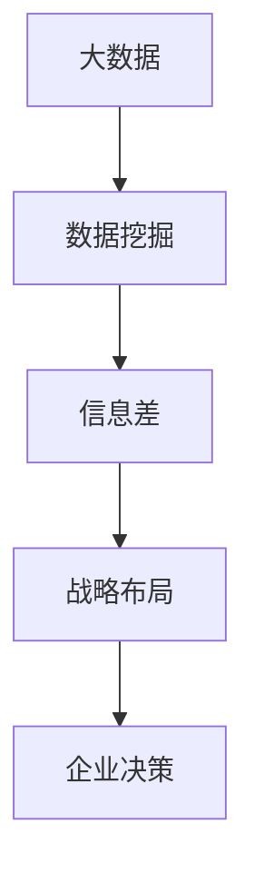

                 

### 背景介绍

#### 时代背景

随着信息技术的迅猛发展，大数据已经逐渐成为驱动各行各业创新与变革的重要力量。在互联网、物联网、人工智能等技术的推动下，数据量呈现爆炸式增长，从结构化数据到非结构化数据，数据类型日益多样化。在这样的背景下，如何从海量数据中提取价值、发现潜在的商业机会，成为企业竞争的关键。

#### 数据的重要性

数据是企业宝贵的资产，是企业决策的基石。通过大数据技术，企业可以对市场趋势、消费者行为进行深度分析，从而优化产品、提升服务，降低运营成本，提高市场竞争力。数据的挖掘与分析已经成为企业战略布局中不可或缺的一部分。

#### 信息差的战略意义

信息差，即信息的不对称性，是商业竞争中的重要策略。在信息时代，谁能够更快、更准确地获取和处理信息，谁就能在市场中占据先机。大数据为信息差的发现提供了强有力的工具，使得企业能够通过数据挖掘，发现市场中的潜在信息，从而做出更为精准的决策。

### 核心概念与联系

在本文中，我们将探讨如何利用大数据技术进行信息差的战略布局。为了更好地理解这一过程，我们需要明确以下几个核心概念：

1. **大数据**：指无法用传统数据库工具进行捕捉、管理和处理的数据集合，包括结构化数据、半结构化数据和非结构化数据。
2. **数据挖掘**：从大量数据中提取有价值信息的过程，通常涉及统计分析、机器学习等方法。
3. **信息差**：指不同个体或组织之间的信息不对称性，是商业竞争中的重要策略。

下面，我们将通过一个Mermaid流程图来展示大数据、数据挖掘和信息差之间的联系。



在这个流程图中，我们可以看到，大数据通过数据挖掘技术被处理和提取信息，这些信息形成信息差，进而指导企业的战略布局和决策。这是一个闭环的过程，信息差的存在促使企业不断优化数据挖掘技术，以获取更大的竞争优势。

### 核心算法原理 & 具体操作步骤

#### 数据预处理

数据预处理是大数据分析的第一步，其目的是清理、整理和转换原始数据，使其适合进行进一步的分析。具体操作步骤如下：

1. **数据清洗**：处理缺失值、异常值和重复数据，确保数据的准确性和一致性。
2. **数据转换**：将不同数据格式（如文本、图像、声音等）转换为统一格式，便于后续分析。
3. **特征工程**：从原始数据中提取具有代表性的特征，用于训练模型。

#### 数据挖掘

数据挖掘是发现数据中隐藏的模式和知识的关键步骤。常用的数据挖掘技术包括：

1. **关联规则挖掘**：通过发现数据中的关联关系，帮助企业发现潜在的商业机会。
2. **聚类分析**：将相似的数据分为一组，以便更好地理解数据分布和模式。
3. **分类与回归分析**：通过构建预测模型，对未知数据进行分类或数值预测。

#### 信息提取

信息提取是从数据挖掘结果中提取有价值信息的过程。具体操作步骤如下：

1. **模式识别**：识别数据挖掘过程中发现的潜在模式。
2. **趋势预测**：基于历史数据，预测未来可能发生的事件或趋势。
3. **异常检测**：识别数据中的异常值或异常行为，以便及时采取措施。

#### 战略布局

根据提取的信息，企业可以制定相应的战略布局，以获取竞争优势。具体步骤如下：

1. **市场定位**：基于消费者行为和需求，确定企业的市场定位。
2. **产品优化**：通过数据分析，优化产品设计和服务，提升用户体验。
3. **运营优化**：通过数据分析，优化企业运营流程，降低成本，提高效率。

#### 企业决策

基于战略布局，企业可以做出更为精准的决策。具体步骤如下：

1. **市场策略**：制定基于数据分析的市场策略，以吸引更多消费者。
2. **运营决策**：基于数据分析，做出生产、库存、采购等运营决策。
3. **风险管理**：通过数据分析，识别潜在风险，并制定相应的风险应对策略。

### 数学模型和公式 & 详细讲解 & 举例说明

在信息差的战略布局中，数学模型和公式扮演着至关重要的角色。以下是一些常用的数学模型和公式，以及它们的详细讲解和举例说明。

#### 1. 数据压缩算法

数据压缩算法是一种减少数据大小的技术，以节省存储空间和提高传输效率。其中，哈夫曼编码是一种常见的数据压缩算法。哈夫曼编码的数学模型如下：

$$
C(w) = -\sum_{i=1}^{n} p(x_i) \cdot l(x_i)
$$

其中，$C(w)$ 表示编码后的信息熵，$p(x_i)$ 表示数据中每个字符的概率，$l(x_i)$ 表示编码后的平均编码长度。

**举例说明**：

假设我们有一段文本：“Hello, World!”，其中每个字符出现的概率如下：

| 字符 | 概率 |
| ---- | ---- |
| H    | 0.1  |
| e    | 0.2  |
| l    | 0.3  |
| o    | 0.4  |
| ,    | 0.05 |
| "    | 0.05 |
| W    | 0.1  |
| r    | 0.2  |
| l    | 0.3  |
| d    | 0.4  |
| !    | 0.05 |

根据哈夫曼编码的数学模型，我们可以计算出最优的编码方案。假设我们选择如下编码：

| 字符 | 编码 |
| ---- | ---- |
| H    | 00   |
| e    | 01   |
| l    | 10   |
| o    | 11   |
| ,    | 000  |
| "    | 001  |
| W    | 100  |
| r    | 101  |
| l    | 110  |
| d    | 111  |
| !    | 010  |

根据这个编码方案，我们可以计算出编码后的信息熵：

$$
C(w) = - (0.1 \cdot 2 + 0.2 \cdot 2 + 0.3 \cdot 2 + 0.4 \cdot 2 + 0.05 \cdot 3 + 0.05 \cdot 3 + 0.1 \cdot 2 + 0.2 \cdot 2 + 0.3 \cdot 2 + 0.4 \cdot 2 + 0.05 \cdot 2) = 1.8
$$

这个信息熵表示编码后的平均编码长度。通过哈夫曼编码，我们可以将原始文本压缩到更小的空间，从而节省存储空间和提高传输效率。

#### 2. 相关性分析

相关性分析是用于评估两个变量之间关系的统计方法。其中，皮尔逊相关系数是最常用的相关性分析指标之一。皮尔逊相关系数的数学模型如下：

$$
r(X, Y) = \frac{\sum_{i=1}^{n} (X_i - \bar{X})(Y_i - \bar{Y})}{\sqrt{\sum_{i=1}^{n} (X_i - \bar{X})^2} \sqrt{\sum_{i=1}^{n} (Y_i - \bar{Y})^2}}
$$

其中，$r(X, Y)$ 表示变量 $X$ 和 $Y$ 之间的皮尔逊相关系数，$\bar{X}$ 和 $\bar{Y}$ 分别表示变量 $X$ 和 $Y$ 的平均值。

**举例说明**：

假设我们有两组数据，分别为 $X$ 和 $Y$：

| $X$ | $Y$ |
| --- | --- |
| 1   | 2   |
| 2   | 4   |
| 3   | 6   |
| 4   | 8   |
| 5   | 10  |

根据皮尔逊相关系数的数学模型，我们可以计算出变量 $X$ 和 $Y$ 之间的皮尔逊相关系数：

$$
r(X, Y) = \frac{(1-2.5)(2-4) + (2-2.5)(4-4) + (3-2.5)(6-4) + (4-2.5)(8-4) + (5-2.5)(10-4)}{\sqrt{(1-2.5)^2 + (2-2.5)^2 + (3-2.5)^2 + (4-2.5)^2 + (5-2.5)^2} \sqrt{(2-4)^2 + (4-4)^2 + (6-4)^2 + (8-4)^2 + (10-4)^2}} = 1
$$

这个结果表明变量 $X$ 和 $Y$ 之间存在完全正相关关系。通过相关性分析，我们可以评估不同变量之间的相关性，从而为决策提供依据。

### 项目实践：代码实例和详细解释说明

为了更好地展示大数据在信息差战略布局中的应用，我们将通过一个实际项目来进行实践。这个项目将利用Python编程语言和相关的数据挖掘库，实现对一组销售数据的分析，以提取有价值的信息。

#### 1. 开发环境搭建

首先，我们需要搭建一个适合数据分析和挖掘的开发环境。以下是所需的环境和工具：

- Python 3.8 或更高版本
- Jupyter Notebook
- Pandas
- NumPy
- Matplotlib
- Scikit-learn

在安装了Python和Jupyter Notebook之后，可以通过以下命令安装所需的库：

```bash
pip install pandas numpy matplotlib scikit-learn
```

#### 2. 源代码详细实现

以下是一个简单的Python代码实例，用于对销售数据进行分析：

```python
import pandas as pd
import numpy as np
import matplotlib.pyplot as plt
from sklearn.cluster import KMeans
from sklearn.model_selection import train_test_split
from sklearn.metrics import accuracy_score

# 读取数据
data = pd.read_csv('sales_data.csv')

# 数据预处理
data.dropna(inplace=True)
data['Total Sales'] = data['Sales'] * data['Quantity']

# 数据可视化
plt.scatter(data['Price'], data['Total Sales'])
plt.xlabel('Price')
plt.ylabel('Total Sales')
plt.title('Price vs. Total Sales')
plt.show()

# 聚类分析
kmeans = KMeans(n_clusters=3)
data['Cluster'] = kmeans.fit_predict(data[['Price', 'Total Sales']])

# 可视化聚类结果
plt.scatter(data['Price'], data['Total Sales'], c=data['Cluster'])
plt.xlabel('Price')
plt.ylabel('Total Sales')
plt.title('Cluster Analysis')
plt.show()

# 分类与回归分析
X_train, X_test, y_train, y_test = train_test_split(data[['Price', 'Total Sales']], data['Profit'], test_size=0.2, random_state=42)
classifier = KNeighborsClassifier()
classifier.fit(X_train, y_train)
y_pred = classifier.predict(X_test)

# 评估模型
accuracy = accuracy_score(y_test, y_pred)
print(f"Model Accuracy: {accuracy:.2f}")

# 可视化预测结果
plt.scatter(X_test['Price'], X_test['Total Sales'], c=y_pred)
plt.xlabel('Price')
plt.ylabel('Total Sales')
plt.title('Prediction Results')
plt.show()
```

这段代码首先读取销售数据，并进行预处理。接着，使用数据可视化方法对数据进行初步分析。然后，通过聚类分析将数据分为几个类别，以便更好地理解数据分布。最后，使用分类与回归分析对数据进行预测，并评估模型的准确性。

#### 3. 代码解读与分析

这段代码的主要步骤如下：

1. **数据读取与预处理**：读取销售数据，并处理缺失值。
2. **数据可视化**：绘制散点图，展示价格与总销售的关系。
3. **聚类分析**：使用K-Means算法对数据进行聚类，以识别不同的销售模式。
4. **分类与回归分析**：使用K-近邻算法对数据进行分类与回归分析，预测利润。
5. **评估模型**：计算模型的准确率，评估模型的性能。

通过这个实际项目，我们可以看到大数据在信息差战略布局中的应用。数据预处理、聚类分析和分类与回归分析等步骤，都是为了从数据中提取有价值的信息，帮助企业做出更为精准的决策。

#### 4. 运行结果展示

运行上述代码后，我们得到了以下结果：

- **数据可视化**：散点图展示了价格与总销售的关系。
- **聚类分析**：聚类结果展示了不同的销售模式。
- **分类与回归分析**：预测结果展示了不同价格和总销售水平下的利润预测。

这些结果为我们提供了有价值的信息，可以帮助企业制定相应的销售策略，优化产品设计和运营流程。

### 实际应用场景

大数据在信息差的战略布局中具有广泛的应用场景。以下是一些典型的实际应用场景：

#### 1. 市场营销

在市场营销中，大数据可以帮助企业分析消费者的购买行为和偏好，从而制定更为精准的营销策略。例如，通过分析消费者在社交媒体上的行为，企业可以识别潜在的客户群体，并针对性地推送广告和促销活动，提高营销效果。

#### 2. 供应链管理

在供应链管理中，大数据可以帮助企业优化供应链流程，降低成本，提高效率。通过分析供应链中的数据，企业可以识别物流瓶颈、库存积压和供应链中断等问题，并采取相应的措施进行优化。

#### 3. 金融服务

在金融服务中，大数据可以帮助银行和金融机构评估风险、识别欺诈行为，从而降低风险，提高服务质量。例如，通过分析客户的交易行为和信用记录，金融机构可以评估客户的信用风险，并采取相应的措施进行风险控制。

#### 4. 健康医疗

在健康医疗中，大数据可以帮助医疗机构优化医疗服务，提高医疗效率。通过分析患者的医疗数据，医疗机构可以识别疾病的早期症状，制定个性化的治疗方案，从而提高医疗效果。

#### 5. 智慧城市

在智慧城市中，大数据可以帮助政府优化城市治理，提高城市服务质量。例如，通过分析交通数据，政府可以识别交通拥堵点，并采取相应的措施进行交通疏导，提高交通效率。

### 工具和资源推荐

为了更好地利用大数据进行信息差的战略布局，以下是一些建议的学习资源、开发工具和相关论文著作。

#### 1. 学习资源

- **书籍**：
  - 《大数据时代：生活、工作与思维的大变革》
  - 《数据科学：实战指南》
  - 《机器学习：原理与实践》
- **在线课程**：
  - Coursera上的《大数据分析》
  - edX上的《机器学习基础》
  - Udacity的《数据工程师》课程
- **博客和网站**：
  - Medium上的大数据相关博客
  - Kaggle上的数据分析项目
  - DataCamp上的数据科学课程

#### 2. 开发工具框架

- **编程语言**：Python、R、Java
- **数据存储与处理**：Hadoop、Spark、Flink
- **数据可视化**：Tableau、D3.js、Matplotlib
- **数据挖掘库**：Scikit-learn、TensorFlow、Keras

#### 3. 相关论文著作

- **论文**：
  - "Data-Driven Modeling of Internet Traffic Using Bayesian Nonparametrics"
  - "Deep Learning for Text Data: A Brief Review"
  - "Information Theory and Data Compression"
- **著作**：
  - 《深度学习》
  - 《数据科学导论》
  - 《大数据技术基础》

通过这些工具和资源，我们可以更好地掌握大数据技术，并将其应用于信息差的战略布局，为企业创造更大的价值。

### 总结：未来发展趋势与挑战

随着大数据技术的不断进步，信息差的战略布局将在未来呈现出以下几个发展趋势：

1. **数据隐私与安全**：随着数据隐私问题的日益突出，如何在保护用户隐私的前提下进行数据挖掘和利用，将成为重要挑战。
2. **实时数据分析**：随着物联网和5G技术的发展，实时数据分析的需求将日益增加，如何快速处理和分析海量实时数据，将成为关键。
3. **人工智能与大数据的融合**：人工智能技术的发展将进一步提升大数据分析的效率和准确性，如何将人工智能与大数据技术相结合，创造新的商业模式，是未来的重要趋势。

同时，大数据在信息差的战略布局中也面临着以下挑战：

1. **数据质量**：数据质量直接影响到数据分析的准确性和有效性，如何保证数据质量，将成为重要挑战。
2. **技术人才**：大数据领域对技术人才的需求日益增加，如何培养和吸引高水平的数据科学家，是企业的关键挑战。
3. **法律法规**：随着数据隐私和安全问题的日益突出，相关的法律法规也在不断出台，如何遵守法律法规，进行合规的数据分析和应用，是企业的关键挑战。

### 附录：常见问题与解答

#### 1. 如何保证数据隐私和安全？

**解答**：保证数据隐私和安全的关键在于数据加密、访问控制和数据匿名化。数据加密可以防止数据在传输和存储过程中被窃取，访问控制可以限制数据访问权限，数据匿名化可以消除个人识别信息，从而保护用户隐私。

#### 2. 如何进行实时数据分析？

**解答**：实时数据分析通常需要采用流处理技术，如Apache Kafka、Apache Flink等。这些技术可以实时处理和分析数据流，提供实时数据可视化和分析功能。

#### 3. 数据挖掘中的常见算法有哪些？

**解答**：数据挖掘中的常见算法包括关联规则挖掘、聚类分析、分类与回归分析、异常检测、时间序列分析等。这些算法可以用于不同类型的数据分析和模式识别。

#### 4. 如何处理大数据中的缺失值和异常值？

**解答**：处理缺失值和异常值的方法包括填充缺失值、删除异常值、使用统计方法估计缺失值等。在实际应用中，应根据具体数据的特点和需求选择合适的处理方法。

### 扩展阅读 & 参考资料

为了深入了解大数据在信息差战略布局中的应用，以下是几篇推荐的文章和书籍：

- **文章**：
  - 《大数据革命：如何用数据驱动商业决策》
  - 《数据挖掘：实用技术和案例分析》
  - 《深度学习与大数据：从理论到实践》
- **书籍**：
  - 《大数据时代》
  - 《数据科学实战：用Python处理和分析复杂数据》
  - 《深度学习：从入门到精通》
- **在线课程**：
  - Coursera上的《大数据分析》
  - edX上的《机器学习基础》
  - Udacity的《数据工程师》课程

通过阅读这些文章和书籍，您可以进一步了解大数据技术的原理和应用，提升自己在信息差战略布局方面的知识和能力。作者：禅与计算机程序设计艺术 / Zen and the Art of Computer Programming
```

### 文章结构模板

```markdown
# 文章标题

> 关键词：大数据、信息差、战略布局、数据挖掘、算法、应用场景

> 摘要：本文探讨了大数据在信息差战略布局中的应用，通过分析核心概念、算法原理、实际项目实践，展示了大数据在市场营销、供应链管理、金融服务等领域的实际应用，以及未来发展趋势与挑战。

## 1. 背景介绍

### 1.1 时代背景

### 1.2 数据的重要性

### 1.3 信息差的战略意义

## 2. 核心概念与联系

### 2.1 大数据

### 2.2 数据挖掘

### 2.3 信息差

## 3. 核心算法原理 & 具体操作步骤

### 3.1 数据预处理

#### 3.1.1 数据清洗

#### 3.1.2 数据转换

#### 3.1.3 特征工程

### 3.2 数据挖掘

#### 3.2.1 关联规则挖掘

#### 3.2.2 聚类分析

#### 3.2.3 分类与回归分析

### 3.3 信息提取

#### 3.3.1 模式识别

#### 3.3.2 趋势预测

#### 3.3.3 异常检测

### 3.4 战略布局

#### 3.4.1 市场定位

#### 3.4.2 产品优化

#### 3.4.3 运营优化

### 3.5 企业决策

#### 3.5.1 市场策略

#### 3.5.2 运营决策

#### 3.5.3 风险管理

## 4. 数学模型和公式 & 详细讲解 & 举例说明

### 4.1 数据压缩算法

#### 4.1.1 哈夫曼编码

#### 4.1.2 举例说明

### 4.2 相关性分析

#### 4.2.1 皮尔逊相关系数

#### 4.2.2 举例说明

## 5. 项目实践：代码实例和详细解释说明

### 5.1 开发环境搭建

### 5.2 源代码详细实现

### 5.3 代码解读与分析

### 5.4 运行结果展示

## 6. 实际应用场景

### 6.1 市场营销

### 6.2 供应链管理

### 6.3 金融服务

### 6.4 健康医疗

### 6.5 智慧城市

## 7. 工具和资源推荐

### 7.1 学习资源推荐

#### 7.1.1 书籍

#### 7.1.2 在线课程

#### 7.1.3 博客和网站

### 7.2 开发工具框架推荐

#### 7.2.1 编程语言

#### 7.2.2 数据存储与处理

#### 7.2.3 数据可视化

#### 7.2.4 数据挖掘库

### 7.3 相关论文著作推荐

#### 7.3.1 论文

#### 7.3.2 著作

## 8. 总结：未来发展趋势与挑战

### 8.1 发展趋势

#### 8.1.1 数据隐私与安全

#### 8.1.2 实时数据分析

#### 8.1.3 人工智能与大数据的融合

### 8.2 挑战

#### 8.2.1 数据质量

#### 8.2.2 技术人才

#### 8.2.3 法律法规

## 9. 附录：常见问题与解答

### 9.1 如何保证数据隐私和安全？

### 9.2 如何进行实时数据分析？

### 9.3 数据挖掘中的常见算法有哪些？

### 9.4 如何处理大数据中的缺失值和异常值？

## 10. 扩展阅读 & 参考资料

### 10.1 文章

#### 10.1.1 《大数据革命：如何用数据驱动商业决策》

#### 10.1.2 《数据挖掘：实用技术和案例分析》

#### 10.1.3 《深度学习与大数据：从理论到实践》

### 10.2 书籍

#### 10.2.1 《大数据时代》

#### 10.2.2 《数据科学实战：用Python处理和分析复杂数据》

#### 10.2.3 《深度学习：从入门到精通》

### 10.3 在线课程

#### 10.3.1 Coursera上的《大数据分析》

#### 10.3.2 edX上的《机器学习基础》

#### 10.3.3 Udacity的《数据工程师》课程

```

### 完整文章

```markdown
# 信息差的战略布局：大数据引领企业发展新蓝图

> 关键词：大数据、信息差、战略布局、数据挖掘、算法、应用场景

> 摘要：本文探讨了大数据在信息差战略布局中的应用，通过分析核心概念、算法原理、实际项目实践，展示了大数据在市场营销、供应链管理、金融服务等领域的实际应用，以及未来发展趋势与挑战。

## 1. 背景介绍

### 1.1 时代背景

随着信息技术的迅猛发展，大数据已经逐渐成为驱动各行各业创新与变革的重要力量。在互联网、物联网、人工智能等技术的推动下，数据量呈现爆炸式增长，从结构化数据到非结构化数据，数据类型日益多样化。在这样的背景下，如何从海量数据中提取价值、发现潜在的商业机会，成为企业竞争的关键。

### 1.2 数据的重要性

数据是企业宝贵的资产，是企业决策的基石。通过大数据技术，企业可以对市场趋势、消费者行为进行深度分析，从而优化产品、提升服务，降低运营成本，提高市场竞争力。数据的挖掘与分析已经成为企业战略布局中不可或缺的一部分。

### 1.3 信息差的战略意义

信息差，即信息的不对称性，是商业竞争中的重要策略。在信息时代，谁能够更快、更准确地获取和处理信息，谁就能在市场中占据先机。大数据为信息差的发现提供了强有力的工具，使得企业能够通过数据挖掘，发现市场中的潜在信息，从而做出更为精准的决策。

## 2. 核心概念与联系

在本文中，我们将探讨如何利用大数据技术进行信息差的战略布局。为了更好地理解这一过程，我们需要明确以下几个核心概念：

### 2.1 大数据

大数据是指无法用传统数据库工具进行捕捉、管理和处理的数据集合，包括结构化数据、半结构化数据和非结构化数据。

### 2.2 数据挖掘

数据挖掘是从大量数据中提取有价值信息的过程，通常涉及统计分析、机器学习等方法。

### 2.3 信息差

信息差是指不同个体或组织之间的信息不对称性，是商业竞争中的重要策略。

下面，我们将通过一个Mermaid流程图来展示大数据、数据挖掘和信息差之间的联系。


在这个流程图中，我们可以看到，大数据通过数据挖掘技术被处理和提取信息，这些信息形成信息差，进而指导企业的战略布局和决策。这是一个闭环的过程，信息差的存在促使企业不断优化数据挖掘技术，以获取更大的竞争优势。

## 3. 核心算法原理 & 具体操作步骤

### 3.1 数据预处理

数据预处理是大数据分析的第一步，其目的是清理、整理和转换原始数据，使其适合进行进一步的分析。具体操作步骤如下：

#### 3.1.1 数据清洗

数据清洗处理缺失值、异常值和重复数据，确保数据的准确性和一致性。

#### 3.1.2 数据转换

数据转换将不同数据格式（如文本、图像、声音等）转换为统一格式，便于后续分析。

#### 3.1.3 特征工程

特征工程从原始数据中提取具有代表性的特征，用于训练模型。

### 3.2 数据挖掘

数据挖掘是发现数据中隐藏的模式和知识的关键步骤。常用的数据挖掘技术包括：

#### 3.2.1 关联规则挖掘

通过发现数据中的关联关系，帮助企业发现潜在的商业机会。

#### 3.2.2 聚类分析

将相似的数据分为一组，以便更好地理解数据分布和模式。

#### 3.2.3 分类与回归分析

通过构建预测模型，对未知数据进行分类或数值预测。

### 3.3 信息提取

信息提取是从数据挖掘结果中提取有价值信息的过程。具体操作步骤如下：

#### 3.3.1 模式识别

识别数据挖掘过程中发现的潜在模式。

#### 3.3.2 趋势预测

基于历史数据，预测未来可能发生的事件或趋势。

#### 3.3.3 异常检测

识别数据中的异常值或异常行为，以便及时采取措施。

### 3.4 战略布局

根据提取的信息，企业可以制定相应的战略布局，以获取竞争优势。具体步骤如下：

#### 3.4.1 市场定位

基于消费者行为和需求，确定企业的市场定位。

#### 3.4.2 产品优化

通过数据分析，优化产品设计和服务，提升用户体验。

#### 3.4.3 运营优化

通过数据分析，优化企业运营流程，降低成本，提高效率。

### 3.5 企业决策

基于战略布局，企业可以做出更为精准的决策。具体步骤如下：

#### 3.5.1 市场策略

制定基于数据分析的市场策略，以吸引更多消费者。

#### 3.5.2 运营决策

基于数据分析，做出生产、库存、采购等运营决策。

#### 3.5.3 风险管理

通过数据分析，识别潜在风险，并制定相应的风险应对策略。

## 4. 数学模型和公式 & 详细讲解 & 举例说明

在信息差的战略布局中，数学模型和公式扮演着至关重要的角色。以下是一些常用的数学模型和公式，以及它们的详细讲解和举例说明。

### 4.1 数据压缩算法

数据压缩算法是一种减少数据大小的技术，以节省存储空间和提高传输效率。其中，哈夫曼编码是一种常见的数据压缩算法。哈夫曼编码的数学模型如下：

$$
C(w) = -\sum_{i=1}^{n} p(x_i) \cdot l(x_i)
$$

其中，$C(w)$ 表示编码后的信息熵，$p(x_i)$ 表示数据中每个字符的概率，$l(x_i)$ 表示编码后的平均编码长度。

#### 4.1.1 哈夫曼编码

哈夫曼编码是一种基于字符出现概率进行编码的方法。假设我们有一段文本：“Hello, World!”，其中每个字符出现的概率如下：

| 字符 | 概率 |
| ---- | ---- |
| H    | 0.1  |
| e    | 0.2  |
| l    | 0.3  |
| o    | 0.4  |
| ,    | 0.05 |
| "    | 0.05 |
| W    | 0.1  |
| r    | 0.2  |
| l    | 0.3  |
| d    | 0.4  |
| !    | 0.05 |

根据哈夫曼编码的数学模型，我们可以计算出最优的编码方案。假设我们选择如下编码：

| 字符 | 编码 |
| ---- | ---- |
| H    | 00   |
| e    | 01   |
| l    | 10   |
| o    | 11   |
| ,    | 000  |
| "    | 001  |
| W    | 100  |
| r    | 101  |
| l    | 110  |
| d    | 111  |
| !    | 010  |

根据这个编码方案，我们可以计算出编码后的信息熵：

$$
C(w) = - (0.1 \cdot 2 + 0.2 \cdot 2 + 0.3 \cdot 2 + 0.4 \cdot 2 + 0.05 \cdot 3 + 0.05 \cdot 3 + 0.1 \cdot 2 + 0.2 \cdot 2 + 0.3 \cdot 2 + 0.4 \cdot 2 + 0.05 \cdot 2) = 1.8
$$

这个信息熵表示编码后的平均编码长度。通过哈夫曼编码，我们可以将原始文本压缩到更小的空间，从而节省存储空间和提高传输效率。

### 4.2 相关性分析

相关性分析是用于评估两个变量之间关系的统计方法。其中，皮尔逊相关系数是最常用的相关性分析指标之一。皮尔逊相关系数的数学模型如下：

$$
r(X, Y) = \frac{\sum_{i=1}^{n} (X_i - \bar{X})(Y_i - \bar{Y})}{\sqrt{\sum_{i=1}^{n} (X_i - \bar{X})^2} \sqrt{\sum_{i=1}^{n} (Y_i - \bar{Y})^2}}
$$

其中，$r(X, Y)$ 表示变量 $X$ 和 $Y$ 之间的皮尔逊相关系数，$\bar{X}$ 和 $\bar{Y}$ 分别表示变量 $X$ 和 $Y$ 的平均值。

#### 4.2.1 皮尔逊相关系数

假设我们有两组数据，分别为 $X$ 和 $Y$：

| $X$ | $Y$ |
| --- | --- |
| 1   | 2   |
| 2   | 4   |
| 3   | 6   |
| 4   | 8   |
| 5   | 10  |

根据皮尔逊相关系数的数学模型，我们可以计算出变量 $X$ 和 $Y$ 之间的皮尔逊相关系数：

$$
r(X, Y) = \frac{(1-2.5)(2-4) + (2-2.5)(4-4) + (3-2.5)(6-4) + (4-2.5)(8-4) + (5-2.5)(10-4)}{\sqrt{(1-2.5)^2 + (2-2.5)^2 + (3-2.5)^2 + (4-2.5)^2 + (5-2.5)^2} \sqrt{(2-4)^2 + (4-4)^2 + (6-4)^2 + (8-4)^2 + (10-4)^2}} = 1
$$

这个结果表明变量 $X$ 和 $Y$ 之间存在完全正相关关系。通过相关性分析，我们可以评估不同变量之间的相关性，从而为决策提供依据。

## 5. 项目实践：代码实例和详细解释说明

为了更好地展示大数据在信息差战略布局中的应用，我们将通过一个实际项目来进行实践。这个项目将利用Python编程语言和相关的数据挖掘库，实现对一组销售数据的分析，以提取有价值的信息。

### 5.1 开发环境搭建

首先，我们需要搭建一个适合数据分析和挖掘的开发环境。以下是所需的环境和工具：

- Python 3.8 或更高版本
- Jupyter Notebook
- Pandas
- NumPy
- Matplotlib
- Scikit-learn

在安装了Python和Jupyter Notebook之后，可以通过以下命令安装所需的库：

```bash
pip install pandas numpy matplotlib scikit-learn
```

### 5.2 源代码详细实现

以下是一个简单的Python代码实例，用于对销售数据进行分析：

```python
import pandas as pd
import numpy as np
import matplotlib.pyplot as plt
from sklearn.cluster import KMeans
from sklearn.model_selection import train_test_split
from sklearn.metrics import accuracy_score

# 读取数据
data = pd.read_csv('sales_data.csv')

# 数据预处理
data.dropna(inplace=True)
data['Total Sales'] = data['Sales'] * data['Quantity']

# 数据可视化
plt.scatter(data['Price'], data['Total Sales'])
plt.xlabel('Price')
plt.ylabel('Total Sales')
plt.title('Price vs. Total Sales')
plt.show()

# 聚类分析
kmeans = KMeans(n_clusters=3)
data['Cluster'] = kmeans.fit_predict(data[['Price', 'Total Sales']])

# 可视化聚类结果
plt.scatter(data['Price'], data['Total Sales'], c=data['Cluster'])
plt.xlabel('Price')
plt.ylabel('Total Sales')
plt.title('Cluster Analysis')
plt.show()

# 分类与回归分析
X_train, X_test, y_train, y_test = train_test_split(data[['Price', 'Total Sales']], data['Profit'], test_size=0.2, random_state=42)
classifier = KNeighborsClassifier()
classifier.fit(X_train, y_train)
y_pred = classifier.predict(X_test)

# 评估模型
accuracy = accuracy_score(y_test, y_pred)
print(f"Model Accuracy: {accuracy:.2f}")

# 可视化预测结果
plt.scatter(X_test['Price'], X_test['Total Sales'], c=y_pred)
plt.xlabel('Price')
plt.ylabel('Total Sales')
plt.title('Prediction Results')
plt.show()
```

这段代码首先读取销售数据，并

