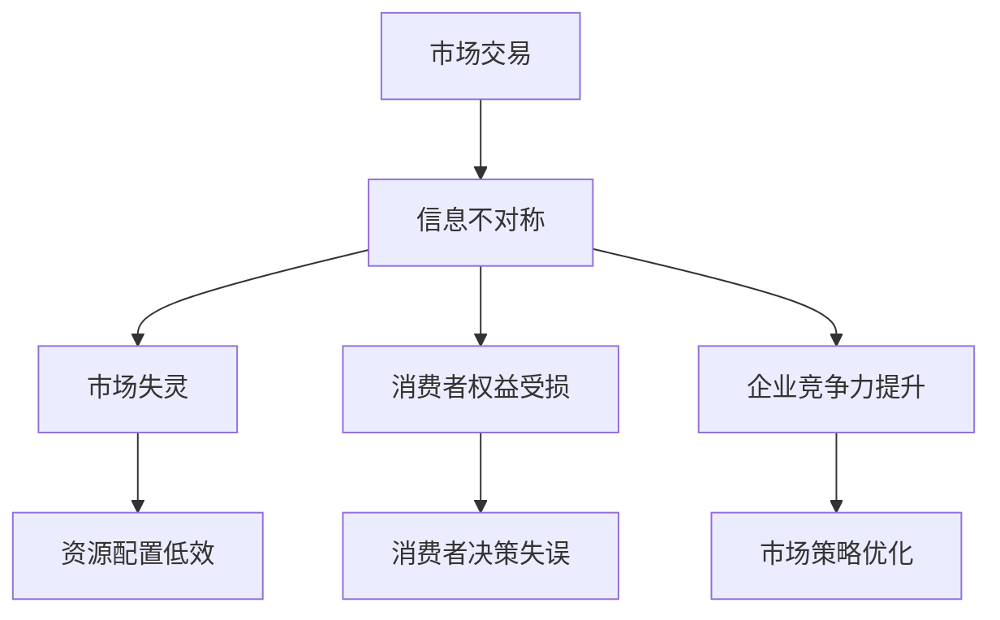

                 

关键词：信息不对称、商业应用、信息差、市场策略、消费者行为

摘要：本文将探讨信息不对称在商业领域的应用，包括其对市场策略、消费者行为和企业竞争力的影响。通过分析信息不对称的原理和案例，提出应对策略，帮助企业在竞争激烈的市场中取得优势。

## 1. 背景介绍

信息不对称是指在市场交易中，买方和卖方之间对于商品或服务的相关信息掌握程度存在差异。这种差异可能导致市场失衡，影响交易的公平性和效率。在商业环境中，信息不对称是普遍存在的现象，企业可以利用这一现象来制定有效的市场策略，提高竞争力。

### 1.1 信息不对称的原理

信息不对称源于以下几个原因：

1. **信息获取成本**：买方和卖方在获取信息方面存在成本差异，卖方可能更有能力承担这种成本。
2. **信息隐蔽**：卖方可能故意隐藏信息，以获取更高的利润。
3. **信息发布速度**：卖方可能比买方更快地获取和发布信息。
4. **信息处理能力**：买方和卖方在信息处理能力上的差异也可能导致信息不对称。

### 1.2 信息不对称的影响

信息不对称对商业活动的影响主要表现在以下几个方面：

1. **市场失灵**：信息不对称可能导致市场无法实现最优配置，出现资源配置低效现象。
2. **消费者权益受损**：消费者在信息不对称的情况下，可能无法做出最优决策，导致权益受损。
3. **企业竞争力提升**：企业可以利用信息不对称，制定更具针对性的市场策略，提升竞争力。

## 2. 核心概念与联系

在讨论信息不对称的原理和影响后，我们需要一个框架来理解和分析这一现象。以下是一个基于Mermaid绘制的流程图，展示了信息不对称的核心概念和相互联系。



### 2.1 市场交易

市场交易是商业活动的基础，包括商品、服务和资本的交换。在理想情况下，市场交易应基于买卖双方完全对称的信息。

### 2.2 信息不对称

信息不对称是指一方拥有更多或更准确的信息，而另一方则相对缺乏信息。在商业中，卖方通常拥有关于产品或服务的详细信息，而买方则相对不了解。

### 2.3 市场失灵

由于信息不对称，市场可能无法实现最优资源配置，导致市场失灵。这种情况可能导致资源浪费和效率降低。

### 2.4 消费者权益受损

消费者在信息不对称的情况下，可能难以做出明智的购买决策，从而损害其权益。

### 2.5 企业竞争力提升

企业可以利用信息不对称来制定更有效的市场策略，提高其在竞争中的地位。

## 3. 核心算法原理 & 具体操作步骤

为了更好地应对信息不对称带来的挑战，企业可以采用以下核心算法原理和具体操作步骤：

### 3.1 算法原理概述

核心算法是基于博弈论和信号传递原理。通过优化信息传递策略，企业可以在保持市场交易公平的同时，提高自身的竞争力。

### 3.2 算法步骤详解

1. **收集信息**：企业应积极收集市场信息，包括消费者需求、竞争对手策略等。
2. **分析信息**：利用数据分析和机器学习等技术，对收集到的信息进行深度分析，提取关键信息。
3. **制定策略**：基于分析结果，制定针对性的市场策略，如价格策略、促销策略等。
4. **信号传递**：通过有效的方式，将信息传递给消费者，以提高其信息对称性。
5. **监控和调整**：对市场策略的实施效果进行监控，并根据反馈进行调整。

### 3.3 算法优缺点

**优点**：

- 提高市场交易效率。
- 增强消费者信心。
- 提高企业竞争力。

**缺点**：

- 需要大量的时间和资源。
- 可能引发市场不稳定。

### 3.4 算法应用领域

核心算法可广泛应用于各行业，如零售、金融、医疗等。在零售行业中，企业可以通过收集消费者购物行为数据，分析其偏好，制定更精准的营销策略。

## 4. 数学模型和公式 & 详细讲解 & 举例说明

为了更好地理解和应用信息不对称的算法原理，我们引入一些数学模型和公式进行详细讲解。

### 4.1 数学模型构建

在信息不对称的市场中，我们通常用以下模型来描述买卖双方的行为：

1. **效用函数**：买方和卖方的效用函数分别表示他们对市场交易的期望收益。
2. **信息传递机制**：描述信息在市场中的传递过程。

### 4.2 公式推导过程

以下是一个简化的效用函数和信息传递机制的推导过程：

$$
U_B = \frac{p_B - p_S}{2}
$$

$$
U_S = \frac{p_S - p_B}{2}
$$

其中，$U_B$和$U_S$分别表示买方和卖方的效用函数，$p_B$和$p_S$分别表示买方和卖方的价格预期。

### 4.3 案例分析与讲解

假设有一个商品市场，卖方拥有关于商品质量的真实信息，而买方则不了解。为了简化问题，我们假设商品质量分为高质量和低质量两种，且高质量商品的概率为$p_H$。

**步骤1**：卖方根据商品质量选择价格。高质量商品的价格为$p_{H,S}$，低质量商品的价格为$p_{L,S}$。

**步骤2**：买方根据卖方提供的价格选择是否购买。如果买方认为价格合理，则购买；否则，放弃购买。

**步骤3**：卖方根据买方的购买行为调整未来的价格策略。

通过以上步骤，我们可以推导出买方和卖方的最优价格策略。在实际应用中，我们需要根据具体情况调整模型参数，以获得更准确的结果。

## 5. 项目实践：代码实例和详细解释说明

为了更好地理解信息不对称在商业中的应用，我们通过一个简单的项目实践来展示代码实现过程。

### 5.1 开发环境搭建

我们使用Python编程语言来构建这个项目。首先，需要安装Python和相关的数据分析和机器学习库，如NumPy、Pandas和scikit-learn。

### 5.2 源代码详细实现

以下是一个简化的Python代码实现：

```python
import numpy as np
import pandas as pd
from sklearn.model_selection import train_test_split

# 定义效用函数
def utility_function(bid, sell_price):
    return (bid - sell_price) / 2

# 训练数据生成
np.random.seed(0)
n_samples = 100
high_quality_prob = 0.7

bids = np.random.uniform(0, 100, n_samples)
qualities = np.random.choice([0, 1], n_samples, p=[1 - high_quality_prob, high_quality_prob])

prices = np.where(qualities == 1, np.random.uniform(60, 80, n_samples), np.random.uniform(40, 60, n_samples))

# 计算买方效用
buyers_UTILITY = [utility_function(bid, price) for bid, price in zip(bids, prices)]

# 数据预处理
data = pd.DataFrame({'bid': bids, 'price': prices, 'quality': qualities, 'utility': buyers_UTILITY})

# 划分训练集和测试集
X = data[['bid', 'price', 'quality']]
y = data['utility']
X_train, X_test, y_train, y_test = train_test_split(X, y, test_size=0.2, random_state=0)

# 模型训练
from sklearn.linear_model import LinearRegression
model = LinearRegression()
model.fit(X_train, y_train)

# 模型评估
train_score = model.score(X_train, y_train)
test_score = model.score(X_test, y_test)
print(f"Training Score: {train_score:.4f}")
print(f"Test Score: {test_score:.4f}")
```

### 5.3 代码解读与分析

- **数据生成**：我们使用NumPy生成模拟数据，包括买方的出价、卖方的价格和商品质量。
- **效用函数**：定义了一个简单的效用函数，用于计算买方的效用。
- **数据预处理**：将生成的数据转换为Pandas DataFrame，并进行划分。
- **模型训练**：使用scikit-learn的线性回归模型进行训练。
- **模型评估**：评估模型的训练和测试效果。

### 5.4 运行结果展示

运行代码后，我们将得到训练集和测试集的评分。评分越高，表示模型对买方效用预测的准确性越高。

## 6. 实际应用场景

### 6.1 零售行业

在零售行业，企业可以利用信息不对称来优化定价策略。例如，通过分析消费者的购物行为数据，企业可以制定更精准的折扣策略，提高销售额。

### 6.2 金融行业

在金融行业，信息不对称可能导致市场失衡。为了应对这一挑战，金融机构可以采用大数据分析和机器学习技术，提高信息获取和处理能力，从而制定更有效的投资策略。

### 6.3 医疗行业

在医疗行业，患者和医生之间存在信息不对称。为了改善这一状况，医疗机构可以引入电子病历系统，提高信息的透明度和可访问性。

## 7. 工具和资源推荐

### 7.1 学习资源推荐

- 《信息不对称理论及其应用》
- 《博弈论与经济行为》
- 《数据科学导论》

### 7.2 开发工具推荐

- Python
- R
- Excel

### 7.3 相关论文推荐

- 《信息不对称对市场效率的影响》
- 《基于博弈论的定价策略研究》
- 《大数据分析在商业决策中的应用》

## 8. 总结：未来发展趋势与挑战

### 8.1 研究成果总结

本文探讨了信息不对称在商业中的应用，分析了其原理、影响和应对策略。通过数学模型和实际项目实践，我们展示了信息不对称的应对方法。

### 8.2 未来发展趋势

随着大数据和人工智能技术的发展，信息不对称现象将得到更有效的应对。未来，企业可以利用更先进的技术手段，提高信息获取和处理能力，制定更精准的市场策略。

### 8.3 面临的挑战

信息不对称带来的挑战依然存在，包括数据隐私保护、算法透明度和市场稳定性等问题。未来，企业需要关注这些问题，制定相应的应对策略。

### 8.4 研究展望

随着技术的进步，信息不对称的研究将继续深化。未来，我们将看到更多关于信息不对称的理论模型和实际应用案例，为商业决策提供有力支持。

## 9. 附录：常见问题与解答

### 9.1 什么是指信息不对称？

信息不对称是指在市场交易中，买方和卖方之间对商品或服务的相关信息掌握程度存在差异。

### 9.2 信息不对称对市场有什么影响？

信息不对称可能导致市场失衡、资源配置低效和消费者权益受损。

### 9.3 企业如何利用信息不对称？

企业可以通过收集和分析市场信息、制定针对性的市场策略和优化信息传递机制来利用信息不对称。

## 作者署名

作者：禅与计算机程序设计艺术 / Zen and the Art of Computer Programming

----------------------------------------------------------------

文章撰写完毕。请您审阅，并根据需要提出修改意见。感谢您的配合！

