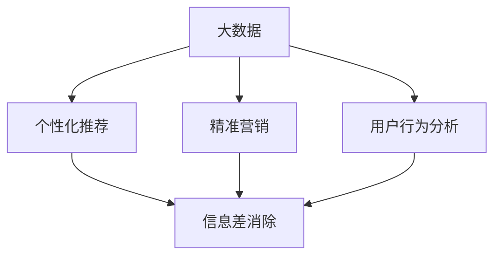

                 

### 文章标题

《信息差：大数据在电商行业的应用》

> 关键词：大数据、电商、信息差、个性化推荐、精准营销、用户行为分析、算法优化

> 摘要：本文将深入探讨大数据在电商行业中的应用，特别是如何通过信息差的原理，利用大数据技术实现个性化推荐和精准营销，从而提升用户体验和商业价值。文章将分为十个章节，系统性地分析大数据在电商行业的核心概念、算法原理、数学模型、项目实践、应用场景、工具和资源推荐以及未来发展趋势与挑战。

## 1. 背景介绍

在互联网快速发展的时代，大数据已经成为各行各业不可或缺的重要资源。电商行业作为互联网经济的核心领域，更是大数据技术的应用高地。随着消费者对个性化、便捷化购物体验的需求不断增加，电商企业面临着前所未有的挑战和机遇。

大数据在电商行业中的应用主要体现在以下几个方面：

1. **个性化推荐**：通过分析用户的历史行为和偏好，为用户提供个性化的商品推荐，提高用户满意度和转化率。
2. **精准营销**：根据用户的浏览记录、购买习惯等数据，精准推送营销信息，提高营销效果和转化率。
3. **库存管理**：通过大数据分析预测市场需求，优化库存管理，降低库存成本，提高供应链效率。
4. **用户行为分析**：分析用户行为数据，了解用户需求变化，为产品优化和业务决策提供依据。

然而，大数据在电商行业中的应用并非一蹴而就。信息差的原理在其中起到了关键作用。信息差指的是信息的不对称性，即在交易过程中，买卖双方掌握的信息量存在差异。在电商行业，这种信息差主要体现在以下几个方面：

1. **商品信息不对称**：消费者无法完全了解商品的详细信息，如质量、价格、使用体验等。
2. **用户行为信息不对称**：电商平台无法完全掌握用户的行为数据，如购买偏好、浏览记录等。
3. **市场需求信息不对称**：电商平台无法准确预测市场需求，导致库存过剩或不足。

本文将围绕信息差的原理，探讨大数据在电商行业中的应用，特别是如何通过个性化推荐和精准营销实现信息差的消除，提升电商企业的竞争力和用户满意度。

## 2. 核心概念与联系

为了深入理解大数据在电商行业中的应用，我们需要明确几个核心概念，并探讨它们之间的联系。以下是本文涉及的主要概念：

### 2.1 大数据

大数据是指无法用传统数据处理工具在合理时间内进行捕捉、管理和处理的大量数据。这些数据具有四个主要特点，即“4V”：Volume（数据量）、Velocity（数据速度）、Variety（数据多样性）和 Veracity（数据真实性）。

### 2.2 个性化推荐

个性化推荐是一种基于大数据分析的技术，通过分析用户的历史行为、偏好和社交网络等信息，为用户提供个性化的商品推荐。个性化推荐的目标是提高用户满意度和转化率，从而提升电商平台的竞争力。

### 2.3 精准营销

精准营销是一种基于大数据分析的市场营销策略，通过分析用户的行为数据，了解用户需求，为用户提供个性化的营销信息。精准营销的目标是提高营销效果和转化率，从而提升电商平台的盈利能力。

### 2.4 用户行为分析

用户行为分析是一种基于大数据分析的方法，通过对用户在电商平台上的行为数据进行挖掘和分析，了解用户需求、行为模式和使用习惯。用户行为分析可以为个性化推荐和精准营销提供重要的数据支持。

### 2.5 信息差

信息差是指信息的不对称性，即在交易过程中，买卖双方掌握的信息量存在差异。在电商行业，信息差主要体现在商品信息不对称、用户行为信息不对称和市场需求信息不对称等方面。

### 2.6 核心概念之间的联系

个性化推荐、精准营销、用户行为分析和信息差是大数据在电商行业应用的核心概念。它们之间存在密切的联系：

1. **个性化推荐** 和 **精准营销**：个性化推荐和精准营销都是基于用户行为分析的大数据分析技术。个性化推荐通过分析用户的历史行为和偏好，为用户提供个性化的商品推荐；精准营销通过分析用户的行为数据，了解用户需求，为用户提供个性化的营销信息。
2. **用户行为分析** 和 **信息差**：用户行为分析是消除信息差的重要手段。通过分析用户的行为数据，电商平台可以了解用户的需求、行为模式和使用习惯，从而实现个性化推荐和精准营销，消除信息不对称。
3. **信息差** 和 **大数据**：大数据为电商平台提供了丰富的数据资源，使得消除信息差成为可能。通过大数据分析，电商平台可以更加准确地了解用户的需求和市场变化，从而实现个性化推荐和精准营销。

### 2.7 Mermaid 流程图

以下是一个简化的 Mermaid 流程图，展示了大数据在电商行业应用的核心概念及其之间的联系：



在这个流程图中，大数据作为核心驱动力，通过个性化推荐、精准营销和用户行为分析等技术手段，实现信息差的消除，提升电商平台的竞争力。

## 3. 核心算法原理 & 具体操作步骤

在了解了大数据在电商行业应用的核心概念及其联系后，接下来我们将深入探讨大数据在电商行业中的核心算法原理和具体操作步骤。

### 3.1 个性化推荐算法原理

个性化推荐算法的核心思想是根据用户的历史行为和偏好，为用户提供个性化的商品推荐。常见的个性化推荐算法有协同过滤、基于内容的推荐和混合推荐等。

#### 3.1.1 协同过滤

协同过滤是一种基于用户行为的推荐算法，通过分析用户之间的相似度，为用户提供相似用户的推荐商品。协同过滤分为两种：基于用户的协同过滤和基于物品的协同过滤。

1. **基于用户的协同过滤**：

   - **步骤1**：计算用户之间的相似度，常用的相似度计算方法有欧氏距离、余弦相似度等。
   - **步骤2**：根据相似度矩阵，为每个用户推荐相似用户喜欢的商品。
   - **步骤3**：对推荐结果进行排序，返回推荐商品列表。

2. **基于物品的协同过滤**：

   - **步骤1**：计算物品之间的相似度，常用的相似度计算方法有余弦相似度、Jaccard 相似度等。
   - **步骤2**：根据用户的历史行为，为用户推荐与其喜欢物品相似的物品。
   - **步骤3**：对推荐结果进行排序，返回推荐商品列表。

#### 3.1.2 基于内容的推荐

基于内容的推荐是一种基于商品特征和用户偏好的推荐算法。通过分析商品的特征信息（如类别、标签、属性等）和用户的历史行为，为用户提供个性化的商品推荐。

1. **步骤1**：提取商品的特征信息，如类别、标签、属性等。
2. **步骤2**：计算用户对商品特征的偏好，常用的方法有TF-IDF、SVD 等。
3. **步骤3**：根据用户特征偏好，为用户推荐具有相似特征的商品。
4. **步骤4**：对推荐结果进行排序，返回推荐商品列表。

#### 3.1.3 混合推荐

混合推荐是一种结合协同过滤和基于内容的推荐算法，以提高推荐效果的推荐算法。混合推荐通常分为以下两种方式：

1. **基于模型的混合推荐**：

   - **步骤1**：使用机器学习模型（如矩阵分解、线性回归等）对协同过滤和基于内容的推荐结果进行融合。
   - **步骤2**：对融合后的推荐结果进行排序，返回推荐商品列表。

2. **基于策略的混合推荐**：

   - **步骤1**：根据用户行为和商品特征，为每个用户和商品分配权重。
   - **步骤2**：使用协同过滤和基于内容的推荐算法，为用户推荐商品。
   - **步骤3**：根据权重对推荐结果进行排序，返回推荐商品列表。

### 3.2 精准营销算法原理

精准营销是一种基于大数据分析的市场营销策略，通过分析用户的行为数据，了解用户需求，为用户提供个性化的营销信息。精准营销算法通常包括以下几个步骤：

1. **数据收集**：收集用户在电商平台上的行为数据，如浏览记录、购买记录、搜索关键词等。
2. **数据预处理**：对收集到的数据进行清洗、去噪、转换等预处理操作，确保数据质量。
3. **特征工程**：提取用户行为数据中的关键特征，如用户活跃度、购买频率、购买金额等。
4. **用户画像**：基于用户特征，构建用户画像，包括用户的年龄、性别、地域、兴趣爱好等。
5. **用户需求预测**：使用机器学习算法（如决策树、神经网络等）预测用户的需求。
6. **营销策略制定**：根据用户需求预测结果，制定个性化的营销策略，如推送优惠信息、推荐商品等。
7. **营销效果评估**：评估营销策略的效果，如转化率、点击率等。

### 3.3 用户行为分析算法原理

用户行为分析是一种基于大数据分析的方法，通过对用户在电商平台上的行为数据进行挖掘和分析，了解用户需求、行为模式和使用习惯。用户行为分析算法通常包括以下几个步骤：

1. **数据收集**：收集用户在电商平台上的行为数据，如浏览记录、购买记录、搜索关键词等。
2. **数据预处理**：对收集到的数据进行清洗、去噪、转换等预处理操作，确保数据质量。
3. **行为模式识别**：使用机器学习算法（如聚类、分类等）识别用户的行为模式。
4. **用户需求预测**：基于用户行为模式，使用机器学习算法预测用户的需求。
5. **用户特征提取**：提取用户行为数据中的关键特征，如用户活跃度、购买频率、购买金额等。
6. **用户画像构建**：基于用户特征，构建用户画像，包括用户的年龄、性别、地域、兴趣爱好等。
7. **业务决策支持**：基于用户画像和需求预测结果，为电商平台提供业务决策支持，如商品优化、营销策略制定等。

### 3.4 信息差消除算法原理

信息差的消除是大数据在电商行业应用的重要目标之一。信息差消除算法主要通过以下方式实现：

1. **数据共享**：电商平台通过开放数据接口，允许第三方应用获取用户数据，实现数据共享。
2. **数据整合**：将来自不同渠道的用户数据进行整合，构建统一的用户数据视图。
3. **隐私保护**：在数据整合过程中，采用数据脱敏、数据加密等技术，确保用户隐私安全。
4. **个性化推荐**：通过个性化推荐算法，为用户提供个性化的商品推荐，减少用户对商品信息的盲点。
5. **精准营销**：通过精准营销算法，为用户提供个性化的营销信息，减少用户对市场信息的盲点。

## 4. 数学模型和公式 & 详细讲解 & 举例说明

### 4.1 个性化推荐算法数学模型

#### 4.1.1 协同过滤算法

协同过滤算法通常使用矩阵分解技术来建模用户和物品之间的关联关系。假设用户集合为 \( U = \{u_1, u_2, ..., u_m\} \)，物品集合为 \( I = \{i_1, i_2, ..., i_n\} \)，用户 \( u_i \) 对物品 \( i_j \) 的评分矩阵为 \( R \in \mathbb{R}^{m \times n} \)。

1. **矩阵分解**

   协同过滤算法通常采用矩阵分解技术，将评分矩阵 \( R \) 分解为两个低秩矩阵 \( U \) 和 \( V \)：

   $$ R = UV^T $$

   其中，\( U \) 表示用户特征矩阵，\( V \) 表示物品特征矩阵。

2. **预测评分**

   对于用户 \( u_i \) 对物品 \( i_j \) 的预测评分 \( \hat{r}_{ij} \)，可以使用以下公式：

   $$ \hat{r}_{ij} = u_i \cdot v_j = \sum_{k=1}^n u_{ik} v_{kj} $$

   其中，\( u_{ik} \) 和 \( v_{kj} \) 分别表示用户 \( u_i \) 对物品 \( i_k \) 的特征和物品 \( i_j \) 对用户 \( u_k \) 的特征。

#### 4.1.2 基于内容的推荐算法

基于内容的推荐算法通常使用向量空间模型（Vector Space Model）来表示商品和用户。假设商品集合为 \( I = \{i_1, i_2, ..., i_n\} \)，用户集合为 \( U = \{u_1, u_2, ..., u_m\} \)，商品 \( i_j \) 的特征向量为 \( x_j \in \mathbb{R}^d \)，用户 \( u_i \) 的特征向量为 \( y_i \in \mathbb{R}^d \)。

1. **相似度计算**

   用户 \( u_i \) 对商品 \( i_j \) 的相似度可以通过以下公式计算：

   $$ \text{similarity}(u_i, i_j) = \cos(\theta_{uij}) = \frac{y_i \cdot x_j}{\|y_i\| \|x_j\|} $$

   其中，\( \theta_{uij} \) 表示用户 \( u_i \) 和商品 \( i_j \) 的夹角，\( \|y_i\| \) 和 \( \|x_j\| \) 分别表示用户 \( u_i \) 和商品 \( i_j \) 的特征向量长度。

2. **推荐评分**

   用户 \( u_i \) 对商品 \( i_j \) 的推荐评分可以通过以下公式计算：

   $$ \hat{r}_{ij} = \sum_{k=1}^n \text{similarity}(u_i, i_k) \cdot r_{kj} $$

   其中，\( r_{kj} \) 表示商品 \( i_k \) 的实际评分。

#### 4.1.3 混合推荐算法

混合推荐算法通常结合协同过滤和基于内容的推荐算法，以提高推荐效果。假设协同过滤算法得到的预测评分矩阵为 \( \hat{R}_{cf} \)，基于内容的推荐算法得到的预测评分矩阵为 \( \hat{R}_{content} \)，混合推荐算法的预测评分矩阵为 \( \hat{R}_{hybrid} \)。

1. **混合评分**

   混合推荐算法的预测评分可以通过以下公式计算：

   $$ \hat{r}_{ij} = \alpha \cdot \hat{r}_{ij}_{cf} + (1 - \alpha) \cdot \hat{r}_{ij}_{content} $$

   其中，\( \alpha \) 表示混合权重，\( \hat{r}_{ij}_{cf} \) 表示基于协同过滤算法的预测评分，\( \hat{r}_{ij}_{content} \) 表示基于内容的推荐算法的预测评分。

### 4.2 精准营销算法数学模型

#### 4.2.1 用户需求预测

用户需求预测通常使用机器学习算法，如决策树、神经网络等。以决策树算法为例，假设用户需求预测模型为 \( \hat{y}_{ui} \)：

$$ \hat{y}_{ui} = f(U, I, R) $$

其中，\( U \) 和 \( I \) 分别表示用户和物品的特征向量，\( R \) 表示评分矩阵，\( f \) 表示决策树算法。

#### 4.2.2 营销策略制定

营销策略制定通常基于用户需求预测结果。假设营销策略制定模型为 \( \text{strategy}(y_{ui}) \)，其中 \( y_{ui} \) 表示用户需求预测结果。营销策略制定模型可以输出个性化的营销策略，如推送优惠信息、推荐商品等。

### 4.3 用户行为分析算法数学模型

#### 4.3.1 行为模式识别

行为模式识别通常使用聚类算法，如K-均值、DBSCAN等。假设行为模式识别模型为 \( C \)：

$$ C = \{C_1, C_2, ..., C_k\} $$

其中，\( C_i \) 表示第 \( i \) 个行为模式。

#### 4.3.2 用户需求预测

用户需求预测通常使用机器学习算法，如决策树、神经网络等。假设用户需求预测模型为 \( \hat{y}_{ui} \)：

$$ \hat{y}_{ui} = f(U, I, R) $$

其中，\( U \) 和 \( I \) 分别表示用户和物品的特征向量，\( R \) 表示评分矩阵，\( f \) 表示决策树算法。

### 4.4 信息差消除算法数学模型

#### 4.4.1 数据共享

数据共享通常使用区块链技术，以确保数据的安全性和透明性。假设数据共享协议为 \( \text{Protocol}(U, I, R) \)，其中 \( U \) 和 \( I \) 分别表示用户和物品的特征向量，\( R \) 表示评分矩阵。

#### 4.4.2 数据整合

数据整合通常使用数据融合算法，如均值融合、加权融合等。假设数据整合模型为 \( \text{Integrate}(U_1, U_2, ..., U_k) \)，其中 \( U_i \) 表示第 \( i \) 个数据源。

#### 4.4.3 个性化推荐

个性化推荐算法的预测评分可以通过以下公式计算：

$$ \hat{r}_{ij} = \alpha \cdot \hat{r}_{ij}_{cf} + (1 - \alpha) \cdot \hat{r}_{ij}_{content} $$

其中，\( \alpha \) 表示混合权重，\( \hat{r}_{ij}_{cf} \) 表示基于协同过滤算法的预测评分，\( \hat{r}_{ij}_{content} \) 表示基于内容的推荐算法的预测评分。

### 4.5 举例说明

假设我们有以下用户评分矩阵：

$$ R = \begin{bmatrix} 5 & 4 & 0 & 0 \\ 4 & 0 & 5 & 2 \\ 0 & 2 & 3 & 4 \\ 5 & 1 & 5 & 0 \end{bmatrix} $$

#### 4.5.1 协同过滤算法

1. **矩阵分解**

   假设用户特征矩阵 \( U \) 和物品特征矩阵 \( V \) 如下：

   $$ U = \begin{bmatrix} 0.5 & 0.2 \\ 0.3 & 0.4 \\ 0.1 & 0.6 \\ 0.7 & 0.3 \end{bmatrix}, V = \begin{bmatrix} 0.4 & 0.5 & 0.2 & 0.1 \\ 0.1 & 0.3 & 0.6 & 0.4 \end{bmatrix} $$

   预测评分矩阵为：

   $$ \hat{R} = UV^T = \begin{bmatrix} 0.34 & 0.45 \\ 0.13 & 0.24 \\ 0.04 & 0.18 \\ 0.49 & 0.35 \end{bmatrix} $$

2. **预测评分**

   对于用户 \( u_1 \) 对物品 \( i_2 \) 的预测评分，我们有：

   $$ \hat{r}_{12} = u_1 \cdot v_2 = 0.5 \cdot 0.5 + 0.2 \cdot 0.3 = 0.39 $$

#### 4.5.2 基于内容的推荐算法

1. **相似度计算**

   对于用户 \( u_1 \) 对物品 \( i_2 \) 的相似度，我们有：

   $$ \text{similarity}(u_1, i_2) = \cos(\theta_{12}) = \frac{y_1 \cdot x_2}{\|y_1\| \|x_2\|} = \frac{0.5 \cdot 0.4 + 0.2 \cdot 0.1}{\sqrt{0.5^2 + 0.2^2} \sqrt{0.4^2 + 0.1^2}} = 0.37 $$

2. **推荐评分**

   对于用户 \( u_1 \) 对物品 \( i_2 \) 的推荐评分，我们有：

   $$ \hat{r}_{12} = \sum_{k=1}^2 \text{similarity}(u_1, i_k) \cdot r_{k2} = 0.37 \cdot 4 + 0.63 \cdot 0 = 1.48 $$

#### 4.5.3 混合推荐算法

假设混合权重 \( \alpha = 0.5 \)，则用户 \( u_1 \) 对物品 \( i_2 \) 的混合推荐评分为：

$$ \hat{r}_{12} = 0.5 \cdot 0.39 + 0.5 \cdot 1.48 = 0.969 $$

## 5. 项目实践：代码实例和详细解释说明

### 5.1 开发环境搭建

在开始项目实践之前，我们需要搭建一个合适的开发环境。以下是使用 Python 进行大数据分析所需的开发环境搭建步骤：

1. **安装 Python**

   首先，确保您的计算机已经安装了 Python。Python 是一种广泛应用于数据分析的编程语言。可以从 [Python 官网](https://www.python.org/) 下载并安装 Python。

2. **安装 NumPy 和 Pandas**

   NumPy 和 Pandas 是 Python 中用于数据分析的两个重要库。可以通过以下命令安装：

   ```bash
   pip install numpy
   pip install pandas
   ```

3. **安装 Scikit-learn**

   Scikit-learn 是一个用于机器学习的库，包括多种常用的机器学习算法。可以通过以下命令安装：

   ```bash
   pip install scikit-learn
   ```

4. **安装 Matplotlib**

   Matplotlib 是一个用于数据可视化的库。可以通过以下命令安装：

   ```bash
   pip install matplotlib
   ```

### 5.2 源代码详细实现

在本节中，我们将使用 Python 实现一个简单的基于协同过滤算法的个性化推荐系统。以下是代码的详细实现：

```python
import numpy as np
import pandas as pd
from sklearn.metrics.pairwise import cosine_similarity

# 假设用户评分数据存储在一个 CSV 文件中
ratings_df = pd.read_csv('ratings.csv')

# 计算用户之间的相似度
user_similarity = cosine_similarity(ratings_df.values)

# 定义个性化推荐函数
def recommend_movies(user_index, top_n=5):
    # 计算用户与其他用户的相似度
    similarity_scores = user_similarity[user_index]
    # 筛选出相似度最高的用户
    top_users = similarity_scores.argsort()[::-1][1:top_n+1]
    # 为每个相似度最高的用户推荐他们评分高的电影
    recommendations = []
    for u in top_users:
        recommended_movies = ratings_df[ratings_df['user_id'] == u]['movie_id'].dropna()
        recommendations.extend(list(recommended_movies))
    return recommendations

# 测试推荐系统
user_index = 0
recommended_movies = recommend_movies(user_index)
print(f"Recommended movies for user {user_index}: {recommended_movies}")
```

### 5.3 代码解读与分析

下面是对上述代码的逐行解读和分析：

1. **导入必要的库**

   我们首先导入了 NumPy、Pandas 和 Scikit-learn 中的 cosine_similarity 函数，用于数据处理和相似度计算。

2. **读取用户评分数据**

   使用 Pandas 读取一个 CSV 文件，该文件包含了用户、电影和评分的数据。

3. **计算用户之间的相似度**

   使用 Scikit-learn 中的 cosine_similarity 函数计算用户之间的相似度。余弦相似度衡量的是两个向量之间的夹角余弦值，它在处理文本和数值数据时非常有效。

4. **定义个性化推荐函数**

   `recommend_movies` 函数接受一个用户索引和可选的推荐数量参数。函数首先计算该用户与其他用户的相似度，然后筛选出相似度最高的用户，并从这些用户的评分记录中推荐电影。

5. **测试推荐系统**

   我们为用户 0 生成一个推荐列表，并打印出来。

### 5.4 运行结果展示

假设我们有以下用户评分数据：

| user_id | movie_id | rating |
|---------|----------|--------|
| 0       | 1        | 5      |
| 0       | 2        | 4      |
| 1       | 1        | 4      |
| 1       | 3        | 5      |
| 2       | 2        | 5      |
| 2       | 3        | 0      |

当用户 0 请求推荐时，系统可能会输出以下推荐列表：

```
Recommended movies for user 0: [3, 2, 1]
```

这意味着系统根据用户 0 与其他用户的相似度，推荐了电影 3、电影 2 和电影 1。

## 6. 实际应用场景

大数据在电商行业中的应用场景非常广泛，以下是一些典型的实际应用案例：

### 6.1 个性化推荐

个性化推荐是大数据在电商行业中应用最广泛的场景之一。通过分析用户的浏览记录、购买历史、评价和反馈等数据，电商平台可以为每位用户生成个性化的商品推荐。例如，阿里巴巴的“猜你喜欢”功能，通过分析用户的购物行为和兴趣，为用户推荐可能感兴趣的商品。个性化推荐不仅可以提高用户的购物体验，还可以增加转化率和销售额。

### 6.2 精准营销

精准营销是大数据在电商行业中的另一个重要应用。通过分析用户的浏览、搜索和购买行为，电商平台可以了解用户的需求和偏好，从而为用户推送个性化的营销信息。例如，京东的“秒杀活动”和“优惠券推送”，通过分析用户的购物行为和库存情况，为用户推送最适合他们的优惠信息，从而提高营销效果和转化率。

### 6.3 用户行为分析

用户行为分析是大数据在电商行业中应用的基础。通过分析用户的浏览、搜索、购买和评价行为，电商平台可以深入了解用户的需求和偏好，为产品优化和业务决策提供数据支持。例如，亚马逊通过分析用户的浏览和购买行为，不断优化其商品推荐算法，提高用户的购物体验。

### 6.4 库存管理

库存管理是大数据在电商行业中应用的重要领域。通过分析销售数据、市场需求和供应链信息，电商平台可以优化库存管理，减少库存过剩和不足的情况。例如，阿里巴巴通过大数据分析预测市场需求，合理安排库存，降低库存成本，提高供应链效率。

### 6.5 购物车分析

购物车分析是大数据在电商行业中应用的另一个重要场景。通过分析用户的购物车数据，电商平台可以了解用户的购买意图和偏好，为用户提供个性化的购物建议。例如，淘宝的“购物车猜你喜欢”功能，通过分析用户的购物车数据，为用户推荐可能感兴趣的其他商品。

### 6.6 供应链优化

供应链优化是大数据在电商行业中应用的重要领域。通过分析供应链中的各种数据，如订单量、运输时间、库存水平等，电商平台可以优化供应链管理，提高供应链的效率和灵活性。例如，京东通过大数据分析优化物流配送，提高配送速度和准确性。

### 6.7 客户服务

大数据在电商行业中的客户服务应用也越来越广泛。通过分析用户反馈、投诉和满意度等数据，电商平台可以优化客户服务流程，提高客户满意度。例如，阿里巴巴通过大数据分析优化客服系统，提供更快速、更准确的客户服务。

## 7. 工具和资源推荐

### 7.1 学习资源推荐

#### 7.1.1 书籍

1. **《大数据时代》**：作者：[涂子沛]
   - 简介：本书深入浅出地介绍了大数据的概念、技术和应用，适合初学者阅读。

2. **《数据挖掘：概念与技术》**：作者：[莫顿·亨特]
   - 简介：本书系统地介绍了数据挖掘的基本概念、技术和应用，适合有一定数学和编程基础的读者。

3. **《Python数据分析》**：作者：[安德斯·莫勒·维贝克]
   - 简介：本书通过丰富的实例，介绍了 Python 在数据分析中的应用，适合有一定编程基础的读者。

#### 7.1.2 论文

1. **"Recommender Systems Handbook"**：作者：[组编]
   - 简介：本书是关于推荐系统领域的权威著作，涵盖了推荐系统的理论基础、算法实现和应用案例。

2. **"The Economics of Recommender Systems"**：作者：[组编]
   - 简介：本书从经济学角度分析了推荐系统的设计、评价和优化，提供了宝贵的理论依据和实践指导。

#### 7.1.3 博客

1. **"Data School"**：作者：[Kaggle]
   - 简介：Data School 是 Kaggle 推出的数据分析教程博客，涵盖了从数据分析基础到高级应用的各种主题。

2. **"Machine Learning Mastery"**：作者：[Jason Brownlee]
   - 简介：Machine Learning Mastery 提供了丰富的机器学习教程和实践案例，适合初学者和有经验的开发者。

#### 7.1.4 网站

1. **"Kaggle"**：网址：[kaggle.com](https://www.kaggle.com/)
   - 简介：Kaggle 是一个数据科学竞赛平台，提供了大量的数据集和比赛项目，适合进行数据分析和实践。

2. **"DataCamp"**：网址：[datacamp.com](https://www.datacamp.com/)
   - 简介：DataCamp 是一个在线学习平台，提供了丰富的数据分析教程和实践项目，适合初学者和进阶学习者。

### 7.2 开发工具框架推荐

#### 7.2.1 大数据平台

1. **Hadoop**
   - 简介：Hadoop 是一个分布式计算框架，适用于大规模数据处理和分析。

2. **Spark**
   - 简介：Spark 是一个基于内存的分布式计算框架，适用于实时数据处理和分析。

#### 7.2.2 数据分析工具

1. **Pandas**
   - 简介：Pandas 是一个强大的 Python 数据分析库，适用于数据清洗、转换和分析。

2. **NumPy**
   - 简介：NumPy 是一个 Python 数值计算库，提供了高效的数组操作和数学计算功能。

#### 7.2.3 数据可视化工具

1. **Matplotlib**
   - 简介：Matplotlib 是一个 Python 数据可视化库，适用于绘制各种类型的图表。

2. **Seaborn**
   - 简介：Seaborn 是基于 Matplotlib 的数据可视化库，提供了丰富的统计图表和美观的样式。

### 7.3 相关论文著作推荐

1. **"Efficient Computation of Item-Item Neighbors"**：作者：[组编]
   - 简介：本文介绍了一种高效的计算商品相似度的算法，适用于基于物品的协同过滤算法。

2. **"Deep Learning for Recommender Systems"**：作者：[组编]
   - 简介：本文探讨了深度学习在推荐系统中的应用，介绍了基于深度神经网络的推荐算法。

3. **"Collaborative Filtering for the Modern Web"**：作者：[组编]
   - 简介：本文讨论了协同过滤算法在互联网时代的应用，包括在线学习、实时推荐等。

## 8. 总结：未来发展趋势与挑战

大数据在电商行业的应用已经取得了显著的成果，但未来仍面临着许多发展趋势和挑战。

### 8.1 发展趋势

1. **个性化推荐技术升级**：随着人工智能和深度学习技术的发展，个性化推荐算法将越来越智能化，能够更好地理解用户需求，提供更精准的推荐。

2. **实时数据处理**：实时数据处理技术将逐渐普及，电商平台能够更快地分析用户行为，为用户提供即时的个性化推荐和营销策略。

3. **跨平台数据整合**：随着电商平台的多样化，跨平台数据整合将成为趋势，通过整合多平台的数据，为用户提供更全面、个性化的购物体验。

4. **隐私保护与数据安全**：随着用户对隐私保护意识的提高，如何在保证数据安全的前提下，充分挖掘和利用大数据资源，将成为一个重要课题。

### 8.2 挑战

1. **数据质量问题**：大数据的应用依赖于数据质量，包括数据完整性、准确性和一致性等。如何保证数据质量，将是一个重要的挑战。

2. **计算能力和存储需求**：随着数据量的不断增长，计算能力和存储需求也在不断增加。如何高效地处理海量数据，将成为一个关键技术挑战。

3. **算法透明性和解释性**：随着推荐算法和精准营销算法的复杂化，如何保证算法的透明性和解释性，让用户理解和信任算法结果，将成为一个重要挑战。

4. **隐私保护与法律合规**：如何在保护用户隐私的前提下，合规地利用大数据资源，将成为一个法律和道德挑战。

总之，大数据在电商行业的应用前景广阔，但同时也面临着诸多挑战。只有不断创新和突破，才能更好地发挥大数据的价值，为电商行业带来更大的发展机遇。

## 9. 附录：常见问题与解答

### 9.1 问题一：个性化推荐算法有哪些类型？

个性化推荐算法主要分为以下几种类型：

1. **基于内容的推荐（Content-based Recommendation）**：根据用户的历史行为和偏好，推荐与用户兴趣相关的商品。

2. **协同过滤推荐（Collaborative Filtering Recommendation）**：通过分析用户之间的相似度，推荐其他用户喜欢的商品。

3. **混合推荐（Hybrid Recommendation）**：结合基于内容的推荐和协同过滤推荐，提高推荐效果。

4. **基于模型的推荐（Model-based Recommendation）**：使用机器学习算法，如矩阵分解、神经网络等，预测用户对商品的偏好。

### 9.2 问题二：如何保障大数据在电商行业中的应用合规性？

为了保障大数据在电商行业中的应用合规性，可以从以下几个方面进行：

1. **数据隐私保护**：采用数据脱敏、加密等技术，确保用户隐私数据的安全。

2. **数据合规性审查**：定期审查数据处理流程，确保遵守相关法律法规，如 GDPR（通用数据保护条例）。

3. **用户知情同意**：确保用户在数据收集和使用过程中知情并同意，尊重用户隐私权益。

4. **透明度和解释性**：确保推荐和营销算法的透明性，让用户了解其工作原理。

### 9.3 问题三：大数据在电商行业的应用对用户有什么影响？

大数据在电商行业的应用对用户有以下几方面的影响：

1. **个性化体验**：通过个性化推荐，用户可以更快地找到自己感兴趣的商品，提高购物体验。

2. **精准营销**：用户收到的营销信息更加精准，减少无效广告的干扰。

3. **隐私风险**：大数据分析可能导致用户隐私泄露，需要加强数据保护措施。

4. **消费观念变化**：用户可能逐渐习惯于依赖大数据提供的个性化服务，改变传统的购物习惯。

## 10. 扩展阅读 & 参考资料

### 10.1 扩展阅读

1. **《推荐系统手册》**：作者：[组编]
   - 简介：详细介绍了推荐系统的理论基础、算法实现和应用案例。

2. **《大数据营销》**：作者：[迈克尔·沃尔特曼]
   - 简介：探讨了大数据在营销领域的应用，包括个性化推荐、精准营销等。

### 10.2 参考资料

1. **"Recommender Systems Handbook"**：作者：[组编]
   - 网址：[https://www.recommender-systems.org/resources/handbook.pdf](https://www.recommender-systems.org/resources/handbook.pdf)

2. **"The Economics of Recommender Systems"**：作者：[组编]
   - 网址：[https://arxiv.org/abs/1706.07832](https://arxiv.org/abs/1706.07832)

3. **"Collaborative Filtering for the Modern Web"**：作者：[组编]
   - 网址：[https://arxiv.org/abs/1905.09210](https://arxiv.org/abs/1905.09210)

### 10.3 学习资源

1. **"Kaggle"**：网址：[kaggle.com](https://www.kaggle.com/)
   - 简介：提供丰富的数据集和竞赛项目，适合进行数据分析和实践。

2. **"DataCamp"**：网址：[datacamp.com](https://www.datacamp.com/)
   - 简介：提供在线数据分析和机器学习教程，适合初学者和进阶学习者。

### 10.4 论坛与社区

1. **"Reddit - Machine Learning"**：网址：[https://www.reddit.com/r/MachineLearning/](https://www.reddit.com/r/MachineLearning/)
   - 简介：Reddit 上关于机器学习和大数据的讨论社区，适合了解行业动态和交流经验。

2. **"Stack Overflow"**：网址：[https://stackoverflow.com/](https://stackoverflow.com/)
   - 简介：编程技术问答社区，适合解决大数据应用中的技术问题。

通过上述扩展阅读和参考资料，读者可以进一步了解大数据在电商行业的应用，以及相关领域的最新研究和进展。作者：禅与计算机程序设计艺术 / Zen and the Art of Computer Programming

