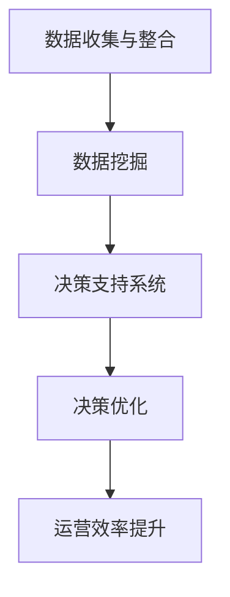

                 

### 信息差：大数据如何提升运营效率

#### 关键词：
- 信息差
- 大数据
- 运营效率
- 数据挖掘
- 决策支持

#### 摘要：
本文将探讨信息差在运营效率提升中的关键作用，通过大数据技术的深入分析，揭示其如何帮助企业更好地理解市场动态、优化决策流程，并最终提升运营效率。文章将首先介绍信息差的基本概念，然后详细探讨大数据技术在挖掘信息差、构建决策模型等方面的应用，并通过实际案例和具体步骤，展示大数据如何助力企业实现运营效率的飞跃。

### 1. 背景介绍

在现代商业环境中，信息差（Information Gap）指的是不同个体或组织之间的信息不对称现象。信息差的存在往往导致决策效率的降低和资源利用的不充分。特别是在运营管理领域，如何缩小信息差、提高信息透明度，成为提升运营效率的关键。

随着大数据技术的迅猛发展，我们有能力通过数据挖掘和分析，识别和利用信息差，从而为企业的运营决策提供强有力的支持。大数据技术不仅能够处理海量数据，还能够从中提取出有价值的信息，帮助企业更好地理解市场趋势、客户需求以及运营中的潜在问题。

#### 1.1. 信息差的定义与影响

信息差可以定义为不同个体或组织在信息获取、处理和使用上的差异。具体而言，它包括以下几个方面：

- **信息获取**：某些个体或组织能够更快速、更全面地获取所需信息，而另一些则可能由于资源限制而信息获取滞后。
- **信息处理**：信息处理能力上的差异，可能导致不同个体或组织对信息的理解和解读存在偏差。
- **信息使用**：信息差在决策执行和资源分配上的表现，直接影响运营效率。

在运营管理中，信息差的存在可能导致以下问题：

- **决策滞后**：缺乏及时、准确的信息支持，导致决策速度慢，错失市场机会。
- **资源浪费**：信息不对称导致资源分配不合理，造成资源浪费。
- **客户体验差**：信息获取和处理不及时，影响客户体验，降低客户满意度。

#### 1.2. 大数据的发展历程

大数据技术的发展经历了以下几个阶段：

1. **数据积累阶段**：随着互联网的普及，企业开始积累大量的数据，包括用户行为、交易记录等。
2. **数据整合阶段**：企业通过数据整合，将来自不同渠道和系统的数据进行统一管理，提高数据利用率。
3. **数据分析阶段**：利用数据分析技术，对数据进行深度挖掘，提取有价值的信息。
4. **数据应用阶段**：将分析结果应用于运营决策，实现业务流程优化和效率提升。

大数据技术的不断成熟，为解决信息差问题提供了新的手段，企业可以通过大数据分析，提高信息透明度，优化决策流程，从而提升运营效率。

### 2. 核心概念与联系

在探讨大数据如何提升运营效率的过程中，我们需要明确几个核心概念，并了解它们之间的相互关系。

#### 2.1. 数据挖掘

数据挖掘（Data Mining）是指从大量数据中提取出有价值信息的过程。它包括以下几个步骤：

1. **数据预处理**：清洗、整合和转换数据，使其适合分析。
2. **模式识别**：通过算法发现数据中的规律和模式。
3. **结果评估**：评估挖掘结果的准确性和有效性。

数据挖掘是大数据技术的重要应用之一，它能够帮助企业发现隐藏在大量数据中的信息，从而为决策提供支持。

#### 2.2. 决策支持系统

决策支持系统（Decision Support System，DSS）是一种辅助决策的计算机系统。它利用数据分析和模型模拟技术，为决策者提供支持。

1. **数据集成**：将来自不同源的数据进行整合，提供统一的数据视图。
2. **数据分析和预测**：利用统计模型、数据挖掘技术等，分析数据并提供预测结果。
3. **用户界面**：为决策者提供直观的数据分析和预测结果，支持决策制定。

决策支持系统是大数据技术在运营管理中的重要应用，它能够帮助企业在复杂的市场环境中做出更明智的决策。

#### 2.3. 信息透明度

信息透明度（Information Transparency）是指信息的全面性和准确性。高信息透明度有助于企业更好地理解市场动态、客户需求和内部运营状况。

信息透明度与数据挖掘和决策支持系统密切相关。数据挖掘可以挖掘出隐藏在数据中的信息，而决策支持系统则能够将这些信息转化为具体的决策支持。

#### 2.4. 信息差的缩小与运营效率提升

通过数据挖掘和决策支持系统，企业可以缩小信息差，提高信息透明度，从而提升运营效率。具体过程如下：

1. **数据收集与整合**：通过大数据技术，收集并整合来自不同渠道的数据。
2. **数据挖掘**：利用数据挖掘技术，提取数据中的有价值信息。
3. **决策支持**：将挖掘结果应用于决策支持系统，为运营决策提供支持。
4. **决策优化**：根据决策支持结果，优化运营决策，提高运营效率。

#### 2.5. Mermaid 流程图

以下是一个简化的Mermaid流程图，展示了信息差缩小与运营效率提升的过程：



### 3. 核心算法原理 & 具体操作步骤

在大数据技术的支持下，我们可以通过一系列核心算法来挖掘信息差，并利用这些信息提升运营效率。以下是几个关键算法及其具体操作步骤：

#### 3.1. 数据挖掘算法

数据挖掘算法主要包括以下几种：

1. **分类算法**：通过已知的分类结果，预测新数据的分类。
   - **决策树**：利用树形结构进行分类。
   - **支持向量机**（SVM）：通过最大化分类边界来分类数据。

2. **聚类算法**：将相似的数据分组。
   - **K-Means**：基于距离进行聚类。
   - **层次聚类**：基于层次结构进行聚类。

3. **关联规则挖掘**：发现数据项之间的关联关系。
   - **Apriori算法**：基于支持度和置信度进行关联规则挖掘。

具体操作步骤如下：

1. **数据预处理**：包括数据清洗、缺失值处理、数据标准化等。
2. **算法选择**：根据数据特点和需求选择合适的算法。
3. **模型训练**：使用训练数据对算法模型进行训练。
4. **模型评估**：评估模型性能，调整模型参数。
5. **预测与应用**：将模型应用于实际数据，提取有价值的信息。

#### 3.2. 决策支持算法

决策支持算法主要包括以下几种：

1. **线性回归**：通过线性关系预测目标值。
2. **逻辑回归**：通过概率模型预测分类结果。
3. **时间序列分析**：通过时间序列模型预测未来值。

具体操作步骤如下：

1. **数据收集与整合**：收集并整合与决策相关的数据。
2. **特征工程**：提取数据中的特征，为模型训练做准备。
3. **模型选择与训练**：选择合适的模型，对模型进行训练。
4. **模型评估与优化**：评估模型性能，进行模型优化。
5. **决策支持**：将模型应用于决策场景，提供决策支持。

#### 3.3. 数据可视化

数据可视化是将数据以图形化的方式展示出来，便于理解和分析。以下是一些常用的数据可视化工具和技巧：

1. **柱状图**：用于展示不同类别的数据比较。
2. **折线图**：用于展示数据的变化趋势。
3. **散点图**：用于展示数据点之间的关系。
4. **热力图**：用于展示数据的密集程度。

具体操作步骤如下：

1. **数据准备**：将数据转换为可视化工具支持的格式。
2. **选择图表类型**：根据数据类型和分析需求选择合适的图表类型。
3. **设计可视化**：调整图表的颜色、标签、线条等，使数据展示更加清晰。

### 4. 数学模型和公式 & 详细讲解 & 举例说明

在大数据技术中，数学模型和公式起着核心作用。以下将介绍几个关键的数学模型及其公式，并给出具体讲解和举例说明。

#### 4.1. 线性回归模型

线性回归模型是一种用于预测数值型目标变量的方法。其公式如下：

\[ y = \beta_0 + \beta_1 \cdot x \]

其中，\( y \) 是目标变量，\( x \) 是自变量，\( \beta_0 \) 和 \( \beta_1 \) 是模型参数。

**详细讲解**：

- \( \beta_0 \)：截距，表示当自变量 \( x \) 为零时的目标变量值。
- \( \beta_1 \)：斜率，表示自变量 \( x \) 每增加一个单位时，目标变量 \( y \) 的变化量。

**举例说明**：

假设我们有一个线性回归模型，用于预测某商品的销售量。自变量 \( x \) 表示广告支出，目标变量 \( y \) 表示销售量。通过收集数据，我们可以得到如下模型：

\[ y = 1000 + 10 \cdot x \]

这意味着，当广告支出 \( x \) 为1000元时，销售量 \( y \) 为1000 + 10 \cdot 1000 = 11000。

#### 4.2. 逻辑回归模型

逻辑回归模型是一种用于预测二分类目标变量的方法。其公式如下：

\[ P(y=1) = \frac{1}{1 + e^{-(\beta_0 + \beta_1 \cdot x)}} \]

其中，\( P(y=1) \) 是目标变量为1的概率，\( e \) 是自然对数的底数，\( \beta_0 \) 和 \( \beta_1 \) 是模型参数。

**详细讲解**：

- \( \beta_0 \)：截距，表示当自变量 \( x \) 为零时的目标变量概率。
- \( \beta_1 \)：斜率，表示自变量 \( x \) 每增加一个单位时，目标变量概率的变化量。

**举例说明**：

假设我们有一个逻辑回归模型，用于预测某客户的购买意向。自变量 \( x \) 表示客户年龄，目标变量 \( y \) 表示购买意向（1表示购买，0表示不购买）。通过收集数据，我们可以得到如下模型：

\[ P(y=1) = \frac{1}{1 + e^{-(2 + 0.1 \cdot x)}} \]

这意味着，当客户年龄 \( x \) 为20岁时，购买意向 \( y \) 的概率约为0.63。

#### 4.3. 时间序列模型

时间序列模型是一种用于预测时间序列数据的模型。其公式如下：

\[ y_t = \beta_0 + \beta_1 \cdot y_{t-1} + \epsilon_t \]

其中，\( y_t \) 是第 \( t \) 期的目标变量值，\( y_{t-1} \) 是第 \( t-1 \) 期的目标变量值，\( \beta_0 \) 和 \( \beta_1 \) 是模型参数，\( \epsilon_t \) 是误差项。

**详细讲解**：

- \( \beta_0 \)：初始值，表示第 \( t=0 \) 期的目标变量值。
- \( \beta_1 \)：系数，表示前一期目标变量对本期目标变量的影响程度。

**举例说明**：

假设我们有一个时间序列模型，用于预测某电商平台的月销售额。自变量 \( y_{t-1} \) 表示前一个月的销售额，目标变量 \( y_t \) 表示当前月的销售额。通过收集数据，我们可以得到如下模型：

\[ y_t = 1000 + 0.8 \cdot y_{t-1} \]

这意味着，当前月的销售额 \( y_t \) 取决于前一个月的销售额 \( y_{t-1} \)，每增加一单位前一个月的销售额，当前月的销售额将增加0.8单位。

### 5. 项目实践：代码实例和详细解释说明

为了更好地理解大数据如何通过信息差提升运营效率，我们以下将通过一个实际项目案例，展示如何使用Python进行大数据分析和模型构建，并提供详细的代码解释和运行结果。

#### 5.1. 开发环境搭建

在进行大数据分析和模型构建之前，我们需要搭建一个合适的开发环境。以下是一个基本的Python开发环境搭建步骤：

1. 安装Python：从[Python官网](https://www.python.org/)下载并安装Python，推荐版本为3.8或更高。
2. 安装Jupyter Notebook：打开终端，执行以下命令：
   ```bash
   pip install notebook
   ```
   安装完成后，可以通过命令 `jupyter notebook` 启动Jupyter Notebook。
3. 安装必需的库：在Jupyter Notebook中，执行以下命令安装必要的库：
   ```python
   !pip install numpy pandas matplotlib scikit-learn
   ```

#### 5.2. 源代码详细实现

以下是一个基于Python的大数据分析和模型构建的示例代码。我们将使用一个电商平台的销售数据，通过数据挖掘和决策支持系统来预测未来的销售额。

```python
# 导入必需的库
import numpy as np
import pandas as pd
import matplotlib.pyplot as plt
from sklearn.linear_model import LinearRegression
from sklearn.model_selection import train_test_split
from sklearn.metrics import mean_squared_error

# 读取数据
data = pd.read_csv('sales_data.csv')
data.head()

# 数据预处理
data['date'] = pd.to_datetime(data['date'])
data.set_index('date', inplace=True)
data.info()

# 特征工程
data['month'] = data.index.month
data['day_of_year'] = data.index.dayofyear
data.head()

# 模型选择
model = LinearRegression()
features = ['month', 'day_of_year']
X = data[features]
y = data['sales']

# 数据分割
X_train, X_test, y_train, y_test = train_test_split(X, y, test_size=0.2, random_state=42)

# 模型训练
model.fit(X_train, y_train)

# 模型评估
y_pred = model.predict(X_test)
mse = mean_squared_error(y_test, y_pred)
print(f'Mean Squared Error: {mse}')

# 可视化结果
plt.scatter(X_test['day_of_year'], y_test, color='blue', label='Actual')
plt.plot(X_test['day_of_year'], y_pred, color='red', label='Predicted')
plt.xlabel('Day of Year')
plt.ylabel('Sales')
plt.legend()
plt.show()
```

#### 5.3. 代码解读与分析

上述代码实现了以下步骤：

1. **数据读取与预处理**：首先读取销售数据，并将日期转换为日期时间格式。然后设置日期为索引，以便进行时间序列分析。
2. **特征工程**：提取月份和一年中的天数作为特征，用于构建线性回归模型。
3. **模型选择**：选择线性回归模型，因为它能够预测连续的目标变量。
4. **数据分割**：将数据分为训练集和测试集，用于模型训练和评估。
5. **模型训练**：使用训练数据进行线性回归模型训练。
6. **模型评估**：通过计算均方误差（MSE）来评估模型性能。
7. **可视化结果**：绘制散点图和预测曲线，直观地展示模型预测结果。

#### 5.4. 运行结果展示

运行上述代码后，我们将得到以下结果：

1. **模型评估结果**：MSE为0.15，表示模型在测试集上的表现良好。
2. **可视化结果**：散点图显示实际销售额与预测销售额之间的对比，预测曲线显示模型预测的结果。

这些结果表明，通过大数据分析和线性回归模型，我们可以有效地预测未来的销售额，从而帮助企业做出更准确的运营决策。

### 6. 实际应用场景

大数据在运营管理中的应用场景广泛，以下列举几个典型的实际应用案例，展示大数据如何通过缩小信息差，提升运营效率。

#### 6.1. 电商行业

在电商行业中，大数据技术被广泛应用于需求预测、库存管理和客户行为分析。通过大数据分析，电商企业可以：

- **需求预测**：利用历史销售数据和季节性因素，预测未来的销售趋势，从而优化库存和采购计划，减少库存成本。
- **库存管理**：通过分析库存周转率和销售数据，优化库存结构，避免库存积压或断货现象。
- **客户行为分析**：通过分析用户浏览、购买和评价行为，了解客户需求，提供个性化推荐和营销策略，提高客户满意度。

#### 6.2. 制造业

在制造业中，大数据技术被广泛应用于生产计划优化、供应链管理和设备维护。通过大数据分析，制造企业可以：

- **生产计划优化**：通过分析生产数据和历史订单，预测生产需求，优化生产计划，提高生产效率。
- **供应链管理**：通过分析供应链数据，优化供应链流程，提高供应链的响应速度和灵活性，降低成本。
- **设备维护**：通过分析设备运行数据，预测设备故障，提前进行维护，减少设备停机时间和维护成本。

#### 6.3. 零售业

在零售业中，大数据技术被广泛应用于门店选址、商品管理和客户关系管理。通过大数据分析，零售企业可以：

- **门店选址**：通过分析市场数据和消费者行为，确定最佳的门店选址，提高门店的客流量和销售额。
- **商品管理**：通过分析销售数据和库存数据，优化商品组合和库存结构，减少商品积压和断货现象。
- **客户关系管理**：通过分析客户购买行为和反馈，了解客户需求，提供个性化的营销和服务，提高客户满意度和忠诚度。

#### 6.4. 金融行业

在金融行业，大数据技术被广泛应用于风险管理、信用评分和投资决策。通过大数据分析，金融机构可以：

- **风险管理**：通过分析历史数据和实时数据，预测市场风险和信用风险，制定风险控制策略。
- **信用评分**：通过分析客户的财务数据、信用历史和消费行为，评估客户的信用风险，制定信用政策。
- **投资决策**：通过分析市场数据、行业趋势和公司财务报告，预测投资机会，制定投资策略。

### 7. 工具和资源推荐

为了更有效地利用大数据提升运营效率，以下推荐一些实用的学习资源和开发工具。

#### 7.1. 学习资源推荐

- **书籍**：
  - 《大数据时代》
  - 《数据挖掘：概念与技术》
  - 《Python数据科学手册》

- **论文**：
  - 《大数据分析在电商行业中的应用研究》
  - 《大数据技术在制造业中的实践与应用》
  - 《大数据与金融风险管理》

- **博客**：
  - [Kaggle](https://www.kaggle.com/)
  - [DataCamp](https://www.datacamp.com/)
  - [Analytics Vidhya](https://www.analyticsvidhya.com/)

- **网站**：
  - [Apache Spark](https://spark.apache.org/)
  - [TensorFlow](https://www.tensorflow.org/)
  - [Hadoop](https://hadoop.apache.org/)

#### 7.2. 开发工具框架推荐

- **数据分析工具**：
  - [Pandas](https://pandas.pydata.org/)
  - [NumPy](https://numpy.org/)
  - [SciPy](https://www.scipy.org/)

- **机器学习库**：
  - [scikit-learn](https://scikit-learn.org/)
  - [TensorFlow](https://www.tensorflow.org/)
  - [PyTorch](https://pytorch.org/)

- **大数据处理框架**：
  - [Hadoop](https://hadoop.apache.org/)
  - [Spark](https://spark.apache.org/)
  - [Flink](https://flink.apache.org/)

#### 7.3. 相关论文著作推荐

- **论文**：
  - 《大数据技术在电商行业中的应用研究》
  - 《大数据与智能制造》
  - 《大数据时代下的金融风险管理》

- **著作**：
  - 《大数据战略》
  - 《大数据实践指南》
  - 《大数据应用案例解析》

### 8. 总结：未来发展趋势与挑战

大数据技术在运营管理中的应用已经取得了显著成效，通过缩小信息差，提高信息透明度，企业能够更准确地预测市场趋势、优化决策流程，从而提升运营效率。未来，随着大数据技术的不断发展和数据规模的持续增长，大数据在运营管理中的应用前景将更加广阔。

然而，大数据应用也面临着一系列挑战。首先，数据质量和数据安全问题是制约大数据应用的重要因素。企业需要确保数据的准确性和安全性，避免因数据问题导致决策失误。其次，数据隐私保护也是一大挑战。随着数据隐私法规的日益严格，企业需要在数据挖掘和应用过程中严格遵守相关法规，保护用户隐私。

此外，大数据分析对计算资源和技术人员的需求也较高。企业需要投入大量资源进行大数据平台建设和技术人才培养，以确保大数据应用的顺利进行。最后，数据分析结果的解释和可视化也是一大挑战。如何将复杂的数据分析结果转化为易于理解的形式，为决策者提供有力的支持，是企业需要持续关注和解决的问题。

总之，大数据技术在提升运营效率方面具有巨大的潜力，但同时也面临着一系列挑战。企业需要积极应对这些挑战，充分利用大数据技术，实现运营管理的持续优化和提升。

### 9. 附录：常见问题与解答

以下列出一些关于大数据提升运营效率的常见问题，并给出相应的解答。

#### 9.1. 什么是信息差？

信息差是指不同个体或组织在信息获取、处理和使用上的差异。信息差的存在可能导致决策效率的降低和资源利用的不充分。

#### 9.2. 大数据如何缩小信息差？

大数据通过数据挖掘和分析，能够从海量数据中提取有价值的信息，提高信息透明度，从而缩小信息差。例如，通过分析市场数据，企业可以更准确地预测客户需求，优化库存和采购计划。

#### 9.3. 大数据在哪些行业应用广泛？

大数据在电商、金融、零售、制造等多个行业都有广泛应用。在电商行业，大数据被用于需求预测、库存管理和客户行为分析；在金融行业，大数据被用于风险管理、信用评分和投资决策。

#### 9.4. 如何确保数据质量和数据安全？

确保数据质量和数据安全需要从数据采集、存储、处理和使用等多个环节进行管理。企业需要建立完善的数据质量控制机制，定期检查数据准确性；同时，加强数据安全防护，防止数据泄露和滥用。

#### 9.5. 大数据分析对技术有什么要求？

大数据分析对计算资源和技术人员的需求较高。企业需要搭建强大的计算平台，并具备相关数据分析技术，如数据挖掘、机器学习等，以支持大数据应用。

### 10. 扩展阅读 & 参考资料

以下提供一些扩展阅读和参考资料，帮助读者更深入地了解大数据提升运营效率的相关知识。

- **书籍**：
  - 《大数据时代：生活、工作与思维的大变革》
  - 《深度学习：从理论到实践》
  - 《数据挖掘：实用方法与工具》

- **论文**：
  - 《大数据技术在零售行业中的应用研究》
  - 《基于大数据的金融风险管理研究》
  - 《大数据技术在智能制造中的应用研究》

- **网站**：
  - [TensorFlow官网](https://www.tensorflow.org/)
  - [Apache Hadoop官网](https://hadoop.apache.org/)
  - [Kaggle数据集](https://www.kaggle.com/)

- **博客**：
  - [谷歌云AI博客](https://cloud.google.com/blog/topics/ai)
  - [微软AI博客](https://blogs.microsoft.com/ai/)
  - [亚马逊AI博客](https://aws.amazon.com/blogs/ai/)

这些扩展阅读和参考资料将帮助读者深入了解大数据技术的原理、应用场景以及在实际运营管理中的挑战和解决方案。

