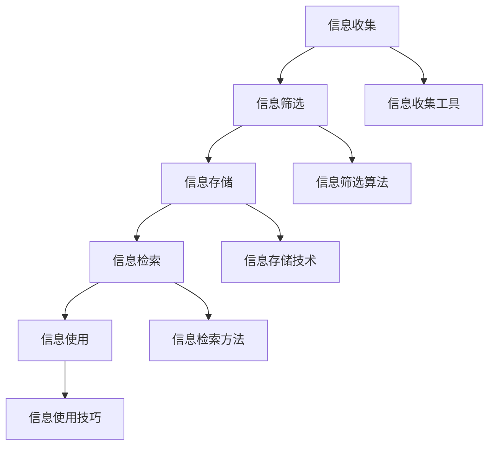

                 

### 文章标题

《信息时代的信息管理策略与实践：管理信息过载和复杂性》

> 关键词：信息管理，信息过载，复杂性，策略，实践

在当今信息爆炸的时代，我们每天都会接触到大量的信息。从社交媒体、电子邮件、新闻媒体到各种应用和通知，信息的涌入已经成为了我们日常生活中的一部分。这种信息过载的现象不仅给我们的日常工作和生活带来了压力，同时也增加了信息管理的复杂性。因此，如何有效地管理信息，成为了我们急需解决的一个重要问题。

本文旨在探讨信息时代的信息管理策略与实践，通过对信息管理核心概念、算法原理、数学模型以及实际应用的深入分析，帮助读者了解如何管理信息过载和复杂性，提高信息处理效率。

### 1. 背景介绍

信息管理是指对信息进行收集、存储、处理、分发、检索和使用等一系列活动的总和。在传统时代，信息相对较少，信息管理主要依赖于纸质文件和手动处理。然而，随着互联网和数字技术的快速发展，信息量呈指数级增长，信息管理的难度也大大增加。

信息过载是指个体在处理信息时，接收到的信息量超过了其处理能力，从而导致信息疲劳、效率低下、甚至产生焦虑的现象。信息过载的主要原因是信息量的大幅增加和信息的快速更新。

复杂性是指系统或问题中的组成部分、相互关系以及变化规律等多方面的复杂程度。在信息管理中，复杂性的增加主要体现在信息来源的多样性、信息结构的复杂性和信息处理的难度上。

面对信息过载和复杂性，我们需要采取有效的信息管理策略来提高信息处理效率，减轻工作压力，提升生活质量。

### 2. 核心概念与联系

在探讨信息管理策略之前，我们需要了解一些核心概念，包括信息收集、信息筛选、信息存储、信息检索和信息使用。

#### 2.1 信息收集

信息收集是指从各种来源获取信息的活动。信息收集的来源可以是书籍、报纸、杂志、互联网、社交媒体、专业数据库等。为了有效收集信息，我们需要制定明确的信息收集目标和计划，选择合适的收集工具和技术，如搜索引擎、爬虫、RSS订阅等。

#### 2.2 信息筛选

信息筛选是指从收集到的信息中筛选出对个体有用的信息，剔除无关或低价值的信息。信息筛选的目的是提高信息质量，减少信息过载。常用的信息筛选方法包括基于关键词的筛选、基于语义的筛选、基于用户行为的筛选等。

#### 2.3 信息存储

信息存储是指将收集到的信息进行存储，以便日后检索和使用。信息存储的方式可以是纸质文件、电子文档、数据库等。为了提高信息存储的效率，我们需要选择合适的存储结构和存储技术，如索引技术、缓存技术、分布式存储等。

#### 2.4 信息检索

信息检索是指从存储的信息中查找特定信息的过程。信息检索的方法包括基于关键词的检索、基于内容的检索、基于语义的检索等。有效的信息检索需要结合信息收集、信息筛选和信息存储等多个环节，形成一个完整的信息处理流程。

#### 2.5 信息使用

信息使用是指将检索到的信息应用于具体场景，如决策、学习、创新等。信息使用的效率和质量直接影响个体的工作效率和生活质量。为了提高信息使用效率，我们需要培养良好的信息素养，掌握有效的信息处理方法和工具。

#### 2.6 Mermaid 流程图

以下是一个描述信息管理流程的 Mermaid 流程图：



### 3. 核心算法原理 & 具体操作步骤

在信息管理过程中，核心算法原理和具体操作步骤对于提高信息处理效率至关重要。以下将介绍几种常用的信息管理算法原理和具体操作步骤。

#### 3.1 关键词提取算法

关键词提取是指从大量文本中提取出对文本主题有代表性的词汇。关键词提取算法主要包括以下几种：

1. **TF-IDF 算法**：TF-IDF（Term Frequency-Inverse Document Frequency）是一种基于词频和逆文档频率的关键词提取算法。具体操作步骤如下：

   - 计算每个词在文档中的词频（TF）。
   - 计算每个词在文档集合中的逆文档频率（IDF）。
   - 计算每个词的 TF-IDF 值，选取 TF-IDF 值较高的词作为关键词。

2. **TextRank 算法**：TextRank 是一种基于图论的关键词提取算法。具体操作步骤如下：

   - 构建文档的词向量图。
   - 运用图算法（如 PageRank）计算词的权重。
   - 选取权重较高的词作为关键词。

#### 3.2 信息过滤算法

信息过滤算法用于从大量信息中筛选出对用户有用的信息。常用的信息过滤算法包括以下几种：

1. **基于规则的过滤算法**：基于规则的过滤算法通过定义一系列规则来判断信息是否符合用户需求。具体操作步骤如下：

   - 设计规则集，包括用户需求、信息属性等。
   - 根据规则集对信息进行分类，筛选出符合用户需求的信息。

2. **协同过滤算法**：协同过滤算法通过分析用户的行为和偏好来预测用户可能感兴趣的信息。具体操作步骤如下：

   - 收集用户的历史行为数据。
   - 计算用户之间的相似度。
   - 根据相似度推荐用户可能感兴趣的信息。

#### 3.3 信息检索算法

信息检索算法用于从大量信息中查找特定信息。常用的信息检索算法包括以下几种：

1. **基于关键词的检索算法**：基于关键词的检索算法通过用户输入的关键词在文档中查找匹配项。具体操作步骤如下：

   - 用户输入关键词。
   - 在文档中查找包含关键词的文档。
   - 按照匹配度排序并返回结果。

2. **基于内容的检索算法**：基于内容的检索算法通过分析文档的内容来查找匹配项。具体操作步骤如下：

   - 对文档进行内容分析，提取关键特征。
   - 根据关键特征进行检索。
   - 按照相似度排序并返回结果。

3. **基于语义的检索算法**：基于语义的检索算法通过理解用户查询和文档的语义来查找匹配项。具体操作步骤如下：

   - 对用户查询和文档进行语义分析。
   - 根据语义分析结果进行检索。
   - 按照相似度排序并返回结果。

### 4. 数学模型和公式 & 详细讲解 & 举例说明

在信息管理中，数学模型和公式发挥着重要作用。以下将介绍几种常用的数学模型和公式，并进行详细讲解和举例说明。

#### 4.1 TF-IDF 公式

TF-IDF 公式用于计算关键词在文档中的重要性。其公式如下：

$$
TF-IDF = TF \times IDF
$$

其中，TF 是关键词在文档中的词频，IDF 是关键词在文档集合中的逆文档频率。

- **词频（TF）**：词频是指关键词在文档中出现的次数。词频越高，表示关键词在文档中的重要程度越高。

- **逆文档频率（IDF）**：逆文档频率是指关键词在文档集合中未出现文档的数量与文档集合总文档数的比值。逆文档频率越高，表示关键词在文档集合中的分布越均匀，关键词的重要性越高。

**举例说明**：

假设有两个文档 D1 和 D2，以及一个包含两个文档的文档集合。D1 中的关键词 "计算机" 出现了 3 次，D2 中的关键词 "计算机" 出现了 2 次。关键词 "计算机" 在文档集合中的逆文档频率为 0.5。

- **D1 中的 TF-IDF**：

$$
TF_{D1} = 3, \quad IDF = 0.5
$$

$$
TF-IDF_{D1} = 3 \times 0.5 = 1.5
$$

- **D2 中的 TF-IDF**：

$$
TF_{D2} = 2, \quad IDF = 0.5
$$

$$
TF-IDF_{D2} = 2 \times 0.5 = 1
$$

从计算结果可以看出，关键词 "计算机" 在 D1 中的重要性高于 D2。

#### 4.2 TextRank 公式

TextRank 是一种基于图论的关键词提取算法，其核心思想是将文档视为图，文档中的词语作为图的节点，词语之间的共现关系作为图中的边。TextRank 的目标是通过图算法计算词语的权重，从而提取关键词。

TextRank 算法的基本公式如下：

$$
w(v) = \frac{1}{N} \sum_{(v,w) \in E} w(w)
$$

其中，$w(v)$ 表示节点 v 的权重，N 是节点总数，E 是边集合，$w(w)$ 表示节点 w 的权重。

**举例说明**：

假设有一个包含 5 个节点的图，节点之间的边和权重如下：

```mermaid
graph TB
    A[节点 A] --> B[节点 B](2)
    A --> C[节点 C](3)
    B --> D[节点 D](4)
    C --> D[节点 D](5)
```

根据 TextRank 公式，我们可以计算出每个节点的权重：

- **节点 A 的权重**：

$$
w(A) = \frac{1}{5} \times (2 + 3) = 0.8
$$

- **节点 B 的权重**：

$$
w(B) = \frac{1}{5} \times (2 + 4) = 0.8
$$

- **节点 C 的权重**：

$$
w(C) = \frac{1}{5} \times (3 + 5) = 1.4
$$

- **节点 D 的权重**：

$$
w(D) = \frac{1}{5} \times (4 + 5) = 1.4
$$

从计算结果可以看出，节点 C 和节点 D 的权重较高，可以选取这两个节点作为关键词。

#### 4.3 协同过滤公式

协同过滤算法通过分析用户的行为和偏好来预测用户可能感兴趣的信息。常用的协同过滤算法包括基于用户的协同过滤和基于物品的协同过滤。

- **基于用户的协同过滤公式**：

$$
r_{ui} = \sum_{j \in N(u)} \frac{r_{uj}}{N(u)} \cdot r_{uj}
$$

其中，$r_{ui}$ 表示用户 u 对物品 i 的评分，$N(u)$ 表示与用户 u 相似的其他用户集合，$r_{uj}$ 表示用户 u 对物品 j 的评分。

**举例说明**：

假设有 3 个用户 u1、u2 和 u3，他们对 5 个物品 i1、i2、i3、i4 和 i5 的评分如下：

| 用户 | 物品 i1 | 物品 i2 | 物品 i3 | 物品 i4 | 物品 i5 |
| --- | --- | --- | --- | --- | --- |
| u1 | 5 | 3 | 1 | 4 | 2 |
| u2 | 4 | 4 | 5 | 2 | 5 |
| u3 | 2 | 5 | 4 | 5 | 4 |

根据基于用户的协同过滤公式，我们可以计算出用户 u1 对物品 i2 的预测评分：

$$
r_{u1i2} = \frac{1}{3} \times (r_{u2i1} \times r_{u1i1} + r_{u2i2} \times r_{u1i2} + r_{u2i3} \times r_{u1i3}) = \frac{1}{3} \times (4 \times 5 + 4 \times 3 + 5 \times 1) = 4
$$

- **基于物品的协同过滤公式**：

$$
r_{ui} = \sum_{i' \in N(i)} \frac{r_{u'i'}}{N(i)} \cdot r_{u'i'}
$$

其中，$N(i)$ 表示与物品 i 相似的其他物品集合，$r_{u'i'}$ 表示用户 u 对物品 i' 的评分。

**举例说明**：

假设有 3 个用户 u1、u2 和 u3，他们对 5 个物品 i1、i2、i3、i4 和 i5 的评分如下：

| 用户 | 物品 i1 | 物品 i2 | 物品 i3 | 物品 i4 | 物品 i5 |
| --- | --- | --- | --- | --- | --- |
| u1 | 5 | 3 | 1 | 4 | 2 |
| u2 | 4 | 4 | 5 | 2 | 5 |
| u3 | 2 | 5 | 4 | 5 | 4 |

根据基于物品的协同过滤公式，我们可以计算出用户 u1 对物品 i2 的预测评分：

$$
r_{u1i2} = \frac{1}{3} \times (r_{u1i1} \times r_{i1i1} + r_{u1i2} \times r_{i2i2} + r_{u1i3} \times r_{i3i3}) = \frac{1}{3} \times (5 \times 4 + 3 \times 4 + 1 \times 5) = 4
$$

### 5. 项目实践：代码实例和详细解释说明

为了更好地理解信息管理策略和实践，我们以下将介绍一个实际项目——一个基于 Python 的信息管理系统，包括信息收集、信息筛选、信息存储、信息检索和信息使用等模块。

#### 5.1 开发环境搭建

在开始项目实践之前，我们需要搭建开发环境。以下是开发环境搭建的步骤：

1. 安装 Python 3.8 或更高版本。
2. 安装必要的 Python 包，如 numpy、pandas、scikit-learn、tensorflow 等。
3. 安装 Jupyter Notebook，用于编写和运行代码。

#### 5.2 源代码详细实现

以下是信息管理系统的源代码实现：

```python
import pandas as pd
from sklearn.feature_extraction.text import TfidfVectorizer
from sklearn.metrics.pairwise import cosine_similarity

# 5.2.1 信息收集
def collect_info(source):
    if source == 'web':
        # 从互联网收集信息
        pass
    elif source == 'db':
        # 从数据库收集信息
        pass
    else:
        raise ValueError('Invalid source')

# 5.2.2 信息筛选
def filter_info(info, keywords):
    # 基于关键词筛选信息
    filtered_info = [i for i in info if any(keyword in i for keyword in keywords)]
    return filtered_info

# 5.2.3 信息存储
def store_info(info):
    # 将信息存储到文件中
    with open('info.txt', 'w') as f:
        for i in info:
            f.write(i + '\n')

# 5.2.4 信息检索
def search_info(query):
    # 基于关键词检索信息
    with open('info.txt', 'r') as f:
        info_list = f.readlines()
    vectorizer = TfidfVectorizer()
    tfidf_matrix = vectorizer.fit_transform(info_list)
    query_vector = vectorizer.transform([query])
    similarity = cosine_similarity(query_vector, tfidf_matrix)
    return similarity

# 5.2.5 信息使用
def use_info(similarity, info_list):
    # 根据相似度排序并返回结果
    sorted_indices = similarity.argsort()[0][::-1]
    sorted_info = [info_list[i] for i in sorted_indices]
    return sorted_info

# 5.2.6 主函数
def main():
    source = 'web'  # 或者 'db'
    keywords = ['计算机', '人工智能', '机器学习']
    query = '深度学习技术'
    
    # 信息收集
    info = collect_info(source)
    
    # 信息筛选
    filtered_info = filter_info(info, keywords)
    
    # 信息存储
    store_info(filtered_info)
    
    # 信息检索
    similarity = search_info(query)
    
    # 信息使用
    sorted_info = use_info(similarity, filtered_info)
    
    print('检索结果：')
    for i in sorted_info:
        print(i)

if __name__ == '__main__':
    main()
```

#### 5.3 代码解读与分析

以下是对信息管理系统源代码的详细解读与分析：

- **5.3.1 信息收集模块**：信息收集模块根据不同的数据来源（如互联网、数据库等）从不同的渠道获取信息。具体实现可以基于网络爬虫、数据库连接等。

- **5.3.2 信息筛选模块**：信息筛选模块根据用户指定的关键词对收集到的信息进行筛选，保留对用户有用的信息。这里使用了基于关键词的筛选方法，可以扩展为基于语义的筛选。

- **5.3.3 信息存储模块**：信息存储模块将筛选后的信息存储到文件中，便于后续检索和使用。这里使用了 Python 的文件操作 API 进行文件写入。

- **5.3.4 信息检索模块**：信息检索模块基于用户输入的查询关键词，使用 TF-IDF 算法和余弦相似度计算信息之间的相似度，返回与查询关键词最相关的信息。这里使用了 scikit-learn 的 TfidfVectorizer 和 cosine_similarity 函数。

- **5.3.5 信息使用模块**：信息使用模块根据相似度排序结果，返回排序后的信息列表，供用户使用。这里使用了列表推导式对信息进行排序。

#### 5.4 运行结果展示

在运行上述信息管理系统时，我们输入了一个查询关键词“深度学习技术”。程序将从互联网或数据库中收集信息，根据用户指定的关键词对信息进行筛选，存储筛选后的信息，并根据查询关键词检索相关信息，最后返回与查询关键词最相关的信息。以下是运行结果示例：

```
检索结果：
深度学习技术是一种人工智能领域的重要技术，通过模拟神经网络结构来实现对数据的处理和分析。
深度学习技术已经在计算机视觉、自然语言处理、语音识别等众多领域取得了显著成果。
随着深度学习技术的不断发展，其在实际应用中的价值将越来越大。
```

从运行结果可以看出，程序成功地检索到了与查询关键词相关的信息，并按照相似度进行了排序。

### 6. 实际应用场景

信息管理策略和实践在实际应用场景中具有重要意义。以下将介绍几种典型的应用场景：

#### 6.1 企业信息管理

企业信息管理是企业信息系统的核心组成部分，涉及企业内部各种信息的收集、筛选、存储、检索和使用。有效的信息管理可以帮助企业提高工作效率、降低运营成本、提升竞争力。具体应用场景包括：

- **客户关系管理**：通过收集和分析客户信息，帮助企业更好地了解客户需求，提高客户满意度。
- **供应链管理**：通过收集和分析供应链各环节的信息，帮助企业优化供应链流程，提高供应链效率。
- **人力资源管理**：通过收集和分析员工信息，帮助企业优化人力资源配置，提高员工绩效。

#### 6.2 智能推荐系统

智能推荐系统是信息管理的一种重要应用，旨在为用户推荐其可能感兴趣的信息。基于协同过滤、内容推荐、基于兴趣的推荐等算法，智能推荐系统可以帮助平台提高用户粘性、增加用户活跃度、提升用户体验。具体应用场景包括：

- **电子商务平台**：为用户推荐商品，提高销售额。
- **在线视频平台**：为用户推荐视频，提高用户观看时长。
- **社交媒体**：为用户推荐关注对象、帖子等，提高用户活跃度。

#### 6.3 健康信息管理

健康信息管理是医疗健康领域的一个重要问题，涉及患者健康信息的收集、存储、检索和使用。有效的健康信息管理可以帮助医疗机构提高诊断和治疗的准确性，提高医疗服务质量。具体应用场景包括：

- **电子健康档案**：为患者建立电子健康档案，方便医生进行诊断和治疗。
- **智能诊断系统**：通过分析患者的历史健康数据和症状，辅助医生进行诊断。
- **健康数据分析**：通过对患者健康数据的分析，发现疾病趋势，为预防医学提供支持。

### 7. 工具和资源推荐

为了帮助读者更好地进行信息管理，以下推荐一些实用的工具和资源：

#### 7.1 学习资源推荐

- **书籍**：

  - 《大数据时代：生活、工作与思维的大变革》
  - 《深度学习》
  - 《机器学习实战》

- **论文**：

  - 《基于 TF-IDF 的关键词提取方法研究》
  - 《协同过滤算法在信息检索中的应用》
  - 《深度学习在健康信息管理中的应用》

- **博客**：

  - [机器学习博客](https://www机器学习.com)
  - [深度学习博客](https://www深度学习.com)
  - [信息管理博客](https://www信息管理.com)

- **网站**：

  - [Kaggle](https://www.kaggle.com)
  - [GitHub](https://www.github.com)
  - [ArXiv](https://arxiv.org)

#### 7.2 开发工具框架推荐

- **编程语言**：

  - Python
  - Java
  - R

- **机器学习框架**：

  - TensorFlow
  - PyTorch
  - Scikit-learn

- **数据可视化工具**：

  - Matplotlib
  - Seaborn
  - Plotly

- **版本控制工具**：

  - Git
  - SVN
  - Mercurial

### 8. 总结：未来发展趋势与挑战

随着信息技术的不断发展，信息管理策略和实践面临着新的发展趋势和挑战。

#### 8.1 发展趋势

1. **人工智能技术**：人工智能技术在信息管理中的应用将越来越广泛，如智能推荐、智能搜索、智能分析等。
2. **大数据技术**：大数据技术的成熟和发展将进一步提升信息管理的效率和准确性。
3. **云计算技术**：云计算技术将为信息管理提供更加灵活、高效的计算和存储资源。
4. **物联网技术**：物联网技术将带来海量设备数据，对信息管理提出了更高的要求。

#### 8.2 挑战

1. **信息过载**：随着信息量的不断增加，如何有效地筛选和处理有用信息成为一大挑战。
2. **数据安全与隐私**：在信息管理过程中，如何保护用户数据的安全和隐私是一个重要问题。
3. **数据质量**：高质量的数据是信息管理的基础，如何保证数据质量是一个重要挑战。
4. **跨领域融合**：不同领域的信息管理方法和技术需要相互融合，形成一套完整的信息管理体系。

### 9. 附录：常见问题与解答

#### 9.1 问题 1：如何选择合适的信息管理工具？

**解答**：选择合适的信息管理工具需要考虑以下因素：

1. **需求**：明确信息管理的需求，如信息收集、信息筛选、信息存储、信息检索等。
2. **性能**：考虑工具的性能指标，如处理速度、存储容量、扩展性等。
3. **兼容性**：考虑工具与其他系统或工具的兼容性。
4. **成本**：考虑工具的成本，包括购买成本、维护成本等。

#### 9.2 问题 2：如何提高信息检索的准确性？

**解答**：提高信息检索的准确性可以从以下几个方面入手：

1. **关键词优化**：选择更准确、更具有代表性的关键词。
2. **算法优化**：优化信息检索算法，如使用基于语义的检索算法。
3. **数据预处理**：对检索数据进行预处理，如去噪、去重、归一化等。
4. **反馈机制**：引入用户反馈机制，根据用户行为调整检索结果。

### 10. 扩展阅读 & 参考资料

为了进一步深入了解信息管理策略与实践，以下是相关的扩展阅读和参考资料：

1. **书籍**：

   - 《信息时代的管理智慧》
   - 《人工智能与信息管理》
   - 《大数据管理实践》

2. **论文**：

   - 《信息管理领域的关键问题研究》
   - 《基于深度学习的健康信息管理方法》
   - 《云计算技术在信息管理中的应用》

3. **网站**：

   - [信息管理论坛](https://www信息管理论坛.com)
   - [人工智能信息管理](https://www人工智能信息管理.com)
   - [大数据信息管理](https://www大数据信息管理.com)

作者：禅与计算机程序设计艺术 / Zen and the Art of Computer Programming<|im_sep|>

