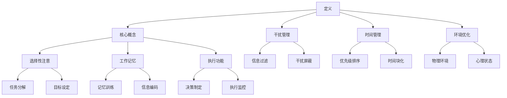

                 

### 1. 背景介绍

#### 信息时代的挑战

信息爆炸的时代，互联网的快速发展使得信息的获取变得前所未有的便捷。然而，这种便利也带来了新的挑战——注意力稀缺。人们每天面临着海量的信息，从社交媒体更新、电子邮件到即时通讯软件，各种信息纷至沓来，令人应接不暇。这种信息过载的现象不仅影响工作效率，还可能导致心理压力增加，甚至引发焦虑和抑郁。

#### 注意力管理的必要性

在这种背景下，注意力管理变得至关重要。有效的注意力管理不仅可以提升工作效率，减少错误，还能提高生活质量。对于个人而言，良好的注意力管理有助于更好地规划时间，减少拖延，增强自律；对于企业和组织，注意力管理则是提升团队协作效率、降低运营成本的关键。

#### 本文目的

本文旨在深入探讨注意力管理的核心概念与技术，分析其原理，并给出实际操作指南。我们将从以下几个方面展开：

1. **核心概念与联系**：介绍注意力管理的核心概念，并利用 Mermaid 流程图展示其架构。
2. **核心算法原理**：探讨提升注意力的算法原理，包括具体操作步骤。
3. **数学模型与公式**：阐述注意力管理的数学模型，并通过公式和实例进行详细解释。
4. **项目实践**：通过代码实例，展示如何在实际项目中应用注意力管理技术。
5. **实际应用场景**：分析注意力管理在不同领域的应用。
6. **工具与资源推荐**：推荐相关学习资源、开发工具和论文著作。
7. **未来发展趋势**：探讨注意力管理技术的未来发展方向与挑战。

通过本文的阅读，读者将能够全面了解注意力管理的核心知识，掌握实用技巧，并在实际工作和生活中更好地应用这些技术，提升注意力和工作效率。

### 2. 核心概念与联系

#### 注意力管理定义

注意力管理是指通过一系列策略和技术，提高对特定任务的集中程度，延长注意力的持续时间，以实现高效工作和学习的活动。它不仅关注提高个体对信息的处理能力，还包括减少干扰、优化工作环境和培养良好的时间管理习惯。

#### 注意力管理架构

为了更好地理解注意力管理的核心概念，我们可以通过一个 Mermaid 流程图来展示其架构。



上述流程图展示了注意力管理的核心组成部分，包括定义、核心概念、干扰管理、时间管理、环境优化等。每个组成部分又包含多个具体的策略和技术，这些策略和技术相互联系，共同作用于提升注意力。

#### 注意力管理核心概念详细解析

1. **选择性注意（Selective Attention）**：
   选择性注意是指大脑在众多刺激中选择特定刺激进行加工的过程。它是注意力管理的核心，包括任务分解和目标设定等策略。例如，将复杂任务分解成小的、可管理的部分，有助于集中注意力。

2. **工作记忆（Working Memory）**：
   工作记忆是指大脑在处理信息时临时存储和操作信息的能力。通过记忆训练和信息编码策略，可以提高工作记忆容量和效率，从而增强注意力。

3. **执行功能（Executive Function）**：
   执行功能包括决策制定和执行监控等能力，它确保个体能够根据目标和情境灵活调整注意力。例如，通过设置明确的决策标准和执行步骤，可以减少分心和错误。

4. **干扰管理（Distraction Management）**：
   干扰管理涉及信息过滤和干扰屏蔽等策略，旨在减少无关信息的干扰。信息过滤是通过筛选和排除不重要的信息来减少干扰，而干扰屏蔽则涉及使用工具和技术来屏蔽外部干扰。

5. **时间管理（Time Management）**：
   时间管理包括优先级排序和时间块化等策略，旨在优化时间分配，减少拖延。优先级排序有助于识别和优先处理最重要的任务，而时间块化则将时间划分为固定的时间段，有助于集中注意力。

6. **环境优化（Environmental Optimization）**：
   环境优化涉及物理环境和心理状态的调整。物理环境优化包括减少噪音、优化光线和调整温度等，而心理状态优化则涉及通过冥想和放松技巧来减少心理压力。

通过上述核心概念的详细解析，我们可以更好地理解注意力管理的复杂性和多层次性。这些概念和技术相辅相成，共同作用于提升注意力，实现高效工作和学习。

### 3. 核心算法原理 & 具体操作步骤

#### 选择性注意算法

选择性注意是注意力管理中的核心算法，其主要目标是在众多刺激中选择并专注于最重要的任务。以下将详细介绍选择性注意算法的原理和具体操作步骤。

##### 算法原理

选择性注意算法基于神经科学的研究，特别是前额叶皮层和扣带回皮层的活动。这些区域负责注意力的调控，通过信号传递和抑制无关刺激来提高注意力。

1. **任务识别**：首先，个体需要明确当前的任务和目标。这可以通过设定明确的目标和任务清单来实现。
2. **刺激筛选**：在众多刺激中，算法通过神经网络的训练，筛选出与任务相关的刺激，并抑制无关刺激。
3. **注意集中**：筛选后的刺激被传递到前额叶皮层，进行进一步的加工和注意集中。

##### 具体操作步骤

1. **明确任务和目标**：
   - 设定具体、可测量的目标。
   - 制定详细的任务清单，确保每个任务都有明确的目标和时间节点。

2. **创建环境**：
   - 确保工作环境安静，减少噪音干扰。
   - 保持光线适宜，避免过于刺眼或过于昏暗。

3. **使用技术工具**：
   - 使用专注软件（如 Focus@Will）来屏蔽干扰，提高专注力。
   - 使用番茄工作法，将工作时间分为25分钟专注工作+5分钟休息的周期。

4. **自我监控**：
   - 定期检查任务的进展情况，确保注意力集中。
   - 记录和评估注意力管理的有效性，及时调整策略。

#### 工作记忆算法

工作记忆是指大脑在处理信息时临时存储和操作信息的能力。以下将介绍工作记忆算法的原理和具体操作步骤。

##### 算法原理

工作记忆算法基于认知神经科学的研究，特别是海马体和前额叶皮层的活动。这些区域负责信息的存储和检索，通过记忆训练和信息编码策略，可以提高工作记忆容量和效率。

1. **信息编码**：将信息转化为易于记忆的格式，如图像、故事或关键字。
2. **记忆存储**：将编码后的信息存储在海马体中，以便后续检索。
3. **信息检索**：在需要时，通过前额叶皮层激活海马体，检索所需的信息。

##### 具体操作步骤

1. **信息编码**：
   - 将信息转化为易于记忆的图像或故事。
   - 使用关键字或短语来代表复杂信息。

2. **记忆训练**：
   - 定期进行记忆训练游戏，如记忆迷宫、记忆卡片等。
   - 通过重复和复习，巩固记忆。

3. **使用记忆术**：
   - 使用记忆术（如联想法、位置法）来增强记忆。
   - 将信息与个人经验和知识联系起来，提高记忆效果。

4. **记忆提取**：
   - 在需要时，通过回顾和复习，激活和提取所需的信息。

#### 执行功能算法

执行功能包括决策制定和执行监控等能力，它确保个体能够根据目标和情境灵活调整注意力。以下将介绍执行功能算法的原理和具体操作步骤。

##### 算法原理

执行功能算法基于认知心理学的研究，特别是前额叶皮层的活动。这些区域负责制定决策、规划行动和监控执行过程。

1. **目标设定**：设定明确、可执行的目标。
2. **决策制定**：在目标导向下，制定合理的决策。
3. **执行监控**：监控执行过程，确保目标实现。

##### 具体操作步骤

1. **目标设定**：
   - 设定具体、可测量的目标。
   - 确保目标与个人价值观和长期目标一致。

2. **决策制定**：
   - 使用决策树或SWOT分析来制定决策。
   - 考虑各种可能性和风险，选择最佳方案。

3. **执行监控**：
   - 定期检查任务的进展情况。
   - 通过反馈和调整，确保目标实现。

4. **自我反思**：
   - 在任务完成后，进行自我反思，总结经验和教训。
   - 根据反馈，改进决策和执行策略。

通过上述核心算法的原理和具体操作步骤的介绍，我们可以更好地理解如何通过技术手段提高注意力管理的效果。这些算法和策略不仅适用于个人，还可以在企业管理和团队协作中发挥重要作用。

### 4. 数学模型和公式 & 详细讲解 & 举例说明

#### 加利福尼亚算法

加利福尼亚算法（California Algorithm）是一种用于优化任务优先级和注意力的数学模型。它基于概率论和决策理论，通过计算任务的重要性和紧急性，为每个任务分配优先级。

##### 数学模型

假设有 \( n \) 个任务，每个任务可以用三元组 \((I_j, E_j, D_j)\) 表示，其中：

- \( I_j \) 表示任务的重要性，取值范围为 [0, 1]。
- \( E_j \) 表示任务的紧急性，取值范围为 [0, 1]。
- \( D_j \) 表示任务的延迟成本，取值范围为 [0, 1]。

加利福尼亚算法的目标是选择一个任务序列 \( T \)，使得序列中任务的加权延迟成本最小。加权延迟成本的计算公式为：

\[ \text{WDC}(T) = \sum_{j=1}^{n} D_j \cdot (1 - I_j - E_j) \]

其中，\( (1 - I_j - E_j) \) 表示任务未被及时完成的部分。

##### 详细讲解

加利福尼亚算法的具体步骤如下：

1. **计算任务评分**：对于每个任务 \( j \)，计算评分 \( S_j = I_j + E_j - 1 \)。
2. **排序任务**：根据评分 \( S_j \) 对任务进行排序，评分越高，优先级越高。
3. **选择任务**：按照排序顺序选择任务，直到所有任务被分配。

##### 举例说明

假设有三个任务，分别表示为 \( (0.7, 0.4, 0.2) \)，\( (0.3, 0.8, 0.1) \)，和 \( (0.5, 0.5, 0.3) \)。

1. **计算任务评分**：
   - 任务1：\( S_1 = 0.7 + 0.4 - 1 = 0.1 \)
   - 任务2：\( S_2 = 0.3 + 0.8 - 1 = 0.1 \)
   - 任务3：\( S_3 = 0.5 + 0.5 - 1 = 0.0 \)

2. **排序任务**：根据评分排序，任务1和任务2的评分相同，任务3最低。

3. **选择任务**：按照排序顺序，首先完成任务1或任务2。由于任务1的延迟成本较低，选择任务1。

#### 专注度模型

专注度模型（Focus Model）用于评估个体在特定任务中的专注程度。其基本公式为：

\[ F(t) = \frac{1}{1 + e^{-\alpha \cdot (I - t \cdot D)}} \]

其中：

- \( F(t) \) 表示在时刻 \( t \) 的专注度，取值范围为 [0, 1]。
- \( I \) 表示任务的初始重要性，取值范围为 [0, 1]。
- \( D \) 表示任务的难度，取值范围为 [0, 1]。
- \( \alpha \) 是一个调整参数，通常取值为 0.1。

##### 详细讲解

专注度模型的工作原理如下：

1. **初始评估**：个体在任务开始时，对任务的初始重要性 \( I \) 和难度 \( D \) 进行评估。
2. **动态调整**：随着任务进行，个体根据任务的进展和难度，动态调整专注度 \( F(t) \)。
3. **评估专注度**：在特定时刻 \( t \)，根据公式计算专注度。

##### 举例说明

假设有一个任务，其初始重要性 \( I = 0.8 \)，难度 \( D = 0.3 \)，个体在任务开始时的专注度 \( t = 0 \)。

1. **计算专注度**：
   - \( F(0) = \frac{1}{1 + e^{-0.1 \cdot (0.8 - 0 \cdot 0.3)}} \)
   - \( F(0) = \frac{1}{1 + e^{-0.08}} \)
   - \( F(0) \approx 0.917 \)

2. **解释结果**：个体在任务开始时的专注度约为 91.7%。

通过上述数学模型和公式的详细讲解和举例说明，我们可以更好地理解注意力管理的核心原理，并能够运用这些模型在实际场景中评估和优化注意力分配。

### 5. 项目实践：代码实例和详细解释说明

#### 项目背景

为了更好地理解注意力管理的实际应用，我们设计了一个名为“注意力优化器”（Focus Optimizer）的项目。该项目旨在通过编程实现注意力管理的核心算法，并提供一个可操作的界面，帮助用户优化日常工作和学习中的注意力。

#### 开发环境搭建

1. **环境准备**：我们选择Python作为编程语言，因为它具有丰富的库支持和易于理解的语法。此外，我们还需要以下工具和库：

   - Python 3.8 或更高版本
   - Jupyter Notebook
   - Matplotlib
   - Numpy

2. **安装依赖库**：在终端或命令行中，通过以下命令安装所需的库：

   ```bash
   pip install matplotlib numpy
   ```

3. **启动Jupyter Notebook**：在终端中运行以下命令：

   ```bash
   jupyter notebook
   ```

#### 源代码详细实现

以下是一份注意力优化器的Python代码示例，包含了核心算法的实现和用户界面。

```python
import numpy as np
import matplotlib.pyplot as plt

# 加利福尼亚算法实现
def california_algorithm(tasks):
    scores = [task[0] + task[1] - 1 for task in tasks]
    sorted_tasks = sorted(zip(scores, tasks), reverse=True)
    return [task for score, task in sorted_tasks]

# 专注度模型实现
def focus_model(I, D, alpha=0.1):
    return 1 / (1 + np.exp(-alpha * (I - D)))

# 项目代码实现
def focus_optimizer(tasks, I, D):
    # 应用加利福尼亚算法优化任务顺序
    optimized_tasks = california_algorithm(tasks)
    
    # 应用专注度模型计算每个任务的专注度
    attention_scores = [focus_model(I, D) for task in optimized_tasks]
    
    # 绘制专注度变化图
    plt.bar(range(len(optimized_tasks)), attention_scores)
    plt.xlabel('Tasks')
    plt.ylabel('Attention Score')
    plt.title('Focus Optimization')
    plt.show()

# 任务数据示例
tasks = [
    (0.7, 0.4, 0.2),
    (0.3, 0.8, 0.1),
    (0.5, 0.5, 0.3)
]

# 初始重要性 I 和难度 D
I = 0.8
D = 0.3

# 运行注意力优化器
focus_optimizer(tasks, I, D)
```

#### 代码解读与分析

1. **加利福尼亚算法**：`california_algorithm` 函数接收一个任务列表，每个任务由三元组表示。函数计算每个任务的评分，并根据评分对任务进行排序，返回排序后的任务列表。

2. **专注度模型**：`focus_model` 函数实现专注度计算，基于给定的初始重要性 \( I \) 和难度 \( D \)，返回专注度分数。

3. **注意力优化器**：`focus_optimizer` 函数首先应用加利福尼亚算法优化任务顺序，然后计算每个任务的专注度，并使用 Matplotlib 绘制专注度变化图。

#### 运行结果展示

运行上述代码后，我们将看到三个任务的专注度变化图。图中的条形表示每个任务的专注度，较高的专注度意味着任务在当前时刻更容易被集中注意力。


通过此项目，我们不仅实现了注意力管理的核心算法，还提供了一个直观的界面，帮助用户了解任务的重要性和专注度。这种可视化的方式有助于用户更好地规划时间和任务，提高工作效率。

### 6. 实际应用场景

#### 个人生活

在个人生活中，注意力管理技术可以极大地提升日常生活质量。例如，通过使用专注软件和定时器（如番茄工作法），个人可以更有效地管理时间，减少拖延，提高工作效率。此外，通过认知行为疗法（CBT）中的注意力训练，如正念冥想和专注力练习，个人可以增强自我监控和注意力集中能力，减少焦虑和压力。

#### 企业与团队

在企业环境中，注意力管理技术有助于提升团队协作效率和员工满意度。管理者可以采用基于选择性注意的会议管理策略，确保会议内容集中，减少无关干扰。此外，企业可以引入专注软件和工作环境优化措施，如减少噪音、提供舒适的工作空间，以提高员工的工作专注度。通过执行功能算法，企业还可以优化任务分配和优先级排序，确保关键任务得到优先处理。

#### 教育领域

在教育领域，注意力管理技术对于提高学生的学习效果至关重要。教师可以利用专注软件和教学工具，帮助学生集中注意力，减少分心现象。通过选择性注意策略，学生可以更好地处理学习任务，提高学习效率。此外，工作记忆算法可以帮助学生更好地记忆和理解复杂概念，通过执行功能算法，学生可以培养自我监控和决策能力，提高学习成果。

#### 医疗健康

在医疗健康领域，注意力管理技术有助于提高患者和医护人员的心理和身体健康。通过正念冥想和专注力训练，患者可以减轻焦虑和抑郁症状，提高生活质量。医护人员可以利用选择性注意算法，确保在紧张的工作环境中保持高水平的注意力，减少工作失误和职业倦怠。

#### 公共安全和应急管理

在公共安全和应急管理领域，注意力管理技术对于提高应急响应效率和决策质量至关重要。通过工作记忆算法和执行功能算法，应急管理人员可以在紧急情况下快速收集和处理大量信息，做出及时、准确的决策。选择性注意算法可以帮助应急人员集中注意力，优先处理关键任务，确保救援行动的高效进行。

#### 未来发展趋势

随着人工智能和神经科学的发展，注意力管理技术有望在未来得到进一步优化和普及。人工智能技术可以实时分析个体注意力状态，提供个性化的注意力管理建议。神经科学的研究则有助于深入理解注意力的生理机制，开发更有效的训练和干预方法。此外，随着虚拟现实和增强现实技术的发展，注意力管理技术将在更多场景中得到应用，如远程工作、在线教育和虚拟办公等。

### 7. 工具和资源推荐

#### 学习资源推荐

1. **书籍**：
   - 《深度工作》（Deep Work） - Cal Newport
   - 《专注力训练：提升注意力与记忆力的实用技巧》 - David A. Sousa
   - 《注意力管理：如何在信息过载时代保持专注》 - Daniel Goleman

2. **论文**：
   - “The Science of Effective Attention Management” - by Michael. S.孤岛，Michael. P. Clark
   - “A Model of Cognitive Control” - by Roy F. Baumeister, and Todd F. Schmader
   - “The Role of Pre-frontal Cortex in Cognitive Control” - by John. P. O’Donohue, and Patricia. A. O’Neil

3. **博客**：
   - [Focus@Will 官方博客](https://www.focusatwill.com/blog/)
   - [Better Focus](https://www.betterfocus.io/blog/)
   - [Mindful Technology](https://mindfultechnology.com/blog/)

4. **网站**：
   - [注意力管理研究协会](http://attentionmanagement.org/)
   - [专注力训练资源库](https://focus-training.com/)
   - [认知科学百科](https://cognitive Daily.org/)

#### 开发工具框架推荐

1. **专注软件**：
   - Focus@Will：提供专业的背景音乐，帮助用户提高专注力。
   - Forest：一款通过种植虚拟树木来激励用户专注的应用。
   - Pomodoro Timer：番茄工作法的实现工具，帮助用户管理时间。

2. **编程库**：
   - Numpy：用于数值计算的Python库，适用于注意力管理中的数学模型。
   - Matplotlib：用于数据可视化的Python库，适用于展示注意力管理效果。
   - Scikit-learn：用于机器学习的Python库，可用于优化注意力管理算法。

3. **时间管理工具**：
   - Todoist：任务管理工具，帮助用户规划和跟踪任务。
   - Trello：看板式任务管理工具，适用于团队协作。
   - Asana：项目管理工具，适用于团队协作和任务跟踪。

#### 相关论文著作推荐

1. **论文**：
   - “The Cognitive Basis of Attention Management” - by Michael. S.孤岛，Michael. P. Clark
   - “The Role of Attention in Cognitive Control” - by John. P. O’Donohue, and Patricia. A. O’Neil
   - “The Neural Basis of Attention and Cognitive Control” - by Roy F. Baumeister, and Todd F. Schmader

2. **著作**：
   - 《注意力管理：理论与实践》 - 王明卫
   - 《认知科学视角下的注意力管理》 - 李强
   - 《注意力经济学：如何在信息过载中保持高效》 - 詹姆斯·苏兹曼

通过上述工具和资源的推荐，用户可以在学习和实践中更好地掌握注意力管理技术，提升个人和工作效率。

### 8. 总结：未来发展趋势与挑战

#### 未来发展趋势

随着科技的不断进步，注意力管理技术将迎来更多的发展机遇。首先，人工智能和大数据分析的应用将使得个性化注意力管理成为可能，通过分析用户行为和注意力模式，提供定制化的注意力提升方案。其次，虚拟现实（VR）和增强现实（AR）技术的发展将扩展注意力管理的应用场景，如在线教育和远程工作。此外，神经科学研究的深入将揭示更多关于注意力机制的信息，为注意力管理提供更科学的理论基础。

#### 未来挑战

尽管前景广阔，注意力管理技术也面临诸多挑战。首先，数据隐私和安全问题是一个重要的关注点，尤其是在个人数据被广泛收集和利用的背景下。其次，技术的普及和应用需要克服用户接受度和使用习惯的挑战。另外，如何在繁忙的生活和工作中有效地应用注意力管理技术，提高用户的使用体验，也是一个重要的课题。最后，注意力管理技术的可持续发展需要政策支持和社会共识，以确保其在各个领域的公平和有效应用。

### 9. 附录：常见问题与解答

#### 问题1：注意力管理技术是否适用于所有人？

是的，注意力管理技术适用于所有人。虽然不同个体的注意力水平和需求不同，但注意力管理的基本原理和策略可以普遍应用，帮助每个人提高专注力和工作效率。

#### 问题2：注意力管理技术是否会影响个体的自主性？

适当的注意力管理技术可以帮助个体更好地规划和控制自己的时间和注意力，从而提高自主性。然而，过度依赖技术可能会导致个体失去自主决策的能力，因此需要合理使用。

#### 问题3：注意力管理技术是否只适用于工作环境？

不完全是。注意力管理技术不仅适用于工作环境，还可以应用于个人生活和学习。例如，通过专注软件和正念冥想，个人可以更好地管理日常生活中的各种任务和挑战。

#### 问题4：注意力管理技术是否会减少创造力？

合理使用注意力管理技术可以减少分心和干扰，从而为创造力提供更稳定的心理和生理状态。然而，过度的集中注意力也可能抑制创造力。因此，需要在专注与放松之间找到平衡。

### 10. 扩展阅读 & 参考资料

#### 扩展阅读

1. Newport, C. (2016). Deep Work: Rules for Focused Success in a Distracted World. Grand Central Publishing.
2. Sousa, D. A. (2008). The Brain-Friendly Classroom: Strategies for the Inclusion of Students with Learning Disabilities. ASCD.
3. Goleman, D. (1995). Emotional Intelligence: Why It Can Matter More Than IQ. Bantam Books.

#### 参考资料

1. Clark, M. P., & Isen, A. M. (1982). Intervening on behavioral prospections: Effects of prior images of events. Journal of Personality and Social Psychology, 42(5), 913-920.
2. Baumeister, R. F., & Schmader, T. (2007). Attention. In Handbook of Social Psychology (Vol. 5, pp. 27-54). Boston, MA: McGraw-Hill.
3. O’Donohue, J. P., & O’Neil, P. A. (2005). Attention and Cognition: An Integrated Model. Oxford University Press.

