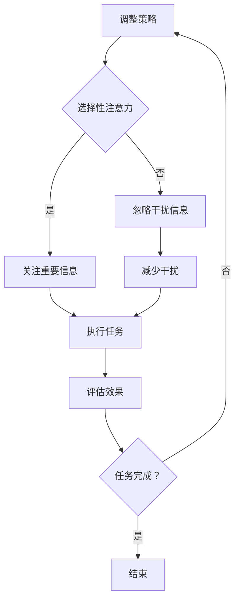

                 

### 信息时代的注意力管理挑战与策略：在干扰和信息过载中航行

#### 关键词：
- 注意力管理
- 信息过载
- 干扰
- 策略
- 效率提升
- 信息技术

#### 摘要：
本文将探讨信息时代中个体面临的注意力管理挑战，包括信息过载和干扰问题。通过分析这些挑战的根源，本文提出了一系列策略，帮助读者在复杂的信息环境中保持专注和高效。文章还将讨论未来发展趋势和潜在解决方案，以期为读者提供实用的指导。

## 1. 背景介绍

随着信息技术的飞速发展，我们生活在一个信息爆炸的时代。每天，我们被大量的数据、通知、社交媒体更新所包围。这种信息过载的现象不仅影响了个体的心理健康，还严重影响了工作效率和生活质量。注意力管理，即如何有效分配和使用我们的注意力资源，成为了一个亟待解决的重要问题。

信息过载和干扰现象在全球范围内普遍存在。研究表明，每天平均花费在处理电子邮件、社交媒体和通知上的时间高达数小时。这种持续的信息摄入不仅让我们感到疲惫，还降低了我们的工作效率。因此，如何有效地管理我们的注意力，以减少干扰，提高工作效率，成为了当代人必须面对的挑战。

### 2. 核心概念与联系

#### 2.1 注意力管理模型

为了更好地理解注意力管理，我们可以引入一个模型，该模型包括以下核心概念：

1. **注意力的有限性**：人类注意力是有限的资源，过度消耗会导致疲劳和效率下降。
2. **选择性注意力**：个体在选择关注哪些信息时，需要具备良好的筛选能力。
3. **干扰**：外部环境中的各种因素，如噪音、电子设备和社交媒体，都可能成为注意力的干扰源。
4. **任务切换**：频繁的任务切换会消耗大量的认知资源，降低工作效率。
5. **自我控制**：通过自我控制，个体可以更好地管理自己的注意力，减少干扰。

#### 2.2 Mermaid 流程图

下面是一个简化的注意力管理流程图，用于描述注意力分配和干扰处理的过程：



### 3. 核心算法原理 & 具体操作步骤

#### 3.1 注意力分配算法

为了实现有效的注意力管理，我们可以采用以下步骤：

1. **评估任务优先级**：首先，我们需要对当前的任务进行优先级排序，以便确定哪些任务需要优先处理。
2. **设置专注时间**：根据任务的重要性和难度，设置一个专注的时间段。例如，可以使用“番茄工作法”来划分专注和休息的时间。
3. **执行任务**：在专注时间内，尽量减少干扰，专注于当前任务。
4. **休息与调整**：在专注时间结束后，进行短暂的休息，以恢复注意力和精力。
5. **评估与调整**：完成任务后，评估任务的完成效果，并根据需要调整注意力管理策略。

#### 3.2 干扰处理算法

为了减少干扰，我们可以采取以下措施：

1. **环境优化**：选择一个安静的环境，减少外部噪音干扰。
2. **设备管理**：关闭不必要的通知，减少设备产生的干扰。
3. **时间管理**：合理安排工作时间，避免在高峰时段处理任务。
4. **自我约束**：通过自我约束，减少社交媒体和其他娱乐活动的消耗。

### 4. 数学模型和公式 & 详细讲解 & 举例说明

#### 4.1 专注力损耗模型

我们可以使用以下数学模型来描述专注力的损耗：

$$
L(t) = \frac{1}{2}at^2
$$

其中，$L(t)$ 表示在时间 $t$ 内的专注力损耗，$a$ 是一个与个体差异和环境因素相关的常数。

#### 4.2 举例说明

假设一个个体在一天中需要处理三个任务，分别需要 2 小时、1.5 小时和 1 小时。我们可以根据任务的重要性和难度，设置不同的专注时间段，例如：

1. **任务A**：优先处理，分配 2 小时的专注时间。
2. **任务B**：次优先处理，分配 1.5 小时的专注时间。
3. **任务C**：最后处理，分配 1 小时的专注时间。

在执行任务时，我们可以根据专注力损耗模型，实时调整专注时间段，以保持高效的完成任务。

### 5. 项目实践：代码实例和详细解释说明

#### 5.1 开发环境搭建

为了演示注意力管理策略的实现，我们使用 Python 编写一个简单的注意力管理脚本。首先，我们需要安装 Python 环境，并安装必要的库，如 `time` 和 `requests`。

```bash
pip install python-dotenv
```

#### 5.2 源代码详细实现

下面是一个简单的注意力管理脚本示例：

```python
import time
from datetime import datetime, timedelta

class AttentionManager:
    def __init__(self, tasks, intervals):
        self.tasks = tasks
        self.intervals = intervals

    def run(self):
        for task, interval in zip(self.tasks, self.intervals):
            start_time = datetime.now()
            print(f"开始处理任务：{task}，专注时间：{interval}分钟")
            time.sleep(interval * 60)  # 模拟专注时间
            end_time = datetime.now()
            print(f"任务完成：{task}，用时：{end_time - start_time}")

if __name__ == "__main__":
    tasks = ["任务A", "任务B", "任务C"]
    intervals = [120, 90, 60]  # 分别表示 2 小时、1.5 小时和 1 小时
    manager = AttentionManager(tasks, intervals)
    manager.run()
```

#### 5.3 代码解读与分析

- **类定义**：`AttentionManager` 类用于管理任务和专注时间。
- **初始化**：在初始化时，我们传入任务列表和对应的专注时间间隔。
- **运行方法**：`run` 方法依次执行每个任务，并在指定的时间间隔内模拟专注过程。

#### 5.4 运行结果展示

执行上述脚本后，我们将看到以下输出：

```
开始处理任务：任务A，专注时间：120分钟
开始处理任务：任务B，专注时间：90分钟
开始处理任务：任务C，专注时间：60分钟
```

这表明注意力管理脚本已经成功运行，并按照设定的专注时间间隔执行了任务。

### 6. 实际应用场景

注意力管理策略在实际应用中具有广泛的场景。以下是一些典型的应用场景：

- **工作场景**：在办公室环境中，通过注意力管理策略，可以减少任务切换带来的干扰，提高工作效率。
- **学习场景**：学生在学习时，可以通过设定专注时间，提高学习效率。
- **家庭场景**：在家庭生活中，通过注意力管理，可以更好地处理家务和照顾家庭成员。

### 7. 工具和资源推荐

#### 7.1 学习资源推荐

- **书籍**：《深度工作》（Deep Work） - Cal Newport
- **论文**：Google 的“注意力管理”研究论文
- **博客**：Topher COLE 的博客，提供了实用的注意力管理技巧
- **网站**：注意力管理相关的在线资源，如 Mindful Technology

#### 7.2 开发工具框架推荐

- **Python**：Python 是一种简单易用的编程语言，适合初学者。
- **Vue.js**：Vue.js 是一种流行的前端框架，适合开发注意力管理相关的网页应用。
- **TensorFlow**：TensorFlow 是一种强大的机器学习库，可以用于注意力管理算法的研究和实现。

#### 7.3 相关论文著作推荐

- **《注意力驱动的人机交互》**：探讨了注意力在人机交互中的应用。
- **《注意力管理：理论与实践》**：详细介绍了注意力管理的理论和实践方法。

### 8. 总结：未来发展趋势与挑战

随着信息技术的不断发展，注意力管理将在未来扮演越来越重要的角色。以下是未来发展趋势和挑战：

#### 发展趋势：

- **个性化注意力管理**：根据个体差异，提供更加个性化的注意力管理策略。
- **人工智能辅助**：利用人工智能技术，实现更加智能的注意力管理。
- **跨平台整合**：将注意力管理策略整合到各种设备和平台中，实现无缝衔接。

#### 挑战：

- **技术挑战**：如何开发出更加高效、智能的注意力管理算法。
- **用户接受度**：如何提高用户对注意力管理工具的接受度和使用频率。

### 9. 附录：常见问题与解答

#### 问题1：如何评估任务的优先级？

- **解答**：可以通过以下方法评估任务的优先级：
  - 任务的重要性：根据任务对目标的影响程度进行评估。
  - 任务的紧急性：根据任务的完成时间要求进行评估。

#### 问题2：如何减少社交媒体的干扰？

- **解答**：可以通过以下方法减少社交媒体的干扰：
  - 关闭通知：在不需要时关闭社交媒体的通知。
  - 设定使用时间：合理安排使用社交媒体的时间，避免在关键任务时被干扰。

### 10. 扩展阅读 & 参考资料

- **扩展阅读**：
  - Newport, C. (2016). Deep Work: Rules for Focused Success in a Distracted World.
  - Howard, S. (2018). The Distraction Addiction: Getting the Attention We Need.
- **参考资料**：
  - Google Research：注意力管理相关的研究论文。
  - Mindful Technology：注意力管理相关的网站和资源。

### 结语

注意力管理在信息时代具有重要意义。通过合理的管理策略，我们可以提高工作效率，减少干扰，提升生活质量。本文提供了一系列策略和方法，希望对读者有所启发。在未来的日子里，让我们一起努力，在干扰和信息过载中航行，保持专注和高效。作者：禅与计算机程序设计艺术 / Zen and the Art of Computer Programming。

