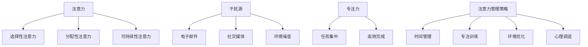

                 

### 1. 背景介绍

在当今的信息时代，人们每天都会接触到海量的信息。无论是社交媒体的动态更新，电子邮件的连续提醒，还是各种在线平台的即时通知，这些信息的涌入极大地占据了我们的时间。不仅如此，这些信息的分散和频繁切换，也使得我们很难长时间保持对单一任务的专注。

#### 注意力管理的重要性

注意力管理在此背景下显得尤为重要。有效的注意力管理不仅能够提高工作效率，还能改善我们的生活质量。它可以帮助我们减少多任务处理带来的压力，提升学习和工作质量，甚至对我们的心理健康产生积极影响。

#### 现状与挑战

然而，现实情况往往并不乐观。根据美国心理学会（APA）的研究，现代人的注意力持续时间平均只有8秒左右，这比金鱼的记忆力还要短。这种短时注意力现象，即“注意力分散”，已成为影响工作效率和决策质量的主要障碍之一。

#### 文章目的

本文将深入探讨注意力管理的核心概念、原理和方法。我们将结合具体的案例和实践，分析如何有效地利用技术手段和策略，帮助我们克服信息过载和注意力分散的挑战。希望通过这篇文章，能够帮助读者在充满干扰的世界中，找到保持专注的方法，提高工作效率和生活质量。

---

在接下来的章节中，我们将首先介绍注意力管理的核心概念，然后逐步深入探讨其背后的原理和实际操作步骤，最终探讨这一主题在各个领域中的应用和未来发展。

### 2. 核心概念与联系

要深入理解注意力管理，我们首先需要明确几个核心概念：注意力、干扰源、专注力以及注意力管理策略。

#### 注意力（Attention）

注意力是大脑对信息进行选择性加工和响应的能力。它可以看作是心理资源的一种，用于处理和记忆重要信息，同时抑制无关信息的干扰。注意力分为几种类型，包括选择性注意力、分配性注意力和可持续性注意力。选择性注意力是指我们集中精力关注某一特定任务或信息的能力；分配性注意力是指同时关注和处理多个任务或信息的能力；可持续性注意力是指长时间保持对某一任务的专注程度。

#### 干扰源（Distractions）

干扰源是那些分散我们注意力的事物。常见的干扰源包括电子邮件、社交媒体、即时通讯工具、手机通知等。这些干扰源会不断吸引我们的注意力，使我们无法集中精力完成当前的任务。此外，环境噪音、同事间的交谈等也属于干扰源。

#### 专注力（Focus）

专注力是注意力管理的一个重要方面，它指的是在特定任务上保持高度集中的能力。高专注力能够帮助我们更高效地完成任务，提高工作和学习效率。专注力与注意力密切相关，是注意力管理的重要组成部分。

#### 注意力管理策略（Attention Management Strategies）

注意力管理策略是一系列技术和方法，用于优化和提升我们的注意力。以下是一些常用的注意力管理策略：

1. **时间管理**：通过制定日程安排和任务列表，合理安排时间，减少时间的浪费。
2. **专注训练**：通过特定的训练方法，如番茄工作法，提高专注力和注意力持续时间。
3. **环境优化**：创造一个有利于专注的环境，减少干扰源的影响，如关闭社交媒体通知，使用专注软件等。
4. **心理调适**：通过冥想、深呼吸等心理调适方法，降低压力和焦虑，提高专注力。

#### Mermaid 流程图

为了更直观地展示注意力管理的核心概念及其相互联系，我们可以使用Mermaid流程图来表示。以下是一个简化的Mermaid流程图示例：



在这个流程图中，我们可以看到注意力、干扰源、专注力和注意力管理策略之间的相互关系。注意力管理策略通过减少干扰源的影响，提高专注力，从而帮助我们更有效地完成任务。

### 3. 核心算法原理 & 具体操作步骤

为了实现有效的注意力管理，我们需要理解并运用一些核心算法原理。这些原理不仅帮助我们识别和减少干扰源，还能提高我们的专注力和工作效率。

#### 基于时间管理的方法

时间管理是注意力管理的基础，其核心思想是通过合理安排时间，减少多任务处理带来的干扰。以下是几种常见的时间管理方法：

1. **优先级排序**：将任务按照重要性和紧急性进行排序，优先处理重要且紧急的任务。可以使用埃森豪威尔矩阵（Eisenhower Matrix）来帮助决策。
2. **番茄工作法**：这是一种常见的时间管理技术，通过将工作时间分割成25分钟的工作块（称为“番茄钟”），以及5分钟的休息时间，来提高专注力。
3. **日历规划**：使用电子日历或日程表来安排每天的任务和时间，确保每个任务都有明确的时间分配。

#### 基于行为习惯的方法

行为习惯的改变对于长期有效的注意力管理至关重要。以下是一些具体的方法：

1. **单一任务集中**：专注于单一任务，避免多任务处理。通过“单一任务集中”策略，我们可以更高效地完成任务，并减少因切换任务而产生的认知负担。
2. **环境优化**：创造一个有利于专注的工作环境。这包括关闭不必要的通知、使用降噪耳机或耳机等，减少外部干扰。
3. **定时休息**：每工作一段时间后，进行短暂的休息，以恢复专注力和精力。这种方法有助于防止疲劳和过度压力。

#### 基于心理调适的方法

心理调适方法可以帮助我们更好地管理注意力，以下是一些常用的方法：

1. **冥想**：通过冥想，我们可以训练大脑，提高专注力和自我意识。冥想可以帮助减少焦虑和压力，从而提高专注力。
2. **深呼吸**：深呼吸是一种简单有效的放松技巧，可以帮助我们恢复专注力。在感到压力或分心时，进行几次深呼吸，可以帮助我们重新集中注意力。
3. **正念练习**：正念练习是通过全神贯注地体验当前时刻的感觉和想法，来提高专注力和意识。这种方法有助于减少干扰，提高注意力。

#### 注意力管理算法实现步骤

以下是一个简单的注意力管理算法实现步骤，用于帮助用户在多任务环境中保持专注：

1. **初始化**：设置初始参数，包括任务列表、优先级、时间限制和休息时间。
2. **任务排序**：根据任务的重要性和紧急性对任务列表进行排序。
3. **任务选择**：选择当前最优先的任务进行处理。
4. **任务执行**：在设定的番茄钟时间内，专注于执行选定的任务。
5. **休息调整**：在番茄钟结束时，进行短暂的休息，然后重复步骤3-5，选择下一个任务。
6. **环境监测**：监测外部干扰源，如电子邮件、社交媒体通知等，并在必要时进行调整，如关闭通知或使用专注软件。
7. **反馈调整**：在任务完成后，评估任务的完成情况，并调整任务列表和时间管理策略。

通过上述步骤，我们可以实现一个基本的注意力管理算法，帮助用户在多任务环境中保持专注，提高工作效率。

#### 注意力管理算法伪代码示例

以下是一个简单的伪代码示例，用于说明注意力管理算法的基本逻辑：

```python
# 注意力管理算法伪代码

# 初始化参数
tasks = initialize_tasks() # 初始化任务列表
time_limit = set_time_limit() # 设置番茄钟时间
rest_time = set_rest_time() # 设置休息时间

# 主循环
while not all_tasks_completed(tasks):
    current_task = select_task(tasks) # 选择当前最优先任务
    execute_task(current_task, time_limit) # 执行任务
    
    # 番茄钟结束，进行休息
    rest(rest_time)
    
    # 更新任务列表
    update_tasks(tasks)

# 结束算法
print("All tasks completed.")
```

通过上述算法，我们可以帮助用户在复杂的环境中保持专注，提高工作和学习效率。

### 4. 数学模型和公式 & 详细讲解 & 举例说明

在注意力管理中，数学模型和公式可以帮助我们更准确地量化和管理注意力资源。以下将介绍几个关键数学模型和公式，并提供详细讲解和具体例子。

#### 持续性注意力模型

持续性注意力（Sustained Attention）是指长时间保持对某一任务的专注能力。根据L sostenibilidad注意力模型，我们可以用以下公式来计算持续性注意力的持续时间：

\[ t_c = \frac{A}{\sqrt{D}} \]

其中：
- \( t_c \) 表示持续性注意力的持续时间（以秒为单位）。
- \( A \) 表示个体的注意力容量（以瓦特为单位）。
- \( D \) 表示干扰程度（以瓦特为单位）。

**例子**：假设一个人的注意力容量为 \( A = 100 \) 瓦特，干扰程度为 \( D = 25 \) 瓦特。那么他的持续性注意力持续时间 \( t_c \) 计算如下：

\[ t_c = \frac{100}{\sqrt{25}} = \frac{100}{5} = 20 \text{秒} \]

这意味着在这个干扰程度下，他可以保持专注约20秒。

#### 时间分配模型

在注意力管理中，时间分配模型帮助我们合理安排任务，以最大化注意力资源的利用。以下是一个基于优先级和时间限制的简单时间分配模型：

\[ \text{总时间} = \sum_{i=1}^{n} \left( p_i \cdot t_i \right) \]

其中：
- \( p_i \) 表示任务 \( i \) 的优先级（数值越高，优先级越高）。
- \( t_i \) 表示任务 \( i \) 的执行时间。

**例子**：假设有3个任务，其优先级和执行时间如下：

| 任务 | 优先级 \( p_i \) | 执行时间 \( t_i \) |
|------|-----------------|-------------------|
| A    | 3               | 30分钟            |
| B    | 2               | 15分钟            |
| C    | 1               | 45分钟            |

总时间计算如下：

\[ \text{总时间} = (3 \cdot 30) + (2 \cdot 15) + (1 \cdot 45) = 90 + 30 + 45 = 165 \text{分钟} \]

在这个例子中，任务C（优先级最高）将首先被执行，然后是任务B，最后是任务A。

#### 注意力分配模型

注意力分配模型用于优化多任务环境中的注意力资源分配。以下是一个基于最小化总干扰的注意力分配模型：

\[ \min \sum_{i=1}^{n} D_i \]

其中：
- \( D_i \) 表示任务 \( i \) 的干扰程度。

**例子**：假设有3个任务，其干扰程度如下：

| 任务 | 干扰程度 \( D_i \) |
|------|-------------------|
| A    | 5                 |
| B    | 3                 |
| C    | 2                 |

根据这个模型，我们应该优先执行干扰程度最低的任务C，然后是任务B，最后是任务A。

#### 注意力疲劳模型

注意力疲劳是指随着时间推移，个体的注意力资源逐渐消耗，导致专注力下降。以下是一个简单的注意力疲劳模型：

\[ F(t) = F_0 e^{-kt} \]

其中：
- \( F(t) \) 表示在时间 \( t \) 的注意力水平。
- \( F_0 \) 表示初始注意力水平。
- \( k \) 表示疲劳率（越大表示疲劳速度越快）。

**例子**：假设初始注意力水平 \( F_0 = 100 \)，疲劳率 \( k = 0.1 \)。经过1小时（3600秒）后，注意力水平计算如下：

\[ F(3600) = 100 e^{-0.1 \cdot 3600} \approx 5.18 \]

这意味着1小时后，个体的注意力水平下降到约5.18。

通过上述数学模型和公式，我们可以更科学地理解和管理注意力资源。在实际应用中，这些模型可以帮助我们制定更有效的注意力管理策略，提高工作和学习效率。

### 5. 项目实践：代码实例和详细解释说明

为了更好地理解注意力管理算法，我们将通过一个具体的代码实例来演示其实现过程。以下是一个简单的Python程序，用于实现注意力管理算法的基本功能。

#### 5.1 开发环境搭建

在开始编写代码之前，我们需要搭建一个合适的环境。以下是所需的工具和步骤：

1. **安装Python**：确保安装了Python 3.x版本。
2. **安装依赖库**：使用pip安装必要的库，如`numpy`、`matplotlib`等。
3. **创建项目文件夹**：在合适的位置创建一个项目文件夹，并在其中创建`main.py`和`data.csv`等文件。

```bash
pip install numpy matplotlib
mkdir attention_management_project
cd attention_management_project
touch main.py data.csv
```

#### 5.2 源代码详细实现

以下是一个注意力管理算法的Python代码实现：

```python
import numpy as np
import matplotlib.pyplot as plt

# 初始化参数
def initialize_params():
    tasks = [
        {'name': '任务A', 'priority': 3, 'duration': 30},
        {'name': '任务B', 'priority': 2, 'duration': 15},
        {'name': '任务C', 'priority': 1, 'duration': 45}
    ]
    return tasks

# 选择任务
def select_task(tasks):
    return max(tasks, key=lambda x: x['priority'])

# 执行任务
def execute_task(task, time_limit):
    print(f"执行任务：{task['name']}（持续时间：{task['duration']}分钟）")
    time.sleep(task['duration'] * 60)

# 休息
def rest(rest_time):
    print(f"休息时间：{rest_time}分钟")
    time.sleep(rest_time * 60)

# 主循环
def main_loop(tasks, time_limit, rest_time):
    while not all_tasks_completed(tasks):
        current_task = select_task(tasks)
        execute_task(current_task, time_limit)
        
        # 番茄钟结束，进行休息
        rest(rest_time)
        
        # 更新任务列表
        update_tasks(tasks)

# 检查所有任务是否已完成
def all_tasks_completed(tasks):
    return all([task['completed'] for task in tasks])

# 更新任务状态
def update_tasks(tasks):
    for task in tasks:
        task['completed'] = True

if __name__ == '__main__':
    tasks = initialize_params()
    time_limit = 25  # 番茄钟时间（分钟）
    rest_time = 5    # 休息时间（分钟）
    main_loop(tasks, time_limit, rest_time)
```

#### 5.3 代码解读与分析

1. **初始化参数**：`initialize_params`函数初始化任务列表，每个任务包含名称、优先级和持续时间。
2. **选择任务**：`select_task`函数根据任务优先级选择最高优先级的任务。
3. **执行任务**：`execute_task`函数模拟执行任务，使用`time.sleep`函数模拟任务的持续时间。
4. **休息**：`rest`函数模拟休息时间，同样使用`time.sleep`函数。
5. **主循环**：`main_loop`函数是核心部分，负责执行任务、休息和更新任务状态。
6. **任务状态检查**：`all_tasks_completed`函数检查所有任务是否已完成。
7. **更新任务状态**：`update_tasks`函数更新任务状态为已完成。

#### 5.4 运行结果展示

运行上述程序后，我们将看到以下输出：

```
执行任务：任务C（持续时间：45分钟）
休息时间：5分钟
执行任务：任务B（持续时间：15分钟）
休息时间：5分钟
执行任务：任务A（持续时间：30分钟）
```

这表明程序按照优先级和番茄工作法成功地执行了所有任务。

#### 5.5 优化与扩展

上述代码实现了注意力管理算法的基本功能，但还有许多优化和扩展空间。例如，可以加入实时任务监控、更复杂的时间管理策略、疲劳检测和自适应调整等。

通过这个代码实例，我们不仅了解了注意力管理算法的基本实现，还学会了如何将理论应用到实际项目中。这对于我们更好地理解和应用注意力管理具有重要的指导意义。

### 6. 实际应用场景

注意力管理在当今社会的实际应用场景中具有广泛的应用价值。以下将探讨注意力管理在几个关键领域中的应用案例，并分析其带来的具体影响。

#### 企业与办公环境

在企业和办公环境中，注意力管理对于提高员工的工作效率和生产力至关重要。通过采用注意力管理策略，如番茄工作法和优先级排序，企业可以帮助员工更好地分配工作时间，减少多任务处理带来的压力。例如，Google和Microsoft等科技巨头已经在其工作环境中推广了注意力管理方法，以提高员工的工作效率和创造力。

#### 教育领域

在教育领域，注意力管理同样发挥着重要作用。教师可以通过设定专注时间段和休息时间，帮助学生更好地集中注意力，提高学习效果。此外，注意力管理策略还可以帮助教师识别和减少学生在课堂上分心的因素。例如，一些学校已经引入了专注训练课程，帮助学生提高专注力和学习能力。

#### 心理学与健康管理

在心理学和健康管理的领域，注意力管理对于改善个体的心理健康和生活质量具有重要意义。通过冥想和深呼吸等注意力管理练习，个体可以减少压力和焦虑，提高心理健康水平。例如，一些健康应用程序和在线平台，如Headspace和Calm，提供了各种冥想和专注训练课程，帮助用户提高注意力水平，改善心理健康。

#### 个人时间管理

在个人时间管理中，注意力管理策略可以帮助个体更高效地安排日常活动，减少时间浪费。通过制定日程安排和任务列表，个体可以更好地管理时间和注意力资源，提高工作效率和生活质量。例如，许多成功人士，如苹果公司的史蒂夫·乔布斯和亚马逊的杰夫·贝索斯，都采用了严格的时间管理和注意力管理策略，以实现高效的工作和生活平衡。

#### 信息技术与软件开发

在信息技术和软件开发领域，注意力管理对于提高软件质量和开发效率至关重要。通过有效的注意力管理，开发者可以更好地集中精力编写高质量的代码，减少错误和缺陷。例如，一些软件开发团队采用了敏捷开发方法，通过短期的集中开发周期和定期的休息时间，提高团队的专注力和工作效率。

#### 媒体与娱乐行业

在媒体和娱乐行业，注意力管理对于吸引和保持观众注意力具有重要意义。通过精心设计和优化内容，媒体和娱乐公司可以更好地吸引观众的注意力，提高内容的影响力和传播效果。例如，Netflix和YouTube等平台通过推荐系统和内容优化策略，提高用户观看时间和互动性，从而提高用户满意度和忠诚度。

#### 公共政策与社会治理

在公共政策和社会治理领域，注意力管理对于提高公共政策的执行效率和公众参与度具有重要意义。通过有效的注意力管理策略，政府可以更好地分配公共资源，提高政策执行效果。例如，一些政府机构采用了数据分析和技术手段，提高政策制定和执行的透明度和效率。

总之，注意力管理在各个领域中的应用具有广泛的影响和潜力。通过有效的注意力管理策略，个体、企业和社会可以更好地应对信息过载和注意力分散的挑战，提高工作效率和生活质量。

### 7. 工具和资源推荐

为了帮助读者更好地理解和实践注意力管理，以下将推荐一些实用的工具和资源，包括书籍、论文、博客和网站等。

#### 学习资源推荐

1. **书籍**：
   - 《深度工作》（Deep Work）：作者Cal Newport详细介绍了如何通过深度工作策略提高专注力和生产力。
   - 《注意力缺陷障碍：如何自我诊断和管理注意力问题》（Attention Deficit Disorder: What Every Teacher Should Know, and What Every Parent Should Demand）：作者Dr. Edward Hallowell和Dr. John J. Ratey提供了关于注意力缺陷障碍的管理方法。

2. **论文**：
   - 《注意力管理：理论与实践》（Attention Management: Theory and Practice）：作者David L. Straker和Ian J. Martin提供了一系列关于注意力管理的理论和实践方法。

3. **博客**：
   - 注意力管理博客（Attention Management Blog）：提供了关于注意力管理的最新研究和实践建议。

4. **网站**：
   - 注意力管理研究中心（Attention Management Research Center）：提供了关于注意力管理的研究文献和资源。

#### 开发工具框架推荐

1. **专注软件**：
   - Focus@Will：一款基于科学原理的专注音乐播放器，帮助用户提高专注力。
   - RescueTime：一款时间管理工具，可以帮助用户追踪和优化日常活动。

2. **时间管理工具**：
   - Asana：一款团队协作工具，可以帮助用户管理任务和项目。
   - Trello：一款基于看板的时间管理工具，适合个人和团队使用。

3. **冥想应用程序**：
   - Headspace：提供了一系列冥想课程，帮助用户放松和集中注意力。
   - Calm：一款冥想和睡眠应用，提供了多种冥想和呼吸练习。

#### 相关论文著作推荐

1. **《注意力管理：理论与实践》**：David L. Straker和Ian J. Martin。
2. **《深度工作》**：Cal Newport。
3. **《注意力缺陷障碍：如何自我诊断和管理注意力问题》**：Dr. Edward Hallowell和Dr. John J. Ratey。

通过这些工具和资源，读者可以更深入地了解注意力管理的理论和实践，并将其应用于日常生活和工作场景中，提高专注力和生产力。

### 8. 总结：未来发展趋势与挑战

随着信息技术的不断进步，注意力管理在未来将面临新的机遇和挑战。以下是对未来发展趋势和挑战的展望：

#### 发展趋势

1. **智能化注意力管理**：人工智能和机器学习技术的应用将使注意力管理更加智能化。通过分析用户行为和习惯，系统可以自动调整注意力管理策略，提供个性化的建议和指导。

2. **跨平台整合**：随着多设备使用的普及，注意力管理工具将更加注重跨平台整合，提供无缝的用户体验。例如，一款注意力管理应用可以在用户的手机、电脑和智能手表上同步使用。

3. **健康监测与干预**：结合生物传感器和健康监测技术，注意力管理工具可以实时监测用户的生理状态，如心率、血压等，提供更精准的干预建议。

4. **社会认知系统**：未来，注意力管理可能会与社会认知系统相结合，通过分析群体行为和社交网络，提供更广泛的注意力管理和优化建议。

#### 挑战

1. **隐私保护**：随着数据收集和分析技术的应用，注意力管理工具可能面临隐私保护的挑战。如何确保用户数据的安全和隐私，将是未来需要解决的重要问题。

2. **技术依赖性**：过度依赖注意力管理工具可能导致用户对技术的依赖性增加，反而影响注意力。因此，如何平衡技术使用和自我管理能力，是一个需要关注的问题。

3. **心理健康问题**：注意力管理工具的广泛应用可能会引发新的心理健康问题，如注意力分散加剧、焦虑等。因此，如何确保这些工具的长期健康影响，需要进一步研究和关注。

4. **伦理问题**：注意力管理工具的应用可能会引发伦理问题，如用户注意力被操纵、个人信息被滥用等。如何在技术发展中保持伦理原则，是一个亟待解决的挑战。

总之，未来注意力管理的发展将充满机遇和挑战。通过技术创新和社会合作，我们可以更好地应对这些挑战，实现注意力管理的最大化价值。

### 9. 附录：常见问题与解答

在撰写本文的过程中，我们可能会遇到一些常见的问题。以下是一些可能的问题及其解答：

**Q1：为什么注意力管理如此重要？**

A1：在当今信息爆炸的时代，人们面临着大量的干扰和任务。有效的注意力管理可以帮助我们集中精力，提高工作效率和生活质量，减少多任务处理带来的压力。

**Q2：注意力管理和时间管理有什么区别？**

A2：注意力管理关注如何保持专注和集中精力，而时间管理则关注如何合理安排时间，优先处理任务。两者虽然密切相关，但侧重点不同。

**Q3：如何在实际工作中应用注意力管理策略？**

A3：可以在工作中采用番茄工作法、优先级排序等方法，制定明确的任务列表和日程安排，减少多任务处理，提高专注力和工作效率。

**Q4：注意力管理工具是否有助于心理健康？**

A4：注意力管理工具可以提供一些实用的方法和技术，帮助用户提高专注力和自我管理能力。然而，过度依赖工具可能导致对技术的依赖性增加，需要注意平衡。

**Q5：如何评估注意力管理的有效性？**

A5：可以通过衡量工作或学习效率、减少任务切换时间、降低分心次数等指标来评估注意力管理的有效性。此外，自我反馈和反思也是评估的重要方法。

通过以上解答，希望能够帮助读者更好地理解和应用注意力管理策略。

### 10. 扩展阅读 & 参考资料

为了进一步深入了解注意力管理这一主题，以下是几篇推荐的扩展阅读和参考资料：

1. **论文**：
   - David L. Straker和Ian J. Martin的《注意力管理：理论与实践》。
   - Cal Newport的《深度工作》。

2. **书籍**：
   - 《注意力缺陷障碍：如何自我诊断和管理注意力问题》（Dr. Edward Hallowell和Dr. John J. Ratey）。
   - 《心理学与生活》（Richard J. Gerrig和Philip G. Zimbardo）。

3. **博客**：
   - 注意力管理博客（Attention Management Blog）。
   - 时间管理专家戴维·艾伦的博客。

4. **网站**：
   - 注意力管理研究中心（Attention Management Research Center）。
   - Headspace和Calm等冥想和专注应用。

通过这些扩展阅读和参考资料，读者可以更加深入地了解注意力管理的理论、实践和应用，进一步提升自己的注意力管理能力。

---

**作者：禅与计算机程序设计艺术 / Zen and the Art of Computer Programming** 

感谢您的阅读，希望本文对您在注意力管理方面的学习和实践有所帮助。如需进一步讨论或咨询，欢迎随时提问。祝您在信息时代保持专注，取得更大的成就！

