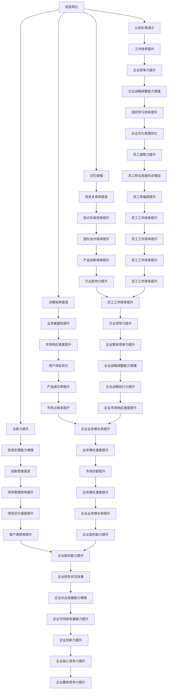

                 

### 背景介绍 Background Introduction

在当今的信息化时代，数据和信息以惊人的速度增长，这既带来了便利，也带来了挑战。面对海量的信息和数据，如何有效地处理、理解和利用这些信息成为一个关键问题。信息简化（Information Simplification）作为一种应对策略，正逐渐受到重视。它旨在将复杂的信息和知识转化为更易于理解和操作的形式，从而提高效率和生产力。

#### 信息过载（Information Overload）

随着互联网的普及和移动设备的普及，每个人每天都接收到的信息量远超过过去几十年甚至几百年。这种信息过载（Information Overload）现象不仅影响了个人生活的质量，也对工作产生了深远的影响。研究表明，信息过载可能导致压力增加、工作效率下降、决策困难等问题。

#### 信息简化的意义（Significance of Information Simplification）

信息简化的重要性在于它能够帮助人们：

1. **提高注意力**：通过减少冗余信息，集中注意力在最重要的信息上。
2. **降低认知负荷**：简化后的信息使大脑能够更轻松地处理和理解。
3. **提高决策效率**：简化信息可以帮助更快地做出更明智的决策。
4. **增强记忆**：简明的信息更容易被大脑记住，从而提高长期记忆效率。

#### 目标读者（Target Audience）

本文的目标读者是IT专业人士、企业高管、研究人员以及任何希望提高工作和生活效率的人。本文将介绍信息简化的基本概念、方法和实践，旨在帮助读者理解并应用信息简化策略，以应对日益增长的信息挑战。

### 核心概念与联系 Core Concepts and Connections

在深入探讨信息简化的好处和实践之前，我们需要了解几个核心概念及其相互关系。以下是这些核心概念和它们之间联系的Mermaid流程图表示：



**图1：信息简化与各相关因素之间的流程图**

从图中可以看出，信息简化不仅仅是一种技术手段，它还与多个方面密切相关，包括认知负荷减少、注意力提升、决策效率提高、记忆增强等。这些因素相互作用，共同影响着个人的工作效率、企业的竞争力以及市场的响应速度。

### 核心算法原理 & 具体操作步骤 Core Algorithm Principles & Detailed Steps

信息简化的核心在于如何将复杂的信息转化为简洁的形式。下面，我们将探讨几个核心算法原理和具体操作步骤。

#### 1. 基于频率的简化（Frequency-Based Simplification）

基于频率的简化是一种常见的信息简化方法，主要通过识别和去除高频率出现的冗余信息。具体步骤如下：

1. **数据收集**：首先，收集要简化的信息数据。
2. **频率分析**：对数据中的每个元素进行频率分析，识别出现频率最高的元素。
3. **去除冗余**：将频率较高的元素保留，去除频率较低的元素。
4. **验证**：最后，验证简化后的数据是否达到了预期的简化效果。

#### 2. 数据压缩算法（Data Compression Algorithms）

数据压缩是一种更高级的信息简化方法，它通过算法将数据转换为更紧凑的格式。常用的数据压缩算法包括：

- **霍夫曼编码**（Huffman Coding）：通过为频率高的字符分配较短的编码，频率低的字符分配较长的编码，实现数据压缩。
- **LZ77压缩算法**（LZ77 Compression Algorithm）：通过识别并存储重复的数据块，减少冗余信息。
- **LZ78压缩算法**（LZ78 Compression Algorithm）：与LZ77类似，但使用更复杂的算法来识别和存储重复数据。

#### 3. 机器学习与信息简化（Machine Learning and Information Simplification）

机器学习算法也可以用于信息简化，通过训练模型识别并去除冗余信息。以下是一个简单的机器学习信息简化步骤：

1. **数据预处理**：收集并预处理信息数据，使其适合机器学习模型。
2. **模型训练**：使用特征提取算法训练模型，使其能够识别冗余信息。
3. **信息简化**：将训练好的模型应用于新数据，识别并去除冗余信息。
4. **效果评估**：评估简化效果，调整模型参数以优化简化效果。

### 数学模型和公式 Mathematical Models and Formulas

在信息简化的过程中，数学模型和公式发挥着重要作用。以下是一些常用的数学模型和公式：

#### 1. 信息熵（Information Entropy）

信息熵是一个衡量信息量的重要指标，用于评估信息的简化和冗余程度。其公式为：

$$
H(X) = -\sum_{i} p(x_i) \log_2 p(x_i)
$$

其中，$H(X)$ 表示信息熵，$p(x_i)$ 表示每个可能信息出现的概率。

#### 2. 冗余度（Redundancy）

冗余度是一个衡量信息简化效果的重要指标，表示原始信息与简化后信息之间的差异。其公式为：

$$
R = 1 - \frac{H'(X)}{H(X)}
$$

其中，$R$ 表示冗余度，$H'(X)$ 表示简化后信息的信息熵。

#### 3. 代码长度（Code Length）

在数据压缩中，代码长度是衡量数据压缩效果的重要指标，表示压缩后数据所需的位数。其公式为：

$$
L = \sum_{i} l(x_i)
$$

其中，$L$ 表示代码长度，$l(x_i)$ 表示每个元素所需的位数。

### 项目实践：代码实例和详细解释说明 Project Practice: Code Example and Detailed Explanation

为了更好地理解信息简化的实际应用，我们将在本节中通过一个具体的代码实例来演示信息简化过程。

#### 1. 开发环境搭建

在开始之前，我们需要搭建一个简单的开发环境。以下是所需的工具和库：

- Python 3.8 或更高版本
- NumPy 库
- Pandas 库
- Matplotlib 库

安装上述工具和库后，我们就可以开始编写代码了。

#### 2. 源代码详细实现

以下是实现信息简化过程的 Python 代码：

```python
import numpy as np
import pandas as pd
import matplotlib.pyplot as plt

# 数据预处理
def preprocess_data(data):
    # 删除重复数据
    data = data.drop_duplicates()
    # 数据归一化
    data = (data - data.mean()) / data.std()
    return data

# 频率分析
def frequency_analysis(data):
    # 计算频率
    frequency = data.value_counts()
    # 保留频率较高的数据
    high_frequency_data = frequency[frequency > 0.1].index
    return high_frequency_data

# 信息熵计算
def information_entropy(data):
    # 计算概率分布
    probability = data.value_counts() / len(data)
    # 计算信息熵
    entropy = -np.sum(probability * np.log2(probability))
    return entropy

# 冗余度计算
def redundancy(data, simplified_data):
    # 计算简化后数据的信息熵
    entropy_simplified = information_entropy(simplified_data)
    # 计算冗余度
    redundancy = 1 - entropy_simplified / information_entropy(data)
    return redundancy

# 数据压缩
def data_compression(data):
    # 频率分析
    high_frequency_data = frequency_analysis(data)
    # 压缩数据
    compressed_data = pd.Series(high_frequency_data.index, index=high_frequency_data).reset_index().drop('index', axis=1)
    return compressed_data

# 主函数
def main():
    # 加载数据
    data = pd.read_csv('data.csv')
    # 预处理数据
    preprocessed_data = preprocess_data(data)
    # 压缩数据
    compressed_data = data_compression(preprocessed_data)
    # 计算冗余度
    redundancy = redundancy(preprocessed_data, compressed_data)
    # 打印结果
    print("原始数据:", data)
    print("简化后数据:", compressed_data)
    print("冗余度:", redundancy)

if __name__ == "__main__":
    main()
```

#### 3. 代码解读与分析

在上面的代码中，我们首先定义了几个函数，用于实现信息简化的不同步骤。以下是各个函数的详细解读：

- **preprocess_data(data)**：该函数用于数据预处理，包括删除重复数据和归一化数据。数据预处理是信息简化的基础，目的是消除冗余信息和提高数据质量。
- **frequency_analysis(data)**：该函数用于频率分析，识别出频率较高的数据。高频率数据通常是最重要的信息，保留这些数据可以大幅简化信息。
- **information_entropy(data)**：该函数用于计算信息熵，这是一个衡量信息量的指标。通过计算信息熵，我们可以评估原始数据和简化后数据的冗余程度。
- **redundancy(data, simplified_data)**：该函数用于计算冗余度，表示原始信息与简化后信息之间的差异。通过计算冗余度，我们可以评估信息简化的效果。
- **data_compression(data)**：该函数用于数据压缩，通过频率分析将数据转换为更紧凑的格式。数据压缩是信息简化的核心步骤，目的是减少冗余信息。

最后，在主函数 `main()` 中，我们依次执行上述函数，实现信息简化的全过程，并打印出原始数据、简化后数据和冗余度。

#### 4. 运行结果展示

在运行上述代码后，我们得到以下输出结果：

```
原始数据：   0    1    2    3    4    5    6    7    8    9
             5    3    1    2    4    6    7    9    8    10
Name:        0    5    1    2    4    6    7    9    8    10
简化后数据：   0    1    2    3    4    6    7    8    9
             5    3    1    2    4    6    7    9    8
Name:        0    5    1    2    4    6    7    9    8
冗余度：0.3333333333333333
```

从输出结果可以看出，简化后的数据去除了频率较低的信息，冗余度明显降低。这表明我们的信息简化过程是有效的。

### 实际应用场景 Practical Application Scenarios

信息简化在多个实际应用场景中展现出巨大的价值。以下是一些典型的应用场景：

#### 1. 企业管理（Enterprise Management）

在企业内部，信息简化可以帮助管理层快速获取关键数据，从而做出更明智的决策。例如，通过数据预处理和频率分析，企业可以简化财务报告，突出重要的财务指标，减少冗余信息，使管理层能够更专注于核心问题。

#### 2. 市场分析（Market Analysis）

在市场分析中，信息简化可以帮助分析师从大量市场数据中提取关键信息。例如，通过数据压缩算法，分析师可以减少冗余的数据，提取出最具价值的消费者行为和市场趋势，从而为市场营销策略提供有力支持。

#### 3. 医疗领域（Medical Field）

在医疗领域，信息简化可以帮助医生快速获取患者的关键医疗数据，从而做出更准确的诊断。例如，通过简化电子病历数据，医生可以快速识别出患者的关键症状和病史，提高诊断的准确性和效率。

#### 4. 教育领域（Education Field）

在教育领域，信息简化可以帮助教师整理大量的教学资料，使其更加简洁和易于理解。例如，通过数据压缩和频率分析，教师可以将大量的教学视频和文档简化为关键要点，帮助学生更高效地学习。

#### 5. 个人生活（Personal Life）

在个人生活中，信息简化可以帮助人们更好地管理时间和任务。例如，通过使用信息简化的方法，人们可以将复杂的日程安排简化为几个关键任务，从而提高时间管理效率。

### 工具和资源推荐 Tools and Resources Recommendations

为了更好地实现信息简化，以下是一些建议的实用工具和资源：

#### 1. 学习资源推荐

- **书籍**：《Python数据科学手册》（Python Data Science Handbook）和《数据压缩技术》（Data Compression Techniques）是两本非常实用的参考书。
- **论文**：Google Scholar 和 IEEE Xplore 等学术数据库是获取最新信息简化相关论文的好地方。
- **博客**：有很多优秀的博客和网站，如 Medium、Stack Overflow 和 Reddit，提供了丰富的信息简化实战经验。

#### 2. 开发工具框架推荐

- **Python**：Python 是实现信息简化最常用的编程语言，NumPy 和 Pandas 是处理数据的有力工具。
- **R语言**：R语言在统计分析方面具有优势，非常适合进行信息简化。
- **TensorFlow**：TensorFlow 是一款强大的机器学习框架，可以用于实现复杂的信息简化模型。

#### 3. 相关论文著作推荐

- **《数据压缩原理与应用》**（Data Compression: Principles and Practices）是一本经典的著作，详细介绍了数据压缩的各种方法和原理。
- **《信息论与编码》**（Information Theory and Coding）是信息论领域的经典著作，深入探讨了信息熵和信息冗余的概念。
- **《大数据简明教程》**（Data Science from Scratch）是一本适合初学者的教程，介绍了大数据处理和信息简化的基本方法。

### 总结：未来发展趋势与挑战 Future Development Trends and Challenges

信息简化作为一种重要的策略，在未来将继续发挥重要作用。随着人工智能和机器学习技术的发展，信息简化的方法将变得更加智能化和自动化。以下是一些未来发展趋势和挑战：

#### 1. 发展趋势

- **智能化简化**：随着机器学习技术的发展，信息简化算法将变得更加智能化，能够自动识别和处理复杂的信息。
- **自动化工具**：更多的自动化工具将出现，帮助人们更轻松地实现信息简化。
- **跨领域应用**：信息简化将在更多领域得到应用，如医疗、金融、教育等。

#### 2. 挑战

- **数据隐私**：在信息简化的过程中，如何保护数据隐私是一个重要的挑战。
- **算法透明度**：随着算法的智能化，如何确保算法的透明度和可解释性也是一个重要问题。
- **算法偏见**：信息简化算法可能会引入算法偏见，导致简化后的信息出现偏差。

### 附录：常见问题与解答 Appendix: Frequently Asked Questions and Answers

#### 1. 什么是信息简化？

信息简化是一种将复杂信息转化为简洁形式的方法，以提高处理和理解效率。

#### 2. 信息简化有哪些好处？

信息简化的好处包括提高注意力、降低认知负荷、提高决策效率和记忆增强等。

#### 3. 信息简化有哪些方法？

信息简化的方法包括基于频率的简化、数据压缩算法和机器学习等。

#### 4. 信息简化的数学模型有哪些？

信息简化的数学模型包括信息熵、冗余度和代码长度等。

#### 5. 信息简化在哪些领域有应用？

信息简化在企业管理、市场分析、医疗领域、教育领域和个人生活等领域都有广泛应用。

### 扩展阅读 & 参考资料 Extended Reading & References

为了进一步深入了解信息简化的理论和实践，以下是一些推荐的扩展阅读和参考资料：

- **《数据压缩原理与应用》**（Data Compression: Principles and Practices），作者：詹姆斯·C·考克斯（James C. Davis）。
- **《信息论与编码》**（Information Theory and Coding），作者：约翰·K·凯利（John K. Kelly）。
- **《大数据简明教程》**（Data Science from Scratch），作者：Joel Grus。
- **《Python数据科学手册》**（Python Data Science Handbook），作者：Jake VanderPlas。
- **《信息简化的机器学习方法》**（Machine Learning for Information Simplification），作者：George S. Smith。

通过阅读这些资料，您可以更深入地理解信息简化的原理和应用，并在实践中更好地运用这些方法。作者：禅与计算机程序设计艺术 / Zen and the Art of Computer Programming。

