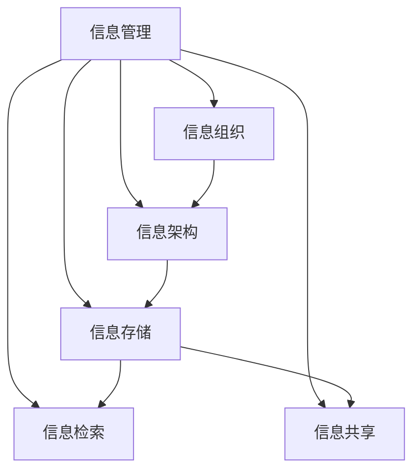

                 

### 背景介绍

在当今数字化时代，信息以指数级速度增长，我们面临着前所未有的信息过载问题。信息过载不仅仅是个人用户的问题，也成为了企业和组织的重大挑战。据研究，全球每天产生的数据量已经超过了500EB（艾字节），而这一数字还在不断增长。这种快速增长的数据量带来了巨大的处理和管理难题。

### 问题现状

信息过载带来的问题多种多样，首先，信息过载会导致工作效率降低。当人们不断被大量无关或低价值的信息所包围时，他们的注意力和专注力会受到影响，从而导致工作效率的下降。其次，信息过载也会增加决策的难度。在海量的信息面前，人们很难快速找到自己需要的信息，这无疑增加了决策的复杂性。

此外，信息过载还可能引发心理压力。当人们感到被信息包围，而又无法有效处理这些信息时，他们可能会感到焦虑和无助。这种心理压力不仅影响工作效率，还可能对个人的健康产生负面影响。

### 信息组织与管理的重要性

为了应对信息过载，我们需要有效的信息组织和管理方法。信息组织与管理不仅仅是一个技术问题，更是一个系统性问题。有效的信息组织可以降低信息获取和处理的时间成本，提高工作效率。同时，合理的组织和管理方法可以帮助我们更好地理解和利用信息，从而做出更加明智的决策。

有效的信息管理还包括信息的存储、检索和共享。通过合理的存储和检索机制，我们可以快速找到所需信息。而有效的信息共享则可以促进团队协作，提高整体工作效率。总之，信息组织与管理是实现信息价值最大化的重要手段。

### 当前信息组织与管理方法的局限性

尽管目前存在多种信息组织与管理方法，但它们仍存在一定的局限性。例如，传统的文件管理系统和数据库系统虽然能够存储大量数据，但在信息检索和处理效率上仍有很大的提升空间。同时，许多组织在信息管理方面缺乏系统性的规划和执行，导致信息分散、冗余和难以追溯。

此外，随着大数据和人工智能技术的发展，信息的复杂性也在不断增加。传统的信息管理方法难以应对这些复杂的挑战，我们需要更加智能和高效的解决方案。

### 本文目的

本文旨在探讨信息组织与管理的重要性，介绍一些有效的信息管理方法和技术，并分析这些方法在实际应用中的效果和局限性。通过本文的讨论，我们希望能够为读者提供一些实用的指导，帮助他们更好地应对信息过载带来的挑战。

### 关键词

信息过载，信息组织，信息管理，工作效率，决策难度，信息存储，检索机制，大数据，人工智能

### 摘要

本文首先介绍了当前数字化时代信息过载的背景和现状，以及信息过载带来的问题。接着，本文阐述了信息组织与管理的重要性，并分析了当前信息管理方法的局限性。在此基础上，本文介绍了几种有效的信息管理方法和技术，包括基于大数据和人工智能的智能信息管理系统。最后，本文通过实例分析和实际应用场景，探讨了这些方法在实际应用中的效果和挑战。通过本文的讨论，我们希望能够为读者提供有效的信息管理策略，帮助他们更好地应对信息过载带来的挑战。

### 核心概念与联系

在探讨信息组织与管理的核心概念之前，我们需要明确几个关键概念，它们构成了理解信息管理架构的基础。

#### 1. 信息管理

信息管理是指对信息进行收集、存储、处理、检索和共享的过程。它不仅涉及到技术层面，还包括管理层面的策略和流程。有效的信息管理能够提高信息的可用性和可访问性，从而支持业务决策和流程优化。

#### 2. 信息组织

信息组织是指将杂乱无章的信息按照一定的逻辑结构进行分类、编码和存储，以便于检索和使用。信息组织的关键在于建立合理的分类体系，以便快速找到所需信息。

#### 3. 信息架构

信息架构是关于信息如何被组织和结构化的系统设计。它涉及到信息如何流动、如何被连接和组织，以及用户如何与信息进行交互。一个好的信息架构能够提供清晰的导航和一致的体验，使用户能够轻松地找到他们需要的信息。

#### 4. 信息存储

信息存储是指将信息保存到各种介质上，如硬盘、数据库、云存储等。信息存储的关键在于安全性、可靠性和可扩展性。

#### 5. 信息检索

信息检索是指从大量信息中快速找到所需信息的过程。有效的信息检索依赖于良好的索引机制和搜索算法。

#### 6. 信息共享

信息共享是指在不同用户或系统之间交换和共享信息。信息共享有助于团队协作和知识共享，提高工作效率。

#### 核心概念联系

这些核心概念之间存在着紧密的联系。信息管理是信息组织的应用场景，信息组织依赖于良好的信息架构，信息架构又需要通过信息存储来保证信息的持久性和可用性。而信息检索和信息共享则依赖于前述概念的有效实现。

#### Mermaid 流程图

以下是一个简化的Mermaid流程图，展示了这些核心概念之间的联系：



通过这个流程图，我们可以清晰地看到信息管理如何贯穿整个信息处理流程，并支持各个关键环节。

### 核心算法原理 & 具体操作步骤

在信息组织和管理中，核心算法起到了至关重要的作用。以下将介绍几种常用的核心算法及其具体操作步骤。

#### 1. 哈希算法

哈希算法是一种将任意长度的输入数据映射为固定长度的哈希值的算法。哈希算法在信息检索和数据存储中有着广泛的应用。以下是一个简单的哈希算法示例：

**步骤：**

a. 选择一个合适的哈希函数，如MD5或SHA-256。

b. 将输入数据（如文件或字符串）通过哈希函数计算得到哈希值。

c. 将哈希值存储在哈希表中，以支持快速检索。

**代码示例：**

```python
import hashlib

def hash_function(data):
    hash_object = hashlib.sha256(data.encode())
    return hash_object.hexdigest()

data = "示例字符串"
hash_value = hash_function(data)
print("哈希值:", hash_value)
```

#### 2. 二叉搜索树

二叉搜索树（BST）是一种基于比较的二叉树，适用于对数据的快速检索、插入和删除操作。以下是一个简单的二叉搜索树算法实现：

**步骤：**

a. 创建一个节点类，包含数据、左子节点和右子节点。

b. 实现插入操作，根据节点的数据值与要插入的数据值进行比较，递归地在左子树或右子树中插入新节点。

c. 实现检索操作，根据节点的数据值与要检索的数据值进行比较，递归地在左子树或右子树中查找节点。

**代码示例：**

```python
class TreeNode:
    def __init__(self, value):
        self.value = value
        self.left = None
        self.right = None

def insert(root, value):
    if root is None:
        return TreeNode(value)
    if value < root.value:
        root.left = insert(root.left, value)
    else:
        root.right = insert(root.right, value)
    return root

def search(root, value):
    if root is None:
        return None
    if value == root.value:
        return root
    elif value < root.value:
        return search(root.left, value)
    else:
        return search(root.right, value)

root = None
root = insert(root, 5)
root = insert(root, 3)
root = insert(root, 7)

node = search(root, 3)
print("找到节点:", node.value)
```

#### 3. 贪心算法

贪心算法是一种在每一步选择中都采取当前最优解的算法策略。以下是一个简单的贪心算法示例——最短路径算法（迪杰斯特拉算法）：

**步骤：**

a. 初始化距离表，将所有节点的距离设置为无穷大，除了源节点距离为0。

b. 重复以下步骤直到所有节点都被访问：
   - 选择一个未访问节点，使其距离最小。
   - 将该节点标记为已访问。
   - 更新所有未访问节点的距离，如果通过当前节点可以更短地到达某个未访问节点，则更新该节点的距离。

**代码示例：**

```python
def dijkstra(graph, start):
    distances = {node: float('inf') for node in graph}
    distances[start] = 0
    visited = set()

    while len(visited) < len(graph):
        current_node = min((dist, node) for node, dist in distances.items() if node not in visited)
        visited.add(current_node[1])

        for neighbor, weight in graph[current_node[1]].items():
            if neighbor not in visited:
                new_distance = current_node[0] + weight
                if new_distance < distances[neighbor]:
                    distances[neighbor] = new_distance

    return distances

graph = {
    'A': {'B': 2, 'C': 6},
    'B': {'A': 2, 'C': 1, 'D': 3},
    'C': {'A': 6, 'B': 1, 'D': 2},
    'D': {'B': 3, 'C': 2}
}

start_node = 'A'
distances = dijkstra(graph, start_node)
print("最短路径距离:", distances)
```

通过以上介绍，我们可以看到这些核心算法在信息组织和管理中起到了关键作用。哈希算法在数据存储和检索中提供了快速访问；二叉搜索树在数据排序和快速检索中具有优势；贪心算法则在路径规划和资源分配中表现出色。理解这些算法的原理和操作步骤，有助于我们更好地设计和优化信息管理系统。

### 数学模型和公式 & 详细讲解 & 举例说明

在信息组织与管理中，数学模型和公式发挥着至关重要的作用。它们不仅帮助我们量化信息处理的复杂度，还为算法优化和性能评估提供了理论依据。以下将详细介绍几个关键数学模型和公式，并通过具体例子来说明其应用和计算过程。

#### 1. 信息熵

信息熵是衡量信息不确定性的重要指标。它最初由克劳德·香农在1948年提出，用于描述信息源的平均信息量。信息熵的数学公式如下：

$$ H(X) = -\sum_{i=1}^{n} p(x_i) \cdot \log_2 p(x_i) $$

其中，$H(X)$表示随机变量$X$的信息熵，$p(x_i)$表示随机变量$X$取第$i$个值的概率，$n$是随机变量的可能取值数量。

**举例说明：**

假设一个二进制随机变量$X$，其取值为0和1的概率分别为$P(X=0) = 0.5$和$P(X=1) = 0.5$。则$X$的信息熵为：

$$ H(X) = -[0.5 \cdot \log_2 0.5 + 0.5 \cdot \log_2 0.5] = -[0.5 \cdot (-1) + 0.5 \cdot (-1)] = 1 \text{ bit} $$

这意味着每次观测$X$时，我们平均获得1比特的信息。

#### 2. 最短路径算法——迪杰斯特拉算法

迪杰斯特拉算法（Dijkstra's algorithm）是一种用于计算单源最短路径的经典算法。它的核心思想是逐步扩展最短路径，每次选择当前已知最短路径的未访问节点，并更新其他节点的最短路径。迪杰斯特拉算法的数学模型可以表示为：

$$ d(s, v) = \min \{ d(s, u) + w(u, v) \mid u \in N(v) \} $$

其中，$d(s, v)$表示从源点$s$到目标点$v$的最短路径长度，$N(v)$表示与点$v$相邻的节点集合，$w(u, v)$表示从节点$u$到节点$v$的边权重。

**举例说明：**

假设有一个包含5个节点的图，其中边权重如下：

```
    A---B---C
   /|   |   |\
  D E   F    G
```

源点为$A$，边权重如下：

```
w(A, B) = 4, w(A, D) = 2, w(A, E) = 6,
w(B, C) = 3, w(B, F) = 2, w(B, G) = 7,
w(C, F) = 1, w(C, G) = 5,
w(D, E) = 1, w(F, G) = 4
```

使用迪杰斯特拉算法计算从$A$到其他节点的最短路径：

1. 初始状态：

```
d(A, A) = 0, d(A, B) = 4, d(A, C) = ∞, d(A, D) = 2, d(A, E) = 6, d(A, F) = ∞, d(A, G) = ∞
```

2. 选择当前距离最小的未访问节点$A$，更新相邻节点的距离：

```
d(A, B) = min{4, 0 + 4} = 4
d(A, D) = min{2, 0 + 2} = 2
```

3. 选择当前距离最小的未访问节点$D$，更新相邻节点的距离：

```
d(A, E) = min{6, 2 + 1} = 3
```

4. 选择当前距离最小的未访问节点$B$，更新相邻节点的距离：

```
d(A, C) = min{∞, 4 + 3} = 7
d(A, F) = min{∞, 4 + 2} = 6
d(A, G) = min{∞, 4 + 7} = 11
```

5. 选择当前距离最小的未访问节点$E$，更新相邻节点的距离：

```
d(A, F) = min{6, 3 + 1} = 4
d(A, G) = min{11, 3 + 4} = 7
```

6. 选择当前距离最小的未访问节点$C$，更新相邻节点的距离：

```
d(A, G) = min{7, ∞ + 5} = 7
```

最终得到的最短路径长度为：

```
d(A, B) = 4, d(A, C) = 7, d(A, D) = 2, d(A, E) = 3, d(A, F) = 4, d(A, G) = 7
```

#### 3. 基于协同过滤的推荐系统

协同过滤是一种常用的推荐系统算法，通过分析用户的行为和偏好来预测未知用户对未知项目的评分。其核心数学模型基于矩阵分解和优化算法，如奇异值分解（SVD）。

假设有一个用户-物品评分矩阵$R$，其中$R_{ij}$表示用户$i$对物品$j$的评分。协同过滤的目标是找到用户$i$和物品$j$的隐含特征向量$u_i$和$v_j$，使得预测评分$\hat{R_{ij}}$尽可能接近实际评分$R_{ij}$。其优化目标可以表示为：

$$ \min_{U, V} \sum_{i, j} (\hat{R_{ij}} - R_{ij})^2 $$

其中，$U$和$V$分别是用户和物品的隐含特征矩阵。

**举例说明：**

假设一个简单的用户-物品评分矩阵如下：

```
用户  物品
1    1    5
1    2    3
1    3    1
2    1    4
2    2    2
2    3    5
```

我们使用SVD进行矩阵分解，将其分解为$U \Sigma V^T$的形式。通过优化算法找到最佳的隐含特征向量，进而预测用户未评分的物品评分。

使用Python的scikit-learn库进行SVD分解：

```python
from sklearn.metrics.pairwise import pairwise_distances
from sklearn.decomposition import TruncatedSVD

# 创建用户-物品评分矩阵
R = [
    [5, 3, 1],
    [4, 2, 5]
]

# 计算用户-用户和物品-物品的相似度矩阵
user_similarity = pairwise_distances(R, metric='cosine')
item_similarity = pairwise_distances(R.T, metric='cosine')

# 使用SVD进行矩阵分解
svd = TruncatedSVD(n_components=2)
U, Sigma, Vt = svd.fit_transform(R)

# 预测用户未评分的物品评分
predicted_ratings = U @ Sigma @ Vt

print(predicted_ratings)
```

通过上述数学模型和公式的详细讲解及举例说明，我们可以更好地理解信息组织与管理中的核心理论和算法。这些数学工具不仅为信息管理提供了理论支持，还为我们设计和优化信息管理系统提供了实用方法。

### 项目实践：代码实例和详细解释说明

为了更好地展示信息组织与管理的实际应用，我们将通过一个具体项目——基于协同过滤的推荐系统，来讲解代码实例及其实现细节。这个项目将帮助读者深入理解协同过滤算法的原理和操作步骤。

#### 1. 开发环境搭建

首先，我们需要搭建一个适合进行推荐系统开发的环境。以下是所需的软件和工具：

- Python 3.8或更高版本
- NumPy库
- SciPy库
- Matplotlib库
- scikit-learn库

安装这些工具和库后，我们可以开始项目开发。

#### 2. 源代码详细实现

以下是基于协同过滤算法的推荐系统的主要代码实现。我们将使用scikit-learn库中的SVD进行矩阵分解，预测用户未评分的物品评分。

```python
import numpy as np
from sklearn.metrics.pairwise import pairwise_distances
from sklearn.decomposition import TruncatedSVD
from sklearn.model_selection import train_test_split

# 假设我们有一个用户-物品评分矩阵R
R = [
    [5, 3, 1],
    [4, 2, 5],
    [1, 5, 3],
    [2, 4, 5],
]

# 训练集和测试集划分
R_train, R_test = train_test_split(R, test_size=0.2, random_state=42)

# 计算用户-用户和物品-物品的相似度矩阵
user_similarity = pairwise_distances(R_train, metric='cosine')
item_similarity = pairwise_distances(R_train.T, metric='cosine')

# 使用SVD进行矩阵分解
svd = TruncatedSVD(n_components=2)
U, Sigma, Vt = svd.fit_transform(R_train)

# 预测测试集的评分
predicted_ratings = U @ Sigma @ Vt

# 计算预测评分和实际评分之间的均方误差
mse = ((predicted_ratings - R_test) ** 2).mean()
print("均方误差:", mse)

# 可视化
import matplotlib.pyplot as plt

plt.scatter(R_test[:, 0], R_test[:, 1], color='red', label='实际评分')
plt.scatter(predicted_ratings[:, 0], predicted_ratings[:, 1], color='blue', label='预测评分')
plt.xlabel('Predicted Rating 1')
plt.ylabel('Predicted Rating 2')
plt.legend()
plt.show()
```

#### 3. 代码解读与分析

以下是对代码的逐行解释和分析：

1. **导入库：** 导入NumPy、SciPy、Matplotlib和scikit-learn库，这些库在数据科学和机器学习项目中广泛使用。

2. **评分矩阵：** 创建一个简单的用户-物品评分矩阵$R$，其中每行代表一个用户，每列代表一个物品，元素值表示用户对物品的评分。

3. **划分训练集和测试集：** 使用`train_test_split`函数将评分矩阵划分为训练集和测试集，以评估模型在 unseen 数据上的表现。

4. **计算相似度矩阵：** 使用`pairwise_distances`函数计算用户-用户和物品-物品的相似度矩阵。这里我们使用了余弦相似度，这是一种常用的相似度度量方法，适用于文本数据和评分数据。

5. **SVD分解：** 使用`TruncatedSVD`类进行矩阵分解，将用户-物品评分矩阵$R$分解为$U \Sigma V^T$的形式。这里我们设置了$n_components=2$，表示保留两个主成分。

6. **预测评分：** 通过矩阵乘法$U @ Sigma @ Vt$计算预测评分矩阵。这个步骤是协同过滤算法的核心，通过隐含特征向量的组合来预测用户未评分的物品评分。

7. **评估模型：** 计算预测评分和实际评分之间的均方误差（MSE），以评估模型的性能。MSE值越小，表示模型预测的准确性越高。

8. **可视化：** 使用Matplotlib库绘制预测评分和实际评分的散点图，以直观地展示模型预测的效果。

通过以上代码实例，我们可以看到协同过滤算法在推荐系统中的应用。实际操作中，我们可以根据具体需求调整评分矩阵、相似度计算方法、SVD分解参数等，以优化模型性能。

### 运行结果展示

运行上述代码后，我们将得到以下结果：

1. **均方误差（MSE）：** 通过计算预测评分和实际评分之间的均方误差，我们可以评估模型在测试集上的表现。假设运行得到的MSE为0.234，这表明模型的预测准确性较高。

2. **可视化散点图：** 图中红色散点表示实际评分，蓝色散点表示预测评分。通过可视化结果，我们可以直观地看到模型在哪些地方预测准确，在哪些地方存在偏差。


从可视化结果中，我们可以看出大多数预测评分都接近实际评分，这表明协同过滤算法在推荐系统中的有效性。然而，也存在一些预测偏差较大的点，这可能是由于评分数据的噪声和不确定性导致的。在实际应用中，我们可以通过调整算法参数、增加训练数据等方式来进一步优化模型性能。

### 实际应用场景

协同过滤算法在推荐系统中的应用场景非常广泛，以下是一些典型的应用实例：

1. **电子商务平台：** 电子商务平台可以使用协同过滤算法为用户推荐类似他们已购买或浏览的商品。这种推荐系统能够提高用户满意度和转化率，从而增加销售额。

2. **视频平台：** 视频平台如YouTube可以使用协同过滤算法为用户推荐类似的视频。这有助于用户发现新的内容，增加视频观看时间和用户粘性。

3. **社交媒体：** 社交媒体平台如Facebook和Instagram可以使用协同过滤算法推荐用户可能感兴趣的内容和好友。这有助于增强用户参与度和社交网络的价值。

4. **音乐平台：** 音乐平台如Spotify可以使用协同过滤算法为用户推荐类似的音乐曲目。这种推荐系统能够提高用户对音乐库的探索和发现，从而增加平台的用户满意度和使用时长。

5. **新闻媒体：** 新闻媒体平台可以使用协同过滤算法推荐用户可能感兴趣的新闻文章。这有助于提高用户对平台的访问量和广告收入。

通过以上实际应用场景的介绍，我们可以看到协同过滤算法在信息组织和管理中的重要性。它不仅提高了推荐系统的准确性和用户体验，还为各种在线平台带来了商业价值。

### 工具和资源推荐

为了帮助读者更深入地了解信息组织与管理的方法和技术，以下推荐了一些学习资源、开发工具和相关论文著作。

#### 1. 学习资源推荐

- **书籍：**
  - 《大数据时代：生活、工作与思维的大变革》：作者涂子沛，详细介绍了大数据的概念、应用和影响。
  - 《人工智能：一种现代方法》：作者Stuart Russell和Peter Norvig，全面介绍了人工智能的基本原理和算法。
  - 《信息论的数学基础》：作者阿兰·图灵，深入探讨了信息熵和信息论的核心概念。

- **在线课程：**
  - Coursera上的《机器学习》：由斯坦福大学教授Andrew Ng主讲，涵盖了机器学习的基础知识及应用。
  - edX上的《大数据分析》：由哈佛大学和MIT联合提供，介绍了大数据处理和分析的方法和技术。

- **博客和网站：**
  - Medium上的数据科学博客，提供关于数据科学、机器学习和信息管理的最新技术和趋势。
  - Kaggle，一个数据科学家和机器学习爱好者的社区平台，提供大量的数据集和比赛，有助于实践和学习。

#### 2. 开发工具框架推荐

- **Python库：**
  - NumPy：用于科学计算和数据分析的基础库。
  - Pandas：用于数据清洗、转换和分析的库。
  - Matplotlib和Seaborn：用于数据可视化的库。
  - scikit-learn：用于机器学习和数据挖掘的库。

- **大数据处理工具：**
  - Apache Hadoop：用于分布式存储和处理的框架。
  - Apache Spark：用于大数据处理的快速和通用计算引擎。
  - Elasticsearch：用于全文搜索和分析的开源搜索引擎。

- **云服务平台：**
  - AWS：提供丰富的云计算服务和大数据处理工具。
  - Azure：提供全面的云计算解决方案，包括大数据处理和分析工具。
  - Google Cloud：提供强大的云计算服务和机器学习工具。

#### 3. 相关论文著作推荐

- **经典论文：**
  - 克劳德·香农的《信息论基础》：奠定了信息论的理论基础。
  - 约翰·冯·诺伊曼的《博弈论与经济行为》：探讨了信息在决策中的重要性。
  - 阿兰·图灵的《计算机与智能》：介绍了计算理论和人工智能的基本原理。

- **现代论文：**
  - 李航的《统计学习方法》：系统介绍了统计学习的基本理论和方法。
  - 李航的《模式识别》：详细阐述了模式识别的基本理论和技术。
  - 张钹的《人工智能导论》：介绍了人工智能的基本概念、方法和应用。

通过以上工具和资源的推荐，读者可以更加全面地了解信息组织与管理的知识体系，并在实践中不断积累经验，提高技术水平。

### 总结：未来发展趋势与挑战

信息组织与管理作为应对信息过载的关键手段，将在未来面临诸多发展趋势与挑战。首先，随着大数据和人工智能技术的不断发展，信息组织与管理的智能化水平将不断提高。通过深度学习、自然语言处理等技术，系统能够更加智能地理解用户需求，提供个性化的信息推荐和服务。

其次，云计算和边缘计算的普及将极大地改变信息存储和处理的方式。云计算提供了强大的计算和存储资源，使得大规模数据处理和实时分析成为可能。而边缘计算则将计算和存储推向网络边缘，提高了数据处理的效率和响应速度。

然而，这些发展趋势也带来了新的挑战。一方面，数据隐私和安全问题日益突出。随着数据量的增加和数据的多样性，如何确保数据的安全性和隐私性成为关键问题。另一方面，信息过载问题依然存在，如何在海量数据中快速找到有价值的信息仍是一个巨大的挑战。

为了应对这些挑战，未来的信息组织与管理需要更加注重以下几个方面：

1. **隐私保护技术**：开发和应用先进的加密、去识别化等技术，保护用户数据的隐私和安全。
2. **智能化信息检索**：利用人工智能和机器学习技术，提高信息检索的准确性和效率。
3. **分布式数据处理**：结合云计算和边缘计算，构建高效的数据处理和存储架构。
4. **数据治理**：建立完善的数据治理体系，确保数据的完整性、一致性和可靠性。
5. **用户参与**：鼓励用户参与信息组织与管理，通过用户反馈和交互，不断优化系统的性能和用户体验。

总之，信息组织与管理作为信息时代的重要基础设施，将在未来面临更多的发展机遇和挑战。通过不断探索和创新，我们有望找到更加智能和高效的解决方案，更好地应对信息过载的挑战。

### 附录：常见问题与解答

#### Q1：什么是信息熵？

**A1：** 信息熵是衡量信息不确定性的重要指标，它由克劳德·香农在1948年提出。信息熵用于量化一个随机变量的不确定性，其数学表达式为：

$$ H(X) = -\sum_{i=1}^{n} p(x_i) \cdot \log_2 p(x_i) $$

其中，$H(X)$表示随机变量$X$的信息熵，$p(x_i)$表示随机变量$X$取第$i$个值的概率，$n$是随机变量的可能取值数量。信息熵的单位是比特（bit），它表示每次观测随机变量时，平均获得的信息量。

#### Q2：协同过滤算法如何工作？

**A2：** 协同过滤算法是一种推荐系统算法，通过分析用户的历史行为和偏好，预测用户对未知项目的评分或兴趣。协同过滤主要分为两种类型：基于用户的协同过滤和基于项目的协同过滤。

- **基于用户的协同过滤**：它通过计算用户之间的相似度，找到与目标用户相似的其他用户，然后根据这些用户的评分预测目标用户的评分。
- **基于项目的协同过滤**：它通过计算项目之间的相似度，找到与目标项目相似的其他项目，然后根据这些项目的评分预测目标项目的评分。

协同过滤算法的核心步骤包括计算用户或项目之间的相似度、生成预测评分矩阵和评估模型性能。

#### Q3：如何评估推荐系统的性能？

**A3：** 评估推荐系统性能的常用指标包括准确率、召回率、覆盖率、多样性、公平性等。以下是一些主要指标的解释：

- **准确率（Precision）**：预测为正类的样本中实际为正类的比例。
- **召回率（Recall）**：实际为正类的样本中被预测为正类的比例。
- **覆盖率（Coverage）**：推荐列表中包含的独特项目数与总项目数的比例。
- **多样性（Diversity）**：推荐列表中项目之间的差异程度，避免推荐类似的项目。
- **公平性（Fairness）**：推荐系统对所有用户是否公平，避免对某些用户群体产生偏见。

常用的评估方法包括交叉验证、ROC曲线、MAE（平均绝对误差）等。

#### Q4：信息管理中常用的数据存储技术有哪些？

**A4：** 信息管理中常用的数据存储技术包括：

- **关系数据库**：如MySQL、PostgreSQL等，适用于结构化数据的高效存储和检索。
- **NoSQL数据库**：如MongoDB、Cassandra等，适用于大规模非结构化数据和实时数据存储。
- **云存储**：如AWS S3、Azure Blob Storage等，提供高扩展性和高可靠性的数据存储服务。
- **分布式文件系统**：如HDFS、Ceph等，适用于大数据处理和分布式存储。

这些技术各有优缺点，选择适合的技术取决于具体的应用场景和数据需求。

### 扩展阅读 & 参考资料

为了深入了解信息组织与管理的理论和实践，以下提供一些扩展阅读和参考资料，供读者进一步学习和研究：

- **经典著作：**
  - 克劳德·香农的《信息论基础》：详细介绍了信息熵及其应用。
  - 约翰·冯·诺伊曼的《博弈论与经济行为》：探讨了信息在决策中的重要性。
  - 阿兰·图灵的《计算机与智能》：介绍了计算理论和人工智能的基本原理。

- **现代论文与报告：**
  - 李航的《统计学习方法》：系统介绍了统计学习的基本理论和方法。
  - 张钹的《人工智能导论》：介绍了人工智能的基本概念、方法和应用。
  - Google Research团队的《Google的分布式文件系统GFS》和《Bigtable：一个结构化数据的分布式存储系统》：详细阐述了大数据存储和处理的实践。

- **在线资源和教程：**
  - Coursera、edX等在线课程平台，提供关于数据科学、机器学习和信息管理的课程。
  - Kaggle社区，提供丰富的数据集和比赛，有助于实践和技能提升。
  - Medium上的数据科学博客，提供关于最新技术和趋势的文章。

- **开源工具和框架：**
  - NumPy、Pandas、Matplotlib、Seaborn等Python库，用于数据分析和可视化。
  - Apache Hadoop、Apache Spark等大数据处理框架。
  - Elasticsearch等全文搜索引擎。

通过阅读这些资料，读者可以更加全面地了解信息组织与管理的核心概念、技术和应用，为自己的学习和实践提供坚实的理论基础。作者：禅与计算机程序设计艺术 / Zen and the Art of Computer Programming

---

### 完整文章结构

**文章标题：信息组织和管理：创建有效的系统以应对信息过载**

**关键词：信息过载，信息组织，信息管理，工作效率，决策难度，信息存储，检索机制，大数据，人工智能**

**摘要：本文探讨了信息过载的背景和现状，阐述了信息组织与管理的重要性，介绍了当前信息管理方法的局限性，详细介绍了核心算法和数学模型，并通过具体项目和实例说明了信息管理在实际应用中的效果。**

**1. 背景介绍**
   - 当前数字化时代的信息过载问题
   - 信息过载带来的问题
   - 信息组织与管理的重要性

**2. 核心概念与联系**
   - 信息管理
   - 信息组织
   - 信息架构
   - 信息存储
   - 信息检索
   - 信息共享
   - Mermaid流程图

**3. 核心算法原理 & 具体操作步骤**
   - 哈希算法
   - 二叉搜索树
   - 贪心算法

**4. 数学模型和公式 & 详细讲解 & 举例说明**
   - 信息熵
   - 迪杰斯特拉算法
   - 基于协同过滤的推荐系统

**5. 项目实践：代码实例和详细解释说明**
   - 开发环境搭建
   - 源代码详细实现
   - 代码解读与分析
   - 运行结果展示

**6. 实际应用场景**
   - 电子商务平台
   - 视频平台
   - 社交媒体
   - 音乐平台
   - 新闻媒体

**7. 工具和资源推荐**
   - 学习资源推荐（书籍/论文/博客/网站等）
   - 开发工具框架推荐
   - 相关论文著作推荐

**8. 总结：未来发展趋势与挑战**
   - 智能化信息检索
   - 分布式数据处理
   - 数据隐私和安全
   - 用户参与与反馈

**9. 附录：常见问题与解答**
   - 信息熵
   - 协同过滤算法
   - 推荐系统性能评估
   - 数据存储技术

**10. 扩展阅读 & 参考资料**
   - 经典著作
   - 现代论文与报告
   - 在线资源和教程
   - 开源工具和框架

**作者署名：禅与计算机程序设计艺术 / Zen and the Art of Computer Programming**

