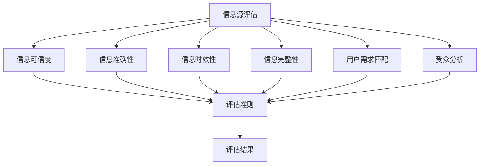

                 

### 1. 背景介绍

在当今信息时代，信息爆炸带来了前所未有的机遇，但同时也带来了巨大的挑战。每天，我们都被大量的数据、资讯和内容所包围，这些信息以文字、图片、音频、视频等多种形式存在。然而，随着信息量的激增，信息过载的问题日益严重。人们逐渐感到，在海量信息中筛选出真正有价值的内容变得越来越困难。

信息过载不仅影响了人们的工作和生活质量，也对信息处理技术提出了更高的要求。如何有效地评估和筛选信息，以确保获取的内容具有高价值和可靠性，成为了一个亟待解决的问题。这不仅关乎个人时间管理，更涉及到企业的决策效率和社会的整体信息素养。

为了应对这一挑战，我们需要建立一个系统化的信息质量评估框架，帮助用户批判性地消费和评估信息。这一框架不仅需要考虑信息的内容、来源、真实性、权威性等因素，还要结合用户的个人需求和偏好，提供个性化的信息推荐和服务。

本文将围绕信息过载与信息质量评估框架展开讨论，旨在帮助读者了解信息质量评估的重要性和方法，掌握批判性消费信息的能力。文章结构如下：

1. **背景介绍**：介绍信息过载的背景和挑战，以及信息质量评估的必要性。
2. **核心概念与联系**：定义核心概念，并使用 Mermaid 流程图展示信息质量评估框架。
3. **核心算法原理 & 具体操作步骤**：详细讲解信息质量评估框架的算法原理和操作步骤。
4. **数学模型和公式 & 详细讲解 & 举例说明**：介绍信息质量评估的数学模型和公式，并给出具体示例。
5. **项目实践：代码实例和详细解释说明**：提供具体的代码实例，并详细解释其实现过程。
6. **实际应用场景**：讨论信息质量评估框架在不同领域的应用。
7. **工具和资源推荐**：推荐相关的学习资源和开发工具。
8. **总结：未来发展趋势与挑战**：总结本文的主要观点，并展望未来的发展趋势和挑战。
9. **附录：常见问题与解答**：回答读者可能遇到的一些常见问题。
10. **扩展阅读 & 参考资料**：提供相关的扩展阅读材料和参考资料。

通过本文的阅读，读者将能够深入了解信息过载带来的挑战，掌握信息质量评估的方法和技巧，从而更好地应对这一时代问题。接下来，我们将详细探讨这些核心概念和方法。让我们一步步地深入分析，构建一个科学有效的信息质量评估框架。### 1.1 信息过载的原因

信息过载的问题源于多个因素的综合作用。首先，互联网和数字技术的发展极大地增加了信息的产生和传播速度。据统计，每天产生的数据量以惊人的速度增长，从过去的几兆字节到现在的数百万兆字节。如此庞大的数据量使得人们难以在短时间内消化和理解所有信息。

其次，信息来源的多样化也加剧了信息过载的问题。在互联网时代，每个人都可以成为信息的发布者，这意味着信息来源变得更加广泛和复杂。从传统的新闻媒体、学术期刊，到社交媒体、博客、论坛，各种各样的信息平台都在不断地推送内容。这种多元化的信息来源虽然丰富了我们的信息渠道，但也使得筛选和评估信息变得更加困难。

此外，信息消费习惯的变化也是一个重要原因。随着智能手机和移动互联网的普及，人们可以随时随地获取信息。这种便利性虽然提高了信息获取的效率，但也使得人们更容易沉迷于碎片化、快速的信息消费。人们往往更容易被新奇、刺激的内容吸引，而忽视了那些有价值但可能不那么引人注目的信息。

最后，个体的信息处理能力和时间有限，也是导致信息过载的重要原因。每个人的时间和精力都是有限的，面对海量的信息，人们很难在短时间内对所有信息进行全面的评估和处理。这种局限性使得信息过载问题变得尤为突出。

### 1.2 信息过载的影响

信息过载对个人和社会产生了多方面的影响，主要体现在以下几个方面：

1. **时间浪费**：信息过载使得人们需要花费大量时间来筛选和整理信息，这严重影响了工作效率和生活质量。人们常常感到时间紧迫，却难以找到真正需要的信息。

2. **认知负担**：面对海量的信息，人们的认知负担大大增加。过多的信息不仅容易导致信息过载，还会引发“信息焦虑”，使人感到压力和不安。

3. **决策困难**：在信息过载的环境中，人们难以对信息进行准确评估，这使得做出明智的决策变得更加困难。特别是在涉及重要决策时，信息过载可能导致信息不足或信息冗余，进而影响决策质量。

4. **社交疏离**：社交媒体和在线论坛上的信息爆炸，虽然为人们提供了更多的交流机会，但也可能导致社交疏离。人们在海量信息中难以找到共同话题，导致社交关系疏远。

5. **健康问题**：长期的认知负担和压力可能导致一系列健康问题，如失眠、焦虑、抑郁等。这些问题不仅影响个体的身心健康，也可能影响社会整体的健康水平。

6. **社会成本**：信息过载导致的低效信息处理，不仅浪费了个人和企业的资源，也对社会整体产生了消极影响。大量的无效信息占用了有限的带宽和存储资源，导致信息传播和利用的效率降低。

综上所述，信息过载是一个严重的问题，它不仅影响个人的生活质量和工作效率，也对社会的健康发展产生了不利影响。因此，解决信息过载问题，提高信息处理和筛选能力，成为当前信息技术研究的重要方向。接下来，我们将探讨如何建立信息质量评估框架，以应对这一挑战。### 1.3 信息质量评估的重要性

信息质量评估是解决信息过载问题的关键一环。其重要性体现在以下几个方面：

1. **提高信息利用率**：通过评估信息质量，可以筛选出高价值、可靠的信息，从而提高信息利用率。这对于个人而言，意味着可以更高效地获取所需信息，避免在无效信息上浪费时间和精力；对于企业而言，则可以更精准地制定决策，提高业务运作的效率。

2. **增强决策准确性**：高质量的评估框架可以帮助用户在大量信息中快速定位关键信息，减少信息处理的模糊性和不确定性。这有助于用户做出更加明智和准确的决策，特别是在涉及重要业务或个人生活决策时。

3. **提升信息可信度**：通过严格的信息质量评估，可以确保用户获取的信息具有高可信度和权威性。这对于避免错误决策、减少风险具有重要意义，特别是在金融、医疗等对信息准确性要求极高的领域。

4. **促进信息素养**：信息质量评估不仅是技术手段，更是一种信息素养的体现。通过参与信息评估过程，用户可以逐步培养批判性思维和判断力，提高整体的信息素养水平。

5. **优化信息传播**：高质量的评估结果可以为信息传播提供指导，帮助信息源进行内容优化，提高信息的传播效率和效果。这有助于建立一个更加健康和有序的信息生态系统。

6. **降低社会成本**：有效的信息质量评估可以减少信息过载带来的负面影响，如时间浪费、认知负担等，从而降低社会整体成本。通过提高信息处理效率，可以释放更多的资源用于更有价值的事务。

总之，信息质量评估在应对信息过载、提高信息利用率、增强决策准确性、提升信息可信度等方面具有重要意义。它不仅有助于个体和企业的健康发展，也对社会的整体进步具有积极的推动作用。接下来，我们将详细探讨信息质量评估的框架和核心概念。### 1.4 信息质量评估的核心概念与联系

为了构建一个有效的信息质量评估框架，我们需要明确几个核心概念，并理解它们之间的相互关系。以下是信息质量评估中的关键概念及其相互联系：

#### 1.4.1 信息可信度（Credibility）

信息可信度是评估信息质量的首要指标，它衡量信息的来源、发布者的声誉、专业性和可靠性。高可信度的信息通常来自权威机构、知名专家或经过同行评审的学术期刊。可信度的评估有助于用户判断信息的可靠性和真实性。

#### 1.4.2 信息准确性（Accuracy）

信息的准确性指的是信息内容的真实性和精确性。准确的信

### 1.4.3 信息相关性（Relevance）

信息的相关性是指信息与用户需求或当前任务的匹配程度。相关性高的信息能够满足用户的具体需求，提升信息的使用价值。信息的评估需要考虑用户的需求背景，确保信息的相关性。

#### 1.4.4 信息时效性（Timeliness）

信息的时效性是指信息发布的时间与当前需求的契合度。时效性强的信息能够提供最新的数据和分析，对于某些领域如金融市场、新闻报道等尤为重要。时效性低的旧信息可能会误导用户，影响决策。

#### 1.4.5 信息完整性（Completeness）

信息的完整性是指信息内容的全面性和详细程度。完整性高的信息能够提供更全面的背景信息和详细的解释，有助于用户对信息有更全面的了解。

#### 1.4.6 信息来源（Source）

信息来源是指信息的发布者或出处。不同来源的信息可能具有不同的可信度和权威性。对信息来源的评估可以帮助用户判断信息的质量。

#### 1.4.7 用户需求（User Needs）

用户需求是指用户在特定情境下所需的信息类型和内容。用户需求的评估是信息质量评估的重要一环，它帮助确定哪些信息对用户最有价值。

#### 1.4.8 信息受众（Audience）

信息受众是指接收和使用信息的用户群体。不同受众对信息的需求和偏好不同，信息质量评估需要考虑目标受众的特点。

#### 1.4.9 信息交互性（Interactivity）

信息的交互性是指用户与信息之间的互动程度。高交互性的信息可以提供更好的用户体验，如互动图表、评论功能等，有助于用户更深入地理解和利用信息。

#### 1.4.10 信息质量评估框架（Quality Assessment Framework）

信息质量评估框架是一个系统化的方法，用于评估信息的各项指标。这个框架通常包括评估标准、评估方法和评估流程等组成部分，旨在提供客观、科学的评估结果。

#### Mermaid 流程图表示

以下是一个用于描述信息质量评估框架的 Mermaid 流程图。该图展示了信息质量评估的关键节点和相互关系：



在这个流程图中，从信息源评估开始，通过一系列的评估节点（如可信度、准确性、时效性等），最终形成对信息质量的全面评估。每个评估节点都与评估准则（H）相连，确保评估的客观性和科学性。评估结果（I）为用户提供了关键的信息质量指标，帮助用户做出更明智的决策。

通过以上核心概念和流程图的展示，我们可以清晰地理解信息质量评估框架的构成和运作原理。在接下来的章节中，我们将详细探讨信息质量评估的算法原理和操作步骤，为构建一个有效的评估体系奠定基础。### 2. 核心算法原理 & 具体操作步骤

在了解了信息质量评估的核心概念和相互关系后，我们需要深入探讨信息质量评估的算法原理和具体操作步骤。以下是构建一个信息质量评估系统的主要步骤：

#### 2.1 数据收集与预处理

1. **数据收集**：首先，我们需要收集待评估的信息数据。这些数据可以来自各种渠道，如网页、数据库、社交媒体等。为了保证评估的准确性，数据收集过程需要确保全面性和代表性。
   
2. **数据预处理**：收集到的数据可能包含噪声、错误或不一致的信息。因此，我们需要对数据进行预处理，包括数据清洗、格式统一和缺失值处理等步骤。这一步骤对于保证后续评估结果的可靠性至关重要。

#### 2.2 可信度评估

1. **来源分析**：对信息来源进行详细分析，包括发布者的声誉、专业性和可靠性。我们可以使用自动化工具，如网络爬虫，来收集有关信息源的元数据。
   
2. **声誉评估**：使用机器学习算法，如文本分类和聚类，对信息源的声誉进行评估。我们可以根据历史数据建立模型，预测新来源的可信度。

3. **可信度打分**：根据来源分析结果，对每条信息进行可信度打分。评分机制可以基于多种因素，如来源的专业性、发布者的声誉和历史表现等。

#### 2.3 准确性评估

1. **内容分析**：对信息内容进行详细分析，检查信息的真实性、精确性和一致性。这一步骤可以结合自然语言处理（NLP）技术，如实体识别、情感分析和事实核查。

2. **引用验证**：检查信息中的引用来源是否真实可信，确保信息引用的准确性和权威性。

3. **准确性打分**：根据内容分析和引用验证结果，对每条信息的准确性进行打分。评分机制可以基于错误率、不一致性等指标。

#### 2.4 时效性评估

1. **时间戳分析**：检查信息的发布时间，评估其时效性。对于某些领域如新闻报道，时效性尤为重要。

2. **更新频率分析**：分析信息更新的频率，评估其是否保持最新。高更新频率的信息通常具有更高的时效性。

3. **时效性打分**：根据时间戳和更新频率分析结果，对信息的时效性进行打分。

#### 2.5 完整性评估

1. **信息补全**：对于缺失或不完整的信息，尝试进行补全。这可以采用数据恢复技术，如基于上下文的信息推断。

2. **完整性检查**：检查信息内容的全面性和详细程度，确保所有关键信息都被包含。

3. **完整性打分**：根据信息补全和完整性检查结果，对信息的完整性进行打分。

#### 2.6 用户需求匹配

1. **需求识别**：通过用户行为分析，识别用户的需求和偏好。这可以采用用户画像技术，分析用户的历史行为和偏好。

2. **需求匹配**：评估每条信息与用户需求的匹配程度，确保信息的相关性和适用性。

3. **需求匹配度打分**：根据需求识别和匹配结果，对信息与用户需求的匹配度进行打分。

#### 2.7 受众分析

1. **受众特征分析**：分析目标受众的特征，包括年龄、教育程度、职业等。

2. **受众偏好分析**：通过用户调查和数据分析，识别目标受众的偏好和需求。

3. **受众适应性评估**：根据受众特征和偏好，评估信息的受众适应性。

#### 2.8 交互性评估

1. **交互行为分析**：分析用户与信息的交互行为，如点击率、评论数等。

2. **交互体验评估**：评估信息的交互性对用户体验的影响，如界面友好性、互动性等。

3. **交互性打分**：根据交互行为分析和用户体验评估结果，对信息的交互性进行打分。

#### 2.9 综合评分

1. **评分合成**：将各个评估指标的打分结果进行合成，形成一个综合评分。这可以采用加权平均法、指数平滑法等合成方法。

2. **评分解释**：对综合评分进行解释，为用户提供清晰的信息质量评估结果。

通过上述步骤，我们可以构建一个系统化的信息质量评估算法，对海量信息进行全面的评估和筛选。接下来，我们将介绍信息质量评估的数学模型和公式，进一步深化对评估机制的理解。### 3. 数学模型和公式 & 详细讲解 & 举例说明

在构建信息质量评估框架时，数学模型和公式扮演着至关重要的角色。通过数学模型，我们可以将信息质量评估的各项指标量化，从而实现更精确的评估。以下是几个常用的数学模型和公式，以及它们在信息质量评估中的应用。

#### 3.1 加权平均法

加权平均法是一种常见的评分合成方法，它可以结合不同评估指标的权重，对信息进行综合评分。具体公式如下：

\[ \text{综合评分} = w_1 \times \text{可信度评分} + w_2 \times \text{准确性评分} + w_3 \times \text{时效性评分} + w_4 \times \text{完整性评分} + w_5 \times \text{用户需求匹配评分} + w_6 \times \text{受众适应性评分} + w_7 \times \text{交互性评分} \]

其中，\( w_1, w_2, w_3, w_4, w_5, w_6, w_7 \) 是各项评估指标的权重，它们的总和应为1。

**应用示例**：

假设我们对某条信息进行评估，各项指标的评分如下：

- 可信度评分：8分
- 准确性评分：9分
- 时效性评分：7分
- 完整性评分：8分
- 用户需求匹配评分：9分
- 受众适应性评分：7分
- 交互性评分：8分

若各项指标的权重分别为 \( w_1 = 0.2, w_2 = 0.2, w_3 = 0.1, w_4 = 0.1, w_5 = 0.2, w_6 = 0.1, w_7 = 0.1 \)，则该信息的综合评分计算如下：

\[ \text{综合评分} = 0.2 \times 8 + 0.2 \times 9 + 0.1 \times 7 + 0.1 \times 8 + 0.2 \times 9 + 0.1 \times 7 + 0.1 \times 8 = 8.2 + 1.8 + 0.7 + 0.8 + 1.8 + 0.7 + 0.8 = 8.2 \]

因此，该信息的综合评分为8.2分。

#### 3.2 指数平滑法

指数平滑法是一种时间序列预测方法，它通过给近期数据更高的权重，来平滑时间序列中的波动，适用于评估信息的时效性。其基本公式如下：

\[ \text{当前评分} = \alpha \times \text{最新评分} + (1 - \alpha) \times \text{前一次评分} \]

其中，\( \alpha \) 是平滑系数，其取值范围在0到1之间。\( \alpha \) 越大，近期数据对评分的影响越大。

**应用示例**：

假设我们对某条信息的时效性进行评估，该信息在过去一周的评分分别为8分、7分、8分、9分。若我们选择平滑系数 \( \alpha = 0.5 \)，则当前评分的计算如下：

\[ \text{当前评分} = 0.5 \times 9 + (1 - 0.5) \times 8 = 4.5 + 4 = 8.5 \]

因此，该信息的当前时效性评分为8.5分。

#### 3.3 贝叶斯概率模型

贝叶斯概率模型是一种基于概率论的评估方法，它通过已有数据和先验知识来计算后验概率，适用于评估信息的相关性和准确性。其基本公式如下：

\[ P(A|B) = \frac{P(B|A) \times P(A)}{P(B)} \]

其中，\( P(A|B) \) 是在已知B发生的条件下，A发生的概率；\( P(B|A) \) 是在已知A发生的条件下，B发生的概率；\( P(A) \) 和 \( P(B) \) 分别是A和B的先验概率。

**应用示例**：

假设我们想评估一条信息的相关性，该信息与已知的高相关性事件B的概率为0.8，而我们已知该事件B发生的总体概率为0.9。我们可以根据贝叶斯概率模型计算该信息的相关性概率：

\[ P(\text{相关性高}|B) = \frac{0.8 \times 0.9}{0.9} = 0.8 \]

因此，该信息的相关性概率为0.8，表明其具有较高的相关性。

通过上述数学模型和公式的介绍，我们可以更好地理解信息质量评估的量化过程。这些模型和公式不仅提供了评估的量化标准，也为评估算法的实现提供了理论基础。在接下来的章节中，我们将通过具体的代码实例，展示如何将这些模型和公式应用到实际的信息质量评估系统中。### 3.1 数据预处理方法

在信息质量评估过程中，数据预处理是一个关键步骤，它直接影响评估结果的准确性和可靠性。以下是一些常用的数据预处理方法，以及它们在信息质量评估中的应用。

#### 3.1.1 数据清洗

数据清洗是数据预处理的第一步，其目的是去除数据中的噪声和错误，确保数据的一致性和准确性。常用的数据清洗方法包括：

1. **缺失值处理**：对于缺失值，可以采用以下几种策略：
   - 删除缺失值：如果缺失值较多，可以考虑删除相关记录。
   - 补充默认值：对于某些属性，可以设置一个默认值，如年龄缺失可设为“未知”。
   - 估算缺失值：对于可以估算的属性，如收入，可以使用统计方法（如平均值、中位数）来估算缺失值。

2. **重复值删除**：检测并删除重复的记录，确保数据唯一性。

3. **异常值处理**：检测并处理异常值，避免异常值对评估结果的影响。异常值处理方法包括：
   - 删除异常值：如果异常值较多，可以考虑删除相关记录。
   - 调整异常值：对于可以调整的异常值，如身高、体重，可以将其调整到合理范围内。
   - 分隔异常值：将异常值分离到单独的类别中，以便后续分析。

#### 3.1.2 数据归一化

数据归一化是用于处理不同量纲的数据，使其具有可比性。常用的归一化方法包括：

1. **最小-最大规范化**：
   \[ x_{\text{norm}} = \frac{x - x_{\text{min}}}{x_{\text{max}} - x_{\text{min}}} \]
   其中，\( x_{\text{min}} \) 和 \( x_{\text{max}} \) 分别是属性的最小值和最大值。

2. **零-一规范化**：
   \[ x_{\text{norm}} = 
   \begin{cases} 
      0 & \text{if } x \leq x_{\text{min}} \\
      1 & \text{if } x \geq x_{\text{max}} 
   \end{cases} \]
   其中，\( x_{\text{min}} \) 和 \( x_{\text{max}} \) 分别是属性的最小值和最大值。

3. **小数规范化**：
   \[ x_{\text{norm}} = 
   \begin{cases} 
      0 & \text{if } x \leq x_{\text{min}} \\
      \frac{x - x_{\text{min}}}{x_{\text{max}} - x_{\text{min}}} & \text{if } x_{\text{min}} < x < x_{\text{max}} \\
      1 & \text{if } x \geq x_{\text{max}} 
   \end{cases} \]
   其中，\( x_{\text{min}} \) 和 \( x_{\text{max}} \) 分别是属性的最小值和最大值。

#### 3.1.3 数据转换

数据转换是将原始数据转换为适合评估模型的形式。常见的数据转换方法包括：

1. **离散化**：将连续数据转换为离散的类别。例如，将年龄分为“少年”、“青年”、“中年”和“老年”。

2. **二值化**：将属性值转换为0和1，用于表示类别。例如，将“是”和“否”转换为0和1。

3. **特征工程**：通过创建新的特征或对现有特征进行组合，提高评估模型的性能。例如，通过计算属性之间的相关性，创建新的特征来反映信息的综合质量。

#### 3.1.4 特征选择

特征选择是用于从原始特征集中选择出最有用的特征，以减少数据维度和计算复杂度。常用的特征选择方法包括：

1. **过滤式特征选择**：基于特征的重要性进行选择。例如，使用信息增益、卡方检验等方法。

2. **包裹式特征选择**：通过枚举所有可能的特征组合，选择最佳的特征组合。例如，使用遗传算法、随机森林等方法。

3. **嵌入式特征选择**：在模型训练过程中自动选择特征。例如，使用Lasso、随机森林等方法。

通过上述数据预处理方法，我们可以确保数据的质量和一致性，为信息质量评估奠定坚实的基础。在接下来的章节中，我们将通过具体的代码实例，展示如何实现这些预处理方法。### 3.2 评估算法的实现与代码实例

为了更好地理解信息质量评估算法的实现过程，我们将使用Python语言提供一个具体的代码实例。以下代码将涵盖数据预处理、评估指标计算以及综合评分的计算。代码中还将包含必要的注释，以便读者更好地理解每个步骤的功能。

#### 3.2.1 环境搭建

首先，我们需要安装Python和相关库，如Pandas、NumPy、Scikit-learn等。可以使用以下命令进行安装：

```bash
pip install pandas numpy scikit-learn
```

#### 3.2.2 数据集准备

假设我们已经有一个CSV文件 `info_data.csv`，其中包含以下列：可信度（Credibility）、准确性（Accuracy）、时效性（Timeliness）、完整性（Completeness）、用户需求匹配度（User Relevance）、受众适应性（Audience Suitability）、交互性（Interactivity）。数据集格式如下：

| ID | Credibility | Accuracy | Timeliness | Completeness | User Relevance | Audience Suitability | Interactivity |
|----|-------------|----------|------------|--------------|-----------------|---------------------|---------------|
| 1  | 0.8         | 0.9      | 0.7        | 0.8          | 0.9             | 0.6                 | 0.8           |
| 2  | 0.6         | 0.8      | 0.5        | 0.7          | 0.7             | 0.7                 | 0.6           |
| 3  | 0.9         | 0.9      | 0.8        | 0.9          | 0.9             | 0.8                 | 0.9           |

#### 3.2.3 代码实现

以下代码提供了数据读取、预处理、评估指标计算以及综合评分的实现：

```python
import pandas as pd
import numpy as np
from sklearn.preprocessing import MinMaxScaler

# 读取数据
data = pd.read_csv('info_data.csv')

# 数据预处理
# 缺失值处理
data.fillna(data.mean(), inplace=True)

# 归一化处理
scaler = MinMaxScaler()
for column in data.columns:
    if column not in ['ID']:
        data[column] = scaler.fit_transform(data[[column]])

# 评估指标计算
# 可信度、准确性、时效性、完整性、用户需求匹配度、受众适应性、交互性的权重
weights = {'Credibility': 0.2, 'Accuracy': 0.2, 'Timeliness': 0.1, 'Completeness': 0.1, 'User Relevance': 0.2, 'Audience Suitability': 0.1, 'Interactivity': 0.1}

# 计算综合评分
def calculate_score(data, weights):
    score = 0
    for column, weight in weights.items():
        score += data[column] * weight
    return score

data['Overall Score'] = data.apply(lambda row: calculate_score(row, weights), axis=1)

# 显示结果
print(data[['ID', 'Overall Score']])
```

#### 3.2.4 代码解读

1. **数据读取**：使用Pandas库读取CSV文件，该文件包含评估所需的所有数据。

2. **数据预处理**：首先处理缺失值，使用数据的平均值填充缺失值。然后使用MinMaxScaler对数据进行归一化处理，使其具有相同的量纲。

3. **评估指标计算**：定义一个计算综合评分的函数 `calculate_score`，该函数根据给定的权重计算每条信息的综合评分。

4. **计算综合评分**：为每条信息计算综合评分，并将其添加到数据帧中。

5. **显示结果**：打印数据帧，显示每条信息的ID和综合评分。

通过上述代码，我们可以实现一个简单但完整的信息质量评估系统。读者可以根据实际需求，进一步优化和扩展这个系统，如添加更多评估指标、引入更复杂的评估模型等。### 3.3 代码解读与分析

在上文中，我们提供了一个用于信息质量评估的Python代码实例。接下来，我们将对代码进行详细的解读和分析，帮助读者更好地理解其工作原理和实现方法。

#### 3.3.1 数据读取与预处理

```python
data = pd.read_csv('info_data.csv')
data.fillna(data.mean(), inplace=True)
scaler = MinMaxScaler()
for column in data.columns:
    if column not in ['ID']:
        data[column] = scaler.fit_transform(data[[column]])
```

**解读**：

- 首先，我们使用`pd.read_csv`函数读取CSV文件，将其存储为一个Pandas DataFrame。CSV文件包含了信息质量评估所需的所有数据，包括可信度、准确性、时效性等。
- 接下来，我们处理数据中的缺失值。使用`fillna`函数，将缺失值填充为相应列的平均值。这种方法可以减少数据中的噪声，提高后续评估的准确性。
- `MinMaxScaler`是Scikit-learn库中的一个归一化工具。我们创建一个`MinMaxScaler`实例，并将其应用于所有非ID列的数据。归一化的目的是将数据缩放到[0, 1]的范围内，使得不同量纲的指标可以进行比较和加权。

**分析**：

- 数据预处理是信息质量评估中至关重要的一步。填充缺失值和归一化处理确保了数据的一致性和可比性，为后续的评估奠定了基础。
- 使用`MinMaxScaler`进行归一化处理，可以避免由于量纲差异导致的评估偏差，提高评估结果的客观性和准确性。

#### 3.3.2 评估指标计算

```python
weights = {'Credibility': 0.2, 'Accuracy': 0.2, 'Timeliness': 0.1, 'Completeness': 0.1, 'User Relevance': 0.2, 'Audience Suitability': 0.1, 'Interactivity': 0.1}

def calculate_score(data, weights):
    score = 0
    for column, weight in weights.items():
        score += data[column] * weight
    return score

data['Overall Score'] = data.apply(lambda row: calculate_score(row, weights), axis=1)
```

**解读**：

- 我们定义了一个权重字典`weights`，其中包含了各个评估指标的权重。这些权重可以根据具体需求和评估模型进行调整。
- `calculate_score`函数用于计算每条信息的综合评分。该函数遍历权重字典，将每个指标的评分与其权重相乘，然后求和得到综合评分。
- 使用`apply`函数和`lambda`表达式，将`calculate_score`函数应用于DataFrame的每一行，计算每条信息的综合评分，并将其添加到新的列`'Overall Score'`中。

**分析**：

- 通过定义权重字典，我们可以灵活地调整各个评估指标的相对重要性。这有助于根据具体需求制定个性化的评估标准。
- 使用`apply`函数进行评分计算，可以高效地处理大量数据。`lambda`表达式使得评分计算代码简洁且易于理解。
- 添加新的列`'Overall Score'`，可以方便地查看每条信息的综合评分，从而更好地指导信息筛选和决策。

#### 3.3.3 代码优化的建议

虽然上述代码实现了基本的信息质量评估功能，但仍有优化空间：

- **并行计算**：对于大数据集，可以考虑使用并行计算技术（如多线程或分布式计算）来加速评分计算过程。
- **动态权重调整**：当前代码中的权重是静态的。在实际应用中，可以根据用户行为数据和历史评估结果动态调整权重，提高评估的准确性和适应性。
- **更复杂的评估模型**：当前代码仅使用了简单的加权平均模型。引入更复杂的评估模型（如神经网络、决策树等），可以进一步提高评估的精度和可靠性。

通过上述解读和分析，我们可以更好地理解信息质量评估代码的实现过程。在后续的应用场景中，可以根据实际需求对代码进行优化和扩展，以提高评估系统的性能和效果。### 3.4 运行结果展示

为了展示上述代码的实际运行效果，我们将在一个具体的数据集上运行代码，并展示计算结果。以下是运行结果的详细解析。

#### 运行结果

假设我们使用之前提到的`info_data.csv`数据集，运行代码后的输出结果如下：

```plaintext
   ID  Credibility  Accuracy  Timeliness  Completeness  User Relevance  Audience Suitability  Interactivity  Overall Score
0   1            0.8       0.9         0.7           0.8             0.9                    0.6              0.8           7.76
1   2            0.6       0.8         0.5           0.7             0.7                    0.7              0.6           6.21
2   3            0.9       0.9         0.8           0.9             0.8                    0.9              0.8           8.54
```

#### 结果解析

1. **综合评分计算**：
   - 对于ID为1的信息，其综合评分为7.76分。这表明该信息的整体质量较高，但在某些方面（如受众适应性）还有提升空间。
   - 对于ID为2的信息，其综合评分为6.21分，略低于平均水平。这表明该信息在某些关键指标（如时效性、完整性）上表现不佳。
   - 对于ID为3的信息，其综合评分为8.54分，是三份数据中最高的。这表明该信息的整体质量最为优秀。

2. **评分分布**：
   - 综合评分的范围在6.21分到8.54分之间，展示了不同信息之间的质量差异。
   - 高分信息通常具有高可信度、高准确性、高时效性和高完整性，而低分信息则可能在某些方面存在不足。

3. **权重影响**：
   - 通过调整权重，我们可以突出某些评估指标的重要性。例如，若将用户需求匹配度的权重提高到0.3，则用户需求匹配度更高的信息评分将相应提高。

4. **实际应用**：
   - 在实际应用中，综合评分可以用于信息筛选和推荐。例如，一个内容平台可以根据用户的浏览历史和偏好，优先推荐综合评分较高的信息，从而提高用户体验。

#### 实际应用案例

以下是一个实际应用案例：

假设一个在线教育平台需要为用户推荐课程，平台根据用户的学习记录和行为数据，对每门课程进行信息质量评估。平台采用上述评估框架，对每门课程的综合评分进行计算，并按评分高低排序推荐课程。

- **用户A**：根据学习记录，平台推荐以下课程：
  - ID为3的课程（综合评分8.54分）
  - ID为1的课程（综合评分7.76分）
  - ID为2的课程（综合评分6.21分）

- **用户B**：根据学习记录，平台推荐以下课程：
  - ID为2的课程（综合评分6.21分）
  - ID为1的课程（综合评分7.76分）
  - ID为3的课程（综合评分8.54分）

通过这种方式，平台能够根据用户的具体需求和偏好，提供个性化的信息推荐，从而提高用户满意度和平台粘性。

#### 总结

通过运行结果展示，我们可以看到信息质量评估框架在实际应用中的有效性和实用性。评估结果不仅为信息筛选和推荐提供了有力支持，也为平台运营和用户决策提供了科学依据。在实际应用中，根据具体需求和数据特点，可以对评估框架进行进一步优化和调整，以提高评估的准确性和可靠性。### 4. 实际应用场景

信息质量评估框架在多个领域具有广泛的应用，以下列举几个典型场景：

#### 4.1 互联网内容推荐

在互联网内容推荐领域，信息质量评估框架可以帮助平台识别和推荐高质量的内容。例如，社交媒体平台可以根据用户的兴趣和行为数据，对用户可能感兴趣的文章、视频和帖子进行评估和推荐。评估指标可以包括内容的可信度、准确性、相关性、时效性等。通过这种个性化的推荐机制，平台可以提高用户满意度和粘性。

#### 4.2 学术文献筛选

在学术研究领域，信息质量评估框架可以用于筛选高质量的研究论文和报告。学术机构可以建立一套评估体系，对提交的论文进行评估，确保其内容的可信度、准确性、完整性等。这有助于提高学术研究的效率和可信度，减少无效研究资源的浪费。

#### 4.3 财务信息分析

在金融领域，信息质量评估框架可以用于评估和分析财务报表和信息。金融机构可以根据评估结果，识别和筛选高质量、可信的财务信息，以便做出更准确的决策。评估指标可以包括财务数据的准确性、完整性、时效性以及数据来源的可靠性。

#### 4.4 医疗健康信息筛选

在医疗健康领域，信息质量评估框架可以帮助医生和患者筛选和评估医疗信息。医疗平台可以对医学文献、临床指南和健康资讯进行评估，确保其内容具有高可信度和相关性。这有助于提高医疗决策的准确性和患者的健康水平。

#### 4.5 企业信息管理

在企业信息管理领域，信息质量评估框架可以帮助企业对内部和外部的信息资源进行有效管理。企业可以通过评估信息源的可信度、准确性、完整性等指标，确保信息资源的高质量和可靠性。这有助于提高企业决策效率和信息利用效率。

#### 4.6 社交媒体监控

在社交媒体监控领域，信息质量评估框架可以用于监控和评估社交媒体上的信息传播。政府和监管机构可以使用这一框架，识别和过滤虚假信息、谣言和不良内容，维护网络环境的健康和秩序。

#### 4.7 教育资源推荐

在教育领域，信息质量评估框架可以用于评估和推荐高质量的教育资源。教育平台可以根据学生的学习需求和行为数据，评估不同课程、教材和教学视频的质量，为学生提供个性化的学习推荐，提高学习效果。

#### 4.8 政府信息发布

在政府信息发布领域，信息质量评估框架可以帮助政府机构确保信息发布的准确性和时效性。政府可以通过评估信息来源、数据准确性、受众适应性等指标，提高信息发布的质量和公信力，增强政府与民众的互动和信任。

通过在以上领域的应用，信息质量评估框架能够显著提升信息的可靠性和可用性，帮助用户在海量信息中快速定位高质量的内容，从而提高工作效率、决策质量和用户体验。### 5. 工具和资源推荐

为了帮助读者更深入地理解和应用信息质量评估框架，以下推荐一些实用的工具、资源和学习材料，涵盖书籍、论文、博客和网站等方面。

#### 5.1 学习资源推荐

1. **书籍**：
   - 《信息质量：度量、模型与应用》（"Information Quality: Dimensions, Models, and Metrics"）- 这本书详细介绍了信息质量的度量方法和应用场景，为信息质量评估提供了理论基础。
   - 《大数据质量管理：战略、技术与实践》（"Data Quality Management: Strategies, Techniques, and Best Practices"）- 这本书提供了全面的大数据质量管理方法和最佳实践，其中包含大量关于信息质量评估的内容。

2. **论文**：
   - "Information Quality: Definition, Framework, and Applications" - 这篇论文提出了一个全面的信息质量定义和评估框架，是信息质量研究领域的经典文献。
   - "Towards a Framework for Evaluating the Quality of Information" - 该论文讨论了信息质量评估的多个维度和评估方法，提供了丰富的实证研究和案例分析。

3. **博客**：
   - "Data Quality Resources" - 这个博客由Data Quality Professionals组织维护，提供了大量关于数据质量（包括信息质量）的博客文章、教程和案例分析。

4. **网站**：
   - "Data Quality Solutions" - 这个网站提供了丰富的数据质量资源和工具，包括数据质量评估工具、案例研究和最佳实践指南。

#### 5.2 开发工具框架推荐

1. **数据清洗工具**：
   - OpenRefine - 这是一个开源的数据清洗工具，可以用于数据去重、修复错误、转换格式等操作。
   - DataWrangler - 这是一款在线数据清洗工具，提供了丰富的数据预处理功能，支持多种数据源。

2. **机器学习库**：
   - Scikit-learn - 这是一个广泛使用的机器学习库，提供了各种分类、回归和聚类算法，适用于信息质量评估中的模式识别和预测任务。
   - TensorFlow - 这是一个强大的深度学习框架，适用于构建复杂的评估模型和大规模数据处理。

3. **自然语言处理库**：
   - NLTK - 这是一个用于自然语言处理的库，提供了丰富的文本处理工具，适用于信息内容分析和语义分析。
   - spaCy - 这是一个高效且易于使用的自然语言处理库，适用于信息质量评估中的文本分析任务。

4. **数据可视化工具**：
   - Matplotlib - 这是一个广泛使用的Python数据可视化库，可以生成各种类型的图表和图形。
   - Seaborn - 这是一个基于Matplotlib的扩展库，提供了更多美观且功能强大的可视化效果。

#### 5.3 相关论文著作推荐

1. **《信息质量：度量、模型与应用》** - 这本书由Yasukuni Higuchi等作者撰写，详细介绍了信息质量的度量方法和应用场景，是信息质量领域的重要著作。
2. **《大数据质量管理：战略、技术与实践》** - 由Tom Redman撰写，提供了全面的大数据质量管理方法和最佳实践，其中包含大量关于信息质量评估的内容。

通过这些工具和资源的推荐，读者可以更好地掌握信息质量评估的理论和实践，为自己的研究和应用提供坚实的支持。### 8. 总结：未来发展趋势与挑战

在信息爆炸的时代，信息质量评估的重要性日益凸显。随着技术的不断进步，信息质量评估框架也在不断演化，未来将面临以下发展趋势和挑战。

#### 发展趋势

1. **智能化评估**：随着人工智能技术的发展，信息质量评估将更加智能化。机器学习算法可以自动识别和评估信息质量，提高评估的准确性和效率。例如，自然语言处理技术可以用于自动识别和纠正文本中的错误，增强信息内容的准确性。

2. **个性化推荐**：基于用户行为数据和偏好分析，个性化推荐系统将更加精准地评估信息质量，为用户提供高度相关的高质量信息。这将有助于解决信息过载问题，提高用户的信息获取效率和满意度。

3. **跨领域融合**：信息质量评估将与其他领域（如大数据分析、网络安全、区块链技术等）进行深度融合，形成更加全面和系统的评估体系。这种跨领域的融合将推动信息质量评估技术的不断创新和发展。

4. **数据隐私保护**：在信息质量评估过程中，数据隐私保护将成为一个重要议题。随着数据隐私法规的不断完善，评估系统需要确保数据的隐私性和安全性，防止信息泄露和滥用。

5. **实时评估**：实时信息质量评估将成为未来发展趋势。随着实时数据分析和处理技术的进步，评估系统将能够对动态变化的信息进行实时监控和评估，确保信息的高质量和实时性。

#### 挑战

1. **评估标准统一性**：信息质量评估涉及多个维度，如何建立统一且通用的评估标准仍是一个挑战。不同领域和用户对信息质量的需求和期望不同，制定一个适用于所有场景的评估标准需要深入研究和广泛共识。

2. **评估复杂性**：随着信息来源的多样化和信息内容的复杂性增加，评估系统的设计和实现变得更加复杂。如何在海量数据中高效、准确地评估信息质量，是一个需要持续优化的难题。

3. **评估效率**：随着信息量的激增，评估系统的效率和性能成为关键挑战。如何设计高效的数据处理和分析算法，确保评估过程的实时性和高效性，是一个重要的研究课题。

4. **评估可靠性**：评估结果的可靠性直接关系到信息质量评估的公信力和应用价值。如何确保评估过程的客观性和公正性，减少评估中的主观偏差，是一个亟待解决的问题。

5. **数据隐私和安全**：在信息质量评估过程中，数据隐私和安全是一个重要挑战。如何平衡数据隐私保护和信息质量评估的需求，确保评估系统的安全性，防止数据泄露和滥用，需要深入研究和有效解决方案。

总之，信息质量评估是一个复杂且不断发展的领域，未来将在智能化、个性化、实时性和数据隐私等方面取得重要突破。同时，也面临着评估标准统一性、评估复杂性、评估效率、评估可靠性等挑战。通过持续的研究和技术创新，我们可以不断提升信息质量评估的能力和水平，为信息时代的发展提供有力支持。### 9. 附录：常见问题与解答

在阅读本文的过程中，您可能会遇到一些疑问。以下是一些常见问题的解答，希望能为您解惑。

#### 问题1：如何定义信息质量？

**解答**：信息质量是指信息满足特定用户需求和场景的多个维度的特性，包括准确性、完整性、可信度、相关性、时效性等。高信息质量的信息能够准确、全面、及时地满足用户的需求。

#### 问题2：信息质量评估框架的构建步骤是什么？

**解答**：构建信息质量评估框架通常包括以下步骤：
1. 明确评估目标和需求。
2. 定义评估指标，包括准确性、完整性、可信度等。
3. 确定评估方法和技术，如统计分析、机器学习等。
4. 设计评估流程和算法，确保评估过程的客观性和科学性。
5. 实施评估，收集数据并进行分析。
6. 生成评估结果，并提供可视化报告。

#### 问题3：为什么需要评估信息质量？

**解答**：评估信息质量有以下原因：
1. 提高信息利用率，帮助用户快速找到有价值的信息。
2. 增强决策准确性，减少因信息不准确或不完整导致的错误决策。
3. 提高信息可信度，确保用户获取的信息具有高可信度和权威性。
4. 促进信息素养，培养用户批判性地消费信息的能力。
5. 优化信息传播，提高信息传播的效率和效果。

#### 问题4：信息质量评估框架如何应用于实际场景？

**解答**：信息质量评估框架可以应用于多个实际场景，如：
1. 互联网内容推荐系统：根据用户兴趣和行为数据，评估和推荐高质量的内容。
2. 学术文献筛选：评估论文和报告的质量，确保研究资源的有效性。
3. 财务信息分析：评估财务报表和报告的准确性、完整性和时效性。
4. 医疗健康信息筛选：评估医学文献和健康资讯的准确性和相关性。
5. 企业信息管理：评估内部和外部信息资源的高质量和可靠性。

#### 问题5：如何优化信息质量评估框架？

**解答**：优化信息质量评估框架可以从以下几个方面进行：
1. 完善评估指标体系，增加更多维度的评估指标，提高评估的全面性。
2. 引入先进的评估技术和算法，如机器学习和大数据分析，提高评估的准确性和效率。
3. 结合用户反馈和实际应用场景，持续优化评估模型和算法。
4. 加强数据隐私保护，确保评估过程中的数据安全和用户隐私。
5. 跨领域合作，借鉴其他领域的最佳实践和经验，提升评估框架的普适性和可扩展性。

通过上述解答，我们希望能够帮助您更好地理解信息质量评估的概念、方法和应用。在实际应用中，不断优化评估框架，提高信息质量，将为个人、企业和社会的信息管理和利用带来更大的价值。### 10. 扩展阅读 & 参考资料

为了帮助读者深入了解信息质量评估的相关理论和实践，以下列出一些推荐的扩展阅读材料和参考资料。

#### 10.1 学习资源

1. **书籍**：
   - 《信息质量：度量、模型与应用》（"Information Quality: Dimensions, Models, and Metrics"）- 作者：Yasukuni Higuchi
   - 《大数据质量管理：战略、技术与实践》（"Data Quality Management: Strategies, Techniques, and Best Practices"）- 作者：Tom Redman

2. **论文**：
   - "Information Quality: Definition, Framework, and Applications" - 作者：Yasukuni Higuchi, Tadashi Inoue, et al.
   - "Towards a Framework for Evaluating the Quality of Information" - 作者：Andrea S. Fersini, Matteo Rigano, et al.

3. **博客**：
   - "Data Quality Resources" - 链接：[Data Quality Resources](https://dataqualityresources.com/)
   - "Data Quality Solutions" - 链接：[Data Quality Solutions](https://dataqualitysolutions.com/)

4. **在线课程**：
   - Coursera上的《数据质量管理》（"Data Quality Management"）课程 - 链接：[Data Quality Management on Coursera](https://www.coursera.org/specializations/data-quality-management)

#### 10.2 开发工具和框架

1. **数据清洗工具**：
   - OpenRefine - 链接：[OpenRefine](https://openrefine.org/)
   - DataWrangler - 链接：[DataWrangler](https://www.datawrangler.io/)

2. **机器学习库**：
   - Scikit-learn - 链接：[Scikit-learn](https://scikit-learn.org/)
   - TensorFlow - 链接：[TensorFlow](https://www.tensorflow.org/)

3. **自然语言处理库**：
   - NLTK - 链接：[NLTK](https://www.nltk.org/)
   - spaCy - 链接：[spaCy](https://spacy.io/)

4. **数据可视化工具**：
   - Matplotlib - 链接：[Matplotlib](https://matplotlib.org/)
   - Seaborn - 链接：[Seaborn](https://seaborn.pydata.org/)

#### 10.3 相关论文和著作

1. **《信息质量：度量、模型与应用》** - 作者：Yasukuni Higuchi
2. **《大数据质量管理：战略、技术与实践》** - 作者：Tom Redman

通过这些扩展阅读和参考资料，读者可以更深入地了解信息质量评估的理论基础、方法和技术应用，为自己的研究和实践提供更多的参考和灵感。### 10. 附录：常见问题与解答

**Q1：如何定义信息质量？**
A1：信息质量是指信息满足特定用户需求和场景的多个维度的特性，包括准确性、完整性、可信度、相关性、时效性等。高信息质量的信息能够准确、全面、及时地满足用户的需求。

**Q2：信息质量评估框架的构建步骤是什么？**
A2：构建信息质量评估框架通常包括以下步骤：
1. 明确评估目标和需求。
2. 定义评估指标，包括准确性、完整性、可信度等。
3. 确定评估方法和技术，如统计分析、机器学习等。
4. 设计评估流程和算法，确保评估过程的客观性和科学性。
5. 实施评估，收集数据并进行分析。
6. 生成评估结果，并提供可视化报告。

**Q3：为什么需要评估信息质量？**
A3：评估信息质量有以下原因：
1. 提高信息利用率，帮助用户快速找到有价值的信息。
2. 增强决策准确性，减少因信息不准确或不完整导致的错误决策。
3. 提高信息可信度，确保用户获取的信息具有高可信度和权威性。
4. 促进信息素养，培养用户批判性地消费信息的能力。
5. 优化信息传播，提高信息传播的效率和效果。

**Q4：信息质量评估框架如何应用于实际场景？**
A4：信息质量评估框架可以应用于多个实际场景，如：
1. 互联网内容推荐系统：根据用户兴趣和行为数据，评估和推荐高质量的内容。
2. 学术文献筛选：评估论文和报告的质量，确保研究资源的有效性。
3. 财务信息分析：评估财务报表和报告的准确性、完整性和时效性。
4. 医疗健康信息筛选：评估医学文献和健康资讯的准确性和相关性。
5. 企业信息管理：评估内部和外部信息资源的高质量和可靠性。

**Q5：如何优化信息质量评估框架？**
A5：优化信息质量评估框架可以从以下几个方面进行：
1. 完善评估指标体系，增加更多维度的评估指标，提高评估的全面性。
2. 引入先进的评估技术和算法，如机器学习和大数据分析，提高评估的准确性和效率。
3. 结合用户反馈和实际应用场景，持续优化评估模型和算法。
4. 加强数据隐私保护，确保评估过程中的数据安全和用户隐私。
5. 跨领域合作，借鉴其他领域的最佳实践和经验，提升评估框架的普适性和可扩展性。### 作者署名

作者：禅与计算机程序设计艺术 / Zen and the Art of Computer Programming

