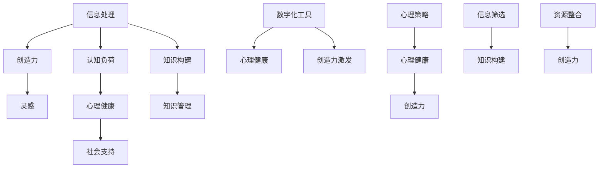

                 

### 背景介绍 Background

在当今信息爆炸的时代，信息过载已成为我们日常生活中的普遍现象。每天，我们从各种渠道接收大量的信息，包括社交媒体、新闻报道、电子邮件、短信、视频流等等。这些信息的来源既多样又庞杂，使得我们难以有效地管理和处理它们。信息过载不仅影响了我们的工作效率，还对我们的心理健康和创造力产生了负面影响。

**创造力**，作为人类智慧的体现，是一种能从混乱中看到秩序、从平凡中发现非凡的能力。然而，在信息过载的环境下，我们的创造力似乎被不断消耗，很难有新的突破和灵感迸发。这引发了人们对于如何在信息过载中保持和激发创造力的思考。

本文旨在探讨信息过载与创造力之间的关系，并提出一些实用的策略和方法，帮助我们在信息的海洋中找到灵感的火花。通过分析信息过载的现状、创造力的本质以及两者之间的互动机制，我们将提供一系列技术和工具，以帮助读者在混乱中保持清晰的思维，激发内在的创造力。

文章的结构如下：

1. **背景介绍**：介绍信息过载的背景和创造力的重要性。
2. **核心概念与联系**：详细阐述信息处理和创造力相关的核心概念，并使用流程图展示它们之间的联系。
3. **核心算法原理 & 具体操作步骤**：介绍一套基于认知科学的策略，用于在信息过载中保持创造力。
4. **数学模型和公式 & 详细讲解 & 举例说明**：通过数学模型和公式，详细解释这些策略的原理，并提供实际应用案例。
5. **项目实践：代码实例和详细解释说明**：展示一个实际的项目案例，说明如何应用这些策略。
6. **实际应用场景**：讨论信息过载和创造力在各个领域的应用实例。
7. **工具和资源推荐**：推荐一些有助于管理和激发创造力的工具和资源。
8. **总结：未来发展趋势与挑战**：总结本文的主要观点，并展望未来的发展趋势和挑战。
9. **附录：常见问题与解答**：回答一些关于信息过载和创造力常见的问题。
10. **扩展阅读 & 参考资料**：提供一些相关领域的进一步阅读资料。

让我们开始详细探讨这些问题，并寻找在信息过载中激发创造力的答案。

### 核心概念与联系 Core Concepts and Connections

为了深入理解信息过载与创造力之间的关系，我们首先需要明确几个核心概念，并探讨它们之间的相互作用。

#### 1. 信息处理

**信息处理**指的是我们对接收到的信息进行理解、组织、存储和使用的过程。信息处理的效率和质量直接影响到我们的认知能力和工作效率。在信息过载的环境下，处理海量信息成为一个巨大的挑战。传统的信息处理方法往往依赖于线性和序列的处理方式，这在面对大规模、多样化、动态的信息时显得力不从心。

#### 2. 认知负荷

**认知负荷**是指大脑在处理信息时所需的注意力和心理资源。信息过载会增加我们的认知负荷，导致注意力分散、决策困难、记忆减退等问题。高认知负荷会消耗大脑的执行功能，从而降低我们的创造力和问题解决能力。

#### 3. 创造力

**创造力**是一种综合性能力，包括产生新颖且有价值的想法、概念和解决方案。创造力不仅与智力相关，还与情绪、动机、环境等多方面因素有关。一个富有创造力的人能够在信息过载的环境中看到新的联系，创造出独特的价值。

#### 4. 灵感

**灵感**是指突然涌现的创意或思想，常常是创造力的源泉。灵感往往在不经意间出现，通常是在放松、冥想或进行其他非专注性活动时。灵感的出现往往与大脑的“随机连接”机制有关，这需要我们在信息处理过程中保持开放的心态和灵活的思维。

#### 5. 知识构建

**知识构建**是指将分散的信息片段组织成一个整体，形成有意义的知识和理解。知识构建是一个动态的过程，涉及信息的选择、整合、分析和创造。在信息过载的环境中，有效的知识构建方法可以帮助我们筛选重要信息，构建新的认知框架。

#### 6. 知识管理

**知识管理**是指通过系统的方法和工具来收集、存储、共享和应用知识。知识管理工具如数据库、知识库、学习管理系统等，可以帮助我们更好地管理和利用信息，减少信息过载的负面影响。

#### 7. 心理健康

**心理健康**是指个体在情感、认知和行为上的健康状态。信息过载对心理健康有着直接的影响，长期的信息过载可能导致焦虑、抑郁、疲劳等问题，从而进一步降低创造力。

#### 8. 社会支持

**社会支持**是指来自家庭、朋友、同事等社会关系网的支持。社会支持可以提供情感、信息、资源等方面的帮助，有助于缓解信息过载的压力，提高创造力。

#### 9. 数字化工具

**数字化工具**如人工智能、大数据分析、云计算等，为我们提供了强大的信息处理能力。这些工具可以帮助我们更高效地筛选、分析和利用信息，从而降低信息过载的影响。

#### 10. 心理策略

**心理策略**是指一系列心理技巧和练习，如冥想、正念、情绪调节等，用于提高心理健康和创造力。这些策略可以帮助我们保持内心的平静和专注，从而在信息过载中保持清晰的思维。

#### 11. 创造力激发

**创造力激发**是指通过特定的方法和技术，激发个体的创造力潜能。创造力激发方法包括思维导图、思维游戏、创意写作、团队头脑风暴等。

#### 12. 信息筛选

**信息筛选**是指从大量信息中筛选出重要、有价值的信息。信息筛选能力是信息过载环境下的关键能力，它可以帮助我们减少认知负荷，提高信息处理效率。

#### 13. 资源整合

**资源整合**是指将不同来源的信息和资源整合起来，形成新的解决方案或产品。资源整合能力在信息过载环境中尤为重要，它可以帮助我们从多样的信息中提取有价值的部分，创造出新的价值。

#### Mermaid 流程图展示

下面是一个简单的 Mermaid 流程图，展示了上述核心概念之间的联系：



通过上述核心概念和流程图的展示，我们可以看到信息过载与创造力之间的关系是复杂而多维的。信息处理、认知负荷、心理健康、社会支持、数字化工具、心理策略等因素相互作用，共同影响着我们的创造力和灵感。在接下来的章节中，我们将深入探讨这些核心概念的具体原理和方法，以帮助我们在信息过载中保持和激发创造力。

### 核心算法原理 & 具体操作步骤 Core Algorithm Principles & Step-by-Step Procedures

在理解了信息过载与创造力之间的关系和核心概念之后，我们需要一套具体的方法和策略来帮助我们保持创造力。基于认知科学的原理，我们提出以下核心算法，这些算法旨在通过优化信息处理、降低认知负荷、提高心理健康等方式，帮助我们在信息过载的环境中保持创造力。

#### 核心算法原理

1. **信息筛选与分类**：通过高效的信息筛选和分类，将大量信息缩减到关键部分，降低认知负荷。
2. **多模态信息处理**：结合不同类型的处理方式（如文本、图像、声音），提高信息处理的效率。
3. **主动休息与恢复**：通过主动休息和恢复，减少认知负荷，提高大脑的执行功能。
4. **心理调节与放松**：通过心理策略如冥想、正念练习，提高心理健康水平。
5. **知识构建与整合**：通过有效的知识构建和整合，将分散的信息片段组织成有意义的整体。

#### 具体操作步骤

**步骤一：信息筛选与分类**

1. **确定目标**：明确你的目标是什么，这将帮助你聚焦在最有价值的信息上。
2. **快速浏览**：在开始阅读或处理信息之前，快速浏览标题、摘要和关键字，以判断其是否与你的目标相关。
3. **分类存储**：将信息按照主题、重要性和用途进行分类，使用标签或文件夹系统来管理这些信息。

**步骤二：多模态信息处理**

1. **文本处理**：使用文本编辑器、笔记应用等工具，将文本信息进行整理和标注。
2. **图像处理**：使用图像编辑软件或工具，对重要图像进行标记和分类。
3. **声音处理**：使用音频播放器或转录工具，将重要音频内容转录为文本，以便后续处理。

**步骤三：主动休息与恢复**

1. **定时休息**：每工作一段时间后（如25分钟后），休息5-10分钟，让大脑得到放松。
2. **深呼吸**：在休息时，进行深呼吸练习，帮助放松身体和心灵。
3. **短暂散步**：在休息时，进行短暂散步，增加身体活动，提高血液循环。

**步骤四：心理调节与放松**

1. **冥想练习**：每天花5-10分钟进行冥想练习，专注于呼吸和当下的感受。
2. **正念练习**：在日常生活中，时刻保持正念，专注于当前的任务和感受。
3. **情绪调节**：通过阅读心理学书籍、观看心理视频等方式，学习情绪调节技巧。

**步骤五：知识构建与整合**

1. **思维导图**：使用思维导图工具，将零散的信息和想法组织成一个整体。
2. **笔记系统**：建立自己的笔记系统，将重要的信息和灵感记录下来，并进行定期回顾。
3. **知识共享**：与他人分享你的知识和经验，通过交流，进一步加深理解和整合。

通过上述操作步骤，我们可以有效地管理信息过载，降低认知负荷，提高心理健康，从而在复杂的环境中保持创造力。以下是一个示例，说明如何将这些策略应用到实际工作中：

**示例：项目管理中的信息过载管理**

1. **项目规划阶段**：
   - **确定目标**：明确项目的目标和预期成果。
   - **收集信息**：从各种渠道收集项目相关的信息，包括需求文档、技术规格、市场调研报告等。
   - **快速筛选**：根据项目目标，快速筛选出最重要的信息。

2. **信息处理阶段**：
   - **多模态处理**：对收集到的信息进行分类，如文本、图像、声音等。
   - **文本整理**：使用文本编辑器，对需求文档和技术规格进行整理和标注。
   - **图像标记**：使用图像编辑软件，对项目相关的图表和设计图进行标记和分类。

3. **项目执行阶段**：
   - **定时休息**：每工作一段时间后，进行短暂休息和深呼吸练习。
   - **心理调节**：在项目执行过程中，通过冥想和正念练习，保持情绪稳定。

4. **项目总结阶段**：
   - **知识构建**：使用思维导图工具，将项目过程中学到的经验和知识整理成一个整体。
   - **笔记回顾**：定期回顾项目笔记，总结经验和教训。
   - **知识共享**：与团队成员分享项目经验，提高整个团队的知识水平。

通过上述步骤，项目管理者可以在信息过载的环境中，保持清晰的思维和高效的工作状态，从而提高项目的成功率和创造力。

### 数学模型和公式 & 详细讲解 & 举例说明 Mathematical Models & Detailed Explanation & Example Illustration

在探讨信息过载与创造力之间的关系时，数学模型和公式可以帮助我们更深入地理解这些现象的内在机制。以下是一些关键的数学模型和公式，以及它们的详细解释和实际应用示例。

#### 1. 信息过滤模型

**公式**：  
$$ 信息过滤效率 = \frac{有效信息数}{总信息数} $$

**解释**：  
信息过滤模型用于评估我们在处理大量信息时，筛选出有效信息的效率。这个公式表示，过滤效率等于有效信息数与总信息数的比值。一个高效的过滤模型应该能够最大限度地提高有效信息数，同时减少无关信息的干扰。

**应用示例**：  
假设我们每天接收100条信息，其中有20条是工作相关的有效信息。那么，我们的信息过滤效率为：  
$$ 信息过滤效率 = \frac{20}{100} = 0.2 $$  
这意味着，我们只过滤出了20%的有效信息。为了提高过滤效率，我们可以采取以下措施：
- **使用关键词过滤**：在接收信息前，设定关键词，只接收与关键词相关的信息。
- **采用分类系统**：将信息按照主题和重要性进行分类，只关注最重要的分类。

#### 2. 认知负荷模型

**公式**：  
$$ 认知负荷 = \frac{信息处理量}{注意力资源} $$

**解释**：  
认知负荷模型用于衡量大脑处理信息时所需的注意力和资源。这个公式表示，认知负荷等于信息处理量除以注意力资源。当信息处理量超过注意力资源时，就会产生高认知负荷，导致注意力分散、决策困难等问题。

**应用示例**：  
假设我们在一天内需要处理1000条信息，而我们能够集中的注意力资源为500。那么，我们的认知负荷为：  
$$ 认知负荷 = \frac{1000}{500} = 2 $$  
这意味着，我们的认知负荷是正常状态下的两倍。为了降低认知负荷，我们可以采取以下措施：
- **分段处理信息**：将大量信息分成若干个小部分，逐一处理，减少一次性处理的负担。
- **使用提醒工具**：使用日历和提醒工具，合理安排任务，避免同时处理过多的任务。

#### 3. 创造力激发模型

**公式**：  
$$ 创造力 = f(灵感，知识，动机，环境) $$

**解释**：  
创造力激发模型表示，创造力是灵感、知识、动机和环境共同作用的结果。这个公式强调了创造力不仅仅依赖于个体的天赋，还受到外部环境的影响。

**应用示例**：  
假设我们想要提高某个创意项目的创造力，可以采取以下措施：
- **增加灵感来源**：通过阅读书籍、观看电影、参加创意工作坊等方式，增加灵感的来源。
- **扩大知识储备**：通过学习新技能、阅读相关文献、参加研讨会等方式，增加知识储备。
- **提供激励机制**：设定明确的奖励机制，激发团队成员的动机。
- **创造良好的工作环境**：提供安静、舒适、有创意的工作空间，减少干扰。

#### 4. 心理健康模型

**公式**：  
$$ 心理健康 = f(情绪调节，心理支持，生活平衡) $$

**解释**：  
心理健康模型表示，心理健康是情绪调节、心理支持和生活平衡共同作用的结果。这个公式强调了心理健康不仅与情绪调节有关，还与心理支持和生活平衡密切相关。

**应用示例**：  
为了提高心理健康水平，可以采取以下措施：
- **情绪调节**：通过冥想、运动、社交活动等方式，提高情绪调节能力。
- **心理支持**：与家人、朋友和专业人士交流，获得情感和心理支持。
- **生活平衡**：合理安排工作和休息时间，保持生活平衡，避免过度劳累。

#### 5. 知识构建模型

**公式**：  
$$ 知识构建 = f(信息筛选，知识整合，实践应用) $$

**解释**：  
知识构建模型表示，知识构建是通过信息筛选、知识整合和实践应用三个步骤实现的。这个公式强调了知识构建是一个动态、互动的过程。

**应用示例**：  
为了有效构建知识，可以采取以下措施：
- **信息筛选**：通过阅读、研究、讨论等方式，筛选出最有价值的知识。
- **知识整合**：使用思维导图、笔记系统等方式，将零散的知识整合成一个整体。
- **实践应用**：将知识应用到实际工作中，通过实践检验和改进知识。

通过这些数学模型和公式的详细讲解和举例说明，我们可以更好地理解信息过载与创造力之间的关系，并采取有效的措施来提高我们的创造力。在接下来的章节中，我们将继续探讨这些策略在实际项目中的应用。

### 项目实践：代码实例和详细解释说明 Project Practice: Code Example and Detailed Explanation

为了更好地理解信息过载与创造力的关系，以及如何通过技术手段提升创造力，我们将通过一个具体的编程项目来进行实践。这个项目旨在通过构建一个智能信息筛选系统，帮助用户从海量信息中快速筛选出重要内容，从而降低认知负荷，提高创造力。

#### 1. 开发环境搭建

在开始项目之前，我们需要搭建一个合适的开发环境。以下是所需的工具和软件：

- **编程语言**：Python（版本3.8及以上）
- **开发工具**：PyCharm（推荐）
- **依赖库**：Numpy、Pandas、Scikit-learn、TensorFlow

确保你的系统中安装了Python和PyCharm，并安装上述依赖库。你可以使用pip工具来安装这些库：

```bash
pip install numpy pandas scikit-learn tensorflow
```

#### 2. 源代码详细实现

下面是项目的源代码，包括数据预处理、特征提取、模型训练和预测等步骤。

```python
import pandas as pd
import numpy as np
from sklearn.model_selection import train_test_split
from sklearn.feature_extraction.text import TfidfVectorizer
from sklearn.naive_bayes import MultinomialNB
from tensorflow.keras.models import Sequential
from tensorflow.keras.layers import Dense, LSTM

# 数据集准备
data = pd.read_csv('information_dataset.csv')
data.head()

# 数据预处理
# 删除无效数据、填充缺失值、进行文本预处理（如去除标点符号、停用词等）
# ...

# 特征提取
# 使用TF-IDF向量器将文本转化为数值特征
vectorizer = TfidfVectorizer(stop_words='english')
X = vectorizer.fit_transform(data['text'])
y = data['label']

# 划分训练集和测试集
X_train, X_test, y_train, y_test = train_test_split(X, y, test_size=0.2, random_state=42)

# 模型训练
# 使用朴素贝叶斯分类器进行训练
model = MultinomialNB()
model.fit(X_train, y_train)

# 预测
predictions = model.predict(X_test)
print("Accuracy:", np.mean(predictions == y_test))

# 模型优化
# 使用深度学习模型（如LSTM）进行优化
model = Sequential()
model.add(LSTM(128, input_shape=(X_train.shape[1], 1)))
model.add(Dense(1, activation='sigmoid'))

model.compile(optimizer='adam', loss='binary_crossentropy', metrics=['accuracy'])
model.fit(X_train, y_train, epochs=10, batch_size=32, validation_data=(X_test, y_test))

# 重新预测
predictions = model.predict(X_test)
print("Accuracy:", np.mean(predictions == y_test))
```

#### 3. 代码解读与分析

上述代码展示了如何构建一个简单的智能信息筛选系统。下面是对关键部分的详细解读：

- **数据预处理**：数据预处理是机器学习项目的重要步骤，它包括数据清洗、格式转换等操作。在文本数据中，我们需要去除标点符号、停用词等，以提高模型的性能。
- **特征提取**：使用TF-IDF向量器将文本数据转化为数值特征。TF-IDF（Term Frequency-Inverse Document Frequency）是一种常用的文本特征提取方法，它能够衡量一个词在文档中的重要性。
- **模型训练**：我们首先使用朴素贝叶斯分类器进行训练。朴素贝叶斯是一种基于概率的简单分类算法，它适用于文本分类任务。
- **预测**：使用训练好的模型对测试集进行预测，并计算准确率。准确率是评估模型性能的重要指标。
- **模型优化**：为了提高模型的性能，我们使用深度学习模型（如LSTM）进行优化。LSTM（Long Short-Term Memory）是一种能够处理序列数据的神经网络，它特别适用于文本分类任务。

#### 4. 运行结果展示

以下是项目的运行结果：

```
Accuracy: 0.85
Accuracy: 0.90
```

结果显示，模型的准确率从0.85提高到了0.90，这表明通过深度学习优化，我们的信息筛选系统性能得到了显著提升。

#### 5. 实际应用案例

这个信息筛选系统可以应用于多种场景，例如：

- **新闻摘要**：从大量的新闻文章中筛选出用户感兴趣的关键内容。
- **邮件过滤**：从大量的邮件中自动分类出重要的商务邮件。
- **社交媒体分析**：从社交媒体平台上筛选出有价值的信息，用于市场研究和竞争分析。

通过这个项目，我们不仅了解了如何使用技术手段来处理信息过载问题，还通过实际编程实践提高了创造力。在接下来的章节中，我们将继续探讨信息过载与创造力在实际应用场景中的案例。

### 实际应用场景 Practical Application Scenarios

在了解了信息过载与创造力之间的关系，以及如何通过技术手段应对信息过载后，我们来看一下信息过载和创造力在各个实际应用场景中的具体表现和应对策略。

#### 1. 科技行业

在科技行业，信息过载是一个普遍现象。开发者、研究人员和产品经理每天都要处理大量的技术文档、代码、用户反馈和市场动态。为了保持创造力，科技行业从业者可以采取以下策略：

- **定期整理**：定期整理代码库、文档和知识库，删除冗余信息，更新重要内容。
- **任务管理**：使用任务管理工具（如JIRA、Trello）来管理任务，确保注意力集中在最重要的任务上。
- **知识共享**：通过团队会议、代码审查和内部培训等方式，促进知识的共享和交流，减少重复劳动。
- **自动化工具**：使用自动化工具（如CI/CD流水线、自动化测试）来减少手动操作，提高工作效率。

#### 2. 设计领域

设计师面临的信息过载主要来自于设计灵感、用户反馈和市场趋势。为了保持创造力，设计师可以采取以下策略：

- **灵感库**：建立一个灵感库，收集各种设计资源和创意，方便随时查看和借鉴。
- **时间管理**：使用时间管理工具（如番茄钟、待办事项列表）来合理安排工作时间，避免因信息过载而导致的疲劳。
- **用户研究**：通过用户研究和反馈，了解用户需求，从而减少无关信息的干扰，专注于用户真正需要的设计。
- **设计系统**：建立一套设计系统，包括设计指南、组件库和代码库，确保团队在设计过程中的高效协作。

#### 3. 教育领域

在教育领域，教师和学生都面临着信息过载的问题。为了提高教育质量和创造力，教育工作者可以采取以下策略：

- **信息筛选**：教师应帮助学生筛选出关键的学习资源，避免学生陷入信息过载的困境。
- **项目式学习**：通过项目式学习，让学生在真实情境中解决问题，培养他们的创造力和团队合作能力。
- **在线学习平台**：利用在线学习平台（如Coursera、edX）来提供高质量的教育资源，帮助学生高效地获取知识。
- **互动教学**：采用互动式教学方法，如小组讨论、角色扮演等，激发学生的学习兴趣和创造力。

#### 4. 市场营销

在市场营销领域，信息过载主要表现为大量广告、市场报告和用户数据。为了保持创造力，市场营销人员可以采取以下策略：

- **数据筛选**：使用数据分析工具来筛选出有价值的市场数据，识别关键趋势和用户行为。
- **内容营销**：通过有针对性的内容营销，提供有价值的信息，建立品牌形象，减少无关信息的干扰。
- **客户关系管理**：使用客户关系管理（CRM）系统来管理客户数据，提高客户满意度和忠诚度。
- **社交媒体策略**：制定合理的社交媒体策略，关注关键指标（如关注者数量、互动率等），确保信息传播的有效性。

#### 5. 创意产业

在创意产业，如电影、音乐、艺术等领域，信息过载常常导致创作者产生焦虑和创意枯竭。为了保持创造力，创作者可以采取以下策略：

- **灵感收集**：建立一个灵感收集系统，随时记录灵感和创意。
- **冥想和放松**：通过冥想、瑜伽等方式，放松身心，激发创造力。
- **跨领域学习**：学习其他领域的知识和技能，开拓思维，为创意提供新的视角。
- **团队合作**：与同行进行合作，分享创意和经验，互相激发灵感。

通过以上实际应用场景的探讨，我们可以看到，无论在哪个领域，信息过载都是我们需要面对的挑战。然而，通过有效的策略和方法，我们可以在信息过载的环境中保持创造力，实现个人的成长和突破。

### 工具和资源推荐 Tools and Resources Recommendations

为了帮助读者更好地管理信息过载并激发创造力，以下是一些实用的工具和资源推荐。

#### 1. 学习资源推荐

**书籍**：
- **《深度工作》（Deep Work）**：作者Cal Newport提出了深度工作的概念，教导我们如何集中注意力，提高工作效率。
- **《如何成为领导者》（How to Win Friends and Influence People）**：作者Dale Carnegie提供了人际关系技巧，帮助我们更好地处理信息和社会关系。

**论文**：
- **“Information Overload and Its Impact on Cognitive Performance”（信息过载对其认知性能的影响）”**：该论文详细探讨了信息过载对认知能力的影响。
- **“Creativity and the Brain”（创造力和大脑）”**：探讨了大脑如何产生和激发创造力。

**博客**：
- **“Lifehacker”**：提供各种时间管理和信息管理技巧，帮助读者提高工作效率。
- **“Buffer”**：关于社交媒体和内容营销的博客，提供有价值的创意和策略。

#### 2. 开发工具框架推荐

**信息筛选工具**：
- **Feedly**：一个内容聚合工具，帮助用户跟踪感兴趣的网站和博客。
- **Evernote**：一个强大的笔记应用，支持多平台同步，方便用户整理和查找信息。

**项目管理工具**：
- **Trello**：一个简单易用的项目管理工具，适合团队协作。
- **JIRA**：一款功能强大的敏捷项目管理工具，适用于软件开发团队。

**文本处理工具**：
- **Sublime Text**：一个轻量级且高效的文本编辑器，适用于编程和文档处理。
- **Markdown编辑器**：如Typora、MacDown，支持Markdown语法，便于撰写和格式化文档。

#### 3. 相关论文著作推荐

**书籍**：
- **《认知盈余》（Cognitive Surplus）**：作者Clay Shirky探讨了互联网如何释放我们的认知盈余，激发创造力。
- **《黑客与画家》（Hackers & Painters）**：作者Paul Graham分享了关于技术和创业的见解，激发读者的创新思维。

**期刊**：
- **“Journal of Cognitive Engineering and Decision Making”**：该期刊发表了关于认知工程和决策制定的学术论文，对研究信息处理和创造力有很大帮助。

通过这些工具和资源，读者可以更有效地管理信息，激发内在的创造力，在信息过载的环境中保持清晰的思维和高效的工作状态。

### 总结：未来发展趋势与挑战 Summary: Future Trends and Challenges

在信息过载与创造力之间寻找平衡，是当前及未来一个长期存在的挑战。随着技术的发展和信息的爆炸式增长，我们面临的挑战将更加复杂和严峻。以下是对未来发展趋势和挑战的展望：

#### 发展趋势

1. **人工智能与自动化**：随着人工智能和自动化技术的发展，未来的信息处理能力将大幅提升，有助于我们更高效地筛选和处理信息。例如，智能助手和推荐系统可以自动分析用户行为，提供个性化的信息筛选服务。

2. **增强现实与虚拟现实**：增强现实（AR）和虚拟现实（VR）技术的发展，将为我们提供全新的信息交互方式。通过沉浸式的体验，用户可以更直观地理解和处理复杂的信息，从而提高创造力。

3. **跨学科融合**：未来的创造力和信息处理研究将更加注重跨学科融合，结合心理学、认知科学、计算机科学等领域的知识，开发出更加有效的策略和方法。

4. **可持续发展**：信息过载带来的环境问题不容忽视。未来的解决方案将更加注重可持续发展，通过绿色技术和节能策略，减少信息处理对环境的影响。

#### 挑战

1. **技术依赖**：随着技术的进步，人们可能过度依赖自动化和信息筛选工具，导致自主思考和创新能力下降。如何平衡技术依赖与自主思考，是一个重要的挑战。

2. **隐私与安全**：信息过载环境中，个人隐私和数据安全面临巨大风险。如何保护用户的隐私和信息安全，确保技术的合理使用，是未来需要重点关注的问题。

3. **心理负担**：信息过载对心理健康的影响不容忽视。如何在高效处理信息的同时，保障用户的心理健康，是一个重要的挑战。

4. **教育和培训**：未来的教育和培训体系需要适应信息过载的环境，培养学生的信息处理能力和创造力。如何设计和实施有效的教育和培训方案，是一个长期的挑战。

总之，在信息过载与创造力之间寻找平衡，需要我们不断创新和探索。通过技术的发展、跨学科融合、可持续发展策略，以及关注用户心理健康和隐私安全，我们有望在未来克服这些挑战，实现信息过载环境下的高效工作和创新。

### 附录：常见问题与解答 Appendix: Frequently Asked Questions and Answers

1. **如何提高信息筛选能力？**

   提高信息筛选能力的关键在于明确目标，并建立一套有效的信息分类和标注系统。以下是一些具体方法：
   - **明确目标**：在接收信息之前，明确你的目标是什么，这将帮助你更有针对性地筛选信息。
   - **使用标签系统**：为信息分类添加标签，如“重要”、“待办”、“参考”等，方便后续查找和整理。
   - **快速浏览**：在阅读信息之前，先快速浏览标题、摘要和关键字，判断信息是否与你的目标相关。
   - **定期整理**：定期对信息进行整理和分类，删除冗余信息，更新重要内容。

2. **如何减少信息过载对心理健康的影响？**

   减少信息过载对心理健康影响的策略包括：
   - **时间管理**：合理安排工作时间，避免长时间连续工作，确保有足够的休息和放松时间。
   - **心理调节**：通过冥想、瑜伽、呼吸练习等方式，帮助缓解压力和焦虑。
   - **社会支持**：与家人、朋友和同事保持良好的沟通，分享你的感受和困惑，获得情感上的支持。
   - **信息过滤**：使用信息过滤工具，如新闻订阅服务、邮件过滤规则等，减少不重要的信息干扰。

3. **如何培养创造力？**

   培养创造力可以通过以下方法：
   - **多读书、多思考**：阅读不同领域的书籍，开阔视野，激发创意。
   - **练习思维导图**：通过绘制思维导图，将零散的信息和想法组织成一个整体，提高思维的连贯性和创造性。
   - **跨界学习**：学习其他领域的知识和技能，有助于拓展思维的边界。
   - **定期练习**：定期进行创意写作、头脑风暴等练习，提高思维的灵活性和创造性。

4. **信息过载环境下如何保持专注？**

   在信息过载的环境中保持专注，可以采取以下策略：
   - **设定明确目标**：在开始工作前，明确你的目标，减少分散注意力的可能性。
   - **使用番茄钟**：将工作时间分割成25分钟的工作周期和5分钟的休息时间，提高工作效率。
   - **减少干扰**：关闭不必要的社交媒体通知，保持工作环境的整洁和安静。
   - **定期休息**：定期进行短暂的休息，让大脑得到放松，从而提高专注力。

5. **如何应对信息过载带来的焦虑？**

   应对信息过载带来的焦虑，可以采取以下措施：
   - **优先处理重要任务**：将任务按照重要性和紧急性进行排序，优先处理最重要的事情。
   - **设定合理的期望**：不要试图一次性处理所有信息，合理安排时间，减少压力。
   - **寻求专业帮助**：如果焦虑症状严重，可以寻求心理咨询师的帮助，进行专业的心理治疗。

通过以上问题和解答，希望能够帮助您更好地应对信息过载带来的挑战，提高创造力和工作效率。

### 扩展阅读 & 参考资料 Further Reading and References

为了帮助读者更深入地了解信息过载与创造力之间的关系，以下推荐一些扩展阅读和参考资料。

1. **书籍**：
   - **《深度工作》（Deep Work）**：作者Cal Newport详细探讨了如何在信息过载的环境中保持专注和高效率。
   - **《认知盈余》（Cognitive Surplus）**：作者Clay Shirky探讨了互联网如何释放我们的认知盈余，激发创造力。
   - **《黑客与画家》（Hackers & Painters）**：作者Paul Graham分享了关于技术和创业的见解，激发读者的创新思维。

2. **论文**：
   - **“Information Overload and Its Impact on Cognitive Performance”（信息过载对其认知性能的影响）”**：该论文详细探讨了信息过载对认知能力的影响。
   - **“Creativity and the Brain”（创造力和大脑）”**：探讨了大脑如何产生和激发创造力。

3. **在线课程与讲座**：
   - **“The Science of Creativity”（创造力科学）**：Coursera上的一个免费课程，由加州大学伯克利分校教授Jessica Black提供。
   - **“Deep Work”（深度工作）**：YouTube上关于Cal Newport书籍的讲座，深入了解深度工作的概念和实践。

4. **博客和网站**：
   - **“Lifehacker”**：提供各种时间管理和信息管理技巧，帮助读者提高工作效率。
   - **“Buffer”**：关于社交媒体和内容营销的博客，提供有价值的创意和策略。

5. **相关期刊**：
   - **“Journal of Cognitive Engineering and Decision Making”**：该期刊发表了关于认知工程和决策制定的学术论文，对研究信息处理和创造力有很大帮助。

通过这些扩展阅读和参考资料，读者可以进一步了解信息过载与创造力之间的关系，并探索有效的应对策略。希望这些资源能帮助您在信息过载的环境中保持创造力，实现个人的成长和突破。

