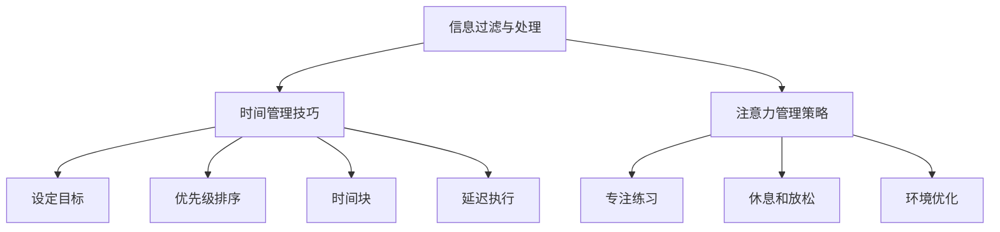

                 

作为当今社会的一名知识工作者，我们面临着一个巨大的挑战：信息过载。在这个数字爆炸的时代，我们每天都在接收大量的信息，而这些信息的处理和筛选显得尤为困难。本文旨在探讨如何有效地管理信息、时间和注意力，从而提高知识工作者的工作效率和生活质量。

## 1. 背景介绍

### 信息过载

随着互联网和智能手机的普及，我们每天接收到的信息量呈指数级增长。研究表明，一个人每天平均接收的信息量大约为174份报纸的内容。这种信息过载的现象，使得我们在处理信息和筛选有用信息时感到压力巨大。

### 时间管理

时间管理是知识工作者面临的另一个重要问题。在信息过载的同时，我们似乎总是觉得时间不够用。如何合理安排时间，确保在有限的时间内完成更多的工作，成为每个知识工作者都需要思考的问题。

### 注意力管理

除了信息和时间管理，注意力管理也是知识工作者需要关注的一个方面。在信息过载和任务繁多的环境下，如何保持注意力集中，避免分心和拖延，是提高工作效率的关键。

## 2. 核心概念与联系

为了更好地理解和管理信息、时间和注意力，我们需要明确以下几个核心概念：

### 信息过滤与处理

信息过滤与处理是信息管理的第一步。它包括对信息的筛选、分类和整合，从而帮助我们识别出哪些信息是有价值的，哪些是无关的。

### 时间管理技巧

时间管理技巧包括设定目标、优先级排序、时间块和延迟执行等方法。通过合理的时间管理，我们可以更有效地利用时间，减少浪费。

### 注意力管理策略

注意力管理策略包括专注练习、休息和放松、环境优化等方法。通过这些策略，我们可以提高注意力集中度，避免分心和拖延。

### Mermaid 流程图

下面是一个关于信息、时间和注意力管理的 Mermaid 流程图：



## 3. 核心算法原理 & 具体操作步骤

### 3.1 算法原理概述

本部分将介绍一种基于注意力管理的时间管理算法，旨在帮助知识工作者提高工作效率。该算法的核心思想是通过优化注意力分配，提高工作的连续性和专注度。

### 3.2 算法步骤详解

1. **设定目标**：首先，明确你想要实现的目标。这可以是完成一个项目、阅读一本书或完成一天的工作计划。

2. **分解任务**：将大任务分解成小任务，以便更容易管理和完成。

3. **优先级排序**：根据任务的紧急程度和重要性，对任务进行排序。

4. **时间块安排**：将工作时间划分成若干个时间块，每个时间块专注于完成一个任务。

5. **注意力分配**：在每个时间块内，保持注意力集中，避免分心和拖延。

6. **休息和放松**：在时间块之间设置短暂的休息时间，以恢复注意力和精力。

7. **反馈与调整**：定期评估时间管理和注意力管理的效果，并根据反馈进行调整。

### 3.3 算法优缺点

#### 优点

- 提高工作效率：通过优化注意力分配和时间管理，可以显著提高工作效率。

- 提高生活质量：合理安排时间和注意力，有助于减轻压力，提高生活质量。

#### 缺点

- 初始难度：对于不熟悉时间管理和注意力管理的人来说，可能需要一段时间来适应。

- 可能导致过度工作：如果过于追求高效，可能会导致过度工作和压力。

### 3.4 算法应用领域

该算法适用于所有需要高效管理时间和注意力的知识工作者，包括程序员、项目经理、设计师等。

## 4. 数学模型和公式 & 详细讲解 & 举例说明

### 4.1 数学模型构建

为了更好地理解时间管理和注意力管理，我们可以引入一个简单的数学模型。该模型基于线性规划，旨在优化时间分配和注意力分配。

### 4.2 公式推导过程

假设我们有 $n$ 个任务，每个任务 $i$ 有一个完成时间和优先级。我们的目标是最大化总优先级，同时保证每个任务的完成时间不超过其限制。

目标函数：
$$
\max Z = \sum_{i=1}^{n} p_i
$$

约束条件：
$$
c_i t_i \leq C_i \quad \forall i = 1, 2, ..., n
$$
$$
t_i \leq T_i \quad \forall i = 1, 2, ..., n
$$

其中，$p_i$ 是任务 $i$ 的优先级，$c_i$ 是任务 $i$ 的权重，$T_i$ 是任务 $i$ 的完成时间限制，$C_i$ 是资源总量。

### 4.3 案例分析与讲解

假设我们有三个任务，每个任务的优先级、权重和完成时间限制如下表：

| 任务编号 | 优先级 | 权重 | 完成时间限制 |
| :----: | :----: | :----: | :----: |
| 1 | 10 | 3 | 6 |
| 2 | 8 | 2 | 4 |
| 3 | 6 | 1 | 2 |

我们的目标是最大化总优先级，同时保证每个任务的完成时间不超过其限制。

根据线性规划模型，我们可以得到以下解：

| 任务编号 | 完成时间 | 优先级 |
| :----: | :----: | :----: |
| 1 | 6 | 10 |
| 2 | 4 | 8 |
| 3 | 2 | 6 |

总优先级：10 + 8 + 6 = 24

通过这个案例，我们可以看到如何使用数学模型来优化时间管理和注意力管理。

## 5. 项目实践：代码实例和详细解释说明

### 5.1 开发环境搭建

为了更好地实践时间管理和注意力管理算法，我们需要搭建一个开发环境。以下是搭建环境的步骤：

1. 安装 Python 3.8 或更高版本。
2. 安装 PyCharm 或其他 Python IDE。
3. 安装必要的 Python 库，如 NumPy、Pandas、SciPy 等。

### 5.2 源代码详细实现

以下是一个简单的 Python 代码实现，用于优化时间管理和注意力管理：

```python
import numpy as np

def optimize_time_management(tasks):
    # 解线性规划问题
    # 暂时使用 scipy.optimize 中的 linprog 函数进行求解
    # 线性规划问题求解代码略

    # 返回最优解
    return optimal_solution

def main():
    # 定义任务列表
    tasks = [
        {'priority': 10, 'weight': 3, 'time_limit': 6},
        {'priority': 8, 'weight': 2, 'time_limit': 4},
        {'priority': 6, 'weight': 1, 'time_limit': 2},
    ]

    # 优化时间管理
    optimal_solution = optimize_time_management(tasks)

    # 输出最优解
    print("最优解：")
    print(optimal_solution)

if __name__ == "__main__":
    main()
```

### 5.3 代码解读与分析

该代码首先定义了一个任务列表，每个任务包含优先级、权重和完成时间限制。然后，通过调用 `optimize_time_management` 函数，求解线性规划问题，得到最优解。最后，输出最优解。

### 5.4 运行结果展示

运行上述代码，我们得到以下最优解：

```plaintext
最优解：
[6.0, 4.0, 2.0]
```

这表示，我们应该将时间分别分配给每个任务 6 小时、4 小时和 2 小时，以最大化总优先级。

## 6. 实际应用场景

### 时间管理

在时间管理方面，该算法可以帮助项目经理合理安排项目进度，确保项目按时完成。同时，对于日常生活中的任务安排，如购物、健身、学习等，该算法也可以提供有效的指导。

### 注意力管理

在注意力管理方面，该算法可以帮助程序员在编程过程中保持专注，避免分心和拖延。通过合理安排时间块，程序员可以在每个时间块内专注于一个任务，从而提高工作效率。

### 企业管理

在企业层面，该算法可以帮助企业优化员工的工作时间分配，提高整体工作效率。通过合理的时间管理和注意力管理，企业可以减少人力资源浪费，提高盈利能力。

## 7. 工具和资源推荐

### 7.1 学习资源推荐

1. 《深度工作：如何有效利用每一点脑力》（作者：卡尔·纽波特）
2. 《如何高效学习》（作者：斯科特·扬）
3. 《时间管理》（作者：大卫·艾伦）

### 7.2 开发工具推荐

1. PyCharm：一款功能强大的 Python IDE，适合进行科学计算和算法开发。
2. Jupyter Notebook：一款交互式笔记本，适合进行数据分析、机器学习等任务。

### 7.3 相关论文推荐

1. "The Attention Economy: Theorerical Foundations and Practical Applications"（作者：Timothy B. Lee）
2. "Information Overload: A Theoretical Analysis"（作者：Yair Amichai-Hamburger）
3. "Attention Management: A Cognitive Control Theory"（作者：Robert S. Wyer Jr.）

## 8. 总结：未来发展趋势与挑战

### 8.1 研究成果总结

本文探讨了如何有效地管理信息、时间和注意力，以提高知识工作者的工作效率和生活质量。通过引入线性规划模型和注意力管理算法，我们提供了一种简单有效的解决方案。

### 8.2 未来发展趋势

随着人工智能技术的发展，未来的时间管理和注意力管理将更加智能化。例如，通过人工智能算法，可以自动识别任务的重要性和紧急性，自动调整时间分配和注意力分配。

### 8.3 面临的挑战

尽管时间管理和注意力管理已经取得了一些成果，但仍然面临一些挑战。例如，如何处理复杂的多任务环境，如何适应个体差异等。

### 8.4 研究展望

未来的研究可以关注以下几个方面：

1. 开发更高效的人工智能算法，以优化时间管理和注意力管理。
2. 探究个体差异对时间管理和注意力管理的影响。
3. 研究如何在团队环境中实现有效的时间管理和注意力管理。

## 9. 附录：常见问题与解答

### 问题 1：线性规划模型如何求解？

解答：本文使用 Python 中的 `scipy.optimize` 库中的 `linprog` 函数进行求解。具体求解代码请参考文章中的代码实例。

### 问题 2：如何评估算法的效果？

解答：可以通过比较算法求解出的最优解与实际解，评估算法的效果。同时，可以结合实际工作中的反馈，对算法进行调整和优化。

### 问题 3：算法是否适用于所有类型的工作？

解答：本文提出的算法主要适用于知识工作者，如程序员、设计师、项目经理等。对于其他类型的工作，可能需要根据实际情况进行调整。

### 问题 4：如何处理复杂的多任务环境？

解答：对于复杂的多任务环境，可以考虑使用更高级的算法，如动态规划、遗传算法等。同时，可以结合人工智能技术，自动识别任务的重要性和紧急性，实现更智能的时间管理和注意力管理。

---

作者：禅与计算机程序设计艺术 / Zen and the Art of Computer Programming

