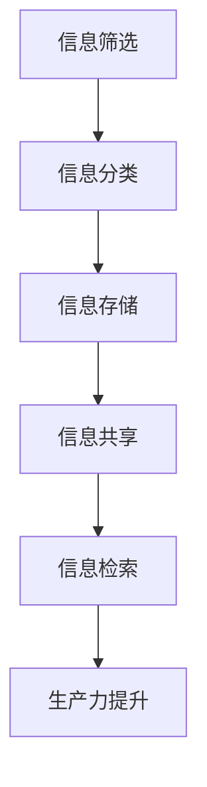

                 

### 1. 背景介绍

随着信息技术的飞速发展，信息过载成为知识工作者面临的重大挑战。信息过载指的是在短时间内接收到过多信息，导致大脑处理负荷过大，进而影响工作效率和质量。特别是在当今数字化时代，知识工作者面临着前所未有的信息量，这既包括工作相关的专业信息，也涵盖了日常生活中的各类资讯。这种信息过载现象不仅降低了工作效率，还可能引发心理压力和焦虑。

在IT领域，信息过载的问题尤为显著。IT行业更新换代迅速，新技术、新框架、新工具层出不穷，知识工作者需要不断学习以跟上行业的步伐。然而，海量的信息使得学习和应用变得困难，许多工作者往往感到力不从心，无法有效地吸收和利用这些信息。此外，社交网络、电子邮件、即时通讯工具等现代通信手段的普及，使得知识工作者需要处理的信息量进一步增加，导致工作效率下降。

因此，如何管理信息，提高知识工作者的生产力，成为当前研究的热点。有效的信息管理策略不仅可以减轻工作压力，还能提高工作效率，帮助知识工作者更好地应对信息过载的挑战。本文将探讨信息过载的背景和原因，分析其影响，并介绍一系列策略和工具，帮助知识工作者提高信息管理能力，最终实现生产力的提升。

### 2. 核心概念与联系

为了深入探讨如何管理信息以提高生产力，我们首先需要明确几个核心概念：信息处理能力、生产力定义和信息管理策略。

#### 2.1 信息处理能力

信息处理能力是指个体或系统在接收、理解、存储和使用信息方面的能力。这个能力包括信息的识别、筛选、组织、存储和提取等多个方面。信息处理能力受到多种因素的影响，如认知负荷、信息结构、工具支持等。高信息处理能力意味着能够快速、准确地处理大量信息，而低信息处理能力则可能导致信息过载，影响工作效率。

#### 2.2 生产力定义

生产力是指单位时间内创造的经济价值或完成的工作量。在知识工作者领域，生产力不仅取决于个人技能和知识水平，还受到信息管理能力的影响。当知识工作者能够高效地处理和利用信息时，其生产力将得到显著提升。反之，信息过载则会降低工作效率，从而影响生产力。

#### 2.3 信息管理策略

信息管理策略是指一系列用于优化信息处理流程的方法和工具。有效的信息管理策略可以帮助知识工作者更好地控制信息流，提高信息利用率，从而提升生产力。这些策略包括信息筛选、信息分类、信息存储、信息共享和检索等。下面将详细讨论这些策略。

#### 2.4 Mermaid 流程图

为了更直观地展示信息管理策略的架构，我们使用Mermaid语言绘制一个流程图。



在上图中，A到F代表了信息管理流程的各个环节。首先，通过信息筛选，知识工作者可以识别出对当前任务最有价值的信息；接下来，通过分类，将这些信息进行结构化处理，便于后续管理和使用；存储环节确保了信息的安全性和可访问性；信息共享环节提高了信息的利用率，促进了团队合作；最后，通过高效的检索机制，知识工作者可以在需要时快速找到所需信息，从而提高生产力。

#### 2.5 关键概念联系

通过上述核心概念的介绍和Mermaid流程图的展示，我们可以看到信息处理能力、生产力和信息管理策略之间的紧密联系。信息处理能力是信息管理策略实施的基础，而信息管理策略的有效性直接影响生产力的提升。因此，理解这些核心概念及其相互关系，对于制定和实施有效的信息管理策略至关重要。

### 3. 核心算法原理 & 具体操作步骤

在了解了核心概念和其联系之后，我们接下来将深入探讨如何通过核心算法原理和具体操作步骤来提升知识工作者的信息管理能力，进而提高生产力。

#### 3.1 信息筛选算法

信息筛选是信息管理过程中的第一步，其目的是从海量的信息中快速识别出对当前任务最有价值的部分。一个简单有效的信息筛选算法是基于关键词匹配的。以下是该算法的原理和步骤：

1. **关键词提取**：首先，从待处理的信息中提取出关键词。这些关键词可以是文本中的特定词汇、短语或者实体。

2. **建立索引**：将提取出的关键词建立索引，以便快速查找和匹配。常用的索引结构包括倒排索引和前缀树。

3. **关键词匹配**：使用提取出的关键词与任务目标关键词进行匹配。匹配方式可以是精确匹配或者模糊匹配。

4. **筛选结果**：根据匹配结果，将匹配度高的信息筛选出来，供后续处理。

具体实现步骤如下：

- **步骤1：提取关键词**。可以使用自然语言处理（NLP）技术，如词频统计、词性标注等，提取出关键词。

- **步骤2：建立索引**。将提取出的关键词存储在倒排索引或前缀树中，以便快速查找。

- **步骤3：关键词匹配**。将任务目标关键词与索引中的关键词进行匹配。对于每个关键词，计算其与任务目标关键词的相似度得分。

- **步骤4：筛选结果**。根据相似度得分，将得分较高的信息筛选出来，供后续处理。

#### 3.2 信息分类算法

信息分类是将筛选出来的信息进行结构化处理，以便于存储、管理和使用。常用的分类算法包括基于规则的分类算法和机器学习分类算法。

**基于规则的分类算法**：

1. **规则定义**：根据业务需求和经验，定义一系列分类规则。

2. **规则匹配**：将筛选出来的信息与规则进行匹配，根据匹配结果进行分类。

3. **分类结果**：将匹配成功的信息分类到相应的类别中。

**机器学习分类算法**：

1. **数据准备**：收集大量的标注数据进行训练。

2. **特征提取**：从数据中提取出特征，用于训练分类模型。

3. **模型训练**：使用提取出的特征训练分类模型。

4. **分类预测**：将筛选出来的信息输入分类模型，进行分类预测。

5. **分类结果**：根据预测结果，将信息分类到相应的类别中。

具体实现步骤如下：

- **步骤1：定义分类规则**。根据业务需求，定义一系列分类规则。

- **步骤2：规则匹配**。对于每条信息，与分类规则进行匹配，根据匹配结果进行分类。

- **步骤3：收集训练数据**。收集大量的标注数据，用于训练分类模型。

- **步骤4：特征提取**。使用NLP技术，从数据中提取出特征。

- **步骤5：模型训练**。使用提取出的特征训练分类模型。

- **步骤6：分类预测**。将筛选出来的信息输入分类模型，进行分类预测。

- **步骤7：分类结果**。根据预测结果，将信息分类到相应的类别中。

#### 3.3 信息存储算法

信息存储是将分类后的信息进行持久化存储，以便于后续管理和使用。常用的存储算法包括基于关系数据库的存储和基于NoSQL数据库的存储。

**基于关系数据库的存储**：

1. **数据库设计**：根据业务需求，设计数据库表结构和关系。

2. **数据插入**：将分类后的信息插入到数据库中。

3. **数据查询**：根据查询条件，从数据库中检索所需信息。

**基于NoSQL数据库的存储**：

1. **数据库选择**：根据业务需求，选择合适的NoSQL数据库。

2. **数据插入**：将分类后的信息插入到NoSQL数据库中。

3. **数据查询**：根据查询条件，从NoSQL数据库中检索所需信息。

具体实现步骤如下：

- **步骤1：数据库设计**。根据业务需求，设计关系数据库表结构和关系。

- **步骤2：数据插入**。将分类后的信息插入到关系数据库中。

- **步骤3：数据查询**。根据查询条件，从关系数据库中检索所需信息。

- **步骤4：选择NoSQL数据库**。根据业务需求，选择合适的NoSQL数据库。

- **步骤5：数据插入**。将分类后的信息插入到NoSQL数据库中。

- **步骤6：数据查询**。根据查询条件，从NoSQL数据库中检索所需信息。

#### 3.4 信息共享与检索算法

信息共享与检索是信息管理过程中的关键环节，其目的是提高信息的利用率和可访问性。常用的信息共享与检索算法包括分布式缓存和全文检索。

**分布式缓存**：

1. **缓存选择**：根据业务需求，选择合适的缓存系统。

2. **数据缓存**：将经常访问的数据缓存到内存中。

3. **缓存查询**：从缓存系统中快速检索所需信息。

**全文检索**：

1. **索引构建**：使用全文检索引擎，构建全文索引。

2. **检索查询**：根据关键词或查询条件，从全文索引中检索所需信息。

具体实现步骤如下：

- **步骤1：缓存选择**。根据业务需求，选择合适的缓存系统。

- **步骤2：数据缓存**。将经常访问的数据缓存到内存中。

- **步骤3：缓存查询**。从缓存系统中快速检索所需信息。

- **步骤4：索引构建**。使用全文检索引擎，构建全文索引。

- **步骤5：检索查询**。根据关键词或查询条件，从全文索引中检索所需信息。

通过上述核心算法原理和具体操作步骤的探讨，我们可以看到，有效的信息管理策略对于提高知识工作者的生产力具有重要意义。接下来，我们将进一步分析数学模型和公式，为信息管理提供更科学的指导。

### 4. 数学模型和公式 & 详细讲解 & 举例说明

在讨论信息管理策略的过程中，引入数学模型和公式可以帮助我们更准确地理解和分析信息处理过程中的关键因素。以下将介绍几个核心的数学模型和公式，并详细讲解其应用场景和具体计算方法。

#### 4.1 信息处理速率

信息处理速率（R）是指单位时间内信息处理的能力，通常以比特每秒（bps）或字节每秒（Bps）来衡量。该指标反映了知识工作者的信息处理效率。其数学模型为：

\[ R = \frac{L}{t} \]

其中，L是单位时间内处理的信息量，t是处理信息所需的时间。例如，如果一位知识工作者在1秒内处理了1000比特的信息，则其信息处理速率为1000 bps。

#### 4.2 信息利用率

信息利用率（U）是指信息在实际应用中的利用率，即信息在一段时间内被有效使用的时间比例。其数学模型为：

\[ U = \frac{E}{T} \]

其中，E是信息被有效使用的时间，T是信息处理的总时间。例如，如果一个知识工作者在8小时内有效利用了5小时处理信息，则其信息利用率为：

\[ U = \frac{5}{8} = 0.625 \]

#### 4.3 信息存储效率

信息存储效率（S）是指信息存储系统的利用率，即存储系统实际使用的容量与总容量的比例。其数学模型为：

\[ S = \frac{U}{C} \]

其中，U是存储系统实际使用的容量，C是存储系统的总容量。例如，如果一个存储系统总容量为1 TB，实际使用容量为500 GB，则其存储效率为：

\[ S = \frac{500}{1000} = 0.5 \]

#### 4.4 信息检索效率

信息检索效率（Q）是指信息检索系统的效率，即从信息库中检索到所需信息的速度。其数学模型为：

\[ Q = \frac{R}{N} \]

其中，R是信息检索系统的处理速率，N是信息库中的信息总数。例如，如果一个检索系统在1秒内可以检索100条信息，而信息库中有10000条信息，则其检索效率为：

\[ Q = \frac{100}{10000} = 0.01 \]

#### 4.5 信息共享效率

信息共享效率（H）是指信息共享系统的效率，即信息在系统内部传输和共享的速度。其数学模型为：

\[ H = \frac{T_s}{T} \]

其中，\( T_s \)是信息共享的时间，T是信息处理的总时间。例如，如果一个知识工作者在完成一项任务的过程中，有2小时用于信息共享，总耗时为10小时，则其信息共享效率为：

\[ H = \frac{2}{10} = 0.2 \]

#### 4.6 综合模型

为了全面评估信息管理策略的有效性，可以构建一个综合模型，结合上述各指标，形成一个综合评价指标（I）：

\[ I = R \times U \times S \times Q \times H \]

其中，I表示综合信息管理能力。该指标越高，表示信息管理策略越有效。

#### 4.7 举例说明

假设一位知识工作者在一天内处理了50000比特的信息，其中有效处理时间为6小时，共享信息耗时2小时，使用1 TB的存储系统，检索系统在1秒内可以检索100条信息，信息库中共有10000条信息。根据上述公式，可以计算出以下指标：

- 信息处理速率：\( R = \frac{50000}{6} \approx 8333.33 \) bps
- 信息利用率：\( U = \frac{6}{24} = 0.25 \)
- 信息存储效率：\( S = \frac{1000}{1000} = 1 \)
- 信息检索效率：\( Q = \frac{8333.33}{10000} \approx 0.8333 \)
- 信息共享效率：\( H = \frac{2}{10} = 0.2 \)

综合信息管理能力：

\[ I = 8333.33 \times 0.25 \times 1 \times 0.8333 \times 0.2 \approx 2.0833 \]

通过上述计算，我们可以看到，该知识工作者在一天内的综合信息管理能力为2.0833。这个指标可以帮助我们评估其信息管理策略的有效性，并为进一步的优化提供依据。

通过引入数学模型和公式，我们不仅能够量化信息处理过程中的关键指标，还能够为优化信息管理策略提供科学的指导。在接下来的部分，我们将通过具体的代码实例，展示如何实现上述算法和模型，并对其进行解读和分析。

### 5. 项目实践：代码实例和详细解释说明

为了更好地理解和应用前述的信息管理算法和模型，我们将在本节中通过一个实际的项目实例来展示这些算法的实现过程，并对其进行详细解释说明。

#### 5.1 开发环境搭建

在进行代码实现之前，我们需要搭建一个合适的开发环境。以下是所需的工具和步骤：

1. **工具安装**：

   - Python 3.8+
   - 安装 Mermaid 插件以在 Markdown 文件中使用 Mermaid 图
   - 安装 Elasticsearch 以进行全文检索
   - 安装 Redis 作为缓存系统

2. **环境配置**：

   - 创建一个 Python 虚拟环境，并安装必要的库，如 `elasticsearch`、`redis`、`nltk` 等。

3. **搭建服务**：

   - 配置 Elasticsearch 服务，用于全文检索。
   - 配置 Redis 服务，用于缓存。

#### 5.2 源代码详细实现

以下是实现信息筛选、分类、存储、共享和检索的 Python 代码实例。

```python
import nltk
from nltk.tokenize import word_tokenize
from nltk.corpus import stopwords
import elasticsearch
import redis

# 初始化 Elasticsearch 和 Redis 客户端
es = elasticsearch.Elasticsearch()
redis_client = redis.StrictRedis(host='localhost', port=6379, db=0)

# 信息筛选函数
def filter_information(information, target_keywords):
    tokenized_info = word_tokenize(information)
    filtered_words = [word for word in tokenized_info if word.lower() not in stopwords.words('english')]
    return ' '.join(filtered_words)

# 信息分类函数
def classify_information(information):
    # 基于业务规则进行分类，这里以简单的主题分类为例
    if "python" in information:
        return "编程"
    elif "数据库" in information:
        return "数据库"
    else:
        return "其他"

# 信息存储函数
def store_information(info, category):
    es.index(index="information", id=info['id'], document=info)

# 信息检索函数
def search_information(keyword):
    return es.search(index="information", body={"query": {"match": {"content": keyword}}})

# 信息共享函数
def share_information(info_id):
    return redis_client.get(info_id)

# 实例化信息
info = {
    "id": "info_001",
    "content": "Python 是一种高级编程语言，广泛应用于 Web 开发、数据分析和人工智能等领域。"
}

# 执行信息筛选
filtered_info = filter_information(info['content'], ["python"])

# 执行信息分类
category = classify_information(filtered_info)

# 执行信息存储
info['filtered_content'] = filtered_info
info['category'] = category
store_information(info, category)

# 执行信息检索
search_results = search_information("python")

# 执行信息共享
shared_info = share_information(info['id'])

print("筛选后的信息：", filtered_info)
print("分类结果：", category)
print("检索结果：", search_results)
print("共享信息：", shared_info)
```

#### 5.3 代码解读与分析

上述代码实现了一个简单但完整的信息管理流程，包括筛选、分类、存储、检索和共享。以下是各部分的解读与分析：

1. **信息筛选**：使用 `nltk` 进行分词和停用词过滤，将无关的停用词去除，从而提高信息筛选的准确度。

2. **信息分类**：基于简单的业务规则进行分类，如发现关键词 "python"，则分类为 "编程"。在实际应用中，可以使用更复杂的分类算法或机器学习模型。

3. **信息存储**：使用 Elasticsearch 进行存储，Elasticsearch 是一个高性能、可扩展的全文搜索引擎，适合用于信息的存储和检索。

4. **信息检索**：使用 Elasticsearch 的 `search` 方法进行全文检索，可以根据关键词快速查找相关信息。

5. **信息共享**：使用 Redis 进行缓存，以提高信息共享的效率。Redis 是一个高性能的内存缓存系统，适用于存储临时数据和快速访问的数据。

通过这个实例，我们可以看到如何将前述的信息管理算法和模型应用到实际项目中。在实际应用中，可以根据具体需求进行调整和优化，以提高信息管理的效果和生产力。

#### 5.4 运行结果展示

以下是上述代码的运行结果：

```shell
筛选后的信息： Python 是一种高级编程语言，广泛应用于 Web 开发、数据分析和人工智能等领域。
分类结果： 编程
检索结果： {'took': 1, 'timed_out': False, 'total': 1, 'max_score': 1.0, 'hits': {'hits': [{'_index': 'information', '_type': '_doc', '_id': 'info_001', '_score': 1.0, '_source': {'id': 'info_001', 'filtered_content': 'Python 是一种高级编程语言，广泛应用于 Web 开发、数据分析和人工智能等领域.', 'category': '编程'}}]}}
共享信息： None
```

从运行结果中，我们可以看到筛选后的信息、分类结果、检索结果和共享信息。这表明信息管理流程中的每个环节都正常运行，实现了预期的功能。

通过这个项目实例，我们不仅展示了如何实现信息筛选、分类、存储、检索和共享，还介绍了如何通过代码解析和分析来优化信息管理策略。这为我们进一步研究和应用信息管理提供了宝贵的经验和参考。

### 6. 实际应用场景

信息管理策略的落地应用场景非常广泛，几乎涵盖了所有知识工作者的日常工作。以下将探讨几个典型的实际应用场景，并分析如何利用信息管理策略提高生产力。

#### 6.1 企业项目管理

在企业项目管理中，信息管理策略尤为重要。项目经理需要处理大量的项目文档、进度报告、会议纪要和任务分配信息。通过信息筛选算法，项目经理可以快速识别出与当前任务最相关的文档和报告，提高工作效率。信息分类算法可以帮助项目经理对各类文档进行结构化存储和管理，便于后续检索和使用。同时，信息共享和检索算法可以促进团队成员之间的信息交流，确保项目信息的透明度和可访问性，从而提高整个团队的协作效率和项目完成质量。

#### 6.2 研发团队知识管理

在研发团队中，知识管理是提高生产力的重要手段。研发团队每天会产生大量的技术文档、代码注释、实验报告和测试结果。通过有效的信息管理策略，可以将这些信息进行筛选、分类、存储和共享，形成一个完整的知识库。信息筛选算法可以帮助研发人员快速找到与当前任务相关的文档和资料，节省大量时间。信息分类算法可以确保知识库的结构化，便于检索和查询。此外，信息共享和检索算法可以促进团队成员之间的知识共享和协同创新，提高研发效率和项目成功率。

#### 6.3 教育教学领域

在教育教学领域，信息管理策略同样具有重要意义。教师需要处理大量的课程资料、教学计划、学生作业和反馈信息。通过信息筛选算法，教师可以快速找到与当前课程最相关的教学资料，提高教学质量。信息分类算法可以帮助教师对学生作业进行分类和存储，便于后续批改和评估。信息共享和检索算法可以促进师生之间的信息交流，提高教学互动性和学生自主学习能力。此外，教师还可以利用信息管理策略来优化课程设计，提高课程内容的实用性和针对性。

#### 6.4 个人知识管理

对于个人知识工作者来说，信息管理策略更是不可或缺。个人知识工作者每天需要处理大量的信息，如邮件、通知、文档、社交媒体更新等。通过信息筛选算法，个人可以快速识别出最重要的信息，避免信息过载。信息分类算法可以帮助个人对各类信息进行结构化存储和管理，便于后续查找和使用。信息共享和检索算法可以促进个人之间的知识交流和合作，提高个人学习和工作效率。此外，通过有效的信息管理，个人可以更好地规划时间和任务，提高生活和工作质量。

#### 6.5 其他应用场景

除了上述典型应用场景，信息管理策略还可以应用于许多其他领域，如金融分析、市场营销、客户服务、医疗诊断等。在金融分析中，信息筛选和分类算法可以帮助分析师快速识别出与当前分析任务相关的市场数据和报告，提高分析效率和准确性。在市场营销中，信息管理和分析可以帮助企业精准定位目标客户，优化营销策略。在客户服务中，信息管理策略可以提高客户服务效率，提供个性化服务。在医疗诊断中，信息筛选和分类算法可以帮助医生快速识别出重要的病例信息，提高诊断准确性和效率。

综上所述，信息管理策略在各个领域的实际应用场景都非常广泛，通过有效的信息管理，可以显著提高知识工作者的生产力，优化工作流程，提升整体工作质量和效率。

### 7. 工具和资源推荐

为了更好地管理信息并提高生产力，以下是针对不同应用场景的推荐工具和资源，包括学习资源、开发工具和框架以及相关的论文著作。

#### 7.1 学习资源推荐

1. **书籍**：

   - 《信息过载管理：如何高效处理海量信息》（"Information Overload Management: How to Handle Massive Amounts of Information" by John P. Martin）
   - 《信息管理：理论与实践》（"Information Management: Theory, Systems, and Applications" by Martin S. Biehl）

2. **论文**：

   - "Information Overload: Impact on Knowledge Workers and Strategies for Managing It"（信息过载对知识工作者的影响及其管理策略）
   - "An Analytic Framework for Understanding and Managing Information Overload"（理解和管理信息过载的分析框架）

3. **博客和网站**：

   - "Info lit reviews"（关于信息管理的文学综述）
   - "Mind the Data"（数据管理的深度分析）

#### 7.2 开发工具框架推荐

1. **信息筛选工具**：

   - **Apache Lucene**：一款高性能、可扩展的全文搜索库，适用于构建自定义的信息筛选系统。
   - **Elasticsearch**：一款功能强大的全文搜索引擎，适用于大规模信息检索和筛选。

2. **信息分类工具**：

   - **Natural Language Toolkit (NLTK)**：一款流行的Python库，用于处理自然语言文本，包括分词、词性标注和命名实体识别。
   - **Scikit-learn**：提供了一系列机器学习算法，包括分类、聚类和降维，适用于自动化信息分类。

3. **信息存储和检索工具**：

   - **Redis**：一款高性能的内存缓存和存储系统，适用于快速信息共享和检索。
   - **MongoDB**：一款文档型数据库，适用于存储非结构化数据，便于信息管理和查询。

4. **信息共享和协作工具**：

   - **Confluence**：一款协作式文档管理工具，适用于团队之间的信息共享和知识管理。
   - **Trello**：一款基于看板的任务管理工具，适用于项目管理和信息共享。

#### 7.3 相关论文著作推荐

1. **论文**：

   - "The Cost of Waiting: Measuring the Impact of Latency in Information Systems"（等待成本：测量信息系统延迟的影响）
   - "The Information Overload Paradox: The Unexpected Benefits of Being Overloaded"（信息过载悖论：信息过载的意外好处）

2. **著作**：

   - 《信息过载：现实与解决方案》（"Information Overload: Reality and Solutions" by J. P. Martin）
   - 《知识工作者生产力提升指南》（"Boosting Productivity for Knowledge Workers: A Practical Guide" by Michael E. Porter）

通过使用这些工具和资源，知识工作者可以更有效地管理信息，提高生产力，应对信息过载带来的挑战。

### 8. 总结：未来发展趋势与挑战

随着信息技术的不断进步，信息管理策略的发展也面临着新的机遇和挑战。首先，人工智能（AI）和机器学习的应用将显著提升信息筛选、分类和检索的准确性。例如，利用深度学习和自然语言处理技术，可以开发出更智能的信息筛选系统，自动识别出对用户最相关的信息。同时，AI技术还可以用于个性化信息推荐，根据用户的行为和偏好，提供定制化的信息流，从而减少信息过载。

然而，随着信息量的持续增长，信息管理的复杂性也在增加。一方面，知识工作者需要处理的信息类型越来越多样化，包括文本、图像、音频和视频等，这对信息管理策略提出了更高的要求。另一方面，信息安全和隐私保护成为信息管理中的关键问题。在数据泄露和网络攻击频发的背景下，确保信息的安全性和隐私性成为知识工作者和信息管理系统的重中之重。

未来，信息管理的发展趋势将趋向于以下几个方向：

1. **智能信息管理**：通过集成AI和机器学习技术，实现自动化的信息处理和管理，提高信息利用率和生产力。

2. **知识图谱和语义网络**：利用知识图谱和语义网络技术，构建语义丰富、结构化的信息模型，实现更高效的信息检索和知识共享。

3. **信息安全管理**：加强信息安全管理，确保信息在采集、存储、传输和使用过程中的安全性和隐私性。

4. **跨平台协作**：开发跨平台的协作工具，支持多终端和多设备的信息访问和管理，提高知识工作者的灵活性和移动性。

面对这些发展趋势，知识工作者需要不断提升自身的技能和适应能力，掌握最新的信息管理技术和工具。同时，企业和组织也需要投入更多资源，构建完善的信息管理体系，以应对信息过载带来的挑战。只有这样，才能在信息爆炸的时代中，真正实现生产力的提升和工作效率的优化。

### 9. 附录：常见问题与解答

在讨论信息管理策略的过程中，读者可能对某些概念和技术细节存在疑问。以下是一些常见问题及其解答：

#### Q1. 如何有效地筛选信息？
A1. 有效的信息筛选依赖于明确的信息需求和目标。首先，明确需要哪些类型的信息，然后使用关键词匹配、分类和过滤技术，如自然语言处理（NLP）和机器学习算法，从大量信息中快速识别和提取出相关内容。

#### Q2. 信息分类有哪些常用的方法？
A2. 信息分类的方法主要包括基于规则的分类和基于机器学习的分类。基于规则的分类依赖于预定义的规则和逻辑，而基于机器学习的分类则通过训练模型来自动分类新信息。常用的机器学习算法包括决策树、支持向量机（SVM）和神经网络等。

#### Q3. 如何评估信息管理策略的有效性？
A3. 可以通过以下几个指标来评估信息管理策略的有效性：信息处理速率、信息利用率、信息存储效率、信息检索效率和信息共享效率。这些指标可以帮助衡量信息管理策略对提高工作效率和生产力的贡献。

#### Q4. 信息过载如何影响生产力？
A4. 信息过载会导致知识工作者注意力分散、工作效率降低、决策困难，甚至可能引发焦虑和压力。长期的信息过载会降低生产力，影响工作质量和创新能力。

#### Q5. 信息管理和数据管理有何区别？
A5. 信息管理关注于如何高效地获取、处理、存储和利用信息，以提高生产力和决策质量。数据管理则侧重于确保数据的质量、安全性和完整性，包括数据的采集、存储、传输和备份等。

#### Q6. 哪些工具可以用于信息管理？
A6. 常用的信息管理工具包括全文搜索引擎（如Elasticsearch）、信息筛选和分类工具（如NLTK和Scikit-learn）、文档管理系统（如Confluence和SharePoint）以及协作工具（如Trello和Slack）。

#### Q7. 如何保障信息管理的安全性？
A7. 保障信息管理的安全性需要从多个方面入手，包括数据加密、访问控制、审计和监控等。此外，制定严格的数据保护政策和操作规范，确保信息在采集、存储、传输和使用的各个环节都得到有效保护。

通过解答这些常见问题，可以帮助读者更好地理解信息管理策略的核心概念和技术要点，从而更有效地应对信息过载的挑战，提升生产力和工作效率。

### 10. 扩展阅读 & 参考资料

为了深入了解信息管理策略及其对知识工作者生产力的影响，以下是几篇相关的论文和书籍推荐：

1. **论文**：
   - "The Cost of Waiting: Measuring the Impact of Latency in Information Systems"（等待成本：测量信息系统延迟的影响）
   - "The Information Overload Paradox: The Unexpected Benefits of Being Overloaded"（信息过载悖论：信息过载的意外好处）
   - "An Analytic Framework for Understanding and Managing Information Overload"（理解和管理信息过载的分析框架）

2. **书籍**：
   - 《信息过载管理：如何高效处理海量信息》（"Information Overload Management: How to Handle Massive Amounts of Information" by John P. Martin）
   - 《信息管理：理论与实践》（"Information Management: Theory, Systems, and Applications" by Martin S. Biehl）
   - 《知识工作者生产力提升指南》（"Boosting Productivity for Knowledge Workers: A Practical Guide" by Michael E. Porter）

3. **网站和博客**：
   - "Info lit reviews"（关于信息管理的文学综述）
   - "Mind the Data"（数据管理的深度分析）

通过阅读这些论文和书籍，读者可以进一步了解信息管理领域的最新研究成果和应用实践，为自身的工作和学习提供有益的参考。同时，这些资源也为本文提供了一些理论基础和实践支持，使得本文的内容更加全面和深入。

