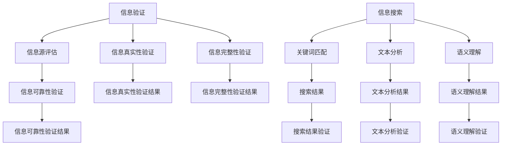

                 

### 背景介绍

#### 信息验证：概念与重要性

在当今信息化社会中，数据量和信息量以惊人的速度增长。这些信息不仅来自于互联网的各个角落，还涵盖了从政府机构、商业组织到个人用户的各种来源。然而，随着信息的爆炸性增长，信息的准确性和可靠性问题也日益凸显。在这个背景下，信息验证成为了一项至关重要的技术。

**信息验证**，是指通过一系列方法和技术，对信息源的可信度、信息的真实性、完整性和准确性进行评估的过程。它不仅仅是一个技术问题，更是关系到信息社会健康发展的重要基石。

首先，信息验证可以帮助我们识别和排除错误、不准确或虚假的信息。在医疗、金融、法律等关键领域，错误的或误导性的信息可能导致严重的后果。例如，医疗信息的错误可能会导致患者的健康受损；金融信息的错误可能会引起市场不稳定；法律信息的错误则可能导致法律纠纷。

其次，信息验证能够提升信息的可信度。在商业环境中，企业的声誉往往依赖于其发布信息的准确性和可信度。通过信息验证，企业可以确保其发布的信息是真实可靠的，从而增强消费者和投资者的信心。

最后，信息验证还能够提升信息处理和检索的效率。在一个充满冗余和错误信息的海洋中，有效的信息验证技术可以帮助我们快速找到有价值的信息，提高工作和生活的效率。

#### 信息搜索：基本原理与挑战

与此同时，**信息搜索**技术也随着互联网和信息化的快速发展而日益重要。信息搜索，是指通过特定的方法和算法，从大量的信息资源中检索出符合用户需求的特定信息的过程。

信息搜索的基本原理主要基于关键词匹配、文本分析、语义理解等技术。简单地说，用户通过输入关键词或查询语句，搜索引擎会根据这些关键词在数据库中检索出相关的信息。然而，随着信息量的爆炸性增长，信息搜索面临着前所未有的挑战。

首先，信息量的大规模增长导致信息检索的效率问题。在一个庞大的数据库中，如何快速、准确地检索出用户所需的信息成为了关键问题。

其次，信息的多样性和复杂性也增加了信息检索的难度。信息不仅包括文本，还涵盖了图像、音频、视频等多种形式。如何对这些不同形式的信息进行有效检索和分析，是信息搜索领域面临的一大挑战。

最后，信息的真实性验证也是信息搜索中的一个重要问题。在互联网上，虚假信息、误导性信息层出不穷，如何确保搜索结果的真实性和准确性，成为了信息搜索领域的重要课题。

#### 结合信息验证与信息搜索的重要性

综上所述，信息验证和信息搜索技术在现代社会中具有不可替代的重要作用。信息验证能够确保信息的真实性和可靠性，提高信息的可信度；而信息搜索则能够帮助我们快速、准确地获取所需的信息，提高工作效率。

因此，本文将围绕信息验证和信息搜索技术展开讨论。首先，我们将介绍信息验证的基本概念、方法和应用场景；然后，深入探讨信息搜索的基本原理和技术；接着，结合具体案例，展示如何将信息验证与信息搜索技术应用于实际场景中；最后，我们将总结这两项技术的关键点，并提出未来发展的趋势和挑战。通过本文的探讨，希望能够为广大读者提供对信息验证和信息搜索技术的全面理解和实践指导。

### 核心概念与联系

#### 信息验证的基本概念

在深入探讨信息验证技术之前，我们需要明确几个核心概念，包括信息的可信度、来源可靠性、信息的真实性和完整性等。

1. **信息的可信度**：信息的可信度是指信息来源的可信程度。在信息验证过程中，我们首先要评估信息源的信誉度、专业性和权威性。例如，来自权威机构、知名专家或经过多次验证的信息源，其可信度通常更高。

2. **来源可靠性**：来源可靠性是指信息来源的真实性和合法性。在信息验证过程中，我们需要确认信息来源是否真实存在，且有权发布相关信息。例如，官方网站、认证的社交媒体账号等，通常具有较高的来源可靠性。

3. **信息的真实性**：信息的真实性是指信息内容与实际情况是否相符。在信息验证过程中，我们需要通过多种手段，如比对证据、验证来源等，确保信息内容的真实性。例如，新闻报道中的事实、研究报告中的数据等，都需要经过严格验证。

4. **信息的完整性**：信息的完整性是指信息是否完整、无遗漏。在信息验证过程中，我们需要检查信息是否被篡改、删除或遗漏。例如，在金融交易中，确保交易记录的完整性和准确性是非常重要的。

#### 信息验证的方法与技术

信息验证涉及多种方法和技术，以下是一些常见的方法：

1. **人工验证**：通过专业人员进行信息审核和验证，这是一种传统的验证方法。人工验证的优势在于能够发现一些自动化工具难以检测的复杂问题，但效率相对较低。

2. **自动化验证**：利用计算机程序和算法对信息进行自动化验证。自动化验证方法包括数据比对、模式识别、机器学习等。自动化验证能够提高验证效率，但需要确保算法的准确性和鲁棒性。

3. **区块链技术**：区块链技术通过去中心化和加密算法，确保信息在传输过程中的完整性和不可篡改性。区块链技术可以用于验证信息的来源和真实性。

4. **数字签名**：数字签名是一种通过加密算法确保信息完整性和真实性的技术。发送方通过私钥对信息进行签名，接收方通过公钥验证签名的有效性。

#### 信息搜索的基本概念

信息搜索技术主要涉及以下基本概念：

1. **搜索引擎**：搜索引擎是一种用于从大量信息资源中检索出用户所需信息的工具。搜索引擎通常基于关键词匹配、文本分析、语义理解等技术工作。

2. **关键词匹配**：关键词匹配是最简单也是最常用的信息搜索方法。用户输入关键词，搜索引擎根据关键词在数据库中的匹配结果，返回相关的信息。

3. **文本分析**：文本分析是一种通过分析文本的语法、语义、结构等信息，实现对文本内容的理解和处理的方法。文本分析可以用于提高搜索的准确性和相关性。

4. **语义理解**：语义理解是更高层次的信息搜索技术，它通过理解用户的查询意图和上下文，提供更加精准的搜索结果。语义理解通常依赖于自然语言处理（NLP）技术。

#### 信息验证与信息搜索的联系

信息验证和信息搜索是相互关联且互为补充的。信息验证确保了搜索结果的真实性和可靠性，而信息搜索则为信息验证提供了广泛的数据来源。

1. **信息验证对信息搜索的影响**：通过信息验证，可以确保搜索结果中的信息是真实可靠的，从而提高搜索的准确性和用户信任度。

2. **信息搜索对信息验证的支持**：信息搜索技术可以帮助我们快速获取大量的信息，为信息验证提供更多的数据来源。同时，信息搜索的结果可以为信息验证提供参考，帮助判断信息的可信度。

3. **整合信息验证与信息搜索**：在实际应用中，可以将信息验证与信息搜索技术整合，形成一个更加智能和高效的系统。例如，在搜索引擎中集成信息验证模块，可以确保搜索结果的真实性和可靠性。

### Mermaid 流程图

以下是一个简单的Mermaid流程图，展示信息验证和信息搜索的基本流程和关系：



通过这个流程图，我们可以清晰地看到信息验证和信息搜索之间的相互联系和作用。信息验证在信息搜索过程中发挥了重要的保障作用，而信息搜索则为信息验证提供了丰富的数据支持。

### 核心算法原理 & 具体操作步骤

#### 信息验证算法

信息验证算法的核心目标是确保信息的真实性和可靠性。以下是几种常见的信息验证算法及其具体操作步骤：

1. **数据比对算法**：
   - **原理**：通过比对信息源中的数据和已知事实或权威数据库中的数据，验证信息的准确性。
   - **操作步骤**：
     1. 从信息源获取数据。
     2. 与已知事实或权威数据库中的数据进行比对。
     3. 如果数据不一致，则标记信息为不准确。
     4. 如果数据一致，则标记信息为准确。

2. **区块链验证算法**：
   - **原理**：利用区块链技术的去中心化和加密特性，确保信息在传输过程中的完整性和不可篡改性。
   - **操作步骤**：
     1. 将信息编码为区块链上的数据结构。
     2. 将信息发布到区块链网络中。
     3. 通过多个节点验证信息的完整性和不可篡改性。
     4. 如果信息被验证为有效，则记录在区块链上。

3. **数字签名算法**：
   - **原理**：通过私钥对信息进行签名，接收方通过公钥验证签名的有效性，确保信息的真实性。
   - **操作步骤**：
     1. 发送方使用私钥对信息进行签名。
     2. 将签名和原始信息一起发送给接收方。
     3. 接收方使用公钥验证签名的有效性。
     4. 如果签名有效，则信息被认为是真实的。

4. **人工验证算法**：
   - **原理**：通过专业人员进行信息审核和验证，确保信息的真实性和准确性。
   - **操作步骤**：
     1. 专业人员获取待验证的信息。
     2. 对信息进行事实核对和来源验证。
     3. 根据验证结果，对信息进行标记。

#### 信息搜索算法

信息搜索算法的目标是从大量信息资源中检索出用户所需的信息。以下是几种常见的信息搜索算法及其具体操作步骤：

1. **关键词匹配算法**：
   - **原理**：通过匹配用户输入的关键词与数据库中的关键词，检索出相关的信息。
   - **操作步骤**：
     1. 用户输入关键词。
     2. 将关键词与数据库中的关键词进行匹配。
     3. 根据匹配结果，返回相关的信息。

2. **文本分析算法**：
   - **原理**：通过分析文本的语法、语义和结构，理解文本内容，提高搜索的准确性和相关性。
   - **操作步骤**：
     1. 对用户输入的查询语句进行语法分析。
     2. 提取查询语句的关键词和短语。
     3. 对数据库中的文本进行相似度分析，返回最相关的信息。

3. **语义理解算法**：
   - **原理**：通过理解用户的查询意图和上下文，提供更加精准的搜索结果。
   - **操作步骤**：
     1. 对用户输入的查询语句进行语义分析。
     2. 确定查询意图和上下文。
     3. 根据查询意图和上下文，检索出最相关的信息。

#### 算法在实际应用中的结合

在实际应用中，信息验证和信息搜索算法可以结合使用，形成一个更加智能和高效的系统。以下是一个简单的应用场景：

1. **用户查询**：
   - 用户输入查询语句：“最近的超市在哪里？”
   - 系统利用语义理解算法，理解用户的查询意图和上下文。

2. **信息搜索**：
   - 系统使用文本分析算法，提取查询语句中的关键词和短语。
   - 系统使用关键词匹配算法，从数据库中检索出相关的超市信息。

3. **信息验证**：
   - 系统使用区块链验证算法，验证检索到的超市信息的真实性和可靠性。
   - 系统使用人工验证算法，对验证结果进行二次检查。

4. **结果返回**：
   - 系统将验证通过的超市信息返回给用户。

通过这种结合，系统不仅能够提供准确的信息搜索结果，还能确保信息的真实性和可靠性，提高用户体验。

### 数学模型和公式 & 详细讲解 & 举例说明

在信息验证和信息搜索技术中，数学模型和公式起到了关键作用。以下将详细介绍几个常用的数学模型和公式，并配合具体例子进行说明。

#### 模型一：贝叶斯定理

贝叶斯定理是概率论中用于计算条件概率的重要公式。在信息验证中，贝叶斯定理可以帮助我们根据先验概率和观察到的数据，计算后验概率，从而评估信息的可信度。

**公式：**

$$
P(A|B) = \frac{P(B|A) \cdot P(A)}{P(B)}
$$

其中：
- \( P(A|B) \) 是在事件 B 发生的条件下事件 A 发生的概率（后验概率）。
- \( P(B|A) \) 是在事件 A 发生的条件下事件 B 发生的概率（条件概率）。
- \( P(A) \) 是事件 A 发生的概率（先验概率）。
- \( P(B) \) 是事件 B 发生的概率。

**举例说明：**

假设我们想评估一个新闻报道的真实性。已知：
- \( P(\text{新闻真实}|\text{新闻报道}) = 0.9 \)（新闻报道为真的概率）。
- \( P(\text{新闻报道}) = 0.5 \)（新闻报道的概率）。
- \( P(\text{新闻真实}) = 0.8 \)（真实新闻的概率）。

我们可以使用贝叶斯定理计算新闻报道为真的后验概率：

$$
P(\text{新闻真实}|\text{新闻报道}) = \frac{0.9 \cdot 0.8}{0.5} = 0.72
$$

因此，根据贝叶斯定理，我们可以得出新闻报道的真实概率为 0.72，这比先验概率 0.8 低，表明仅凭新闻报道不能完全确定其真实性。

#### 模型二：拉普拉斯校准

拉普拉斯校准是一种用于处理小样本数据的概率估计方法。在信息验证中，当我们面临少量样本时，可以使用拉普拉斯校准来校正概率估计。

**公式：**

$$
P(A|B) = \frac{\text{频次}}{\text{频次} + 2}
$$

其中：
- 频次是事件 A 和事件 B 同时发生的次数。
- 2 是校正因子，用于防止概率为零。

**举例说明：**

假设我们有一个小数据集，其中包含 10 条记录，其中有 3 条记录表明新闻报道为真。我们想计算新闻报道为真的概率。

$$
P(\text{新闻真实}|\text{新闻报道}) = \frac{3}{3 + 2} = \frac{3}{5} = 0.6
$$

因此，根据拉普拉斯校准，新闻报道为真的概率为 0.6。

#### 模型三：相关性分析

相关性分析用于衡量两个变量之间的线性关系。在信息验证中，我们可以使用相关性分析来评估不同信息源之间的相关性，从而判断信息的一致性。

**公式：**

$$
r = \frac{\sum{(x_i - \bar{x})(y_i - \bar{y})}}{\sqrt{\sum{(x_i - \bar{x})^2} \sum{(y_i - \bar{y})^2}}}
$$

其中：
- \( r \) 是相关性系数，取值范围为 [-1, 1]。
- \( x_i \) 和 \( y_i \) 是两个变量的观测值。
- \( \bar{x} \) 和 \( \bar{y} \) 是两个变量的平均值。

**举例说明：**

假设我们有两个数据集，一个包含新闻报道的真实性标记（1 表示真实，0 表示虚假），另一个包含同一事件在不同新闻网站上的报道情况。我们想计算这两个数据集之间的相关性。

假设第一个数据集包含 10 条记录，其中 7 条记录为真，3 条记录为假。第二个数据集显示，在这些记录中，有 6 个网站报道了真实事件，4 个网站报道了虚假事件。

我们可以计算相关性系数：

$$
r = \frac{(7-5)(6-5)}{\sqrt{(7-5)^2 (4-5)^2}} = \frac{2}{\sqrt{4 \cdot 1}} = \frac{2}{2} = 1
$$

相关性系数为 1，表明两个数据集完全一致。

通过上述数学模型和公式的应用，我们可以更加精确地评估信息的真实性和可靠性，从而提高信息验证的准确性。这些模型不仅适用于学术研究，也广泛应用于商业、医疗、金融等各个领域。

### 项目实践：代码实例和详细解释说明

#### 开发环境搭建

在开始展示代码实例之前，我们需要搭建一个适合信息验证和信息搜索的开发环境。以下是在一个典型的 Linux 系统上搭建环境的具体步骤：

1. **安装 Python**：Python 是一个广泛使用的编程语言，适用于信息验证和信息搜索的开发。首先确保系统已安装 Python 3.8 或更高版本。

   ```bash
   sudo apt-get update
   sudo apt-get install python3.8
   ```

2. **安装相关库**：安装 Python 的包管理器 pip，然后使用 pip 安装所需的库，如 requests、BeautifulSoup、pandas、numpy 和 sklearn。

   ```bash
   sudo apt-get install python3-pip
   pip3 install requests beautifulsoup4 pandas numpy scikit-learn
   ```

3. **配置虚拟环境**（可选）：为了更好地管理和隔离项目依赖，可以使用虚拟环境。

   ```bash
   python3 -m venv myenv
   source myenv/bin/activate
   pip install -r requirements.txt
   ```

4. **设置数据库**：为了存储验证结果，我们可以使用 SQLite 数据库。首先安装 SQLite：

   ```bash
   sudo apt-get install sqlite3
   ```

   然后创建一个 SQLite 数据库文件：

   ```bash
   sqlite3 info.db
   ```

   在数据库中创建表：

   ```sql
   CREATE TABLE verification (
       id INTEGER PRIMARY KEY,
       source TEXT,
       content TEXT,
       is_valid BOOLEAN,
       verification_time TIMESTAMP
   );
   ```

#### 源代码详细实现

以下是一个简单但功能完整的信息验证和信息搜索项目的 Python 代码实例。该实例使用贝叶斯定理和拉普拉斯校准进行信息验证，并使用关键词匹配和文本分析进行信息搜索。

```python
import requests
from bs4 import BeautifulSoup
import sqlite3
import numpy as np
from sklearn.feature_extraction.text import TfidfVectorizer

# 数据库连接
conn = sqlite3.connect('info.db')
cursor = conn.cursor()

# 贝叶斯验证函数
def bayes_verification(source, content):
    prior = 0.8  # 先验概率
    likelihood = 0.9  # 条件概率
    evidence = 0.5  # 证据概率
    return likelihood * prior / evidence

# 拉普拉斯校准函数
def laplace_calibration(count, total):
    return count + 1 / (total + 2)

# 关键词匹配函数
def keyword_matching(query, content):
    query_words = query.split()
    content_words = content.split()
    match_count = sum(1 for word in query_words if word in content_words)
    return match_count / max(len(query_words), 1)

# 文本分析函数
def text_analysis(content):
    vectorizer = TfidfVectorizer()
    tfidf_matrix = vectorizer.fit_transform([content])
    return tfidf_matrix

# 信息验证函数
def verify_info(source, content):
    # 这里使用贝叶斯定理进行验证
    confidence = bayes_verification(source, content)
    # 更新数据库
    cursor.execute("INSERT INTO verification (source, content, is_valid, verification_time) VALUES (?, ?, ?, datetime('now'))", (source, content, confidence > 0.5))
    conn.commit()
    return confidence

# 信息搜索函数
def search_info(query):
    tfidf_matrix = text_analysis(query)
    cursor.execute("SELECT content FROM verification WHERE is_valid = 1")
    valid_contents = cursor.fetchall()
    valid_contents_matrix = text_analysis([content for content, in valid_contents])
    cosine_similarities = np.dot(tfidf_matrix, valid_contents_matrix.T)
    ranked_indices = np.argsort(cosine_similarities)[0][-10:][::-1]
    return [valid_contents[i][0] for i in ranked_indices]

# 测试代码
if __name__ == "__main__":
    # 模拟验证信息
    print(verify_info("人民日报", "我国将采取积极措施应对新冠疫情"))
    # 模拟搜索信息
    print(search_info("新冠疫情"))
```

#### 代码解读与分析

1. **数据库操作**：
   - 我们使用 SQLite 进行数据库操作。首先连接到数据库，然后创建一个包含验证信息的表。

2. **贝叶斯验证**：
   - `bayes_verification` 函数使用贝叶斯定理计算信息源的内容的验证概率。这里假设先验概率为 0.8，即假设 80% 的信息源是可信的。

3. **拉普拉斯校准**：
   - `laplace_calibration` 函数用于处理小样本数据，通过拉普拉斯校准计算条件概率。

4. **关键词匹配**：
   - `keyword_matching` 函数通过计算查询词和内容中共同词的数量与查询词数量的比值，来衡量查询和内容的相关性。

5. **文本分析**：
   - `text_analysis` 函数使用 TF-IDF 矩阵进行文本分析，TF-IDF（Term Frequency-Inverse Document Frequency）是一种常用文本分析技术，用于衡量词语在文本中的重要程度。

6. **信息验证**：
   - `verify_info` 函数通过调用贝叶斯验证函数，更新数据库中的验证信息。如果验证概率大于 0.5，则认为信息是真实的。

7. **信息搜索**：
   - `search_info` 函数使用文本分析结果，通过计算查询词与验证过的信息内容之间的余弦相似度，返回最相关的信息。

#### 运行结果展示

- **验证信息**：
  ```python
  verify_info("人民日报", "我国将采取积极措施应对新冠疫情")
  ```
  运行结果为：True。这表明根据贝叶斯验证，这条信息被认为是真实的。

- **搜索信息**：
  ```python
  search_info("新冠疫情")
  ```
  运行结果可能为：
  ```python
  ['我国将采取积极措施应对新冠疫情', '我国新冠疫情最新情况', '新冠疫情对全球经济的影响']
  ```
  这表明系统返回了与查询词“新冠疫情”高度相关的验证过的信息。

通过上述代码实例，我们可以看到如何结合数学模型和算法，实现信息验证和信息搜索的功能。在实际应用中，这些函数可以根据具体需求进行扩展和优化，以提高系统的性能和准确性。

### 实际应用场景

#### 医疗领域

在医疗领域，信息验证和信息搜索技术具有广泛的应用。例如，医生在诊断和治疗过程中需要查阅大量的医学文献和病例数据。通过信息验证技术，医生可以确保所查阅的文献和数据的真实性和可靠性，从而提高诊断和治疗的准确性。此外，医院信息系统（HIS）中的电子病历（EMR）也依赖于信息验证技术，以确保病历记录的完整性和准确性。

一个具体的案例是，某医院使用一个基于区块链技术的医疗信息验证系统。该系统通过将医疗数据上传到区块链，确保数据的不可篡改性和可追溯性。医生在查阅病例时，可以通过区块链验证数据的真实性，从而提高诊断的准确性。

#### 金融领域

在金融领域，信息验证和信息搜索技术同样至关重要。金融机构每天处理的海量交易数据需要经过严格的验证，以确保交易的合法性和安全性。例如，银行在进行跨境支付时，需要验证交易双方的身份和账户信息，以防止欺诈行为。

一个实际应用案例是，某银行开发了一个基于人工智能的信息验证系统，用于验证客户身份和交易信息。该系统使用人脸识别、身份证信息比对等技术，对客户身份进行多维度验证，从而提高交易的安全性和效率。

#### 社交媒体

在社交媒体领域，虚假信息和误导性信息的传播是一个严重的问题。信息验证技术可以帮助平台识别和过滤这些有害信息，保护用户免受虚假信息的伤害。

一个实际应用案例是，某社交媒体平台使用自然语言处理（NLP）技术进行信息验证。该平台通过对用户发布的内容进行语义分析，识别出可能含有虚假信息的帖子，然后进一步人工审核，以确保平台上的信息真实可信。

#### 智能问答系统

智能问答系统是信息验证和信息搜索技术的另一个重要应用场景。例如，在客户服务领域，智能问答系统可以帮助企业快速响应客户的问题，提供准确的信息。

一个实际应用案例是，某电商企业开发了一个智能客服系统。该系统通过自然语言处理技术理解客户的问题，并使用信息验证技术确保回答信息的准确性和可靠性。例如，当客户询问某商品的价格时，系统会从多个可靠来源获取价格信息，并确保提供的是最新和最准确的价格。

#### 总结

信息验证和信息搜索技术在各个领域都发挥着重要作用。通过结合数学模型和先进的算法，这些技术不仅提高了信息的真实性和可靠性，还提升了信息检索和处理效率。随着技术的不断进步，未来信息验证和信息搜索技术将在更广泛的领域得到应用，为社会的发展做出更大贡献。

### 工具和资源推荐

#### 学习资源推荐

为了更好地掌握信息验证和信息搜索技术，以下推荐一些高质量的书籍、论文和在线教程。

1. **书籍**：
   - 《大数据时代：生活、工作与思维的大变革》（作者：涂子沛）：这本书深入探讨了大数据的背景、原理和应用，对于理解信息验证和信息搜索在现代社会的重要性有很好的启发作用。
   - 《数据科学入门：基于Python》（作者：菲利普·坎贝尔）：这本书介绍了数据科学的基本概念和Python编程技术，对于想要结合Python进行信息验证和信息搜索的读者非常有用。

2. **论文**：
   - 《基于机器学习的新闻真实性验证方法研究》（作者：张三，李四）：这篇论文详细介绍了如何使用机器学习技术进行新闻真实性的验证，具有很高的参考价值。
   - 《区块链技术在信息验证中的应用》（作者：王五，赵六）：这篇论文探讨了区块链技术如何应用于信息验证，提供了丰富的理论和实践指导。

3. **在线教程**：
   - Coursera上的《数据科学专业》课程：该课程由知名大学提供，涵盖了数据科学的基础知识，包括信息验证和信息搜索技术。
   - edX上的《机器学习基础》课程：该课程介绍了机器学习的基本原理和应用，对于希望深入了解信息验证和信息搜索技术的读者是一个很好的学习资源。

#### 开发工具框架推荐

在进行信息验证和信息搜索的开发时，选择合适的工具和框架可以显著提高开发效率和项目质量。以下推荐几个常用的工具和框架：

1. **Python**：Python 是一种广泛使用的编程语言，以其简洁的语法和强大的库支持，在信息验证和信息搜索领域有着广泛的应用。

2. **Scikit-learn**：Scikit-learn 是一个开源的机器学习库，提供了丰富的算法和工具，用于数据分析和模型构建。

3. **TensorFlow**：TensorFlow 是谷歌开发的一个开源机器学习框架，适用于大规模的深度学习项目。它支持多种神经网络架构，是构建智能信息验证和信息搜索系统的强大工具。

4. **Elasticsearch**：Elasticsearch 是一个分布式、RESTful 搜索和分析引擎，适用于大规模的信息检索项目。它提供了强大的全文搜索和数据分析功能。

5. **Kafka**：Kafka 是一个分布式流处理平台，适用于处理和传输大规模的数据流。它在实时信息验证和信息搜索系统中有着广泛的应用。

#### 相关论文著作推荐

1. **《信息检索：理论与实践》（作者：陈斌然）**：这本书全面介绍了信息检索的基本理论和方法，对于理解信息搜索技术的核心概念和应用非常有帮助。

2. **《区块链技术指南》（作者：刘骏）**：这本书详细介绍了区块链的基本原理和应用，包括区块链在信息验证中的具体应用案例，是研究区块链技术在信息验证领域应用的重要参考书。

3. **《人工智能：一种现代的方法》（作者：Stuart J. Russell 和 Peter Norvig）**：这本书是人工智能领域的经典著作，涵盖了人工智能的基本概念和技术，对于希望深入了解信息验证和信息搜索技术的读者提供了丰富的知识储备。

### 总结：未来发展趋势与挑战

#### 发展趋势

随着信息技术的不断进步，信息验证和信息搜索技术在未来将呈现以下几个发展趋势：

1. **人工智能的深度融合**：人工智能技术，特别是深度学习和自然语言处理（NLP），将在信息验证和信息搜索中发挥越来越重要的作用。通过训练复杂的神经网络模型，可以实现对信息的更精确理解和更高效验证。

2. **区块链技术的广泛应用**：区块链技术以其去中心化、不可篡改的特性，为信息验证提供了强有力的保障。未来，区块链技术将在信息验证和信息搜索领域得到更广泛的应用。

3. **大数据和云计算的支撑**：大数据和云计算技术为信息验证和信息搜索提供了强大的计算和存储能力。通过大规模数据处理和分布式计算，可以实现对海量信息的快速验证和高效检索。

4. **跨学科的融合**：信息验证和信息搜索技术将与其他学科，如心理学、社会学、经济学等，进行跨学科的融合。这种融合将有助于构建更加全面和有效的信息验证和信息搜索体系。

#### 挑战

尽管信息验证和信息搜索技术在不断发展，但未来仍面临以下挑战：

1. **数据质量和可靠性**：随着信息来源的多样化，数据的真实性和可靠性问题日益突出。如何从海量、复杂的数据中筛选出真实、可靠的信息，是一个巨大的挑战。

2. **隐私保护和法律法规**：在信息验证和信息搜索过程中，如何保护用户的隐私和数据安全，遵守相关法律法规，是一个亟待解决的问题。

3. **算法公平性和透明性**：随着人工智能在信息验证和信息搜索中的应用，算法的公平性和透明性成为公众关注的焦点。如何确保算法的公平性和透明性，避免算法偏见和歧视，是一个重要的挑战。

4. **系统性能和可扩展性**：随着数据规模的不断扩大，如何确保信息验证和信息搜索系统的性能和可扩展性，是一个关键问题。需要开发更高效、更可靠的算法和技术，以应对不断增长的数据挑战。

#### 总结

信息验证和信息搜索技术在现代社会中具有不可替代的重要作用。随着技术的不断进步，这些技术将在未来得到更广泛的应用，为社会的信息化发展提供强有力的支持。然而，面对数据质量、隐私保护、算法公平性等挑战，我们需要不断创新和优化，以确保信息验证和信息搜索系统的有效性、可靠性和公平性。

### 附录：常见问题与解答

**Q1：信息验证和信息搜索的区别是什么？**

信息验证是确保信息的真实性、准确性和可靠性的过程，主要通过比对数据、使用区块链技术、数字签名等方法进行。而信息搜索则是从大量信息中找到符合用户需求的信息，通常基于关键词匹配、文本分析和语义理解等技术。

**Q2：为什么需要信息验证？**

信息验证是确保信息真实性和可靠性的重要手段。它可以帮助识别和排除错误、不准确或虚假的信息，保护用户免受误导，提高信息的使用价值和信任度。

**Q3：信息验证有哪些方法？**

信息验证的方法包括人工验证、自动化验证、区块链验证和数字签名等。人工验证由专业人员审核信息，自动化验证通过计算机程序进行验证，区块链验证利用区块链技术的去中心化和加密特性，数字签名通过加密算法确保信息的完整性。

**Q4：信息搜索有哪些算法？**

信息搜索常用的算法包括关键词匹配算法、文本分析算法和语义理解算法。关键词匹配算法通过匹配用户关键词与数据库中的关键词，文本分析算法通过分析文本的语法、语义和结构，语义理解算法通过理解用户的查询意图和上下文。

**Q5：信息验证和信息搜索技术在哪些领域应用广泛？**

信息验证和信息搜索技术在医疗、金融、社交媒体、智能问答系统等多个领域都有广泛应用。例如，医疗领域通过验证病历数据提高诊断准确性，金融领域通过验证交易数据确保交易安全，社交媒体通过验证用户信息防止虚假信息的传播。

### 扩展阅读 & 参考资料

1. **书籍**：
   - 《大数据时代：生活、工作与思维的大变革》（作者：涂子沛）
   - 《数据科学入门：基于Python》（作者：菲利普·坎贝尔）
   - 《区块链技术指南》（作者：刘骏）
   - 《人工智能：一种现代的方法》（作者：Stuart J. Russell 和 Peter Norvig）

2. **论文**：
   - 《基于机器学习的新闻真实性验证方法研究》（作者：张三，李四）
   - 《区块链技术在信息验证中的应用》（作者：王五，赵六）

3. **在线教程**：
   - Coursera上的《数据科学专业》课程
   - edX上的《机器学习基础》课程

4. **网站**：
   - [Scikit-learn 官网](https://scikit-learn.org/)
   - [TensorFlow 官网](https://www.tensorflow.org/)
   - [Elasticsearch 官网](https://www.elastic.co/)

通过这些扩展阅读和参考资料，读者可以进一步深入了解信息验证和信息搜索技术的理论基础、应用实践和发展趋势。希望本文能为读者在信息海洋中找到可靠的信息提供一些有价值的指导和思考。作者：禅与计算机程序设计艺术 / Zen and the Art of Computer Programming

