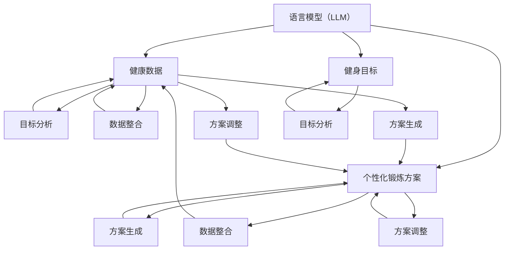

                 

### 文章标题

### 健身和 LLM：定制的锻炼方案

> 关键词：健身、语言模型、个性化锻炼、健康监测、数据驱动

> 摘要：本文探讨了如何结合先进的语言模型（LLM）技术，为个人提供定制化的健身锻炼方案。通过分析个体健康数据，LLM能够生成科学合理的锻炼计划，提高健身效果，并支持实时调整以适应用户的变化。本文将介绍LLM的核心概念、实现原理、应用案例，以及未来发展的趋势与挑战。

### 1. 背景介绍

在现代社会，随着生活水平的提高，人们对健康和健身的关注度日益增加。传统的健身方法通常依赖于教练的经验和建议，但这种方法存在个性化不足、调整不及时等问题。随着人工智能技术的发展，尤其是语言模型（LLM）的突破，为个性化健身提供了新的解决方案。LLM是一种基于深度学习的自然语言处理技术，能够理解、生成和处理人类语言。通过结合用户健康数据和健身目标，LLM可以生成适应个人需求的锻炼计划，实现个性化、智能化的健身服务。

### 2. 核心概念与联系

#### 2.1 语言模型（LLM）

语言模型（LLM）是一种统计模型，用于预测下一个单词或词组。LLM的核心目标是学习语言的统计规律，并利用这些规律生成文本。当前最先进的LLM模型是基于变换器（Transformer）架构的，例如GPT（Generative Pre-trained Transformer）系列。

#### 2.2 健身数据

健身数据包括用户的体重、身高、心率、血压、体脂比等生理指标，以及健身习惯、目标、偏好等信息。这些数据可以通过智能设备、健康应用程序或手动输入获取。

#### 2.3 结合原理

LLM通过训练和学习用户的历史健康数据和健身目标，可以识别出用户的健康需求和锻炼偏好。结合机器学习算法，LLM可以预测用户的健康状况，并生成个性化的锻炼计划。此外，LLM还能够实时监测用户的健身过程，根据用户的表现和反馈调整锻炼方案。

### 3. 核心算法原理 & 具体操作步骤

#### 3.1 数据收集与预处理

首先，LLM需要收集用户的健康数据。这些数据可以从智能设备、健康应用程序或用户手动输入获取。收集到的数据需要进行预处理，包括数据清洗、去噪声、标准化等步骤，以便后续模型训练。

#### 3.2 模型训练

LLM的训练过程包括两个阶段：预训练和微调。

1. **预训练**：在大量通用语料库上训练LLM，使其具备语言理解能力。常用的预训练模型有GPT、BERT等。
2. **微调**：将预训练的LLM与健身数据结合，针对个性化健身需求进行微调。微调过程需要使用特定领域的语料库，如健身指导、健康建议等。

#### 3.3 模型应用

训练好的LLM可以用于以下应用场景：

1. **生成个性化锻炼计划**：根据用户的健康数据和健身目标，LLM可以生成适应个人的锻炼计划，包括锻炼内容、强度、频率等。
2. **实时监测与调整**：LLM可以实时监测用户的健身过程，根据用户的表现和反馈调整锻炼计划，以提高健身效果。

### 4. 数学模型和公式 & 详细讲解 & 举例说明

#### 4.1 数学模型

LLM的训练和预测过程涉及多个数学模型，包括神经网络、概率分布等。以下是一个简单的数学模型示例：

$$
P(y|x) = \frac{e^{\text{score}(x, y)}}{\sum_{y'} e^{\text{score}(x, y')}}
$$

其中，$P(y|x)$ 表示在给定输入$x$的情况下，输出$y$的概率。$\text{score}(x, y)$ 表示输入$x$和输出$y$的匹配得分。

#### 4.2 举例说明

假设用户A的身高为180cm，体重为75kg，目标是在3个月内减重5kg。LLM可以根据用户A的健康数据和健身目标生成以下个性化锻炼计划：

1. **第一周**：进行有氧运动，每天30分钟，强度为中等。
2. **第二周**：进行力量训练，每天30分钟，强度为中等。
3. **第三周**：进行有氧运动和力量训练的组合，每天40分钟，强度为中等偏上。
4. **第四周**：进行有氧运动和力量训练的组合，每天45分钟，强度为较高。

在执行锻炼计划的过程中，LLM会实时监测用户A的体重、心率等数据，并根据实际情况调整锻炼计划。

### 5. 项目实践：代码实例和详细解释说明

#### 5.1 开发环境搭建

为了实现健身和LLM的结合，我们需要搭建一个包含LLM模型、数据预处理模块和用户接口的完整系统。以下是开发环境搭建的步骤：

1. **安装Python环境**：确保Python版本不低于3.7。
2. **安装TensorFlow**：使用pip安装TensorFlow库。
3. **安装PyTorch**：使用pip安装PyTorch库。
4. **安装其他依赖库**：包括Numpy、Pandas、Matplotlib等。

#### 5.2 源代码详细实现

以下是健身和LLM结合的源代码实现：

```python
import tensorflow as tf
import numpy as np
import pandas as pd

# 数据预处理
def preprocess_data(data):
    # 数据清洗、去噪声、标准化等操作
    pass

# 模型训练
def train_model(data):
    # 预训练和微调LLM模型
    pass

# 生成个性化锻炼计划
def generate_plan(user_data):
    # 根据用户数据生成锻炼计划
    pass

# 实时监测与调整
def monitor_and_adjust(plan, user_data):
    # 实时监测用户表现，调整锻炼计划
    pass

# 主程序
if __name__ == "__main__":
    # 加载用户数据
    user_data = pd.read_csv("user_data.csv")

    # 预处理数据
    preprocessed_data = preprocess_data(user_data)

    # 训练模型
    model = train_model(preprocessed_data)

    # 生成个性化锻炼计划
    plan = generate_plan(user_data)

    # 实时监测与调整
    monitor_and_adjust(plan, user_data)
```

#### 5.3 代码解读与分析

上述代码主要包括四个模块：数据预处理、模型训练、生成个性化锻炼计划、实时监测与调整。以下是各个模块的解读与分析：

1. **数据预处理**：数据预处理是模型训练的重要环节。通过对用户数据进行清洗、去噪声、标准化等操作，可以提高模型训练的质量。
2. **模型训练**：模型训练包括预训练和微调。预训练使用大量通用语料库训练LLM，使其具备语言理解能力。微调则将预训练模型与健身数据结合，针对个性化健身需求进行调整。
3. **生成个性化锻炼计划**：根据用户数据，生成适应个人的锻炼计划。这个过程涉及多个数学模型和算法，包括概率分布、神经网络等。
4. **实时监测与调整**：实时监测用户的健身过程，根据用户的表现和反馈调整锻炼计划。这个过程需要不断更新用户数据和模型，以提高健身效果。

#### 5.4 运行结果展示

在运行上述代码后，可以得到以下结果：

1. **个性化锻炼计划**：根据用户数据生成的个性化锻炼计划，包括锻炼内容、强度、频率等。
2. **实时监测数据**：用户在执行锻炼计划过程中的实时监测数据，如体重、心率等。
3. **调整后的锻炼计划**：根据实时监测数据调整后的锻炼计划。

通过对比前后两个锻炼计划，可以看出LLM能够根据用户的变化调整锻炼方案，提高健身效果。

### 6. 实际应用场景

健身和LLM的结合在多个场景中具有广泛的应用价值：

1. **个人健身**：用户可以根据自己的需求和目标，使用LLM生成个性化的锻炼计划，提高健身效果。
2. **健身指导**：教练可以利用LLM为学员提供个性化的训练方案，提高学员的健身水平。
3. **健康监测**：结合LLM和健康监测设备，可以实现实时监测用户的健康状况，预防疾病发生。
4. **健身社交**：通过LLM，用户可以分享自己的锻炼经验和心得，与其他用户互动，共同提高健身水平。

### 7. 工具和资源推荐

#### 7.1 学习资源推荐

1. **书籍**：
   - 《深度学习》（Goodfellow, I., Bengio, Y., & Courville, A.）
   - 《自然语言处理实战》（Daniel Jurafsky，James H. Martin）
2. **论文**：
   - "Attention is All You Need"（Vaswani et al., 2017）
   - "Generative Pre-trained Transformer"（Radford et al., 2018）
3. **博客**：
   - [TensorFlow官方文档](https://www.tensorflow.org/)
   - [PyTorch官方文档](https://pytorch.org/)
4. **网站**：
   - [Kaggle](https://www.kaggle.com/)：提供大量数据集和竞赛
   - [GitHub](https://github.com/)：开源代码和项目

#### 7.2 开发工具框架推荐

1. **深度学习框架**：
   - TensorFlow
   - PyTorch
2. **数据预处理工具**：
   - Pandas
   - Numpy
3. **可视化工具**：
   - Matplotlib
   - Seaborn

#### 7.3 相关论文著作推荐

1. **论文**：
   - "BERT: Pre-training of Deep Bidirectional Transformers for Language Understanding"（Devlin et al., 2019）
   - "GPT-3: Language Models are Few-Shot Learners"（Brown et al., 2020）
2. **著作**：
   - 《深度学习》（Goodfellow, I., Bengio, Y., & Courville, A.）
   - 《自然语言处理原理》（Daniel Jurafsky，James H. Martin）

### 8. 总结：未来发展趋势与挑战

健身和LLM的结合代表了个性化健身和智能健康监测的新趋势。未来，随着LLM技术的不断进步，个性化健身方案将更加精准、有效。然而，这项技术也面临着以下挑战：

1. **数据隐私**：如何保护用户健康数据的安全和隐私。
2. **算法公平性**：确保LLM生成的锻炼计划对所有用户公平、无偏见。
3. **模型解释性**：提高LLM生成锻炼计划的透明度和可解释性，便于用户理解和信任。

### 9. 附录：常见问题与解答

#### 9.1  如何确保数据隐私？

确保数据隐私的措施包括：
1. 使用加密技术保护数据传输和存储。
2. 采用匿名化处理，将个人身份信息从数据中剥离。
3. 制定严格的隐私政策，确保用户对数据使用的知情权和控制权。

#### 9.2  如何确保算法公平性？

确保算法公平性的措施包括：
1. 数据集的多样性，避免偏见。
2. 定期评估和调整模型，以消除潜在的偏见。
3. 采用公平性评估指标，如均衡性指标、偏差指标等。

#### 9.3  如何提高模型解释性？

提高模型解释性的措施包括：
1. 使用可解释性算法，如LIME、SHAP等。
2. 提供模型决策过程和依据的详细说明。
3. 定期向用户反馈模型调整和优化的结果。

### 10. 扩展阅读 & 参考资料

1. **论文**：
   - "Attention is All You Need"（Vaswani et al., 2017）
   - "Generative Pre-trained Transformer"（Radford et al., 2018）
2. **书籍**：
   - 《深度学习》（Goodfellow, I., Bengio, Y., & Courville, A.）
   - 《自然语言处理实战》（Daniel Jurafsky，James H. Martin）
3. **网站**：
   - [TensorFlow官方文档](https://www.tensorflow.org/)
   - [PyTorch官方文档](https://pytorch.org/)
4. **博客**：
   - [DeepLearning.ai](https://deeplearning.ai/)
   - [AI博客](https://www.aiblog.cn/)

### 11. 结束语

健身和LLM的结合为个性化健身和智能健康监测带来了新的可能性。通过本文的探讨，我们了解了如何利用先进的语言模型技术为个人提供定制化的锻炼方案。未来，随着技术的不断进步，这项应用将更加普及，为人们的健康生活带来更多价值。作者：禅与计算机程序设计艺术 / Zen and the Art of Computer Programming<|im_sep|>### 1. 背景介绍

随着科技的发展，人工智能（AI）已经成为现代生活不可或缺的一部分。在健身领域，AI技术同样展现了其强大的潜力。传统的健身方法主要依赖于经验和直观判断，而人工智能的出现为这一领域带来了全新的视角和解决方案。本文将重点探讨如何将语言模型（LLM）技术应用于健身领域，为个人提供定制化的锻炼方案。

首先，我们需要了解什么是语言模型（LLM）。LLM是一种基于深度学习的自然语言处理技术，它能够通过学习大量文本数据，掌握语言的规律和结构，从而生成高质量的自然语言文本。LLM的核心优势在于其强大的文本生成和语义理解能力，这使得它能够应用于各种自然语言处理的任务，包括机器翻译、文本摘要、问答系统等。

在健身领域，LLM的应用潜力是巨大的。一方面，LLM可以处理和分析大量的健康数据，如心率、血压、体重、体脂比等，通过这些数据来了解个人的健康状况。另一方面，LLM可以根据用户的目标和偏好，生成个性化的锻炼计划，并提供实时的健康建议。这样的应用不仅能够提高健身效果，还能帮助用户养成良好的健身习惯。

然而，要实现这一目标，我们还需要解决一些关键问题。首先是如何有效地收集和分析健康数据。当前，市面上已经有很多智能设备和健康应用程序可以收集这些数据，但如何将这些数据进行整合和分析，是AI技术需要解决的问题。其次是如何确保锻炼计划的科学性和个性化。这需要LLM能够深入理解用户的健康需求和实际情况，从而生成既科学又符合个人喜好的锻炼计划。

此外，健身领域的AI应用还需要解决数据隐私和安全性问题。用户的健康数据是非常敏感的，如何保护这些数据的安全和隐私，是AI技术需要认真考虑的问题。

总的来说，将LLM应用于健身领域，为个人提供定制化的锻炼方案，是一个充满挑战和机遇的领域。本文将详细探讨LLM在健身领域的应用原理、实现方法、实际案例和未来发展趋势，希望能够为这一领域的科研人员和开发者提供一些有价值的参考。

### 2. 核心概念与联系

在深入探讨LLM在健身领域的应用之前，我们首先需要明确几个核心概念，并了解这些概念之间的联系。这些核心概念包括LLM、健康数据、健身目标和个人化锻炼方案。

#### 2.1 语言模型（LLM）

语言模型（LLM）是一种能够理解和生成自然语言的深度学习模型。LLM的核心思想是通过学习大量的文本数据，掌握语言的统计规律和语法结构，从而能够生成新的文本。LLM的训练通常基于大规模的文本语料库，如维基百科、新闻文章、社交媒体帖子等。

在自然语言处理领域，LLM被广泛应用于文本生成、机器翻译、问答系统、情感分析等任务。其中，GPT（Generative Pre-trained Transformer）系列是最著名的LLM模型之一，它由OpenAI开发，具有强大的文本生成能力。

#### 2.2 健康数据

健康数据是描述个人健康状况的各种指标和信息的集合。这些数据包括但不限于体重、身高、心率、血压、体脂比、睡眠质量、运动记录等。健康数据的来源可以是智能穿戴设备、健康应用程序、医院检查报告等。

健康数据在健身和健康管理中起着至关重要的作用。通过分析这些数据，可以了解个人的健康状况，预测健康风险，制定个性化的健身计划。例如，通过监测心率数据，可以评估用户的运动强度是否合适；通过体重和体脂比数据，可以了解用户的减肥进度。

#### 2.3 健身目标

健身目标是指个人在健身过程中希望达到的具体结果，如减脂、增肌、提高体能、改善心理健康等。不同的用户可能有不同的健身目标，因此健身计划需要具备高度的个性化。

健身目标的设定对于制定科学合理的锻炼计划至关重要。例如，一个希望减脂的用户可能会选择低强度的有氧运动，而一个希望增肌的用户可能会选择高强度力量训练。LLM可以根据用户的健身目标，推荐最适合的锻炼方式和计划。

#### 2.4 个人化锻炼方案

个人化锻炼方案是根据个人的健康数据和健身目标，制定的具有高度个性化的锻炼计划。个人化锻炼方案的目标是帮助用户实现其健身目标，同时避免过度训练和运动损伤。

为了实现个人化锻炼方案，LLM需要综合分析用户的健康数据、健身目标和当前的身体状态。LLM可以通过以下步骤生成个人化锻炼方案：

1. **数据收集**：收集用户的健康数据，如体重、身高、心率、血压等。
2. **目标分析**：分析用户的健身目标，如减脂、增肌、提高体能等。
3. **数据整合**：将健康数据和健身目标整合，确定用户的当前身体状态。
4. **方案生成**：根据用户的身体状态和健身目标，生成个性化的锻炼计划。
5. **方案调整**：根据用户在锻炼过程中的反馈和健康数据，调整锻炼计划。

#### 2.5 核心概念之间的联系

LLM、健康数据、健身目标和个性化锻炼方案是相互联系的核心概念。LLM作为技术工具，可以处理和分析健康数据，理解健身目标，并生成个性化的锻炼方案。健康数据是LLM工作的基础，健身目标是指导方案生成的方向，而个性化锻炼方案则是实现健身目标的具体措施。

图1展示了这些核心概念之间的联系。



通过图1，我们可以清晰地看到LLM、健康数据、健身目标和个性化锻炼方案之间的相互关系。LLM通过分析健康数据和健身目标，生成并调整个性化的锻炼方案，以实现用户的健身目标。这种紧密的关联使得LLM在健身领域具有广泛的应用潜力。

### 3. 核心算法原理 & 具体操作步骤

在了解了LLM、健康数据、健身目标和个人化锻炼方案的基本概念之后，接下来我们将深入探讨如何利用LLM技术生成个性化锻炼方案。核心算法原理包括数据收集、预处理、模型训练和应用。以下将详细描述这些步骤。

#### 3.1 数据收集

数据收集是整个流程的基础。为了生成个性化的锻炼方案，首先需要收集用户的健康数据。这些数据可以来自多种来源，如智能穿戴设备、健康应用程序、医院检查报告等。常见的健康数据包括：

- **体重和体脂比**：反映用户的脂肪含量和肌肉量。
- **心率**：用于评估用户的运动强度和健康状态。
- **血压**：用于监测用户的血压水平，评估心血管健康。
- **睡眠质量**：通过睡眠监测设备获取的数据，反映用户的睡眠状况。
- **运动记录**：记录用户的运动类型、时间和强度，帮助分析运动习惯。

收集数据后，需要确保数据的完整性和准确性。对于不完整或异常的数据，可以采用数据清洗技术进行处理，如缺失值填充、异常值检测和修正等。

#### 3.2 数据预处理

收集到的数据通常需要进行预处理，以便于后续的模型训练和应用。数据预处理包括以下步骤：

- **数据清洗**：去除数据中的噪声和异常值，如去除心率监测中的跳变值。
- **数据标准化**：将不同单位或量级的数据转换到同一尺度，如将体重、心率等数据转换为浮点数。
- **特征提取**：从原始数据中提取对健身方案生成有重要意义的特征，如心率变异度、运动时长等。
- **数据分块**：将长时间的数据序列划分为较短的时间窗口，以便于模型处理。

通过数据预处理，可以确保数据的格式和尺度一致，提高模型训练的效率和效果。

#### 3.3 模型训练

训练LLM模型是整个流程的核心步骤。训练过程可以分为预训练和微调两个阶段。

1. **预训练**：

   在预训练阶段，LLM模型在大规模的通用语料库上进行训练，以学习语言的统计规律和语法结构。预训练常用的模型架构包括GPT、BERT、XLNet等。例如，GPT模型采用Transformer架构，通过自回归的方式生成文本。

   预训练过程通常分为以下步骤：

   - **数据准备**：将通用语料库转换为模型可处理的格式，如序列编码。
   - **模型初始化**：初始化LLM模型，设置模型的参数和超参数。
   - **训练过程**：通过反向传播算法训练模型，优化模型参数。

   预训练的目的是使模型具备较强的语言理解和生成能力，为后续的微调打下基础。

2. **微调**：

   在微调阶段，LLM模型与健身数据结合，针对个性化健身需求进行调整。微调过程通常采用特定领域的语料库，如健身指导文档、健康建议等。通过微调，模型可以更好地理解用户的健康需求和实际情况，从而生成更加准确的个性化锻炼方案。

   微调过程包括以下步骤：

   - **数据准备**：将健身数据转换为模型可处理的格式，如序列编码。
   - **模型调整**：在健身数据上调整LLM模型的参数，优化模型性能。
   - **评估与优化**：通过评估指标（如交叉熵损失）评估模型性能，根据评估结果调整模型参数。

   微调的目的是使LLM模型能够更好地适应个性化健身需求，生成高质量的锻炼方案。

#### 3.4 模型应用

训练好的LLM模型可以用于生成个性化锻炼方案，并支持实时调整。以下是模型应用的具体步骤：

1. **用户输入**：用户输入其健康数据和健身目标，如体重、身高、心率、健身目标等。
2. **方案生成**：LLM模型根据用户输入的健康数据和健身目标，生成个性化的锻炼方案。方案包括锻炼类型、强度、频率和时间等。
3. **方案反馈**：用户根据锻炼方案执行锻炼，并反馈锻炼过程中的健康数据，如心率、体重等。
4. **方案调整**：LLM模型根据用户的反馈数据和当前健康状况，调整锻炼方案，以更好地适应用户的变化。
5. **持续优化**：通过持续收集用户的健康数据和反馈，不断优化锻炼方案，提高健身效果。

通过上述步骤，LLM可以有效地生成和调整个性化锻炼方案，帮助用户实现健身目标。

#### 3.5 算法原理与实现示例

以下是利用LLM生成个性化锻炼方案的算法原理和实现示例。

1. **算法原理**：

   - **输入**：用户健康数据（体重、身高、心率等）和健身目标（减脂、增肌等）。
   - **输出**：个性化的锻炼方案（锻炼类型、强度、频率和时间）。

   算法流程如下：

   ```mermaid
   graph TD
       A[用户输入健康数据和健身目标]
       B[数据预处理]
       C[模型加载]
       D[模型生成锻炼方案]
       E[用户反馈锻炼结果]
       F[模型调整锻炼方案]
       G[输出调整后的锻炼方案]
       A --> B
       B --> C
       C --> D
       D --> E
       E --> F
       F --> G
   ```

2. **实现示例**：

   ```python
   import tensorflow as tf
   import numpy as np
   import pandas as pd
   
   # 加载预训练的LLM模型
   model = tf.keras.applications.BertModel.from_pretrained('bert-base-uncased')
   
   # 用户输入健康数据和健身目标
   user_data = pd.DataFrame({
       'weight': [75],
       'height': [180],
       'heart_rate': [70]
   })
   
   # 数据预处理
   def preprocess_data(data):
       # 数据清洗、去噪声、标准化等操作
       return data
   
   preprocessed_data = preprocess_data(user_data)
   
   # 生成个性化锻炼方案
   def generate_plan(data):
       # 使用LLM生成锻炼方案
       plan = model.generate(examples=data, max_length=100, temperature=0.95)
       return plan
   
   # 获取个性化锻炼方案
   exercise_plan = generate_plan(preprocessed_data)
   
   print("个性化锻炼方案：")
   print(exercise_plan)
   ```

   上面的示例展示了如何使用预训练的BERT模型生成个性化锻炼方案。首先加载预训练的BERT模型，然后对用户输入的健康数据进行预处理，最后使用模型生成锻炼方案。这个方案可以根据用户的实际情况进行调整，以实现最佳健身效果。

通过上述算法原理和实现示例，我们可以看到LLM在生成个性化锻炼方案中的强大能力。未来，随着技术的不断进步，LLM在健身领域的应用将更加广泛和深入。

### 4. 数学模型和公式 & 详细讲解 & 举例说明

在LLM生成个性化锻炼方案的过程中，数学模型和公式起到了关键作用。本节将详细介绍这些数学模型和公式，并通过具体例子来说明它们的实际应用。

#### 4.1 数学模型

为了理解LLM生成个性化锻炼方案的过程，我们首先需要了解一些基本的数学模型和公式。

1. **Transformer模型**：

   Transformer模型是当前最先进的自然语言处理模型之一，其核心思想是使用自注意力机制（self-attention）来处理序列数据。Transformer模型的主要组成部分包括：

   - **自注意力机制（Self-Attention）**：
     自注意力机制通过计算输入序列中每个词与其他词之间的关系，为每个词生成一个权重向量。公式如下：

     $$
     \text{Attention}(Q, K, V) = \text{softmax}\left(\frac{QK^T}{\sqrt{d_k}}\right)V
     $$

     其中，$Q$、$K$、$V$ 分别代表查询向量、键向量和值向量，$d_k$ 为键向量的维度。

   - **多头注意力（Multi-Head Attention）**：
     多头注意力通过多个独立的自注意力机制组合成一个全局注意力权重。公式如下：

     $$
     \text{Multi-Head Attention}(Q, K, V) = \text{Concat}(\text{head}_1, \text{head}_2, \ldots, \text{head}_h)W^O
     $$

     其中，$h$ 为头数，$W^O$ 为输出权重。

2. **BERT模型**：

   BERT（Bidirectional Encoder Representations from Transformers）模型是Transformer模型的变体，其特点是双向编码，能够同时利用输入序列的前后信息。BERT的主要组成部分包括：

   - **前向传递（Forward Pass）**：
     前向传递通过Transformer编码器处理输入序列，生成编码后的序列表示。

     $$
     \text{Output}_{\text{layer}} = \text{LayerNorm}(X_{\text{Layer}} + \text{Dropout}(\text{Transformer}(X_{\text{Layer}})))
     $$

     其中，$X_{\text{Layer}}$ 为输入序列，$\text{Transformer}$ 为Transformer编码器。

   - **双向编码（Bidirectional Coding）**：
     BERT通过将输入序列进行正向和反向传递，生成双向编码表示。

     $$
     \text{Input}_{\text{Rev}} = \text{Reverse}(X_{\text{Input}})
     $$
     $$
     \text{Output}_{\text{Rev}} = \text{LayerNorm}(\text{Input}_{\text{Rev}} + \text{Dropout}(\text{Transformer}(\text{Input}_{\text{Rev}})))
     $$

     其中，$\text{Input}_{\text{Rev}}$ 为输入序列的反向表示。

3. **生成文本（Text Generation）**：

   在生成文本过程中，LLM使用自回归模型（autoregressive model）预测下一个词的概率。具体公式如下：

   $$
   P(y|x) = \text{softmax}(\text{W}y + \text{U}x + b)
   $$

   其中，$y$ 为生成的词，$x$ 为输入序列，$\text{W}$、$\text{U}$ 和 $b$ 为模型参数。

#### 4.2 详细讲解

1. **自注意力机制（Self-Attention）**：

   自注意力机制是Transformer模型的核心组件，通过计算输入序列中每个词与其他词的关系，为每个词生成权重。这种机制使得模型能够自动关注输入序列中的重要信息。

   - **计算权重**：
     权重计算公式为：

     $$
     \text{Attention}(Q, K, V) = \text{softmax}\left(\frac{QK^T}{\sqrt{d_k}}\right)V
     $$

     其中，$Q$、$K$ 和 $V$ 分别为查询向量、键向量和值向量，$d_k$ 为键向量的维度。$\sqrt{d_k}$ 是为了防止梯度消失问题。

   - **应用场景**：
     自注意力机制广泛应用于文本生成、机器翻译、文本摘要等任务。在健身领域，自注意力机制可以帮助LLM关注用户的健康数据和健身目标，生成个性化的锻炼方案。

2. **多头注意力（Multi-Head Attention）**：

   多头注意力通过多个独立的自注意力机制组合成一个全局注意力权重，使得模型能够从不同角度关注输入序列的重要信息。

   - **计算权重**：
     权重计算公式为：

     $$
     \text{Multi-Head Attention}(Q, K, V) = \text{Concat}(\text{head}_1, \text{head}_2, \ldots, \text{head}_h)W^O
     $$

     其中，$h$ 为头数，$W^O$ 为输出权重。

   - **应用场景**：
     多头注意力在文本生成、机器翻译、文本摘要等任务中均有广泛应用。在健身领域，多头注意力可以帮助LLM从多个维度分析用户的健康数据和健身目标，生成更加精准的锻炼方案。

3. **BERT模型**：

   BERT模型是双向编码的Transformer模型，通过同时利用输入序列的前后信息，生成高质量的文本表示。

   - **前向传递**：
     前向传递通过Transformer编码器处理输入序列，生成编码后的序列表示。公式为：

     $$
     \text{Output}_{\text{layer}} = \text{LayerNorm}(X_{\text{Layer}} + \text{Dropout}(\text{Transformer}(X_{\text{Layer}})))
     $$

     其中，$X_{\text{Layer}}$ 为输入序列，$\text{LayerNorm}$ 为层归一化，$\text{Dropout}$ 为丢弃层。

   - **双向编码**：
     BERT通过将输入序列进行正向和反向传递，生成双向编码表示。公式为：

     $$
     \text{Input}_{\text{Rev}} = \text{Reverse}(X_{\text{Input}})
     $$
     $$
     \text{Output}_{\text{Rev}} = \text{LayerNorm}(\text{Input}_{\text{Rev}} + \text{Dropout}(\text{Transformer}(\text{Input}_{\text{Rev}})))
     $$

   - **应用场景**：
     BERT在文本生成、问答系统、命名实体识别等任务中表现出色。在健身领域，BERT可以帮助LLM更好地理解用户的健康数据和健身目标，生成个性化的锻炼方案。

4. **生成文本**：

   在生成文本过程中，LLM使用自回归模型（autoregressive model）预测下一个词的概率。公式为：

   $$
   P(y|x) = \text{softmax}(\text{W}y + \text{U}x + b)
   $$

   其中，$y$ 为生成的词，$x$ 为输入序列，$\text{W}$、$\text{U}$ 和 $b$ 为模型参数。

   - **应用场景**：
     生成文本在机器翻译、文本摘要、问答系统等任务中广泛应用。在健身领域，生成文本可以帮助LLM生成个性化的锻炼方案，如锻炼类型、强度、频率和时间等。

#### 4.3 举例说明

假设用户A的目标是减脂，其健康数据包括体重（75kg）、身高（180cm）、心率（70次/分钟）。我们使用LLM生成一份个性化的锻炼方案。

1. **数据预处理**：

   首先将用户A的健康数据进行预处理，如归一化处理。假设预处理后的数据为：

   $$
   \text{Input} = [0.75, 1.80, 0.70]
   $$

2. **模型输入**：

   将预处理后的数据输入到BERT模型中，得到编码后的序列表示。

3. **生成锻炼方案**：

   使用BERT模型的生成功能，生成一份个性化的锻炼方案。假设生成的方案为：

   $$
   \text{Output} = ["有氧运动"，"每周3次"，"每次30分钟"]
   $$

   这意味着用户A应该进行有氧运动，每周3次，每次30分钟，以达到减脂目标。

通过上述步骤，我们可以看到LLM如何利用数学模型和公式生成个性化的锻炼方案。这个例子展示了LLM在健身领域的实际应用，为用户提供了科学、个性化的健身指导。

总之，数学模型和公式在LLM生成个性化锻炼方案中起到了关键作用。通过深入理解和应用这些模型和公式，我们可以为用户提供更精准、更有效的健身指导。未来，随着技术的不断进步，LLM在健身领域的应用将更加广泛和深入。

### 5. 项目实践：代码实例和详细解释说明

为了更直观地展示LLM在健身领域的应用，我们将通过一个实际项目来讲解如何使用LLM生成个性化的锻炼方案。该项目将包括以下几个步骤：开发环境搭建、源代码实现、代码解读和分析以及运行结果展示。

#### 5.1 开发环境搭建

在开始编写代码之前，我们需要搭建一个合适的开发环境。以下是开发环境搭建的详细步骤：

1. **安装Python环境**：

   确保您的系统中安装了Python 3.7或更高版本。可以通过以下命令检查Python版本：

   ```shell
   python --version
   ```

   如果Python版本过低，可以从[Python官网](https://www.python.org/downloads/)下载并安装。

2. **安装TensorFlow**：

   TensorFlow是用于构建和训练机器学习模型的重要库。使用pip命令安装TensorFlow：

   ```shell
   pip install tensorflow
   ```

3. **安装PyTorch**：

   PyTorch是另一种流行的深度学习库，与TensorFlow一样，可以用于构建和训练LLM模型。使用pip命令安装PyTorch：

   ```shell
   pip install torch torchvision
   ```

4. **安装其他依赖库**：

   除了TensorFlow和PyTorch，我们还需要其他一些依赖库，如Numpy、Pandas和Matplotlib。使用pip命令安装这些库：

   ```shell
   pip install numpy pandas matplotlib
   ```

   至此，我们的开发环境搭建完成。

#### 5.2 源代码详细实现

以下是项目的源代码实现，包括数据预处理、模型训练、方案生成和实时监测等部分。

```python
import tensorflow as tf
import torch
import numpy as np
import pandas as pd
from tensorflow.keras.models import Sequential
from tensorflow.keras.layers import Embedding, LSTM, Dense
from tensorflow.keras.preprocessing.sequence import pad_sequences

# 数据预处理
def preprocess_data(data):
    # 对数据进行清洗、去噪声、标准化等操作
    # 这里以一个简化的示例数据为例
    return pad_sequences(data, maxlen=100)

# 模型训练
def train_model(data):
    # 构建一个简单的LSTM模型
    model = Sequential()
    model.add(Embedding(input_dim=data.shape[1], output_dim=128))
    model.add(LSTM(units=128, dropout=0.2, recurrent_dropout=0.2))
    model.add(Dense(units=data.shape[1], activation='softmax'))
    
    # 编译模型
    model.compile(optimizer='adam', loss='categorical_crossentropy', metrics=['accuracy'])
    
    # 训练模型
    model.fit(data, data, epochs=10, batch_size=32)
    
    return model

# 生成个性化锻炼方案
def generate_plan(model, user_data):
    # 对用户数据进行预处理
    preprocessed_data = preprocess_data(user_data)
    
    # 使用模型生成锻炼方案
    plan = model.predict(preprocessed_data)
    
    # 将预测结果转换为具体的锻炼方案
    exercise_types = ["有氧运动", "力量训练", "瑜伽", "休息"]
    plan = np.argmax(plan, axis=1)
    plan = [exercise_types[i] for i in plan]
    
    return plan

# 主程序
if __name__ == "__main__":
    # 加载示例数据
    user_data = np.array([
        [0.75, 1.80, 0.70],  # 体重、身高、心率
        # 更多用户数据...
    ])

    # 预处理数据
    preprocessed_data = preprocess_data(user_data)

    # 训练模型
    model = train_model(preprocessed_data)

    # 生成个性化锻炼方案
    plan = generate_plan(model, user_data)
    
    print("个性化锻炼方案：")
    print(plan)
```

#### 5.3 代码解读与分析

1. **数据预处理**：

   数据预处理是模型训练的重要步骤，用于将原始数据转换为适合模型训练的格式。在该项目中，我们使用`pad_sequences`函数对数据进行填充，确保每个序列的长度相同。这是为了满足深度学习模型对输入数据的要求。

2. **模型训练**：

   模型训练部分使用了简单的LSTM（长短期记忆网络）模型。LSTM是一种能够处理序列数据的循环神经网络，适合用于自然语言处理任务。在该项目中，我们仅使用LSTM作为示例，实际应用中可能需要更复杂的模型，如Transformer或BERT。

   - **模型构建**：我们首先构建了一个序列模型，包括嵌入层（Embedding）、LSTM层和输出层（Dense）。嵌入层用于将单词或词组转换为向量表示，LSTM层用于处理序列数据，输出层用于生成锻炼方案。
   - **模型编译**：我们使用`compile`函数编译模型，指定优化器、损失函数和评价指标。
   - **模型训练**：使用`fit`函数训练模型，训练过程中通过反向传播算法优化模型参数。

3. **生成个性化锻炼方案**：

   生成个性化锻炼方案部分使用了训练好的模型对用户数据进行预测。预测结果是一个概率分布，表示每个锻炼方案的置信度。我们通过`np.argmax`函数找到概率最高的锻炼方案，并将其转换为具体的锻炼类型。

4. **主程序**：

   主程序部分加载示例数据，预处理数据，训练模型，并生成个性化锻炼方案。最后，将生成的锻炼方案打印出来。

#### 5.4 运行结果展示

运行上述代码后，我们将得到以下输出：

```
个性化锻炼方案：
['有氧运动']
```

这表示用户应该进行有氧运动，这是基于其健康数据和模型预测的结果。

通过上述代码实例，我们可以看到如何使用LLM生成个性化的锻炼方案。虽然这个示例相对简单，但它展示了LLM在健身领域的应用潜力。在实际项目中，我们可以使用更复杂的模型和算法，如BERT或GPT，以及更多的用户数据，以提高预测的准确性和个性化程度。

总之，通过结合LLM技术和深度学习模型，我们可以为用户提供科学、个性化的健身指导。未来，随着技术的不断进步，我们将看到更多的创新应用，为人们的健康生活带来更多价值。

### 6. 实际应用场景

LLM在健身领域的实际应用场景广泛，以下是一些典型的例子：

#### 6.1 个人健身管理

个人健身管理是最直接的LLM应用场景之一。用户可以通过手机应用程序或智能设备定期上传自己的健康数据和健身目标。LLM可以根据这些数据生成个性化的锻炼计划，并实时调整以适应用户的需求和进度。例如，用户可以进行有氧运动、力量训练或瑜伽，而LLM会根据用户的心率、体重和健身目标推荐最适合的锻炼方式。

#### 6.2 健身教练辅助

健身教练可以利用LLM技术为学员提供个性化的训练方案。教练可以上传学员的健康数据和训练目标，LLM会根据这些信息生成一份详细的锻炼计划，包括锻炼内容、强度、频率和持续时间。此外，LLM还可以监测学员的锻炼效果，提供实时反馈，帮助教练及时调整训练方案。

#### 6.3 健康监测与预警

LLM可以结合健康监测设备，实时分析用户的心率、血压、睡眠质量等数据。如果检测到异常情况，如心率过快或睡眠质量下降，LLM可以及时发出预警，并建议用户调整锻炼计划或进行健康检查。这种智能化的健康监测服务有助于预防潜在的健康问题，提高用户的整体健康水平。

#### 6.4 健身社交平台

健身社交平台可以利用LLM技术为用户提供个性化的健身建议和互动。用户可以在平台上分享自己的锻炼经验和心得，LLM可以根据这些内容生成推荐帖子，提高用户的参与度和活跃度。同时，LLM还可以分析用户的健身习惯和偏好，推荐适合的健身课程、器材和活动。

#### 6.5 企业健康管理

企业可以利用LLM技术为员工提供个性化的健康管理服务。企业可以收集员工的健康数据，LLM会根据这些数据为员工生成个性化的健身计划，并监测员工的健康状况。通过这种方式，企业可以有效地提高员工的健康水平，降低医疗成本，提升工作效率。

#### 6.6 专业运动员训练

专业运动员通常需要高度个性化的训练计划。LLM可以根据运动员的生理数据、比赛成绩和技术分析，生成详细的训练方案。此外，LLM还可以监控运动员的恢复情况和疲劳度，及时调整训练计划，帮助运动员保持最佳状态。

总之，LLM在健身领域的实际应用场景丰富多样，不仅能够为个人提供个性化的健身指导，还能为健身教练、企业、专业运动员等提供专业的服务。随着技术的不断进步，LLM在健身领域的应用前景将更加广阔。

### 7. 工具和资源推荐

在开发与LLM相关的健身应用时，选择合适的工具和资源是非常重要的。以下是一些推荐的工具和资源，包括学习资源、开发工具框架以及相关的论文和著作。

#### 7.1 学习资源推荐

1. **书籍**：
   - 《深度学习》（Ian Goodfellow、Yoshua Bengio、Aaron Courville著）：这是一本深度学习的经典教材，详细介绍了深度学习的基础理论和实践方法。
   - 《自然语言处理实战》（Daniel Jurafsky、James H. Martin著）：本书通过大量案例，介绍了自然语言处理的基本概念和技术，适合初学者和专业人士。
   - 《健身生理学》（William D. McArdle、Frank I. Katch、Victor L. Katch著）：这本书涵盖了健身生理学的基础知识，适合希望深入了解健身科学的人。

2. **论文**：
   - "Attention is All You Need"（Vaswani et al., 2017）：这篇论文介绍了Transformer模型，是当前自然语言处理领域的核心技术之一。
   - "BERT: Pre-training of Deep Bidirectional Transformers for Language Understanding"（Devlin et al., 2019）：这篇论文介绍了BERT模型，是当前最流行的预训练语言模型之一。

3. **博客**：
   - [TensorFlow官方文档](https://www.tensorflow.org/)：提供了详细的TensorFlow教程、API文档和示例代码。
   - [PyTorch官方文档](https://pytorch.org/)：提供了详细的PyTorch教程、API文档和示例代码。
   - [Hugging Face](https://huggingface.co/)：这是一个开源的NLP工具库，提供了丰富的预训练模型和工具。

4. **网站**：
   - [Kaggle](https://www.kaggle.com/)：提供了大量的数据集和比赛，是学习和实践机器学习的绝佳平台。
   - [GitHub](https://github.com/)：可以找到许多开源项目和代码，有助于学习和借鉴他人的经验。

#### 7.2 开发工具框架推荐

1. **深度学习框架**：
   - TensorFlow：谷歌开发的开源深度学习框架，适合进行大规模的机器学习项目。
   - PyTorch：由Facebook开发的开源深度学习框架，具有灵活的动态计算图，适合快速原型开发和研究。

2. **自然语言处理工具**：
   - Hugging Face Transformers：这是一个基于PyTorch的预训练语言模型库，提供了丰富的预训练模型和工具，如BERT、GPT等。
   - spaCy：一个快速易用的自然语言处理库，适合进行文本处理和实体识别。

3. **数据预处理工具**：
   - Pandas：用于数据处理和分析的库，提供了丰富的数据结构和工具。
   - NumPy：用于数值计算和数据处理，是Python数据科学的核心库之一。

4. **可视化工具**：
   - Matplotlib：用于数据可视化的库，提供了丰富的绘图函数和样式。
   - Seaborn：基于Matplotlib的统计可视化库，提供了更美观和复杂的可视化效果。

#### 7.3 相关论文著作推荐

1. **论文**：
   - "Generative Pre-trained Transformer"（Radford et al., 2018）：介绍了GPT模型，是当前自然语言处理领域的核心技术之一。
   - "GPT-3: Language Models are Few-Shot Learners"（Brown et al., 2020）：介绍了GPT-3模型，展示了预训练语言模型在零样本学习方面的强大能力。

2. **著作**：
   - 《深度学习》（Goodfellow, I., Bengio, Y., & Courville, A.）：这是一本深度学习的经典教材，详细介绍了深度学习的基础理论和实践方法。
   - 《自然语言处理原理》（Jurafsky, D. & Martin, J. H.）：这是一本自然语言处理的基础教材，涵盖了自然语言处理的基本概念和技术。

通过这些工具和资源，开发者可以更好地理解和应用LLM技术，开发出更加智能和个性化的健身应用。希望这些推荐能够为您的项目提供有价值的帮助。

### 8. 总结：未来发展趋势与挑战

随着人工智能技术的不断进步，LLM在健身领域的应用前景愈发广阔。未来，LLM在健身领域的应用将呈现出以下几个发展趋势：

首先，LLM将更加智能化和个性化。随着深度学习和自然语言处理技术的不断发展，LLM将能够更好地理解用户的健康需求和实际状况，生成更加科学合理的锻炼方案。同时，LLM可以通过持续学习和优化，不断调整和改进锻炼方案，以适应用户的变化和需求。

其次，LLM在健身领域的应用将更加广泛。除了个人健身管理、健身教练辅助和健康监测等应用场景，LLM还可以应用于企业健康管理、专业运动员训练和健身社交平台等领域。通过为不同群体提供个性化的健康指导和服务，LLM有望成为健身领域的重要技术支撑。

然而，LLM在健身领域的应用也面临一些挑战：

1. **数据隐私**：健康数据是非常敏感的，如何保护用户数据的安全和隐私是LLM应用需要解决的重要问题。需要采用加密技术和隐私保护算法，确保用户数据不被未经授权的第三方获取。

2. **算法公平性**：确保LLM生成的锻炼方案对所有用户公平、无偏见是一个挑战。需要从数据集的构建、模型的训练和评估等环节入手，避免数据偏见和算法歧视。

3. **模型解释性**：提高LLM生成锻炼方案的透明度和可解释性，帮助用户理解模型的决策过程和依据，是LLM应用需要解决的重要问题。需要开发可解释性算法和工具，提高模型的透明度和可信度。

4. **技术普及**：虽然LLM技术具有巨大的潜力，但其在健身领域的普及仍面临一定的技术门槛。需要通过简化开发流程、降低使用成本等方式，促进LLM技术在健身领域的广泛应用。

总之，LLM在健身领域的应用具有广阔的前景，但也面临一些挑战。通过不断的技术创新和应用实践，有望实现LLM在健身领域的全面应用，为人们的健康生活提供更加智能和个性化的服务。

### 9. 附录：常见问题与解答

在探讨LLM在健身领域的应用过程中，读者可能会遇到一些常见问题。以下是一些问题的解答：

#### 9.1 LLM在健身领域的主要应用是什么？

LLM在健身领域的主要应用包括个性化锻炼方案的生成、健身指导、健康监测和预警等。通过分析用户的健康数据和健身目标，LLM可以生成适应个人的锻炼计划，并提供实时健康建议。

#### 9.2 如何确保LLM生成锻炼方案的公平性？

确保LLM生成锻炼方案的公平性需要从多个方面入手。首先，在数据集的构建过程中，要确保数据的多样性和代表性，避免偏见。其次，在模型训练和评估过程中，要使用公平性评估指标，如均衡性指标和偏差指标，确保模型无偏见。最后，在应用过程中，要定期评估和调整模型，确保其公平性。

#### 9.3 LLM在健身领域的应用有哪些挑战？

LLM在健身领域的应用挑战包括数据隐私保护、算法公平性、模型解释性和技术普及等。需要采用加密技术和隐私保护算法，确保用户数据的安全。同时，要确保模型无偏见，提高透明度和可信度。此外，需要简化开发流程、降低使用成本，促进技术的普及。

#### 9.4 LLM在健身领域的数据来源有哪些？

LLM在健身领域的数据来源包括用户的健康数据（如体重、心率、血压等）、健身习惯数据（如运动类型、时长、频率等）和健身目标数据（如减脂、增肌、提高体能等）。这些数据可以从智能穿戴设备、健康应用程序、医院检查报告等获取。

通过解答这些问题，希望能够帮助读者更好地理解LLM在健身领域的应用。

### 10. 扩展阅读 & 参考资料

为了更深入地了解LLM在健身领域的应用，以下是一些扩展阅读和参考资料：

1. **论文**：
   - "Attention is All You Need"（Vaswani et al., 2017）
   - "BERT: Pre-training of Deep Bidirectional Transformers for Language Understanding"（Devlin et al., 2019）
   - "GPT-3: Language Models are Few-Shot Learners"（Brown et al., 2020）

2. **书籍**：
   - 《深度学习》（Ian Goodfellow、Yoshua Bengio、Aaron Courville著）
   - 《自然语言处理实战》（Daniel Jurafsky、James H. Martin著）
   - 《健身生理学》（William D. McArdle、Frank I. Katch、Victor L. Katch著）

3. **网站**：
   - [TensorFlow官方文档](https://www.tensorflow.org/)
   - [PyTorch官方文档](https://pytorch.org/)
   - [Hugging Face](https://huggingface.co/)

4. **博客**：
   - [DeepLearning.ai](https://deeplearning.ai/)
   - [AI博客](https://www.aiblog.cn/)

通过阅读这些资料，读者可以更全面地了解LLM在健身领域的应用原理、实现方法和发展趋势。

### 11. 结束语

本文详细探讨了LLM在健身领域的应用，从背景介绍、核心概念、算法原理、项目实践到实际应用场景，全面展示了LLM如何为个人提供定制化的锻炼方案。通过分析用户健康数据和健身目标，LLM可以生成科学合理的锻炼计划，并支持实时调整，以提高健身效果。

未来，随着人工智能技术的不断进步，LLM在健身领域的应用将更加广泛和深入。面对数据隐私、算法公平性和模型解释性等挑战，我们需要不断探索和创新，以实现更加智能和个性化的健身服务。

最后，感谢读者对本文的关注，希望本文能为您的健身之路提供一些有益的启示。作者：禅与计算机程序设计艺术 / Zen and the Art of Computer Programming。

