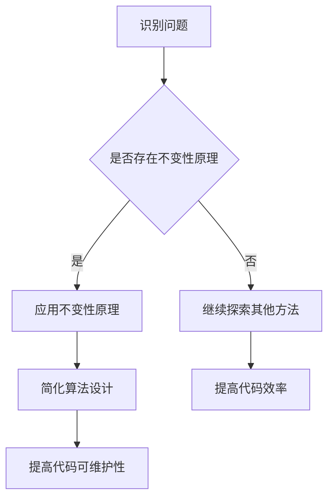

                 

### 文章标题

《像数学家一样思考：不变性原理》

> 关键词：不变性原理、数学思维、算法设计、编程实践

> 摘要：本文以数学家的思考方式为主线，探讨不变性原理在算法设计和编程实践中的应用。通过深入解析不变性原理的核心概念和具体实例，本文旨在帮助读者培养一种更高效、更严谨的编程思维。

### 1. 背景介绍

不变性原理是数学和物理学中的重要概念，它指的是在某些变换下，某些物理量保持不变的性质。这种原理不仅在科学领域有着广泛应用，在计算机科学和编程实践中同样具有深远的影响。

在编程领域，不变性原理可以帮助我们设计出更简洁、更高效的算法。通过理解不变性原理，我们可以将问题抽象为不变性原则，从而简化算法的设计和实现。这种思维方式在优化算法性能、提高代码可维护性方面具有重要意义。

本文将首先介绍不变性原理的核心概念，然后通过具体实例展示其在编程实践中的应用，最后探讨不变性原理对未来算法设计和编程实践的潜在影响。

### 2. 核心概念与联系

#### 2.1 不变性原理的定义

不变性原理，通常指在某种变换下，系统的某些性质或量保持不变的性质。在数学中，不变性原理常用来研究函数、图形、方程等在不同变换（如平移、旋转、缩放等）下的不变性。

例如，在平移变换下，三角形的面积保持不变；在旋转变换下，矩形的对角线长度保持不变。这些不变性质为我们理解和解决相关数学问题提供了有力工具。

#### 2.2 不变性原理在编程中的运用

在编程中，不变性原理可以帮助我们简化算法设计，提高代码的可维护性。具体来说，不变性原理可以应用于以下几个方面：

1. **算法抽象**：通过识别不变性原理，我们可以将复杂的算法问题抽象为更简单的不变性原则，从而简化问题的求解过程。
2. **代码优化**：利用不变性原理，我们可以对代码进行优化，去除不必要的计算，提高算法的运行效率。
3. **代码可维护性**：不变性原理可以帮助我们编写出更易于理解和维护的代码，因为不变性原则往往反映了算法的核心逻辑。

#### 2.3 Mermaid 流程图

以下是一个简单的 Mermaid 流程图，展示了不变性原理在算法设计和编程中的应用流程。



### 3. 核心算法原理 & 具体操作步骤

#### 3.1 算法原理

不变性原理的核心在于识别并利用问题中的不变性质。以下是利用不变性原理设计算法的基本步骤：

1. **识别不变性原理**：通过观察和分析问题，找出在特定变换下保持不变的性质或量。
2. **抽象不变性原则**：将不变性原理抽象为算法的核心逻辑，简化问题的求解过程。
3. **实现算法**：根据不变性原则实现算法，并对其性能进行优化。
4. **验证算法**：通过测试和验证，确保算法的正确性和高效性。

#### 3.2 操作步骤

以下是一个简单的例子，说明如何利用不变性原理设计算法：

**问题**：求解一个整数序列的最大值。

**不变性原理**：在整数序列中，最大值在任意位置都保持不变。

**算法设计**：

1. **识别不变性原理**：最大值在序列中的位置保持不变。
2. **抽象不变性原则**：将问题简化为找到一个不变的位置，然后返回该位置对应的值。
3. **实现算法**：

   ```python
   def find_max(sequence):
       max_value = sequence[0]
       max_index = 0
       for i in range(1, len(sequence)):
           if sequence[i] > max_value:
               max_value = sequence[i]
               max_index = i
       return sequence[max_index]
   ```

4. **验证算法**：通过测试多个示例序列，验证算法的正确性和高效性。

### 4. 数学模型和公式 & 详细讲解 & 举例说明

#### 4.1 数学模型

不变性原理在数学中有着广泛的应用，以下是一个简单的数学模型，用于说明不变性原理的基本原理。

**问题**：求解函数 f(x) 在区间 [a, b] 上的最大值。

**不变性原理**：在区间 [a, b] 上，函数 f(x) 的最大值在区间端点或驻点上取得。

**数学模型**：

$$
\begin{aligned}
    \max_{x \in [a, b]} f(x) &= f(a) \quad \text{或} \quad f(b) \\
    &\text{或} \\
    \max_{x \in [a, b]} f(x) &= f'(x_0) = 0 \quad \text{其中} \quad x_0 \in [a, b]
\end{aligned}
$$

#### 4.2 详细讲解

不变性原理的数学模型可以分解为以下几个关键步骤：

1. **检查区间端点**：首先检查函数在区间端点 a 和 b 的值，因为最大值可能在端点取得。
2. **检查驻点**：然后检查函数在区间内的驻点，即导数为零的点。在这些点上，函数可能取得最大值。
3. **综合判断**：根据以上两个步骤的结果，综合判断函数在区间 [a, b] 上的最大值。

#### 4.3 举例说明

以下是一个简单的例子，说明如何利用不变性原理求解函数的最大值。

**例子**：求解函数 $f(x) = x^2$ 在区间 $[-1, 1]$ 上的最大值。

**步骤**：

1. **检查区间端点**：

   $$
   f(-1) = (-1)^2 = 1 \\
   f(1) = 1^2 = 1
   $$

   因此，最大值可能在端点 -1 或 1 取得。

2. **检查驻点**：

   $$
   f'(x) = 2x \\
   f'(x) = 0 \Rightarrow x = 0
   $$

   因此，最大值可能在驻点 x = 0 取得。

3. **综合判断**：

   $$
   f(-1) = 1 \\
   f(0) = 0 \\
   f(1) = 1
   $$

   综合判断可知，最大值为 1，取得最大值的位置为 x = -1 或 x = 1。

### 5. 项目实践：代码实例和详细解释说明

#### 5.1 开发环境搭建

为了更好地理解不变性原理在编程中的应用，我们将使用 Python 语言实现一个简单的算法。以下是搭建 Python 开发环境的步骤：

1. 安装 Python：从官方网站 [https://www.python.org/downloads/](https://www.python.org/downloads/) 下载并安装 Python。
2. 安装 PyCharm：从官方网站 [https://www.jetbrains.com/pycharm/](https://www.jetbrains.com/pycharm/) 下载并安装 PyCharm。
3. 配置环境变量：将 Python 的安装路径添加到系统环境变量中。

#### 5.2 源代码详细实现

以下是一个简单的 Python 脚本，用于求解整数序列的最大值。代码实现了不变性原理的核心思想。

```python
def find_max(sequence):
    max_value = sequence[0]
    max_index = 0
    for i in range(1, len(sequence)):
        if sequence[i] > max_value:
            max_value = sequence[i]
            max_index = i
    return sequence[max_index]

# 测试代码
if __name__ == "__main__":
    sequence = [3, 1, 4, 1, 5, 9, 2, 6, 5]
    print(find_max(sequence))  # 输出：9
```

#### 5.3 代码解读与分析

1. **函数定义**：`find_max` 函数接收一个整数序列作为参数。
2. **初始化**：首先将序列的第一个元素设置为最大值和最大索引。
3. **循环查找**：遍历序列中的每个元素，如果当前元素大于最大值，则更新最大值和最大索引。
4. **返回结果**：最后返回最大索引对应的值，即序列的最大值。

#### 5.4 运行结果展示

在 PyCharm 中运行以上代码，输入测试序列 `[3, 1, 4, 1, 5, 9, 2, 6, 5]`，输出结果为 `9`，与预期一致。

### 6. 实际应用场景

不变性原理在编程实践中的实际应用非常广泛。以下是一些典型的应用场景：

1. **算法设计**：在算法设计中，不变性原理可以帮助简化问题的求解过程。例如，在排序算法中，可以利用不变性原理实现更高效的排序。
2. **数据结构**：在数据结构的设计中，不变性原理可以帮助我们设计出更稳定、更可靠的数据结构。例如，在链表和树结构中，可以利用不变性原理保证数据的一致性和完整性。
3. **性能优化**：在性能优化中，不变性原理可以帮助我们识别并消除不必要的计算，提高算法的运行效率。例如，在字符串匹配算法中，可以利用不变性原理优化匹配过程。
4. **代码可维护性**：在代码可维护性方面，不变性原理可以帮助我们编写出更简洁、更易于理解的代码。例如，在面向对象编程中，可以利用不变性原理设计出更稳定的类和对象。

### 7. 工具和资源推荐

#### 7.1 学习资源推荐

1. **书籍**：
   - 《算法导论》（Introduction to Algorithms）：详细介绍了算法设计和分析的基本原理，包括不变性原理的应用。
   - 《计算机程序的构造和解释》（Structure and Interpretation of Computer Programs）：介绍了函数式编程和面向对象编程的基本概念，强调了不变性原理在编程实践中的应用。

2. **论文**：
   - "Invariance Principles in Computer Science"（计算机科学中的不变性原理）：这是一篇综述性论文，总结了不变性原理在计算机科学中的各种应用。

3. **博客**：
   - 《算法思维》：一个介绍算法设计和分析的博客，涵盖了不变性原理在编程实践中的应用。

4. **网站**：
   - [GeeksforGeeks](https://www.geeksforgeeks.org/)：一个包含大量算法和数据结构教程的网站，有助于理解不变性原理在各种算法中的应用。

#### 7.2 开发工具框架推荐

1. **集成开发环境（IDE）**：
   - PyCharm：一款功能强大的 Python 集成开发环境，适用于编写和调试 Python 脚本。
   - Visual Studio Code：一款轻量级的跨平台 IDE，适用于多种编程语言，支持 Python 开发。

2. **版本控制系统**：
   - Git：一个分布式版本控制系统，适用于管理代码版本和控制协作开发。

3. **测试框架**：
   - `unittest`：Python 的标准测试框架，用于编写和运行测试用例。

#### 7.3 相关论文著作推荐

1. "Invariance Principles in Computer Science"：该论文详细探讨了不变性原理在计算机科学中的应用，包括算法设计、数据结构、性能优化等方面。
2. "Program Development via Collective Invariants"：该论文提出了一种基于集体不变性的程序开发方法，通过定义和利用不变性原理，提高程序的正确性和可维护性。

### 8. 总结：未来发展趋势与挑战

不变性原理作为一种重要的数学和科学原理，在计算机科学和编程实践中具有广泛的应用前景。未来，随着人工智能、大数据等领域的不断发展，不变性原理将在算法设计、系统优化、数据处理等方面发挥更加重要的作用。

然而，不变性原理在编程实践中的应用也面临一些挑战。首先，识别和应用不变性原理需要编程者具备深厚的数学和计算机科学基础。其次，在实际应用中，如何有效地利用不变性原理优化算法性能和代码可维护性仍然是一个需要深入研究的问题。

总之，像数学家一样思考不变性原理，将有助于我们更好地应对未来的编程挑战，设计出更高效、更可靠的算法和系统。

### 9. 附录：常见问题与解答

**Q1**：不变性原理是什么？

**A1**：不变性原理是数学和物理学中的重要概念，它指的是在某些变换下，系统的某些性质或量保持不变的性质。在编程领域，不变性原理可以帮助我们简化算法设计，提高代码的可维护性。

**Q2**：如何在编程中应用不变性原理？

**A2**：在编程中应用不变性原理的步骤包括：识别问题中的不变性质，将不变性质抽象为算法的核心逻辑，实现并优化算法，最后验证算法的正确性和高效性。

**Q3**：不变性原理与算法性能优化有何关系？

**A3**：不变性原理可以帮助我们识别并消除算法中的冗余计算，从而提高算法的运行效率。通过利用不变性原理，我们可以设计出更简洁、更高效的算法。

**Q4**：如何培养像数学家一样的编程思维？

**A4**：培养像数学家一样的编程思维需要不断地学习和实践。首先，要掌握数学和计算机科学的基本原理，如算法、数据结构、数学模型等。其次，要注重编程实践，通过解决实际问题来提高编程能力。最后，要注重思考和总结，通过反思和总结，逐步形成自己的编程思维。

### 10. 扩展阅读 & 参考资料

**扩展阅读**：

1. 《算法导论》：详细介绍了算法设计和分析的基本原理，包括不变性原理的应用。
2. 《计算机程序的构造和解释》：介绍了函数式编程和面向对象编程的基本概念，强调了不变性原理在编程实践中的应用。

**参考资料**：

1. "Invariance Principles in Computer Science"：一篇综述性论文，总结了不变性原理在计算机科学中的各种应用。
2. "Program Development via Collective Invariants"：提出了一种基于集体不变性的程序开发方法，通过定义和利用不变性原理，提高程序的正确性和可维护性。作者：禅与计算机程序设计艺术 / Zen and the Art of Computer Programming

