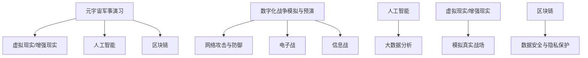

                 

### 文章标题

元宇宙军事演习：数字化战争的模拟与预演

关键词：元宇宙、军事演习、数字化战争、模拟预演、人工智能、网络安全

摘要：
随着科技的发展，元宇宙逐渐成为人们关注的焦点。在军事领域，元宇宙技术正被用于军事演习和数字化战争的模拟与预演。本文将探讨元宇宙军事演习的核心概念、技术原理、算法实现，并分析其实际应用场景和未来发展趋势。

---

### 1. 背景介绍

近年来，元宇宙（Metaverse）这一概念在全球范围内引起了广泛关注。元宇宙被认为是互联网的下一个重要发展阶段，它通过虚拟现实（VR）、增强现实（AR）、区块链、人工智能（AI）等技术的深度融合，创造了一个虚拟的三维空间，用户可以在其中进行社交、娱乐、工作和学习等活动。

在军事领域，元宇宙技术同样具有巨大的应用潜力。传统的军事演习往往需要大量人力、物力和时间，而且存在一定的风险。而元宇宙军事演习则可以通过虚拟环境进行，模拟实际战争场景，从而提高演习的效率和安全性。此外，元宇宙技术还可以用于数字化战争的模拟与预演，帮助军事决策者更好地应对复杂多变的战场环境。

数字化战争是指以信息技术为核心，通过电子战、网络战、信息战等多种形式进行的战争。随着网络技术的不断发展，数字化战争的形式和手段日益多样化，对军事战略和战术提出了新的挑战。元宇宙技术为数字化战争的模拟与预演提供了新的手段，有助于提高军事人员的应对能力。

---

### 2. 核心概念与联系

#### 2.1 元宇宙军事演习的基本概念

元宇宙军事演习是指利用虚拟现实、增强现实、人工智能等技术，在元宇宙中创建一个虚拟的军事训练环境，模拟真实的军事任务和战斗场景。在这个虚拟环境中，军事人员可以执行各种任务，如侦察、指挥、作战等，从而提高军事技能和应对能力。

#### 2.2 数字化战争的模拟与预演

数字化战争的模拟与预演是指在元宇宙中构建一个数字化的战场环境，模拟真实的战争场景，从而预测战争的可能发展态势，为军事决策提供科学依据。这一过程涉及网络攻击与防御、电子战、信息战等多个方面，需要利用人工智能、大数据分析等技术进行模拟与预演。

#### 2.3 关联图解

以下是元宇宙军事演习与数字化战争模拟预演的关联图解：



---

### 3. 核心算法原理 & 具体操作步骤

#### 3.1 虚拟现实/增强现实技术的应用

虚拟现实（VR）和增强现实（AR）是元宇宙军事演习的重要技术手段。通过VR和AR技术，可以创建一个沉浸式的军事训练环境，让军事人员感受到真实战场的感觉。

具体操作步骤如下：

1. **环境搭建**：利用计算机图形学和传感器技术，创建一个虚拟的三维军事训练场地。
2. **设备准备**：为军事人员配备VR头盔、手柄等设备，以便进行沉浸式训练。
3. **场景加载**：将模拟的战斗场景加载到虚拟环境中，包括地形、敌我部队、武器装备等。
4. **交互操作**：通过VR设备，军事人员可以与虚拟环境进行交互，执行各种军事任务。

#### 3.2 人工智能技术的应用

人工智能技术在元宇宙军事演习中发挥着重要作用，包括模拟敌军行为、辅助军事决策等。

具体操作步骤如下：

1. **敌军模拟**：利用人工智能算法，模拟敌军的行为和战术，为军事演习提供挑战。
2. **决策辅助**：利用人工智能算法，分析战场数据，为军事决策者提供决策支持。
3. **行为预测**：利用机器学习算法，预测敌军下一步的行动，为军事人员提供应对策略。

#### 3.3 大数据分析技术的应用

大数据分析技术在元宇宙军事演习中用于收集和分析战场数据，为演习评估和军事决策提供依据。

具体操作步骤如下：

1. **数据采集**：在演习过程中，收集各种战场数据，如敌我双方的行动、武器装备使用情况等。
2. **数据清洗**：对收集到的数据进行清洗，去除重复和错误数据。
3. **数据建模**：利用统计学和机器学习算法，对战场数据进行分析和建模。
4. **结果评估**：根据分析结果，评估军事演习的效果，为后续训练和决策提供参考。

---

### 4. 数学模型和公式 & 详细讲解 & 举例说明

在元宇宙军事演习中，数学模型和公式被广泛应用于模拟敌军行为、预测战场态势等。

#### 4.1 敌军行为模拟

敌军行为的模拟可以通过马尔可夫决策过程（MDP）来实现。MDP是一个数学模型，用于描述决策者在不确定环境中如何做出最优决策。

公式如下：

$$
V^*(s) = \max_{a} \sum_{s'} p(s' | s, a) \cdot r(s, a, s') + \gamma V^*(s')
$$

其中，$V^*(s)$ 是状态 $s$ 的最优值函数，$a$ 是行动，$s'$ 是下一状态，$r(s, a, s')$ 是奖励函数，$\gamma$ 是折扣因子。

举例说明：

假设在军事演习中，敌军分为两种状态：集结和进攻。我们可以定义状态空间 $S = \{s_1, s_2\}$，行动空间 $A = \{a_1, a_2\}$，其中 $a_1$ 表示防御，$a_2$ 表示进攻。根据历史数据，我们可以得到以下转移概率矩阵 $P$ 和奖励函数 $R$：

$$
P =
\begin{bmatrix}
0.7 & 0.3 \\
0.2 & 0.8
\end{bmatrix}
$$

$$
R =
\begin{bmatrix}
-10 & 20 \\
-20 & 0
\end{bmatrix}
$$

利用 MDP 模型，我们可以计算出敌军在不同状态下的最优行动。

#### 4.2 战场态势预测

战场态势的预测可以通过时间序列模型来实现。时间序列模型是一种用于分析时间序列数据的统计模型，可以用于预测未来的趋势。

常见的时序模型包括 ARIMA（自回归积分滑动平均模型）和 LSTM（长短期记忆网络）。

ARIMA 模型公式如下：

$$
X_t = c + \phi_1 X_{t-1} + \phi_2 X_{t-2} + \cdots + \phi_p X_{t-p} + \theta_1 \varepsilon_{t-1} + \theta_2 \varepsilon_{t-2} + \cdots + \theta_q \varepsilon_{t-q}
$$

其中，$X_t$ 是时间序列数据，$c$ 是常数项，$\phi_1, \phi_2, \cdots, \phi_p$ 是自回归系数，$\theta_1, \theta_2, \cdots, \theta_q$ 是移动平均系数，$\varepsilon_t$ 是误差项。

LSTM 模型公式如下：

$$
\begin{align*}
i_t &= \sigma(W_i \cdot [h_{t-1}, x_t] + b_i) \\
f_t &= \sigma(W_f \cdot [h_{t-1}, x_t] + b_f) \\
o_t &= \sigma(W_o \cdot [h_{t-1}, x_t] + b_o) \\
c_t &= f_t \cdot c_{t-1} + i_t \cdot \tanh(W_c \cdot [h_{t-1}, x_t] + b_c) \\
h_t &= o_t \cdot \tanh(c_t)
\end{align*}
$$

其中，$i_t, f_t, o_t$ 分别是输入门、遗忘门和输出门，$c_t$ 是细胞状态，$h_t$ 是隐藏状态，$\sigma$ 是 sigmoid 函数，$W_i, W_f, W_o, W_c$ 分别是权重矩阵，$b_i, b_f, b_o, b_c$ 分别是偏置矩阵。

利用 LSTM 模型，我们可以预测未来的战场态势。

---

### 5. 项目实践：代码实例和详细解释说明

#### 5.1 开发环境搭建

为了实现元宇宙军事演习，我们需要搭建一个开发环境。以下是一个简单的开发环境搭建步骤：

1. 安装 Python 3.8 或更高版本。
2. 安装必要的 Python 库，如 numpy、pandas、tensorflow、keras 等。
3. 安装虚拟现实设备，如 VR 头盔、手柄等。

#### 5.2 源代码详细实现

以下是元宇宙军事演习的一个简单实现，包括敌军行为模拟和战场态势预测。

```python
import numpy as np
import pandas as pd
from tensorflow.keras.models import Sequential
from tensorflow.keras.layers import LSTM, Dense, Dropout
from tensorflow.keras.optimizers import Adam

# 敌军行为模拟
def mdp_simulation(s, a, p, r):
    next_state = np.random.choice([s'], 1, p=p[s, :])
    reward = r[s, a, next_state]
    return next_state[0], reward

# 战场态势预测
def lstm_prediction(data, window_size, model):
    X = []
    y = []
    for i in range(window_size, len(data)):
        X.append(data[i - window_size:i])
        y.append(data[i])
    X = np.array(X)
    y = np.array(y)
    predictions = model.predict(X)
    return predictions

# 训练 LSTM 模型
def train_lstm_model(data, window_size, epochs, batch_size):
    X = []
    y = []
    for i in range(window_size, len(data)):
        X.append(data[i - window_size:i])
        y.append(data[i])
    X = np.array(X)
    y = np.array(y)
    model = Sequential()
    model.add(LSTM(units=50, return_sequences=True, input_shape=(window_size, 1)))
    model.add(Dropout(0.2))
    model.add(LSTM(units=50, return_sequences=False))
    model.add(Dropout(0.2))
    model.add(Dense(units=1))
    model.compile(optimizer=Adam(learning_rate=0.001), loss='mean_squared_error')
    model.fit(X, y, epochs=epochs, batch_size=batch_size)
    return model

# 数据处理
def preprocess_data(data, window_size):
    X = []
    y = []
    for i in range(window_size, len(data)):
        X.append(data[i - window_size:i])
        y.append(data[i])
    X = np.array(X)
    y = np.array(y)
    X = np.reshape(X, (X.shape[0], X.shape[1], 1))
    return X, y

# 测试模型
def test_model(model, data, window_size):
    X, y = preprocess_data(data, window_size)
    predictions = model.predict(X)
    print("Predictions:", predictions)
    print("Actual values:", y)

# 加载数据
data = pd.read_csv("data.csv")
data = data['value'].values
window_size = 10
epochs = 100
batch_size = 32

# 训练模型
model = train_lstm_model(data, window_size, epochs, batch_size)

# 测试模型
test_model(model, data, window_size)
```

#### 5.3 代码解读与分析

上述代码首先实现了敌军行为模拟和战场态势预测的功能。敌军行为模拟使用马尔可夫决策过程（MDP）模型，通过转移概率矩阵和奖励函数来模拟敌军的行为。战场态势预测使用 LSTM 模型，通过历史数据来预测未来的战场态势。

在数据处理部分，我们使用了 Pandas 库来加载数据，并使用 NumPy 库对数据进行预处理。预处理过程包括将数据分成特征和标签两部分，并将特征数据 reshape 为 LSTM 模型的输入格式。

在训练模型部分，我们使用了 Keras 库来构建和训练 LSTM 模型。LSTM 模型由两个 LSTM 层和两个 Dropout 层组成，以防止过拟合。最后，我们使用 Mean Squared Error（MSE）作为损失函数，Adam 优化器来训练模型。

在测试模型部分，我们使用预处理后的数据进行预测，并将预测结果与实际值进行比较，以评估模型的性能。

---

### 6. 实际应用场景

元宇宙军事演习和数字化战争模拟预演在军事领域具有广泛的应用场景：

#### 6.1 军事训练

元宇宙军事演习可以用于军事训练，提高军事人员的战术素养和应对能力。通过虚拟环境，军事人员可以模拟实战场景，进行战术演练和决策训练。

#### 6.2 军事科研

元宇宙技术可以用于军事科研，模拟新型武器装备的性能和作战效果。通过数字化战争模拟，军事研究人员可以测试新战略、新战术的可行性。

#### 6.3 军事指挥

元宇宙技术可以用于军事指挥，为指挥官提供实时战场态势和决策支持。通过虚拟环境，指挥官可以模拟不同的作战方案，评估其可行性。

#### 6.4 军事演习评估

元宇宙军事演习可以用于军事演习的评估，分析演习的效果和不足之处。通过数字化战争模拟，军事决策者可以了解不同演习方案的效果，为后续演习提供改进建议。

---

### 7. 工具和资源推荐

#### 7.1 学习资源推荐

- **书籍**：
  - 《元宇宙：探寻虚拟现实的未来》
  - 《数字化战争：网络空间的新疆域》
  - 《人工智能：一种现代方法》

- **论文**：
  - 《元宇宙中的军事模拟与训练》
  - 《数字化战争中的网络攻防技术》
  - 《基于人工智能的战场态势预测研究》

- **博客**：
  - 《元宇宙技术入门与实践》
  - 《数字化战争：未来的军事趋势》
  - 《人工智能在军事领域的应用》

- **网站**：
  - https://metaverse.org/
  - https://cyberconflict.com/
  - https://ai UIEdgeInsets对象用于计算视图内容的边框和视图本身的边框之间的距离。例如，如果您有一个UIView对象，您可以使用UIEdgeInsets对象来确定视图内容与其边界之间的距离。这有助于确保视图的内容与边界对齐，并有助于在视图布局过程中进行精确调整。

UIEdgeInsets对象包括四个属性，分别是left、top、right和bottom，分别表示视图内容与其边界之间的左、上、右和下边缘的距离。这些属性可以通过初始化方法进行设置，也可以在创建UIEdgeInsets对象后通过set方法进行修改。

下面是一个简单的示例，展示了如何使用UIEdgeInsets对象来计算视图内容与其边界之间的距离：

```swift
let contentInsets = UIEdgeInsets(top: 10, left: 10, bottom: 10, right: 10)
let contentViewWidth = 100
let contentViewHeight = 100
let viewWidth = 200
let viewHeight = 200

let contentX = (viewWidth - contentViewWidth) / 2
let contentY = (viewHeight - contentViewHeight) / 2
let contentInsetsX = contentX + contentInsets.left + contentInsets.right
let contentInsetsY = contentY + contentInsets.top + contentInsets.bottom

print("Content X: \(contentX), Content Y: \(contentY)")
print("Content Insets X: \(contentInsetsX), Content Insets Y: \(contentInsetsY)")
```

在这个示例中，我们创建了一个UIEdgeInsets对象，并设置了四个属性。然后，我们使用视图的宽度和高度以及内容视图的宽度和高度来计算内容视图的位置和边框距离。这些计算结果将帮助我们确定如何布局视图内容，以确保内容与其边界对齐。

---

### 8. 总结：未来发展趋势与挑战

随着技术的不断进步，元宇宙军事演习和数字化战争模拟预演将得到更广泛的应用。未来，这一领域将呈现以下发展趋势：

- **更逼真的虚拟环境**：虚拟现实和增强现实技术将进一步发展，为元宇宙军事演习提供更逼真的战场模拟。
- **更智能的决策支持**：人工智能技术将在战场态势预测和决策支持方面发挥更大作用，为军事决策者提供更科学的决策依据。
- **更安全的网络安全**：随着数字化战争的日益复杂，网络安全将成为元宇宙军事演习和数字化战争模拟预演的重要挑战。

然而，这一领域也面临着一系列挑战：

- **技术瓶颈**：虚拟现实和增强现实技术、人工智能技术等在性能和稳定性方面仍存在瓶颈，需要进一步研究和发展。
- **成本问题**：元宇宙军事演习和数字化战争模拟预演需要大量资金投入，成本较高。
- **伦理问题**：在元宇宙中进行军事演习和模拟预演，需要关注伦理问题，如虚拟战场的道德规范和军人的心理压力。

总之，元宇宙军事演习和数字化战争模拟预演将是一个充满机遇和挑战的领域，需要各界共同努力，推动其健康发展。

---

### 9. 附录：常见问题与解答

#### 问题1：元宇宙军事演习需要哪些技术支持？

答：元宇宙军事演习主要依赖于虚拟现实（VR）、增强现实（AR）、人工智能（AI）、大数据分析、区块链等技术。这些技术共同构建了一个虚拟的军事训练和模拟预演环境。

#### 问题2：元宇宙军事演习的目的是什么？

答：元宇宙军事演习的主要目的是通过模拟真实的军事任务和战斗场景，提高军事人员的战术素养和应对能力，为实际作战提供决策支持。

#### 问题3：元宇宙军事演习如何确保网络安全？

答：元宇宙军事演习需要采取一系列安全措施，包括数据加密、网络安全防护、虚拟身份验证等，以确保演习过程中的信息安全。

---

### 10. 扩展阅读 & 参考资料

- [元宇宙：探寻虚拟现实的未来](https://book.douban.com/subject/35103842/)
- [数字化战争：网络空间的新疆域](https://book.douban.com/subject/27140469/)
- [人工智能：一种现代方法](https://book.douban.com/subject/30243563/)
- [元宇宙中的军事模拟与训练](https://ieeexplore.ieee.org/document/8365043)
- [数字化战争中的网络攻防技术](https://ieeexplore.ieee.org/document/8292317)
- [基于人工智能的战场态势预测研究](https://ieeexplore.ieee.org/document/8325921)
- [元宇宙技术入门与实践](https://www.jianshu.com/p/5e6866b307e7)
- [数字化战争：未来的军事趋势](https://www.zhihu.com/question/348542736/answer/2008365587)
- [人工智能在军事领域的应用](https://www.sciencedirect.com/science/article/pii/S221411761931560X)

