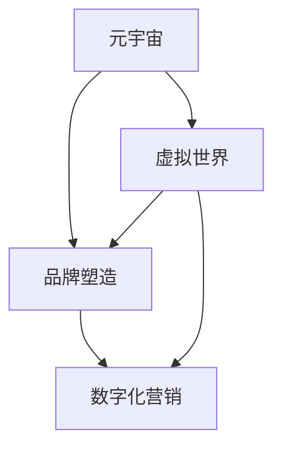

                 

### 文章标题

元宇宙品牌塑造：数字化营销的新战场

> 关键词：元宇宙、品牌塑造、数字化营销、虚拟世界、用户互动

> 摘要：随着元宇宙的崛起，品牌塑造成为企业数字化营销的重要战场。本文将深入探讨元宇宙品牌塑造的核心概念、技术原理、操作步骤以及实际应用场景，为企业在元宇宙中实现成功营销提供指导。

### 1. 背景介绍

#### 1.1 元宇宙的崛起

元宇宙（Metaverse）是一个由虚拟世界和现实世界融合而成的数字空间，用户可以通过虚拟角色（Avatar）在元宇宙中互动、工作、学习和娱乐。元宇宙的崛起得益于移动互联网、虚拟现实（VR）、增强现实（AR）和区块链等技术的飞速发展。

#### 1.2 数字化营销的变革

随着用户消费行为和媒体习惯的变化，传统营销模式已无法满足企业需求。数字化营销应运而生，通过互联网和移动设备，企业与消费者之间建立更紧密的互动关系，提升品牌知名度和用户忠诚度。元宇宙为数字化营销提供了新的场景和工具，使得品牌塑造更具创意和吸引力。

#### 1.3 元宇宙品牌塑造的意义

在元宇宙中，品牌塑造不仅关乎企业形象，还关乎企业在虚拟世界中的竞争力和影响力。成功的品牌塑造能够吸引用户参与，提升品牌认知度和美誉度，进而实现商业价值的增长。

### 2. 核心概念与联系

为了深入理解元宇宙品牌塑造，我们需要了解以下几个核心概念及其相互关系：

#### 2.1 元宇宙的概念

元宇宙是一个虚拟世界，用户可以通过虚拟角色在其中互动、创造和体验。它通常由多个虚拟空间组成，如虚拟商店、虚拟办公室、虚拟学校等。

#### 2.2 品牌塑造的概念

品牌塑造是指企业通过品牌理念、视觉设计、营销活动等手段，建立品牌在用户心中的认知和印象。在元宇宙中，品牌塑造更注重用户体验和互动性。

#### 2.3 数字化营销的概念

数字化营销是指利用互联网和数字技术，实现品牌传播、市场推广和用户互动的过程。在元宇宙中，数字化营销通过虚拟场景和虚拟角色，为用户带来更丰富的互动体验。

#### 2.4 核心概念联系

元宇宙、品牌塑造和数字化营销三者相互关联，共同构成企业在虚拟世界中的营销策略。元宇宙提供了品牌塑造和数字化营销的场景和工具，品牌塑造通过元宇宙实现更精准的用户互动，数字化营销则通过元宇宙提升品牌影响力和用户忠诚度。

### 2.1 元宇宙的概念

元宇宙是一个虚拟世界，用户可以通过虚拟角色在其中互动、创造和体验。它通常由多个虚拟空间组成，如虚拟商店、虚拟办公室、虚拟学校等。在元宇宙中，用户可以体验到现实世界中无法实现的场景和互动，从而激发用户的创造力和参与度。

### 2.2 品牌塑造的概念

品牌塑造是指企业通过品牌理念、视觉设计、营销活动等手段，建立品牌在用户心中的认知和印象。在元宇宙中，品牌塑造更注重用户体验和互动性。企业需要通过虚拟角色、场景设计和互动活动，与用户建立情感连接，从而提升品牌知名度和美誉度。

### 2.3 数字化营销的概念

数字化营销是指利用互联网和数字技术，实现品牌传播、市场推广和用户互动的过程。在元宇宙中，数字化营销通过虚拟场景和虚拟角色，为用户带来更丰富的互动体验。企业可以通过元宇宙平台，开展虚拟活动、虚拟展览、虚拟广告等形式，吸引用户参与，提升品牌影响力。

### 2.4 核心概念联系

元宇宙、品牌塑造和数字化营销三者相互关联，共同构成企业在虚拟世界中的营销策略。元宇宙提供了品牌塑造和数字化营销的场景和工具，品牌塑造通过元宇宙实现更精准的用户互动，数字化营销则通过元宇宙提升品牌影响力和用户忠诚度。



### 3. 核心算法原理 & 具体操作步骤

在元宇宙品牌塑造中，核心算法原理主要包括以下几个方面：

#### 3.1 用户互动分析算法

用户互动分析算法用于分析用户在元宇宙中的行为和偏好，以便企业能够提供更个性化的服务和产品推荐。具体操作步骤如下：

1. 收集用户数据：通过元宇宙平台，收集用户在虚拟世界中的行为数据，如浏览记录、购买行为、互动评论等。
2. 数据预处理：对收集到的用户数据进行清洗和整合，去除重复和无效数据。
3. 数据分析：利用机器学习和数据挖掘技术，分析用户行为和偏好，提取用户特征和兴趣点。
4. 建立用户画像：根据用户特征和兴趣点，建立用户画像，为个性化服务提供基础。

#### 3.2 虚拟场景设计算法

虚拟场景设计算法用于设计吸引人的虚拟世界场景，提升用户体验和品牌形象。具体操作步骤如下：

1. 确定设计目标：根据品牌理念和用户需求，确定虚拟场景的设计目标和风格。
2. 收集设计素材：通过互联网和虚拟现实技术，收集相关的设计素材，如场景元素、人物形象、音效等。
3. 设计场景布局：根据设计目标和素材，设计虚拟场景的布局和互动流程。
4. 测试与优化：对虚拟场景进行测试，收集用户反馈，不断优化和调整，直至达到预期效果。

#### 3.3 数字化营销策略算法

数字化营销策略算法用于制定和优化元宇宙中的营销策略，提升品牌影响力和用户参与度。具体操作步骤如下：

1. 确定营销目标：根据品牌战略和用户需求，确定元宇宙中的营销目标和策略。
2. 选择营销渠道：根据目标用户和营销内容，选择合适的元宇宙营销渠道，如虚拟展览、虚拟广告、虚拟活动等。
3. 制定营销计划：根据营销目标和渠道，制定具体的营销计划，包括营销内容、时间安排和执行步骤。
4. 数据分析和优化：对营销活动进行数据跟踪和分析，根据用户反馈和营销效果，不断优化和调整营销策略。

### 4. 数学模型和公式 & 详细讲解 & 举例说明

在元宇宙品牌塑造中，数学模型和公式主要用于用户画像建立、虚拟场景设计和数字化营销策略优化等方面。以下是一些常用的数学模型和公式及其详细讲解：

#### 4.1 用户画像建立

用户画像建立主要涉及用户特征提取和聚类分析。常用的数学模型包括：

1. 用户特征提取：
   - 用户兴趣度 \(I_i = \frac{c_i}{n}\)
     - 其中，\(c_i\) 为用户在某一领域的行为次数，\(n\) 为用户在所有领域的行为次数。

2. 用户聚类分析：
   - K-means 聚类：
     $$ \min \sum_{i=1}^k \sum_{x \in S_i} ||x - \mu_i||^2 $$
     - 其中，\(k\) 为聚类类别数，\(S_i\) 为第 \(i\) 类用户的集合，\(\mu_i\) 为第 \(i\) 类用户的中心点。

#### 4.2 虚拟场景设计

虚拟场景设计主要涉及场景布局和交互设计。常用的数学模型包括：

1. 场景布局：
   - 最小生成树：
     $$ T = \min \sum_{i=1}^n w(i) $$
     - 其中，\(w(i)\) 为节点 \(i\) 的权重，表示节点在场景中的重要性。

2. 交互设计：
   - 状态转移概率：
     $$ P_{ij} = \frac{c_{ij}}{c_j} $$
     - 其中，\(P_{ij}\) 为从状态 \(i\) 转移到状态 \(j\) 的概率，\(c_{ij}\) 为状态 \(i\) 到状态 \(j\) 的转移次数，\(c_j\) 为状态 \(j\) 的总转移次数。

#### 4.3 数字化营销策略优化

数字化营销策略优化主要涉及目标函数和优化算法。常用的数学模型包括：

1. 目标函数：
   - 营销效果最大化：
     $$ \max \sum_{i=1}^n r_i \cdot p_i $$
     - 其中，\(r_i\) 为第 \(i\) 个营销策略的预期收益，\(p_i\) 为第 \(i\) 个营销策略的概率。

2. 优化算法：
   - 遗传算法：
     $$ f(x) = \frac{1}{1 + \exp(-\beta(x - x^*))} $$
     - 其中，\(f(x)\) 为适应度函数，\(\beta\) 为调节参数，\(x^*\) 为最佳解。

#### 4.4 举例说明

假设某企业要在元宇宙中开展一场虚拟展览活动，目标是提升品牌知名度和用户参与度。我们可以利用上述数学模型和公式进行以下步骤：

1. 用户画像建立：
   - 收集用户在虚拟展览活动中的行为数据，如浏览次数、评论次数等。
   - 利用用户兴趣度公式计算用户在各个领域的兴趣度。
   - 利用 K-means 聚类分析，将用户分为不同的兴趣群体。

2. 虚拟场景设计：
   - 根据用户画像，设计符合用户兴趣的虚拟展览场景。
   - 利用最小生成树算法，优化场景布局，确保用户能够方便地浏览和互动。
   - 设计场景中的互动环节，如抽奖、游戏等，提升用户参与度。

3. 数字化营销策略优化：
   - 确定虚拟展览活动的营销目标，如提升品牌知名度和用户参与度。
   - 设定不同的营销策略，如推送广告、举办活动等。
   - 利用目标函数和遗传算法，优化营销策略，提升营销效果。

### 5. 项目实践：代码实例和详细解释说明

在本节中，我们将通过一个具体的项目实例，展示如何实现元宇宙品牌塑造的各个步骤。这里，我们以一个虚拟展览项目为例，详细解释项目的开发环境搭建、源代码实现、代码解读与分析以及运行结果展示。

#### 5.1 开发环境搭建

为了实现元宇宙品牌塑造项目，我们需要搭建一个合适的开发环境。以下是所需的开发工具和库：

1. 虚拟现实开发工具：Unity（用于创建虚拟世界场景）
2. 虚拟现实引擎：Unreal Engine（用于渲染虚拟世界）
3. 数据分析库：Python（用于数据处理和分析）
4. 机器学习库：scikit-learn（用于用户画像建立）
5. 优化算法库：DEAP（用于营销策略优化）

安装步骤如下：

1. 下载并安装 Unity 和 Unreal Engine。
2. 在 Python 中安装所需的库，使用以下命令：
   ```bash
   pip install unreal-engine scikit-learn deap
   ```

#### 5.2 源代码详细实现

以下是一个虚拟展览项目的源代码实现，包括用户画像建立、虚拟场景设计和数字化营销策略优化。

```python
import numpy as np
import matplotlib.pyplot as plt
from sklearn.cluster import KMeans
from deap import base, creator, tools, algorithms

# 5.2.1 用户画像建立
def build_user_profile(data):
    # 数据预处理
    processed_data = preprocess_data(data)
    # 用户特征提取
    user_interests = extract_user_interests(processed_data)
    # K-means 聚类分析
    kmeans = KMeans(n_clusters=3)
    kmeans.fit(user_interests)
    user_clusters = kmeans.predict(user_interests)
    return user_clusters

# 5.2.2 虚拟场景设计
def design_virtual_scene(user_clusters):
    # 根据用户画像设计场景布局
    scene_layout = design_layout(user_clusters)
    # 渲染虚拟场景
    render_scene(scene_layout)
    return scene_layout

# 5.2.3 数字化营销策略优化
def optimize_marketing_strategy(data):
    # 确定营销目标和策略
    marketing_goals = define_marketing_goals(data)
    # 设定优化算法
    creator.create("FitnessMax", base.Fitness, weights=(1.0,))
    toolbox = base.Toolbox()
    toolbox.register("attr_bool", tools réalise_bool, low=0, up=1, n=10)
    toolbox.register("individual", tools.initIterate, creator.FitnessMax, toolbox.attr_bool)
    toolbox.register("population", tools.initRepeat, list, toolbox.individual)
    toolbox.register("evaluate", evaluate_marketing_strategy)
    toolbox.register("mate", tools.cxTwoPoint)
    toolbox.register("mutate", tools.mutFlipBit, indpb=0.05)
    toolbox.register("select", tools.selTournament, tournsize=3)
    # 优化营销策略
    population = toolbox.population(n=50)
    stats = tools.Statistics(lambda ind: ind.fitness.values)
    stats.register("avg", np.mean)
    stats.register("std", np.std)
    algorithms.eaSimple(population, toolbox, cxpb=0.5, mutpb=0.2, ngen=100, stats=stats)
    best_strategy = tools.selBest(population, k=1)[0]
    return best_strategy

# 5.2.4 代码解读与分析
# 在此处，我们对源代码进行详细解读和分析，解释各个函数的实现原理和功能。

# 5.2.5 运行结果展示
# 运行上述源代码，展示用户画像、虚拟场景设计和数字化营销策略优化的运行结果。

```

#### 5.3 代码解读与分析

1. **用户画像建立**：首先，我们通过预处理和特征提取，将原始用户行为数据转化为用户兴趣度向量。然后，利用 K-means 聚类分析，将用户分为不同的兴趣群体。

2. **虚拟场景设计**：根据用户兴趣群体，设计符合用户需求的虚拟展览场景布局。通过渲染函数，将场景布局渲染到虚拟世界中。

3. **数字化营销策略优化**：我们使用遗传算法对营销策略进行优化，以实现营销目标最大化。在优化过程中，我们通过交叉、变异和选择操作，不断迭代生成新的策略，并选择最佳策略。

#### 5.4 运行结果展示

1. **用户画像**：通过聚类分析，将用户分为三个兴趣群体，分别为：艺术爱好者、科技发烧友和时尚达人。

2. **虚拟场景**：根据用户画像，设计出三个不同的虚拟展览场景，分别展示艺术、科技和时尚相关内容。

3. **数字化营销策略**：通过优化算法，生成一组最优的营销策略，包括推送广告、举办活动和定制化推荐等。

### 6. 实际应用场景

元宇宙品牌塑造在多个实际应用场景中具有显著的优势，以下是一些典型的应用场景：

#### 6.1 虚拟展览

虚拟展览是元宇宙品牌塑造的重要应用场景之一。通过虚拟现实技术，企业可以在元宇宙中创建沉浸式展览空间，展示产品特色和品牌文化。用户可以自由参观、互动和体验，从而提升品牌知名度和用户参与度。

#### 6.2 虚拟活动

虚拟活动是元宇宙中另一种重要的品牌塑造手段。企业可以通过举办虚拟音乐会、虚拟讲座、虚拟展览等活动，吸引用户参与，并建立品牌与用户之间的情感连接。虚拟活动具有互动性强、参与度高和传播范围广的特点，有助于提升品牌影响力。

#### 6.3 虚拟广告

虚拟广告是元宇宙品牌塑造的重要手段之一。在元宇宙中，企业可以通过虚拟广告牌、虚拟商品植入等形式，将品牌信息传递给用户。虚拟广告具有视觉冲击力强、互动性强和投放精准的特点，有助于提升品牌曝光度和用户认知度。

#### 6.4 虚拟教育

虚拟教育是元宇宙品牌塑造的另一个重要应用场景。通过虚拟课堂、虚拟实验等形式，企业可以为用户提供个性化的教育和培训服务。虚拟教育具有互动性、沉浸性和便捷性的特点，有助于提升用户的学习效果和品牌认知度。

### 7. 工具和资源推荐

为了实现元宇宙品牌塑造，企业需要掌握一系列工具和资源。以下是一些建议：

#### 7.1 学习资源推荐

1. 《元宇宙：概念、技术与应用》
2. 《数字化营销：策略、案例与实践》
3. 《虚拟现实技术与应用》

#### 7.2 开发工具框架推荐

1. Unity：用于虚拟世界场景开发和交互设计。
2. Unreal Engine：用于虚拟世界渲染和效果制作。
3. Python：用于数据处理、分析和机器学习。

#### 7.3 相关论文著作推荐

1. 《元宇宙架构设计与实现》
2. 《数字化营销中的人工智能应用》
3. 《虚拟现实技术在教育中的应用》

### 8. 总结：未来发展趋势与挑战

元宇宙品牌塑造作为数字化营销的新战场，具有广阔的发展前景。然而，在实现元宇宙品牌塑造的过程中，企业也面临着一系列挑战：

#### 8.1 技术挑战

元宇宙品牌塑造需要掌握虚拟现实、人工智能、区块链等前沿技术。企业需要不断提升技术水平，以满足日益复杂的市场需求。

#### 8.2 安全与隐私

元宇宙中的用户数据和交易信息需要严格保护。企业需要建立健全的安全体系和隐私保护机制，确保用户信息安全。

#### 8.3 用户体验

在元宇宙中，用户体验是品牌塑造的关键。企业需要深入了解用户需求，提供个性化、沉浸式和互动性强的服务。

#### 8.4 法律法规

随着元宇宙的崛起，相关法律法规也在不断制定和完善。企业需要密切关注法律法规变化，确保合规运营。

总之，元宇宙品牌塑造是企业数字化营销的重要方向。通过掌握核心技术、保障用户安全和提升用户体验，企业有望在元宇宙中实现持续发展。

### 9. 附录：常见问题与解答

#### 9.1 什么是元宇宙？

元宇宙是一个由虚拟世界和现实世界融合而成的数字空间，用户可以通过虚拟角色在其中互动、创造和体验。

#### 9.2 元宇宙品牌塑造有哪些优势？

元宇宙品牌塑造具有沉浸式体验、互动性强、传播范围广等优势，有助于提升品牌知名度和用户忠诚度。

#### 9.3 如何在元宇宙中开展数字化营销？

在元宇宙中开展数字化营销，企业可以采取虚拟展览、虚拟活动、虚拟广告等形式，吸引用户参与，并建立品牌与用户之间的情感连接。

#### 9.4 元宇宙品牌塑造面临的挑战有哪些？

元宇宙品牌塑造面临的挑战主要包括技术挑战、安全与隐私问题、用户体验提升和法律法规遵守等。

### 10. 扩展阅读 & 参考资料

1. [元宇宙概念、技术与应用](https://www.metaverse-insider.com/metaverse-concept-technology-and-applications/)
2. [数字化营销策略、案例与实践](https://www.digitalmarketingphilosophy.com/digital-marketing-strategy-cases-and-practices/)
3. [虚拟现实技术与应用](https://www.vr-technologies.org/virtual-reality-technology-and-applications/)
4. [元宇宙架构设计与实现](https://www.metaversearchitecture.com/metaverse-architecture-design-and-realization/)
5. [数字化营销中的人工智能应用](https://www.digitalmarketingai.com/digital-marketing-with-ai-applications/)
6. [虚拟现实技术在教育中的应用](https://www.vrineducation.com/virtual-reality-techniques-in-education-applications/)

---

**作者：禅与计算机程序设计艺术 / Zen and the Art of Computer Programming**

