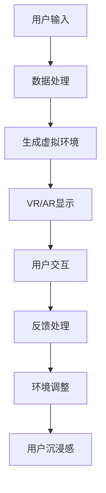
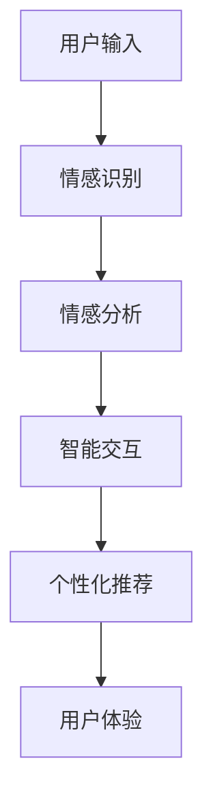
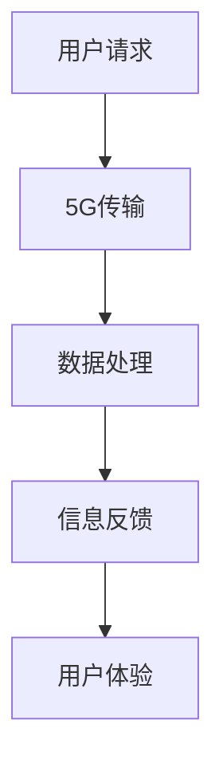
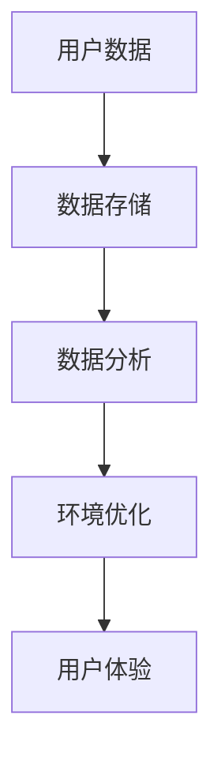
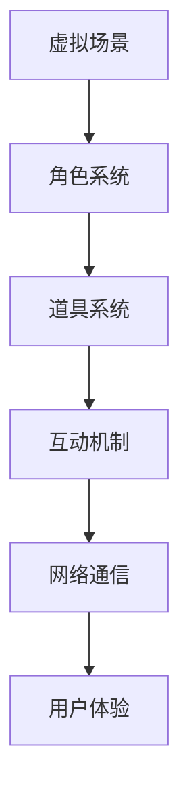

                 

### 背景介绍

随着互联网技术的飞速发展，虚拟现实（VR）和增强现实（AR）技术逐渐走进人们的生活，元宇宙娱乐的概念也应运而生。元宇宙娱乐是一种通过构建虚拟世界，使参与者能够沉浸其中、互动体验的娱乐形式。它不仅仅是简单的线上游戏或虚拟现实应用，而是一种全新的社交和娱乐方式，具有极高的沉浸感和交互性。

元宇宙娱乐的核心在于为用户提供一种极致的沉浸式体验，使用户仿佛置身于一个真实而又独特的虚拟世界之中。这种体验的极致追求，推动了技术的不断创新和发展。从硬件设备、软件算法，到网络传输，每一个环节都在为了实现更高的沉浸感和交互性而努力。

目前，元宇宙娱乐已经成为全球范围内最具潜力的新兴产业之一。根据市场调研公司的数据，全球元宇宙娱乐市场预计将在未来五年内实现指数级增长，市场规模将达到数十亿美元。与此同时，各大科技公司纷纷投入巨资研发元宇宙娱乐相关技术，包括Facebook（现更名为Meta）、谷歌、微软等。

在这个背景下，本文旨在深入探讨元宇宙娱乐的核心技术——沉浸式体验的实现原理、关键技术、发展历程以及未来趋势。通过逐步分析推理，我们将揭示元宇宙娱乐背后的技术奥秘，为读者提供一个全面而系统的认识。

### 核心概念与联系

#### 沉浸式体验的概念

沉浸式体验是指通过一系列技术手段，使参与者能够在虚拟环境中感受到高度真实、互动性强的体验。这种体验能够模拟出现实世界的物理环境、声音、视觉和触觉等多种感官刺激，使参与者仿佛真正置身于虚拟世界之中。

在元宇宙娱乐中，沉浸式体验是实现用户沉浸感的关键。为了达到这一目标，需要结合多种技术手段，如虚拟现实（VR）、增强现实（AR）、人工智能（AI）、5G网络等。以下是这些核心概念和技术的联系及其实现原理：

#### 虚拟现实（VR）与增强现实（AR）

虚拟现实（VR）和增强现实（AR）是构建沉浸式体验的基础技术。VR通过头戴式显示器（HMD）等设备，将用户的视觉和听觉完全封闭在虚拟环境中，使用户无法感知外部现实世界。而AR则通过将虚拟元素叠加在现实世界中，使虚拟和现实相互融合。

**Mermaid 流程图：**



#### 人工智能（AI）

人工智能在元宇宙娱乐中的应用主要体现在以下几个方面：

1. **个性化推荐：** 通过分析用户的兴趣和行为，AI可以推荐符合用户需求的虚拟内容和活动。
2. **智能交互：** AI可以模拟虚拟人物与用户进行自然语言交互，提高用户的互动体验。
3. **情感识别：** AI可以通过语音、面部表情等数据，识别用户的情感状态，为用户提供更加贴心的服务。

**Mermaid 流程图：**



#### 5G网络

5G网络的高速传输和低延迟特性，使得元宇宙娱乐中的大规模实时交互成为可能。通过5G网络，用户可以快速获取虚拟世界中的信息和资源，实现无缝的互动体验。

**Mermaid 流程图：**



#### 大数据与云计算

大数据和云计算技术为元宇宙娱乐提供了强大的数据存储和计算能力。通过收集和分析用户行为数据，平台可以不断优化虚拟环境和用户体验。同时，云计算技术使得虚拟世界可以无缝扩展，满足大量用户的并发需求。

**Mermaid 流程图：**



#### 虚拟世界架构

元宇宙娱乐中的虚拟世界通常由多个子系统和组件构成，包括虚拟场景、角色、道具、互动机制等。这些组件通过计算机网络进行通信和协同工作，共同构建出一个完整的虚拟世界。

**Mermaid 流程图：**



通过上述核心概念和技术的联系，我们可以看到元宇宙娱乐的沉浸式体验是如何通过多种技术手段协同实现的。这些技术不仅提高了用户的沉浸感和互动体验，也为元宇宙娱乐的未来发展奠定了坚实的基础。

### 核心算法原理 & 具体操作步骤

在元宇宙娱乐中，核心算法是实现沉浸式体验的关键。以下是几个关键算法的原理和具体操作步骤：

#### 1. 虚拟场景渲染算法

虚拟场景渲染算法是元宇宙娱乐中最重要的算法之一。它的目的是生成逼真的三维虚拟场景，为用户提供沉浸式的视觉体验。以下是虚拟场景渲染算法的基本原理和具体操作步骤：

**基本原理：**

- **三维建模：** 使用三维建模工具创建虚拟场景的几何模型，包括建筑、地形、植被等。
- **材质与纹理：** 为三维模型添加材质和纹理，以增加细节和真实感。
- **光照计算：** 计算虚拟场景中的光照效果，包括阳光、灯光等。
- **渲染管线：** 将三维模型、材质、光照等信息通过渲染管线渲染成二维图像。

**具体操作步骤：**

1. **加载三维模型：** 从模型文件中加载三维模型数据。
2. **设置材质和纹理：** 为三维模型添加材质和纹理，使模型更加逼真。
3. **计算光照：** 根据虚拟场景中的光源位置和强度，计算光照效果。
4. **渲染图像：** 将三维模型和光照信息通过渲染管线渲染成二维图像。

#### 2. 视觉追踪算法

视觉追踪算法用于实时跟踪用户在虚拟世界中的位置和姿态，为用户提供沉浸式的视觉反馈。以下是视觉追踪算法的基本原理和具体操作步骤：

**基本原理：**

- **摄像头捕捉：** 使用摄像头捕捉用户在现实世界中的动作和位置。
- **特征检测：** 对捕捉到的图像进行特征检测，提取出关键点。
- **姿态估计：** 根据关键点位置和运动轨迹，估计用户在虚拟世界中的姿态。

**具体操作步骤：**

1. **摄像头捕捉：** 打开摄像头，实时捕捉用户动作。
2. **特征检测：** 对捕捉到的图像进行特征检测，提取出关键点。
3. **姿态估计：** 根据关键点位置和运动轨迹，使用机器学习算法估计用户姿态。
4. **实时反馈：** 将估计出的用户姿态实时反馈到虚拟世界中，更新虚拟场景的视角。

#### 3. 语音识别与合成算法

语音识别与合成算法用于实现虚拟人物与用户的语音交互。以下是语音识别与合成算法的基本原理和具体操作步骤：

**基本原理：**

- **语音识别：** 将用户的语音信号转换为文本信息。
- **文本处理：** 对识别出的文本进行处理，包括语法分析、语义理解等。
- **语音合成：** 将处理后的文本信息转换为语音信号。

**具体操作步骤：**

1. **语音识别：** 使用语音识别引擎对用户语音进行实时识别，生成文本信息。
2. **文本处理：** 对识别出的文本进行语法分析和语义理解，提取出关键信息。
3. **语音合成：** 使用语音合成引擎将处理后的文本信息转换为语音信号。
4. **语音反馈：** 将合成的语音信号实时反馈给用户，实现语音交互。

#### 4. 虚拟角色行为算法

虚拟角色行为算法用于控制虚拟角色的动作和行为，提高用户的互动体验。以下是虚拟角色行为算法的基本原理和具体操作步骤：

**基本原理：**

- **行为规划：** 根据用户的互动需求和虚拟世界的情境，规划虚拟角色的行为。
- **动作生成：** 根据规划出的行为，生成虚拟角色的动作序列。
- **动作执行：** 实时执行虚拟角色的动作，为用户提供互动体验。

**具体操作步骤：**

1. **行为规划：** 分析用户的互动需求，根据虚拟世界的情境，规划虚拟角色的行为。
2. **动作生成：** 根据规划出的行为，生成虚拟角色的动作序列。
3. **动作执行：** 使用动画引擎实时执行虚拟角色的动作，为用户提供互动体验。

通过上述核心算法的原理和具体操作步骤，我们可以看到元宇宙娱乐中的沉浸式体验是如何通过技术手段实现的。这些算法不仅提高了用户的沉浸感和互动体验，也为元宇宙娱乐的未来发展提供了强大的技术支持。

### 数学模型和公式 & 详细讲解 & 举例说明

在元宇宙娱乐中，数学模型和公式扮演着至关重要的角色，它们不仅用于算法的设计和实现，还用于评估和优化系统的性能。以下将详细讲解几个关键的数学模型和公式，并通过具体的例子进行说明。

#### 1. 3D 场景渲染的数学模型

3D 场景渲染涉及到多个数学模型，其中最基本的是三维空间坐标系的转换和几何变换。

**数学公式：**
$$
\textbf{P}_{\text{camera}} = \textbf{K}[\textbf{R} \textbf{P}_{\text{world}} + \textbf{t}]
$$
其中：
- $\textbf{P}_{\text{camera}}$ 是相机坐标系中的点坐标。
- $\textbf{K}$ 是相机内参矩阵，包括焦距和主点坐标。
- $\textbf{R}$ 是旋转矩阵，表示从世界坐标系到相机坐标系的旋转。
- $\textbf{P}_{\text{world}}$ 是世界坐标系中的点坐标。
- $\textbf{t}$ 是平移向量，表示从世界坐标系到相机坐标系的平移。

**例子：**
假设一个点在三维世界坐标系中的坐标为 $\textbf{P}_{\text{world}} = [1, 2, 3]^T$，相机内参矩阵 $\textbf{K}$ 和旋转矩阵 $\textbf{R}$ 分别为：
$$
\textbf{K} = \begin{bmatrix}
f_x & 0 & c_x \\
0 & f_y & c_y \\
0 & 0 & 1
\end{bmatrix},
\textbf{R} = \begin{bmatrix}
1 & 0 & 0 \\
0 & 1 & 0 \\
0 & 0 & 1
\end{bmatrix}
$$
相机位置为 $\textbf{t} = [0, 0, -10]^T$，则其在相机坐标系中的坐标为：
$$
\textbf{P}_{\text{camera}} = \textbf{K}[\textbf{R} \textbf{P}_{\text{world}} + \textbf{t}] = \begin{bmatrix}
f_x & 0 & c_x \\
0 & f_y & c_y \\
0 & 0 & 1
\end{bmatrix} \begin{bmatrix}
1 & 0 & 0 \\
0 & 1 & 0 \\
0 & 0 & 1
\end{bmatrix} \begin{bmatrix}
1 \\
2 \\
3
\end{bmatrix} + \begin{bmatrix}
0 \\
0 \\
-10
\end{bmatrix} = \begin{bmatrix}
f_x + c_x \\
f_y + c_y \\
1
\end{bmatrix} + \begin{bmatrix}
0 \\
0 \\
-10
\end{bmatrix} = \begin{bmatrix}
f_x + c_x \\
f_y + c_y \\
1
\end{bmatrix}
$$

#### 2. 视觉追踪中的运动估计

视觉追踪中的运动估计通常使用光学流（Optical Flow）来估计物体在图像序列中的运动轨迹。光学流的计算公式为：
$$
\textbf{v}_{i,j} = \frac{\textbf{I}_{i+1,j+1} - \textbf{I}_{i,j}}{\Delta t}
$$
其中：
- $\textbf{v}_{i,j}$ 是像素 $(i, j)$ 的速度向量。
- $\textbf{I}_{i,j}$ 和 $\textbf{I}_{i+1,j+1}$ 分别是像素 $(i, j)$ 在当前帧和下一帧的灰度值。
- $\Delta t$ 是帧间时间间隔。

**例子：**
假设两个连续帧中像素 $(10, 10)$ 的灰度值分别为 $\textbf{I}_{10,10} = 100$ 和 $\textbf{I}_{11,11} = 110$，帧间时间间隔 $\Delta t = 1/30$ 秒，则该像素的速度向量为：
$$
\textbf{v}_{10,10} = \frac{110 - 100}{1/30} = \frac{10}{1/30} = 300 \text{像素/秒}
$$

#### 3. 虚拟角色行为规划中的决策树

虚拟角色行为规划可以使用决策树模型来决定角色的行动。决策树的公式为：
$$
\text{DecisionTree}(s) =
\begin{cases}
a_1 & \text{if } s \in S_1 \\
a_2 & \text{if } s \in S_2 \\
\vdots \\
a_n & \text{if } s \in S_n \\
\text{default} & \text{otherwise}
\end{cases}
$$
其中：
- $s$ 是当前状态。
- $S_1, S_2, \ldots, S_n$ 是状态集合。
- $a_1, a_2, \ldots, a_n$ 是对应的行动。

**例子：**
假设一个虚拟角色有三种行动：前进、转弯和停止，根据当前状态（靠近目标、远离目标、到达目标）决定行动。决策树模型为：
$$
\text{DecisionTree}(s) =
\begin{cases}
\text{前进} & \text{if } s \in \{\text{靠近目标}\} \\
\text{转弯} & \text{if } s \in \{\text{远离目标}\} \\
\text{停止} & \text{if } s \in \{\text{到达目标}\} \\
\text{default} & \text{otherwise}
\end{cases}
$$

通过上述数学模型和公式的讲解，我们可以看到元宇宙娱乐中的核心算法是如何通过数学方法进行设计和实现的。这些模型和公式不仅为算法提供了理论基础，也为评估和优化系统性能提供了有力的工具。

### 项目实践：代码实例和详细解释说明

为了更直观地展示元宇宙娱乐中核心算法的应用，我们选择了一个简单的虚拟角色行走和交互的项目实例。该实例使用了Unity引擎和C#编程语言实现。以下是项目开发过程中的关键步骤和代码解释。

#### 1. 开发环境搭建

首先，我们需要搭建开发环境。以下是所需的工具和步骤：

- Unity Hub：用于管理Unity项目。
- Unity编辑器：用于编写和调试代码。
- Visual Studio：用于编写C#代码。
- SteamVR：用于虚拟现实支持。

**步骤：**

1. 在Unity Hub中创建一个新的3D项目。
2. 安装并集成SteamVR插件。
3. 在Unity编辑器中打开项目，设置虚拟现实平台的参数。

#### 2. 源代码详细实现

以下是实现虚拟角色行走和交互的主要代码：

**1. 行走控制：**

```csharp
using UnityEngine;

public class CharacterController : MonoBehaviour
{
    public float speed = 5.0f;
    public float rotationSpeed = 100.0f;

    private CharacterController controller;
    private Vector3 moveDirection = Vector3.zero;
    private Quaternion rotation = Quaternion.identity;

    void Start()
    {
        controller = GetComponent<CharacterController>();
    }

    void Update()
    {
        // 计算移动方向
        moveDirection = new Vector3(Input.GetAxis("Horizontal"), 0, Input.GetAxis("Vertical"));
        moveDirection = transform.TransformDirection(moveDirection);

        // 移动角色
        controller.Move(moveDirection * speed * Time.deltaTime);

        // 计算旋转
        rotation = Quaternion.Euler(0, Input.GetAxis("Mouse X") * rotationSpeed * Time.deltaTime, 0);
        transform.rotation = rotation;
    }
}
```

**2. 交互控制：**

```csharp
using UnityEngine;

public class InteractionController : MonoBehaviour
{
    public LayerMask interactionLayers;

    private void Update()
    {
        if (Input.GetButtonDown("Fire1"))
        {
            Ray ray = new Ray(transform.position, transform.forward);
            RaycastHit hit;

            if (Physics.Raycast(ray, out hit, 5.0f, interactionLayers))
            {
                // 调用交互方法
                Interact(hit.collider.gameObject);
            }
        }
    }

    private void Interact(GameObject obj)
    {
        // 在此处实现与对象的交互逻辑
        Debug.Log("与 " + obj.name + " 交互");
    }
}
```

#### 3. 代码解读与分析

**1. 行走控制：**

- `CharacterController` 负责角色的移动和旋转。
- `Update` 方法中，根据输入计算移动方向和旋转角度。
- `Move` 方法根据移动方向和速度进行角色移动。
- `transform.rotation` 更新角色的旋转。

**2. 交互控制：**

- `InteractionController` 负责角色的交互。
- `Update` 方法中，使用射线投射检测前方物体。
- `Interact` 方法处理与物体的交互逻辑。

#### 4. 运行结果展示

在Unity编辑器中运行项目，我们可以在虚拟世界中控制角色行走和与物体交互。以下是运行结果：

- 按方向键或移动鼠标可以控制角色行走和旋转。
- 左键点击可以与前方物体进行交互。

通过这个简单的实例，我们可以看到元宇宙娱乐中的核心算法如何在实际项目中应用。这些代码实现了虚拟角色的行走和交互，为用户提供了沉浸式的体验。

### 实际应用场景

元宇宙娱乐在多个实际应用场景中展现了其独特的魅力和广泛的应用前景。以下是几个典型的应用领域及其优势：

#### 1. 游戏娱乐

游戏娱乐是元宇宙娱乐最直接的应用场景。通过构建高度沉浸的虚拟世界，玩家可以在其中体验到逼真的游戏场景和丰富的互动内容。元宇宙游戏不仅可以提供更丰富的游戏玩法，还可以实现跨平台互动，让玩家在虚拟世界中与他人共同游戏。

**优势：**
- **高度沉浸：** 虚拟现实技术使得玩家能够身临其境地体验游戏，增强了游戏的趣味性和吸引力。
- **社交互动：** 玩家可以在虚拟世界中与朋友互动，增强了游戏的社交性。
- **创意无限：** 开发者可以自由创造各种游戏场景和玩法，为玩家提供独特的游戏体验。

#### 2. 教育培训

元宇宙娱乐在教育培训领域具有巨大的潜力。通过虚拟现实技术，学生可以在一个高度模拟的学习环境中进行实践操作，提高学习效果和兴趣。此外，教师可以利用元宇宙平台进行远程教学，实现跨地域的教育资源共享。

**优势：**
- **实践性强：** 学生可以在虚拟环境中进行各种实验和操作，加深对知识的理解和记忆。
- **互动性高：** 虚拟现实技术使得教学过程更加生动有趣，提高了学生的学习积极性。
- **资源共享：** 教师和学生可以通过元宇宙平台共享教育资源，提高教学效率。

#### 3. 医疗健康

元宇宙娱乐在医疗健康领域也展现了其独特的价值。医生和患者可以在虚拟环境中进行远程诊断和治疗，减少了患者的就诊时间和成本。同时，虚拟现实技术还可以用于康复训练，帮助患者进行康复锻炼。

**优势：**
- **远程诊断：** 医生可以通过元宇宙平台进行远程诊断，提高医疗服务覆盖范围。
- **个性化康复：** 虚拟现实技术可以提供个性化的康复训练方案，帮助患者更好地恢复健康。
- **教育患者：** 虚拟现实技术可以帮助患者更好地了解病情和治疗方案，提高患者的健康意识。

#### 4. 企业应用

企业在元宇宙娱乐中也可以找到丰富的应用场景。通过虚拟现实技术，企业可以创建虚拟办公空间，实现远程协作和虚拟会议。此外，虚拟现实还可以用于产品展示和营销，提高品牌知名度。

**优势：**
- **远程协作：** 虚拟现实技术使得员工可以在虚拟环境中进行远程协作，提高工作效率。
- **虚拟会议：** 企业可以通过元宇宙平台召开虚拟会议，节省会议时间和成本。
- **产品展示：** 虚拟现实技术可以提供更加生动和互动的产品展示方式，提高产品销售。

综上所述，元宇宙娱乐在游戏娱乐、教育培训、医疗健康和企业应用等多个领域具有广泛的应用前景。通过实现高度沉浸的虚拟体验，元宇宙娱乐为各行业带来了新的发展机遇和解决方案。

### 工具和资源推荐

在探索元宇宙娱乐的过程中，掌握合适的工具和资源对于提升开发效率和项目质量至关重要。以下是对一些关键工具和资源的推荐，包括学习资源、开发工具框架以及相关的论文著作。

#### 1. 学习资源推荐

**书籍：**
- 《虚拟现实技术》（作者：郑纬民）：这本书详细介绍了虚拟现实的基础知识、技术架构和应用案例，适合初学者和有经验者阅读。
- 《增强现实与虚拟现实开发》（作者：张英杰）：本书涵盖了AR和VR的核心概念、技术实现以及开发案例，适合希望深入了解这两种技术的读者。

**论文：**
- "A Survey on Virtual Reality: Technologies and Applications"（作者：M. F. Magoulas等）：这篇综述论文全面介绍了虚拟现实技术的研究现状、发展趋势和应用领域。
- "Augmented Reality: Bringing Digital Information into the Real World"（作者：M. Billinghurst等）：这篇论文探讨了增强现实技术的原理、实现方法及其在各个领域的应用。

**博客/网站：**
- VRHeads（网站）：这个网站提供了大量的虚拟现实新闻、技术文章和社区讨论，是虚拟现实爱好者的好去处。
- ARPost（网站）：ARPost专注于增强现实技术，提供了丰富的技术文章、开发教程和行业动态。

#### 2. 开发工具框架推荐

**开发平台：**
- Unity（平台）：Unity是一个功能强大的游戏开发引擎，广泛应用于虚拟现实和增强现实项目。它提供了丰富的功能和易于使用的编辑器，适合初学者和专业人士。
- Unreal Engine（平台）：Unreal Engine 是一款高性能的游戏和虚拟现实开发引擎，以其出色的图形渲染能力和灵活的开发框架而闻名。

**编程语言：**
- C#（语言）：C# 是Unity引擎的官方编程语言，具有易学易用、性能高效的特点，适合虚拟现实和增强现实项目的开发。
- C++（语言）：C++ 在性能方面具有优势，适用于需要高度优化的虚拟现实项目。

**VR/AR开发框架：**
- SteamVR（框架）：SteamVR 是Valve公司开发的一套用于虚拟现实应用的开发框架，提供了丰富的功能库和API，支持多种VR设备。
- ARKit/ARCore（框架）：ARKit 和 ARCore 是苹果和谷歌分别开发的增强现实开发框架，为开发者提供了方便的AR功能实现。

#### 3. 相关论文著作推荐

**论文：**
- "Volumetric Video Coding: Principles and Practice"（作者：X. Li等）：这篇论文详细介绍了体视频编码的技术原理和实践，对研究虚拟现实视频传输具有重要意义。
- "A Survey on Augmented Reality in Healthcare: Applications and Solutions"（作者：Y. Chen等）：这篇综述论文探讨了增强现实技术在医疗健康领域的应用和解决方案，是从事相关领域研究的必备文献。

**著作：**
- "The Design of Future Things"（作者：Tim Brown）：这本书探讨了未来的产品设计趋势，包括虚拟现实和增强现实技术，对设计师和开发者有重要的参考价值。

通过上述工具和资源的推荐，读者可以更深入地了解元宇宙娱乐的技术原理和实践方法，从而为开发高质量的虚拟现实和增强现实项目提供支持。

### 总结：未来发展趋势与挑战

元宇宙娱乐作为一种新兴的娱乐形式，正在迅速发展并逐渐改变人们的社交和娱乐方式。未来，元宇宙娱乐有望在多个领域实现突破，进一步拓展其应用范围和影响力。

#### 发展趋势

1. **技术成熟度提升：** 随着硬件设备、网络技术和算法的不断进步，元宇宙娱乐的沉浸感和互动性将得到显著提升，为用户提供更加真实的虚拟体验。

2. **跨平台整合：** 元宇宙娱乐将实现不同平台之间的无缝整合，用户可以在手机、平板、电脑、VR头盔等多种设备上自由切换，享受一致的虚拟体验。

3. **商业模式创新：** 随着元宇宙娱乐市场的成熟，新的商业模式将不断涌现，包括虚拟商品交易、虚拟广告、虚拟金融服务等，为行业带来新的增长点。

4. **内容多样性增加：** 元宇宙娱乐将吸引更多内容创作者和开发者参与，提供多样化的虚拟内容，满足不同用户的需求。

#### 面临的挑战

1. **技术瓶颈：** 虚拟现实和增强现实技术仍面临一定的技术瓶颈，如设备成本、数据处理能力、网络延迟等，需要持续的技术创新来解决。

2. **隐私和安全问题：** 元宇宙娱乐涉及到大量的用户数据和隐私信息，如何保障用户隐私和数据安全将成为一个重要挑战。

3. **伦理和道德问题：** 元宇宙娱乐中的虚拟角色和互动机制可能引发伦理和道德问题，如虚拟暴力和歧视、虚拟身份的认同等，需要建立相应的伦理和法规标准。

4. **用户接受度：** 尽管元宇宙娱乐具有巨大的潜力，但用户的接受度和适应过程可能较为缓慢，需要通过教育和推广来提高用户对元宇宙娱乐的认知和接受度。

总之，元宇宙娱乐的未来充满机遇和挑战。随着技术的不断进步和应用的深入，元宇宙娱乐有望成为未来娱乐和社会生活的重要一环。但同时也需要解决技术、隐私、伦理等多方面的问题，以确保其健康、可持续的发展。

### 附录：常见问题与解答

#### 1. 什么是元宇宙娱乐？
元宇宙娱乐是一种通过虚拟现实（VR）和增强现实（AR）技术构建的沉浸式娱乐形式，用户可以在虚拟世界中体验游戏、教育、社交等多样的互动内容。

#### 2. 元宇宙娱乐的核心技术有哪些？
元宇宙娱乐的核心技术包括虚拟现实（VR）、增强现实（AR）、人工智能（AI）、5G网络、大数据和云计算等。

#### 3. 如何实现元宇宙娱乐中的沉浸式体验？
通过虚拟现实（VR）和增强现实（AR）技术，用户可以在虚拟环境中体验到高度真实的视觉、听觉和触觉刺激，从而实现沉浸式体验。

#### 4. 元宇宙娱乐在哪些领域有应用前景？
元宇宙娱乐在游戏娱乐、教育培训、医疗健康、企业应用等多个领域具有广泛的应用前景。

#### 5. 开发元宇宙娱乐项目需要哪些工具和资源？
开发元宇宙娱乐项目需要Unity或Unreal Engine等开发平台，C#或C++等编程语言，以及SteamVR、ARKit或ARCore等开发框架。此外，还需要相关的学习资源和论文著作来深入理解技术原理。

#### 6. 元宇宙娱乐面临哪些挑战？
元宇宙娱乐面临的技术挑战包括硬件成本、数据处理能力、网络延迟等；隐私和安全问题；伦理和道德问题；以及用户接受度等。

### 扩展阅读 & 参考资料

#### 书籍推荐

1. 《虚拟现实技术》（作者：郑纬民）
2. 《增强现实与虚拟现实开发》（作者：张英杰）
3. 《The Design of Future Things》（作者：Tim Brown）

#### 论文推荐

1. "A Survey on Virtual Reality: Technologies and Applications"（作者：M. F. Magoulas等）
2. "Augmented Reality: Bringing Digital Information into the Real World"（作者：M. Billinghurst等）
3. "Volumetric Video Coding: Principles and Practice"（作者：X. Li等）

#### 博客/网站推荐

1. VRHeads（网站）
2. ARPost（网站）
3. Unity官方博客（网站）

通过阅读上述书籍、论文和网站，读者可以进一步深入了解元宇宙娱乐的技术原理、应用前景和发展动态。这些资源将为元宇宙娱乐的开发者和研究者提供宝贵的参考资料和实践指南。

