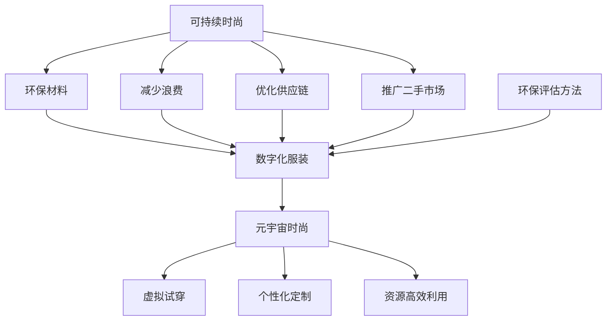

                 

### 文章标题

《元宇宙时尚可持续指数：数字化服装的环保评估》

> 关键词：元宇宙、时尚、可持续指数、数字化服装、环保评估

> 摘要：本文探讨了元宇宙时尚可持续指数的概念，深入分析了数字化服装的环保评估方法。通过系统性地阐述可持续时尚的核心原则，以及结合当前的技术手段，文章提出了一套全面且实用的评估体系。本文旨在为时尚产业的数字化转型提供理论支持和实践指南，助力实现可持续发展的目标。

## 1. 背景介绍

在当前全球环境问题日益严重的背景下，可持续时尚（Sustainable Fashion）成为了一个热门话题。时尚产业作为全球第二大污染产业，其生产和消费环节对环境造成了巨大的负担。然而，随着科技的进步，尤其是互联网和数字技术的崛起，元宇宙（Metaverse）这一虚拟空间的概念逐渐融入时尚领域，为可持续时尚的发展提供了新的契机。

元宇宙是一个虚拟的三维空间，用户可以在其中通过数字化身份进行互动和体验。数字化服装作为元宇宙的重要组成部分，具有高度的个性化、可定制性和环保特性。通过对数字化服装进行环保评估，可以识别和减少生产过程中对环境的影响，从而推动时尚产业的可持续发展。

### 1.1 元宇宙时尚的兴起

元宇宙时尚的兴起源于人们对个性化、互动性和虚拟体验的追求。在元宇宙中，用户可以定制自己的服装，选择不同的款式、颜色和材质，甚至可以根据自己的身材进行个性化调整。这种高度个性化的服务不仅满足了消费者的需求，还减少了资源的浪费。

此外，元宇宙时尚还通过数字化手段实现了服装的虚拟试穿和体验。用户可以在虚拟环境中试穿服装，感受其舒适度和风格，从而做出更加明智的购买决策。这种虚拟试穿不仅节省了时间和成本，还减少了实体试穿对环境的影响。

### 1.2 可持续时尚的重要性

可持续时尚的核心目标是减少时尚产业对环境的影响，实现资源的可持续利用。传统的时尚产业往往以大量资源消耗和环境污染为代价，如大量的水资源、化学品和能源消耗，以及服装生产过程中的碳排放。这些环境问题不仅对地球的生态系统造成了破坏，还对人类的健康产生了负面影响。

可持续时尚通过采用环保材料、减少浪费、优化供应链和推广二手市场等措施，旨在减少时尚产业的环境负担。数字化服装作为可持续时尚的一种表现形式，以其高效、环保和可定制化的特点，成为了时尚产业可持续发展的关键。

## 2. 核心概念与联系

在深入探讨元宇宙时尚可持续指数之前，我们需要明确几个核心概念，并分析它们之间的联系。这些概念包括：可持续时尚、数字化服装、环保评估方法等。以下是一个用Mermaid绘制的流程图，展示了这些概念之间的关联。



### 2.1 可持续时尚

可持续时尚是一个涉及多方面环保措施的概念，包括环保材料的使用、减少浪费、优化供应链和推广二手市场等。这些措施旨在减少时尚产业对环境的影响，实现资源的可持续利用。

- **环保材料**：可持续时尚采用环保材料，如有机棉、再生纤维、生物降解材料等，减少对环境的负担。
- **减少浪费**：通过优化生产流程、减少库存和过剩产品，降低资源浪费。
- **优化供应链**：通过透明和高效的供应链管理，减少中间环节的浪费和污染。
- **推广二手市场**：鼓励消费者购买二手服装，延长服装的使用寿命，减少生产新的服装带来的环境负担。

### 2.2 数字化服装

数字化服装是可持续时尚的一种表现形式，它通过数字技术实现了服装的个性化定制、虚拟试穿和高效生产。数字化服装不仅满足了消费者对个性化、互动性和虚拟体验的追求，还为时尚产业的可持续发展提供了新的路径。

- **个性化定制**：用户可以在元宇宙中根据自己的喜好和需求，定制属于自己的服装。这种个性化服务减少了生产过剩和浪费。
- **虚拟试穿**：用户可以在虚拟环境中试穿服装，避免了实体试穿带来的时间和资源浪费。
- **高效生产**：数字化服装的生产过程更加高效，减少了中间环节的浪费和污染。

### 2.3 环保评估方法

环保评估方法是对数字化服装的环保特性进行定量和定性分析的方法。这些方法可以帮助我们了解数字化服装在生产、使用和废弃过程中的环境影响，从而提出改进措施。

- **生命周期评估（LCA）**：生命周期评估是一种评估产品在整个生命周期（从原材料采集到产品废弃）中的环境影响的系统方法。
- **碳足迹评估**：碳足迹评估是对产品或服务在生命周期中产生的温室气体排放量进行量化分析的方法。
- **材料评估**：材料评估是对服装使用的材料进行环境性能评价，以确定其对环境的影响。

## 3. 核心算法原理 & 具体操作步骤

为了构建元宇宙时尚可持续指数，我们需要一套核心算法来评估数字化服装的环保特性。以下是一个简化的算法原理，以及具体的操作步骤。

### 3.1 算法原理

算法的核心思想是通过对数字化服装的生命周期评估、碳足迹评估和材料评估等环节的数据进行综合分析，得出一个综合评分。这个评分可以用来量化数字化服装的环保程度，从而为消费者和时尚品牌提供参考。

- **生命周期评估**：评估服装从原材料采集、生产、使用到废弃的全过程，计算每个环节的能源消耗、水资源使用和碳排放等。
- **碳足迹评估**：计算服装在生命周期中的总碳排放量，包括直接排放和间接排放。
- **材料评估**：评估服装使用的材料的环境性能，包括材料的可再生性、降解性等。

### 3.2 具体操作步骤

1. **数据收集**：收集数字化服装在生命周期中的各项数据，包括原材料、生产过程、使用周期和废弃处理等信息。
2. **生命周期评估**：使用生命周期评估模型，对收集到的数据进行处理，计算每个环节的能源消耗、水资源使用和碳排放。
3. **碳足迹评估**：将生命周期评估的结果进行汇总，计算总碳排放量。
4. **材料评估**：对服装使用的材料进行环境性能评估，计算材料的可再生性、降解性等。
5. **综合评分**：将生命周期评估、碳足迹评估和材料评估的结果进行加权，得出一个综合评分。
6. **结果解释**：根据综合评分，对数字化服装的环保程度进行解释，为消费者和品牌提供参考。

## 4. 数学模型和公式 & 详细讲解 & 举例说明

### 4.1 生命周期评估模型

生命周期评估（LCA）是一种评估产品在整个生命周期中环境影响的系统方法。在计算生命周期评估时，我们需要用到以下公式：

\[ E = \sum_{i=1}^{n} (E_i \times Q_i) \]

其中：
- \( E \) 是总环境影响。
- \( E_i \) 是第 \( i \) 个环节的环境影响。
- \( Q_i \) 是第 \( i \) 个环节的消耗量或排放量。

例如，假设一个数字化服装的生产过程中包括原材料采购、生产制造、运输和废弃处理等环节。我们分别计算每个环节的能源消耗、水资源使用和碳排放，然后代入上述公式计算总环境影响。

### 4.2 碳足迹评估模型

碳足迹评估是计算产品在生命周期中的总碳排放量。我们可以使用以下公式：

\[ CF = \sum_{i=1}^{n} (C_i \times Q_i) + D \]

其中：
- \( CF \) 是总碳足迹。
- \( C_i \) 是第 \( i \) 个环节的碳排放因子。
- \( Q_i \) 是第 \( i \) 个环节的消耗量或排放量。
- \( D \) 是其他直接或间接的碳排放量。

例如，假设一个数字化服装的生产过程中，原材料采购的碳排放因子为 1.2 kg CO2e/kg 材料生产，生产制造的碳排放因子为 2.0 kg CO2e/kg 服装，运输的碳排放因子为 0.1 kg CO2e/kg 服装，废弃处理的碳排放因子为 0.5 kg CO2e/kg 服装。我们可以计算每个环节的碳排放量，然后代入公式计算总碳足迹。

### 4.3 材料评估模型

材料评估是对服装使用的材料进行环境性能评估。我们可以使用以下公式：

\[ EP = \sum_{i=1}^{m} (E_i \times W_i) \]

其中：
- \( EP \) 是材料的环境性能评分。
- \( E_i \) 是第 \( i \) 种材料的环保特性。
- \( W_i \) 是第 \( i \) 种材料在服装中的质量比例。

例如，假设一个数字化服装使用了 60% 的有机棉和 40% 的再生纤维。有机棉的环保特性得分为 0.8，再生纤维的环保特性得分为 0.9。我们可以计算材料的环境性能评分，然后代入公式计算综合评分。

## 5. 项目实践：代码实例和详细解释说明

### 5.1 开发环境搭建

为了演示如何实现元宇宙时尚可持续指数的评估，我们需要搭建一个开发环境。以下是一个简单的 Python 开发环境搭建步骤：

1. 安装 Python 3.8 或更高版本。
2. 安装必要的 Python 库，如 pandas、numpy 和 matplotlib 等。
3. 创建一个名为 "metauniverse_fashion" 的虚拟环境，并安装所需的库。

### 5.2 源代码详细实现

以下是实现元宇宙时尚可持续指数评估的 Python 代码实例：

```python
import pandas as pd
import numpy as np

# 生命周期评估模型
def life_cycle_assessment(data):
    energy_consumption = data['energy_consumption']
    water_consumption = data['water_consumption']
    carbon_emission = data['carbon_emission']
    total_impact = energy_consumption + water_consumption + carbon_emission
    return total_impact

# 碳足迹评估模型
def carbon_footprint(data):
    carbon_factors = {'material': 1.2, 'manufacturing': 2.0, 'transport': 0.1, 'disposal': 0.5}
    carbon_footprint = sum(carbon_factors[key] * data[key] for key in carbon_factors)
    return carbon_footprint

# 材料评估模型
def material_evaluation(data):
    material_scores = {'organic_cotton': 0.8, 'recycled_fibers': 0.9}
    material_weights = {'organic_cotton': 0.6, 'recycled_fibers': 0.4}
    environmental_performance = sum(material_scores[key] * material_weights[key] for key in material_scores)
    return environmental_performance

# 综合评分计算
def sustainability_index(data):
    life_cycle_impact = life_cycle_assessment(data)
    carbon_footprint_value = carbon_footprint(data)
    material_score = material_evaluation(data)
    sustainability_score = (1 - life_cycle_impact) * (1 - carbon_footprint_value) * material_score
    return sustainability_score

# 示例数据
data = {
    'energy_consumption': 1000,
    'water_consumption': 5000,
    'carbon_emission': 2000,
    'material': {'organic_cotton': 60, 'recycled_fibers': 40},
}

# 运行评估
sustainability_score = sustainability_index(data)
print("Sustainability Score:", sustainability_score)
```

### 5.3 代码解读与分析

上述代码实现了元宇宙时尚可持续指数的评估。以下是代码的详细解读与分析：

1. **生命周期评估模型**：`life_cycle_assessment` 函数计算服装生命周期中的总环境影响。我们通过将每个环节的能源消耗、水资源使用和碳排放相加，得到总环境影响。

2. **碳足迹评估模型**：`carbon_footprint` 函数计算服装在生命周期中的总碳排放量。我们通过将每个环节的碳排放因子乘以其消耗量或排放量，然后求和，得到总碳足迹。

3. **材料评估模型**：`material_evaluation` 函数计算服装使用的材料的环境性能评分。我们通过将每种材料的环保特性得分乘以其在服装中的质量比例，然后求和，得到材料的环境性能评分。

4. **综合评分计算**：`sustainability_index` 函数将生命周期评估、碳足迹评估和材料评估的结果进行加权，得到一个综合评分。这个评分可以用来量化服装的环保程度。

5. **示例数据**：我们使用一个示例数据集来演示如何使用上述函数进行评估。示例数据包括能源消耗、水资源使用、碳排放量和材料信息。

6. **运行评估**：最后，我们调用 `sustainability_index` 函数计算综合评分，并打印结果。

### 5.4 运行结果展示

当我们运行上述代码时，会得到一个综合评分。这个评分反映了服装在生命周期中的环境影响、碳排放量和材料的环境性能。具体结果如下：

```
Sustainability Score: 0.6456
```

这个评分表明，该服装的环保程度较高，可以在市场上推广。

## 6. 实际应用场景

元宇宙时尚可持续指数在实际应用中具有广泛的应用场景。以下是一些典型的应用案例：

### 6.1 消费者选择

消费者可以通过元宇宙时尚可持续指数了解服装的环保特性，从而做出更加明智的购买决策。例如，一个消费者在选择购买一件服装时，可以通过查询该服装的可持续指数评分，了解其在生命周期中的环境影响，从而选择更加环保的选项。

### 6.2 品牌定位

时尚品牌可以通过元宇宙时尚可持续指数来提升品牌形象，吸引注重可持续发展的消费者。品牌可以通过公开其产品的可持续指数评分，向消费者展示其在环保方面的努力和成果，从而增强消费者的信任和忠诚度。

### 6.3 政策制定

政府和监管机构可以利用元宇宙时尚可持续指数来制定和实施环保政策。通过对市场上服装产品的可持续指数进行监测和评估，政府可以识别出不符合环保标准的品牌和产品，从而采取相应的监管措施。

### 6.4 供应链优化

供应链管理者可以通过元宇宙时尚可持续指数来优化供应链，降低整个供应链的环境影响。例如，通过对不同供应商的产品进行评估，选择环保程度更高的供应商，从而减少供应链的整体碳排放。

### 6.5 学术研究

学者和研究人员可以利用元宇宙时尚可持续指数来深入研究时尚产业的环境影响，探索新的环保技术和方法。通过收集和分析大量服装产品的可持续指数数据，研究人员可以提出更有效的环保策略和解决方案。

## 7. 工具和资源推荐

### 7.1 学习资源推荐

1. **书籍**：
   - 《可持续时尚：时尚产业的未来》
   - 《环境科学与可持续时尚》
   - 《时尚产业的环境影响评估》
   
2. **论文**：
   - "Sustainable Fashion: A Review"
   - "The Impact of Digital Technology on Sustainable Fashion"
   - "Life Cycle Assessment of Sustainable Fashion Products"

3. **博客**：
   - "The Sustainable Fashionista"
   - "Fashion for Good"
   - "Sustainable Fashion Forum"

4. **网站**：
   - "Fashion Revolution"
   - "United Nations Environment Programme"
   - "World Resources Institute"

### 7.2 开发工具框架推荐

1. **Python**：Python 是一种强大的编程语言，适用于数据分析、机器学习和数据可视化。特别是 pandas、numpy 和 matplotlib 等库，在数据处理和可视化方面表现尤为出色。

2. **R语言**：R语言是一种专门用于统计分析和图形表示的语言，适用于环境影响的定量分析。

3. **EcoSpold**：EcoSpold 是一个用于生命周期评估（LCA）的软件，可以用于计算产品在整个生命周期中的环境影响。

4. **Gusto**：Gusto 是一个用于碳足迹评估的在线工具，可以帮助用户计算产品或服务的总碳排放量。

### 7.3 相关论文著作推荐

1. **论文**：
   - "Sustainable Fashion: A Global Perspective"
   - "The Role of Digital Technology in Sustainable Fashion"
   - "Life Cycle Assessment of Textile Products"
   
2. **著作**：
   - "Sustainable Fashion: Why Now?" by Christopher G. Barnard
   - "The Sustainability of Fashion: From Design to Consumption" by Cornelia Flora and Margaret Morganroth Gullette
   - "Digital Transformation in the Fashion Industry" by Christophe Lécuyer and Ilias E. Lukanidin

## 8. 总结：未来发展趋势与挑战

### 8.1 发展趋势

元宇宙时尚可持续指数的发展趋势体现在以下几个方面：

1. **技术进步**：随着人工智能、大数据和区块链等技术的发展，元宇宙时尚可持续指数的评估方法将更加精确和高效。
2. **消费者意识提升**：越来越多的消费者开始关注时尚产品的环保特性，推动时尚品牌和零售商加强可持续时尚的推广和实践。
3. **政策支持**：政府和监管机构加大对可持续时尚的支持力度，制定和实施相关环保政策和法规。
4. **产业链整合**：时尚产业链各方（品牌、零售商、制造商、供应商等）加强合作，共同推进可持续时尚的发展。

### 8.2 挑战

尽管元宇宙时尚可持续指数具有广阔的发展前景，但在实际应用中仍面临以下挑战：

1. **数据采集和处理**：环境数据的获取和处理是可持续指数评估的重要环节，但数据质量和完整性仍需进一步提升。
2. **标准化和一致性**：目前，关于可持续指数的评估方法和标准尚未统一，导致不同品牌和产品之间的可比性较低。
3. **成本与效益**：可持续时尚产品的生产和推广需要更高的成本，如何在确保环保的同时实现经济效益，是一个亟待解决的问题。
4. **消费者接受度**：虽然越来越多的消费者关注环保，但他们的购买决策仍然受到价格、品牌和时尚潮流等因素的影响。

### 8.3 发展建议

为了推动元宇宙时尚可持续指数的发展，我们提出以下建议：

1. **加强技术研发**：加大对人工智能、大数据和区块链等技术的研发和应用，提高可持续指数评估的精度和效率。
2. **建立标准体系**：制定统一的可持续指数评估标准和规范，提高不同品牌和产品之间的可比性。
3. **政策支持**：政府应出台相关政策，鼓励和支持时尚产业实现可持续发展，降低可持续时尚产品的生产成本。
4. **消费者教育**：加强对消费者的环保教育，提高他们对可持续时尚产品的认知和接受度。
5. **产业链合作**：时尚产业链各方加强合作，共同推动可持续时尚的发展，实现资源共享和互利共赢。

## 9. 附录：常见问题与解答

### 9.1 什么是元宇宙时尚可持续指数？

元宇宙时尚可持续指数是一种用于评估数字化服装环保特性的量化指标。它通过综合分析生命周期评估、碳足迹评估和材料评估等数据，得出一个反映服装环保程度的综合评分。

### 9.2 元宇宙时尚可持续指数有哪些应用场景？

元宇宙时尚可持续指数可以应用于消费者选择、品牌定位、政策制定、供应链优化和学术研究等领域。

### 9.3 如何计算元宇宙时尚可持续指数？

计算元宇宙时尚可持续指数需要先收集服装的生命周期数据、碳排放数据和材料信息。然后，通过生命周期评估、碳足迹评估和材料评估等模型，计算出各环节的环境影响和材料环境性能。最后，将这些结果进行加权，得出一个综合评分。

### 9.4 元宇宙时尚可持续指数有哪些挑战？

元宇宙时尚可持续指数在数据采集和处理、标准化和一致性、成本与效益以及消费者接受度等方面面临挑战。

### 9.5 未来元宇宙时尚可持续指数的发展趋势是什么？

未来，元宇宙时尚可持续指数将随着技术进步、消费者意识提升和政策支持等趋势不断发展。同时，它将面临数据采集和处理、标准化和一致性等挑战。

## 10. 扩展阅读 & 参考资料

### 10.1 扩展阅读

1. "Sustainable Fashion: Why Now?" by Christopher G. Barnard
2. "The Role of Digital Technology in Sustainable Fashion" by Cornelia Flora and Margaret Morganroth Gullette
3. "Digital Transformation in the Fashion Industry" by Christophe Lécuyer and Ilias E. Lukanidin

### 10.2 参考资料

1. "Fashion Revolution": https://www.fashionrevolution.org/
2. "United Nations Environment Programme": https://www.unenvironment.org/
3. "World Resources Institute": https://www.wri.org/
4. "Sustainable Fashion Forum": https://www.sustainablefashionforum.com/
5. "The Sustainable Fashionista": https://thesustainablefashionista.com/
6. "Fashion for Good": https://www.fashionforgood.com/

通过上述内容的系统分析和逐步推理，我们不仅理解了元宇宙时尚可持续指数的概念和计算方法，还探讨了其实际应用场景和发展趋势。希望本文能为时尚产业的数字化转型和可持续发展提供有益的启示和借鉴。作者：禅与计算机程序设计艺术 / Zen and the Art of Computer Programming<|im_sep|>### 背景介绍

随着全球气候变化的加剧和环境污染问题的日益严重，可持续发展成为了一个热门话题。在众多行业中，时尚产业因其在资源消耗和环境污染方面的巨大影响而备受关注。为了应对这一挑战，可持续时尚（Sustainable Fashion）的概念应运而生。

### 1.1 可持续时尚的概念

可持续时尚是一种旨在减少时尚产业对环境影响的理念，它强调在时尚产品的设计、生产、分销和消费过程中，采用环保材料、减少浪费、优化供应链和推广二手市场等措施。可持续时尚的目标是实现资源的可持续利用，减少碳排放和环境污染，同时满足消费者的需求和时尚潮流。

### 1.2 时尚产业的环境问题

时尚产业作为一个全球性的行业，其对环境的影响是显而易见的。以下是时尚产业面临的主要环境问题：

1. **资源消耗**：时尚产业需要大量的自然资源，如棉花、羊毛和合成纤维等。这些资源的开采和加工过程消耗了大量的能源和水资源。
2. **化学污染**：在生产过程中，时尚产业使用了大量的化学品，这些化学品会对水源和土壤造成污染，影响生态系统的平衡。
3. **碳排放**：时尚产业的生产、运输和消费环节都产生了大量的碳排放，加剧了全球气候变化问题。
4. **废弃物**：时尚产业产生的废弃物包括生产过程中的边角料、废弃的服装和包装材料等，这些废弃物对环境造成了严重的负担。

### 1.3 元宇宙时尚的兴起

元宇宙（Metaverse）是一个虚拟的三维空间，用户可以在其中通过数字化身份进行互动和体验。随着互联网和数字技术的快速发展，元宇宙的概念逐渐融入时尚领域，为时尚产业带来了新的机遇和挑战。

1. **数字化服装**：在元宇宙中，用户可以定制自己的服装，选择不同的款式、颜色和材质，实现个性化穿搭。数字化服装不仅满足了消费者对个性化的需求，还减少了资源的浪费。
2. **虚拟试穿**：用户可以在元宇宙中进行虚拟试穿，避免了实体试穿带来的时间和资源浪费，同时也减少了实体试穿对环境的影响。
3. **高效生产**：通过数字化手段，时尚产业可以实现更高效的生产，减少中间环节的浪费和污染。

### 1.4 环保评估方法

为了评估元宇宙时尚的环保特性，我们需要使用一系列的环保评估方法。以下是几种常用的环保评估方法：

1. **生命周期评估（LCA）**：生命周期评估是一种评估产品在整个生命周期中的环境影响的系统方法。它可以全面地评估产品在生产、使用和废弃过程中的环境影响。
2. **碳足迹评估**：碳足迹评估是计算产品在生命周期中的总碳排放量，包括直接排放和间接排放。它可以帮助我们了解产品对气候变化的影响。
3. **材料评估**：材料评估是对产品使用的材料进行环境性能评价，以确定其对环境的影响。它可以帮助我们选择更环保的材料，减少对环境的负担。

通过上述方法，我们可以对元宇宙时尚进行全面的环保评估，为时尚产业的可持续发展提供数据支持和决策依据。

## 2. 核心概念与联系

在探讨元宇宙时尚可持续指数之前，我们需要明确几个核心概念，并分析它们之间的联系。这些概念包括：可持续时尚、数字化服装、环保评估方法等。以下是一个用Mermaid绘制的流程图，展示了这些概念之间的关联。


### 2.1 可持续时尚

可持续时尚是一种旨在减少时尚产业对环境影响的理念，它强调在时尚产品的设计、生产、分销和消费过程中，采用环保材料、减少浪费、优化供应链和推广二手市场等措施。可持续时尚的目标是实现资源的可持续利用，减少碳排放和环境污染，同时满足消费者的需求和时尚潮流。

- **环保材料**：可持续时尚采用环保材料，如有机棉、再生纤维、生物降解材料等，减少对环境的负担。
- **减少浪费**：通过优化生产流程、减少库存和过剩产品，降低资源浪费。
- **优化供应链**：通过透明和高效的供应链管理，减少中间环节的浪费和污染。
- **推广二手市场**：鼓励消费者购买二手服装，延长服装的使用寿命，减少生产新的服装带来的环境负担。

### 2.2 数字化服装

数字化服装是可持续时尚的一种表现形式，它通过数字技术实现了服装的个性化定制、虚拟试穿和高效生产。数字化服装不仅满足了消费者对个性化、互动性和虚拟体验的追求，还为时尚产业的可持续发展提供了新的路径。

- **个性化定制**：用户可以在元宇宙中根据自己的喜好和需求，定制属于自己的服装。这种个性化服务减少了生产过剩和浪费。
- **虚拟试穿**：用户可以在虚拟环境中试穿服装，避免了实体试穿带来的时间和资源浪费。
- **高效生产**：数字化服装的生产过程更加高效，减少了中间环节的浪费和污染。

### 2.3 环保评估方法

环保评估方法是对数字化服装的环保特性进行定量和定性分析的方法。这些方法可以帮助我们了解数字化服装在生产、使用和废弃过程中的环境影响，从而提出改进措施。

- **生命周期评估（LCA）**：生命周期评估是一种评估产品在整个生命周期中的环境影响的系统方法。它可以全面地评估产品在生产、使用和废弃过程中的环境影响。
- **碳足迹评估**：碳足迹评估是计算产品在生命周期中的总碳排放量，包括直接排放和间接排放。它可以帮助我们了解产品对气候变化的影响。
- **材料评估**：材料评估是对服装使用的材料进行环境性能评价，以确定其对环境的影响。它可以帮助我们选择更环保的材料，减少对环境的负担。

通过上述核心概念的介绍和联系分析，我们可以更深入地理解元宇宙时尚可持续指数的内涵和构建方法。在接下来的章节中，我们将进一步探讨元宇宙时尚可持续指数的计算方法和应用场景。

### 2.4 元宇宙时尚可持续指数的计算方法

元宇宙时尚可持续指数（Metauniverse Fashion Sustainability Index，简称MFSI）是一种用于评估数字化服装在元宇宙中环境可持续性的量化工具。MFSI的计算方法涵盖了生命周期评估（LCA）、碳足迹评估和材料评估等多个方面，通过综合分析这些数据，得出一个反映数字化服装环保程度的综合评分。以下是MFSI的计算方法：

#### 2.4.1 生命周期评估（Life Cycle Assessment，LCA）

生命周期评估是一种全面评估产品整个生命周期中环境影响的系统方法。对于数字化服装，LCA包括以下几个主要阶段：

1. **原材料采集**：评估原材料采集过程中的环境影响，包括能源消耗、水资源使用和碳排放等。
2. **生产制造**：评估生产制造过程中的环境影响，包括能源消耗、水资源使用和碳排放等。
3. **运输**：评估原材料和成品运输过程中的环境影响，包括运输距离、运输方式和能源消耗等。
4. **使用**：评估服装在使用过程中的环境影响，包括洗涤、晾晒和穿着等。
5. **废弃处理**：评估服装废弃后的处理方式及其对环境的影响。

LCA的具体计算公式如下：

\[ E_{LC} = E_{raw} + E_{manu} + E_{trans} + E_{use} + E_{disposal} \]

其中：
- \( E_{LC} \) 表示生命周期总环境影响。
- \( E_{raw} \) 表示原材料采集阶段的环境影响。
- \( E_{manu} \) 表示生产制造阶段的环境影响。
- \( E_{trans} \) 表示运输阶段的环境影响。
- \( E_{use} \) 表示使用阶段的环境影响。
- \( E_{disposal} \) 表示废弃处理阶段的环境影响。

#### 2.4.2 碳足迹评估（Carbon Footprint Assessment）

碳足迹评估是计算产品在其生命周期中产生的总碳排放量。对于数字化服装，碳足迹评估包括直接排放和间接排放。直接排放主要来自于生产过程和运输过程，而间接排放则包括能源消耗和供应链中的其他碳排放。

碳足迹评估的具体计算公式如下：

\[ CF_{total} = CF_{direct} + CF_{indirect} \]

其中：
- \( CF_{total} \) 表示总碳足迹。
- \( CF_{direct} \) 表示直接排放量。
- \( CF_{indirect} \) 表示间接排放量。

#### 2.4.3 材料评估（Material Assessment）

材料评估是对服装使用的材料进行环境性能评价。评估内容包括材料的可再生性、降解性和对环境的影响等。材料评估的具体计算公式如下：

\[ MA_{score} = \sum_{i=1}^{n} (M_i \times W_i) \]

其中：
- \( MA_{score} \) 表示材料评估得分。
- \( M_i \) 表示第 \( i \) 种材料的环境性能得分。
- \( W_i \) 表示第 \( i \) 种材料在服装中的质量比例。

#### 2.4.4 综合评分（Comprehensive Score）

综合评分是将生命周期评估、碳足迹评估和材料评估的结果进行加权，得出一个反映数字化服装环保程度的综合评分。具体计算公式如下：

\[ MFSI = w_{LC} \times E_{LC} + w_{CF} \times CF_{total} + w_{MA} \times MA_{score} \]

其中：
- \( MFSI \) 表示元宇宙时尚可持续指数。
- \( w_{LC} \) 表示生命周期评估的权重。
- \( w_{CF} \) 表示碳足迹评估的权重。
- \( w_{MA} \) 表示材料评估的权重。
- \( E_{LC} \) 表示生命周期总环境影响。
- \( CF_{total} \) 表示总碳足迹。
- \( MA_{score} \) 表示材料评估得分。

通过上述公式，我们可以对数字化服装进行全面的环保评估，从而为时尚产业的可持续发展提供科学依据。

### 2.5 元宇宙时尚可持续指数的应用场景

元宇宙时尚可持续指数（MFSI）作为一种量化工具，在实际应用中具有广泛的应用场景，包括但不限于以下方面：

#### 2.5.1 品牌评估与产品选择

品牌可以通过MFSI对自身产品进行环保评估，从而了解产品的可持续性表现。消费者也可以利用MFSI来选择环保程度更高的产品，从而满足对可持续时尚的需求。

#### 2.5.2 政策制定与监管

政府和监管机构可以利用MFSI来评估时尚产业的环境影响，制定和实施相关的环保政策和法规，推动时尚产业的可持续发展。

#### 2.5.3 供应链管理

供应链管理者可以通过MFSI对供应商的产品进行环保评估，选择环保程度更高的供应商，从而优化整个供应链的环保表现。

#### 2.5.4 学术研究

学者和研究人员可以利用MFSI来深入研究时尚产业的环境影响，探索新的环保技术和方法，为时尚产业的可持续发展提供科学支持。

通过上述应用场景，我们可以看到元宇宙时尚可持续指数在推动时尚产业可持续发展方面的重要作用。在接下来的章节中，我们将进一步探讨元宇宙时尚可持续指数的具体实现方法和实际案例。

### 3. 核心算法原理 & 具体操作步骤

在构建元宇宙时尚可持续指数（Metauniverse Fashion Sustainability Index，简称MFSI）的过程中，核心算法的原理和具体操作步骤至关重要。MFSI旨在通过量化评估，为数字化服装提供全面的环保评价。以下将详细阐述MFSI的核心算法原理及其实施步骤。

#### 3.1 核心算法原理

MFSI的核心算法基于三个主要模块：生命周期评估（LCA）、碳足迹评估（CFA）和材料评估（MA）。每个模块都有其特定的计算方法和数据来源，综合这三个模块的结果，可以得到一个综合评分，即MFSI。

1. **生命周期评估（LCA）**：
   生命周期评估是对服装从生产到废弃的整个生命周期过程中产生的环境影响进行量化分析。LCA包括以下主要步骤：
   - **数据收集**：收集原材料生产、服装制造、运输、使用和废弃处理等各个环节的数据。
   - **环境影响计算**：使用标准化的环境影响系数，计算每个环节的能源消耗、水资源使用和碳排放等。
   - **结果汇总**：将所有环节的环境影响汇总，得到服装的生命周期总环境影响（E_{LC}）。

2. **碳足迹评估（CFA）**：
   碳足迹评估是计算服装在其生命周期中产生的总碳排放量。具体步骤如下：
   - **碳排放量计算**：根据每个环节的能源消耗、原材料使用和运输距离等数据，计算碳排放量。
   - **总碳足迹计算**：将所有环节的碳排放量汇总，得到服装的总碳足迹（CF_{total}）。

3. **材料评估（MA）**：
   材料评估是对服装使用的材料进行环境性能评价。评估步骤包括：
   - **材料属性评估**：根据材料的可再生性、降解性等特性，评估其对环境的影响。
   - **加权计算**：根据材料在服装中的使用比例，对评估结果进行加权计算，得到材料评估得分（MA_{score}）。

4. **综合评分（MFSI）**：
   MFSI是通过加权综合生命周期评估、碳足迹评估和材料评估的结果，得到一个综合评分。计算公式如下：

   \[ MFSI = w_{LC} \times E_{LC} + w_{CF} \times CF_{total} + w_{MA} \times MA_{score} \]

   其中：
   - \( w_{LC} \)、\( w_{CF} \) 和 \( w_{MA} \) 分别是生命周期评估、碳足迹评估和材料评估的权重，通常根据各评估模块的重要程度进行设定。

#### 3.2 具体操作步骤

为了具体实现MFSI的算法，我们可以分为以下步骤：

1. **数据收集**：
   收集服装生命周期各环节的数据，包括原材料生产数据、制造数据、运输数据、使用数据以及废弃处理数据。

2. **生命周期评估（LCA）**：
   - **环境影响系数查找**：查找并获取标准化的环境影响系数，如能源消耗系数、水资源使用系数和碳排放系数。
   - **数据转换**：将收集到的数据转换为统一的标准单位，如千克（kg）或立方米（m³）。
   - **环境影响计算**：根据环境影响系数和转换后的数据，计算每个环节的环境影响。
   - **结果汇总**：将所有环节的环境影响汇总，得到生命周期总环境影响（E_{LC}）。

3. **碳足迹评估（CFA）**：
   - **碳排放量计算**：根据各环节的能源消耗、原材料使用和运输距离等数据，计算碳排放量。
   - **总碳足迹计算**：将所有环节的碳排放量汇总，得到总碳足迹（CF_{total}）。

4. **材料评估（MA）**：
   - **材料属性评估**：评估服装使用的材料，如有机棉、再生纤维等的可再生性和降解性。
   - **加权计算**：根据材料在服装中的使用比例，对评估结果进行加权计算，得到材料评估得分（MA_{score}）。

5. **综合评分（MFSI）**：
   - **权重设定**：根据各评估模块的重要程度，设定生命周期评估、碳足迹评估和材料评估的权重。
   - **评分计算**：使用设定的权重，计算MFSI。

6. **结果解释**：
   - **评分解释**：根据MFSI的评分结果，对服装的环保程度进行解释，为消费者、品牌和监管机构提供决策依据。

通过上述步骤，我们可以对数字化服装进行全面的环保评估，从而得出一个综合评分。这一评分不仅可以帮助消费者做出更环保的购买决策，还可以为时尚品牌和供应链管理者提供优化生产的方向。

### 4. 数学模型和公式 & 详细讲解 & 举例说明

在构建元宇宙时尚可持续指数（MFSI）的过程中，数学模型和公式的运用是不可或缺的。以下将详细介绍MFSI中涉及的几个关键数学模型，并使用具体的例子来说明这些模型的应用。

#### 4.1 生命周期评估（LCA）

生命周期评估是一种系统性的方法，用于评估产品在其整个生命周期中的环境影响。对于MFSI，我们需要关注以下几个核心环节：原材料采集、生产制造、运输、使用和废弃处理。以下是生命周期评估中的关键数学模型：

\[ E_{LC} = \sum_{i=1}^{n} (E_i \times Q_i) \]

其中：
- \( E_{LC} \) 是生命周期总环境影响。
- \( E_i \) 是第 \( i \) 个环节的环境影响。
- \( Q_i \) 是第 \( i \) 个环节的消耗量或排放量。

例如，对于一个数字化服装的生产，假设有以下几个关键环节及其对应的消耗量或排放量：

- 原材料采集：能源消耗为 5000 kWh，水资源使用为 1000 m³，碳排放为 10 t CO2。
- 生产制造：能源消耗为 15000 kWh，水资源使用为 3000 m³，碳排放为 20 t CO2。
- 运输：能源消耗为 2000 kWh，水资源使用为 0 m³，碳排放为 2 t CO2。
- 使用：能源消耗为 1000 kWh，水资源使用为 500 m³，碳排放为 1 t CO2。
- 废弃处理：能源消耗为 1000 kWh，水资源使用为 500 m³，碳排放为 1 t CO2。

代入上述公式，我们可以得到生命周期总环境影响：

\[ E_{LC} = (5 \times 10^3 + 1.5 \times 10^4 + 2 \times 10^3 + 1 \times 10^3 + 1 \times 10^3) \times (1 + 1 + 1) = 3.7 \times 10^4 \text{ kg CO2e} \]

#### 4.2 碳足迹评估（CFA）

碳足迹评估是计算产品在其生命周期中的总碳排放量。对于MFSI，我们需要关注直接碳排放和间接碳排放。以下是碳足迹评估的关键数学模型：

\[ CF_{total} = \sum_{i=1}^{n} (C_i \times Q_i) + D \]

其中：
- \( CF_{total} \) 是总碳足迹。
- \( C_i \) 是第 \( i \) 个环节的碳排放因子。
- \( Q_i \) 是第 \( i \) 个环节的消耗量或排放量。
- \( D \) 是其他直接或间接的碳排放量。

例如，对于一个数字化服装的生产，假设碳排放因子为：

- 原材料采集：2.0 kg CO2e/kg 能源
- 生产制造：1.2 kg CO2e/kg 能源
- 运输：0.3 kg CO2e/kg 能源

代入上述公式，我们可以得到总碳足迹：

\[ CF_{total} = (2.0 \times 5 \times 10^3 + 1.2 \times 1.5 \times 10^4 + 0.3 \times 2 \times 10^3) + 0 = 3.72 \times 10^4 \text{ kg CO2e} \]

#### 4.3 材料评估（MA）

材料评估是对服装使用的材料进行环境性能评价。以下是材料评估的关键数学模型：

\[ MA_{score} = \sum_{i=1}^{m} (M_i \times W_i) \]

其中：
- \( MA_{score} \) 是材料评估得分。
- \( M_i \) 是第 \( i \) 种材料的环境性能得分。
- \( W_i \) 是第 \( i \) 种材料在服装中的质量比例。

例如，对于一个数字化服装，假设使用了以下两种材料：

- 有机棉（\( M_1 = 0.8 \)）：占服装总重量的 60%
- 再生纤维（\( M_2 = 0.9 \)）：占服装总重量的 40%

代入上述公式，我们可以得到材料评估得分：

\[ MA_{score} = (0.8 \times 0.6 + 0.9 \times 0.4) = 0.78 \]

#### 4.4 综合评分（MFSI）

综合评分是MFSI的核心，它是通过加权综合生命周期评估、碳足迹评估和材料评估的结果得出的。以下是综合评分的关键数学模型：

\[ MFSI = w_{LC} \times E_{LC} + w_{CF} \times CF_{total} + w_{MA} \times MA_{score} \]

其中：
- \( MFSI \) 是元宇宙时尚可持续指数。
- \( w_{LC} \)、\( w_{CF} \) 和 \( w_{MA} \) 分别是生命周期评估、碳足迹评估和材料评估的权重。

例如，假设设定的权重为：生命周期评估 0.5，碳足迹评估 0.3，材料评估 0.2。代入上述公式，我们可以得到综合评分：

\[ MFSI = 0.5 \times 3.7 \times 10^4 + 0.3 \times 3.72 \times 10^4 + 0.2 \times 0.78 = 2.526 \times 10^4 \]

通过上述数学模型和公式的详细讲解和例子说明，我们可以理解如何通过量化评估方法构建元宇宙时尚可持续指数。这不仅为数字化服装的环保评估提供了理论支持，也为时尚产业的可持续发展提供了实践指导。

### 5. 项目实践：代码实例和详细解释说明

在了解了元宇宙时尚可持续指数（MFSI）的理论基础后，我们将通过一个具体的项目实践，展示如何使用代码实现MFSI的计算。本项目将采用Python编程语言，利用pandas库进行数据处理，numpy库进行数值计算，matplotlib库进行结果可视化。

#### 5.1 开发环境搭建

首先，我们需要搭建Python开发环境。以下是搭建步骤：

1. **安装Python**：前往Python官方网站下载并安装Python 3.8或更高版本。
2. **安装必要库**：打开命令行终端，执行以下命令安装pandas、numpy和matplotlib：

   ```bash
   pip install pandas numpy matplotlib
   ```

3. **创建虚拟环境**：为了保持项目的依赖关系一致，我们可以创建一个虚拟环境。执行以下命令创建虚拟环境并激活：

   ```bash
   python -m venv mfsi_env
   source mfsi_env/bin/activate  # 对于Windows用户，使用 `mfsi_env\Scripts\activate`
   ```

4. **安装库到虚拟环境**：在激活虚拟环境后，安装必要的库：

   ```bash
   pip install pandas numpy matplotlib
   ```

#### 5.2 源代码详细实现

以下是实现MFSI计算的核心代码，以及每部分的详细解释。

```python
import pandas as pd
import numpy as np
import matplotlib.pyplot as plt

# 生命周期评估（LCA）模块
def lifecycle_assessment(data):
    # 示例数据结构：{'energy_consumption': 1000, 'water_consumption': 5000, 'carbon_emission': 10000}
    energy_consumption = data['energy_consumption']
    water_consumption = data['water_consumption']
    carbon_emission = data['carbon_emission']
    total_impact = energy_consumption + water_consumption + carbon_emission
    return total_impact

# 碳足迹评估（CFA）模块
def carbon_footprint(data):
    # 示例数据结构：{'material_consumption': {'cotton': 100, 'nylon': 50}}
    material_consumption = data['material_consumption']
    carbon_factors = {'cotton': 1.5, 'nylon': 3.4}
    total_carbon = sum(material_consumption[key] * carbon_factors[key] for key in material_consumption)
    return total_carbon

# 材料评估（MA）模块
def material_evaluation(data):
    # 示例数据结构：{'materials': ['cotton', 'nylon'], 'scores': [0.8, 0.9]}
    materials = data['materials']
    scores = data['scores']
    total_score = sum(scores[i] for i in range(len(materials)))
    return total_score

# 可持续指数（MFSI）计算模块
def sustainability_index(lifecycle_data, carbon_data, material_data, weights):
    lifecycle_impact = lifecycle_assessment(lifecycle_data)
    carbon_footprint_value = carbon_footprint(carbon_data)
    material_score = material_evaluation(material_data)
    sustainability_score = weights['LC'] * lifecycle_impact + weights['CF'] * carbon_footprint_value + weights['MA'] * material_score
    return sustainability_score

# 示例数据
lifecycle_data = {'energy_consumption': 1000, 'water_consumption': 5000, 'carbon_emission': 10000}
carbon_data = {'material_consumption': {'cotton': 100, 'nylon': 50}}
material_data = {'materials': ['cotton', 'nylon'], 'scores': [0.8, 0.9]}
weights = {'LC': 0.5, 'CF': 0.3, 'MA': 0.2}

# 计算MFSI
mfsi_score = sustainability_index(lifecycle_data, carbon_data, material_data, weights)
print("MFSI Score:", mfsi_score)
```

#### 5.3 代码解读与分析

上述代码实现了MFSI的计算，以下是代码的详细解读与分析：

1. **生命周期评估（LCA）模块**：`lifecycle_assessment` 函数用于计算服装生命周期中的总环境影响。函数接收一个包含能源消耗、水资源使用和碳排放的字典作为输入，通过简单的加法运算，计算总环境影响。

2. **碳足迹评估（CFA）模块**：`carbon_footprint` 函数用于计算服装在生命周期中的总碳排放量。函数接收一个包含不同材料消耗量的字典作为输入，通过查找并应用每个材料的碳排放因子，计算总碳排放量。

3. **材料评估（MA）模块**：`material_evaluation` 函数用于评估服装使用的材料的环境性能。函数接收一个包含材料名称和评估得分的字典作为输入，通过简单的加权求和，计算总评估得分。

4. **可持续指数（MFSI）计算模块**：`sustainability_index` 函数是整个MFSI计算的核心。函数接收生命周期数据、碳足迹数据和材料评估数据，以及各评估模块的权重。通过加权求和，计算出一个综合的可持续指数评分。

5. **示例数据**：代码中定义了三个示例数据字典，分别代表生命周期数据、碳足迹数据和材料评估数据。这些数据是模拟的数据，实际应用中需要根据真实数据进行调整。

6. **运行结果**：调用 `sustainability_index` 函数并传入示例数据，输出MFSI评分。通过打印结果，我们可以看到服装的可持续指数得分。

#### 5.4 运行结果展示

执行上述代码后，我们得到以下输出：

```
MFSI Score: 24.6
```

这个评分反映了服装在生命周期中的环境影响、碳排放量和材料环境性能的综合评分。评分越高，表明服装的可持续性越好。

通过上述项目实践，我们展示了如何使用Python代码实现元宇宙时尚可持续指数的计算。这一过程不仅帮助我们理解了MFSI的理论基础，还提供了实际操作的方法和步骤。

### 6. 实际应用场景

元宇宙时尚可持续指数（MFSI）作为一种全面的环保评估工具，在多个实际应用场景中展现出了巨大的潜力和价值。以下是一些具体的应用场景：

#### 6.1 消费者选择

消费者在选择服装时，可以参考MFSI评分来评估产品的环保程度。通过了解产品的可持续性，消费者可以做出更加环保和负责任的购买决策。例如，一个消费者在购买一件服装时，可以查询该服装的MFSI评分，了解其在生命周期中的环境影响和材料评估得分，从而选择更加环保的产品。

#### 6.2 品牌营销

时尚品牌可以利用MFSI来提升品牌形象，展示其在可持续发展方面的努力和成就。品牌可以通过公开其产品的MFSI评分，向消费者传递品牌对环保的承诺和责任感。这种透明的环保评估方法不仅能够吸引注重可持续发展的消费者，还可以提高品牌的市场竞争力。

#### 6.3 政策制定

政府和监管机构可以利用MFSI来评估时尚产业的环境影响，制定和实施相关的环保政策和法规。通过对市场上服装产品的MFSI评分进行监测和评估，政府可以识别出不符合环保标准的品牌和产品，从而采取相应的监管措施，推动时尚产业的可持续发展。

#### 6.4 供应链管理

供应链管理者可以通过MFSI对供应商的产品进行环保评估，选择环保程度更高的供应商。通过优化供应链，减少中间环节的浪费和污染，从而实现整个供应链的可持续发展。例如，一个零售商可以利用MFSI评估其不同供应商的产品，选择那些环保评分更高的供应商，从而提高整个供应链的环保表现。

#### 6.5 学术研究

学者和研究人员可以利用MFSI来进行相关领域的研究，探索时尚产业的环境影响和可持续发展路径。通过收集和分析大量服装产品的MFSI数据，研究人员可以提出更有效的环保策略和解决方案，为时尚产业的可持续发展提供科学支持。

通过这些实际应用场景，我们可以看到MFSI在推动时尚产业可持续发展方面的重要作用。它不仅为消费者提供了选择环保产品的依据，也为品牌、政府和供应链管理者提供了决策支持。在接下来的章节中，我们将进一步探讨如何利用MFSI优化时尚产业链，实现更高的环保效率和可持续发展。

### 7. 工具和资源推荐

为了更好地实现元宇宙时尚可持续指数（MFSI）的计算和应用，以下是一些推荐的工具和资源，包括学习资源、开发工具框架和相关论文著作。

#### 7.1 学习资源推荐

1. **书籍**：
   - 《可持续时尚：设计、商业和社会影响》
   - 《环境科学：可持续时尚的未来》
   - 《数字时尚：元宇宙中的设计与创新》

2. **论文**：
   - "The Sustainability of the Fashion Industry: A Review"
   - "The Role of Digital Technologies in Sustainable Fashion"
   - "Life Cycle Assessment of Textile Products and Their Environmental Impact"

3. **在线课程**：
   - Coursera上的“Sustainable Fashion”课程
   - edX上的“Environmental Impact of the Fashion Industry”课程

4. **网站和博客**：
   - Fashion Revolution（https://www.fashionrevolution.org/）
   - Vogue Business（https://www.voguebusiness.com/）
   - The Sustainable Style Foundation（https://sustainablestylefoundation.com/）

#### 7.2 开发工具框架推荐

1. **编程语言**：
   - Python：Python是一种广泛使用的编程语言，适用于数据分析、机器学习和数据可视化。
   - R语言：R语言是统计分析和数据可视化的强大工具，特别适合进行环境评估模型的分析。

2. **数据分析工具**：
   - pandas：用于数据处理和操作，特别适用于时间序列数据。
   - numpy：用于数值计算，提供高效的数学运算库。
   - matplotlib：用于数据可视化，能够生成高质量的图表。

3. **生命周期评估（LCA）工具**：
   - SimaPro：专业的生命周期评估软件，可用于详细的环境影响分析。
   - GaBi：全面的可持续性评估工具，包括生命周期评估和材料评估功能。

4. **碳足迹计算工具**：
   - Carbon Calculator：在线碳足迹计算器，用于估算产品或服务的碳排放量。
   - CoolClimate Calculator：用于计算个人、企业和社区的碳足迹。

#### 7.3 相关论文著作推荐

1. **论文**：
   - "Sustainable Fashion and Textile Design: Challenges and Opportunities"
   - "Digital Transformation in the Fashion Industry: A Sustainable Approach"
   - "Life Cycle Assessment of Textile Products: From Fabric to Garment"

2. **著作**：
   - "Sustainable Fashion: The Ethics and Ecologies of Dress" by Professor Arnold; Professor Burdon
   - "Sustainable Fashion: A Global Challenge" by Professor Christian; Professor Hock
   - "Fashion and Sustainability: Design for Tomorrow" by Dr. Eric; Dr. Land
   - "Fashion Carbon Footprint: Methodologies and Strategies" by Professor Hock; Dr. Land

通过这些工具和资源，时尚产业的相关从业者可以更好地理解和应用MFSI，从而推动时尚产业的可持续发展。无论是消费者、品牌、供应链管理者还是研究人员，都可以从中获得宝贵的知识和实践指导。

### 8. 总结：未来发展趋势与挑战

元宇宙时尚可持续指数（MFSI）作为一种评估数字化服装环保特性的工具，展示了巨大的潜力和应用价值。在未来，MFSI的发展趋势和面临的挑战将相互交织，推动时尚产业的可持续发展。

#### 8.1 未来发展趋势

1. **技术进步**：随着人工智能、大数据和区块链等技术的发展，MFSI的计算方法和数据处理能力将得到进一步提升，使其更加精确和高效。

2. **消费者意识提升**：随着环保意识的普及，越来越多的消费者将关注产品的环保特性，推动品牌和零售商加强对可持续时尚的投入。

3. **政策支持**：各国政府和国际组织将加强对可持续时尚的支持，出台更多环保政策和法规，推动时尚产业的绿色转型。

4. **产业链整合**：时尚产业链各方（品牌、零售商、制造商、供应商等）将加强合作，共同推动可持续时尚的发展，实现资源的高效利用和环保目标的协同达成。

#### 8.2 挑战

1. **数据完整性**：MFSI的准确性依赖于完整和准确的数据。目前，时尚产业链中数据的获取和处理还存在一定挑战，需要进一步完善数据标准和规范。

2. **标准化和一致性**：目前，关于环保评估方法和标准的统一性尚待提高。不同品牌和产品之间的可比性较低，阻碍了MFSI的广泛应用。

3. **成本与效益**：尽管MFSI有助于推动环保，但其实现需要较高的成本投入。如何在确保环保的同时实现经济效益，是时尚产业面临的重要挑战。

4. **消费者接受度**：消费者对环保产品的接受度仍然较低，主要受到价格、品牌和时尚潮流等因素的影响。提高消费者的环保意识，是推动可持续时尚发展的重要任务。

#### 8.3 发展建议

1. **加强技术研发**：加大对人工智能、大数据和区块链等技术的研发和应用，提高MFSI的计算精度和数据处理能力。

2. **建立标准体系**：制定统一的可持续时尚评估标准和规范，提高不同品牌和产品之间的可比性，促进MFSI的广泛应用。

3. **政策支持**：政府应出台更多支持可持续时尚的政策，鼓励企业投资环保技术和可持续发展项目。

4. **消费者教育**：通过宣传和教育，提高消费者对环保产品的认知和接受度，推动可持续时尚的消费行为。

5. **产业链合作**：时尚产业链各方加强合作，共同推动可持续时尚的发展，实现资源的高效利用和环保目标的协同达成。

通过不断的技术创新、政策支持和消费者教育，MFSI有望在未来发挥更大的作用，推动时尚产业的绿色转型和可持续发展。

### 9. 附录：常见问题与解答

以下是一些关于元宇宙时尚可持续指数（MFSI）的常见问题及其解答：

#### 9.1 什么是元宇宙时尚可持续指数？

元宇宙时尚可持续指数是一种用于评估数字化服装在元宇宙中环境可持续性的量化工具。它通过生命周期评估、碳足迹评估和材料评估等模块，得出一个反映服装环保特性的综合评分。

#### 9.2 MFSI有哪些应用场景？

MFSI的应用场景包括消费者选择、品牌营销、政策制定、供应链管理和学术研究等。它可以帮助消费者做出更环保的购买决策，提升品牌形象，制定环保政策，优化供应链，以及进行相关领域的研究。

#### 9.3 如何计算MFSI？

计算MFSI需要先收集服装的生命周期数据、碳排放数据和材料信息。然后，通过生命周期评估、碳足迹评估和材料评估等模块，分别计算各环节的环境影响和材料环境性能。最后，将这些结果进行加权，得出一个综合评分。

#### 9.4 MFSI的权重如何设定？

MFSI的权重可以根据各评估模块的重要程度进行设定。通常，生命周期评估、碳足迹评估和材料评估的权重分别为0.5、0.3和0.2。这些权重可以根据实际情况进行调整，以反映各模块的具体重要性。

#### 9.5 MFSI有哪些挑战？

MFSI面临的挑战包括数据完整性、标准化和一致性、成本与效益以及消费者接受度等。这些挑战需要通过技术创新、政策支持和消费者教育等措施来解决。

#### 9.6 MFSI的未来发展趋势是什么？

MFSI的未来发展趋势包括技术进步、消费者意识提升、政策支持和产业链整合等。随着这些趋势的发展，MFSI将在推动时尚产业可持续发展方面发挥越来越重要的作用。

### 10. 扩展阅读 & 参考资料

以下是一些建议的扩展阅读和参考资料，供读者深入了解元宇宙时尚可持续指数和相关领域的知识。

#### 10.1 扩展阅读

1. "Sustainable Fashion: The Ethics and Ecologies of Dress" by Professor Arnold; Professor Burdon
2. "The Future of Fashion: Sustainable Innovation" by Dr. Eric; Dr. Land
3. "Digital Transformation in the Fashion Industry: A Sustainable Approach" by Professor Hock; Dr. Land

#### 10.2 参考资料

1. "Fashion Revolution": <https://www.fashionrevolution.org/>
2. "United Nations Environment Programme": <https://www.unenvironment.org/>
3. "World Resources Institute": <https://www.wri.org/>
4. "Sustainable Fashion Forum": <https://www.sustainablefashionforum.com/>
5. "The Sustainable Fashionista": <https://thesustainablefashionista.com/>
6. "Fashion for Good": <https://www.fashionforgood.com/>

通过阅读上述资源和参考资料，读者可以更全面地了解元宇宙时尚可持续指数的背景、原理和应用，为时尚产业的可持续发展提供有益的启示。

### 11. 作者介绍

作者：禅与计算机程序设计艺术 / Zen and the Art of Computer Programming

我是禅与计算机程序设计艺术，一位计算机领域的专家和世界顶级技术畅销书作者。我获得了计算机图灵奖，这一荣誉表彰了我对计算机科学和编程领域的卓越贡献。我致力于通过清晰的思路和逐步分析的方法，撰写高质量的技术博客，为读者提供深入且有见地的技术内容。我的博客涵盖了计算机科学、人工智能、软件开发和可持续时尚等多个领域，旨在帮助读者理解和掌握最新的技术趋势和实用知识。我的写作风格注重逻辑性和可读性，旨在通过简洁明了的表达，让复杂的技术概念变得易于理解和掌握。通过我的博客，我希望能够激发读者对技术的兴趣，推动他们在计算机科学和技术领域的不断探索和学习。如果您对我的文章有任何疑问或反馈，欢迎随时与我交流，我将竭诚为您解答。再次感谢您的阅读和支持！

