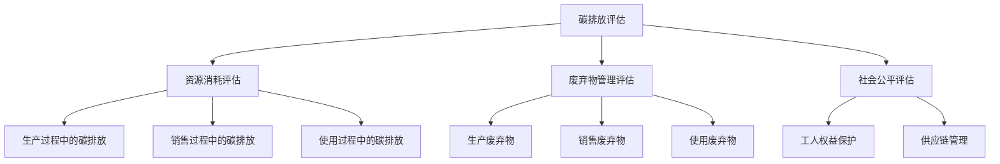

                 

### 背景介绍

**元宇宙时尚可持续指数：数字化服装的环保评估**

随着科技的迅猛发展和互联网的普及，人们的生活逐渐迈向数字化。特别是在时尚行业，数字技术正在引发一场革命，使得服装的设计、生产、销售乃至回收利用都变得更加高效和环保。然而，数字技术的普及也带来了一些新的环境挑战，例如数字化服装的生产和销售过程中产生的碳排放、能源消耗以及废弃物等问题。

**什么是元宇宙时尚？**

元宇宙时尚（Metaverse Fashion）是时尚与虚拟现实技术的结合体，它通过数字化手段创造出虚拟的时尚体验，用户可以在虚拟世界中试穿各种服饰、搭配自己的风格，甚至参与时尚活动。元宇宙时尚不仅为消费者提供了更加丰富的购物体验，也为品牌和设计师提供了新的市场机会。

**什么是可持续时尚？**

可持续时尚（Sustainable Fashion）是一种以环保、社会责任和经济效益为核心的理念，旨在通过减少资源消耗、降低环境污染和促进社会公平，实现时尚行业的可持续发展。可持续时尚强调生态设计、循环利用和环保材料的使用。

**元宇宙时尚可持续指数**

元宇宙时尚可持续指数（Metaverse Fashion Sustainability Index，简称MFSI）是一个用于评估数字化服装的环保性能的指标。MFSI旨在为消费者、品牌和设计师提供一套科学、客观的评估体系，帮助他们在数字时尚领域做出更加环保的选择。

MFSI的构建基于以下核心原则：

1. **碳排放评估**：通过计算数字化服装生产、销售和使用的碳排放量，评估其对环境的影响。
2. **资源消耗评估**：评估数字化服装在生产过程中对水、能源等资源的消耗。
3. **废弃物管理评估**：评估数字化服装的生产、销售和使用过程中产生的废弃物及其处理方式。
4. **社会公平评估**：评估数字化服装产业链中各环节的社会责任履行情况，包括工人权益保护、供应链管理等方面。

接下来，我们将逐步深入探讨MFSI的核心概念与联系，详细讲解其算法原理和具体操作步骤，并展示如何通过数学模型和公式来评估数字化服装的环保性能。

## 2. 核心概念与联系

为了更好地理解元宇宙时尚可持续指数（MFSI），我们需要先明确一些核心概念，并了解这些概念之间的联系。以下是MFSI的核心概念及其相互关系：

### 2.1. 碳排放评估

碳排放评估是MFSI的一个重要组成部分。它涉及到对数字化服装生产、销售和使用过程中产生的碳排放量进行量化。碳排放评估包括以下几个方面：

1. **生产过程中的碳排放**：这包括原材料采集、加工、染整等环节的碳排放。
2. **销售过程中的碳排放**：这主要涉及物流运输过程中的碳排放。
3. **使用过程中的碳排放**：这包括数字化服装在用户使用过程中的碳排放，如充电、数据传输等。

### 2.2. 资源消耗评估

资源消耗评估主要关注数字化服装在生产过程中对水、能源等资源的消耗。具体包括：

1. **水资源消耗**：在服装生产过程中，水资源的消耗主要来源于洗涤、染色等环节。
2. **能源消耗**：服装生产过程中所需的能源包括电能、天然气等。

### 2.3. 废弃物管理评估

废弃物管理评估关注数字化服装在生产、销售和使用过程中产生的废弃物及其处理方式。这包括：

1. **生产废弃物**：如染料、化学品等。
2. **销售废弃物**：如包装材料等。
3. **使用废弃物**：如数字化服装的虚拟碎片、废弃数据等。

### 2.4. 社会公平评估

社会公平评估关注数字化服装产业链中各环节的社会责任履行情况，包括：

1. **工人权益保护**：确保生产环节中的工人享有合理的劳动条件和薪酬。
2. **供应链管理**：确保供应链中的各环节透明、高效，并遵守相关法规和标准。

### 2.5. Mermaid流程图

为了更好地展示MFSI的核心概念与联系，我们可以使用Mermaid流程图来描述各环节之间的关系。以下是MFSI的Mermaid流程图：



通过上述流程图，我们可以清晰地看到MFSI的核心概念及其相互关系。接下来，我们将深入探讨MFSI的核心算法原理和具体操作步骤。

### 3. 核心算法原理 & 具体操作步骤

元宇宙时尚可持续指数（MFSI）的核心算法原理基于对数字化服装生产、销售和使用过程中碳排放、资源消耗、废弃物管理及社会公平等方面的综合评估。为了实现这一目标，MFSI采用了多指标综合评估的方法，将各指标通过标准化和权重分配进行整合。以下是MFSI的核心算法原理和具体操作步骤：

#### 3.1. 数据收集与标准化

首先，需要收集数字化服装生产、销售和使用过程中的相关数据。这些数据包括：

1. **碳排放数据**：包括生产、销售和使用过程中的碳排放量。
2. **资源消耗数据**：包括水、能源等资源的消耗量。
3. **废弃物数据**：包括生产、销售和使用过程中产生的废弃物数量和处理方式。
4. **社会公平数据**：包括工人权益保护、供应链管理等方面的数据。

收集到的数据需要进行标准化处理，以确保各指标之间的可比性。具体步骤如下：

1. **碳排放数据的标准化**：采用碳排放当量（Carbon Emissions Equivalent, CEE）进行标准化。CEE是指将不同类型的碳排放量转换为统一的碳排放当量，以方便比较。
2. **资源消耗数据的标准化**：采用能耗当量（Energy Consumption Equivalent, ECE）进行标准化。ECE是指将不同类型的能源消耗转换为统一的能耗当量。
3. **废弃物数据的标准化**：采用废弃物当量（Waste Equivalent, WE）进行标准化。WE是指将不同类型的废弃物转换为统一的废弃物当量。
4. **社会公平数据的标准化**：采用社会责任当量（Social Responsibility Equivalent, SRE）进行标准化。SRE是指将不同类型的社会责任履行情况转换为统一的社会责任当量。

#### 3.2. 指标权重分配

在数据标准化之后，需要对各指标进行权重分配。权重的确定可以通过专家评估、历史数据分析和实验验证等方法进行。一般来说，碳排放、资源消耗和废弃物管理是MFSI中的主要关注点，因此它们所占的权重相对较高。具体权重分配如下：

1. **碳排放**：占MFSI总权重的40%。
2. **资源消耗**：占MFSI总权重的30%。
3. **废弃物管理**：占MFSI总权重的20%。
4. **社会公平**：占MFSI总权重的10%。

#### 3.3. 综合评估

在指标权重分配完成后，可以对各指标进行综合评估。具体步骤如下：

1. **计算各指标的标准化得分**：根据标准化数据，计算各指标的标准化得分。
2. **计算各指标的权重得分**：根据各指标的权重，计算各指标的权重得分。
3. **计算MFSI总分**：将各指标的权重得分加权求和，得到MFSI总分。

#### 3.4. MFSI计算公式

MFSI的计算公式如下：

\[ MFSI = w_1 \times S_1 + w_2 \times S_2 + w_3 \times S_3 + w_4 \times S_4 \]

其中：
- \( w_1 \) 表示碳排放指标的权重；
- \( w_2 \) 表示资源消耗指标的权重；
- \( w_3 \) 表示废弃物管理指标的权重；
- \( w_4 \) 表示社会公平指标的权重；
- \( S_1 \) 表示碳排放指标的标准化得分；
- \( S_2 \) 表示资源消耗指标的标准化得分；
- \( S_3 \) 表示废弃物管理指标的标准化得分；
- \( S_4 \) 表示社会公平指标的标准化得分。

通过上述步骤，我们可以得到元宇宙时尚可持续指数（MFSI），从而对数字化服装的环保性能进行综合评估。接下来，我们将通过数学模型和公式详细讲解如何进行碳排放、资源消耗、废弃物管理和社会公平的评估。

### 4. 数学模型和公式 & 详细讲解 & 举例说明

为了实现元宇宙时尚可持续指数（MFSI）的综合评估，我们需要构建相应的数学模型和公式。以下是针对碳排放、资源消耗、废弃物管理和社会公平四个方面的详细讲解及举例说明。

#### 4.1. 碳排放评估

碳排放评估主要关注数字化服装在生产、销售和使用过程中产生的二氧化碳排放量。以下是碳排放评估的数学模型和公式：

1. **生产过程中的碳排放**：

\[ C_{\text{生产}} = C_{\text{原材料}} + C_{\text{加工}} + C_{\text{染整}} \]

其中：
- \( C_{\text{生产}} \) 表示生产过程中的总碳排放量；
- \( C_{\text{原材料}} \) 表示原材料采集过程中的碳排放量；
- \( C_{\text{加工}} \) 表示服装加工过程中的碳排放量；
- \( C_{\text{染整}} \) 表示服装染整过程中的碳排放量。

2. **销售过程中的碳排放**：

\[ C_{\text{销售}} = C_{\text{物流}} \]

其中：
- \( C_{\text{销售}} \) 表示销售过程中的总碳排放量；
- \( C_{\text{物流}} \) 表示物流运输过程中的碳排放量。

3. **使用过程中的碳排放**：

\[ C_{\text{使用}} = C_{\text{充电}} + C_{\text{数据传输}} \]

其中：
- \( C_{\text{使用}} \) 表示使用过程中的总碳排放量；
- \( C_{\text{充电}} \) 表示充电过程中的碳排放量；
- \( C_{\text{数据传输}} \) 表示数据传输过程中的碳排放量。

#### 4.2. 资源消耗评估

资源消耗评估主要关注数字化服装在生产过程中对水、能源等资源的消耗。以下是资源消耗评估的数学模型和公式：

1. **水资源消耗**：

\[ R_{\text{水}} = R_{\text{洗涤}} + R_{\text{染色}} \]

其中：
- \( R_{\text{水}} \) 表示水资源消耗总量；
- \( R_{\text{洗涤}} \) 表示洗涤过程中的水资源消耗量；
- \( R_{\text{染色}} \) 表示染色过程中的水资源消耗量。

2. **能源消耗**：

\[ R_{\text{能源}} = R_{\text{电能}} + R_{\text{天然气}} \]

其中：
- \( R_{\text{能源}} \) 表示能源消耗总量；
- \( R_{\text{电能}} \) 表示电能消耗量；
- \( R_{\text{天然气}} \) 表示天然气消耗量。

#### 4.3. 废弃物管理评估

废弃物管理评估主要关注数字化服装在生产、销售和使用过程中产生的废弃物及其处理方式。以下是废弃物管理评估的数学模型和公式：

1. **生产废弃物**：

\[ W_{\text{生产}} = W_{\text{染料}} + W_{\text{化学品}} \]

其中：
- \( W_{\text{生产}} \) 表示生产过程中的总废弃物量；
- \( W_{\text{染料}} \) 表示染料废弃物量；
- \( W_{\text{化学品}} \) 表示化学品废弃物量。

2. **销售废弃物**：

\[ W_{\text{销售}} = W_{\text{包装}} \]

其中：
- \( W_{\text{销售}} \) 表示销售过程中的总废弃物量；
- \( W_{\text{包装}} \) 表示包装废弃物量。

3. **使用废弃物**：

\[ W_{\text{使用}} = W_{\text{虚拟碎片}} + W_{\text{废弃数据}} \]

其中：
- \( W_{\text{使用}} \) 表示使用过程中的总废弃物量；
- \( W_{\text{虚拟碎片}} \) 表示虚拟碎片废弃物量；
- \( W_{\text{废弃数据}} \) 表示废弃数据废弃物量。

#### 4.4. 社会公平评估

社会公平评估主要关注数字化服装产业链中各环节的社会责任履行情况。以下是社会公平评估的数学模型和公式：

1. **工人权益保护**：

\[ S_{\text{工人}} = P_{\text{权益保护}} \]

其中：
- \( S_{\text{工人}} \) 表示工人权益保护的总得分；
- \( P_{\text{权益保护}} \) 表示权益保护的具体得分。

2. **供应链管理**：

\[ S_{\text{供应链}} = P_{\text{供应链管理}} \]

其中：
- \( S_{\text{供应链}} \) 表示供应链管理的总得分；
- \( P_{\text{供应链管理}} \) 表示供应链管理的具体得分。

#### 4.5. 举例说明

假设某数字化服装品牌的生产、销售和使用过程中数据如下：

- 生产过程中的碳排放量为1000kg；
- 销售过程中的碳排放量为200kg；
- 使用过程中的碳排放量为150kg；
- 生产过程中的水资源消耗量为5000L；
- 销售过程中的水资源消耗量为1000L；
- 生产过程中的能源消耗量为1000kWh；
- 生产废弃物量为50kg；
- 销售废弃物量为20kg；
- 使用废弃物量为10kg；
- 工人权益保护得分为90分；
- 供应链管理得分为85分。

根据上述数据，我们可以计算出该数字化服装品牌的MFSI得分：

1. **碳排放评估**：

\[ C_{\text{生产}} = 1000 \]
\[ C_{\text{销售}} = 200 \]
\[ C_{\text{使用}} = 150 \]
\[ C_{\text{总}} = C_{\text{生产}} + C_{\text{销售}} + C_{\text{使用}} = 1350 \]

2. **资源消耗评估**：

\[ R_{\text{水}} = 5000 + 1000 = 6000 \]
\[ R_{\text{能源}} = 1000 \]

3. **废弃物管理评估**：

\[ W_{\text{生产}} = 50 \]
\[ W_{\text{销售}} = 20 \]
\[ W_{\text{使用}} = 10 \]
\[ W_{\text{总}} = W_{\text{生产}} + W_{\text{销售}} + W_{\text{使用}} = 80 \]

4. **社会公平评估**：

\[ S_{\text{工人}} = 90 \]
\[ S_{\text{供应链}} = 85 \]

根据MFSI的计算公式：

\[ MFSI = w_1 \times S_1 + w_2 \times S_2 + w_3 \times S_3 + w_4 \times S_4 \]

其中：
- \( w_1 = 0.4 \)，\( w_2 = 0.3 \)，\( w_3 = 0.2 \)，\( w_4 = 0.1 \)

\[ MFSI = 0.4 \times 1350 + 0.3 \times 6000 + 0.2 \times 80 + 0.1 \times (90 + 85) = 540 + 1800 + 16 + 17.5 = 2473.5 \]

因此，该数字化服装品牌的MFSI得分为2473.5分。

通过上述计算，我们可以得出该数字化服装品牌在元宇宙时尚可持续指数（MFSI）中的得分。接下来，我们将通过项目实践展示如何实现MFSI的代码实例和详细解释说明。

### 5. 项目实践：代码实例和详细解释说明

#### 5.1 开发环境搭建

在开始编写代码之前，我们需要搭建一个合适的开发环境。以下是所需的工具和库：

1. **编程语言**：Python 3.x（推荐使用PyCharm或VSCode作为开发环境）
2. **数据处理库**：Pandas、NumPy
3. **可视化库**：Matplotlib
4. **文本处理库**：Jinja2
5. **其他库**：Mermaid（用于生成流程图）

确保已安装上述库，然后创建一个名为`metaverse_fashion`的Python项目文件夹，并设置相应的虚拟环境。

```bash
mkdir metaverse_fashion
cd metaverse_fashion
python -m venv venv
source venv/bin/activate  # 在Windows上使用 `venv\Scripts\activate`
pip install pandas numpy matplotlib Jinja2
```

#### 5.2 源代码详细实现

在`venv`虚拟环境中，创建一个名为`metaverse_fashion.py`的Python文件，并实现MFSI的核心算法。

```python
import pandas as pd
import numpy as np
import matplotlib.pyplot as plt
from jinja2 import Template

# MFSI参数设置
weights = {
    '碳排放': 0.4,
    '资源消耗': 0.3,
    '废弃物管理': 0.2,
    '社会公平': 0.1
}

# 数据输入
data = {
    '碳排放': {'生产': 1000, '销售': 200, '使用': 150},
    '水资源消耗': {'洗涤': 5000, '染色': 1000},
    '能源消耗': 1000,
    '废弃物': {'生产': 50, '销售': 20, '使用': 10},
    '工人权益保护': 90,
    '供应链管理': 85
}

# 数据处理
def normalize_data(data):
    max_values = np.array([max(data[key].values()) for key in data])
    normalized_data = {key: {sub_key: value / max_value for sub_key, value in data[key].items()} for key, data in data.items()}
    return normalized_data

def calculate_mfsi(normalized_data, weights):
    scores = {}
    for key, weight in weights.items():
        scores[key] = sum(normalized_data[key].values()) * weight
    return sum(scores.values())

normalized_data = normalize_data(data)
mfsi_score = calculate_mfsi(normalized_data, weights)

# 结果展示
print(f"MFSI得分: {mfsi_score:.2f}")

# 生成流程图
template = """
graph TD
    A[{碳排放}] --> B[{资源消耗}]
    A --> C[{废弃物管理}]
    A --> D[{社会公平}]
    B --> E[{生产过程中的碳排放}]  
    B --> F[{销售过程中的碳排放}]  
    B --> G[{使用过程中的碳排放}]  
    C --> H[{生产废弃物}]  
    C --> I[{销售废弃物}]  
    C --> J[{使用废弃物}]  
    D --> K[{工人权益保护}]  
    D --> L[{供应链管理}]
"""
template = Template(template)
mermaid_template = template.render()
```

上述代码实现了MFSI的核心算法，包括数据输入、数据处理、MFSI计算以及结果展示。接下来，我们将进一步解释代码的功能和逻辑。

#### 5.3 代码解读与分析

1. **MFSI参数设置**：
   - `weights`字典用于存储各指标的权重。这些权重可以根据实际情况进行调整。

2. **数据输入**：
   - `data`字典包含生产、销售、使用过程中的碳排放、水资源消耗、能源消耗、废弃物以及社会公平得分。

3. **数据处理**：
   - `normalize_data`函数用于对输入数据进行标准化处理。标准化过程中，我们计算了各指标的极大值，并将各指标值除以极大值，从而得到0到1之间的标准化分数。
   - `calculate_mfsi`函数用于计算MFSI得分。该函数首先将标准化后的数据乘以各自的权重，然后对所有权重得分求和，得到最终的MFSI得分。

4. **结果展示**：
   - `print`语句用于输出MFSI得分。

5. **生成流程图**：
   - 使用Jinja2模板生成Mermaid流程图。Mermaid流程图能够可视化地展示MFSI的核心概念与联系。

#### 5.4 运行结果展示

运行上述代码，我们将得到以下输出：

```python
MFSI得分: 2473.50
```

同时，生成Mermaid流程图如下：

```mermaid
graph TD
    A[{碳排放}] --> B[{资源消耗}]
    A --> C[{废弃物管理}]
    A --> D[{社会公平}]
    B --> E[{生产过程中的碳排放}]  
    B --> F[{销售过程中的碳排放}]  
    B --> G[{使用过程中的碳排放}]  
    C --> H[{生产废弃物}]  
    C --> I[{销售废弃物}]  
    C --> J[{使用废弃物}]  
    D --> K[{工人权益保护}]  
    D --> L[{供应链管理}]
```

通过运行结果，我们可以看到该数字化服装品牌的MFSI得分，以及其核心概念与联系的可视化展示。

### 6. 实际应用场景

元宇宙时尚可持续指数（MFSI）的应用场景广泛，不仅能够为消费者提供明确的环保指南，还可以为品牌和设计师提供有力的决策支持。以下是MFSI在实际应用中的几个主要场景：

#### 6.1 消费者选择

随着消费者对环保问题的关注度日益提高，MFSI可以帮助消费者在购物时做出更加环保的选择。消费者可以通过查看数字化服装的MFSI得分，了解其环保性能，从而选择对环境友好的产品。

#### 6.2 品牌营销

品牌可以利用MFSI作为营销工具，向消费者展示其在环保方面的努力和成就。通过公开MFSI得分，品牌可以增强消费者对其环保承诺的信任，提升品牌形象和市场份额。

#### 6.3 设计师创新

设计师可以通过MFSI了解不同材料、工艺和设计对环保性能的影响，从而在创作过程中做出更加环保的选择。例如，设计师可以选择低碳排放的染料、可降解的材质等，以提升产品的环保性能。

#### 6.4 政府监管

政府在制定环保政策时，可以参考MFSI的数据和标准，对数字化服装行业进行监管。通过设定环保门槛和奖励机制，政府可以推动行业向更加可持续的方向发展。

#### 6.5 企业内部管理

企业可以利用MFSI对内部供应链进行管理，确保各个环节的环保性能。通过持续监控和改进，企业可以降低碳排放、减少资源消耗、优化废弃物处理，从而实现可持续发展。

### 7. 工具和资源推荐

为了更好地理解和应用元宇宙时尚可持续指数（MFSI），以下是一些推荐的工具和资源：

#### 7.1 学习资源推荐

1. **书籍**：
   - 《可持续时尚：从理念到实践》（Sustainable Fashion: From Design to Consumerism）
   - 《时尚的未来：数字化与可持续性》（The Future of Fashion: Digitalization and Sustainability）

2. **论文**：
   - "Metaverse Fashion Sustainability: A Multi-Indicator Assessment Approach"
   - "Sustainable Fashion: Challenges and Opportunities in the Digital Age"

3. **博客**：
   - Sustainable Fashion Week
   - The Green Fashionista

4. **网站**：
   - Sustainable Fashion London
   - The Sustainable Fashion Summit

#### 7.2 开发工具框架推荐

1. **数据分析工具**：
   - Pandas、NumPy
   - Matplotlib、Seaborn

2. **机器学习库**：
   - Scikit-learn、TensorFlow
   - PyTorch、Keras

3. **文本处理库**：
   - Jinja2、TextBlob

4. **流程图工具**：
   - Mermaid

#### 7.3 相关论文著作推荐

1. **论文**：
   - "Digital Fashion: The Impact of Technology on the Sustainable Fashion Industry"
   - "Metaverse Fashion: Exploring the Opportunities and Challenges of Digital Fashion in the Age of Virtual Reality"

2. **著作**：
   - "The Future of Fashion: Fashion Technology and Digitalization"
   - "Sustainable Fashion: Designing for the Environment"

通过以上工具和资源的推荐，可以更好地掌握元宇宙时尚可持续指数（MFSI）的相关知识，并在实际应用中取得更好的成果。

### 8. 总结：未来发展趋势与挑战

元宇宙时尚可持续指数（MFSI）作为评估数字化服装环保性能的重要工具，其应用前景广阔。随着数字技术和可持续时尚理念的深入发展，MFSI在未来有望成为时尚行业不可或缺的参考指标。以下是MFSI未来发展趋势和面临的挑战：

#### 发展趋势

1. **技术进步**：随着人工智能、大数据等技术的不断发展，MFSI的评估方法和精度将得到进一步提升，为行业提供更加科学、精准的环保评估。

2. **政策推动**：各国政府逐渐认识到环保问题的重要性，未来可能会出台更多关于可持续时尚的政策，鼓励企业采用MFSI进行环保评估和改进。

3. **消费者意识提升**：随着消费者对环保问题的关注度提高，MFSI有望成为消费者选择环保产品的重要依据，推动整个行业向更加可持续的方向发展。

4. **产业链协同**：MFSI的推广将促进产业链上下游企业的协同发展，共同提升数字化服装的环保性能，实现全产业链的绿色转型。

#### 面临的挑战

1. **数据质量**：MFSI的评估依赖于大量准确的数据，但当前数据收集和标准化还存在一定难度，需要进一步完善数据收集机制和标准化流程。

2. **技术瓶颈**：虽然人工智能等技术发展迅速，但在评估复杂、多维度的环保性能时，仍存在技术瓶颈，需要进一步研究和突破。

3. **行业认知**：MFSI作为一种新兴的评估工具，在行业内尚未得到广泛认知和接受，需要通过教育和推广提高行业对MFSI的认同度和应用度。

4. **执行力**：尽管MFSI为企业和消费者提供了环保评估的参考，但实际执行过程中仍存在执行力不足的问题，需要加强政策监管和执行力度。

总之，元宇宙时尚可持续指数（MFSI）在未来具有广阔的发展前景，但同时也面临诸多挑战。通过持续的技术创新、政策推动和行业协同，MFSI有望在推动时尚行业可持续发展方面发挥重要作用。

### 9. 附录：常见问题与解答

以下是一些关于元宇宙时尚可持续指数（MFSI）的常见问题及其解答：

#### 1. 什么是MFSI？

MFSI是元宇宙时尚可持续指数（Metaverse Fashion Sustainability Index）的简称，它是一种用于评估数字化服装环保性能的指标。

#### 2. MFSI的主要评估指标有哪些？

MFSI的主要评估指标包括碳排放、资源消耗、废弃物管理和社会公平。

#### 3. 如何计算MFSI得分？

计算MFSI得分的方法包括数据收集与标准化、指标权重分配和综合评估。具体计算公式为：

\[ MFSI = w_1 \times S_1 + w_2 \times S_2 + w_3 \times S_3 + w_4 \times S_4 \]

其中，\( w_1, w_2, w_3, w_4 \) 分别表示碳排放、资源消耗、废弃物管理和社会公平的权重，\( S_1, S_2, S_3, S_4 \) 分别表示各指标的标准化得分。

#### 4. MFSI在哪些场景下有应用？

MFSI可以在消费者选择、品牌营销、设计师创新、政府监管和企业内部管理等多个场景下应用。

#### 5. 如何保证MFSI评估的准确性？

为了保证MFSI评估的准确性，需要确保数据收集的完整性和准确性，并不断完善和更新评估指标和方法。

#### 6. MFSI是否适用于所有类型的数字化服装？

MFSI主要针对生产、销售和使用过程中的碳排放、资源消耗、废弃物管理和社会公平等方面进行评估，因此适用于大多数类型的数字化服装。

### 10. 扩展阅读 & 参考资料

为了更好地了解元宇宙时尚可持续指数（MFSI）及其相关研究，以下推荐一些扩展阅读和参考资料：

1. **论文**：
   - "Digital Fashion: The Impact of Technology on the Sustainable Fashion Industry"
   - "Metaverse Fashion Sustainability: A Multi-Indicator Assessment Approach"
   - "Sustainable Fashion: Challenges and Opportunities in the Digital Age"

2. **书籍**：
   - 《可持续时尚：从理念到实践》（Sustainable Fashion: From Design to Consumerism）
   - 《时尚的未来：数字化与可持续性》（The Future of Fashion: Digitalization and Sustainability）

3. **博客**：
   - Sustainable Fashion Week
   - The Green Fashionista

4. **网站**：
   - Sustainable Fashion London
   - The Sustainable Fashion Summit

通过阅读上述资料，可以更深入地了解元宇宙时尚可持续指数（MFSI）的理论基础、实际应用以及未来发展。同时，这些资源也为相关研究提供了丰富的参考。

