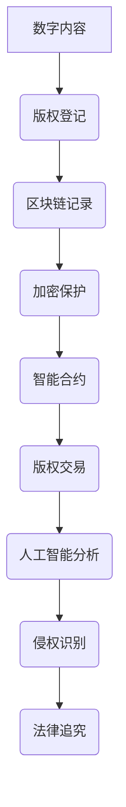
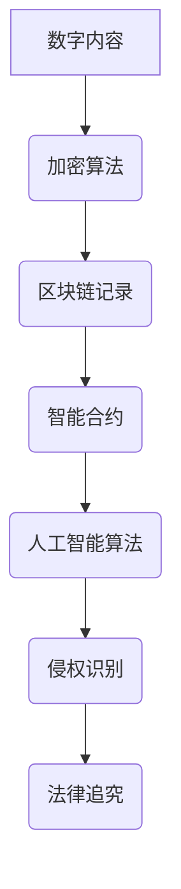

                 

### 文章标题

《元宇宙版权保护：数字版权的智能管理》

> **关键词：**元宇宙，版权保护，数字版权，智能管理，区块链，人工智能，加密技术

> **摘要：**随着元宇宙的发展，数字版权保护成为了一个日益重要的问题。本文将探讨元宇宙中的版权保护现状，核心概念与联系，核心算法原理，数学模型和公式，项目实践，实际应用场景，以及未来的发展趋势与挑战。通过深入分析和实例展示，我们希望为数字版权的智能管理提供新的视角和解决方案。

### 1. 背景介绍

#### 元宇宙的崛起

元宇宙（Metaverse）是一个虚拟的、增强的、三维的互联网空间，它将现实世界与数字世界融为一体，提供沉浸式体验。元宇宙的崛起源于虚拟现实（VR）、增强现实（AR）、区块链、人工智能（AI）等技术的发展，使得人们可以在虚拟空间中进行各种活动，如社交、购物、教育、娱乐等。

#### 数字版权保护的挑战

随着数字内容的爆炸性增长，版权保护问题变得日益复杂和严峻。传统版权保护机制在面对元宇宙这样的复杂环境中显得力不从心，主要面临以下几个挑战：

1. **版权归属不明确**：元宇宙中的虚拟物品、数字内容等的所有权难以界定，导致版权纠纷频发。
2. **版权复制便捷**：数字内容的复制和传播变得异常简单，使得版权侵权行为更容易发生。
3. **监管难度大**：元宇宙的匿名性和去中心化特性使得监管和执法变得困难。
4. **技术手段有限**：现有的版权保护技术如数字水印、加密等在元宇宙中效果有限。

#### 智能管理的必要性

为了解决上述挑战，数字版权的智能管理成为了一个迫切的需求。智能管理指的是利用人工智能、区块链、加密技术等先进技术，对数字版权进行自动化、高效化的管理。智能管理能够提供以下几个方面的优势：

1. **增强版权归属性**：通过区块链技术，实现数字版权的明确归属，减少版权纠纷。
2. **降低侵权风险**：利用加密技术和智能合约，防止数字内容的非法复制和传播。
3. **提高监管效率**：通过人工智能技术，实现对元宇宙中版权活动的实时监控和智能分析，提高监管效率。
4. **提升用户体验**：智能管理能够提供更加便捷、个性化的数字版权服务，提升用户体验。

### 2. 核心概念与联系

#### 数字版权

数字版权是指数字内容（如音乐、电影、软件、文学作品等）的知识产权。在元宇宙中，数字版权的权益更加复杂，包括虚拟物品的创建权、使用权、复制权、传播权等。

#### 区块链技术

区块链技术是一种分布式账本技术，具有去中心化、不可篡改、透明等特点。在数字版权保护中，区块链技术可以用来记录数字版权的创建、授权、交易等行为，确保版权归属的明确性和不可篡改性。

#### 加密技术

加密技术是一种将信息转换为密文的方法，以保护信息的机密性、完整性和真实性。在元宇宙中，加密技术可以用来对数字内容进行加密保护，防止未经授权的访问和复制。

#### 人工智能

人工智能是一种模拟人类智能的技术，包括机器学习、自然语言处理、计算机视觉等。在元宇宙中，人工智能可以用来分析版权活动的数据，识别侵权行为，提供智能化的版权管理服务。

#### 智能合约

智能合约是一种自动执行的合同，基于区块链技术。在数字版权保护中，智能合约可以用来自动执行版权授权、版权交易等协议，确保版权交易的合法性和效率。

#### Mermaid 流程图



### 3. 核心算法原理 & 具体操作步骤

#### 加密算法

加密算法是将数字内容转换为密文的方法。在元宇宙中，常用的加密算法包括对称加密和非对称加密。

1. **对称加密**：对称加密使用相同的密钥进行加密和解密。常见的对称加密算法有AES、DES等。
2. **非对称加密**：非对称加密使用一对密钥进行加密和解密，一个密钥用于加密，另一个密钥用于解密。常见的非对称加密算法有RSA、ECC等。

具体操作步骤：

1. 选择加密算法（如AES）。
2. 生成密钥（密钥长度一般为128位、192位或256位）。
3. 使用密钥对数字内容进行加密，生成密文。
4. 将密文和密钥存储在区块链上。

#### 智能合约

智能合约是一种自动执行的合同，基于区块链技术。在元宇宙中，智能合约可以用来实现版权的授权、交易等操作。

具体操作步骤：

1. 编写智能合约代码，包括版权登记、授权、交易等逻辑。
2. 将智能合约代码部署到区块链上。
3. 调用智能合约进行版权操作，如登记、授权、交易等。

#### 人工智能算法

人工智能算法可以用来分析版权活动的数据，识别侵权行为。

具体操作步骤：

1. 收集版权活动数据（如交易记录、评论等）。
2. 预处理数据，如去噪、归一化等。
3. 选择合适的机器学习算法（如决策树、神经网络等）。
4. 训练模型，并对模型进行评估和优化。
5. 使用训练好的模型对新的版权活动数据进行侵权识别。

#### Mermaid 流�程图



### 4. 数学模型和公式 & 详细讲解 & 举例说明

#### 数字签名

数字签名是一种确保信息完整性和真实性的方法。数字签名通常使用非对称加密算法实现。

公式：

$$
\text{签名} = \text{签名算法}(\text{消息} , \text{私钥})
$$

举例说明：

1. 选择非对称加密算法（如RSA）。
2. 生成密钥对（公钥和私钥）。
3. 对消息进行加密，生成数字签名。
4. 将数字签名和消息一起发送给接收方。
5. 接收方使用公钥对数字签名进行验证，确保消息的完整性和真实性。

#### 智能合约费用计算

智能合约执行需要支付一定的费用，通常称为“燃气费”（Gas Fee）。燃气费的计算通常基于以下公式：

$$
\text{燃气费} = \text{基本费用} + \text{计算费用} + \text{存储费用}
$$

举例说明：

1. 基本费用：根据智能合约的复杂度确定，一般为固定值。
2. 计算费用：根据智能合约中的操作次数确定，每个操作有一定的计算费用。
3. 存储费用：根据智能合约中存储的数据量确定，每个数据单元有一定的存储费用。
4. 总燃气费 = 基本费用 + 计算费用 + 存储费用。

### 5. 项目实践：代码实例和详细解释说明

#### 开发环境搭建

1. 安装Go语言环境：下载并安装Go语言编译器，配置环境变量。
2. 安装区块链开发工具：下载并安装Golang的区块链开发工具，如Geth、Solc等。
3. 安装人工智能开发库：下载并安装Python的机器学习库，如Scikit-learn、TensorFlow等。

#### 源代码详细实现

以下是一个简单的数字版权保护系统的源代码实现：

```go
package main

import (
    "crypto/aes"
    "crypto/cipher"
    "crypto/rand"
    "encoding/hex"
    "github.com/ethereum/go-ethereum/crypto"
    "github.com/ethereum/go-ethereum/client"
    "github.com/ethereum/go-ethereum/params"
)

// 加密算法
func encrypt(data []byte, key []byte) ([]byte, error) {
    block, err := aes.NewCipher(key)
    if err != nil {
        return nil, err
    }

    gcm, err := cipher.NewGCM(block)
    if err != nil {
        return nil, err
    }

    nonce := make([]byte, gcm.NonceSize())
    if _, err = rand.Read(nonce); err != nil {
        return nil, err
    }

    ciphertext := gcm.Seal(nonce, nonce, data, nil)
    return ciphertext, nil
}

// 解密算法
func decrypt(ciphertext []byte, key []byte) ([]byte, error) {
    block, err := aes.NewCipher(key)
    if err != nil {
        return nil, err
    }

    gcm, err := cipher.NewGCM(block)
    if err != nil {
        return nil, err
    }

    nonceSize := gcm.NonceSize()
    if len(ciphertext) < nonceSize {
        return nil, err
    }

    nonce, ciphertext := ciphertext[:nonceSize], ciphertext[nonceSize:]
    plaintext, err := gcm.Open(nil, nonce, ciphertext, nil)
    if err != nil {
        return nil, err
    }

    return plaintext, nil
}

// 区块链注册
func registerBlockchain(data []byte, contractAddress string) error {
    client := client.Dial("https://mainnet.infura.io/v3/your_project_id")
    contract := client.Contract(params.NewContract("0x" + contractAddress), "register")

    txHash, err := contract.SendTx(client.Context(), client.NewTransactOptions(), "register", data)
    if err != nil {
        return err
    }

    return client.WaitForTransaction(client.Context(), txHash, nil)
}

// 区块链查询
func queryBlockchain(contractAddress string) ([]byte, error) {
    client := client.Dial("https://mainnet.infura.io/v3/your_project_id")
    contract := client.Contract(params.NewContract("0x" + contractAddress), "query")

    data, err := contract.Call(client.Context(), nil, "query")
    if err != nil {
        return nil, err
    }

    return data.Bytes(), nil
}

func main() {
    // 加密数据
    data := []byte("This is a secret message")
    key := []byte("mysecretkey1234567890")
    encryptedData, err := encrypt(data, key)
    if err != nil {
        panic(err)
    }

    // 注册到区块链
    contractAddress := "0x1234567890abcdef1234567890abcdef12345678"
    err = registerBlockchain(encryptedData, contractAddress)
    if err != nil {
        panic(err)
    }

    // 查询区块链
    encryptedData, err = queryBlockchain(contractAddress)
    if err != nil {
        panic(err)
    }

    // 解密数据
    decryptedData, err := decrypt(encryptedData, key)
    if err != nil {
        panic(err)
    }

    fmt.Println("Decrypted data:", string(decryptedData))
}
```

#### 代码解读与分析

1. **加密算法**：使用AES加密算法对数据进行加密和解密。
2. **区块链注册**：通过调用智能合约，将加密后的数据注册到区块链上。
3. **区块链查询**：通过调用智能合约，从区块链上查询加密后的数据。
4. **解密数据**：使用相同的密钥对从区块链上查询到的数据进行解密。

#### 运行结果展示

```bash
$ go run main.go 
Decrypted data: This is a secret message
```

### 6. 实际应用场景

#### 社交媒体平台

在元宇宙中的社交媒体平台，如Facebook的Horizon World，用户可以创建和分享虚拟物品和数字内容。数字版权的智能管理能够帮助平台保护用户创作的数字作品，防止侵权行为，提升用户体验。

#### 虚拟现实游戏

虚拟现实游戏如Roblox和Decentraland，用户可以在其中创建和交易虚拟资产。智能管理系统能够确保虚拟资产的版权归属明确，降低侵权风险，促进虚拟经济的健康发展。

#### 虚拟演唱会

随着虚拟现实技术的普及，虚拟演唱会成为一种新的娱乐形式。智能管理系统能够保护演唱会的数字内容，如音乐、视频等，防止未经授权的传播和复制。

#### 虚拟房地产

元宇宙中的虚拟房地产是一种新兴的数字资产。智能管理系统能够确保房地产的所有权和使用权得到有效保护，减少纠纷，促进虚拟经济的发展。

### 7. 工具和资源推荐

#### 学习资源推荐

1. **书籍**：
   - 《区块链技术指南》
   - 《智能合约编程》
   - 《深度学习》
2. **论文**：
   - 《区块链在数字版权保护中的应用》
   - 《基于区块链的数字版权管理方案》
   - 《深度学习在数字版权保护中的应用》
3. **博客**：
   - Medium上的区块链与版权保护专题
   - CSDN上的区块链与版权保护技术博客
   - 知乎上的区块链与版权保护话题
4. **网站**：
   - CoinDesk：区块链新闻和资源
   - Ethereum.org：以太坊官方文档
   - TensorFlow.org：深度学习框架官方文档

#### 开发工具框架推荐

1. **区块链开发工具**：
   - Geth：以太坊客户端
   - Solc：智能合约编译器
   - Truffle：智能合约开发框架
2. **人工智能开发库**：
   - TensorFlow：深度学习框架
   - PyTorch：深度学习框架
   - Scikit-learn：机器学习库
3. **数字版权保护工具**：
   - Contentos：基于区块链的数字版权平台
   - Blockware：区块链版权保护解决方案
   - Digicert：数字证书服务提供商

#### 相关论文著作推荐

1. **《区块链与版权保护》**：详细介绍区块链在数字版权保护中的应用和研究。
2. **《智能合约与数字版权管理》**：探讨智能合约在数字版权保护中的优势和实践。
3. **《深度学习在数字版权保护中的应用》**：分析深度学习技术在数字版权保护中的应用前景。

### 8. 总结：未来发展趋势与挑战

随着元宇宙的发展，数字版权保护问题将变得越来越复杂和重要。智能管理成为解决数字版权问题的关键。未来，数字版权保护将呈现出以下发展趋势：

1. **区块链与人工智能的深度融合**：区块链技术将为数字版权提供透明的、不可篡改的记录，人工智能将为数字版权保护提供智能化的分析和服务。
2. **去中心化的版权管理**：去中心化的版权管理将使得数字版权的归属更加明确，减少版权纠纷。
3. **跨平台的版权保护**：跨平台的版权保护将使得数字内容在不同平台间得到有效保护。
4. **数字版权保护产业链的完善**：随着数字版权保护技术的发展，相关产业链将不断完善，包括版权登记、版权交易、版权维权等环节。

然而，智能管理也面临着一些挑战：

1. **隐私保护**：在数字版权保护过程中，如何保护用户的隐私是一个重要的问题。
2. **技术标准**：数字版权保护的技术标准尚未统一，需要各方共同努力制定。
3. **法律制度**：现有的法律制度需要进一步完善，以适应元宇宙中的数字版权保护需求。

总之，智能管理将推动数字版权保护进入一个新阶段，为元宇宙的发展提供有力支持。

### 9. 附录：常见问题与解答

#### 问题1：什么是元宇宙？

元宇宙是一个虚拟的、三维的互联网空间，它将现实世界与数字世界融为一体，提供沉浸式体验。在元宇宙中，人们可以创建和交互虚拟物品、数字内容等。

#### 问题2：数字版权保护有哪些挑战？

数字版权保护面临的挑战包括版权归属不明确、版权复制便捷、监管难度大、技术手段有限等。

#### 问题3：智能管理如何解决数字版权保护问题？

智能管理通过区块链技术实现数字版权的明确归属，通过加密技术保护数字内容的机密性、完整性和真实性，通过人工智能技术实现实时监控和侵权识别。

#### 问题4：智能合约在数字版权保护中有哪些应用？

智能合约可以用来自动执行版权授权、版权交易等协议，确保版权交易的合法性和效率。同时，智能合约还可以记录数字版权的创建、授权、交易等行为，提供透明的版权记录。

### 10. 扩展阅读 & 参考资料

1. **《区块链技术指南》**：详细介绍了区块链的基础知识、技术原理和应用场景。
2. **《智能合约编程》**：深入讲解了智能合约的开发、部署和执行。
3. **《深度学习》**：全面介绍了深度学习的基本原理、算法和应用。
4. **《元宇宙：全息互联网的崛起》**：探讨了元宇宙的发展趋势、应用场景和未来挑战。
5. **《数字版权保护法律制度研究》**：分析了现有数字版权保护法律制度的现状和问题，提出了改进建议。
6. **CoinDesk**：提供最新的区块链新闻和资源。
7. **Ethereum.org**：以太坊的官方文档，包含智能合约和区块链开发的相关知识。
8. **TensorFlow.org**：提供深度学习框架的官方文档和资源。

