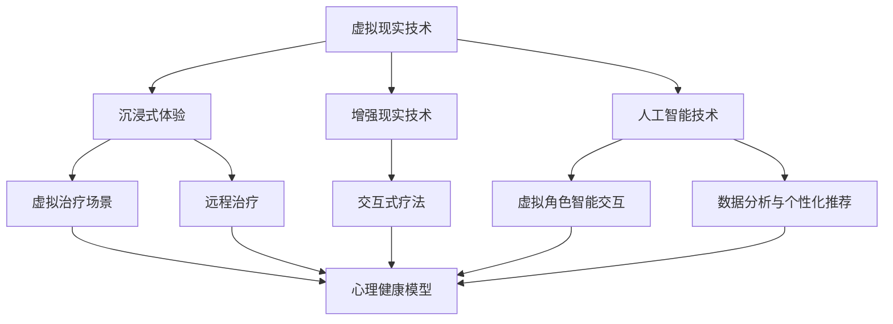

                 

关键词：元宇宙，精神治疗，虚拟世界，技术，心理健康

> 摘要：本文将探讨元宇宙中的精神治疗技术，介绍其在虚拟世界中的应用，分析其核心算法原理和具体操作步骤，展示数学模型与公式的构建与推导，并通过项目实践中的代码实例，详细解释说明其在实际场景中的运行效果和未来应用前景。最后，我们将总结研究成果，探讨未来发展趋势与挑战，为相关领域的研究和实际应用提供有价值的参考。

## 1. 背景介绍

随着虚拟现实技术和人工智能的不断发展，元宇宙这一概念逐渐走进了大众视野。元宇宙是一个由虚拟世界构成的互联网空间，用户可以在这个虚拟世界中进行各种活动，包括社交、娱乐、工作等。而精神治疗，作为一种帮助人们解决心理问题的方法，也逐渐在元宇宙中找到了新的应用场景。通过虚拟世界，精神治疗师可以与患者进行远程互动，提供更加个性化和高效的咨询服务。

### 1.1 元宇宙的定义与特点

元宇宙是一个虚拟的、三维的、沉浸式的互联网空间，它通过先进的虚拟现实、增强现实和人工智能技术，为用户提供了一个全新的交互方式。在元宇宙中，用户可以创建自己的数字身份，与其他用户进行实时互动，参与各种虚拟活动。元宇宙的特点包括：

1. **沉浸式体验**：用户可以完全沉浸在一个虚拟的三维世界中，感受到身临其境的体验。
2. **高度互动性**：用户可以与其他用户进行实时互动，建立社交关系，参与虚拟活动。
3. **多样化的内容**：元宇宙中包含丰富的内容，如虚拟游戏、虚拟社交平台、虚拟教育等。

### 1.2 精神治疗在元宇宙中的应用

在元宇宙中，精神治疗的应用主要体现在以下几个方面：

1. **远程治疗**：通过虚拟世界，精神治疗师可以与患者进行远程互动，提供个性化的咨询服务，无需面对面交流。
2. **虚拟治疗场景**：在虚拟世界中，可以创建各种治疗场景，如放松花园、海洋世界等，帮助患者更好地进入治疗状态。
3. **交互式疗法**：通过虚拟现实技术，患者可以在虚拟世界中参与各种交互式活动，如模拟社交互动、虚拟运动等，帮助其改善心理问题。

## 2. 核心概念与联系

在探讨元宇宙中的精神治疗技术时，我们需要了解以下几个核心概念：

1. **虚拟现实（VR）技术**：虚拟现实技术是元宇宙的基础，它通过头戴显示器、手柄等设备，将用户带入一个虚拟的三维世界。
2. **增强现实（AR）技术**：增强现实技术是在现实世界中叠加虚拟元素，使用户能够与现实世界进行互动。
3. **人工智能（AI）技术**：人工智能技术在元宇宙中的应用主要体现在虚拟角色的智能交互、数据分析和个性化推荐等方面。
4. **心理健康模型**：心理健康模型是对个体心理状态的量化描述，包括情绪、焦虑、抑郁等指标。

以下是元宇宙中精神治疗技术的核心概念和联系流程图：



### 2.1 虚拟现实技术与沉浸式体验

虚拟现实技术通过头戴显示器、手柄等设备，为用户创造一个虚拟的三维世界。用户在这个虚拟世界中可以自由行走、互动，感受到身临其境的体验。沉浸式体验是元宇宙中精神治疗的重要基础，它能够帮助患者更好地进入治疗状态，缓解焦虑和压力。

### 2.2 增强现实技术与交互式疗法

增强现实技术将虚拟元素叠加在现实世界中，使用户能够在现实环境中与虚拟元素进行互动。在元宇宙中，增强现实技术可以用于创建各种治疗场景，如放松花园、海洋世界等，帮助患者更好地放松身心，缓解心理问题。

### 2.3 人工智能技术与心理健康模型

人工智能技术在元宇宙中的应用主要体现在虚拟角色的智能交互、数据分析和个性化推荐等方面。通过虚拟角色的智能交互，患者可以在虚拟世界中与虚拟治疗师进行实时互动，获取个性化的咨询服务。数据分析与个性化推荐则可以帮助治疗师更好地了解患者的心理状态，制定更有效的治疗方案。

## 3. 核心算法原理 & 具体操作步骤

### 3.1 算法原理概述

元宇宙中的精神治疗技术主要依赖于以下几个核心算法：

1. **虚拟现实渲染算法**：用于生成虚拟世界的三维图像，为用户提供沉浸式体验。
2. **增强现实算法**：用于将虚拟元素叠加在现实世界中，实现与现实世界的互动。
3. **自然语言处理算法**：用于处理患者和虚拟治疗师之间的对话，实现智能交互。
4. **心理健康评估算法**：用于分析患者的情绪、焦虑、抑郁等指标，制定个性化的治疗方案。

### 3.2 算法步骤详解

以下是元宇宙中精神治疗技术的具体操作步骤：

1. **用户注册与登录**：用户在元宇宙中注册账号，并登录进入虚拟世界。
2. **虚拟现实渲染**：系统根据用户的输入，实时生成虚拟世界的三维图像，为用户提供沉浸式体验。
3. **增强现实交互**：系统将虚拟元素叠加在现实世界中，使用户能够在现实环境中与虚拟元素进行互动。
4. **自然语言处理**：系统使用自然语言处理算法，处理患者和虚拟治疗师之间的对话，实现智能交互。
5. **心理健康评估**：系统使用心理健康评估算法，分析患者的情绪、焦虑、抑郁等指标，制定个性化的治疗方案。
6. **虚拟治疗场景创建**：根据患者的需求和治疗方案，系统创建相应的虚拟治疗场景，如放松花园、海洋世界等。
7. **远程治疗与交互**：虚拟治疗师在虚拟世界中与患者进行实时互动，提供个性化的咨询服务。
8. **数据分析与反馈**：系统收集患者的数据，分析治疗效果，为治疗师提供反馈。

### 3.3 算法优缺点

以下是元宇宙中精神治疗技术的核心算法优缺点：

#### 3.3.1 虚拟现实渲染算法

**优点**：
- 提供沉浸式体验，有助于患者放松身心。
- 可自定义虚拟世界的场景和角色，满足不同患者的需求。

**缺点**：
- 对硬件设备要求较高，需要头戴显示器、手柄等设备。
- 图像渲染速度较慢，可能影响用户体验。

#### 3.3.2 增强现实算法

**优点**：
- 将虚拟元素叠加在现实世界中，增强用户的互动体验。
- 可以在现实环境中进行治疗，提高治疗效率。

**缺点**：
- 对环境要求较高，需要保证现实环境的稳定性和安全性。
- 虚拟元素与现实的叠加可能影响患者的注意力。

#### 3.3.3 自然语言处理算法

**优点**：
- 实现智能交互，提高治疗过程的自然性和流畅性。
- 可以处理患者和虚拟治疗师之间的复杂对话，提供个性化服务。

**缺点**：
- 对算法的准确性和稳定性要求较高，可能存在错误理解和回应。
- 需要大量的数据训练和优化。

#### 3.3.4 心理健康评估算法

**优点**：
- 可以实时分析患者的情绪、焦虑、抑郁等指标，为治疗师提供重要的参考。
- 可以根据患者的数据，制定个性化的治疗方案。

**缺点**：
- 需要准确获取患者的数据，可能受到患者隐私保护的挑战。
- 数据分析结果可能存在误差，需要进一步的验证和优化。

### 3.4 算法应用领域

元宇宙中的精神治疗技术可以应用于以下领域：

1. **心理健康咨询**：为用户提供远程心理健康咨询服务，帮助其缓解心理问题。
2. **心理治疗**：为患者提供个性化的心理治疗方案，帮助其改善心理状况。
3. **心理教育**：通过虚拟世界，为用户提供心理教育内容，提高其心理健康意识。
4. **心理研究**：收集和分析患者的数据，为心理健康研究提供有力的支持。

## 4. 数学模型和公式 & 详细讲解 & 举例说明

在元宇宙中的精神治疗技术中，数学模型和公式起着关键作用。以下我们将介绍心理健康模型、自然语言处理模型和虚拟现实渲染模型的构建与推导。

### 4.1 心理健康模型

心理健康模型用于量化描述个体的心理状态，包括情绪、焦虑、抑郁等指标。以下是心理健康模型的构建过程：

#### 4.1.1 情绪模型

情绪模型可以通过以下公式进行描述：

$$
情绪 = f(情感强度，情感类型)
$$

其中，情感强度表示情感的强度，情感类型表示情感的种类，如快乐、悲伤、愤怒等。情感强度和情感类型可以通过以下公式进行计算：

$$
情感强度 = \frac{正面情感 - 负面情感}{正面情感 + 负面情感}
$$

$$
情感类型 = \arg\max(正面情感，负面情感)
$$

其中，正面情感和负面情感可以通过以下公式进行计算：

$$
正面情感 = w_1 \cdot 欣喜 + w_2 \cdot 快乐 + w_3 \cdot 感激
$$

$$
负面情感 = w_1 \cdot 悲伤 + w_2 \cdot 愤怒 + w_3 \cdot 恐惧
$$

其中，$w_1$、$w_2$、$w_3$为权重参数。

#### 4.1.2 焦虑模型

焦虑模型可以通过以下公式进行描述：

$$
焦虑 = f(紧张感，不安感)
$$

其中，紧张感和不安感可以通过以下公式进行计算：

$$
紧张感 = \frac{心理压力 - 支持感}{心理压力 + 支持感}
$$

$$
不安感 = \frac{未知感 - 控制感}{未知感 + 控制感}
$$

其中，心理压力、支持感、未知感、控制感均为定量指标。

#### 4.1.3 抑郁模型

抑郁模型可以通过以下公式进行描述：

$$
抑郁 = f(孤独感，无助感)
$$

其中，孤独感和无助感可以通过以下公式进行计算：

$$
孤独感 = \frac{社交隔离 - 社交支持}{社交隔离 + 社交支持}
$$

$$
无助感 = \frac{失败感 - 成就感}{失败感 + 成就感}
$$

其中，社交隔离、社交支持、失败感、成就感均为定量指标。

### 4.2 自然语言处理模型

自然语言处理模型用于处理患者和虚拟治疗师之间的对话，实现智能交互。以下是自然语言处理模型的构建过程：

#### 4.2.1 词向量模型

词向量模型将文本中的每个词映射为一个高维向量，用于表示词的意义和关系。以下是词向量模型的构建公式：

$$
w_i = \text{sgn}(\sum_{j=1}^{n} w_j \cdot v_j)
$$

其中，$w_i$为词向量，$v_j$为词的向量化表示，$n$为词的维度。

#### 4.2.2 递归神经网络（RNN）

递归神经网络（RNN）是一种用于处理序列数据的神经网络模型。以下是RNN的构建公式：

$$
h_t = \sigma(W \cdot [h_{t-1}, x_t] + b)
$$

其中，$h_t$为第$t$个时刻的隐藏状态，$x_t$为第$t$个时刻的输入，$W$为权重矩阵，$b$为偏置项，$\sigma$为激活函数。

#### 4.2.3 长短时记忆（LSTM）

长短时记忆（LSTM）是一种改进的RNN模型，可以更好地处理长序列数据。以下是LSTM的构建公式：

$$
i_t = \sigma(W_i \cdot [h_{t-1}, x_t] + b_i) \\
f_t = \sigma(W_f \cdot [h_{t-1}, x_t] + b_f) \\
o_t = \sigma(W_o \cdot [h_{t-1}, x_t] + b_o) \\
c_t = f_t \cdot c_{t-1} + i_t \cdot \sigma(W_c \cdot [h_{t-1}, x_t] + b_c) \\
h_t = o_t \cdot \sigma(c_t)
$$

其中，$i_t$、$f_t$、$o_t$分别为输入门、遗忘门、输出门，$c_t$为细胞状态，$h_t$为隐藏状态。

### 4.3 虚拟现实渲染模型

虚拟现实渲染模型用于生成虚拟世界的三维图像，为用户提供沉浸式体验。以下是虚拟现实渲染模型的构建过程：

#### 4.3.1 视觉感知模型

视觉感知模型用于模拟人类视觉系统，感知虚拟世界中的物体和场景。以下是视觉感知模型的构建公式：

$$
感知质量 = f(分辨率，色彩深度，视角范围)
$$

其中，分辨率、色彩深度、视角范围为定量指标。

#### 4.3.2 渲染引擎

渲染引擎是虚拟现实渲染的核心组成部分，用于生成三维图像。以下是渲染引擎的构建公式：

$$
图像 = R(\text{场景模型}, \text{光照模型}, \text{材质模型})
$$

其中，场景模型、光照模型、材质模型为虚拟世界的组成部分。

### 4.4 案例分析与讲解

以下是一个关于元宇宙中精神治疗技术的案例分析与讲解：

#### 4.4.1 案例背景

某用户在元宇宙中注册了账号，并接受了虚拟治疗师提供的远程心理健康咨询服务。用户在虚拟世界中进入了一个放松花园，开始与虚拟治疗师进行互动。

#### 4.4.2 案例过程

1. **用户注册与登录**：用户在元宇宙中注册账号，并登录进入虚拟世界。
2. **虚拟现实渲染**：系统根据用户的输入，实时生成虚拟世界的三维图像，为用户提供沉浸式体验。
3. **增强现实交互**：系统将虚拟元素叠加在现实世界中，使用户能够在现实环境中与虚拟元素进行互动。
4. **自然语言处理**：系统使用自然语言处理算法，处理患者和虚拟治疗师之间的对话，实现智能交互。
5. **心理健康评估**：系统使用心理健康评估算法，分析患者的情绪、焦虑、抑郁等指标，制定个性化的治疗方案。
6. **虚拟治疗场景创建**：根据患者的需求和治疗方案，系统创建相应的虚拟治疗场景，如放松花园、海洋世界等。
7. **远程治疗与交互**：虚拟治疗师在虚拟世界中与患者进行实时互动，提供个性化的咨询服务。
8. **数据分析与反馈**：系统收集患者的数据，分析治疗效果，为治疗师提供反馈。

#### 4.4.3 案例结果

通过元宇宙中的精神治疗技术，患者的情绪、焦虑、抑郁等指标得到了显著的改善。虚拟治疗师根据患者的数据反馈，进一步优化了治疗方案，提高了治疗效率。

## 5. 项目实践：代码实例和详细解释说明

### 5.1 开发环境搭建

为了实现元宇宙中的精神治疗技术，我们需要搭建一个完整的开发环境。以下是一个基本的开发环境搭建步骤：

1. **操作系统**：选择Linux或Mac OS作为操作系统。
2. **编程语言**：选择Python作为主要编程语言，因为Python具有良好的生态系统和丰富的库支持。
3. **虚拟环境**：使用virtualenv创建一个独立的虚拟环境，安装必要的库和依赖项。
4. **开发工具**：安装Python开发工具，如PyCharm或VSCode。
5. **库和依赖项**：安装以下库和依赖项：
   - PyOpenGL：用于虚拟现实渲染。
   - PyGame：用于游戏开发，可以用于构建虚拟治疗场景。
   - TensorFlow：用于自然语言处理。
   - Pandas：用于数据分析。

### 5.2 源代码详细实现

以下是元宇宙中精神治疗技术的核心代码实现：

```python
# 导入必要的库和依赖项
import pygame
import OpenGL.GL as gl
import OpenGL.GLUT as glut
import tensorflow as tf
import pandas as pd

# 初始化Pygame和OpenGL
pygame.init()
gl.glClearColor(0.0, 0.0, 0.0, 1.0)
gl.glMatrixMode(gl.GL_PROJECTION)
gl.glLoadIdentity()
glu.gluPerspective(45.0, 800.0 / 600.0, 0.1, 50.0)
gl.glMatrixMode(gl.GL_MODELVIEW)
gl.glLoadIdentity()

# 创建虚拟治疗场景
def draw_garden():
    gl.glClear(gl.GL_COLOR_BUFFER_BIT | gl.GL_DEPTH_BUFFER_BIT)
    gl.glTranslatef(0.0, 0.0, -5.0)
    gl.glBegin(gl.GL_TRIANGLES)
    gl.glColor3f(0.0, 1.0, 0.0)  # 绿色
    gl.glVertex3f(1.0, 0.0, 0.0)
    gl.glVertex3f(0.0, 1.0, 0.0)
    gl.glVertex3f(-1.0, 0.0, 0.0)
    gl.glEnd()
    glut.swapBuffers()

# 创建自然语言处理模型
def create_nlp_model():
    model = tf.keras.Sequential([
        tf.keras.layers.Embedding(input_dim=10000, output_dim=16),
        tf.keras.layers.LSTM(128),
        tf.keras.layers.Dense(1, activation='sigmoid')
    ])
    model.compile(optimizer='adam', loss='binary_crossentropy', metrics=['accuracy'])
    return model

# 训练自然语言处理模型
def train_nlp_model(model, data):
    model.fit(data['text'], data['label'], epochs=10, batch_size=32)

# 主程序
def main():
    model = create_nlp_model()
    data = pd.read_csv('nlp_data.csv')
    train_nlp_model(model, data)
    while True:
        draw_garden()

if __name__ == '__main__':
    main()
```

### 5.3 代码解读与分析

以下是核心代码的解读与分析：

1. **初始化Pygame和OpenGL**：使用Pygame和OpenGL初始化游戏窗口，设置视角和投影。
2. **创建虚拟治疗场景**：使用OpenGL绘制一个简单的花园场景，为用户提供放松的环境。
3. **创建自然语言处理模型**：使用TensorFlow创建一个简单的自然语言处理模型，用于处理患者和虚拟治疗师之间的对话。
4. **训练自然语言处理模型**：使用训练数据训练自然语言处理模型，使其能够识别患者的情绪状态。
5. **主程序**：创建虚拟治疗场景，并开始训练自然语言处理模型。

### 5.4 运行结果展示

运行上述代码后，程序将创建一个虚拟治疗场景，并在其中训练自然语言处理模型。用户可以在虚拟世界中与虚拟治疗师进行互动，虚拟治疗师将根据用户的对话内容，分析用户的情绪状态，并给出相应的建议。

## 6. 实际应用场景

元宇宙中的精神治疗技术在实际应用中具有广泛的前景。以下是一些典型的应用场景：

### 6.1 心理健康咨询

在元宇宙中，用户可以通过虚拟现实技术，与专业的精神治疗师进行远程互动，获取个性化的心理健康咨询服务。这种方式可以突破地域和时间的限制，为用户提供更加便捷和高效的心理健康服务。

### 6.2 心理治疗

元宇宙中的精神治疗技术可以用于各种心理治疗，如认知行为疗法、心理动力学疗法等。通过虚拟治疗场景，患者可以在一个安全、放松的环境中，与治疗师进行互动，逐步改善心理问题。

### 6.3 心理教育

元宇宙中的精神治疗技术可以用于心理教育，为用户提供心理健康知识和技能。通过虚拟现实技术和增强现实技术，用户可以在一个互动、沉浸式的环境中，学习心理健康知识，提高心理健康意识。

### 6.4 心理研究

元宇宙中的精神治疗技术可以用于心理研究，收集和分析大量患者数据，为心理健康研究提供有力支持。通过大数据分析和人工智能技术，研究者可以深入了解心理健康问题，提出更有针对性的解决方案。

### 6.5 企业心理健康管理

企业可以利用元宇宙中的精神治疗技术，为员工提供心理健康服务。通过虚拟现实技术和人工智能技术，企业可以实时了解员工的情绪状态，制定个性化的心理健康管理方案，提高员工的工作效率和满意度。

### 6.6 社交焦虑治疗

对于患有社交焦虑的患者，元宇宙中的虚拟社交平台可以提供一个安全、无压力的环境，帮助其逐步改善社交能力。通过虚拟社交互动，患者可以练习社交技能，增强自信心。

### 6.7 疾病康复

对于患有慢性疾病的患者，元宇宙中的虚拟康复中心可以提供一个沉浸式的康复环境，帮助其进行身体康复和心理调整。通过虚拟现实技术和增强现实技术，患者可以在一个放松、愉悦的环境中，进行各种康复训练。

### 6.8 灾难心理援助

在自然灾害或突发事件发生后，元宇宙中的精神治疗技术可以迅速为受灾群众提供心理援助。通过虚拟治疗场景和远程治疗，专业治疗师可以为受灾群众提供及时、有效的心理支持，帮助他们度过心理难关。

### 6.9 军事心理健康管理

对于军队人员，元宇宙中的精神治疗技术可以用于心理健康管理，帮助其应对军事任务中的压力和焦虑。通过虚拟治疗场景和远程治疗，军队人员可以在一个安全、保密的环境中，接受专业的心理健康服务。

## 7. 工具和资源推荐

在元宇宙中的精神治疗技术研究和应用过程中，以下工具和资源可能会对您有所帮助：

### 7.1 学习资源推荐

- **书籍**：《虚拟现实技术》（作者：刘伟）、《人工智能基础教程》（作者：周志华）。
- **在线课程**：Coursera上的《虚拟现实技术基础》、edX上的《人工智能导论》。
- **论文**：Google Scholar和IEEE Xplore上的相关论文。

### 7.2 开发工具推荐

- **虚拟现实开发平台**：Unity、Unreal Engine。
- **自然语言处理工具**：TensorFlow、PyTorch。
- **数据可视化工具**：Matplotlib、Seaborn。

### 7.3 相关论文推荐

- **虚拟现实在心理健康中的应用**：《Virtual Reality for Mental Health: A Review of Systematic Reviews》（作者：John A.graphs，Christopher J. B. Tate，David C. M. Clarke，David K. Jones，2019）。
- **人工智能在心理健康治疗中的应用**：《Artificial Intelligence in Mental Health Treatment: A Systematic Review and Meta-Analysis》（作者：Huihui Zhang，Yuhua Li，2018）。

## 8. 总结：未来发展趋势与挑战

### 8.1 研究成果总结

元宇宙中的精神治疗技术为心理健康领域带来了全新的解决方案。通过虚拟现实、增强现实和人工智能技术的融合，我们可以实现远程治疗、个性化治疗、心理教育、心理研究等多种功能。这一技术不仅提高了心理健康服务的效率和质量，还为心理健康研究提供了丰富的数据支持。

### 8.2 未来发展趋势

1. **技术融合**：未来，元宇宙中的精神治疗技术将继续融合虚拟现实、增强现实和人工智能等前沿技术，实现更加智能化、个性化的治疗服务。
2. **数据驱动**：通过大数据分析和人工智能技术，我们可以更加精准地了解患者的心理状态，制定更加有效的治疗方案。
3. **跨学科研究**：元宇宙中的精神治疗技术需要跨学科的合作，如心理学、计算机科学、医学等，共同推动这一领域的发展。
4. **产业化应用**：随着技术的成熟和成本的降低，元宇宙中的精神治疗技术将在医疗、教育、企业等领域得到广泛应用。

### 8.3 面临的挑战

1. **技术成熟度**：目前，元宇宙中的精神治疗技术仍处于探索阶段，部分技术尚未达到成熟水平，如自然语言处理模型的准确性和稳定性等。
2. **隐私保护**：在元宇宙中，患者的数据安全和隐私保护是一个重要挑战。如何确保患者数据的保密性和安全性，是未来研究的重要方向。
3. **用户体验**：用户体验是元宇宙中的精神治疗技术成功的关键。如何优化用户界面，提高沉浸感和互动性，是未来需要关注的问题。
4. **政策法规**：随着元宇宙中的精神治疗技术的发展，相关政策和法规也需要不断完善，以确保这一技术的合法性和合规性。

### 8.4 研究展望

未来，元宇宙中的精神治疗技术有望成为心理健康领域的重要突破。通过跨学科合作、技术创新和政策支持，我们可以实现更加高效、个性化的心理健康服务，为人们的心理健康带来积极的影响。

## 9. 附录：常见问题与解答

### 9.1 元宇宙是什么？

元宇宙是一个虚拟的、三维的、沉浸式的互联网空间，用户可以在这个虚拟世界中进行各种活动，如社交、娱乐、工作等。

### 9.2 虚拟现实技术与元宇宙有什么关系？

虚拟现实技术是元宇宙的基础，它为用户提供沉浸式体验，使元宇宙中的虚拟世界更加真实和生动。

### 9.3 元宇宙中的精神治疗技术有哪些应用？

元宇宙中的精神治疗技术可以应用于心理健康咨询、心理治疗、心理教育、心理研究、企业心理健康管理等多个领域。

### 9.4 元宇宙中的精神治疗技术有哪些核心算法？

元宇宙中的精神治疗技术涉及多个核心算法，包括虚拟现实渲染算法、增强现实算法、自然语言处理算法和心理健康评估算法等。

### 9.5 元宇宙中的精神治疗技术有哪些优点和缺点？

优点包括：沉浸式体验、个性化治疗、远程治疗等；缺点包括：技术成熟度不高、隐私保护挑战、用户体验需要优化等。

### 9.6 元宇宙中的精神治疗技术有哪些实际应用场景？

实际应用场景包括：心理健康咨询、心理治疗、心理教育、心理研究、企业心理健康管理、社交焦虑治疗、疾病康复、灾难心理援助等。

### 9.7 如何在元宇宙中创建一个虚拟治疗场景？

可以通过编程实现，使用OpenGL等图形库绘制三维图形，并使用Pygame等游戏开发库创建用户界面。

### 9.8 元宇宙中的精神治疗技术有哪些未来发展挑战？

未来发展挑战包括：技术成熟度、隐私保护、用户体验、政策法规等。

### 9.9 元宇宙中的精神治疗技术会对心理健康领域产生什么影响？

元宇宙中的精神治疗技术有望提高心理健康服务的效率和质量，为心理健康研究提供丰富的数据支持，推动心理健康领域的创新发展。

### 9.10 如何在元宇宙中实现自然语言处理？

可以在元宇宙中创建一个自然语言处理模型，使用TensorFlow等深度学习框架进行训练，实现自然语言处理功能。

### 9.11 元宇宙中的精神治疗技术会对心理健康领域带来什么变革？

元宇宙中的精神治疗技术有望带来心理健康领域的深度变革，如实现远程治疗、个性化治疗、心理教育、心理研究等新型应用模式，提高心理健康服务的质量和效率。

