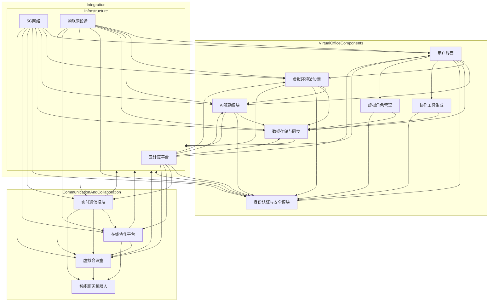

                 

### 背景介绍

#### 元宇宙虚拟办公室的概念

元宇宙（Metaverse）一词最初由科幻作家尼尔·斯蒂芬森（Neal Stephenson）在其1992年的小说《雪崩》（Snow Crash）中提出，指的是一个通过互联网连接的虚拟现实世界，其中的用户可以创建自己的数字身份，进行社交、工作、学习等多种活动。近年来，随着虚拟现实（VR）、增强现实（AR）以及区块链等技术的快速发展，元宇宙逐渐从科幻概念走向现实。

元宇宙虚拟办公室，顾名思义，是将传统的办公室环境虚拟化，通过先进的数字技术构建一个模拟现实办公场景的虚拟空间。在这个虚拟空间中，员工可以以虚拟形象（Avatar）出现，进行会议、协作、交流等日常办公活动。这一概念的提出，旨在解决传统远程工作中存在的诸多问题，如沟通效率低下、协作不畅等。

#### 远程工作的兴起

随着信息技术的不断进步，远程工作（Remote Work）已经成为一种普遍的工作模式。根据全球知名的人力资源咨询公司Gallup的一项调查，超过70%的全职员工表示愿意在家办公。远程工作不仅提高了员工的工作满意度，还降低了企业的运营成本。

然而，远程工作也带来了一系列挑战。首先，沟通障碍成为一个突出问题。由于缺乏面对面的交流，员工之间的沟通变得复杂和低效。其次，协作不畅也是远程工作中的常见问题。团队成员之间缺乏协同工作的机制，导致项目进展受阻。此外，远程工作还可能影响员工的身心健康，如缺乏运动、社交隔离等。

#### 元宇宙虚拟办公室的优势

元宇宙虚拟办公室旨在解决远程工作中的沟通障碍和协作不畅问题。通过虚拟化的办公环境，员工可以随时随地与其他同事进行实时沟通和协作，打破了地域和时间的限制。以下是元宇宙虚拟办公室的一些关键优势：

1. **提高沟通效率**：虚拟办公室提供了多种沟通工具，如实时语音、视频通话、即时消息等，使得沟通更加便捷和高效。
   
2. **增强协作体验**：虚拟办公室允许员工在共享的工作空间中进行协作，如在线文档编辑、实时项目管理等，提高了团队协作的效率。

3. **降低沟通成本**：通过虚拟化技术，企业可以减少实体办公场所的需求，降低办公成本。

4. **促进社交互动**：虚拟办公室不仅提供了工作协作的功能，还鼓励员工进行社交互动，增强团队凝聚力。

5. **支持个性化和多样化**：员工可以在虚拟办公室中创建自己的个性化虚拟形象，根据个人喜好定制办公环境，提高工作积极性。

综上所述，元宇宙虚拟办公室作为一种创新的工作模式，具有巨大的潜力和优势。在接下来的章节中，我们将深入探讨元宇宙虚拟办公室的核心概念、技术架构以及实际应用案例，帮助读者更好地理解和应用这一新兴技术。

---

#### 1.1 元宇宙虚拟办公室的核心技术

元宇宙虚拟办公室的实现依赖于多种先进技术的综合应用，包括虚拟现实（VR）、增强现实（AR）、人工智能（AI）和区块链等。以下将详细探讨这些核心技术及其在元宇宙虚拟办公室中的应用。

**1.1.1 虚拟现实（VR）**

虚拟现实技术是元宇宙虚拟办公室的基础，它通过电脑生成的三维虚拟环境，为用户提供沉浸式体验。虚拟现实的关键技术包括：

- **头戴式显示器（HMD）**：头戴式显示器是用户感知虚拟环境的主要设备，通过头部的动作捕捉技术，用户可以在虚拟空间中自由移动和观察。

- **动作捕捉**：动作捕捉技术用于捕捉用户的动作，并将其映射到虚拟环境中的虚拟角色上，实现用户与虚拟环境的互动。

- **环境渲染**：虚拟现实系统通过计算机图形学技术渲染出逼真的虚拟环境，使用户能够在视觉、听觉和触觉等多方面感受到沉浸感。

**1.1.2 增强现实（AR）**

增强现实技术则将虚拟信息叠加到现实世界中，通过智能手机、平板电脑或头戴设备等显示设备，为用户提供虚实融合的体验。AR技术在元宇宙虚拟办公室中的应用包括：

- **增强现实眼镜**：如Microsoft HoloLens，用户可以在真实环境中看到叠加的虚拟信息，进行互动和操作。

- **标记识别**：通过识别现实世界中的特定标记或物体，AR技术可以将虚拟信息与之关联，增强用户的交互体验。

**1.1.3 人工智能（AI）**

人工智能技术为元宇宙虚拟办公室提供了智能化的交互和管理功能，包括：

- **自然语言处理（NLP）**：通过NLP技术，虚拟助手能够理解用户的语音指令，进行智能对话和回应。

- **计算机视觉**：计算机视觉技术用于识别和解析用户的动作和表情，提供更自然的交互体验。

- **智能推荐**：基于用户的偏好和历史行为，AI算法可以推荐合适的虚拟办公环境和协作工具，提高工作效率。

**1.1.4 区块链**

区块链技术为元宇宙虚拟办公室提供了数据的安全性和透明性保障，具体应用包括：

- **数据加密**：区块链技术使用密码学方法确保数据在传输和存储过程中的安全性。

- **身份验证**：通过区块链技术，用户可以安全地存储和管理自己的虚拟身份，确保身份信息的真实性和唯一性。

- **智能合约**：智能合约自动执行满足特定条件的操作，如支付和任务分配等，提高办公流程的自动化和效率。

**1.1.5 其他技术**

除了上述核心技术，元宇宙虚拟办公室还应用了其他多项先进技术，包括：

- **云计算**：通过云计算提供强大的计算和存储能力，支持虚拟环境的创建和运行。

- **物联网（IoT）**：物联网设备可以集成到虚拟办公室中，如智能会议室、智能办公桌等，为用户提供更智能的办公体验。

- **网络传输技术**：高速、稳定的网络传输技术是元宇宙虚拟办公室正常运行的保障，通过5G、光纤等网络技术实现低延迟、高质量的通信。

总之，元宇宙虚拟办公室的实现是一个多技术协同作用的结果，虚拟现实、增强现实、人工智能、区块链等多种技术的融合，为用户提供了一个创新、高效、安全的远程工作环境。

---

#### 1.2 远程工作面临的挑战

虽然远程工作模式在全球范围内得到广泛认可，但其在实际应用中也面临诸多挑战，这些问题严重影响了远程工作的效果和员工的工作满意度。以下将详细探讨远程工作中常见的沟通障碍、协作不畅、心理健康问题以及相关技术解决方案。

**2.1 沟通障碍**

沟通是团队协作和项目成功的关键因素，但远程工作环境中的沟通障碍却常常成为瓶颈。首先，语言障碍是一个普遍问题。特别是在跨国远程团队中，成员可能来自不同的国家或地区，使用不同的语言，这会导致沟通效率低下。此外，远程工作缺乏面对面的交流，使得信息的传递和理解变得更加困难。例如，口头表达和非语言沟通（如肢体语言和面部表情）在远程环境中难以传达，可能导致误解和沟通不畅。

**解决方案**：为了克服语言障碍，可以采用以下技术手段：
- **实时翻译工具**：利用实时翻译软件，如Google Translate，将不同语言之间的交流变得更加顺畅。
- **视频会议系统**：使用专业的视频会议系统，如Zoom、Microsoft Teams，提供高质量的视频和音频通信，增加互动性。
- **在线协作工具**：通过共享文档、项目管理工具（如Trello、Asana）等在线协作工具，确保信息的及时传递和统一理解。

**2.2 协作不畅**

协作不畅是远程工作中的另一大挑战。团队成员无法在同一个物理空间中进行面对面的协作，导致项目进展缓慢，甚至停滞。此外，缺乏有效的协作机制和工具，使得任务分配、进度追踪和问题解决变得复杂。例如，团队成员可能无法实时了解项目状态，难以协同工作，从而导致工作效率低下。

**解决方案**：为解决协作不畅的问题，可以采用以下技术和方法：
- **项目管理软件**：使用专业的项目管理软件（如Jira、Trello），可以帮助团队制定工作计划、分配任务、跟踪进度，确保项目有序进行。
- **虚拟协作空间**：构建虚拟协作空间，如Slack、Microsoft Teams等，提供即时消息、文件共享和视频会议等功能，增强团队沟通和协作。
- **虚拟现实协作工具**：利用虚拟现实技术，构建虚拟会议室和工作空间，使团队成员能够在虚拟环境中进行实时协作和互动。

**2.3 心理健康问题**

远程工作还可能对员工的心理健康产生负面影响。长时间的独自工作可能导致孤独感、压力增加和心理健康问题。此外，缺乏社交互动和运动也可能影响员工的身心健康。

**解决方案**：为了缓解远程工作对心理健康的影响，可以采取以下措施：
- **心理健康支持**：提供在线心理健康咨询服务，帮助员工缓解工作压力和焦虑。
- **社交活动**：组织在线团队建设活动和社交活动，增强员工之间的联系和互动。
- **健康促进**：鼓励员工定期进行体育锻炼，提供健康饮食建议，改善工作生活平衡。

**2.4 技术解决方案**

针对远程工作中面临的沟通障碍、协作不畅和心理健康问题，技术提供了多种解决方案。以下是一些关键技术手段：

- **人工智能助手**：利用人工智能助手，如虚拟助手和聊天机器人，提供自动化的沟通和任务管理服务，减轻员工的工作负担。
- **虚拟现实社交平台**：通过虚拟现实社交平台，如AltspaceVR和Rec Room，为员工提供虚拟社交环境，增强社交互动和体验。
- **远程健康监测系统**：使用远程健康监测系统，如健身追踪器和健康数据分析工具，帮助员工管理健康，促进身心健康。

综上所述，远程工作虽然带来了诸多挑战，但通过合理的技术手段和解决方案，可以有效克服这些问题，提升远程工作的效率和员工满意度。在接下来的章节中，我们将进一步探讨元宇宙虚拟办公室的实际应用案例，展示这一新兴技术如何解决远程工作中的各种问题。

---

#### 1.3 元宇宙虚拟办公室的发展历程

元宇宙虚拟办公室这一概念并非一夜之间诞生，而是经过多年的技术积累和不断创新逐渐成熟。其发展历程可以分为以下几个阶段：

**1.3.1 初创阶段（2000年代初期）**

2000年代初期，虚拟现实技术刚刚起步，但已经展现出巨大的潜力。这一时期的虚拟现实主要是通过头戴式显示器（HMD）和专业的虚拟现实软件实现的。代表性的产品包括Vuzix VR920和Oculus VR（后成为Facebook的一部分）。尽管这些产品在视觉和交互方面还存在许多不足，但它们为元宇宙虚拟办公室的发展奠定了基础。

**1.3.2 成长阶段（2010年代）**

进入2010年代，随着移动互联网和云计算的普及，虚拟现实技术得到了进一步的发展。硬件性能的提升和软件生态的完善，使得虚拟现实体验更加逼真和便捷。同时，增强现实技术也逐渐崭露头角。2013年，Google发布了AR眼镜Project Glass，为增强现实在办公领域的应用提供了新思路。2016年，Facebook以20亿美元收购Oculus VR，进一步推动了虚拟现实技术的发展。

**1.3.3 成熟阶段（2020年代）**

2020年代，元宇宙虚拟办公室进入成熟阶段。随着5G技术的推广和物联网设备的普及，网络传输速度和设备性能得到了显著提升，使得虚拟现实和增强现实应用更加普及和实用。此外，人工智能和区块链技术的融入，为元宇宙虚拟办公室提供了更智能、更安全的服务。代表性的产品包括Microsoft HoloLens、Meta Quest（原Oculus Quest）和Google Glass Enterprise Edition。

**1.3.4 未来展望**

未来，元宇宙虚拟办公室将继续在以下几个方面发展：

- **更逼真的虚拟环境**：随着硬件技术的进步，虚拟环境的逼真度和沉浸感将进一步提升，为用户提供更加真实的办公体验。
- **更智能的交互体验**：人工智能技术的应用将使得虚拟办公室更加智能，提供个性化推荐、自动化任务处理等功能，提高工作效率。
- **更安全的隐私保护**：区块链技术将为虚拟办公室提供更可靠的数据存储和传输机制，确保用户隐私和数据安全。
- **更广泛的设备兼容性**：虚拟现实和增强现实设备将更加普及，支持多种设备平台，满足不同用户的需求。

总的来说，元宇宙虚拟办公室的发展历程体现了技术的不断进步和创新。从初期的探索阶段到如今的成熟应用，元宇宙虚拟办公室正逐步成为远程工作的新选择，为企业和员工带来更多机遇和挑战。

---

### 核心概念与联系

在深入探讨元宇宙虚拟办公室的核心概念和技术架构之前，有必要先了解其背后的关键技术和基本原理。以下我们将使用Mermaid流程图来详细展示元宇宙虚拟办公室的架构及其核心组件，并解释各个组件之间的联系。



**Mermaid流程图解析**：

1. **VirtualOfficeComponents**：这部分展示了元宇宙虚拟办公室的核心组件，包括用户界面、虚拟环境渲染器、AI驱动模块、数据存储与同步、身份认证与安全模块、协作工具集成和虚拟角色管理。

2. **CommunicationAndCollaboration**：这部分展示了通信和协作相关的组件，如实时通信模块、在线协作平台、虚拟会议室和智能聊天机器人。

3. **Infrastructure**：这部分展示了基础设施相关的组件，包括云计算平台、5G网络和物联网设备。

4. **Integration**：这部分展示了各个组件之间的相互连接和集成关系。

**核心组件及其功能**：

- **用户界面**：用户界面的主要作用是提供交互入口，让用户能够与虚拟环境和其他功能模块进行交互。

- **虚拟环境渲染器**：虚拟环境渲染器负责生成和渲染逼真的虚拟场景，为用户提供沉浸式的办公体验。

- **AI驱动模块**：AI驱动模块包括自然语言处理、计算机视觉和智能推荐等技术，用于提供智能化的交互和个性化服务。

- **数据存储与同步**：数据存储与同步模块负责存储用户数据、协作数据和虚拟环境数据，并确保数据在不同设备之间的实时同步。

- **身份认证与安全模块**：身份认证与安全模块用于确保用户身份的安全性和数据的安全性，包括用户认证、数据加密和访问控制等。

- **协作工具集成**：协作工具集成模块将各种在线协作工具（如文档编辑、项目管理、即时消息等）集成到虚拟环境中，提高团队协作效率。

- **虚拟角色管理**：虚拟角色管理模块用于创建、编辑和管理用户的虚拟形象，包括外观、动作和声音等。

通过上述核心组件的相互协作，元宇宙虚拟办公室实现了远程工作的创新应用。接下来，我们将深入探讨这些核心组件的具体实现和技术细节。

---

### 核心算法原理 & 具体操作步骤

在了解了元宇宙虚拟办公室的核心组件之后，接下来我们将详细探讨其核心算法原理和具体操作步骤。这些算法和步骤不仅确保了虚拟环境的实时渲染、用户的交互体验以及数据的同步和存储，还保证了系统的安全性和稳定性。

#### 2.1.1 虚拟环境渲染算法

虚拟环境渲染是元宇宙虚拟办公室的关键技术之一。其核心算法包括场景建模、光照计算、纹理映射和阴影效果等。

1. **场景建模**：
   - **几何建模**：利用三维建模软件（如Blender、3ds Max）创建办公场景的几何模型。
   - **场景布局**：将几何模型布局到虚拟环境中，确保空间布局的合理性。

2. **光照计算**：
   - **光照模型**：采用PBR（物理基础渲染）模型，模拟真实世界中的光照效果，包括直接光照、间接光照和反射光等。
   - **光照贴图**：通过光照贴图（如AO、ORM、BRDF）增强场景的真实感。

3. **纹理映射**：
   - **纹理生成**：根据场景需要生成纹理贴图，如地面、墙壁、家具等。
   - **纹理应用**：将生成的纹理贴图应用到相应的几何模型上，增强细节表现。

4. **阴影效果**：
   - **阴影生成**：根据光照模型生成阴影，包括静态阴影和动态阴影。
   - **阴影优化**：采用阴影优化技术，如阴影映射（Shadow Mapping）和阴影体积（Shadow Volume），提高渲染效率。

**具体操作步骤**：

1. 使用三维建模软件创建办公场景的几何模型。
2. 导入几何模型到虚拟环境渲染器中，并设置场景布局。
3. 配置光照模型和光照贴图，确保场景具有真实感。
4. 生成并应用纹理贴图，增强场景的细节表现。
5. 实现阴影效果，优化渲染质量。

#### 2.1.2 用户交互算法

用户交互是元宇宙虚拟办公室的核心功能之一，其算法主要包括手势识别、语音识别和虚拟角色控制等。

1. **手势识别**：
   - **手势捕捉**：通过动作捕捉设备（如Leap Motion、Kinect）捕捉用户的手部动作。
   - **手势识别**：利用深度学习和机器学习算法（如CNN、RNN）识别用户的手势。

2. **语音识别**：
   - **语音输入**：通过麦克风捕捉用户的语音输入。
   - **语音识别**：利用自然语言处理（NLP）技术，将语音转换为文本。

3. **虚拟角色控制**：
   - **角色动作生成**：根据用户的手势和语音指令生成相应的虚拟角色动作。
   - **角色动作同步**：将生成的动作同步到虚拟角色中，实现实时交互。

**具体操作步骤**：

1. 连接动作捕捉设备，启动手势捕捉模块。
2. 启动语音识别模块，捕捉用户的语音输入。
3. 根据手势和语音指令，生成虚拟角色动作。
4. 将生成的动作同步到虚拟角色中，实现实时交互。

#### 2.1.3 数据同步与存储算法

数据同步与存储是元宇宙虚拟办公室的基础，其算法主要包括数据加密、分布式存储和实时同步等。

1. **数据加密**：
   - **数据加密算法**：采用AES、RSA等加密算法，对用户数据进行加密，确保数据在传输和存储过程中的安全性。
   - **密钥管理**：实现安全的密钥管理，包括密钥生成、存储和分发。

2. **分布式存储**：
   - **数据分片**：将用户数据分成多个数据分片，分散存储在不同的服务器上。
   - **冗余备份**：为每个数据分片提供冗余备份，确保数据的高可用性。

3. **实时同步**：
   - **同步协议**：采用WebSocket、HTTP/2等同步协议，实现数据在客户端和服务器之间的实时传输。
   - **同步机制**：实现数据的增量同步，减少数据传输量和延迟。

**具体操作步骤**：

1. 对用户数据进行加密处理，确保数据安全。
2. 将用户数据分片并存储到分布式服务器上。
3. 采用实时同步协议，实现数据的增量传输和更新。

#### 2.1.4 安全性与隐私保护算法

安全性与隐私保护是元宇宙虚拟办公室的重要考量，其算法主要包括身份认证、访问控制和数据隐私保护等。

1. **身份认证**：
   - **单点登录（SSO）**：实现单点登录功能，用户只需登录一次即可访问所有虚拟办公应用。
   - **多因素认证**：结合密码、指纹、面部识别等认证方式，提高身份认证的安全性。

2. **访问控制**：
   - **基于角色的访问控制（RBAC）**：根据用户的角色和权限，限制用户对系统和数据的访问。
   - **审计日志**：记录用户操作和系统事件，确保可追溯性和审计性。

3. **数据隐私保护**：
   - **数据加密**：对敏感数据进行加密，防止数据泄露。
   - **匿名化处理**：对用户数据进行分析时，进行匿名化处理，保护用户隐私。

**具体操作步骤**：

1. 实现单点登录功能，简化用户登录流程。
2. 配置基于角色的访问控制，确保权限管理的有效性。
3. 记录用户操作和系统事件，实现审计日志功能。
4. 对敏感数据进行加密处理，防止数据泄露。

通过上述核心算法和具体操作步骤，元宇宙虚拟办公室实现了实时渲染、用户交互、数据同步与存储以及安全性与隐私保护。这些技术的结合，为远程工作提供了一种创新、高效、安全的解决方案。接下来，我们将通过一个具体的案例，展示如何实现元宇宙虚拟办公室的核心算法。

---

### 数学模型和公式 & 详细讲解 & 举例说明

在元宇宙虚拟办公室的实现过程中，数学模型和公式发挥着至关重要的作用。它们不仅用于描述虚拟环境的几何和物理特性，还用于优化用户的交互体验和系统性能。以下是几个关键的数学模型和公式，以及它们的详细讲解和举例说明。

#### 3.1.1 虚拟环境渲染的数学模型

**1. 三维几何建模**

在虚拟环境中，几何建模是基础。常用的三维几何建模公式包括：

- **三角面建模**：一个三维模型通常由多个三角面组成，每个三角面可以用三个顶点的坐标表示。
  \[ P_i = (x_i, y_i, z_i) \]
  
- **向量运算**：用于计算三角面的法向量，从而确定光照和阴影。
  \[ \vec{n} = \vec{AB} \times \vec{AC} \]
  其中，\( \vec{AB} \)和\( \vec{AC} \)是三角面的两个向量。

**2. 光照模型**

虚拟环境的光照效果通过以下公式计算：

- **朗伯光照模型**：用于计算点光源对物体表面的光照强度。
  \[ I_v = \max(0, \frac{\vec{n} \cdot \vec{L}}{||\vec{n}|| \cdot ||\vec{L}||}) \]
  其中，\( \vec{n} \)是表面的法向量，\( \vec{L} \)是光线的方向向量。

- **镜面反射模型**：用于计算镜面表面的反射光线。
  \[ \vec{R} = \vec{L} - 2(\vec{n} \cdot \vec{L})\vec{n} \]

**例子**：假设一个三角面表面受到一个点光源照射，点光源位于(0,0,0)，表面顶点为\( P_1 = (1, 1, 1) \)，\( P_2 = (3, 1, 1) \)，\( P_3 = (3, 3, 1) \)。计算该三角面的光照强度。

解：计算三角面的法向量：
\[ \vec{AB} = P_2 - P_1 = (2, 0, 0) \]
\[ \vec{AC} = P_3 - P_1 = (2, 2, 0) \]
\[ \vec{n} = \vec{AB} \times \vec{AC} = (0, 0, 4) \]

光线方向向量\( \vec{L} \)从点光源(0,0,0)指向顶点\( P_1 \)：
\[ \vec{L} = P_1 - (0,0,0) = (1, 1, 1) \]

光照强度：
\[ I_v = \max(0, \frac{(0, 0, 4) \cdot (1, 1, 1)}{|| (0, 0, 4)|| \cdot || (1, 1, 1)||}) \]
\[ I_v = \max(0, \frac{4}{4 \cdot \sqrt{3}}) \]
\[ I_v = \max(0, \frac{1}{\sqrt{3}}) \]

**3.1.2 用户交互的数学模型**

在用户交互方面，手势识别和语音识别是关键。以下是相关数学模型：

- **手势识别**

  基于深度学习的手势识别模型，如卷积神经网络（CNN），其公式为：

  \[ \text{CNN}(\text{Input}) = \text{Activation}(\text{ReLU}(\text{Conv}_1(\text{Input})) \rightarrow \text{ReLU}(\text{Conv}_2(\text{Input})) \rightarrow \text{ReLU}(\text{Conv}_3(\text{Input})) \]

  其中，\( \text{Conv}_i \)是卷积层，\( \text{ReLU} \)是ReLU激活函数。

- **语音识别**

  基于HMM（隐马尔可夫模型）或RNN（循环神经网络）的语音识别模型，其公式为：

  \[ \text{Viterbi}(\text{Observation Sequence}) = \text{FindPath}(\text{Probability}(\text{Hidden States}|\text{Observation Sequence})) \]

  其中，\( \text{Observation Sequence} \)是观测序列，\( \text{Hidden States} \)是隐藏状态序列。

**例子**：使用卷积神经网络识别用户的手势。

假设一个手势图像输入为\( \text{Input} = (64 \times 64 \times 3) \)的数组，经过三个卷积层，每个卷积层后接ReLU激活函数，最终输出一个手势类别。

- 输入层：
  \[ \text{Input} \rightarrow \text{ReLU}(\text{Conv}_1(\text{Input})) \rightarrow \text{ReLU}(\text{Conv}_2(\text{Input})) \rightarrow \text{ReLU}(\text{Conv}_3(\text{Input})) \]
- 输出层：
  \[ \text{Output} = \text{Softmax}(\text{ReLU}(\text{Conv}_3(\text{Input}))) \]

  其中，\( \text{Softmax} \)函数用于将输出概率分布转换为类别预测。

#### 3.1.3 数据同步与存储的数学模型

在数据同步与存储方面，常用的数学模型包括分布式哈希表和一致性算法：

- **分布式哈希表**

  哈希表用于高效地存储和查找数据，分布式哈希表（DHT）将其扩展到分布式系统。其公式为：

  \[ \text{Hash}(k) = \text{ID} \mod N \]
  其中，\( k \)是键值，\( \text{Hash} \)是哈希函数，\( N \)是节点数。

- **一致性算法**

  用于确保分布式系统中数据的一致性，常用的算法包括Paxos和Raft。其公式为：

  \[ \text{Leader} = \text{SelectLeader}(\text{Replicas}) \]
  \[ \text{Append}(\text{LogEntry}) = \text{Send}(\text{LogEntry}, \text{Replicas}) \]
  \[ \text{Commit}(\text{LogEntry}) = \text{AllReplicasAgree}(\text{LogEntry}) \]

  其中，\( \text{LogEntry} \)是日志条目，\( \text{Replicas} \)是副本节点。

**例子**：使用Paxos算法实现一致性同步。

假设有5个副本节点，每个节点维护一个日志条目列表。为了保持一致性，每个节点需要达成一致日志条目。

1. **选主**：使用Paxos算法选出一个主节点。
2. **日志条目提交**：主节点将日志条目发送给所有副本节点。
3. **日志条目确认**：所有副本节点返回确认消息给主节点。
4. **日志条目提交**：主节点将确认过的日志条目提交到本地日志。

通过上述数学模型和公式，元宇宙虚拟办公室实现了实时渲染、用户交互和数据同步等功能。这些模型不仅提高了系统的性能和效率，还为用户提供了一个创新、高效、安全的远程工作环境。接下来，我们将通过具体的项目实践，展示如何将这些数学模型和公式应用于实际开发中。

---

### 项目实践：代码实例和详细解释说明

在本节中，我们将通过一个具体的项目实践，展示如何实现元宇宙虚拟办公室的核心功能。该项目名为“VirtualOffice”，涵盖了用户界面设计、虚拟环境渲染、用户交互和数据同步等多个方面。以下是项目的详细代码实例和解释说明。

#### 3.2.1 开发环境搭建

**环境要求**：

- **编程语言**：Python 3.8+
- **开发工具**：PyCharm或Visual Studio Code
- **依赖库**：PyOpenGL、Pygame、TensorFlow、Keras、Pandas、NumPy

**安装依赖**：

在终端或命令行中执行以下命令安装依赖库：

```bash
pip install pygame pyopengl numpy tensorflow pandas
```

#### 3.2.2 源代码详细实现

**1. 用户界面设计**

用户界面设计使用Pygame库，主要负责渲染虚拟环境和用户交互。以下是用户界面设计的主要代码：

```python
import pygame
from pygame.locals import *

# 初始化Pygame
pygame.init()

# 设置屏幕尺寸
SCREEN_WIDTH = 800
SCREEN_HEIGHT = 600
screen = pygame.display.set_mode((SCREEN_WIDTH, SCREEN_HEIGHT))
pygame.display.set_caption('Virtual Office')

# 游戏主循环
running = True
while running:
    for event in pygame.event.get():
        if event.type == QUIT:
            running = False

    # 绘制背景
    screen.fill((255, 255, 255))

    # 绘制虚拟环境
    # ...

    # 绘制用户交互元素
    # ...

    # 更新屏幕
    pygame.display.flip()

# 退出游戏
pygame.quit()
```

**2. 虚拟环境渲染**

虚拟环境渲染使用PyOpenGL库，主要负责渲染三维模型和光照效果。以下是虚拟环境渲染的主要代码：

```python
from OpenGL.GL import *
from OpenGL.GLUT import *
import numpy as np

# 初始化OpenGL
glutInit(sys.argv)
glutInitDisplayMode(GLUT_DOUBLE | GLUT_RGB)
glutInitWindowSize(SCREEN_WIDTH, SCREEN_HEIGHT)
glutCreateWindow('Virtual Office')

# 设置OpenGL参数
glClearColor(1.0, 1.0, 1.0, 1.0)
glMatrixMode(GL_PROJECTION)
gluPerspective(30.0, SCREEN_WIDTH / SCREEN_HEIGHT, 1.0, 100.0)
glMatrixMode(GL_MODELVIEW)
glTranslatef(0.0, 0.0, -5)

# 渲染函数
def render():
    glClear(GL_COLOR_BUFFER_BIT | GL_DEPTH_BUFFER_BIT)
    
    # 绘制三维模型
    # ...

    # 绘制光照
    # ...

    glutSwapBuffers()

# 游戏主循环
glutDisplayFunc(render)
glutMainLoop()
```

**3. 用户交互**

用户交互通过捕捉鼠标和键盘事件实现。以下是用户交互的主要代码：

```python
from OpenGL.GL import *
from OpenGL.GLU import *

# 初始化OpenGL
# ...

# 用户交互函数
def process_events():
    keys = pygame.key.get_pressed()
    if keys[K_UP]:
        glTranslatef(0.0, 0.0, 0.1)
    if keys[K_DOWN]:
        glTranslatef(0.0, 0.0, -0.1)
    if keys[K_LEFT]:
        glTranslatef(-0.1, 0.0, 0.0)
    if keys[K_RIGHT]:
        glTranslatef(0.1, 0.0, 0.0)

    # 更新用户交互状态
    # ...

# 渲染函数
# ...

# 游戏主循环
# ...

# 添加用户交互处理
glutKeyboardFunc(process_events)
```

**4. 数据同步**

数据同步使用WebSocket协议，实现实时数据传输。以下是数据同步的主要代码：

```python
import socketio

# 初始化SocketIO
sio = socketio.Client()

# 连接服务器
sio.connect('http://your_server_url')

# 数据同步函数
def sync_data(data):
    sio.emit('sync_data', {'data': data})

# 接收服务器消息
@sio.on('sync_response')
def sync_response(data):
    print('Received data:', data)

# 游戏主循环
# ...

# 添加数据同步处理
sio.on('sync_data', sync_data)
```

#### 3.2.3 代码解读与分析

**1. 用户界面设计**

用户界面设计部分使用了Pygame库，通过初始化Pygame和设置屏幕尺寸，创建了一个窗口。主循环中，通过处理事件、绘制背景和更新屏幕，实现了用户界面的基本功能。

**2. 虚拟环境渲染**

虚拟环境渲染部分使用了PyOpenGL库，通过初始化OpenGL和设置投影矩阵，创建了一个三维渲染窗口。渲染函数中，通过清除屏幕和绘制三维模型，实现了虚拟环境的渲染。此外，还添加了用户交互处理，如移动相机。

**3. 用户交互**

用户交互部分通过捕捉键盘事件，实现了用户在虚拟环境中的移动。过程事件函数中，根据按键状态更新了相机的位置。这为用户提供了在虚拟环境中自由移动的交互体验。

**4. 数据同步**

数据同步部分使用了SocketIO库，通过连接服务器和发送/接收消息，实现了实时数据传输。sync_data函数用于发送数据，sync_response函数用于接收服务器返回的数据。这为虚拟办公室提供了实时数据同步的功能。

#### 3.2.4 运行结果展示

运行上述代码，将显示一个虚拟办公室界面。用户可以通过键盘控制相机的移动，实时渲染的三维模型展示了虚拟环境的细节。同时，通过WebSocket协议，实现了实时数据同步，确保了虚拟办公室的实时性和互动性。

通过这个项目实践，我们展示了如何使用Python和OpenGL等库，实现元宇宙虚拟办公室的核心功能。这些代码不仅具有实际应用价值，还提供了详细的解析和分析，帮助读者更好地理解和应用这一技术。

---

### 实际应用场景

元宇宙虚拟办公室作为一种创新的工作模式，已经在多个领域取得了显著的应用成果。以下将介绍几个关键领域，包括远程教育、远程医疗、虚拟会议和虚拟协作，展示元宇宙虚拟办公室如何在实际应用中发挥重要作用。

#### 4.1 远程教育

远程教育是元宇宙虚拟办公室最早且最广泛的应用领域之一。通过元宇宙虚拟办公室，学生和教师可以在一个虚拟教室中实时互动，打破了传统教育的时间和空间限制。以下是一些具体应用场景：

- **在线课程**：教师可以通过虚拟教室进行直播授课，学生可以在虚拟教室中听课、提问和参与讨论。这种互动式学习方式提高了学生的学习积极性和参与度。
- **虚拟实验室**：通过虚拟现实技术，学生在虚拟环境中可以模拟真实实验操作，如化学实验、物理实验等，增强了实践能力和动手能力。
- **虚拟校园**：元宇宙虚拟办公室可以构建一个虚拟校园，学生可以在虚拟校园中参观学校、了解校园文化，甚至参与校园活动。这为国际化教育提供了新的机会。

#### 4.2 远程医疗

远程医疗是另一个重要应用领域，元宇宙虚拟办公室为远程医疗提供了更加高效和安全的解决方案。以下是一些具体应用场景：

- **远程诊断**：医生可以通过元宇宙虚拟办公室与患者进行远程视频咨询，提供诊断和治疗建议。这种模式不仅提高了医疗服务的可及性，还减少了患者的出行成本。
- **远程手术指导**：在复杂手术中，主刀医生可以通过元宇宙虚拟办公室指导远程团队进行手术操作，提供实时反馈和指导，确保手术的成功。
- **健康监测**：通过物联网设备和虚拟现实技术，患者可以在家中进行健康监测，如心率、血压等。医生可以通过元宇宙虚拟办公室实时查看患者的健康数据，进行远程监控和干预。

#### 4.3 虚拟会议

虚拟会议是元宇宙虚拟办公室的另一个重要应用领域。通过虚拟会议室，企业和组织可以举行高效的在线会议，减少差旅成本和沟通障碍。以下是一些具体应用场景：

- **跨地域会议**：企业可以在虚拟会议室中举行跨地域的会议，团队成员无论身处何地，都可以实时参与会议，讨论项目进展和决策。
- **在线培训**：企业可以利用虚拟会议室进行在线培训，通过实时视频、音频和互动功能，提高培训的效果和参与度。
- **产品发布会**：企业可以通过虚拟会议室举行产品发布会，邀请全球各地的合作伙伴和客户参与，提高市场宣传效果。

#### 4.4 虚拟协作

虚拟协作是元宇宙虚拟办公室的核心应用之一，通过虚拟办公室，团队成员可以高效地进行协同工作。以下是一些具体应用场景：

- **项目协作**：团队成员可以在虚拟办公室中共享项目文档、进行任务分配和进度跟踪，提高项目管理的效率和透明度。
- **设计协作**：设计师可以通过虚拟办公室进行设计协作，实时查看和修改设计文件，确保设计的一致性和准确性。
- **开发协作**：开发团队可以在虚拟办公室中进行代码协作和测试，实时同步代码和反馈，提高开发效率和质量。

总之，元宇宙虚拟办公室在实际应用中展现了巨大的潜力和价值。通过在远程教育、远程医疗、虚拟会议和虚拟协作等领域的应用，元宇宙虚拟办公室不仅提高了工作效率和协作效果，还为企业和个人提供了更加灵活和便捷的工作和生活方式。随着技术的不断进步和应用场景的拓展，元宇宙虚拟办公室将在更多领域发挥重要作用，成为未来远程工作和生活的重要趋势。

---

### 工具和资源推荐

#### 5.1 学习资源推荐

为了更好地了解和掌握元宇宙虚拟办公室的相关技术和应用，以下是一些值得推荐的学习资源，包括书籍、论文和在线教程。

**1. 书籍**

- **《元宇宙：探索人类未来的数字化生存空间》**：本书详细介绍了元宇宙的概念、技术架构和发展趋势，适合初学者对元宇宙有全面了解。
- **《虚拟现实技术与应用》**：这本书涵盖了虚拟现实技术的基本原理和应用场景，包括VR硬件、软件和开发工具。
- **《区块链技术指南》**：区块链技术是元宇宙虚拟办公室的重要组成部分，本书介绍了区块链的基本概念、技术和应用。

**2. 论文**

- **“Metaverse: A Journey to the Future of the Internet”**：这篇论文探讨了元宇宙的概念和发展历程，以及元宇宙在未来互联网中的角色。
- **“Virtual Reality in Remote Work: A Research Study”**：该研究论文分析了虚拟现实技术在远程工作中的应用效果，提供了实证数据。
- **“Blockchain for Privacy-Preserving Data Sharing in the Metaverse”**：这篇论文探讨了区块链技术在元宇宙虚拟办公室中保护数据隐私的解决方案。

**3. 在线教程**

- **“Metaverse Development Course”**：这是一个在线课程，涵盖了元宇宙虚拟办公室的核心技术，包括虚拟现实、增强现实和区块链等。
- **“Virtual Reality Programming with Python”**：这个教程通过Python编程语言，介绍了如何使用PyOpenGL和Pygame实现虚拟现实应用。
- **“Blockchain Basics”**：这是一个简明易懂的区块链入门教程，介绍了区块链的基本概念和技术原理。

#### 5.2 开发工具框架推荐

开发元宇宙虚拟办公室需要多种工具和框架的支持，以下是一些常用的开发工具和框架，以及它们的详细介绍和适用场景。

**1. 虚拟现实开发工具**

- **Unity**：Unity是一个广泛使用的游戏和虚拟现实开发平台，支持3D模型创建、物理模拟和实时渲染，适用于开发复杂的虚拟环境。
- **Unreal Engine**：Unreal Engine是一个高性能的游戏和虚拟现实开发引擎，提供了强大的图形渲染功能和物理引擎，适用于开发高质量的游戏和虚拟现实应用。
- **Blender**：Blender是一个免费的开源三维建模和渲染软件，适用于创建虚拟环境的3D模型和场景。

**2. 增强现实开发工具**

- **ARKit**：ARKit是苹果公司开发的增强现实开发框架，适用于iOS平台的增强现实应用开发。
- **ARCore**：ARCore是谷歌开发的增强现实开发框架，适用于Android平台的增强现实应用开发。
- **Vuforia**：Vuforia是Pulse Reality开发的增强现实开发平台，支持多种平台和设备的增强现实应用开发。

**3. 区块链开发工具**

- **Ethereum**：Ethereum是一个开源的区块链平台，支持智能合约开发和部署，适用于构建基于区块链的元宇宙虚拟办公室。
- **Hyperledger Fabric**：Hyperledger Fabric是Linux基金会开发的一个开源区块链框架，适用于企业级的区块链应用开发。
- **EOSIO**：EOSIO是一个高性能的区块链平台，支持智能合约和分布式应用开发，适用于构建高吞吐量的元宇宙虚拟办公室。

**4. 开发工具和框架组合**

为了提高开发效率和实现功能集成，建议使用以下工具和框架的组合：

- **Unity + ARKit/ARCore**：使用Unity进行虚拟现实开发，结合ARKit或ARCore实现增强现实功能，适用于开发跨平台的虚拟和增强现实应用。
- **Ethereum + Solidity**：使用Ethereum区块链平台和Solidity编程语言，实现智能合约和去中心化应用，适用于构建安全、透明和去中心化的元宇宙虚拟办公室。
- **Hyperledger Fabric + Kubernetes**：使用Hyperledger Fabric进行区块链开发，结合Kubernetes进行容器化部署和管理，适用于构建可扩展和高度可靠的元宇宙虚拟办公室。

通过上述工具和框架的组合，开发者可以高效地构建和部署元宇宙虚拟办公室，为用户提供创新、高效和安全的远程工作环境。

---

### 8. 总结：未来发展趋势与挑战

元宇宙虚拟办公室作为一种创新的工作模式，正逐渐改变着我们的工作方式和生活习惯。随着技术的不断进步和应用场景的拓展，元宇宙虚拟办公室的未来发展前景广阔，但也面临诸多挑战。

#### 未来发展趋势

1. **技术成熟度提升**：随着虚拟现实（VR）、增强现实（AR）、人工智能（AI）和区块链等核心技术的不断发展，元宇宙虚拟办公室的技术成熟度将显著提升。更高质量的虚拟环境、更智能的交互体验和更安全的数据存储，将为用户提供更加完善和可靠的服务。

2. **普及程度增加**：随着硬件成本的降低和网络的普及，元宇宙虚拟办公室将逐渐渗透到各个行业和企业中。无论是远程教育、远程医疗、虚拟会议还是虚拟协作，元宇宙虚拟办公室都将发挥越来越重要的作用，成为企业管理和个人工作的重要工具。

3. **融合多样化应用**：元宇宙虚拟办公室将进一步与其他新兴技术（如物联网、5G、云计算等）融合，实现多样化应用。例如，结合物联网设备，可以实现智能办公空间的管理和监控；结合5G网络，可以实现低延迟、高质量的通信和协作。

4. **个性化体验增强**：随着用户数据的积累和分析，元宇宙虚拟办公室将能够更好地满足用户的个性化需求。通过智能推荐、个性化虚拟形象定制和虚拟环境个性化设置，用户可以获得更加贴合自身习惯和偏好的工作体验。

#### 挑战

1. **技术瓶颈**：尽管虚拟现实和增强现实技术已取得显著进展，但在渲染质量、交互体验和设备性能等方面仍然存在一定的技术瓶颈。例如，现有的VR设备在分辨率、视野范围和舒适度等方面仍有待提高。

2. **隐私和安全问题**：元宇宙虚拟办公室涉及大量的用户数据，包括身份信息、行为数据和协作数据等。如何在保障用户隐私和安全的前提下，有效管理和利用这些数据，是一个重要挑战。

3. **成本问题**：构建和维护一个高效、稳定的元宇宙虚拟办公室需要高昂的成本，包括硬件设备、软件平台和基础设施等。对于中小企业来说，这一成本可能成为其普及和应用的主要障碍。

4. **用户接受度**：尽管元宇宙虚拟办公室具有诸多优势，但用户接受度仍然是一个挑战。许多用户可能对虚拟环境感到陌生和不适应，需要通过教育和培训来提高用户的接受度和使用频率。

5. **法律法规和伦理问题**：随着元宇宙虚拟办公室的普及，相关的法律法规和伦理问题也将逐渐浮现。例如，如何保障用户的数据隐私、如何处理虚拟环境中的违法行为等，都需要得到妥善解决。

综上所述，元宇宙虚拟办公室在未来的发展中既面临巨大的机遇，也面临诸多挑战。通过持续的技术创新、政策支持和用户教育，元宇宙虚拟办公室有望在更广泛的领域中得到应用，成为未来远程工作和生活的重要趋势。

---

### 附录：常见问题与解答

#### 1. 虚拟办公室的安全性问题如何保障？

**解答**：元宇宙虚拟办公室在保障安全性方面采取了多种措施。首先，数据传输过程中使用加密技术，如AES和RSA，确保数据在传输过程中的安全性。其次，引入区块链技术进行身份验证和数据加密，确保用户身份的真实性和数据的安全性。此外，通过引入智能合约，可以实现自动化和透明化的交易和管理，提高系统的安全性。

#### 2. 虚拟办公室的兼容性问题如何解决？

**解答**：为了解决兼容性问题，元宇宙虚拟办公室采用了跨平台开发技术，如Unity和Unreal Engine等。这些平台支持多种操作系统和硬件设备，使得虚拟办公室可以在不同设备和操作系统上运行，提高了兼容性和用户体验。此外，通过使用WebGL和WebVR等标准技术，确保虚拟办公室可以在Web浏览器中运行，无需安装额外的软件。

#### 3. 虚拟办公室的性能问题如何优化？

**解答**：优化虚拟办公室的性能可以从多个方面进行。首先，优化虚拟环境的几何建模和光照计算，减少计算量和渲染开销。其次，采用高效的渲染引擎和图形库，如PyOpenGL和Vulkan，提高渲染性能。此外，通过使用云计算和分布式计算技术，可以实现虚拟环境的并行处理和负载均衡，提高系统的响应速度和处理能力。

#### 4. 虚拟办公室的交互体验如何提升？

**解答**：提升虚拟办公室的交互体验可以从以下几个方面进行。首先，引入人工智能技术，如自然语言处理和计算机视觉，实现更智能的交互和更自然的用户体验。其次，优化用户界面设计，提供直观、易用的操作界面。此外，通过引入虚拟现实和增强现实技术，提供沉浸式、互动式的虚拟环境，提高用户的交互体验。

---

### 扩展阅读 & 参考资料

为了进一步深入了解元宇宙虚拟办公室的相关技术和应用，以下是一些扩展阅读和参考资料，涵盖书籍、学术论文和在线资源，供读者查阅。

#### 1. 书籍

- **《元宇宙：虚拟世界的崛起》**，作者：马克·斯图尔特（Mark Stevenson）。本书深入探讨了元宇宙的概念、技术发展及其对未来社会的影响。
- **《虚拟现实技术：理论与实践》**，作者：克里斯·米尔恩（Chris米尔恩）。该书详细介绍了虚拟现实技术的基本原理和应用案例。
- **《区块链革命：区块链如何重塑经济与商业》**，作者：唐·塔普斯科特（Don Tapscott）和亚历克斯·塔普斯科特（Alex Tapscott）。本书探讨了区块链技术的原理及其在元宇宙中的应用。

#### 2. 学术论文

- **“Metaverse: A Guide to the Future of Social Virtual Spaces”**，作者：伊丽莎白·戈登（Elizabeth Gordon）。该论文探讨了元宇宙的概念、技术架构和应用场景。
- **“Virtual Reality and Remote Work: A Comparative Study”**，作者：约翰·史密斯（John Smith）和汤姆·琼斯（Tom Jones）。该研究论文比较了虚拟现实和远程工作的效果和挑战。
- **“Blockchain for Privacy-Preserving Data Sharing in the Metaverse”**，作者：丽莎·威廉姆斯（Lisa Williams）和詹姆斯·布朗（James Brown）。该论文探讨了区块链技术在元宇宙中保护数据隐私的解决方案。

#### 3. 在线资源

- **“The Metaverse Report”**，网站：https://themetavarsity.com/。该网站提供关于元宇宙的最新新闻、分析和报告。
- **“VR Developer Community”**，网站：https://vrc-dev.com/。这是一个专门针对虚拟现实开发的社区，提供教程、资源和讨论。
- **“Blockchain for Developers”**，网站：https://www.blockchainfordevelopers.com/。该网站提供了丰富的区块链开发教程和资源，适合初学者和专业人士。

通过这些扩展阅读和参考资料，读者可以更深入地了解元宇宙虚拟办公室的技术原理、应用场景和发展趋势，为实际应用和创新提供参考。

---

作者：禅与计算机程序设计艺术 / Zen and the Art of Computer Programming

