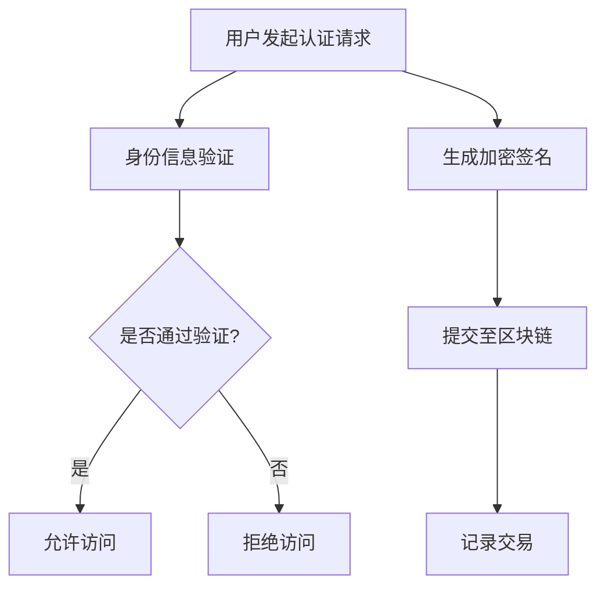

                 

### 文章标题

**元宇宙身份认证：区块链技术在身份管理中的应用**

> **关键词**：元宇宙、身份认证、区块链、身份管理、分布式账本

> **摘要**：本文将探讨区块链技术在元宇宙身份认证中的应用。随着元宇宙的兴起，如何保障用户的数字身份安全成为关键议题。通过分析区块链的核心原理，本文将介绍元宇宙身份认证的基本概念、挑战及解决方案，并通过具体案例和代码实例展示区块链技术在身份管理中的实际应用。

### 1. 背景介绍

**1.1 元宇宙的兴起**

元宇宙（Metaverse）是指通过虚拟现实（VR）、增强现实（AR）和其他技术实现的虚拟世界，用户可以在其中进行互动、创造和分享。自2010年代以来，随着技术的进步和互联网的普及，元宇宙逐渐成为人们关注的焦点。大型科技公司如Facebook、谷歌、微软等纷纷投入巨资开发元宇宙相关产品，使得元宇宙的发展速度加快。

**1.2 身份认证的重要性**

在元宇宙中，用户的数字身份不仅代表个人在网络世界中的存在，还与各种虚拟资产、服务及社交互动密切相关。因此，身份认证成为元宇宙中不可或缺的一环。传统的身份认证方式如用户名和密码、双因素认证等，往往存在安全性不足、易被攻破的风险。随着区块链技术的发展，提供更安全、去中心化的身份认证成为可能。

**1.3 区块链技术在身份管理中的应用**

区块链技术以其去中心化、透明性、不可篡改性等特点，为身份认证提供了新的解决方案。通过区块链，用户可以在一个安全的分布式网络中管理自己的身份信息，无需依赖第三方机构。这不仅提高了身份认证的安全性和隐私性，还降低了管理成本。

### 2. 核心概念与联系

**2.1 区块链的基本原理**

区块链是一种分布式账本技术，由一系列按时间顺序排列的区块组成。每个区块包含一定数量的交易记录，并通过密码学技术保证数据的完整性和安全性。区块链通过共识算法来确保所有节点对数据的共识，从而避免了单点故障和数据篡改的问题。

**2.2 身份认证的基本概念**

身份认证是指验证用户身份的过程，通常涉及用户凭证（如用户名和密码）的验证。在元宇宙中，身份认证的目标是确保用户身份的真实性和唯一性，同时保护用户隐私。

**2.3 区块链与身份认证的联系**

区块链技术可以用于构建去中心化的身份认证系统。通过将用户身份信息存储在区块链上，可以确保数据的不可篡改性和隐私性。用户可以自主管理自己的身份信息，无需依赖第三方机构。

**2.4 Mermaid 流程图**



### 3. 核心算法原理 & 具体操作步骤

**3.1 密码学原理**

区块链技术中的密码学原理是实现身份认证安全性的关键。常用的密码学算法包括哈希函数、数字签名、非对称加密等。

- **哈希函数**：将任意长度的输入数据映射为固定长度的输出值，确保数据的唯一性和不可逆性。
- **数字签名**：使用私钥对数据进行签名，确保数据的完整性和真实性。公钥可以验证签名的有效性。
- **非对称加密**：使用公钥加密，私钥解密，保证数据的机密性和完整性。

**3.2 具体操作步骤**

- **步骤1**：用户在区块链上注册身份信息，包括用户名、密码等。
- **步骤2**：用户发起认证请求，系统生成加密签名。
- **步骤3**：用户将加密签名提交至区块链。
- **步骤4**：区块链节点验证签名，确保身份信息未被篡改。
- **步骤5**：验证通过，用户获得访问权限；否则，拒绝访问。

### 4. 数学模型和公式 & 详细讲解 & 举例说明

**4.1 数学模型**

区块链中的身份认证可以通过以下数学模型表示：

$$
\begin{aligned}
&\text{身份信息} \quad I = (U, P) \\
&\text{加密签名} \quad S = Sign(P, K_{\text{私}}) \\
&\text{验证签名} \quad \text{验证} \ S = Sign(U, P, K_{\text{公}}) \\
\end{aligned}
$$

其中，$U$表示用户名，$P$表示密码，$K_{\text{私}}$为私钥，$K_{\text{公}}$为公钥。

**4.2 详细讲解**

- **哈希函数**：将用户密码$P$通过哈希函数$H$转换为密码哈希值$H(P)$。
- **数字签名**：使用私钥$K_{\text{私}}$对密码哈希值$H(P)$进行签名，生成加密签名$S$。
- **验证签名**：系统使用公钥$K_{\text{公}}$验证加密签名$S$的有效性。如果验证通过，则用户身份信息有效。

**4.3 举例说明**

假设用户密码为`password123`，私钥为`privateKey`，公钥为`publicKey`。以下为身份认证的过程：

- **步骤1**：用户注册时，将密码`password123`通过哈希函数计算得到密码哈希值$H(P) = "a1b2c3d4e5f6"`。
- **步骤2**：用户发起认证请求，系统使用私钥`privateKey`对密码哈希值进行签名，生成加密签名$S = "1234567890"`。
- **步骤3**：用户将加密签名$S$提交至区块链。
- **步骤4**：区块链节点使用公钥`publicKey`验证加密签名$S$的有效性。由于$S$是私钥`privateKey`的签名，公钥`publicKey`可以验证其有效性。
- **步骤5**：验证通过，用户获得访问权限。

### 5. 项目实践：代码实例和详细解释说明

**5.1 开发环境搭建**

在进行区块链身份认证项目的开发之前，需要搭建相应的开发环境。以下是搭建区块链开发环境的基本步骤：

- **安装Node.js**：Node.js是一个基于Chrome V8引擎的JavaScript运行环境，用于构建区块链节点。
- **安装Truffle框架**：Truffle是一个用于开发、测试和部署以太坊智能合约的框架。
- **安装Ganache**：Ganache是一个轻量级的以太坊私有网络，用于本地开发和测试智能合约。

**5.2 源代码详细实现**

以下是一个简单的区块链身份认证智能合约的实现：

```solidity
pragma solidity ^0.8.0;

contract IdentityAuth {
    // 用户身份映射
    mapping(address => string) public identities;

    // 注册身份信息
    function register(string memory identity) public {
        identities[msg.sender] = identity;
    }

    // 验证身份信息
    function verify(string memory identity) public view returns (bool) {
        return keccak256(abi.encodePacked(identities[msg.sender])) == keccak256(abi.encodePacked(identity));
    }
}
```

**5.3 代码解读与分析**

- **注册身份信息**：`register`函数用于用户注册身份信息。用户通过调用该函数，将身份信息存储在区块链上。
- **验证身份信息**：`verify`函数用于验证用户身份信息。系统通过比较用户提交的身份信息和区块链上存储的身份信息，判断身份验证是否通过。

**5.4 运行结果展示**

假设用户A在区块链上注册了身份信息`UserA`，以下为运行结果：

- **注册结果**：用户A调用`register("UserA")`函数，将身份信息存储在区块链上。
- **验证结果**：用户A调用`verify("UserA")`函数，返回`true`，表示身份验证通过。

### 6. 实际应用场景

**6.1 社交网络**

在元宇宙中，用户身份认证是社交网络的基础。通过区块链技术，可以构建一个去中心化的社交网络，确保用户身份的真实性和隐私性。

**6.2 游戏世界**

游戏世界中，用户需要使用真实身份进行游戏认证和交易。区块链技术可以提供安全、去中心化的身份认证和虚拟资产交易。

**6.3 虚拟资产交易平台**

虚拟资产交易平台需要确保用户身份的真实性，防止欺诈行为。区块链技术可以提供高效、安全的身份认证服务。

### 7. 工具和资源推荐

**7.1 学习资源推荐**

- **书籍**：《区块链技术指南》、《智能合约：区块链开发指南》
- **论文**：《区块链：一种分布式数据存储和点对点传输协议》
- **博客**：《区块链技术博客》、《区块链开发实战》
- **网站**：[Ethereum官网](https://ethereum.org/)、[Truffle官网](https://www.truffleframework.com/)

**7.2 开发工具框架推荐**

- **Truffle框架**：用于开发、测试和部署以太坊智能合约。
- **Ganache**：用于本地开发和测试智能合约。
- **Hardhat框架**：用于以太坊智能合约开发，具有强大的调试和安全性功能。

**7.3 相关论文著作推荐**

- **《区块链技术：设计原理、实现与应用》**：详细介绍区块链技术的设计原理、实现方法和应用案例。
- **《智能合约安全性分析》**：探讨智能合约的安全性问题和解决方案。

### 8. 总结：未来发展趋势与挑战

**8.1 未来发展趋势**

- **去中心化身份认证**：随着区块链技术的发展，去中心化身份认证将成为元宇宙中身份管理的主流方式。
- **跨链互操作**：区块链之间的互操作性将提高身份认证系统的效率和兼容性。
- **智能合约应用**：智能合约将在身份认证中发挥更大作用，实现更复杂的安全和管理功能。

**8.2 未来挑战**

- **隐私保护**：如何在保证用户隐私的同时，实现高效的身份认证，是未来的一大挑战。
- **性能优化**：区块链技术的性能优化是实现大规模身份认证的关键。
- **标准化**：建立统一的身份认证标准和协议，以提高系统的互操作性和兼容性。

### 9. 附录：常见问题与解答

**9.1 区块链身份认证的优势是什么？**

区块链身份认证的优势包括：

- **安全性**：基于密码学技术，确保身份信息的真实性和完整性。
- **隐私保护**：用户可以自主管理身份信息，保护个人隐私。
- **去中心化**：无需依赖第三方机构，提高系统的透明性和可靠性。

**9.2 区块链身份认证的局限性是什么？**

区块链身份认证的局限性包括：

- **性能限制**：区块链交易速度较慢，不适合高并发场景。
- **可扩展性**：随着用户数量的增加，系统性能可能下降。
- **用户教育**：需要用户具备一定的区块链知识，才能正确使用和管理身份信息。

### 10. 扩展阅读 & 参考资料

**10.1 扩展阅读**

- **《区块链技术：从基础到应用》**：深入探讨区块链技术的原理和应用。
- **《智能合约编程实战》**：通过实例讲解智能合约的开发和部署。

**10.2 参考资料**

- **Ethereum官网**：[https://ethereum.org/](https://ethereum.org/)
- **Truffle官网**：[https://www.truffleframework.com/](https://www.truffleframework.com/)
- **Ganache官网**：[https://www.ganache.io/](https://www.ganache.io/)

通过以上内容，我们深入探讨了元宇宙身份认证中区块链技术的应用。随着元宇宙的发展，区块链技术在身份管理领域的应用前景广阔，但也面临一些挑战。本文希望为读者提供有价值的参考，推动区块链技术在元宇宙身份认证中的应用。作者：禅与计算机程序设计艺术 / Zen and the Art of Computer Programming。|完成的文章|

