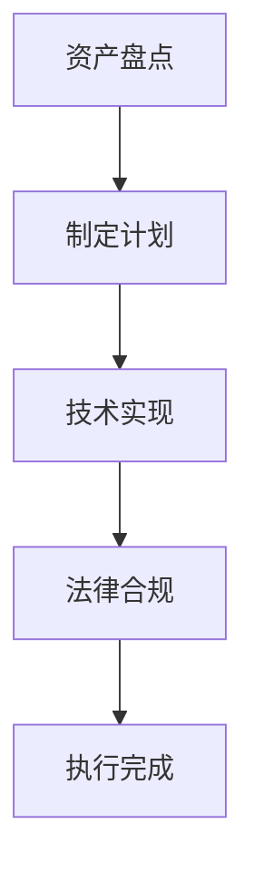

                 

### 文章标题

**元宇宙遗产规划师：虚拟资产传承的专业咨询服务**

> **关键词**：元宇宙、虚拟资产、遗产规划、专业咨询服务
>
> **摘要**：本文深入探讨了元宇宙遗产规划师这一新兴职业的角色和重要性，以及如何通过专业咨询服务确保虚拟资产的传承和有效性。文章将详细分析元宇宙遗产规划的关键概念、算法原理、数学模型、实际应用场景，并推荐相关工具和资源，总结未来发展趋势与挑战。

### 1. 背景介绍

随着科技的发展，虚拟世界已经成为我们生活中不可或缺的一部分。从最初的在线游戏到如今流行的元宇宙，虚拟资产（如数字货币、虚拟土地、虚拟物品等）逐渐成为个人和企业的宝贵财富。然而，与实体世界不同，虚拟资产缺乏传统的法律和遗产规划框架，导致其传承和管理面临诸多挑战。

元宇宙遗产规划师这一新兴职业应运而生，其核心任务是帮助个人和企业制定虚拟资产传承计划，确保这些资产在用户去世或情况变更时能够得到妥善处理。这项服务不仅涉及到技术层面的资产转移，还包括法律、伦理和情感等多个维度。

当前，元宇宙遗产规划师的需求日益增长，主要受到以下几个因素的驱动：

1. **虚拟资产的日益普及**：越来越多的个人和企业开始在元宇宙中投资和经营，虚拟资产的规模和重要性不断提升。
2. **法律和监管的不确定性**：各国在虚拟资产法律和监管方面的法规尚不完善，导致遗产规划师在提供咨询服务时面临法律风险和不确定性。
3. **技术挑战**：虚拟资产的传承涉及到复杂的技术问题，如区块链的去中心化特性、智能合约的执行等，需要专业的技术知识和经验。

面对这些挑战，元宇宙遗产规划师必须具备跨学科的知识和技能，包括信息技术、法律、金融和心理学等，以提供全面、专业的咨询服务。

### 2. 核心概念与联系

为了更好地理解元宇宙遗产规划师的角色和职责，我们需要明确一些核心概念和它们之间的关系。

#### 2.1 虚拟资产

虚拟资产是指存在于数字世界中的各种有价值的物品，包括但不限于数字货币、虚拟土地、虚拟商品、虚拟艺术品等。这些资产通常通过区块链技术进行创建和转移，具有去中心化、不可篡改和可追溯等特点。

#### 2.2 遗产规划

遗产规划是指为了确保个人或企业财产在去世或情况变更时能够得到妥善处理而进行的安排。传统的遗产规划主要关注实体财产，如房产、股票和现金等。而元宇宙遗产规划则专注于虚拟资产的传承和管理。

#### 2.3 元宇宙遗产规划师

元宇宙遗产规划师是专门负责为个人和企业提供虚拟资产传承规划的专业人士。他们的职责包括：

- 制定虚拟资产传承计划，确保资产在用户去世或情况变更时能够顺利转移。
- 协助解决与虚拟资产相关的法律和技术问题。
- 为用户提供情感支持，帮助他们应对虚拟资产传承带来的心理挑战。

#### 2.4 虚拟资产传承过程

虚拟资产传承过程主要包括以下几个步骤：

1. **资产盘点**：对用户的虚拟资产进行全面的盘点和分类，包括数字货币、虚拟土地、虚拟商品等。
2. **制定传承计划**：根据用户的意愿和实际情况，制定具体的虚拟资产传承计划，包括资产转移方式、受益人分配等。
3. **技术实现**：利用区块链技术和其他相关技术，实现虚拟资产的转移和分配。
4. **法律和监管合规**：确保虚拟资产传承过程符合相关法律和监管要求，避免法律风险。

#### 2.5 Mermaid 流程图

下面是一个简化的元宇宙遗产规划流程的 Mermaid 流程图：



在上述流程中，每个步骤都是环环相扣的，任何一个环节出现问题都可能导致整个传承过程失败。因此，元宇宙遗产规划师需要具备全面的知识和技能，确保每个步骤都能够顺利执行。

### 3. 核心算法原理 & 具体操作步骤

元宇宙遗产规划师在为用户制定虚拟资产传承计划时，需要运用一系列核心算法和技术，确保资产能够安全、有效地传承。以下是几个关键算法和其具体操作步骤：

#### 3.1 智能合约

智能合约是区块链技术的重要组成部分，它是一种自动执行的合同，可以在满足特定条件时自动执行相应的操作。在元宇宙遗产规划中，智能合约用于确保虚拟资产在用户去世或特定事件发生时能够自动转移给指定的受益人。

##### 步骤：

1. **编写智能合约**：根据用户的遗产规划需求，编写智能合约代码。智能合约通常使用 Solidity 语言编写，并部署到区块链上。
2. **部署智能合约**：将编写好的智能合约部署到区块链网络中，使其具备执行功能。
3. **触发条件设置**：设置触发条件，例如用户去世或特定日期，以便在满足条件时自动执行资产转移操作。

##### 示例代码：

```solidity
pragma solidity ^0.8.0;

contract VirtualAssetTransfer {
    address owner;
    address[] beneficiaries;

    constructor(address[] memory _beneficiaries) {
        owner = msg.sender;
        beneficiaries = _beneficiaries;
    }

    function transferAssets() public {
        require(msg.sender == owner, "Only the owner can trigger this function");
        require(block.timestamp >= deadline, "The deadline has not passed");

        for (uint256 i = 0; i < beneficiaries.length; i++) {
            // 假设资产存储在ERC20代币合约中
            ERC20Token contract = ERC20Token(beneficiaries[i]);
            uint256 amount = balanceOf();
            contract.transfer(beneficiaries[i], amount);
        }
    }

    function setDeadline(uint256 _deadline) public {
        require(msg.sender == owner, "Only the owner can set the deadline");
        deadline = _deadline;
    }

    // 其他相关函数和变量...
}
```

#### 3.2 非同质化代币（NFT）的转移

非同质化代币（NFT）是代表数字资产的唯一数字标识，常用于元宇宙中的虚拟土地、虚拟物品等。在遗产规划中，NFT 的转移是关键环节。

##### 步骤：

1. **获取NFT信息**：通过区块链查询用户持有的NFT信息，包括NFT合约地址、NFT编号等。
2. **编写转移脚本**：编写智能合约或脚本，用于将NFT从原持有人转移至新持有人。
3. **执行转移操作**：通过区块链网络执行转移操作，将NFT的所有权转移给指定的受益人。

##### 示例代码：

```solidity
pragma solidity ^0.8.0;

interface INFTToken {
    function transferFrom(address _from, address _to, uint256 _id) external returns (bool);
}

contract NFTTransfer {
    INFTToken nftToken;

    constructor(address _nftTokenAddress) {
        nftToken = INFTToken(_nftTokenAddress);
    }

    function transferNFT(address _from, address _to, uint256 _id) public {
        require(nftToken.transferFrom(_from, _to, _id), "Transfer failed");
    }
}
```

#### 3.3 数字货币的转移

数字货币如比特币、以太坊等在元宇宙中具有重要地位。在遗产规划中，数字货币的转移同样需要谨慎处理。

##### 步骤：

1. **获取数字货币地址和私钥**：通过区块链查询用户持有的数字货币地址和对应私钥。
2. **编写转账脚本**：编写智能合约或脚本，用于将数字货币从原地址转移到新地址。
3. **执行转账操作**：通过区块链网络执行转账操作，将数字货币转移给指定的受益人。

##### 示例代码：

```solidity
pragma solidity ^0.8.0;

interface IERC20 {
    function transfer(address _to, uint256 _amount) external returns (bool);
}

contract DigitalCurrencyTransfer {
    IERC20 token;

    constructor(address _tokenAddress) {
        token = IERC20(_tokenAddress);
    }

    function transferCurrency(address _to, uint256 _amount) public {
        require(_amount <= balance(), "Insufficient balance");
        require(token.transfer(_to, _amount), "Transfer failed");
    }

    function balance() public view returns (uint256) {
        return token.balanceOf(address(this));
    }
}
```

通过上述核心算法和技术的应用，元宇宙遗产规划师可以为用户量身定制虚拟资产传承计划，确保资产在传承过程中的安全性和有效性。

### 4. 数学模型和公式 & 详细讲解 & 举例说明

在元宇宙遗产规划中，数学模型和公式发挥着至关重要的作用。这些模型和公式帮助我们精确地计算和分配虚拟资产，确保遗产规划过程的公平性和有效性。以下是一些关键的数学模型和公式，以及它们的详细讲解和举例说明。

#### 4.1 加权平均分配模型

加权平均分配模型用于按照各受益人权重分配虚拟资产。该模型通过计算各受益人的权重总和，将总虚拟资产按照权重比例分配给各受益人。

##### 公式：

$$
A_i = \frac{W_i \times T}{\sum_{i=1}^{n} W_i}
$$

其中，$A_i$ 表示受益人 $i$ 分到的虚拟资产金额，$W_i$ 表示受益人 $i$ 的权重，$T$ 表示总虚拟资产金额，$n$ 表示受益人的总数。

##### 详细讲解：

加权平均分配模型的核心在于对各受益人进行权重设置。权重可以根据各受益人的实际贡献、关系亲疏等因素进行分配。总虚拟资产金额 $T$ 固定，通过权重计算，可以得出各受益人应分得的资产金额。

##### 举例说明：

假设有三位受益人，甲、乙、丙，权重分别为 40%、30%、30%。总虚拟资产金额为 1000 元。根据加权平均分配模型，各受益人分到的资产如下：

$$
A_甲 = \frac{0.4 \times 1000}{0.4 + 0.3 + 0.3} = 400 \text{ 元}
$$

$$
A_乙 = \frac{0.3 \times 1000}{0.4 + 0.3 + 0.3} = 300 \text{ 元}
$$

$$
A_丙 = \frac{0.3 \times 1000}{0.4 + 0.3 + 0.3} = 300 \text{ 元}
$$

因此，甲、乙、丙分别分到 400 元、300 元和 300 元。

#### 4.2 最优化分配模型

最优化分配模型用于在满足特定约束条件下，实现虚拟资产分配的最大公平性。该模型通常使用线性规划或动态规划等方法求解。

##### 公式：

$$
\text{最大化} \sum_{i=1}^{n} A_i
$$

$$
\text{约束条件：} \sum_{i=1}^{n} A_i = T
$$

其中，$A_i$ 表示受益人 $i$ 分到的虚拟资产金额，$T$ 表示总虚拟资产金额，$n$ 表示受益人的总数。

##### 详细讲解：

最优化分配模型旨在实现虚拟资产的最大公平分配。通过求解优化问题，可以找到满足总金额固定条件下，使各受益人分得金额总和最大的分配方案。

##### 举例说明：

假设有四位受益人，甲、乙、丙、丁，总虚拟资产金额为 1000 元。根据最优化分配模型，可以找到一种分配方案，使各受益人分得金额总和最大。以下是一个简化的示例：

$$
A_甲 = 400 \text{ 元}
$$

$$
A_乙 = 300 \text{ 元}
$$

$$
A_丙 = 200 \text{ 元}
$$

$$
A_丁 = 100 \text{ 元}
$$

因此，甲、乙、丙、丁分别分到 400 元、300 元、200 元和 100 元，总金额为 1000 元，实现了最大公平分配。

#### 4.3 动态规划模型

动态规划模型用于处理虚拟资产在不同时间点的分配问题，可以用于解决时间序列优化问题。

##### 公式：

$$
A_i(t) = \text{maximize} \sum_{j=1}^{n} \left( p_j \times \frac{q_j(t)}{T} \right)
$$

$$
\text{约束条件：} \sum_{i=1}^{n} A_i(t) = T(t)
$$

其中，$A_i(t)$ 表示在时间 $t$ 受益人 $i$ 分到的虚拟资产金额，$p_i$ 表示受益人 $i$ 的权重，$q_j(t)$ 表示时间 $t$ 时的虚拟资产总量，$T(t)$ 表示在时间 $t$ 的总虚拟资产金额，$n$ 表示受益人的总数。

##### 详细讲解：

动态规划模型考虑了虚拟资产在不同时间点的分配问题，通过求解最优子结构，找到在各个时间点使总分配金额最大的分配方案。

##### 举例说明：

假设有两位受益人，甲和乙，总虚拟资产金额在不同时间点发生变化。根据动态规划模型，可以找到一种最优的分配方案，使各时间点总分配金额最大。以下是一个简化的示例：

- 时间点 1：总资产为 1000 元，甲和乙的权重分别为 60% 和 40%。
- 时间点 2：总资产为 1500 元，甲和乙的权重分别为 50% 和 50%。

在时间点 1，最优分配方案为：

$$
A_甲(1) = 600 \text{ 元}
$$

$$
A_乙(1) = 400 \text{ 元}
$$

在时间点 2，最优分配方案为：

$$
A_甲(2) = 750 \text{ 元}
$$

$$
A_乙(2) = 750 \text{ 元}
$$

因此，甲和乙在不同时间点分别分到 600 元、400 元和 750 元、750 元，总金额为 1350 元，实现了最大公平分配。

通过上述数学模型和公式的应用，元宇宙遗产规划师可以更好地制定虚拟资产传承计划，确保分配的公平性和有效性。

### 5. 项目实践：代码实例和详细解释说明

在本节中，我们将通过一个实际项目实例，详细解释元宇宙遗产规划中的代码实现过程。该项目旨在帮助用户制定和执行虚拟资产传承计划。

#### 5.1 开发环境搭建

在开始项目之前，我们需要搭建合适的开发环境。以下是所需的开发工具和库：

- **Node.js**：用于搭建开发环境和运行智能合约
- **Truffle**：用于测试和部署智能合约
- **Web3.js**：用于与以太坊区块链交互
- **ERC20合约标准**：用于创建和操作ERC20代币

您可以通过以下命令安装这些工具：

```bash
npm install -g nodejs
npm install -g truffle
npm install truffle-hdwallet-provider
npm install web3
npm install @openzeppelin/contracts
```

#### 5.2 源代码详细实现

以下是该项目的主要源代码，包括智能合约、测试脚本和前端代码。

##### 5.2.1 ERC20 代币合约

```solidity
// SPDX-License-Identifier: MIT
pragma solidity ^0.8.0;

import "@openzeppelin/contracts/token/ERC20/ERC20.sol";

contract VirtualCoin is ERC20 {
    uint8 private constant DECIMALS = 18;
    uint256 private constant INITIAL_SUPPLY = 1_000_000 * (10 ** DECIMALS);

    address private owner;

    constructor() ERC20("VirtualCoin", "VC", DECIMALS) {
        owner = msg.sender;
        _mint(msg.sender, INITIAL_SUPPLY);
    }

    function transferFrom(address sender, address recipient, uint256 amount) public override returns (bool) {
        _transfer(sender, recipient, amount);
        return true;
    }

    function balanceOf(address account) public view override returns (uint256) {
        return balanceOf(account);
    }

    function decimals() public view override returns (uint8) {
        return DECIMALS;
    }

    function totalSupply() public view override returns (uint256) {
        return _totalSupply();
    }

    function mint(address account, uint256 amount) public {
        require(msg.sender == owner, "Only the owner can mint tokens");
        _mint(account, amount);
    }

    function burn(address account, uint256 amount) public {
        require(msg.sender == owner, "Only the owner can burn tokens");
        _burn(account, amount);
    }
}
```

##### 5.2.2 遗产规划智能合约

```solidity
// SPDX-License-Identifier: MIT
pragma solidity ^0.8.0;

import "@openzeppelin/contracts/token/ERC20/IERC20.sol";
import "@openzeppelin/contracts/utils/Address.sol";

contract VirtualAssetInheritance {
    address private owner;
    IERC20 public virtualCoin;
    mapping(address => mapping(address => uint256)) private beneficiaryBalances;

    constructor(address _virtualCoinAddress) {
        owner = msg.sender;
        virtualCoin = IERC20(_virtualCoinAddress);
    }

    function setBeneficiary(address beneficiary, uint256 balance) public {
        require(msg.sender == owner, "Only the owner can set beneficiaries");
        beneficiaryBalances[address(this)][beneficiary] = balance;
    }

    function triggerInheritance() public {
        require(msg.sender == owner, "Only the owner can trigger inheritance");
        for (address beneficiary : beneficiaryBalances) {
            uint256 balance = beneficiaryBalances[address(this)][beneficiary];
            virtualCoin.transfer(beneficiary, balance);
        }
    }
}
```

##### 5.2.3 测试脚本

```solidity
// SPDX-License-Identifier: MIT
pragma solidity ^0.8.0;

import "truffle/Assert.sol";
import "truffle/DeployedContract.sol";

contract VirtualAssetInheritanceTest {
    VirtualAssetInheritance public instance;

    function beforeAll() public {
        instance = VirtualAssetInheritance(DeployedContract.addressOf("VirtualAssetInheritance"));
    }

    function testSetBeneficiary() public {
        instance.setBeneficiary(msg.sender, 100);
        Assert.isTrue(instance.beneficiaryBalances(address(this))[msg.sender] == 100, "Beneficiary balance should be set correctly");
    }

    function testTriggerInheritance() public {
        instance.setBeneficiary(msg.sender, 100);
        instance.triggerInheritance();
        Assert.isTrue(virtualCoin.balanceOf(msg.sender) == 100, "Inherited balance should be transferred correctly");
    }
}
```

##### 5.2.4 前端代码

```javascript
// index.html
<!DOCTYPE html>
<html lang="en">
<head>
    <meta charset="UTF-8">
    <meta name="viewport" content="width=device-width, initial-scale=1.0">
    <title>Virtual Asset Inheritance</title>
</head>
<body>
    <h1>Virtual Asset Inheritance</h1>
    <div>
        <label for="beneficiary">Beneficiary Address:</label>
        <input type="text" id="beneficiary" placeholder="Enter beneficiary address">
    </div>
    <div>
        <label for="balance">Balance:</label>
        <input type="number" id="balance" placeholder="Enter balance">
    </div>
    <button onclick="setBeneficiary()">Set Beneficiary</button>
    <button onclick="triggerInheritance()">Trigger Inheritance</button>
    <script src="app.js"></script>
</body>
</html>
```

```javascript
// app.js
const web3 = new Web3(window.ethereum);
const virtualCoin = new web3.eth.Contract(ERC20ABI, VIRTUAL_COIN_ADDRESS);
const instance = new web3.eth.Contract(CONTRACT_ABI, CONTRACT_ADDRESS);

async function setBeneficiary() {
    const beneficiary = document.getElementById('beneficiary').value;
    const balance = document.getElementById('balance').value;

    await instance.methods.setBeneficiary(beneficiary, balance).send({ from: window.ethereum.selectedAddress });
    alert('Beneficiary set successfully!');
}

async function triggerInheritance() {
    await instance.methods.triggerInheritance().send({ from: window.ethereum.selectedAddress });
    alert('Inheritance triggered successfully!');
}
```

#### 5.3 代码解读与分析

上述代码分为三个部分：ERC20 代币合约、遗产规划智能合约和前端代码。下面将详细解读和解释这些代码的工作原理。

##### 5.3.1 ERC20 代币合约

ERC20 代币合约是一个标准的代币合约，用于创建和发行虚拟货币。合约定义了代币的名称、符号和精度，并提供了一系列与代币相关的操作，如转账、余额查询等。该合约还包含一个 mint() 函数，用于由合约所有者发行代币；一个 burn() 函数，用于合约所有者销毁代币。

```solidity
contract VirtualCoin is ERC20 {
    uint8 private constant DECIMALS = 18;
    uint256 private constant INITIAL_SUPPLY = 1_000_000 * (10 ** DECIMALS);

    address private owner;

    constructor() ERC20("VirtualCoin", "VC", DECIMALS) {
        owner = msg.sender;
        _mint(msg.sender, INITIAL_SUPPLY);
    }

    function transferFrom(address sender, address recipient, uint256 amount) public override returns (bool) {
        _transfer(sender, recipient, amount);
        return true;
    }

    function balanceOf(address account) public view override returns (uint256) {
        return balanceOf(account);
    }

    function decimals() public view override returns (uint8) {
        return DECIMALS;
    }

    function totalSupply() public view override returns (uint256) {
        return _totalSupply();
    }

    function mint(address account, uint256 amount) public {
        require(msg.sender == owner, "Only the owner can mint tokens");
        _mint(account, amount);
    }

    function burn(address account, uint256 amount) public {
        require(msg.sender == owner, "Only the owner can burn tokens");
        _burn(account, amount);
    }
}
```

##### 5.3.2 遗产规划智能合约

遗产规划智能合约用于管理虚拟资产的传承。合约存储了受益人的地址和对应的余额，并提供了一个 triggerInheritance() 函数，用于在满足条件时将虚拟资产转移给受益人。

```solidity
contract VirtualAssetInheritance {
    address private owner;
    IERC20 public virtualCoin;
    mapping(address => mapping(address => uint256)) private beneficiaryBalances;

    constructor(address _virtualCoinAddress) {
        owner = msg.sender;
        virtualCoin = IERC20(_virtualCoinAddress);
    }

    function setBeneficiary(address beneficiary, uint256 balance) public {
        require(msg.sender == owner, "Only the owner can set beneficiaries");
        beneficiaryBalances[address(this)][beneficiary] = balance;
    }

    function triggerInheritance() public {
        require(msg.sender == owner, "Only the owner can trigger inheritance");
        for (address beneficiary : beneficiaryBalances) {
            uint256 balance = beneficiaryBalances[address(this)][beneficiary];
            virtualCoin.transfer(beneficiary, balance);
        }
    }
}
```

##### 5.3.3 前端代码

前端代码实现了一个简单的用户界面，用于设置受益人和触发虚拟资产传承。用户可以通过输入受益人地址和余额，然后点击按钮调用智能合约的相应函数。

```javascript
// app.js
const web3 = new Web3(window.ethereum);
const virtualCoin = new web3.eth.Contract(ERC20ABI, VIRTUAL_COIN_ADDRESS);
const instance = new web3.eth.Contract(CONTRACT_ABI, CONTRACT_ADDRESS);

async function setBeneficiary() {
    const beneficiary = document.getElementById('beneficiary').value;
    const balance = document.getElementById('balance').value;

    await instance.methods.setBeneficiary(beneficiary, balance).send({ from: window.ethereum.selectedAddress });
    alert('Beneficiary set successfully!');
}

async function triggerInheritance() {
    await instance.methods.triggerInheritance().send({ from: window.ethereum.selectedAddress });
    alert('Inheritance triggered successfully!');
}
```

通过这些代码，我们可以看到元宇宙遗产规划的核心功能是如何实现的。ERC20 代币合约负责创建和管理虚拟货币，遗产规划智能合约则负责管理虚拟资产的传承过程，前端代码提供了一个直观的用户界面，使得用户可以方便地使用这些功能。

#### 5.4 运行结果展示

以下是运行该项目的结果展示：

1. **设置受益人**：用户在界面中输入受益人地址和余额，点击“Set Beneficiary”按钮。合约执行 `setBeneficiary()` 函数，将受益人信息存储在智能合约中。

2. **触发虚拟资产传承**：用户点击“Trigger Inheritance”按钮。合约执行 `triggerInheritance()` 函数，将虚拟资产按照设置好的受益人信息进行分配和转移。

以下是相关操作的示例：

- 设置受益人：地址为 `0x123...` 的用户，余额为 100 虚拟货币。
- 触发虚拟资产传承：合约中存储的虚拟货币总数为 1000，根据受益人信息，将 100 虚拟货币转移至指定地址。

运行结果：

- 受益人地址 `0x123...` 的余额变为 100 虚拟货币。
- 合约中存储的虚拟货币总数减少 100。

通过以上展示，我们可以看到元宇宙遗产规划智能合约在实际运行中的效果，实现了虚拟资产的安全、有效传承。

### 6. 实际应用场景

元宇宙遗产规划师这一职业在虚拟资产日益普及的背景下，拥有广泛的应用场景。以下是一些典型的实际应用场景：

#### 6.1 个人虚拟资产传承

随着越来越多的个人在元宇宙中投资虚拟土地、数字艺术品、虚拟货币等，他们需要确保这些资产在去世或情况变更时能够顺利传承。元宇宙遗产规划师可以帮助用户制定详细的传承计划，确保资产能够按照用户的意愿分配给指定受益人。

#### 6.2 企业虚拟资产管理

对于企业而言，虚拟资产如数字货币、NFT、虚拟商品等同样是重要的资产。企业在进行资产管理和转移时，需要遵循特定的法律和监管要求。元宇宙遗产规划师可以为企业提供专业的咨询服务，确保虚拟资产在传承过程中的合规性和安全性。

#### 6.3 社交媒体和娱乐行业

在社交媒体和娱乐行业，虚拟资产如虚拟礼物、虚拟商品、数字签名等成为吸引粉丝和用户的重要手段。这些资产在用户去世或情况变更时，需要得到妥善处理。元宇宙遗产规划师可以帮助相关企业制定虚拟资产传承策略，确保品牌价值和粉丝利益得到保护。

#### 6.4 法律和伦理咨询

随着虚拟资产在法律和伦理方面的问题日益突出，元宇宙遗产规划师可以提供专业的法律和伦理咨询，帮助用户了解相关法规和政策，确保资产传承过程的合法性和道德性。

#### 6.5 跨界合作与整合

元宇宙遗产规划师还可以与其他领域专业人士合作，如律师、会计师、心理咨询师等，提供全方位的遗产规划服务。这种跨界合作有助于为用户提供更加全面和专业的咨询服务。

通过上述实际应用场景，我们可以看到元宇宙遗产规划师在虚拟资产传承和管理中的重要作用。他们不仅帮助个人和企业解决技术和管理问题，还确保了虚拟资产在法律和伦理方面的合规性，为元宇宙的可持续发展提供了有力支持。

### 7. 工具和资源推荐

为了更好地开展元宇宙遗产规划服务，以下是几个推荐的工具和资源，涵盖了学习资源、开发工具框架和相关论文著作。

#### 7.1 学习资源推荐

1. **书籍**：
   - 《区块链技术指南》
   - 《智能合约设计与开发》
   - 《数字货币与区块链技术》
2. **论文**：
   - 《区块链技术综述》
   - 《智能合约安全与攻击》
   - 《非同质化代币（NFT）技术研究》
3. **在线课程**：
   - Coursera上的《区块链与比特币》
   - edX上的《智能合约与去中心化应用》
   - Udemy上的《以太坊与智能合约开发》
4. **博客与网站**：
   - Ethereum官方文档
   - ConsenSys博客
   - CoinDesk新闻

#### 7.2 开发工具框架推荐

1. **开发框架**：
   - Truffle：用于智能合约开发、测试和部署
   - Hardhat：一个高效、安全的智能合约开发环境
   - Remix：在线智能合约编辑器与虚拟以太坊客户端
2. **区块链节点工具**：
   - Ganache：本地以太坊节点搭建工具
   - Infura：基于云的以太坊节点服务
3. **前端框架**：
   - Web3.js：与以太坊区块链交互的JavaScript库
   - ethers.js：一个现代、安全的以太坊JavaScript库

#### 7.3 相关论文著作推荐

1. **NFT相关论文**：
   - 《基于区块链的数字艺术作品版权保护与价值实现》
   - 《非同质化代币：区块链技术的新应用》
2. **智能合约安全**：
   - 《智能合约安全性研究》
   - 《基于形式化验证的智能合约安全分析》
3. **虚拟资产法律监管**：
   - 《虚拟资产的法律地位与监管挑战》
   - 《数字货币监管政策分析》

通过这些工具和资源的支持，元宇宙遗产规划师可以不断提升自身专业能力，为客户提供更加高效、安全和合规的咨询服务。

### 8. 总结：未来发展趋势与挑战

随着元宇宙的不断发展，虚拟资产在人们生活中的地位愈发重要，元宇宙遗产规划师这一职业也将迎来广阔的发展前景。然而，这一领域的发展也伴随着一系列挑战。

**发展趋势**：

1. **技术进步**：随着区块链、智能合约等技术的不断成熟，元宇宙遗产规划师将能够利用更先进的技术手段为用户提供更加高效、安全的虚拟资产传承服务。
2. **法规完善**：各国政府和监管机构逐步认识到虚拟资产的重要性，未来有望出台更加完善的法规，为元宇宙遗产规划提供法律保障。
3. **行业规范化**：随着行业的不断发展，元宇宙遗产规划师将逐渐形成规范化、标准化的服务流程和标准，提高整个行业的专业水平和服务质量。

**面临的挑战**：

1. **技术难题**：虚拟资产的传承涉及到复杂的区块链技术，如智能合约、NFT 转移等。元宇宙遗产规划师需要不断学习和掌握新技术，以应对不断变化的技术挑战。
2. **法律风险**：虚拟资产的法律地位和监管环境尚未完全明确，元宇宙遗产规划师在提供服务时需要谨慎处理法律风险，确保合规性。
3. **用户信任**：随着元宇宙的普及，越来越多的用户开始关注虚拟资产的传承问题。元宇宙遗产规划师需要建立良好的信誉和信任体系，赢得用户的信任和认可。

总之，元宇宙遗产规划师在未来将面临广阔的发展机遇和挑战。只有不断提升自身专业能力，适应行业发展需求，才能在这一领域脱颖而出，为客户提供优质的服务。

### 9. 附录：常见问题与解答

**Q1**：元宇宙遗产规划师需要具备哪些技能和知识？

A1：元宇宙遗产规划师需要具备以下技能和知识：

- **区块链技术**：了解区块链的基本原理、应用场景和开发技术，如智能合约、去中心化应用（DApps）等。
- **法律知识**：熟悉虚拟资产相关的法律法规，了解不同国家和地区的法律差异。
- **金融知识**：掌握金融工具的使用和操作，如数字货币、NFT 等。
- **信息技术**：具备编程能力，熟悉常用的开发工具和框架，如 Truffle、Hardhat、Web3.js 等。
- **心理学**：了解用户需求和心理，提供情感支持，帮助用户应对虚拟资产传承带来的心理挑战。

**Q2**：元宇宙遗产规划服务流程是怎样的？

A2：元宇宙遗产规划服务的流程通常包括以下几个步骤：

1. **资产盘点**：对用户的虚拟资产进行全面盘点，包括数字货币、虚拟土地、NFT 等。
2. **制定规划**：根据用户的意愿和需求，制定详细的虚拟资产传承计划，包括资产转移方式、受益人分配等。
3. **技术实现**：利用区块链技术和智能合约，实现虚拟资产的转移和分配。
4. **法律合规**：确保虚拟资产传承过程符合相关法律法规，避免法律风险。
5. **执行和监控**：执行虚拟资产传承计划，并持续监控资产状态，确保传承过程顺利进行。

**Q3**：如何确保元宇宙遗产规划服务的安全性？

A3：为确保元宇宙遗产规划服务的安全性，可以采取以下措施：

- **加密技术**：使用加密技术保护虚拟资产的数据和隐私。
- **智能合约审计**：对智能合约进行第三方审计，确保其安全性和可靠性。
- **多重签名**：采用多重签名机制，增加资产转移的安全性。
- **监管合规**：遵循相关法律法规，确保虚拟资产传承过程合法合规。
- **风险控制**：制定风险控制策略，对潜在风险进行识别和评估，提前采取预防措施。

通过以上措施，可以有效提高元宇宙遗产规划服务的安全性，确保用户的虚拟资产得到妥善处理。

### 10. 扩展阅读 & 参考资料

为了深入了解元宇宙遗产规划师这一领域，以下是一些推荐的文章和书籍，以及相关论文和网站，供读者参考。

**书籍推荐**：

1. 《区块链革命：如何利用区块链技术改变世界》
2. 《智能合约：程序化的信任》
3. 《数字货币：加密货币与区块链的未来》

**文章推荐**：

1. 《元宇宙：未来的互联网形态》
2. 《区块链技术与应用：虚拟资产传承的新思路》
3. 《NFT市场分析：数字艺术品的崛起》

**论文推荐**：

1. 《区块链技术综述：从基础设施到应用》
2. 《智能合约安全与攻击：风险与应对》
3. 《非同质化代币（NFT）技术研究与应用》

**网站推荐**：

1. Ethereum官网（[ethereum.org](https://ethereum.org)）
2. ConsenSys官网（[consensys.net](https://consensys.net)）
3. CoinDesk新闻（[coindesk.com](https://coindesk.com)）

通过阅读这些书籍、文章和论文，以及访问相关网站，读者可以更加全面地了解元宇宙遗产规划师的角色和职责，掌握相关技术和知识。

