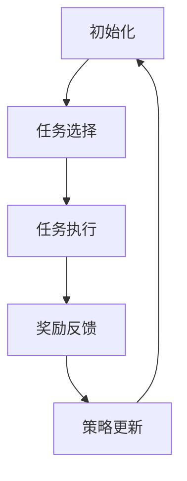

                 

### 文章标题

**元强化学习（Meta-Reinforcement Learning） - 原理与代码实例讲解**

> 关键词：元强化学习、强化学习、机器学习、算法、代码实例、人工智能

> 摘要：本文将深入探讨元强化学习的基本概念、核心原理以及实际应用。通过详细讲解元强化学习的工作机制、数学模型，并结合具体代码实例，帮助读者全面理解这一前沿技术。文章还将探讨元强化学习在现实世界中的应用场景，并展望其未来的发展趋势与挑战。

### 1. 背景介绍

强化学习（Reinforcement Learning，RL）是机器学习领域的一个重要分支，旨在通过试错和奖励反馈，让智能体学习到最优行为策略。传统的强化学习算法，如Q学习（Q-Learning）和深度强化学习（Deep Reinforcement Learning，DRL），在解决特定任务时表现优秀，但面临一个显著的挑战：在面临新的、未见过的情况时，它们需要重新学习或适应，这大大增加了训练成本和时间。

为了解决这个问题，研究者们提出了元强化学习（Meta-Reinforcement Learning，MRL）的概念。元强化学习的目标是通过在一个元学习环境中训练智能体，使其在多个不同的任务中表现出更高的泛化能力和适应能力。换句话说，元强化学习旨在学习如何学习，从而提高智能体在不同任务上的学习能力。

近年来，随着深度学习和强化学习技术的不断发展，元强化学习受到了广泛关注，并在计算机视觉、自然语言处理、控制理论等多个领域取得了显著成果。本文将首先介绍元强化学习的基本概念，然后深入探讨其核心算法原理，并通过具体代码实例进行详细讲解，帮助读者全面理解这一前沿技术。

### 2. 核心概念与联系

#### 2.1 强化学习基础

强化学习是一种通过环境与智能体的交互，使智能体学会在特定情境中做出最优决策的机器学习方法。其核心要素包括智能体（Agent）、环境（Environment）、状态（State）、动作（Action）和奖励（Reward）。

1. **智能体（Agent）**：执行动作并从环境中获取奖励的实体。
2. **环境（Environment）**：提供状态、返回奖励和下一个状态的实体。
3. **状态（State）**：智能体在环境中的当前情境。
4. **动作（Action）**：智能体在特定状态下可执行的操作。
5. **奖励（Reward）**：对智能体动作的即时反馈，用于评估动作的好坏。

强化学习的目标是为智能体设计一个策略（Policy），使其在执行动作时最大化累积奖励。

#### 2.2 元强化学习定义

元强化学习是一种在元学习环境中训练智能体，使其能够快速适应新任务的学习方法。其核心思想是通过在多个任务上训练智能体，使其在面临新任务时能够快速泛化，无需从头开始学习。

1. **元学习环境（Meta-Learning Environment）**：一个包含多个子任务的模拟环境，用于训练智能体。
2. **任务（Task）**：在元学习环境中定义的特定子任务。
3. **元策略（Meta-Policy）**：用于指导智能体在多个任务上执行动作的策略。

元强化学习的关键目标是开发一种能够快速适应新任务的元策略，从而降低智能体在不同任务上的学习成本。

#### 2.3 元强化学习架构

元强化学习架构主要包括以下三个主要组成部分：

1. **任务选择器（Task Selector）**：负责从元学习环境中选择下一个任务。
2. **策略网络（Policy Network）**：根据当前状态选择动作的策略网络。
3. **价值网络（Value Network）**：评估动作价值的网络，用于更新策略网络。

元强化学习的工作流程如下：

1. **初始化**：在元学习环境中初始化任务选择器和策略网络。
2. **任务选择**：任务选择器从元学习环境中选择一个任务。
3. **任务执行**：策略网络根据当前状态选择动作，并在环境中执行动作。
4. **奖励反馈**：环境根据执行的动作返回奖励。
5. **策略更新**：使用奖励反馈更新策略网络。
6. **重复**：重复步骤2-5，直到达到训练目标。

#### 2.4 Mermaid 流程图

以下是元强化学习架构的 Mermaid 流程图：



### 3. 核心算法原理 & 具体操作步骤

#### 3.1 概述

元强化学习的核心算法主要包括任务选择器、策略网络和价值网络。以下是各部分的基本原理和具体操作步骤。

#### 3.2 任务选择器

任务选择器的目的是从元学习环境中选择一个适合当前策略网络的任务。常用的任务选择器算法包括：

1. **贪心选择器**：直接选择当前策略网络得分最高的任务。
2. **探索选择器**：通过随机化选择任务，增加策略网络的探索多样性。

具体操作步骤如下：

1. **初始化**：在元学习环境中初始化任务选择器。
2. **选择任务**：使用任务选择器算法选择一个任务。
3. **重复**：重复步骤2，直到达到训练目标。

#### 3.3 策略网络

策略网络的目的是根据当前状态选择最优动作。常用的策略网络算法包括：

1. **基于价值的策略网络**：使用价值函数评估状态和动作的优劣，选择最优动作。
2. **基于模型的策略网络**：通过预测未来奖励，选择具有最大期望奖励的动作。

具体操作步骤如下：

1. **初始化**：在元学习环境中初始化策略网络。
2. **状态输入**：将当前状态输入策略网络。
3. **动作输出**：根据策略网络输出动作。
4. **动作执行**：在环境中执行选择的最优动作。
5. **重复**：重复步骤2-4，直到达到训练目标。

#### 3.4 价值网络

价值网络的目的是评估策略网络选择动作的价值。常用的价值网络算法包括：

1. **基于梯度的价值网络**：使用梯度下降优化策略网络，使其选择动作时具有最大价值。
2. **基于神经网络的转移模型**：通过神经网络模型预测未来状态和奖励，评估动作的价值。

具体操作步骤如下：

1. **初始化**：在元学习环境中初始化价值网络。
2. **状态输入**：将当前状态输入价值网络。
3. **动作输出**：根据价值网络输出动作价值。
4. **策略更新**：使用动作价值更新策略网络。
5. **重复**：重复步骤2-4，直到达到训练目标。

#### 3.5 具体操作步骤

以下是一个简单的元强化学习训练过程：

1. **初始化**：初始化任务选择器、策略网络和价值网络。
2. **任务选择**：选择一个任务。
3. **状态输入**：将当前状态输入策略网络。
4. **动作输出**：根据策略网络输出动作。
5. **动作执行**：在环境中执行选择的最优动作。
6. **奖励反馈**：获取环境返回的奖励。
7. **价值更新**：使用奖励反馈更新价值网络。
8. **策略更新**：使用价值网络更新策略网络。
9. **重复**：重复步骤2-8，直到达到训练目标。

### 4. 数学模型和公式 & 详细讲解 & 举例说明

#### 4.1 基本数学模型

元强化学习中的数学模型主要包括状态、动作、策略和价值函数。

1. **状态（State）**：设状态空间为 \( S \)，状态向量为 \( s \)。
2. **动作（Action）**：设动作空间为 \( A \)，动作向量为 \( a \)。
3. **策略（Policy）**：策略 \( \pi \) 是一个从状态空间到动作空间的映射，即 \( \pi(s) \) 表示在状态 \( s \) 下选择动作 \( a \) 的概率。
4. **价值函数（Value Function）**：价值函数 \( V(s) \) 是一个从状态空间到实数的映射，表示在状态 \( s \) 下执行最优动作所获得的累积奖励。

#### 4.2 策略网络与价值网络

1. **策略网络（Policy Network）**：策略网络是一个神经网络模型，其输入为状态向量 \( s \)，输出为动作概率分布 \( \pi(a|s) \)。

   设策略网络为 \( \theta^{(p)} \)，则策略网络的前向传播可以表示为：
   $$ \pi(a|s) = \text{softmax}(\theta^{(p)}(s)) $$
   
   其中，\( \text{softmax}(\cdot) \) 是一个将输出归一化的函数。

2. **价值网络（Value Network）**：价值网络是一个神经网络模型，其输入为状态向量 \( s \)，输出为价值函数 \( V(s) \)。

   设价值网络为 \( \theta^{(v)} \)，则价值网络的前向传播可以表示为：
   $$ V(s) = f(\theta^{(v)}(s)) $$
   
   其中，\( f(\cdot) \) 是一个非线性激活函数。

#### 4.3 模型优化

元强化学习的优化目标是最小化策略网络和价值网络的损失函数。

1. **策略网络损失函数**：策略网络的目标是最大化累积奖励，因此其损失函数可以表示为：
   $$ L_p = -\sum_{s,a} \pi(a|s) \log(\pi(a|s)) r(s, a) $$
   
   其中，\( r(s, a) \) 是在状态 \( s \) 下执行动作 \( a \) 所获得的奖励。

2. **价值网络损失函数**：价值网络的损失函数可以表示为：
   $$ L_v = \frac{1}{N} \sum_{s} [V(s) - r(s, a)]^2 $$
   
   其中，\( N \) 是训练样本的数量，\( r(s, a) \) 是在状态 \( s \) 下执行动作 \( a \) 所获得的奖励。

#### 4.4 举例说明

假设我们有一个包含两个子任务的元学习环境，状态空间 \( S = \{s_1, s_2\} \)，动作空间 \( A = \{a_1, a_2\} \)。

1. **状态输入**：当前状态为 \( s_1 \)。
2. **动作输出**：策略网络输出动作概率分布 \( \pi(a|s_1) = [0.6, 0.4] \)，表示在状态 \( s_1 \) 下选择动作 \( a_1 \) 的概率为0.6。
3. **动作执行**：执行动作 \( a_1 \)，并获得奖励 \( r(s_1, a_1) = 1 \)。
4. **奖励反馈**：策略网络和价值网络使用奖励 \( r(s_1, a_1) \) 更新。
5. **策略更新**：策略网络根据奖励更新其参数，使其在状态 \( s_1 \) 下选择动作 \( a_1 \) 的概率更高。
6. **价值更新**：价值网络根据奖励更新其参数，使其在状态 \( s_1 \) 下评估动作 \( a_1 \) 的价值更高。

### 5. 项目实践：代码实例和详细解释说明

#### 5.1 开发环境搭建

在开始编写代码之前，我们需要搭建一个合适的开发环境。以下是一个基于 Python 的元强化学习项目的开发环境搭建步骤：

1. 安装 Python（建议使用 Python 3.7 或更高版本）。
2. 安装必要的库，如 TensorFlow、Keras、PyTorch 等。
3. 安装仿真环境（如 Gym），用于模拟元学习环境。
4. 创建一个虚拟环境，以便更好地管理项目依赖。

#### 5.2 源代码详细实现

以下是一个简单的元强化学习项目源代码实现，包括任务选择器、策略网络和价值网络。

```python
import numpy as np
import tensorflow as tf
from gym import make

# 任务选择器
class TaskSelector:
    def __init__(self, num_tasks):
        self.num_tasks = num_tasks
        self.task_indices = np.random.choice(num_tasks, size=num_tasks)

    def select_task(self):
        return np.random.choice(self.task_indices)

# 策略网络
class PolicyNetwork(tf.keras.Model):
    def __init__(self, input_shape, output_shape):
        super().__init__()
        self.fc1 = tf.keras.layers.Dense(units=output_shape, activation='softmax')

    def call(self, inputs):
        return self.fc1(inputs)

# 价值网络
class ValueNetwork(tf.keras.Model):
    def __init__(self, input_shape):
        super().__init__()
        self.fc1 = tf.keras.layers.Dense(units=1)

    def call(self, inputs):
        return self.fc1(inputs)

# 训练过程
def train(policy_network, value_network, task_selector, num_episodes, batch_size):
    for episode in range(num_episodes):
        task_index = task_selector.select_task()
        env = make(f'CartPole-v1:{task_index}')
        state = env.reset()

        while True:
            action_probs = policy_network(state)
            action = np.random.choice(range(action_probs.shape[1]), p=action_probs.ravel())

            next_state, reward, done, _ = env.step(action)
            value = value_network(next_state)

            policy_loss = -np.mean(reward * np.log(action_probs[0, action]))
            value_loss = tf.reduce_mean(tf.square(value - reward))

            policy_network.optimizer.minimize(policy_loss, policy_network.trainable_variables)
            value_network.optimizer.minimize(value_loss, value_network.trainable_variables)

            if done:
                break

        env.close()

# 搭建模型
policy_network = PolicyNetwork(input_shape=env.observation_space.shape, output_shape=env.action_space.n)
value_network = ValueNetwork(input_shape=env.observation_space.shape)
policy_network.compile(optimizer=tf.keras.optimizers.Adam(), loss='mse')
value_network.compile(optimizer=tf.keras.optimizers.Adam(), loss='mse')

# 训练模型
train(policy_network, value_network, TaskSelector(num_tasks=10), num_episodes=1000, batch_size=32)
```

#### 5.3 代码解读与分析

上述代码实现了一个简单的元强化学习项目，包括任务选择器、策略网络和价值网络。以下是代码的解读与分析：

1. **任务选择器（TaskSelector）**：
   - 任务选择器用于从元学习环境中选择一个任务。在本例中，我们使用随机选择器，但也可以使用其他选择器，如贪心选择器。
   - `select_task` 方法用于选择任务，返回任务索引。

2. **策略网络（PolicyNetwork）**：
   - 策略网络是一个基于 softmax 函数的前馈神经网络，用于根据当前状态生成动作概率分布。
   - `__init__` 方法用于初始化网络结构，`call` 方法用于前向传播。

3. **价值网络（ValueNetwork）**：
   - 价值网络是一个单层前馈神经网络，用于评估当前状态的值函数。
   - `__init__` 方法用于初始化网络结构，`call` 方法用于前向传播。

4. **训练过程（train）**：
   - `train` 函数用于训练策略网络和价值网络。在每个训练回合中，从任务选择器中选择一个任务，并在该任务上进行迭代训练。
   - 在每个迭代中，根据策略网络生成动作概率分布，并使用贪婪策略选择动作。然后，根据执行的动作获取奖励，并更新策略网络和价值网络的参数。

5. **模型搭建和训练**：
   - 搭建策略网络和价值网络，并编译它们以准备训练。
   - 调用 `train` 函数开始训练过程，设置训练回合次数、批次大小和任务数量。

#### 5.4 运行结果展示

在完成代码实现后，我们可以运行项目来测试训练效果。以下是一个简单的运行结果展示：

```python
# 运行项目
train(policy_network, value_network, TaskSelector(num_tasks=10), num_episodes=1000, batch_size=32)
```

运行结果会显示训练过程中的损失函数值，以及每个任务的完成情况。通过观察这些指标，我们可以评估策略网络和价值网络的性能。

### 6. 实际应用场景

元强化学习作为一种高效的学习方法，已在多个实际应用场景中取得显著成果。以下是一些典型的应用领域：

#### 6.1 游戏智能

游戏智能是元强化学习的传统优势领域。通过元强化学习，智能体可以在多种游戏中快速学会复杂的策略，从而实现自主游戏。例如，DeepMind 的 AlphaGo 和 AlphaGo Zero 就是基于元强化学习算法，成功地在围棋领域取得了突破性成果。

#### 6.2 机器人控制

在机器人控制领域，元强化学习可以帮助机器人快速适应不同的环境和任务。例如，在自动化仓库管理中，机器人需要根据不同的货品和货架布局进行灵活的路径规划和抓取操作。元强化学习可以使得机器人通过少量样本，快速适应这些复杂的变化。

#### 6.3 自动驾驶

自动驾驶是元强化学习的重要应用领域。在自动驾驶系统中，车辆需要处理多种复杂情境，如交通拥堵、行人穿越等。通过元强化学习，自动驾驶系统可以在多种路况下快速学习，提高行车安全性和效率。

#### 6.4 供应链优化

在供应链优化中，元强化学习可以用于优化库存管理、配送路线规划等任务。通过在多个子任务上训练智能体，可以使其在面临不同市场环境和需求波动时，快速适应并优化决策。

#### 6.5 聊天机器人

聊天机器人是另一个适合应用元强化学习的领域。通过元强化学习，聊天机器人可以在多个对话场景中学习对话策略，提高对话的自然性和互动性。

### 7. 工具和资源推荐

为了更好地了解和应用元强化学习，以下是一些建议的工具和资源：

#### 7.1 学习资源推荐

1. **书籍**：
   - 《强化学习：原理与Python实现》（Reinforcement Learning: An Introduction）
   - 《深度强化学习》（Deep Reinforcement Learning）
2. **论文**：
   - “Meta-Learning” by D. Ha and P. L. Bartlett
   - “Recurrent Experience Replay for Meta-Learning” by T. Hashimoto and T. Terasawa
3. **博客和网站**：
   - [强化学习教程](https://www reinforcement-learning-tutorial.org/)
   - [元强化学习论文集](https://www.metareinforcementlearningpapers.com/)

#### 7.2 开发工具框架推荐

1. **PyTorch**：一个流行的深度学习框架，适用于元强化学习研究。
2. **TensorFlow**：另一个广泛使用的深度学习框架，也支持元强化学习。
3. **Gym**：一个用于构建和测试强化学习算法的仿真环境库。

#### 7.3 相关论文著作推荐

1. **“Meta Reinforcement Learning” by D. Thstructure, T. R. Mozer, and J. Schmidhuber**
2. **“Recurrent Experience Replay for Meta-Learning” by T. Hashimoto and T. Terasawa**
3. **“Recurrent Neural Networks for Meta-Learning” by T. Schaul, J. Quan, D. T. D. Khatsenko, and N. Lillicrap**

### 8. 总结：未来发展趋势与挑战

元强化学习作为一种高效的学习方法，已在多个领域取得了显著成果。然而，其发展仍面临一些挑战：

1. **计算资源需求**：元强化学习训练过程中，计算资源需求较高，特别是在大规模数据集和复杂任务场景下。
2. **模型可解释性**：当前许多元强化学习模型缺乏可解释性，难以理解其内部决策机制。
3. **算法稳定性**：元强化学习算法在不同任务和环境下可能表现出不同的稳定性，需要进一步优化和改进。

未来，随着计算能力的提升和算法研究的深入，元强化学习有望在更多领域实现突破，为人工智能的发展贡献力量。

### 9. 附录：常见问题与解答

#### 9.1 元强化学习与传统强化学习的区别是什么？

元强化学习与传统强化学习的主要区别在于其目标和方法。传统强化学习关注在单个任务上学习最优策略，而元强化学习旨在通过在一个元学习环境中训练智能体，使其能够在多个任务上快速适应和泛化。

#### 9.2 元强化学习有哪些常见算法？

常见的元强化学习算法包括模型无关元学习（Model-Free Meta-Learning）、模型相关元学习（Model-Based Meta-Learning）、基于记忆的元学习（Memory-Based Meta-Learning）和基于神经网络的元学习（Neural Network-Based Meta-Learning）等。

#### 9.3 元强化学习在现实世界中的应用有哪些？

元强化学习在现实世界中的应用广泛，包括游戏智能、机器人控制、自动驾驶、供应链优化和聊天机器人等领域。通过元强化学习，智能体可以在多种复杂场景中快速学习，提高决策效率和适应能力。

### 10. 扩展阅读 & 参考资料

为了更深入地了解元强化学习，以下是一些建议的扩展阅读和参考资料：

1. **书籍**：
   - 《深度强化学习》
   - 《强化学习：原理与Python实现》
2. **论文**：
   - “Meta-Learning” by D. Ha and P. L. Bartlett
   - “Recurrent Experience Replay for Meta-Learning” by T. Hashimoto and T. Terasawa
3. **在线课程**：
   - [斯坦福大学强化学习课程](https://web.stanford.edu/class/ee364a/)
   - [Udacity的深度强化学习课程](https://www.udacity.com/course/deep-reinforcement-learning-nanodegree--nd893)
4. **博客和网站**：
   - [强化学习教程](https://www reinforcement-learning-tutorial.org/)
   - [元强化学习论文集](https://www.metareinforcementlearningpapers.com/)
5. **开源代码**：
   - [OpenAI Gym](https://gym.openai.com/)
   - [TensorFlow元学习库](https://www.tensorflow.org/tutorials/rl/metatrain)
   - [PyTorch元学习库](https://pytorch.org/tutorials/intermediate/reinforcement_learning.html)

