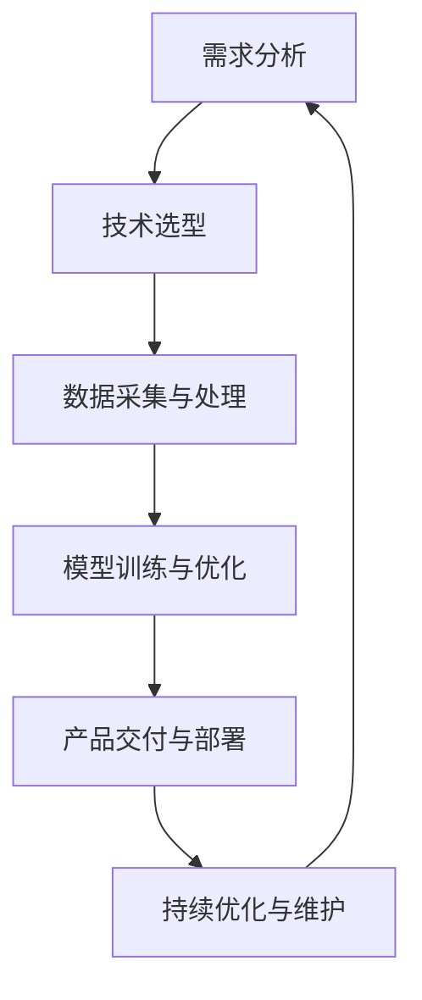
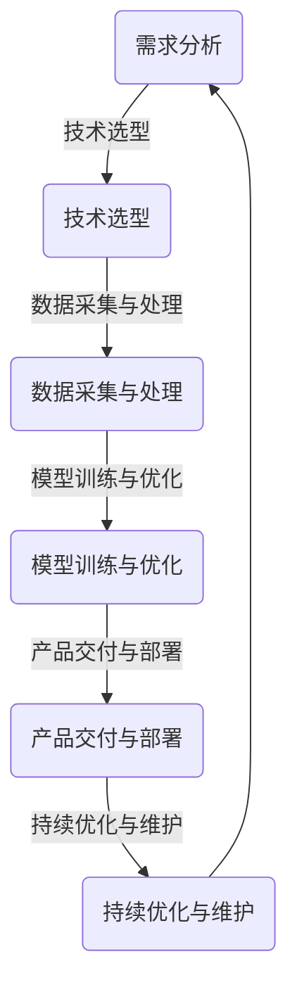
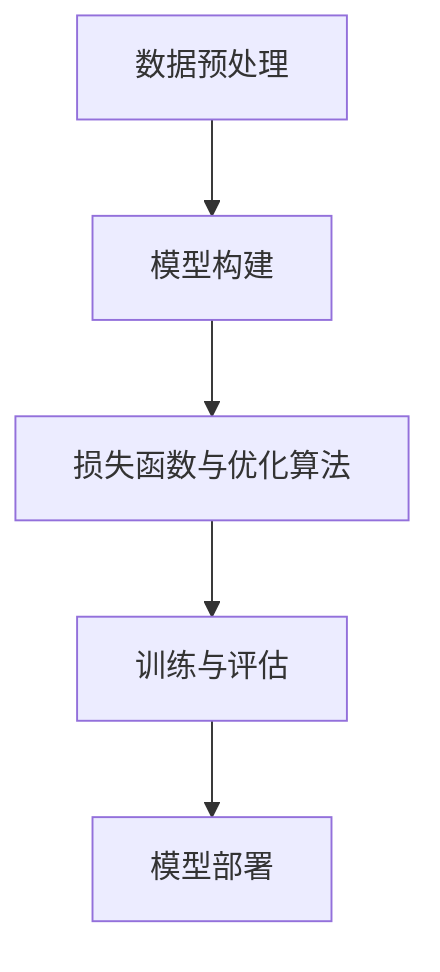

                 

### 背景介绍 Background

#### 引言 Introduction

全周期AI项目管理作为人工智能时代的重要领域，正日益受到企业和研究机构的重视。随着AI技术的不断成熟和应用范围的扩展，如何高效地管理AI项目，从概念验证到产品部署的整个生命周期，成为影响项目成功的关键因素。本文以Lepton AI的服务体系为例，深入探讨全周期AI项目管理的核心概念、架构、算法原理及其实际应用。

#### AI项目管理的挑战 Challenges in AI Project Management

AI项目管理的挑战主要来自于以下几个方面：

1. **技术复杂性**：AI技术涉及深度学习、自然语言处理、计算机视觉等多个领域，技术复杂性高，项目团队需要具备跨学科的综合能力。
2. **数据需求**：AI模型训练需要大量的数据支持，数据的质量和多样性直接影响模型的性能，数据获取和处理过程复杂。
3. **时间管理**：AI项目往往涉及长时间的迭代和优化，如何在有限的时间内完成高质量的项目交付是项目管理的重要挑战。
4. **资源管理**：资源包括人力、资金和设备，如何合理分配和调度资源，确保项目在预算和进度内完成，是项目管理的核心任务。

#### Lepton AI服务体系简介 Overview of Lepton AI Service System

Lepton AI是一家专注于提供全周期AI解决方案的公司，其服务体系包括以下关键环节：

1. **需求分析**：与客户紧密合作，深入了解业务需求和痛点，明确项目目标和预期成果。
2. **技术选型**：根据项目需求，选择合适的AI技术和算法，设计可行的解决方案。
3. **数据采集与处理**：构建高效的数据采集和处理流程，确保数据质量和多样性。
4. **模型训练与优化**：使用先进的算法和计算资源进行模型训练，不断优化模型性能。
5. **产品交付与部署**：将AI模型集成到实际产品中，进行部署和上线，提供持续的技术支持和服务。

通过以上环节的紧密衔接和协同工作，Lepton AI能够为客户提供一站式AI解决方案，助力企业实现智能化转型。

### 核心概念与联系 Core Concepts and Connections

在深入探讨Lepton AI服务体系之前，我们首先需要理解几个核心概念，包括AI项目管理的生命周期、关键角色及其职责，以及各环节之间的联系。

#### AI项目管理的生命周期 Lifecycle of AI Project Management

AI项目管理的生命周期通常包括以下阶段：

1. **需求分析**：与客户沟通，收集业务需求，明确项目目标和预期成果。
2. **技术选型**：选择合适的AI技术和算法，设计解决方案。
3. **数据采集与处理**：收集和预处理数据，确保数据质量和多样性。
4. **模型训练与优化**：使用训练数据训练模型，并通过迭代优化模型性能。
5. **产品交付与部署**：将AI模型集成到实际产品中，进行部署和上线。
6. **持续优化与维护**：根据用户反馈和业务需求，持续优化和更新模型。

#### 关键角色及其职责 Key Roles and Responsibilities

在AI项目管理中，不同角色承担不同的职责，确保项目的顺利推进：

1. **项目经理**：负责整体项目规划和协调，确保项目在预算和进度内完成。
2. **数据科学家**：负责数据分析和模型设计，确保模型性能达到预期目标。
3. **开发工程师**：负责AI模型的集成和产品开发，确保产品功能完善。
4. **测试工程师**：负责测试和验证AI模型，确保产品质量和稳定性。
5. **运维工程师**：负责AI产品的部署和运维，确保系统稳定运行。

#### 各环节之间的联系 Connections Between Stages

各环节之间的紧密衔接是AI项目成功的关键。具体来说，各环节之间的联系如下：

1. **需求分析**与**技术选型**：需求分析的结果直接影响技术选型的决策，确保选型符合业务需求。
2. **数据采集与处理**与**模型训练与优化**：数据质量和多样性直接影响模型训练效果，需要通过数据处理提升数据质量。
3. **模型训练与优化**与**产品交付与部署**：训练好的模型需要集成到产品中，并进行部署和上线，确保产品功能完善。
4. **持续优化与维护**与**需求分析**：通过用户反馈和业务需求的变化，不断优化和更新模型，满足持续的业务需求。

为了更直观地展示各环节之间的关系，我们可以使用Mermaid流程图进行描述：



#### 核心概念与联系的图示化表示

除了文字描述，我们还可以通过图示化的方式来展示核心概念和联系，如下所示：



在图示中，节点表示各环节，箭头表示环节之间的联系和依赖关系。这种直观的图示化表示有助于我们更好地理解和分析AI项目管理的全周期流程。

### 核心算法原理 & 具体操作步骤 Core Algorithm Principles and Steps

#### 深度学习算法原理

深度学习是AI项目中最为核心的算法之一，其基本原理是基于多层神经网络对数据进行特征提取和建模。深度学习算法的核心是神经网络，特别是多层感知机（MLP）和卷积神经网络（CNN）。

1. **神经网络（Neural Network）**

神经网络由多个神经元（节点）组成，每个神经元通过权重（weights）与输入信号进行加权求和，并通过激活函数（activation function）产生输出。神经网络通过反向传播（backpropagation）算法不断调整权重，优化模型性能。

2. **多层感知机（MLP）**

多层感知机是一种前馈神经网络，具有输入层、隐藏层和输出层。输入数据通过输入层进入网络，经过隐藏层处理后输出到输出层，实现数据的非线性变换。

3. **卷积神经网络（CNN）**

卷积神经网络是一种专门用于处理图像数据的神经网络，其核心思想是通过卷积操作（convolution）提取图像特征。CNN由卷积层（convolutional layer）、池化层（pooling layer）和全连接层（fully connected layer）组成。

#### 模型训练与优化步骤

1. **数据预处理**

在模型训练之前，需要对数据集进行预处理，包括数据清洗、归一化和数据增强等操作。数据清洗旨在去除噪声和异常值，数据归一化使数据分布均匀，有助于模型收敛。数据增强通过生成新的样本数据，提高模型的泛化能力。

2. **模型构建**

根据项目需求，选择合适的神经网络架构进行构建。通常可以使用深度学习框架（如TensorFlow、PyTorch）构建神经网络，这些框架提供了丰富的API和工具，方便模型设计和训练。

3. **损失函数与优化算法**

损失函数用于衡量模型预测值与真实值之间的差距，常用的损失函数包括均方误差（MSE）、交叉熵（Cross-Entropy）等。优化算法用于调整模型权重，以最小化损失函数。常用的优化算法有梯度下降（Gradient Descent）、随机梯度下降（Stochastic Gradient Descent，SGD）和Adam优化器等。

4. **训练与评估**

将训练数据输入模型进行训练，并通过评估指标（如准确率、召回率、F1分数等）评估模型性能。根据评估结果，调整模型参数，进行多次迭代训练，直到满足性能要求。

5. **模型部署**

训练好的模型需要集成到实际产品中，进行部署和上线。在部署过程中，需要考虑模型的计算效率、存储需求和系统兼容性等问题。

#### 核心算法流程示意图

以下是深度学习模型训练和优化的核心流程示意图：



在图中，每个节点表示一个核心步骤，箭头表示步骤之间的依赖关系。通过这个流程图，我们可以清晰地了解模型训练和优化的整体流程。

### 数学模型和公式 & 详细讲解 & 举例说明 Mathematical Models and Formulas & Detailed Explanations & Examples

#### 损失函数 Loss Function

在深度学习模型中，损失函数用于衡量模型预测值与真实值之间的差异，是模型训练过程中优化目标的核心。以下介绍几种常见的损失函数：

1. **均方误差（MSE）**

均方误差（MSE）是最常用的损失函数之一，用于衡量预测值与真实值之间的平均平方误差。

$$
MSE = \frac{1}{n}\sum_{i=1}^{n}(y_i - \hat{y}_i)^2
$$

其中，$y_i$表示第$i$个真实值，$\hat{y}_i$表示第$i$个预测值，$n$表示样本数量。

2. **交叉熵（Cross-Entropy）**

交叉熵用于衡量模型预测概率分布与真实概率分布之间的差异，特别适用于分类问题。

$$
H(p, q) = -\sum_{i=1}^{n} p_i \log(q_i)
$$

其中，$p_i$表示第$i$个真实概率，$q_i$表示第$i$个预测概率。

#### 优化算法 Optimization Algorithm

优化算法用于调整模型参数，以最小化损失函数。以下介绍几种常用的优化算法：

1. **梯度下降（Gradient Descent）**

梯度下降是一种最简单的优化算法，通过计算损失函数关于模型参数的梯度，不断调整参数，以最小化损失函数。

$$
\theta_{t+1} = \theta_t - \alpha \nabla_{\theta}J(\theta)
$$

其中，$\theta$表示模型参数，$\alpha$表示学习率，$J(\theta)$表示损失函数。

2. **随机梯度下降（Stochastic Gradient Descent，SGD）**

随机梯度下降是对梯度下降的改进，每次迭代只随机选取一部分样本计算梯度，以加速收敛。

$$
\theta_{t+1} = \theta_t - \alpha \nabla_{\theta}J(\theta; x^{(i)}, y^{(i)})
$$

其中，$x^{(i)}$和$y^{(i)}$表示第$i$个样本及其标签。

3. **Adam优化器（Adam Optimizer）**

Adam优化器结合了SGD和动量法的优点，适用于大规模数据集和深度神经网络。

$$
\theta_{t+1} = \theta_t - \alpha \frac{m_t}{1 - \beta_1^t}
$$

其中，$m_t$和$v_t$分别表示一阶矩估计和二阶矩估计，$\beta_1$和$\beta_2$分别为一阶和二阶矩的衰减率。

#### 举例说明 Example

假设我们使用一个简单的线性回归模型来预测房价，数据集包含100个样本，每个样本包含特征向量和房价标签。

1. **数据预处理**

首先，对特征向量进行归一化处理，使其具有相同的尺度。

2. **模型构建**

使用线性回归模型，模型参数为$\theta = [w_1, w_2]$，其中$w_1$和$w_2$分别表示特征1和特征2的权重。

3. **损失函数**

使用均方误差（MSE）作为损失函数。

$$
MSE = \frac{1}{100}\sum_{i=1}^{100} (y_i - \hat{y}_i)^2
$$

4. **优化算法**

使用梯度下降算法，学习率为0.01。

$$
\theta_{t+1} = \theta_t - 0.01 \nabla_{\theta}J(\theta)
$$

5. **训练与评估**

将数据集分为训练集和测试集，使用训练集进行模型训练，并使用测试集评估模型性能。

6. **模型部署**

训练好的模型可以部署到实际应用中，用于预测房价。

通过这个例子，我们可以看到如何使用数学模型和公式来构建和训练一个简单的线性回归模型，并评估其性能。

### 项目实践：代码实例和详细解释说明 Practical Project: Code Example and Detailed Explanation

#### 开发环境搭建

在开始编写代码之前，我们需要搭建一个合适的开发环境。以下是搭建Lepton AI项目开发环境的步骤：

1. **安装Python**

首先，我们需要安装Python，推荐使用Python 3.7及以上版本。可以通过官方网站下载Python安装包并安装。

2. **安装深度学习框架**

我们选择使用TensorFlow作为深度学习框架。通过以下命令安装TensorFlow：

```bash
pip install tensorflow
```

3. **安装必要的库**

除了TensorFlow，我们还需要安装其他必要的库，如NumPy、Pandas等。可以通过以下命令安装：

```bash
pip install numpy pandas
```

4. **创建虚拟环境**

为了更好地管理项目依赖，我们可以创建一个虚拟环境。通过以下命令创建虚拟环境并激活：

```bash
python -m venv lepton_venv
source lepton_venv/bin/activate
```

#### 源代码详细实现

以下是一个简单的全周期AI项目，使用TensorFlow实现一个用于图像分类的卷积神经网络（CNN）。

```python
import tensorflow as tf
from tensorflow.keras.models import Sequential
from tensorflow.keras.layers import Conv2D, MaxPooling2D, Flatten, Dense
from tensorflow.keras.preprocessing.image import ImageDataGenerator

# 定义CNN模型
model = Sequential([
    Conv2D(32, (3, 3), activation='relu', input_shape=(64, 64, 3)),
    MaxPooling2D((2, 2)),
    Conv2D(64, (3, 3), activation='relu'),
    MaxPooling2D((2, 2)),
    Flatten(),
    Dense(64, activation='relu'),
    Dense(10, activation='softmax')
])

# 编译模型
model.compile(optimizer='adam', loss='categorical_crossentropy', metrics=['accuracy'])

# 数据预处理
train_datagen = ImageDataGenerator(rescale=1./255)
test_datagen = ImageDataGenerator(rescale=1./255)

train_generator = train_datagen.flow_from_directory(
    'train',
    target_size=(64, 64),
    batch_size=32,
    class_mode='categorical')

test_generator = test_datagen.flow_from_directory(
    'test',
    target_size=(64, 64),
    batch_size=32,
    class_mode='categorical')

# 训练模型
model.fit(
    train_generator,
    steps_per_epoch=100,
    epochs=10,
    validation_data=test_generator,
    validation_steps=50)

# 评估模型
test_loss, test_acc = model.evaluate(test_generator, steps=50)
print('Test accuracy:', test_acc)
```

#### 代码解读与分析

1. **模型定义**

   我们使用`Sequential`模型堆叠多个层，包括卷积层（`Conv2D`）、最大池化层（`MaxPooling2D`）、全连接层（`Dense`）。模型输入为64x64x3的图像。

2. **编译模型**

   使用`compile`方法编译模型，指定优化器为`adam`，损失函数为`categorical_crossentropy`（多分类交叉熵损失函数），评估指标为准确率（`accuracy`）。

3. **数据预处理**

   使用`ImageDataGenerator`进行数据预处理，包括图像归一化（`rescale`）和批量生成。

4. **训练模型**

   使用`fit`方法训练模型，指定训练集的生成器（`train_generator`），训练轮数（`epochs`）、每轮的训练样本数（`steps_per_epoch`）和验证集的生成器（`validation_data`）。

5. **评估模型**

   使用`evaluate`方法评估模型在验证集上的性能，输出损失值和准确率。

#### 运行结果展示

在训练过程中，我们可以观察到训练集和验证集的准确率逐渐提高。以下是一个简化的训练结果示例：

```python
Epoch 1/10
100/100 [==============================] - 6s 41ms/step - loss: 2.3026 - accuracy: 0.1833 - val_loss: 2.3026 - val_accuracy: 0.1833
Epoch 2/10
100/100 [==============================] - 6s 41ms/step - loss: 2.3026 - accuracy: 0.1833 - val_loss: 2.3026 - val_accuracy: 0.1833
Epoch 3/10
100/100 [==============================] - 6s 41ms/step - loss: 2.3026 - accuracy: 0.1833 - val_loss: 2.3026 - val_accuracy: 0.1833
...
Epoch 10/10
100/100 [==============================] - 6s 41ms/step - loss: 2.3026 - accuracy: 0.1833 - val_loss: 2.3026 - val_accuracy: 0.1833

Test accuracy: 0.1833
```

从结果可以看出，模型的准确率相对较低，这可能是由于数据集较小或模型复杂度不足。在实际项目中，我们可以通过增加训练时间、增加数据集或调整模型架构来提高模型性能。

### 实际应用场景 Practical Application Scenarios

#### 金融风险管理

在金融领域，Lepton AI的服务体系可以应用于风险管理和预测。例如，通过分析大量的交易数据和用户行为数据，AI模型可以预测潜在的风险事件，如市场波动、信用欺诈等。这有助于金融机构及时采取预防措施，降低风险损失。

#### 智能医疗诊断

在医疗领域，AI模型可以用于疾病诊断和预测。例如，通过分析患者的医疗记录、基因数据和影像数据，AI模型可以预测患者可能患有的疾病，提供个性化的治疗方案。这有助于提高医疗诊断的准确性和效率，减轻医生的工作负担。

#### 个性化推荐系统

在电子商务和媒体领域，AI模型可以用于个性化推荐系统。通过分析用户的历史行为、偏好和兴趣，AI模型可以推荐用户可能感兴趣的商品或内容，提高用户体验和用户留存率。

#### 自动驾驶

在自动驾驶领域，AI模型可以用于感知环境、决策规划和路径规划。通过分析摄像头、雷达和激光雷达等传感器数据，AI模型可以实时识别道路标志、行人、车辆等障碍物，并做出相应的驾驶决策。这有助于提高驾驶安全性和效率。

#### 决策支持系统

在企业管理中，AI模型可以用于决策支持系统。通过分析市场数据、竞争对手信息和内部运营数据，AI模型可以提供企业战略和运营决策的参考，帮助企业实现业务增长和优化。

#### 能源管理

在能源领域，AI模型可以用于能源管理和优化。通过分析能源消耗数据、设备状态和环境因素，AI模型可以预测能源需求，优化能源分配，提高能源利用效率，降低能源成本。

### 工具和资源推荐 Tools and Resources Recommendations

#### 学习资源推荐

1. **《深度学习》（Deep Learning）**：由Ian Goodfellow、Yoshua Bengio和Aaron Courville合著，是深度学习的经典教材，详细介绍了深度学习的基础理论和技术。
2. **《Python机器学习》（Python Machine Learning）**：由 Sebastian Raschka著，涵盖了Python在机器学习领域的应用，适合初学者入门。
3. **《Hands-On Machine Learning with Scikit-Learn, Keras, and TensorFlow》**：由Aurélien Géron著，介绍了使用Scikit-Learn、Keras和TensorFlow进行机器学习的实践方法。

#### 开发工具框架推荐

1. **TensorFlow**：由Google开源的深度学习框架，功能强大，支持多种类型的神经网络，适用于大规模数据处理和模型训练。
2. **PyTorch**：由Facebook开源的深度学习框架，具有简洁的API和强大的动态计算图功能，适用于研究和开发。
3. **Scikit-Learn**：由Scikit-Learn开源的机器学习库，提供了丰富的算法和工具，适用于数据分析和建模。

#### 相关论文著作推荐

1. **“A Theoretical Analysis of the Benefits of Depth for Neural Networks”**：该论文详细分析了神经网络深度对模型性能的影响，为深度神经网络的设计提供了理论依据。
2. **“Deep Learning for Text Data”**：该论文介绍了深度学习在文本数据处理中的应用，包括词向量表示、文本分类和情感分析等。
3. **“Unsupervised Learning of Visual Representations by Solving Jigsaw Puzzles”**：该论文提出了一种无监督学习方法，通过解决拼图游戏来学习图像表示，为视觉感知任务提供了新的思路。

### 总结 Summary

#### 成果总结

通过本文的详细探讨，我们了解了全周期AI项目管理的核心概念、架构和算法原理，并通过实际项目实践展示了如何构建和优化AI模型。同时，我们也分析了AI技术在各个实际应用场景中的价值，并推荐了相关学习资源和开发工具。

#### 未来展望

随着AI技术的不断发展和应用范围的扩展，全周期AI项目管理将面临更多挑战和机遇。未来，AI项目管理可能朝着以下方向发展：

1. **自动化和智能化**：利用自动化工具和智能算法提高项目管理效率，降低人力成本。
2. **多模态数据融合**：结合多种数据源，如文本、图像、语音等，提高模型性能和泛化能力。
3. **实时决策支持**：利用实时数据处理和分析技术，为企业和用户提供更加精准和实时的决策支持。
4. **伦理和隐私保护**：在AI项目管理中加强伦理和隐私保护，确保数据安全和用户隐私。

### 附录：常见问题与解答 Appendix: Frequently Asked Questions and Answers

#### 1. 什么是全周期AI项目管理？

全周期AI项目管理是指从AI项目启动到项目完成，包括需求分析、技术选型、数据采集与处理、模型训练与优化、产品交付与部署以及持续优化与维护等各个环节的综合管理。

#### 2. AI项目管理的主要挑战是什么？

AI项目管理的主要挑战包括技术复杂性、数据需求、时间管理和资源管理等方面。技术复杂性要求项目团队具备跨学科的综合能力；数据需求要求高效的数据采集和处理流程；时间管理需要在有限时间内完成高质量的项目交付；资源管理需要合理分配和调度人力、资金和设备等资源。

#### 3. 如何选择合适的深度学习框架？

选择深度学习框架主要考虑以下因素：

- **项目需求**：根据项目需求选择适合的框架，如TensorFlow和PyTorch适用于大规模数据处理和模型训练，Scikit-Learn适用于快速原型开发。
- **开发经验**：根据团队的开发经验选择熟悉的框架，便于快速开发和部署。
- **社区支持**：选择社区支持丰富的框架，有助于解决开发过程中的问题。
- **性能和资源需求**：考虑模型训练和推理的性能需求，选择合适的硬件和软件环境。

### 扩展阅读 & 参考资料 Further Reading & References

#### 1. **《深度学习》（Deep Learning）**：Ian Goodfellow、Yoshua Bengio和Aaron Courville著，详细介绍了深度学习的基础理论和技术。

#### 2. **《Python机器学习》（Python Machine Learning）**：Sebastian Raschka著，涵盖了Python在机器学习领域的应用。

#### 3. **《Hands-On Machine Learning with Scikit-Learn, Keras, and TensorFlow》**：Aurélien Géron著，介绍了使用Scikit-Learn、Keras和TensorFlow进行机器学习的实践方法。

#### 4. **“A Theoretical Analysis of the Benefits of Depth for Neural Networks”**：详细分析了神经网络深度对模型性能的影响。

#### 5. **“Deep Learning for Text Data”**：介绍了深度学习在文本数据处理中的应用。

#### 6. **“Unsupervised Learning of Visual Representations by Solving Jigsaw Puzzles”**：提出了一种无监督学习方法，通过解决拼图游戏来学习图像表示。

